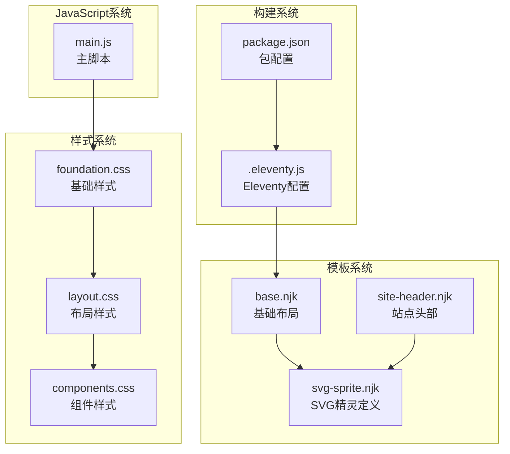
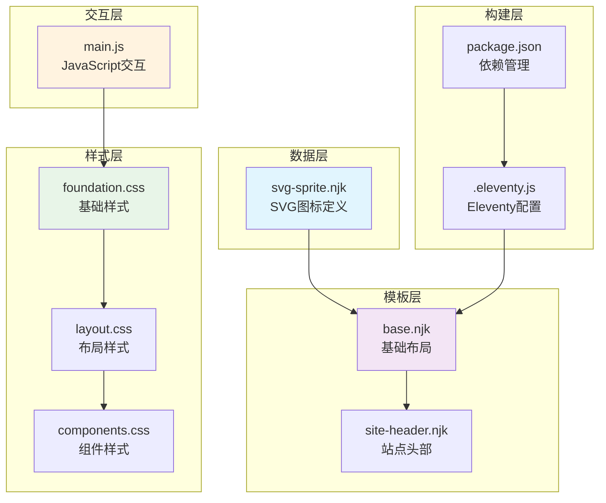
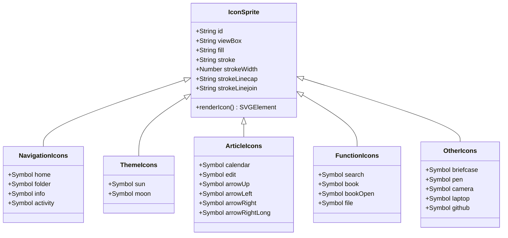
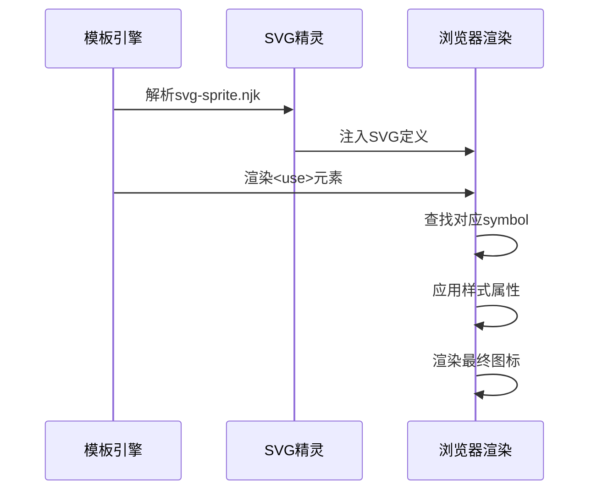
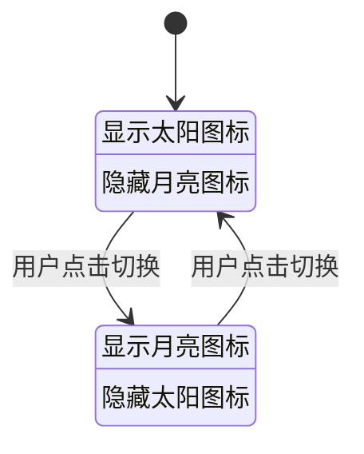

# SVG精灵图标系统

<cite>
**本文档引用的文件**
- [svg-sprite.njk](file://src/_includes/partials/svg-sprite.njk)
- [base.njk](file://src/_includes/layouts/base.njk)
- [site-header.njk](file://src/_includes/partials/site-header.njk)
- [main.js](file://src/assets/js/main.js)
- [.eleventy.js](file://.eleventy.js)
- [foundation.css](file://src/assets/css/foundation.css)
- [layout.css](file://src/assets/css/layout.css)
- [components.css](file://src/assets/css/components.css)
- [style.css](file://src/assets/css/style.css)
- [package.json](file://package.json)
</cite>

## 目录
1. [简介](#简介)
2. [项目结构](#项目结构)
3. [核心组件](#核心组件)
4. [架构概览](#架构概览)
5. [详细组件分析](#详细组件分析)
6. [依赖关系分析](#依赖关系分析)
7. [性能考虑](#性能考虑)
8. [故障排除指南](#故障排除指南)
9. [结论](#结论)

## 简介

SVG精灵图标系统是本项目中用于统一管理和使用SVG图标的基础设施。该系统采用SVG Sprite技术，将所有图标定义在一个单一的SVG文件中，通过`<use>`元素进行引用，实现了图标资源的集中管理、缓存优化和主题适配。

该系统为导航菜单、主题切换、文章页面等功能模块提供了一致的图标体验，支持响应式设计和暗黑模式切换，确保在不同设备和主题环境下都能提供优质的视觉效果。

## 项目结构

SVG精灵图标系统在项目中的组织结构如下：



**图表来源**
- [base.njk:1-22](file://src/_includes/layouts/base.njk#L1-L22)
- [svg-sprite.njk:1-127](file://src/_includes/partials/svg-sprite.njk#L1-L127)
- [site-header.njk:1-44](file://src/_includes/partials/site-header.njk#L1-L44)

**章节来源**
- [base.njk:1-22](file://src/_includes/layouts/base.njk#L1-L22)
- [svg-sprite.njk:1-127](file://src/_includes/partials/svg-sprite.njk#L1-L127)
- [site-header.njk:1-44](file://src/_includes/partials/site-header.njk#L1-L44)

## 核心组件

### SVG精灵定义组件

SVG精灵系统的核心是`svg-sprite.njk`文件，它包含了所有可用的图标定义：

**导航图标系列**：包含首页、文件夹、信息等基础导航图标
**主题切换图标**：太阳和月亮图标，支持明暗主题切换
**文章页面图标**：日历、编辑、箭头等文章相关图标
**功能图标**：搜索、书籍、文件等通用功能图标
**其他功能图标**：简历、笔、相机、笔记本电脑、GitHub等专业图标

每个图标都定义了标准的24x24视口坐标系，使用`currentColor`作为描边颜色，确保与主题颜色自动同步。

**章节来源**
- [svg-sprite.njk:1-127](file://src/_includes/partials/svg-sprite.njk#L1-L127)

### 基础布局集成

基础布局文件负责将SVG精灵集成到整个应用中：

- 在HTML文档头部包含SVG精灵定义
- 确保所有页面共享相同的图标资源
- 支持全局样式和主题切换功能

**章节来源**
- [base.njk:1-22](file://src/_includes/layouts/base.njk#L1-L22)

### 头部导航集成

站点头部通过`<use>`元素引用特定图标：

- 首页链接使用home图标
- 分类页面使用folder图标  
- 服务页面使用info图标
- 主题切换按钮使用sun和moon图标

这种设计确保了图标的统一性和可维护性。

**章节来源**
- [site-header.njk:1-44](file://src/_includes/partials/site-header.njk#L1-L44)

## 架构概览

SVG精灵图标系统的整体架构采用分层设计：



**图表来源**
- [svg-sprite.njk:1-127](file://src/_includes/partials/svg-sprite.njk#L1-L127)
- [base.njk:1-22](file://src/_includes/layouts/base.njk#L1-L22)
- [site-header.njk:1-44](file://src/_includes/partials/site-header.njk#L1-L44)
- [foundation.css:1-291](file://src/assets/css/foundation.css#L1-L291)
- [layout.css:1-276](file://src/assets/css/layout.css#L1-L276)
- [components.css:1-319](file://src/assets/css/components.css#L1-L319)
- [main.js:1-800](file://src/assets/js/main.js#L1-L800)
- [.eleventy.js:1-146](file://.eleventy.js#L1-L146)
- [package.json:1-37](file://package.json#L1-L37)

## 详细组件分析

### SVG精灵定义系统

SVG精灵系统采用标准的SVG `<symbol>` 元素定义图标，每个图标具有以下特征：



**图表来源**
- [svg-sprite.njk:1-127](file://src/_includes/partials/svg-sprite.njk#L1-L127)

#### 图标渲染流程



**图表来源**
- [svg-sprite.njk:1-127](file://src/_includes/partials/svg-sprite.njk#L1-L127)
- [site-header.njk:1-44](file://src/_includes/partials/site-header.njk#L1-L44)

**章节来源**
- [svg-sprite.njk:1-127](file://src/_includes/partials/svg-sprite.njk#L1-L127)

### 样式系统集成

SVG图标在样式系统中的集成采用了多层设计：

#### 基础样式配置

基础样式文件定义了SVG图标的全局渲染规则：

- `shape-rendering: geometricPrecision` 确保几何图形的精确渲染
- `vertical-align: middle` 实现图标与文本的垂直居中对齐
- `display: inline-block` 提供更好的布局控制
- `pointer-events: none` 允许点击事件穿透到父元素

#### 主题适配机制

样式系统支持明暗两种主题模式：

```mermaid
flowchart TD
A[用户切换主题] --> B{当前主题状态}
B --> |暗色模式| C[切换到[data-theme="dark"]]
B --> |亮色模式| D[切换到[data-theme="light"]]
C --> E[更新图标颜色变量]
D --> E
E --> F[重新渲染SVG图标]
F --> G[应用新的颜色方案]
```

**图表来源**
- [foundation.css:1-291](file://src/assets/css/foundation.css#L1-L291)
- [layout.css:1-276](file://src/assets/css/layout.css#L1-L276)

**章节来源**
- [foundation.css:1-291](file://src/assets/css/foundation.css#L1-L291)
- [layout.css:1-276](file://src/assets/css/layout.css#L1-L276)

### JavaScript交互支持

主脚本文件提供了完整的SVG图标交互支持：

#### 主题切换功能

主题切换按钮使用两个SVG图标（太阳和月亮）实现明暗模式切换：



**图表来源**
- [site-header.njk:36-40](file://src/_includes/partials/site-header.njk#L36-L40)
- [layout.css:89-108](file://src/assets/css/layout.css#L89-L108)

#### 响应式布局适配

JavaScript代码确保SVG图标在不同屏幕尺寸下的正确显示：

- 自适应图标大小和间距
- 处理移动端触摸事件
- 支持键盘导航和无障碍访问

**章节来源**
- [main.js:1-800](file://src/assets/js/main.js#L1-L800)
- [site-header.njk:1-44](file://src/_includes/partials/site-header.njk#L1-L44)

## 依赖关系分析

SVG精灵图标系统的依赖关系呈现层次化结构：

```mermaid
graph LR
subgraph "外部依赖"
A[@11ty/eleventy<br/>静态站点生成器]
B[markdown-it<br/>Markdown解析器]
C[Prism.js<br/>语法高亮]
end
subgraph "内部模块"
D[svg-sprite.njk<br/>图标定义]
E[base.njk<br/>基础布局]
F[site-header.njk<br/>站点头部]
G[foundation.css<br/>基础样式]
H[layout.css<br/>布局样式]
I[components.css<br/>组件样式]
J[main.js<br/>主脚本]
end
K[.eleventy.js<br/>配置文件]
L[package.json<br/>包管理]
A --> K
B --> K
C --> K
K --> D
K --> E
K --> F
K --> G
K --> H
K --> I
K --> J
L --> A
L --> B
L --> C
style A fill:#ffebee
style D fill:#e8f5e8
style G fill:#e3f2fd
style K fill:#f3e5f5
```

**图表来源**
- [.eleventy.js:1-146](file://.eleventy.js#L1-L146)
- [package.json:1-37](file://package.json#L1-L37)
- [svg-sprite.njk:1-127](file://src/_includes/partials/svg-sprite.njk#L1-L127)
- [base.njk:1-22](file://src/_includes/layouts/base.njk#L1-L22)
- [site-header.njk:1-44](file://src/_includes/partials/site-header.njk#L1-L44)

### 构建流程依赖

构建系统通过Eleventy配置文件管理所有依赖关系：

- Eleventy插件注册和配置
- Markdown解析器链配置
- 全局数据计算和处理
- 文件路径和输出配置

**章节来源**
- [.eleventy.js:1-146](file://.eleventy.js#L1-L146)
- [package.json:1-37](file://package.json#L1-L37)

## 性能考虑

SVG精灵图标系统在性能方面采用了多项优化策略：

### 资源优化

- **单文件加载**：所有图标集中在单一SVG文件中，减少HTTP请求
- **缓存友好**：SVG文件可长期缓存，提高重复访问速度
- **按需渲染**：只渲染实际使用的图标，避免不必要的DOM节点

### 渲染优化

- **硬件加速**：SVG图形利用GPU加速渲染
- **内存效率**：精灵图避免重复创建相同图形对象
- **网络传输**：压缩后的SVG文件体积小，传输速度快

### 主题切换性能

- **CSS变量驱动**：通过CSS变量实现主题切换，避免重绘
- **批量更新**：主题切换时一次性更新所有相关样式
- **无闪烁效果**：平滑的主题过渡动画

## 故障排除指南

### 常见问题及解决方案

#### 图标不显示问题

**症状**：SVG图标无法正常显示
**可能原因**：
- SVG精灵文件未正确包含
- `<use>`元素的href属性错误
- CSS样式冲突导致图标被隐藏

**解决步骤**：
1. 检查基础布局是否包含SVG精灵定义
2. 验证`<use>`元素的href属性是否正确
3. 确认CSS样式没有设置`display: none`

#### 主题切换失效

**症状**：明暗主题切换按钮无反应
**可能原因**：
- JavaScript文件加载失败
- 主题切换逻辑错误
- CSS变量未正确更新

**解决步骤**：
1. 检查JavaScript控制台是否有错误
2. 验证主题切换按钮的事件绑定
3. 确认CSS变量的更新逻辑

#### 响应式显示异常

**症状**：图标在移动设备上显示不正确
**可能原因**：
- CSS媒体查询配置错误
- 图标尺寸设置不当
- 触摸事件处理问题

**解决步骤**：
1. 检查移动端CSS样式
2. 验证图标的响应式尺寸
3. 测试触摸手势响应

**章节来源**
- [svg-sprite.njk:1-127](file://src/_includes/partials/svg-sprite.njk#L1-L127)
- [site-header.njk:1-44](file://src/_includes/partials/site-header.njk#L1-L44)
- [main.js:1-800](file://src/assets/js/main.js#L1-L800)

## 结论

SVG精灵图标系统通过标准化的设计和实现，为整个项目提供了统一、高效、可维护的图标解决方案。该系统的主要优势包括：

**技术优势**：
- 集中化的图标管理，便于维护和更新
- 高性能的渲染机制，支持流畅的主题切换
- 完善的响应式设计，适配各种设备环境

**用户体验优势**：
- 一致的视觉风格和交互体验
- 平滑的主题切换动画
- 良好的可访问性支持

**开发效率优势**：
- 简化的图标使用方式
- 标准化的命名规范
- 完善的错误处理机制

该系统为项目的长期发展奠定了坚实的基础，为后续的功能扩展和维护提供了良好的技术支持。