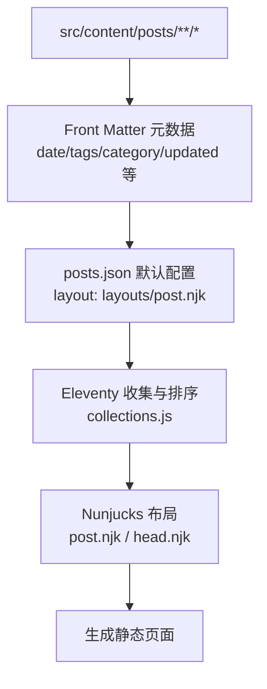
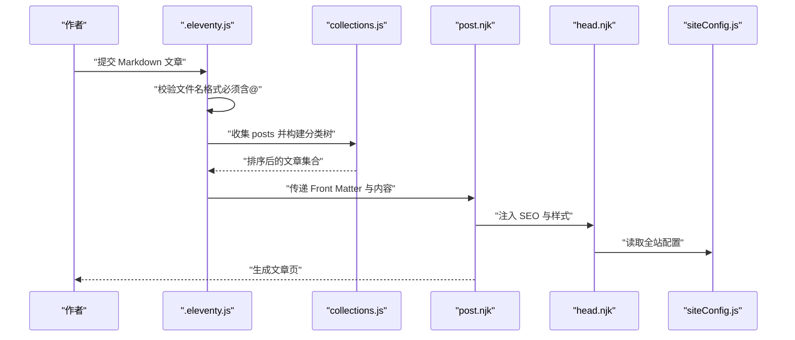
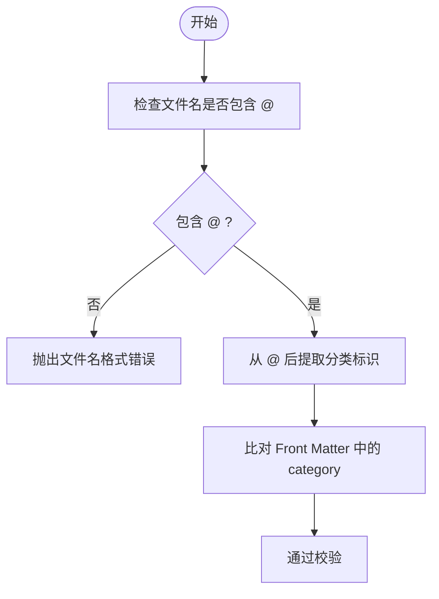
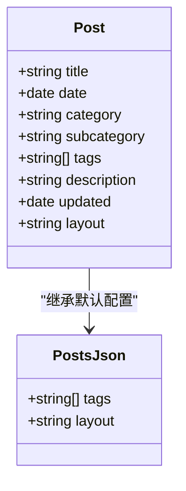
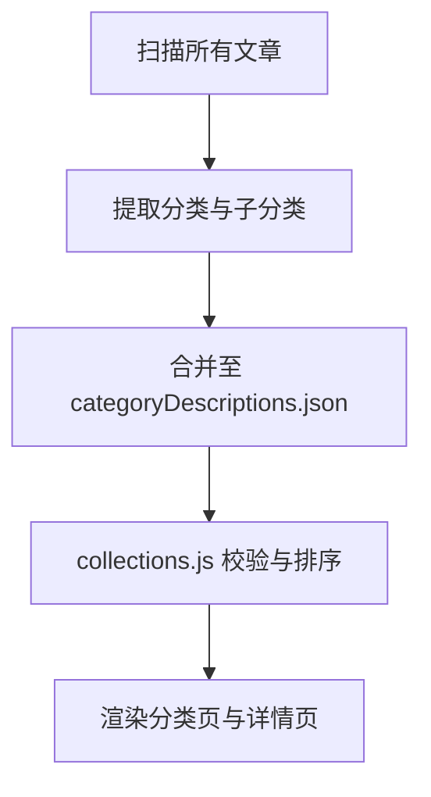
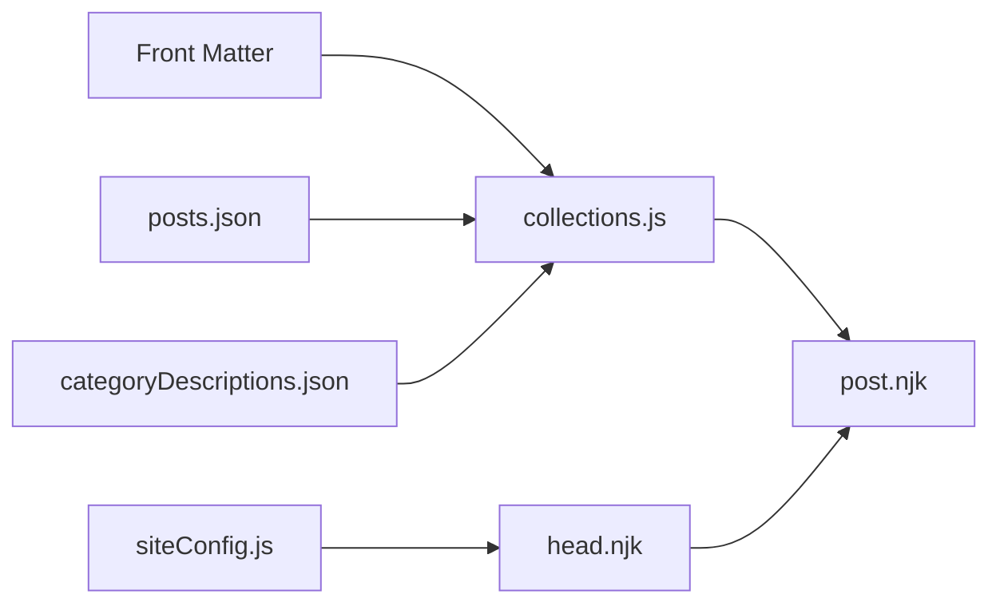

# Markdown写作规范

<cite>
**本文引用的文件**
- [src/content/posts/建站需求篇/建站需求清单：估算更新频率@xfq.md](file://src/content/posts/建站需求篇/建站需求清单：估算更新频率@xfq.md)
- [src/content/posts/方案策划篇/FAQ 页面怎么降低读者顾虑@xfq.md](file://src/content/posts/方案策划篇/FAQ 页面怎么降低读者顾虑@xfq.md)
- [src/content/posts/资源下载/markdown-syntax-test@sxjf.md](file://src/content/posts/资源下载/markdown-syntax-test@sxjf.md)
- [src/_includes/layouts/post.njk](file://src/_includes/layouts/post.njk)
- [src/_includes/partials/head.njk](file://src/_includes/partials/head.njk)
- [src/content/settings/siteConfig.js](file://src/content/settings/siteConfig.js)
- [src/content/posts/posts.json](file://src/content/posts/posts.json)
- [eleventy/config/collections.js](file://eleventy/config/collections.js)
- [scripts/manage-categories.js](file://scripts/manage-categories.js)
- [scripts/sync-category-meta.js](file://scripts/sync-category-meta.js)
- [.eleventy.js](file://.eleventy.js)
- [src/content/pages/archive.11tydata.js](file://src/content/pages/archive.11tydata.js)
</cite>

## 目录
1. [引言](#引言)
2. [项目结构](#项目结构)
3. [核心组件](#核心组件)
4. [架构概览](#架构概览)
5. [详细组件分析](#详细组件分析)
6. [依赖分析](#依赖分析)
7. [性能考虑](#性能考虑)
8. [故障排查指南](#故障排查指南)
9. [结论](#结论)
10. [附录](#附录)

## 引言
本规范面向使用 11ty RainyNight 主题进行内容创作的作者，系统化说明 Markdown 文稿的语法规则、文件命名约定、Front Matter 元数据配置、内容组织最佳实践、特殊标记用法、协作与版本控制工作流。文档中的规则与示例均来自仓库现有内容与配置，确保可落地、可验证。

## 项目结构
- 内容位于 src/content/posts 下，按“主题/子主题”分层组织，便于分类与检索。
- 每篇文章以 Markdown 文件呈现，采用 Front Matter 描述元信息，并通过 posts.json 统一声明默认布局与标签。
- 布局与页面通过 Nunjucks 模板渲染，head.njk 注入 SEO 与样式，post.njk 提供文章页专用结构。
- Eleventy 构建时通过 .eleventy.js 对文章进行校验（含文件名格式），并通过 collections.js 处理分类、排序与元数据。

**图表来源**
- [src/content/posts/建站需求篇/建站需求清单：估算更新频率@xfq.md:1-28](file://src/content/posts/建站需求篇/建站需求清单：估算更新频率@xfq.md#L1-L28)
- [src/content/posts/posts.json:1-6](file://src/content/posts/posts.json#L1-L6)
- [eleventy/config/collections.js:42-343](file://eleventy/config/collections.js#L42-L343)
- [src/_includes/layouts/post.njk:1-49](file://src/_includes/layouts/post.njk#L1-L49)
- [src/_includes/partials/head.njk:1-27](file://src/_includes/partials/head.njk#L1-L27)

**章节来源**
- [src/content/posts/建站需求篇/建站需求清单：估算更新频率@xfq.md:1-28](file://src/content/posts/建站需求篇/建站需求清单：估算更新频率@xfq.md#L1-L28)
- [src/content/posts/posts.json:1-6](file://src/content/posts/posts.json#L1-L6)
- [src/_includes/layouts/post.njk:1-49](file://src/_includes/layouts/post.njk#L1-L49)
- [src/_includes/partials/head.njk:1-27](file://src/_includes/partials/head.njk#L1-L27)
- [eleventy/config/collections.js:42-343](file://eleventy/config/collections.js#L42-L343)

## 核心组件
- Front Matter 元数据：用于声明文章日期、分类、标签、描述、更新时间等，驱动排序、索引与页面渲染。
- 文件命名约定：必须包含“@分类标识”的格式，确保分类与文件名的一致性与可追踪性。
- 布局与模板：post.njk 提供文章页结构，head.njk 注入 SEO 与样式，siteConfig.js 提供全站配置。
- 分类与元数据：collections.js 负责分类树构建、排序与元数据合并；scripts/sync-category-meta.js 与 scripts/manage-categories.js 协助同步与管理分类元信息。

**章节来源**
- [src/content/posts/建站需求篇/建站需求清单：估算更新频率@xfq.md:1-28](file://src/content/posts/建站需求篇/建站需求清单：估算更新频率@xfq.md#L1-L28)
- [src/content/posts/方案策划篇/FAQ 页面怎么降低读者顾虑@xfq.md:1-29](file://src/content/posts/方案策划篇/FAQ 页面怎么降低读者顾虑@xfq.md#L1-L29)
- [src/content/posts/资源下载/markdown-syntax-test@sxjf.md:1-26](file://src/content/posts/资源下载/markdown-syntax-test@sxjf.md#L1-L26)
- [src/content/posts/posts.json:1-6](file://src/content/posts/posts.json#L1-L6)
- [src/_includes/layouts/post.njk:1-49](file://src/_includes/layouts/post.njk#L1-L49)
- [src/_includes/partials/head.njk:1-27](file://src/_includes/partials/head.njk#L1-L27)
- [src/content/settings/siteConfig.js:1-168](file://src/content/settings/siteConfig.js#L1-L168)
- [eleventy/config/collections.js:42-343](file://eleventy/config/collections.js#L42-L343)
- [scripts/sync-category-meta.js:1-84](file://scripts/sync-category-meta.js#L1-L84)
- [scripts/manage-categories.js:42-82](file://scripts/manage-categories.js#L42-L82)
- [.eleventy.js:36-68](file://.eleventy.js#L36-L68)

## 架构概览
下图展示从 Markdown 到最终页面的端到端流程：作者编写 Markdown → Eleventy 校验与收集 → 分类与排序 → Nunjucks 渲染 → 生成静态页面。

**图表来源**
- [.eleventy.js:36-68](file://.eleventy.js#L36-L68)
- [eleventy/config/collections.js:42-343](file://eleventy/config/collections.js#L42-L343)
- [src/_includes/layouts/post.njk:1-49](file://src/_includes/layouts/post.njk#L1-L49)
- [src/_includes/partials/head.njk:1-27](file://src/_includes/partials/head.njk#L1-L27)
- [src/content/settings/siteConfig.js:1-168](file://src/content/settings/siteConfig.js#L1-L168)

## 详细组件分析

### 1) Markdown 语法规则与格式要求
- 标题层级：建议使用 H2 作为正文标题起点，H3/H4 用于子节，保持层级清晰。
- 段落与换行：段落之间留空行；长句内换行不影响显示，建议在句子末尾保留空格或使用段落分隔。
- 列表：使用无序列表组织要点；有序列表用于步骤类内容。
- 引用：使用块级引用突出提示、注意事项或示例说明。
- 链接：优先使用“文本描述 + 完整 URL”的形式；相对链接用于站内跳转。
- 图片：优先使用外链或站内静态资源路径；注意图片尺寸与加载性能。
- 代码：行内代码用反引号包裹；代码块使用三个反引号并标注语言类型，便于语法高亮。
- 表格：用于对比信息或数据罗列；对齐与边框由主题样式统一处理。

**章节来源**
- [src/content/posts/建站需求篇/建站需求清单：估算更新频率@xfq.md:10-24](file://src/content/posts/建站需求篇/建站需求清单：估算更新频率@xfq.md#L10-L24)
- [src/content/posts/方案策划篇/FAQ 页面怎么降低读者顾虑@xfq.md:11-25](file://src/content/posts/方案策划篇/FAQ 页面怎么降低读者顾虑@xfq.md#L11-L25)
- [src/content/posts/资源下载/markdown-syntax-test@sxjf.md:9-25](file://src/content/posts/资源下载/markdown-syntax-test@sxjf.md#L9-L25)

### 2) 文件命名约定
- 必须包含“@分类标识”，格式为“标题@分类标识.md”。该规则由 Eleventy 在构建时强制校验，未满足将抛出错误。
- 分类标识建议使用英文或数字组合，简洁且便于程序解析。
- 中文标题可直接出现在文件名中，但需确保与 Front Matter 的 category 字段一致，便于分类与元数据同步。
- 子分类可通过文件名后缀“@标识”表示，脚本会提取该标识并用于元数据同步。

**图表来源**
- [.eleventy.js:56-68](file://.eleventy.js#L56-L68)
- [scripts/sync-category-meta.js:27-34](file://scripts/sync-category-meta.js#L27-L34)

**章节来源**
- [.eleventy.js:56-68](file://.eleventy.js#L56-L68)
- [scripts/sync-category-meta.js:27-34](file://scripts/sync-category-meta.js#L27-L34)

### 3) Front Matter 元数据配置
- 必填与常用字段：
  - title：文章标题（将用于页面标题与导航）
  - date：文章创建/发布时间（UTC 时间字符串）
  - category：顶级分类（与文件所在目录一致）
  - subcategory：可选，二级分类标识（用于细分子类目）
  - tags：标签数组，默认包含 posts
  - description：页面描述，用于 SEO
  - updated：可选，最后更新日期
- 默认配置：posts.json 统一设置 layout 与 tags，减少重复书写。
- 排序与展示：collections.js 基于 categoryOrder、date、title 进行排序；updated 字段在文章页显示“最后更新”。

**图表来源**
- [src/content/posts/建站需求篇/建站需求清单：估算更新频率@xfq.md:1-8](file://src/content/posts/建站需求篇/建站需求清单：估算更新频率@xfq.md#L1-L8)
- [src/content/posts/方案策划篇/FAQ 页面怎么降低读者顾虑@xfq.md:1-8](file://src/content/posts/方案策划篇/FAQ 页面怎么降低读者顾虑@xfq.md#L1-L8)
- [src/content/posts/posts.json:1-6](file://src/content/posts/posts.json#L1-L6)
- [eleventy/config/collections.js:42-61](file://eleventy/config/collections.js#L42-L61)

**章节来源**
- [src/content/posts/建站需求篇/建站需求清单：估算更新频率@xfq.md:1-8](file://src/content/posts/建站需求篇/建站需求清单：估算更新频率@xfq.md#L1-L8)
- [src/content/posts/方案策划篇/FAQ 页面怎么降低读者顾虑@xfq.md:1-8](file://src/content/posts/方案策划篇/FAQ 页面怎么降低读者顾虑@xfq.md#L1-L8)
- [src/content/posts/posts.json:1-6](file://src/content/posts/posts.json#L1-L6)
- [eleventy/config/collections.js:42-61](file://eleventy/config/collections.js#L42-L61)

### 4) 内容组织最佳实践
- 段落结构：每段聚焦一个要点；段首缩进不必要，保持干净的段落边界。
- 列表使用：要点前使用短横线；多级列表时保持缩进一致。
- 链接与图片：链接应有明确描述；图片需具备替代文本与可访问性属性（如适用）。
- 特殊标记：引用块用于强调；代码块标注语言；表格用于对比数据。
- 导航与可读性：使用标题层级划分内容；在长文末尾提供“返回顶部/返回上页”等交互。

**章节来源**
- [src/content/posts/建站需求篇/建站需求清单：估算更新频率@xfq.md:10-24](file://src/content/posts/建站需求篇/建站需求清单：估算更新频率@xfq.md#L10-L24)
- [src/_includes/layouts/post.njk:10-48](file://src/_includes/layouts/post.njk#L10-L48)

### 5) 分类系统与元数据同步
- 分类来源：文章目录结构与 Front Matter 的 category/subcategory 共同决定分类路径。
- 元数据来源：categoryDescriptions.json 为分类提供描述与子分类映射；collections.js 将其合并到分类节点。
- 同步机制：sync-category-meta.js 扫描文章，自动生成缺失的分类与子分类条目；manage-categories.js 提供分类查询与更新能力。

**图表来源**
- [scripts/sync-category-meta.js:36-84](file://scripts/sync-category-meta.js#L36-L84)
- [eleventy/config/collections.js:123-217](file://eleventy/config/collections.js#L123-L217)
- [scripts/manage-categories.js:42-82](file://scripts/manage-categories.js#L42-L82)

**章节来源**
- [scripts/sync-category-meta.js:36-84](file://scripts/sync-category-meta.js#L36-L84)
- [eleventy/config/collections.js:123-217](file://eleventy/config/collections.js#L123-L217)
- [scripts/manage-categories.js:42-82](file://scripts/manage-categories.js#L42-L82)

### 6) 页面与分页
- 归档页分页：archive.11tydata.js 从 siteConfig.pagination 读取分页大小，生成分页链接。
- 分类页分页：collections.js 使用 siteConfig.pagination.categoryPageSize 控制分类页分页大小。

**章节来源**
- [src/content/pages/archive.11tydata.js:1-22](file://src/content/pages/archive.11tydata.js#L1-L22)
- [src/content/settings/siteConfig.js:40-49](file://src/content/settings/siteConfig.js#L40-L49)
- [eleventy/config/collections.js:219-223](file://eleventy/config/collections.js#L219-L223)

## 依赖分析
- 构建期依赖：.eleventy.js 负责注册插件、过滤器与校验；collections.js 负责内容收集与分类。
- 运行期依赖：post.njk 依赖 head.njk 注入 SEO 与样式；siteConfig.js 提供全站配置。
- 数据依赖：posts.json 为文章提供默认布局与标签；categoryDescriptions.json 为分类提供描述与子分类信息。

**图表来源**
- [src/content/posts/posts.json:1-6](file://src/content/posts/posts.json#L1-L6)
- [eleventy/config/collections.js:42-343](file://eleventy/config/collections.js#L42-L343)
- [src/_includes/layouts/post.njk:1-49](file://src/_includes/layouts/post.njk#L1-L49)
- [src/_includes/partials/head.njk:1-27](file://src/_includes/partials/head.njk#L1-L27)
- [src/content/settings/siteConfig.js:1-168](file://src/content/settings/siteConfig.js#L1-L168)

**章节来源**
- [src/content/posts/posts.json:1-6](file://src/content/posts/posts.json#L1-L6)
- [eleventy/config/collections.js:42-343](file://eleventy/config/collections.js#L42-L343)
- [src/_includes/layouts/post.njk:1-49](file://src/_includes/layouts/post.njk#L1-L49)
- [src/_includes/partials/head.njk:1-27](file://src/_includes/partials/head.njk#L1-L27)
- [src/content/settings/siteConfig.js:1-168](file://src/content/settings/siteConfig.js#L1-L168)

## 性能考虑
- 代码高亮：通过语法高亮插件启用，建议在大段代码处合理分段，避免单块超长代码影响渲染。
- 图片优化：优先使用合适尺寸与格式的图片；外链图片需关注加载性能与可用性。
- 样式与脚本：head.njk 中的样式按需加载，避免不必要的样式阻塞渲染。
- 分页与排序：合理设置分页大小，避免单页内容过多导致内存压力。

## 故障排查指南
- 文件名格式错误：若未包含“@分类标识”，构建时会抛出错误。请修正文件名并确保与 Front Matter 的 category 一致。
- 分类不显示或排序异常：检查 categoryDescriptions.json 是否存在对应分类；确认文章 Front Matter 的 category/subcategory 正确。
- 更新时间未显示：在 Front Matter 中添加 updated 字段，值为日期字符串。
- SEO 标题与描述异常：检查 head.njk 中的 title 与 description 逻辑，确保与 siteConfig.js 配置一致。

**章节来源**
- [.eleventy.js:56-68](file://.eleventy.js#L56-L68)
- [scripts/sync-category-meta.js:36-84](file://scripts/sync-category-meta.js#L36-L84)
- [src/_includes/partials/head.njk:3-4](file://src/_includes/partials/head.njk#L3-L4)
- [src/_includes/layouts/post.njk:18-23](file://src/_includes/layouts/post.njk#L18-L23)

## 结论
本规范基于仓库现有内容与配置，明确了 Markdown 写作的语法规则、文件命名约定、Front Matter 元数据配置、内容组织与特殊标记使用方法，并提供了分类系统、页面与分页、以及故障排查的实操指引。遵循上述规范可确保内容一致性、可维护性与可扩展性。

## 附录
- 实际写作示例可参考以下文件：
  - [建站需求篇/建站需求清单：估算更新频率@xfq.md:1-28](file://src/content/posts/建站需求篇/建站需求清单：估算更新频率@xfq.md#L1-L28)
  - [方案策划篇/FAQ 页面怎么降低读者顾虑@xfq.md:1-29](file://src/content/posts/方案策划篇/FAQ 页面怎么降低读者顾虑@xfq.md#L1-L29)
  - [资源下载/markdown-syntax-test@sxjf.md:1-26](file://src/content/posts/资源下载/markdown-syntax-test@sxjf.md#L1-L26)
- 分类与元数据：
  - [collections.js（分类与排序）:42-343](file://eleventy/config/collections.js#L42-L343)
  - [sync-category-meta.js（元数据同步）:36-84](file://scripts/sync-category-meta.js#L36-L84)
  - [manage-categories.js（分类管理）:42-82](file://scripts/manage-categories.js#L42-L82)
- 页面与配置：
  - [post.njk（文章布局）:1-49](file://src/_includes/layouts/post.njk#L1-L49)
  - [head.njk（SEO 与样式）:1-27](file://src/_includes/partials/head.njk#L1-L27)
  - [siteConfig.js（全站配置）:1-168](file://src/content/settings/siteConfig.js#L1-L168)
  - [archive.11tydata.js（归档分页）:1-22](file://src/content/pages/archive.11tydata.js#L1-L22)
  - [posts.json（默认配置）:1-6](file://src/content/posts/posts.json#L1-L6)
  - [.eleventy.js（构建校验）:36-68](file://.eleventy.js#L36-L68)