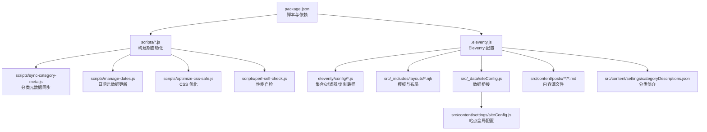
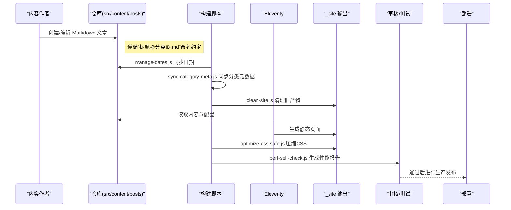
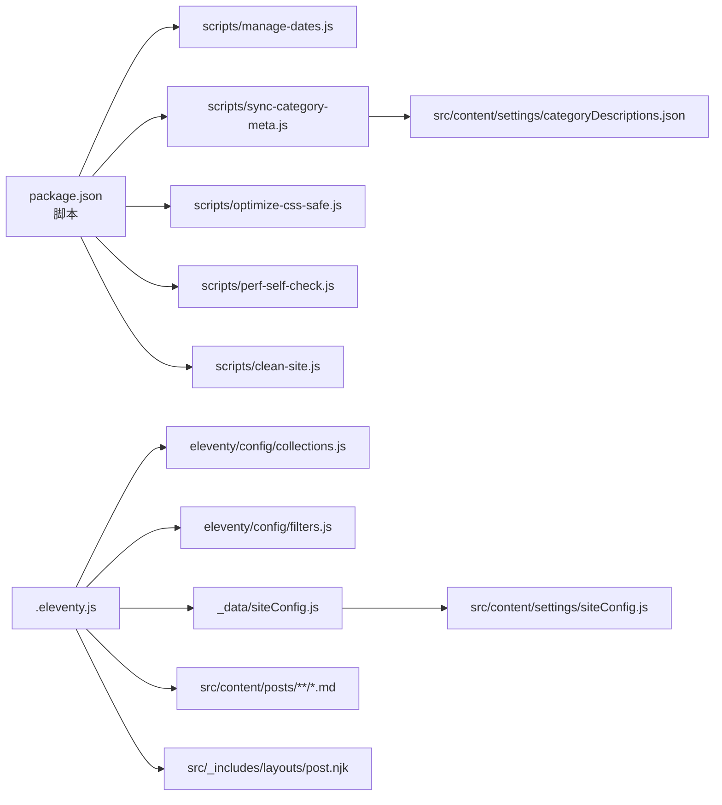

# 内容发布流程

<cite>
**本文引用的文件**
- [package.json](file://package.json)
- [.eleventy.js](file://.eleventy.js)
- [README.md](file://README.md)
- [scripts/clean-site.js](file://scripts/clean-site.js)
- [scripts/manage-dates.js](file://scripts/manage-dates.js)
- [scripts/sync-category-meta.js](file://scripts/sync-category-meta.js)
- [scripts/optimize-css-safe.js](file://scripts/optimize-css-safe.js)
- [scripts/perf-self-check.js](file://scripts/perf-self-check.js)
- [src/_data/siteConfig.js](file://src/_data/siteConfig.js)
- [src/content/settings/siteConfig.js](file://src/content/settings/siteConfig.js)
- [src/content/settings/categoryDescriptions.json](file://src/content/settings/categoryDescriptions.json)
- [src/content/posts/posts.json](file://src/content/posts/posts.json)
- [src/_includes/layouts/post.njk](file://src/_includes/layouts/post.njk)
- [eleventy/config/collections.js](file://eleventy/config/collections.js)
- [eleventy/config/filters.js](file://eleventy/config/filters.js)
</cite>

## 目录
1. [简介](#简介)
2. [项目结构](#项目结构)
3. [核心组件](#核心组件)
4. [架构总览](#架构总览)
5. [详细组件分析](#详细组件分析)
6. [依赖关系分析](#依赖关系分析)
7. [性能考量](#性能考量)
8. [故障排查指南](#故障排查指南)
9. [结论](#结论)
10. [附录](#附录)

## 简介
本文件系统性梳理 11ty RainyNight 内容发布流程，覆盖从内容创作到发布的完整工作流（草稿、审核、发布）、版本管理与分支策略、质量控制清单与标准、自动化构建与部署流程（本地预览、测试验证、生产发布）、多人协作最佳实践（权限与冲突解决）、缓存与性能优化配置，以及常见问题排查与回滚应急流程。目标是帮助内容作者与运营人员以最小成本获得稳定、可重复、可审计的内容发布体验。

## 项目结构
项目采用“约定优于配置”的结构化组织，核心目录与职责如下：
- src/content/posts：内容创作目录，按主题分类存放 Markdown 文章，文件名包含“标题@分类ID”约定，驱动标题与分类的自动化提取。
- src/content/settings：站点级配置与分类元数据，包括全局文案、分类简介等。
- src/_includes：模板与布局，post.njk 作为文章页布局，配合全局 base.njk。
- eleventy/config：Eleventy 插件注册、集合（collections）、过滤器（filters）与 passthrough 复制路径。
- scripts：构建期自动化脚本，负责日期同步、分类元数据同步、CSS 优化、性能自检等。
- .eleventy.js：Eleventy 主配置，注册插件、集合、过滤器、全局数据计算与 Markdown 渲染器。
- package.json：NPM 脚本与依赖声明，定义开发与构建命令。

图表来源
- [package.json:1-35](file://package.json#L1-L35)
- [.eleventy.js:37-187](file://.eleventy.js#L37-L187)
- [scripts/sync-category-meta.js:36-205](file://scripts/sync-category-meta.js#L36-L205)
- [scripts/manage-dates.js:16-85](file://scripts/manage-dates.js#L16-L85)
- [scripts/optimize-css-safe.js:82-112](file://scripts/optimize-css-safe.js#L82-L112)
- [scripts/perf-self-check.js:170-199](file://scripts/perf-self-check.js#L170-L199)
- [src/_data/siteConfig.js:1-2](file://src/_data/siteConfig.js#L1-L2)
- [src/content/settings/siteConfig.js:1-168](file://src/content/settings/siteConfig.js#L1-L168)
- [src/content/settings/categoryDescriptions.json:1-60](file://src/content/settings/categoryDescriptions.json#L1-L60)

章节来源
- [README.md:14-22](file://README.md#L14-L22)
- [package.json:6-16](file://package.json#L6-L16)
- [.eleventy.js:37-187](file://.eleventy.js#L37-L187)

## 核心组件
- Eleventy 主配置与全局数据计算：在 .eleventy.js 中注册插件、集合、过滤器、Markdown 渲染器，并通过 eleventyComputed 计算标题、分类、永久链接、发布时间、更新时间、标签、页面样式等，确保文章元数据一致性与自动化。
- 内容集合与分类体系：collections.js 提供 posts、categories、categoriesList、categoryPages、folderGroups 等集合，结合 categoryDescriptions.json 与文件夹层级，形成多层分类树与分页。
- 构建期自动化脚本：manage-dates.js 同步创建/修改日期；sync-category-meta.js 同步分类与子分类元数据；optimize-css-safe.js 安全压缩 CSS；perf-self-check.js 生成构建性能报告；clean-site.js 清理输出目录。
- 站点配置与全局文案：siteConfig.js 集中管理品牌、导航、页脚、SEO、分页参数与页面文案，供模板与集合使用。
- 文章布局与样式：post.njk 作为文章页布局，注入样式表与页面样式数组，统一文章页的头部、目录、内容与操作区域。

章节来源
- [.eleventy.js:37-187](file://.eleventy.js#L37-L187)
- [eleventy/config/collections.js:219-371](file://eleventy/config/collections.js#L219-L371)
- [scripts/manage-dates.js:16-85](file://scripts/manage-dates.js#L16-L85)
- [scripts/sync-category-meta.js:36-205](file://scripts/sync-category-meta.js#L36-L205)
- [scripts/optimize-css-safe.js:82-112](file://scripts/optimize-css-safe.js#L82-L112)
- [scripts/perf-self-check.js:170-199](file://scripts/perf-self-check.js#L170-L199)
- [src/_data/siteConfig.js:1-2](file://src/_data/siteConfig.js#L1-L2)
- [src/content/settings/siteConfig.js:1-168](file://src/content/settings/siteConfig.js#L1-L168)
- [src/_includes/layouts/post.njk:1-49](file://src/_includes/layouts/post.njk#L1-L49)

## 架构总览
下图展示从内容创作到发布的端到端流程，涵盖草稿、审核、发布三阶段，以及自动化构建与质量控制的关键节点。

图表来源
- [README.md:14-22](file://README.md#L14-L22)
- [scripts/manage-dates.js:16-85](file://scripts/manage-dates.js#L16-L85)
- [scripts/sync-category-meta.js:36-205](file://scripts/sync-category-meta.js#L36-L205)
- [scripts/clean-site.js:6-11](file://scripts/clean-site.js#L6-L11)
- [scripts/optimize-css-safe.js:82-112](file://scripts/optimize-css-safe.js#L82-L112)
- [scripts/perf-self-check.js:170-199](file://scripts/perf-self-check.js#L170-L199)
- [.eleventy.js:37-187](file://.eleventy.js#L37-L187)

## 详细组件分析

### 内容创作与草稿阶段
- 文件命名约定：文章文件名必须包含“@”符号，格式为“标题@分类ID.md”，系统据此自动提取标题与分类ID，并推导布局与永久链接。
- 自动元数据：运行构建前，脚本会自动为文章补全或更新 date、updated、tags、layout、permalink 等字段，减少作者手写负担。
- 本地预览：通过 npm start 启动本地开发服务器，热更新便于写作与审阅。

章节来源
- [README.md:24-82](file://README.md#L24-L82)
- [scripts/manage-dates.js:16-85](file://scripts/manage-dates.js#L16-L85)
- [package.json:8](file://package.json#L8)

### 审核阶段与质量控制
- 分类与元数据审核：sync-meta 脚本扫描现有文章，生成/同步 categoryDescriptions.json 中的分类与子分类条目，作者只需补充 description 即可。
- 性能自检：perf-self-check 对 _site 下文件进行大小统计与预算对比，输出 Markdown 报告，便于发现超限资源。
- 内容校验：.eleventy.js 注册 postValidator 集合，强制要求文章文件名包含“@”符号，避免格式错误导致的渲染异常。

章节来源
- [scripts/sync-category-meta.js:36-205](file://scripts/sync-category-meta.js#L36-L205)
- [scripts/perf-self-check.js:170-199](file://scripts/perf-self-check.js#L170-L199)
- [.eleventy.js:57-73](file://.eleventy.js#L57-L73)

### 发布阶段与自动化构建
- 构建命令：npm run build 串联多个步骤，确保每次发布前完成日期同步、清理旧产物、同步分类元数据、执行 Eleventy 构建、CSS 优化与性能自检。
- 输出目录：_site 为最终产物目录，包含已优化的静态页面与资源，可直接上传至服务器或托管平台。

章节来源
- [README.md:85-117](file://README.md#L85-L117)
- [package.json:10](file://package.json#L10)
- [scripts/clean-site.js:6-11](file://scripts/clean-site.js#L6-L11)

### 版本管理与分支策略（Git 工作流）
- 分支模型建议：
  - main：稳定发布分支，合并来自 develop 的已审核内容。
  - develop：日常开发分支，团队成员在此分支协作编写与评审内容。
  - feature/<topic>：针对特定主题或系列文章的短期分支，完成后合并至 develop。
- 提交流程：
  - 在 feature/<topic> 分支完成内容创作与本地构建验证（npm run build）。
  - 提交 PR 至 develop，至少一名同事进行同行评审（含标题、分类ID、摘要、slug 等元数据检查）。
  - 通过后合并至 develop，随后合并至 main 并打标签发布。
- 冲突解决：
  - 使用 sync-meta 与 manage-dates 保持分类与日期一致性，减少冲突。
  - 若出现文件名冲突，统一采用“标题@分类ID.md”命名，避免同名覆盖。

章节来源
- [README.md:14-22](file://README.md#L14-L22)
- [scripts/sync-category-meta.js:36-205](file://scripts/sync-category-meta.js#L36-L205)
- [scripts/manage-dates.js:16-85](file://scripts/manage-dates.js#L16-L85)

### 内容质量控制清单与标准
- 内容层面
  - 标题明确、语义完整，符合“标题@分类ID.md”约定。
  - 正文逻辑清晰、语言简洁，避免冗余与口语化表达。
  - 包含必要的 SEO 元数据（description 可选），提升列表页与搜索可见性。
- 结构层面
  - 文章归属正确分类，子分类 ID 与文件夹一致。
  - 使用统一的页面样式与布局（post.njk），确保阅读体验一致。
- 构建层面
  - 构建前运行 npm run build，确保日期、分类、CSS、性能均达标。
  - 性能自检报告通过，无单文件或总量超预算项。

章节来源
- [README.md:33-82](file://README.md#L33-L82)
- [src/_includes/layouts/post.njk:1-49](file://src/_includes/layouts/post.njk#L1-L49)
- [scripts/perf-self-check.js:10-15](file://scripts/perf-self-check.js#L10-L15)

### 自动化构建与部署流程
- 本地预览：npm start 启动开发服务器，实时刷新，便于写作与审阅。
- 测试验证：npm run build 执行完整构建链路，包括日期同步、清理、分类元数据同步、Eleventy 构建、CSS 优化与性能自检。
- 生产发布：将 _site 目录中的静态文件上传至服务器或托管平台。

```mermaid
flowchart TD
Start(["开始"]) --> Dev["本地预览<br/>npm start"]
Dev --> Draft{"草稿完成？"}
Draft --> |否| Revise["继续修订"]
Revise --> Dev
Draft --> |是| Build["构建验证<br/>npm run build"]
Build --> PerfCheck{"性能自检通过？"}
PerfCheck --> |否| Optimize["优化资源/CSS"]
Optimize --> Build
PerfCheck --> |是| Publish["生产发布<br/>上传 _site"]
Publish --> End(["结束"])
```

图表来源
- [README.md:93-117](file://README.md#L93-L117)
- [scripts/perf-self-check.js:170-199](file://scripts/perf-self-check.js#L170-L199)

章节来源
- [README.md:93-117](file://README.md#L93-L117)

### 内容协作开发最佳实践
- 权限管理
  - main 分支受保护，禁止直接推送，必须通过 PR 合并。
  - develop 分支允许受信任贡献者推送，但需至少一次审核。
- 冲突解决
  - 统一使用“标题@分类ID.md”命名，避免重名冲突。
  - 使用 sync-meta 与 manage-dates 保证分类与日期一致性，减少合并冲突。
- 审查要点
  - 标题是否准确反映内容；分类ID是否与文件夹匹配；slug 是否合理；SEO 描述是否必要且精炼。

章节来源
- [scripts/sync-category-meta.js:36-205](file://scripts/sync-category-meta.js#L36-L205)
- [scripts/manage-dates.js:16-85](file://scripts/manage-dates.js#L16-L85)

### 缓存与性能优化配置
- 构建期优化
  - CSS 压缩：optimize-css-safe.js 安全去除注释与多余空白，减少体积。
  - 性能预算：perf-self-check.js 对 HTML/CSS/JS 总量与最大单文件进行预算检查。
- 运行时优化
  - 模板侧：post.njk 注入页面样式数组，确保按需加载。
  - 站点配置：siteConfig.js 提供分页参数与页面文案，减少模板内硬编码。

章节来源
- [scripts/optimize-css-safe.js:82-112](file://scripts/optimize-css-safe.js#L82-L112)
- [scripts/perf-self-check.js:10-15](file://scripts/perf-self-check.js#L10-L15)
- [src/_includes/layouts/post.njk:4-7](file://src/_includes/layouts/post.njk#L4-L7)
- [src/content/settings/siteConfig.js:40-49](file://src/content/settings/siteConfig.js#L40-L49)

## 依赖关系分析
Eleventy 配置与脚本之间的耦合关系如下：

图表来源
- [package.json:6-16](file://package.json#L6-L16)
- [.eleventy.js:37-187](file://.eleventy.js#L37-L187)
- [eleventy/config/collections.js:1-377](file://eleventy/config/collections.js#L1-L377)
- [eleventy/config/filters.js:1-49](file://eleventy/config/filters.js#L1-L49)
- [src/_data/siteConfig.js:1-2](file://src/_data/siteConfig.js#L1-L2)
- [src/content/settings/siteConfig.js:1-168](file://src/content/settings/siteConfig.js#L1-L168)
- [src/content/settings/categoryDescriptions.json:1-60](file://src/content/settings/categoryDescriptions.json#L1-L60)
- [src/_includes/layouts/post.njk:1-49](file://src/_includes/layouts/post.njk#L1-L49)

章节来源
- [package.json:6-16](file://package.json#L6-L16)
- [.eleventy.js:37-187](file://.eleventy.js#L37-L187)

## 性能考量
- 预算阈值：HTML/CSS/JS 总量与最大单文件大小均有预算限制，超出将触发警告，需优化资源体积。
- 资源压缩：CSS 压缩在构建期执行，减少传输体积。
- 按需样式：文章页仅加载必要样式，避免全局样式冗余。

章节来源
- [scripts/perf-self-check.js:10-15](file://scripts/perf-self-check.js#L10-L15)
- [scripts/optimize-css-safe.js:82-112](file://scripts/optimize-css-safe.js#L82-L112)
- [src/_includes/layouts/post.njk:4-7](file://src/_includes/layouts/post.njk#L4-L7)

## 故障排查指南
- 文章无法生成或链接异常
  - 检查文件名是否包含“@”符号，确保格式为“标题@分类ID.md”。
  - 确认文章所属文件夹与分类ID一致，避免分类元数据缺失。
- 构建失败或性能自检未通过
  - 运行 npm run build，查看 perf-self-check 输出，定位超预算资源并优化。
  - 检查 CSS 是否存在注释或多余空白，必要时重新执行 CSS 优化。
- 日期不正确
  - 确认 manage-dates 脚本已执行，检查 front-matter 中 date/updated 字段是否符合预期。
- 分类页面为空或缺少简介
  - 运行 sync-meta，确保 categoryDescriptions.json 中已生成对应分类条目，再补充 description。

章节来源
- [.eleventy.js:57-73](file://.eleventy.js#L57-L73)
- [scripts/perf-self-check.js:170-199](file://scripts/perf-self-check.js#L170-L199)
- [scripts/optimize-css-safe.js:82-112](file://scripts/optimize-css-safe.js#L82-L112)
- [scripts/manage-dates.js:16-85](file://scripts/manage-dates.js#L16-L85)
- [scripts/sync-category-meta.js:36-205](file://scripts/sync-category-meta.js#L36-L205)

## 结论
本流程以“约定优于配置”为核心，借助 Eleventy 与一组构建期自动化脚本，实现了从内容创作到发布的高效闭环。通过严格的命名约定、自动化的元数据与分类管理、构建期性能自检与 CSS 优化，显著降低了发布门槛与风险。配合 Git 分支与 PR 审查机制，可支撑多人协作与长期维护。建议在团队内固化上述流程与检查清单，确保每次发布稳定可靠。

## 附录
- 常用命令
  - 开发预览：npm start
  - 生产构建：npm run build
  - 更新日期元数据：npm run update-dates
  - 同步分类元数据：npm run sync-meta
  - 清理输出目录：npm run clean:site
  - CSS 优化：npm run css:optimize
  - 性能自检：npm run perf:check

章节来源
- [README.md:85-117](file://README.md#L85-L117)
- [package.json:6-16](file://package.json#L6-L16)