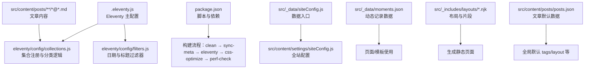
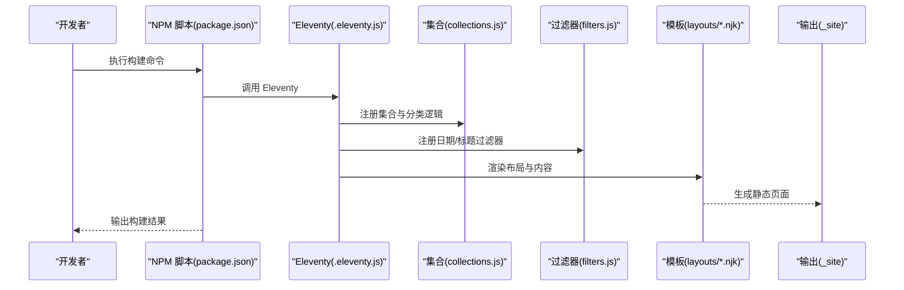
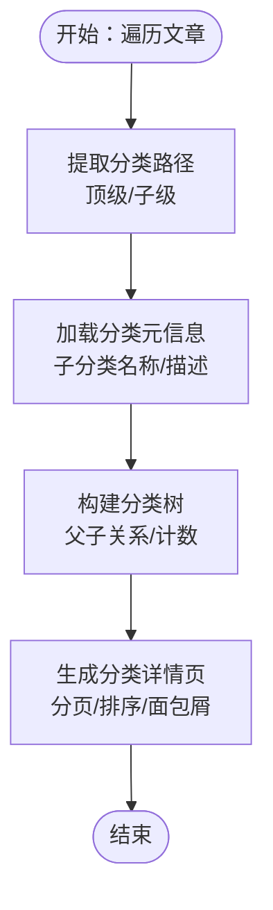
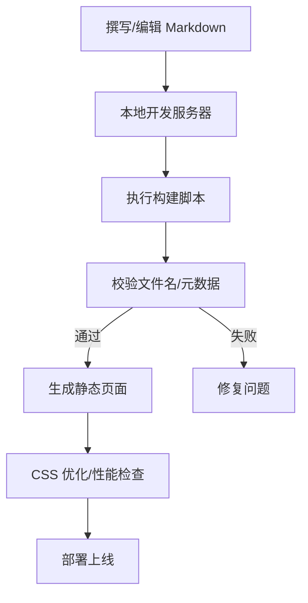
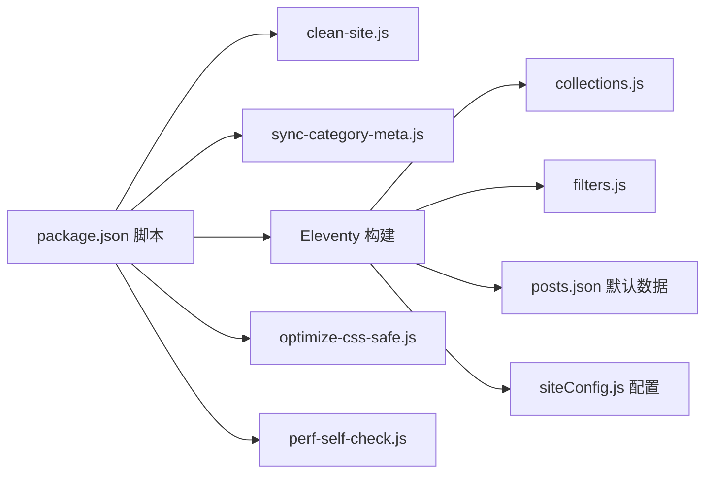

# 内容管理系统

<cite>
**本文引用的文件**
- [.eleventy.js](file://.eleventy.js)
- [package.json](file://package.json)
- [src/_data/siteConfig.js](file://src/_data/siteConfig.js)
- [src/content/settings/siteConfig.js](file://src/content/settings/siteConfig.js)
- [src/content/posts/posts.json](file://src/content/posts/posts.json)
- [src/_data/moments.json](file://src/_data/moments.json)
- [eleventy/config/collections.js](file://eleventy/config/collections.js)
- [eleventy/config/filters.js](file://eleventy/config/filters.js)
- [src/_includes/layouts/base.njk](file://src/_includes/layouts/base.njk)
- [src/_includes/layouts/post.njk](file://src/_includes/layouts/post.njk)
- [src/content/posts/建站需求篇/建站需求清单：估算更新频率@xfq.md](file://src/content/posts/建站需求篇/建站需求清单：估算更新频率@xfq.md)
</cite>

## 目录
1. [简介](#简介)
2. [项目结构](#项目结构)
3. [核心组件](#核心组件)
4. [架构总览](#架构总览)
5. [详细组件分析](#详细组件分析)
6. [依赖关系分析](#依赖关系分析)
7. [性能考量](#性能考量)
8. [故障排查指南](#故障排查指南)
9. [结论](#结论)
10. [附录](#附录)

## 简介
本文件为 11ty RainyNight 内容管理系统的综合文档，聚焦于基于 Markdown 的内容编写规范与最佳实践，涵盖内容文件命名约定、元数据配置、分类与标签系统、文章与页面类型、内容组织结构（含多层级分类与标签管理）、内容发布流程（从草稿到发布）、内容创作示例与模板、版本管理与协作开发建议，以及内容质量控制与 SEO 优化指导。

## 项目结构
系统采用 11ty 静态站点生成器，内容主要位于 src/content 下，配置与数据位于 src/_data 与 src/content/settings，构建脚本与 Eleventy 配置位于根目录与 eleventy/config。

图表来源
- [.eleventy.js:36-181](file://.eleventy.js#L36-L181)
- [package.json:6-16](file://package.json#L6-L16)
- [src/_data/siteConfig.js:1-2](file://src/_data/siteConfig.js#L1-L2)
- [src/content/settings/siteConfig.js:1-168](file://src/content/settings/siteConfig.js#L1-L168)
- [src/_data/moments.json:1-123](file://src/_data/moments.json#L1-L123)
- [eleventy/config/collections.js:219-377](file://eleventy/config/collections.js#L219-L377)
- [eleventy/config/filters.js:6-43](file://eleventy/config/filters.js#L6-L43)
- [src/_includes/layouts/base.njk:1-20](file://src/_includes/layouts/base.njk#L1-L20)
- [src/_includes/layouts/post.njk:1-49](file://src/_includes/layouts/post.njk#L1-L49)
- [src/content/posts/posts.json:1-6](file://src/content/posts/posts.json#L1-L6)

章节来源
- [.eleventy.js:36-181](file://.eleventy.js#L36-L181)
- [package.json:6-16](file://package.json#L6-L16)
- [src/_data/siteConfig.js:1-2](file://src/_data/siteConfig.js#L1-L2)
- [src/content/settings/siteConfig.js:1-168](file://src/content/settings/siteConfig.js#L1-L168)
- [src/_data/moments.json:1-123](file://src/_data/moments.json#L1-L123)
- [eleventy/config/collections.js:219-377](file://eleventy/config/collections.js#L219-L377)
- [eleventy/config/filters.js:6-43](file://eleventy/config/filters.js#L6-L43)
- [src/_includes/layouts/base.njk:1-20](file://src/_includes/layouts/base.njk#L1-L20)
- [src/_includes/layouts/post.njk:1-49](file://src/_includes/layouts/post.njk#L1-L49)
- [src/content/posts/posts.json:1-6](file://src/content/posts/posts.json#L1-L6)

## 核心组件
- 构建与运行
  - 使用脚本进行本地开发与生产构建，包含清理、元数据同步、Eleventy 构建、CSS 优化与性能自检。
- Eleventy 配置
  - 注册语法高亮、Mermaid 插件；设置 Markdown 库；定义全局 computed 数据（标题、子分类、布局、永久链接、发布时间、更新时间、标签、页面样式等）。
- 集合与分类
  - 定义文章集合、分类树、分类详情页集合、文件夹分组集合；支持多层级分类与子分类元信息。
- 过滤器
  - 提供日期格式化、标题格式化等过滤器，便于模板中使用。
- 布局与模板
  - 基础布局与文章布局，统一注入样式与脚本，支持目录与操作按钮。
- 全站配置
  - 集中管理品牌、导航、页脚、元信息、主题、分页、页面文案等。

章节来源
- [.eleventy.js:36-181](file://.eleventy.js#L36-L181)
- [eleventy/config/collections.js:219-377](file://eleventy/config/collections.js#L219-L377)
- [eleventy/config/filters.js:6-43](file://eleventy/config/filters.js#L6-L43)
- [src/_includes/layouts/base.njk:1-20](file://src/_includes/layouts/base.njk#L1-L20)
- [src/_includes/layouts/post.njk:1-49](file://src/_includes/layouts/post.njk#L1-L49)
- [src/content/settings/siteConfig.js:1-168](file://src/content/settings/siteConfig.js#L1-L168)

## 架构总览
系统通过 Eleventy 将 Markdown 内容与 Nunjucks 模板结合，利用集合与过滤器生成分类树与页面，最终输出静态 HTML。构建脚本串联多个步骤以保证一致性与性能。

图表来源
- [package.json:6-16](file://package.json#L6-L16)
- [.eleventy.js:36-181](file://.eleventy.js#L36-L181)
- [eleventy/config/collections.js:219-377](file://eleventy/config/collections.js#L219-L377)
- [eleventy/config/filters.js:6-43](file://eleventy/config/filters.js#L6-L43)
- [src/_includes/layouts/base.njk:1-20](file://src/_includes/layouts/base.njk#L1-L20)
- [src/_includes/layouts/post.njk:1-49](file://src/_includes/layouts/post.njk#L1-L49)

## 详细组件分析

### 内容编写规范与命名约定
- 文章文件命名
  - 必须包含“@”符号，格式为“标题@分类标识.md”，例如“示例标题@分类标识.md”。系统会在构建时验证此规则，未满足将抛出错误。
- 文件位置
  - 文章统一放置在 src/content/posts 下，可按主题进一步分目录（如“建站需求篇/”、“方案策划篇/”等），系统据此提取顶级分类与子分类。
- 元数据 Front Matter
  - 支持 date、updated、tags、description、slug 等字段；未显式提供时，系统会根据文件路径与规则自动推断或设置默认值（如 layout、permalink、publishDate、tags 等）。
- 默认数据
  - src/content/posts/posts.json 提供文章默认 tags 与布局，确保文章集合具备统一的基础属性。

章节来源
- [.eleventy.js:56-72](file://.eleventy.js#L56-L72)
- [.eleventy.js:75-157](file://.eleventy.js#L75-L157)
- [src/content/posts/posts.json:1-6](file://src/content/posts/posts.json#L1-L6)

### 元数据配置与自动推断
- 自动推断字段
  - 标题：若未提供，从文件名“标题@分类”中提取；若仍无，则回退为文件名（不含扩展名）。
  - 子分类：从文件名“标题@子分类”中提取。
  - 布局：文章默认使用“layouts/post.njk”。
  - 永久链接：若未提供且 slug 为占位符，将使用文件名生成的 slug；否则使用 slug 字段。
  - 发布时间：若未提供，使用 date 或当前时间。
  - 更新时间：若文件修改时间与发布时间差异超过一分钟且不超过当前时间，则使用文件修改时间。
  - 标签：若未提供，系统会自动添加“posts”标签。
  - 页面样式：文章默认注入一组样式资源。
- Markdown 渲染
  - 启用 HTML、换行转换、链接识别，并集成脚注与 GitHub 风格告警块。

章节来源
- [.eleventy.js:75-157](file://.eleventy.js#L75-L157)
- [.eleventy.js:159-170](file://.eleventy.js#L159-L170)

### 分类系统与内容组织
- 多层级分类
  - 顶级分类由文章所在目录名称决定；若存在“子分类标识”，则作为二级分类。
  - 系统通过集合计算构建分类树，支持父/子节点关系与面包屑生成。
- 子分类元信息
  - 通过 src/content/settings/categoryDescriptions.json 加载分类元信息，支持为子分类设置显示名称与描述。
- 分类详情页
  - 为每个分类生成详情页集合，支持分页与排序（优先 categoryOrder，其次日期，最后标题）。
- 文件夹分组
  - 按顶层目录分组，统计各组下的分类与文章数量，便于概览。

图表来源
- [eleventy/config/collections.js:145-217](file://eleventy/config/collections.js#L145-L217)
- [eleventy/config/collections.js:253-316](file://eleventy/config/collections.js#L253-L316)
- [eleventy/config/collections.js:318-371](file://eleventy/config/collections.js#L318-L371)

章节来源
- [eleventy/config/collections.js:73-143](file://eleventy/config/collections.js#L73-L143)
- [eleventy/config/collections.js:219-377](file://eleventy/config/collections.js#L219-L377)

### 文章与页面类型
- 文章（posts）
  - 位于 src/content/posts 下，采用“标题@分类.md”的命名；系统自动推断标题、子分类、布局、永久链接、发布时间、更新时间、标签与页面样式。
- 页面（pages）
  - 位于 src/content/pages 下，对应归档、分类列表、分类详情、动态记录、服务说明等页面；通过 11tydata 文件与 Nunjucks 模板组合生成。
- 示例与案例
  - 在 posts 下按主题分目录存放示例文案与案例，便于按主题浏览与检索。

章节来源
- [.eleventy.js:75-157](file://.eleventy.js#L75-L157)
- [src/_includes/layouts/post.njk:1-49](file://src/_includes/layouts/post.njk#L1-L49)

### 内容索引与导航
- 导航与文案
  - 全站导航、页脚、页面标题与副标题等文案集中于 src/content/settings/siteConfig.js，便于统一管理与国际化扩展。
- 归档与分类
  - 通过集合生成“全部文档”、“内容归档”、“分类详情”等页面，支持按时间与分类浏览。
- 动态记录
  - 使用 src/_data/moments.json 提供时间线式动态记录，页面可按日期分组展示。

章节来源
- [src/content/settings/siteConfig.js:1-168](file://src/content/settings/siteConfig.js#L1-L168)
- [src/_data/moments.json:1-123](file://src/_data/moments.json#L1-L123)

### 发布流程（草稿到发布）
- 草稿阶段
  - 在本地开发服务器运行 Eleventy，实时预览与调试。
- 构建阶段
  - 执行构建脚本：清理站点、同步分类元数据、Eleventy 生成、CSS 优化、性能自检。
- 验证阶段
  - 构建过程中会检查文章文件名格式、slug 等，确保符合规范。
- 发布阶段
  - 将生成的静态文件部署至目标平台（如 Vercel）。

图表来源
- [package.json:6-16](file://package.json#L6-L16)
- [.eleventy.js:56-72](file://.eleventy.js#L56-L72)
- [.eleventy.js:36-54](file://.eleventy.js#L36-L54)

章节来源
- [package.json:6-16](file://package.json#L6-L16)
- [.eleventy.js:36-72](file://.eleventy.js#L36-L72)

### 内容创作示例与模板
- 示例文章
  - 参考 src/content/posts/建站需求篇/建站需求清单：估算更新频率@xfq.md，了解 Front Matter 字段与正文结构。
- 模板使用
  - 文章默认使用“layouts/post.njk”，包含标题、发布时间、更新时间、目录与操作按钮；基础布局统一注入样式与脚本。

章节来源
- [src/content/posts/建站需求篇/建站需求清单：估算更新频率@xfq.md:1-28](file://src/content/posts/建站需求篇/建站需求清单：估算更新频率@xfq.md#L1-L28)
- [src/_includes/layouts/post.njk:1-49](file://src/_includes/layouts/post.njk#L1-L49)
- [src/_includes/layouts/base.njk:1-20](file://src/_includes/layouts/base.njk#L1-L20)

### 版本管理与协作开发
- 版本与变更
  - 利用 Git 管理内容与配置变更；文章更新时间可由文件修改时间推断，便于追踪。
- 协作建议
  - 团队成员遵循统一的命名与元数据规范；在合并前执行构建与自检脚本，确保一致性。
- 自动化
  - 构建脚本串联多个步骤，减少人工干预与遗漏。

章节来源
- [.eleventy.js:117-135](file://.eleventy.js#L117-L135)
- [package.json:6-16](file://package.json#L6-L16)

### 内容质量控制与 SEO 优化
- 质量控制
  - 构建时强制校验文章文件名格式；自动补全标题、子分类、布局、永久链接、发布时间、更新时间与标签；提供日期格式化与标题格式化过滤器。
- SEO 优化
  - 全站元信息集中配置于 siteConfig.js，包含标题、描述、语言等；文章默认注入样式与脚本，利于搜索引擎抓取与用户阅读体验。

章节来源
- [.eleventy.js:56-72](file://.eleventy.js#L56-L72)
- [.eleventy.js:75-157](file://.eleventy.js#L75-L157)
- [eleventy/config/filters.js:6-43](file://eleventy/config/filters.js#L6-L43)
- [src/content/settings/siteConfig.js:27-34](file://src/content/settings/siteConfig.js#L27-L34)

## 依赖关系分析
- 构建脚本依赖
  - clean-site、sync-meta、optimize-css-safe、perf-self-check 等脚本串联执行，确保站点一致性与性能。
- Eleventy 插件
  - 语法高亮、Mermaid、Markdown-it（含脚注与 GitHub 告警块）增强内容表现力。
- 数据与配置
  - siteConfig.js 提供全站统一配置；moments.json 提供动态记录数据；posts.json 提供文章默认数据。

图表来源
- [package.json:6-16](file://package.json#L6-L16)
- [.eleventy.js:36-181](file://.eleventy.js#L36-L181)
- [src/content/posts/posts.json:1-6](file://src/content/posts/posts.json#L1-L6)
- [src/content/settings/siteConfig.js:1-168](file://src/content/settings/siteConfig.js#L1-L168)

章节来源
- [package.json:6-16](file://package.json#L6-L16)
- [.eleventy.js:36-181](file://.eleventy.js#L36-L181)

## 性能考量
- 构建阶段
  - 通过 CSS 优化与性能自检脚本降低首屏加载与运行时开销。
- 内容组织
  - 合理的分类与分页（如分类页每页条数）有助于提升列表页与详情页的加载性能。
- 渲染优化
  - 布局与样式按需注入，避免冗余资源。

## 故障排查指南
- 文章文件名格式错误
  - 若未包含“@”符号，构建时会抛出错误提示，请修正为“标题@分类.md”格式。
- 缺失 slug
  - 若未提供 slug，系统会尝试使用文件名生成的 slug；若仍不可用，需手动补充。
- 更新时间异常
  - 当文件修改时间与发布时间差异过大或在未来时间，系统会忽略更新时间，确保一致性。
- 构建失败
  - 检查构建脚本顺序与依赖；确认分类元数据 JSON 格式正确；核对 Markdown 渲染插件安装状态。

章节来源
- [.eleventy.js:56-72](file://.eleventy.js#L56-L72)
- [.eleventy.js:102-111](file://.eleventy.js#L102-L111)
- [.eleventy.js:117-135](file://.eleventy.js#L117-L135)

## 结论
RainyNight 内容管理系统通过严格的命名与元数据规范、完善的分类与索引机制、可复用的模板与过滤器，以及自动化构建流程，实现了从内容创作到发布的高效闭环。遵循本文规范与最佳实践，可显著提升内容质量、维护效率与用户体验。

## 附录
- 快速检查清单
  - 文章文件名包含“@”符号
  - Front Matter 包含 date、tags、description 等必要字段
  - 分类与子分类在 categoryDescriptions.json 中有对应元信息
  - 构建前执行 npm run prebuild 与 npm run build
- 常用命令
  - 本地开发：npm start
  - 生产构建：npm run build
  - 更新日期：npm run update-dates
  - 同步分类元数据：npm run sync-meta