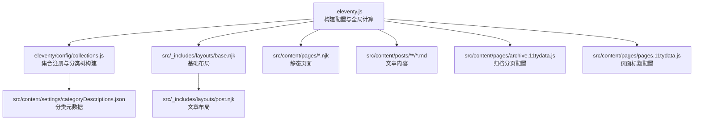
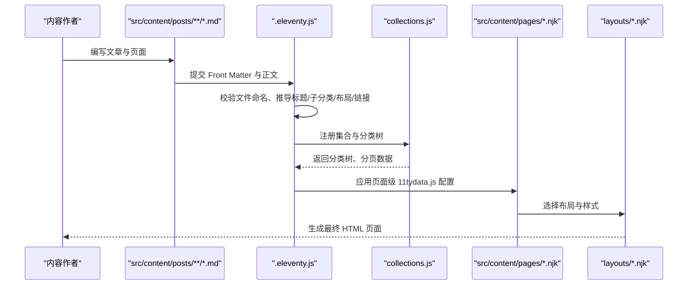
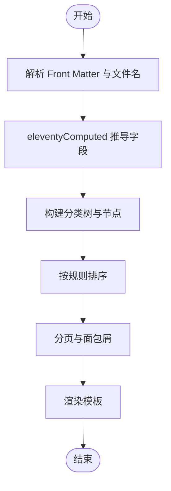
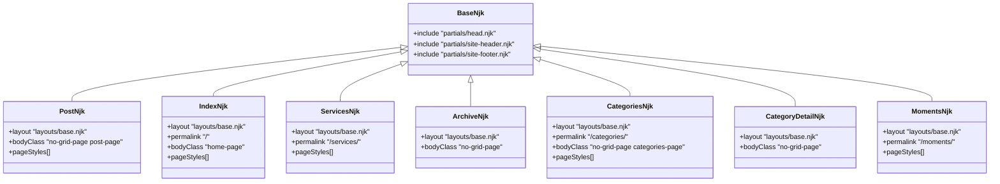
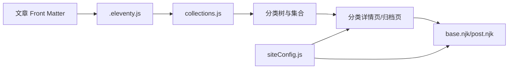

# 内容类型与页面管理

<cite>
**本文引用的文件**
- [.eleventy.js](file://.eleventy.js)
- [src/content/posts/posts.json](file://src/content/posts/posts.json)
- [eleventy/config/collections.js](file://eleventy/config/collections.js)
- [src/content/settings/categoryDescriptions.json](file://src/content/settings/categoryDescriptions.json)
- [src/_data/siteConfig.js](file://src/_data/siteConfig.js)
- [src/_includes/layouts/base.njk](file://src/_includes/layouts/base.njk)
- [src/_includes/layouts/post.njk](file://src/_includes/layouts/post.njk)
- [src/content/pages/index.njk](file://src/content/pages/index.njk)
- [src/content/pages/services.njk](file://src/content/pages/services.njk)
- [src/content/pages/categories.njk](file://src/content/pages/categories.njk)
- [src/content/pages/category-detail.njk](file://src/content/pages/category-detail.njk)
- [src/content/pages/archive.njk](file://src/content/pages/archive.njk)
- [src/content/pages/archive.11tydata.js](file://src/content/pages/archive.11tydata.js)
- [src/content/pages/pages.11tydata.js](file://src/content/pages/pages.11tydata.js)
- [src/content/pages/moments.njk](file://src/content/pages/moments.njk)
- [scripts/manage-categories.js](file://scripts/manage-categories.js)
</cite>

## 目录
1. [简介](#简介)
2. [项目结构](#项目结构)
3. [核心组件](#核心组件)
4. [架构总览](#架构总览)
5. [详细组件分析](#详细组件分析)
6. [依赖关系分析](#依赖关系分析)
7. [性能考量](#性能考量)
8. [故障排查指南](#故障排查指南)
9. [结论](#结论)
10. [附录](#附录)

## 简介
本文件面向使用 11ty RainyNight 的内容运营与技术团队，系统化说明“内容类型与页面管理”的设计与实践，包括：
- 文章内容与页面内容的区别与用途
- 博客文章的组织方式（按主题分类与子分类）
- 页面内容的管理（首页、服务页、归档页、知识库页、动态页等）
- 元数据配置差异与模板选择规则
- 内容类型选择的决策指导与最佳实践
- 发布状态管理（草稿、已发布、隐藏）与迁移/批量管理

## 项目结构
RainyNight 采用 11ty 的内容驱动架构，核心目录与职责如下：
- src/content/posts：文章内容，按“主题目录/子分类”组织，自动构建分类树与分页
- src/content/pages：静态页面，如首页、服务页、归档页、知识库页、动态页等
- src/_includes/layouts：布局模板，post.njk 用于文章，base.njk 作为通用基础布局
- src/_data/siteConfig.js：站点配置入口，供页面与集合读取
- src/content/settings/categoryDescriptions.json：分类元数据（描述、子分类映射）
- scripts/manage-categories.js：分类元数据与批量迁移工具

图表来源
- [.eleventy.js:36-181](file://.eleventy.js#L36-L181)
- [eleventy/config/collections.js:219-371](file://eleventy/config/collections.js#L219-L371)
- [src/_includes/layouts/base.njk:1-20](file://src/_includes/layouts/base.njk#L1-L20)
- [src/_includes/layouts/post.njk:1-49](file://src/_includes/layouts/post.njk#L1-L49)
- [src/content/pages/archive.11tydata.js:1-22](file://src/content/pages/archive.11tydata.js#L1-L22)
- [src/content/pages/pages.11tydata.js:1-31](file://src/content/pages/pages.11tydata.js#L1-L31)

章节来源
- [.eleventy.js:36-181](file://.eleventy.js#L36-L181)
- [eleventy/config/collections.js:219-371](file://eleventy/config/collections.js#L219-L371)
- [src/_includes/layouts/base.njk:1-20](file://src/_includes/layouts/base.njk#L1-L20)
- [src/_includes/layouts/post.njk:1-49](file://src/_includes/layouts/post.njk#L1-L49)
- [src/content/pages/archive.11tydata.js:1-22](file://src/content/pages/archive.11tydata.js#L1-L22)
- [src/content/pages/pages.11tydata.js:1-31](file://src/content/pages/pages.11tydata.js#L1-L31)

## 核心组件
- 构建配置与全局计算
  - 在构建阶段扫描文章目录，验证文件命名规范，并通过 eleventyComputed 自动推导标题、子分类、布局、永久链接、发布时间、更新时间、标签、页面样式等
  - Markdown 渲染器启用脚注与 GitHub Alerts 插件
- 集合与分类树
  - 通过集合注册函数构建“文章集合、分类集合、分类树节点、分类详情页集合”，并支持分页与面包屑
  - 分类元数据来自 categoryDescriptions.json，支持顶级分类与子分类描述
- 页面与布局
  - 文章使用 post.njk 布局；静态页面使用 base.njk 布局
  - 页面可通过 11tydata.js 定义标题、分页与永久链接策略

章节来源
- [.eleventy.js:36-181](file://.eleventy.js#L36-L181)
- [eleventy/config/collections.js:219-371](file://eleventy/config/collections.js#L219-L371)
- [src/content/settings/categoryDescriptions.json:1-60](file://src/content/settings/categoryDescriptions.json#L1-L60)
- [src/_includes/layouts/post.njk:1-49](file://src/_includes/layouts/post.njk#L1-L49)
- [src/_includes/layouts/base.njk:1-20](file://src/_includes/layouts/base.njk#L1-L20)

## 架构总览
下图展示了“内容类型与页面管理”的整体工作流：内容文件经由集合与计算属性生成页面，再由布局模板渲染输出。

图表来源
- [.eleventy.js:36-181](file://.eleventy.js#L36-L181)
- [eleventy/config/collections.js:219-371](file://eleventy/config/collections.js#L219-L371)
- [src/content/pages/pages.11tydata.js:1-31](file://src/content/pages/pages.11tydata.js#L1-L31)
- [src/_includes/layouts/base.njk:1-20](file://src/_includes/layouts/base.njk#L1-L20)
- [src/_includes/layouts/post.njk:1-49](file://src/_includes/layouts/post.njk#L1-L49)

## 详细组件分析

### 文章内容类型与组织方式
- 文件命名与元数据
  - 文件名需包含“@分类标识”以自动解析标题与子分类
  - Front Matter 支持 title、date、slug、tags、subcategory 等字段
  - 未显式设置时，通过 eleventyComputed 自动推导：标题取自文件名前缀，子分类取自“@”后缀，布局默认为 post.njk，永久链接为 /posts/{slug}/，发布时间默认为文件日期
- 分类与子分类
  - 文章按“主题目录/子分类”组织，集合会根据路径提取顶层分类与子分类，构建分类树
  - 子分类可配置显示名称与描述，来源于 categoryDescriptions.json
- 分页与排序
  - 分类详情页按 categoryOrder、date、title 排序，支持分页
  - 归档页按年份分组，支持分页

图表来源
- [.eleventy.js:75-157](file://.eleventy.js#L75-L157)
- [eleventy/config/collections.js:31-61](file://eleventy/config/collections.js#L31-L61)
- [eleventy/config/collections.js:145-217](file://eleventy/config/collections.js#L145-L217)
- [eleventy/config/collections.js:260-316](file://eleventy/config/collections.js#L260-L316)

章节来源
- [.eleventy.js:56-157](file://.eleventy.js#L56-L157)
- [eleventy/config/collections.js:31-61](file://eleventy/config/collections.js#L31-L61)
- [eleventy/config/collections.js:145-217](file://eleventy/config/collections.js#L145-L217)
- [eleventy/config/collections.js:260-316](file://eleventy/config/collections.js#L260-L316)
- [src/content/settings/categoryDescriptions.json:1-60](file://src/content/settings/categoryDescriptions.json#L1-L60)

### 页面内容类型与管理
- 首页（index.njk）
  - 使用 base.njk 布局，永久链接为根路径
  - 通过 siteConfig.pages.home 配置标题、副标题、描述与功能区块
- 服务页（services.njk）
  - 使用 base.njk 布局，永久链接为 /services/
  - 通过 siteConfig.pages.services 配置标题、副标题、服务列表与行动号召
- 归档页（archive.njk + archive.11tydata.js）
  - 通过集合与分页配置，按年份分组展示文章列表
  - 分页大小由 siteConfig.pagination.archivePageSize 控制
- 知识库页（categories.njk）
  - 展示“主题目录”与“分类卡片”，点击进入分类详情
- 分类详情页（category-detail.njk）
  - 基于集合生成的分类详情数据，支持子分类卡片与分页导航
- 动态页（moments.njk）
  - 使用 base.njk 布局，永久链接为 /moments/
  - 通过 moments 数据渲染时间轴卡片

图表来源
- [src/_includes/layouts/base.njk:1-20](file://src/_includes/layouts/base.njk#L1-L20)
- [src/_includes/layouts/post.njk:1-49](file://src/_includes/layouts/post.njk#L1-L49)
- [src/content/pages/index.njk:1-94](file://src/content/pages/index.njk#L1-L94)
- [src/content/pages/services.njk:1-56](file://src/content/pages/services.njk#L1-L56)
- [src/content/pages/archive.njk:1-57](file://src/content/pages/archive.njk#L1-L57)
- [src/content/pages/categories.njk:1-67](file://src/content/pages/categories.njk#L1-L67)
- [src/content/pages/category-detail.njk:1-80](file://src/content/pages/category-detail.njk#L1-L80)
- [src/content/pages/moments.njk:1-80](file://src/content/pages/moments.njk#L1-L80)

章节来源
- [src/content/pages/index.njk:1-94](file://src/content/pages/index.njk#L1-L94)
- [src/content/pages/services.njk:1-56](file://src/content/pages/services.njk#L1-L56)
- [src/content/pages/archive.njk:1-57](file://src/content/pages/archive.njk#L1-L57)
- [src/content/pages/categories.njk:1-67](file://src/content/pages/categories.njk#L1-L67)
- [src/content/pages/category-detail.njk:1-80](file://src/content/pages/category-detail.njk#L1-L80)
- [src/content/pages/moments.njk:1-80](file://src/content/pages/moments.njk#L1-L80)

### 元数据配置差异与模板选择规则
- 文章元数据
  - 来源：Front Matter 与 eleventyComputed 自动推导
  - 关键字段：title、subcategory、layout、permalink、publishDate、updated、tags、bodyClass、pageStyles
  - 默认值：layout 默认 post.njk；tags 默认包含 posts；pageStyles 默认包含 alerts.css、code.css、post.css
- 页面元数据
  - 来源：页面文件 Front Matter + 11tydata.js
  - 示例：pages.11tydata.js 将首页、知识库、服务、联系、归档等页面标题映射到 siteConfig.pages.* 配置
  - 归档页：archive.11tydata.js 定义分页大小与永久链接规则
- 模板选择
  - 文章：统一使用 post.njk 布局
  - 页面：统一使用 base.njk 布局，部分页面追加特定样式表

章节来源
- [.eleventy.js:75-157](file://.eleventy.js#L75-L157)
- [src/content/posts/posts.json:1-6](file://src/content/posts/posts.json#L1-L6)
- [src/content/pages/pages.11tydata.js:1-31](file://src/content/pages/pages.11tydata.js#L1-L31)
- [src/content/pages/archive.11tydata.js:1-22](file://src/content/pages/archive.11tydata.js#L1-L22)
- [src/_includes/layouts/post.njk:1-49](file://src/_includes/layouts/post.njk#L1-L49)
- [src/_includes/layouts/base.njk:1-20](file://src/_includes/layouts/base.njk#L1-L20)

### 内容类型选择的决策指导与最佳实践
- 何时使用“文章”
  - 需要按时间线展示、具备评论/目录/更新提示等阅读体验
  - 使用“主题目录/子分类”组织，便于构建知识库与分类导航
- 何时使用“页面”
  - 静态信息展示（首页、服务页、关于页、归档页、动态页）
  - 使用 11tydata.js 管理标题与分页策略，确保 URL 与 SEO 友好
- 最佳实践
  - 文章命名：标题@子分类.md，保证自动推导正确
  - 分类元数据：在 categoryDescriptions.json 中为子分类配置描述，提升分类页可读性
  - 样式：文章默认样式已内置；页面如需特殊样式，在页面 Front Matter 中追加 pageStyles

章节来源
- [.eleventy.js:56-72](file://.eleventy.js#L56-L72)
- [eleventy/config/collections.js:253-258](file://eleventy/config/collections.js#L253-L258)
- [src/content/settings/categoryDescriptions.json:1-60](file://src/content/settings/categoryDescriptions.json#L1-L60)

### 发布状态管理（草稿、已发布、隐藏）
- 已发布
  - 正常提交 Front Matter，包含必要元数据；文章将被集合收录并生成页面
- 草稿
  - 可通过 Front Matter 设置状态字段并在模板中过滤（建议在集合或模板层增加状态过滤逻辑）
- 隐藏
  - 不在集合中公开或设置隐藏字段，结合模板条件渲染控制展示
- 建议
  - 使用 tags 或自定义字段标记状态，配合集合过滤与模板判断实现灵活发布控制

章节来源
- [.eleventy.js:136-147](file://.eleventy.js#L136-L147)
- [eleventy/config/collections.js:224-226](file://eleventy/config/collections.js#L224-L226)

### 内容迁移与批量管理
- 分类元数据管理
  - 列出现有分类与元数据：node scripts/manage-categories.js list
  - 重命名分类（含子分类）：node scripts/manage-categories.js rename <旧名> <新名>
  - 删除分类：node scripts/manage-categories.js delete <名称>
  - 设置元数据：node scripts/manage-categories.js meta "<分类路径>" "<描述>"
- 迁移建议
  - 先在 categoryDescriptions.json 中补充目标分类的描述与子分类映射
  - 使用重命名命令批量更新文章 Front Matter 的分类字段
  - 重新构建站点，核对分类详情页与知识库页是否正确

章节来源
- [scripts/manage-categories.js:63-212](file://scripts/manage-categories.js#L63-L212)

## 依赖关系分析
- 配置耦合
  - .eleventy.js 依赖 collections.js 注册集合；依赖 pages.11tydata.js 与 archive.11tydata.js 提供页面级配置
  - 布局模板依赖 siteConfig.js 提供的站点配置
- 数据流向
  - 文章 Front Matter → eleventyComputed 自动推导 → 集合 → 分类树 → 分类详情页/归档页
  - 页面 Front Matter + 11tydata.js → 布局 → 输出

图表来源
- [.eleventy.js:36-181](file://.eleventy.js#L36-L181)
- [eleventy/config/collections.js:219-371](file://eleventy/config/collections.js#L219-L371)
- [src/_data/siteConfig.js:1-2](file://src/_data/siteConfig.js#L1-L2)
- [src/_includes/layouts/base.njk:1-20](file://src/_includes/layouts/base.njk#L1-L20)
- [src/_includes/layouts/post.njk:1-49](file://src/_includes/layouts/post.njk#L1-L49)

章节来源
- [.eleventy.js:36-181](file://.eleventy.js#L36-L181)
- [eleventy/config/collections.js:219-371](file://eleventy/config/collections.js#L219-L371)
- [src/_data/siteConfig.js:1-2](file://src/_data/siteConfig.js#L1-L2)
- [src/_includes/layouts/base.njk:1-20](file://src/_includes/layouts/base.njk#L1-L20)
- [src/_includes/layouts/post.njk:1-49](file://src/_includes/layouts/post.njk#L1-L49)

## 性能考量
- 集合与分页
  - 分类详情页与归档页均采用分页，减少单页渲染压力
  - 分页大小通过 siteConfig 配置，建议根据内容密度与加载速度调优
- 计算属性
  - eleventyComputed 在构建期完成，避免运行时重复计算
- 样式与脚本
  - 文章默认样式集中引入，页面按需追加样式，避免冗余加载

## 故障排查指南
- 文章文件名格式错误
  - 现象：构建时报错，提示必须包含 @ 符号
  - 处理：修正为“标题@分类标识.md”格式
- 缺失 slug
  - 现象：控制台提示缺失 slug
  - 处理：在 Front Matter 显式设置 slug 或接受自动推导
- 更新时间异常
  - 现象：updated 字段为空或不准确
  - 处理：检查文件修改时间与 publishDate 差距是否超过阈值
- 分类元数据未生效
  - 现象：分类详情页缺少描述或子分类显示异常
  - 处理：检查 categoryDescriptions.json 结构与键名，确保顶层分类与子分类路径一致

章节来源
- [.eleventy.js:56-72](file://.eleventy.js#L56-L72)
- [.eleventy.js:105-135](file://.eleventy.js#L105-L135)
- [scripts/manage-categories.js:63-93](file://scripts/manage-categories.js#L63-L93)

## 结论
RainyNight 通过“文章内容 + 页面内容”的双轨模式，结合集合与计算属性，实现了高可维护的知识库与静态页面体系。借助分类元数据与批量管理工具，团队可以高效地组织内容、维护结构，并在需要时进行平滑迁移与扩展。

## 附录
- 常用命令
  - 构建站点：eleventy
  - 分类管理：node scripts/manage-categories.js list/rename/delete/meta
- 建议配置项
  - pagination.categoryPageSize、pagination.archivePageSize、pagination.labels
  - pages.home/services/archive/categories/categoryDetail 的标题与文案