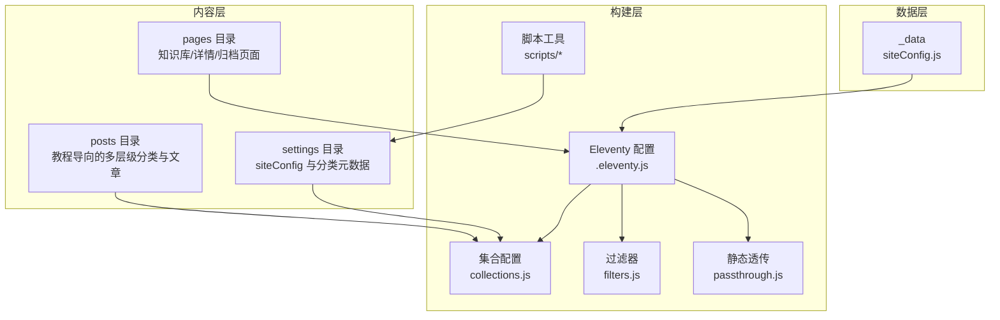
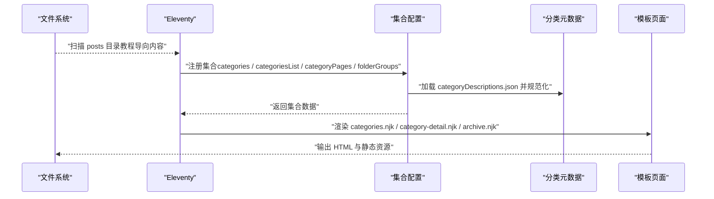
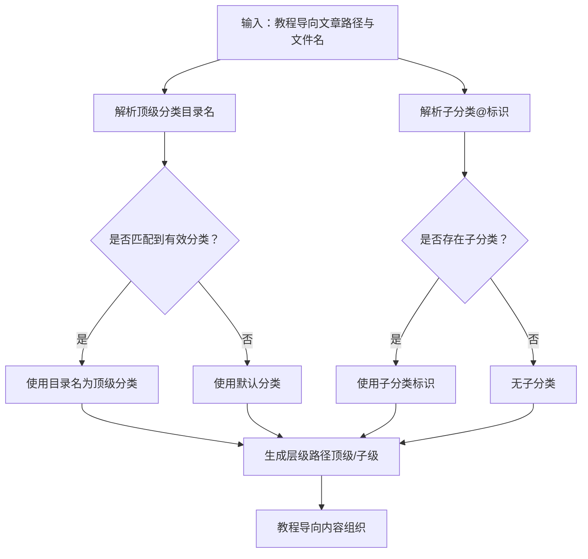
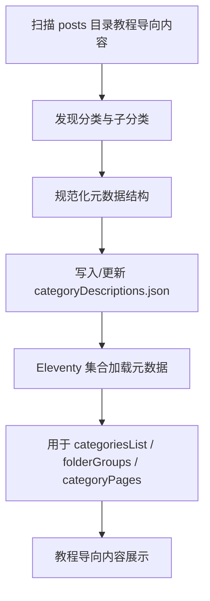
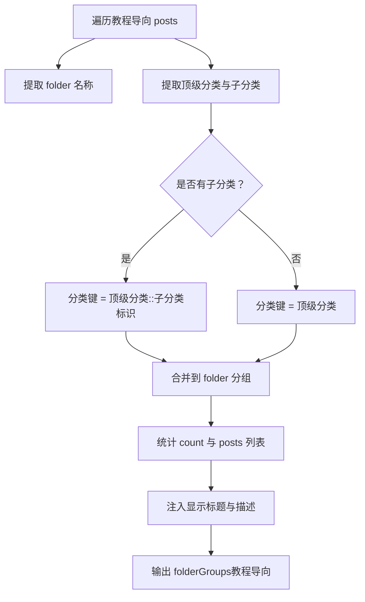
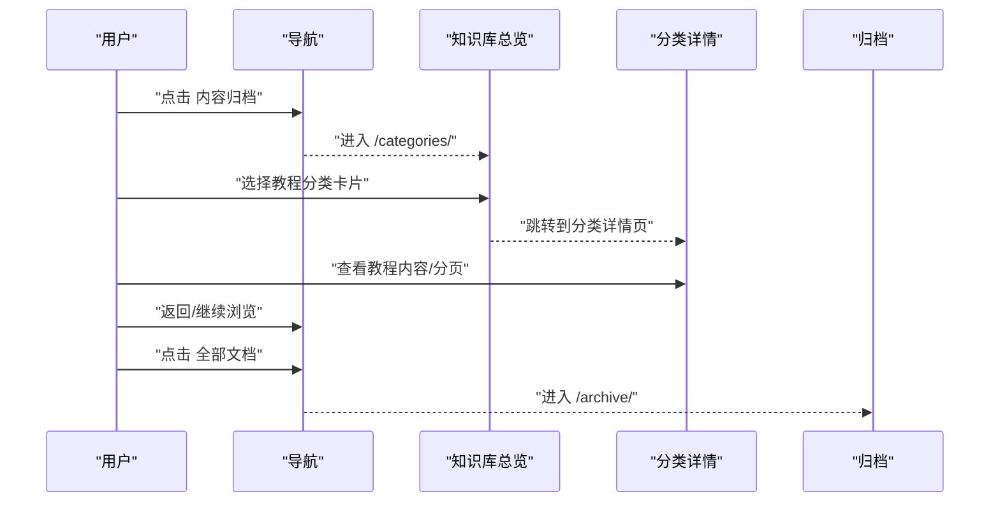
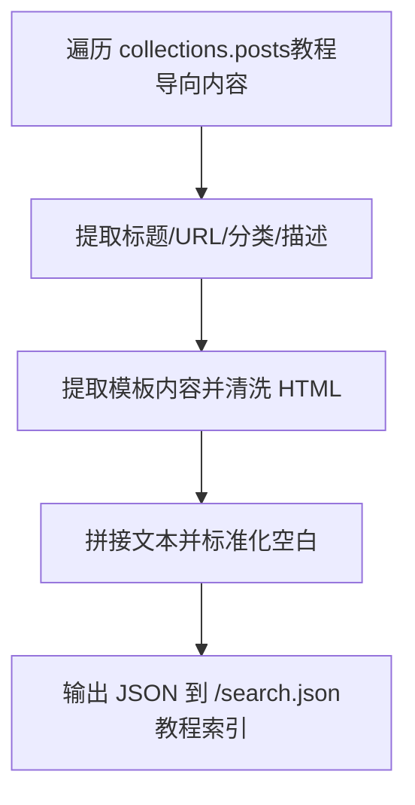
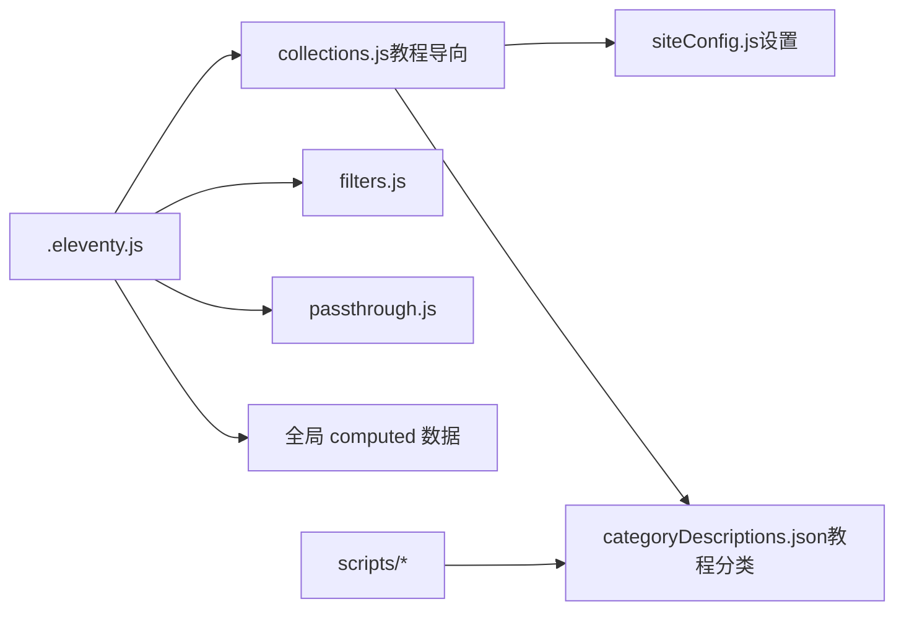

# 内容组织结构

<cite>
**本文引用的文件**
- [collections.js](file://eleventy/config/collections.js)
- [filters.js](file://eleventy/config/filters.js)
- [passthrough.js](file://eleventy/config/passthrough.js)
- [manage-categories.js](file://scripts/manage-categories.js)
- [sync-category-meta.js](file://scripts/sync-category-meta.js)
- [categoryDescriptions.json](file://src/content/settings/categoryDescriptions.json)
- [siteConfig.js（设置）](file://src/content/settings/siteConfig.js)
- [siteConfig.js（数据）](file://src/_data/siteConfig.js)
- [categories.njk](file://src/content/pages/categories.njk)
- [category-detail.njk](file://src/content/pages/category-detail.njk)
- [archive.njk](file://src/content/pages/archive.njk)
- [search.11ty.js](file://src/content/search.11ty.js)
- [.eleventy.js](file://.eleventy.js)
- [posts.11tydata.js](file://src/content/posts/posts.11tydata.js)
- [建站需求清单：估算更新频率@xfq.md](file://src/content/posts/建站需求篇/建站需求清单：估算更新频率@xfq.md)
- [网站示例目录：从整理内容到上线的完整演示@alzs.md](file://src/content/posts/网站示例篇/网站示例目录：从整理内容到上线的完整演示@alzs.md)
- [演示案例 01：前端开发者个人主页@xs.md](file://src/content/posts/项目速览/演示案例 01：前端开发者个人主页@xs.md)
- [Markdown 语法完整演示@ymgn.md](file://src/content/posts/页面与功能篇/Markdown 语法完整演示@ymgn.md)
- [package.json](file://package.json)
</cite>

## 更新摘要
**所做更改**
- 更新了教程导向内容定位的说明，强调个人网站搭建的演示性质
- 新增了分类体系的详细说明，包括"建站需求篇"、"方案策划篇"、"网站示例篇"等分类
- 增强了内容导航设计原则，突出教程导向的用户体验
- 更新了内容索引和搜索功能的实现方式
- 完善了内容结构设计的最佳实践

## 目录
1. [简介](#简介)
2. [项目结构](#项目结构)
3. [核心组件](#核心组件)
4. [架构总览](#架构总览)
5. [详细组件分析](#详细组件分析)
6. [依赖关系分析](#依赖关系分析)
7. [性能考量](#性能考量)
8. [故障排查指南](#故障排查指南)
9. [结论](#结论)
10. [附录](#附录)

## 简介
本文件系统性阐述 11ty RainyNight 的内容组织结构与多层级分类体系，该系统专门服务于个人网站搭建的教程导向内容定位。文档覆盖以下要点：
- 多层级分类系统的实现原理与使用方法
- 内容文件夹组织结构（以 /src/content/posts/ 为例）
- 分类元数据配置方式（categoryDescriptions.json 的使用与自定义）
- 内容分组与聚合机制（folderGroups 集合的实现逻辑）
- 内容导航的设计原则与用户体验考虑
- 内容索引与搜索功能的实现方式
- 内容结构设计最佳实践与性能优化建议

**更新** 本版本特别强调了教程导向的内容定位，将个人网站搭建作为核心主题，通过分类体系清晰地组织从需求分析到实施落地的完整教程链路。

## 项目结构
RainyNight 采用 11ty 的约定式目录结构，核心内容位于 src/content 下，构建脚本与 Eleventy 配置位于根目录与 eleventy/config 中。关键路径如下：
- 内容层：src/content/posts（多层级分类与教程文章）、src/content/pages（页面模板）、src/content/settings（站点配置与分类元数据）
- 构建层：eleventy/config（集合、过滤器、静态资源透传）、scripts（分类元数据同步与管理工具）、.eleventy.js（Eleventy 主配置）
- 数据层：src/_data（全局配置读取）

**图表来源**
- [.eleventy.js:36-181](file://.eleventy.js#L36-L181)
- [collections.js:219-377](file://eleventy/config/collections.js#L219-L377)
- [siteConfig.js（设置）:1-168](file://src/content/settings/siteConfig.js#L1-L168)

**章节来源**
- [.eleventy.js:36-181](file://.eleventy.js#L36-L181)
- [collections.js:219-377](file://eleventy/config/collections.js#L219-L377)

## 核心组件
- 多层级分类集合与聚合
  - categories：按层级路径聚合文章
  - categoriesList：生成树形节点，包含标题、父子关系、文章列表与元信息
  - categoryPages：生成带分页的分类详情页数据（含面包屑、子分类卡片等）
  - folderGroups：按"文件夹"维度聚合分类，便于知识库页面展示
- 分类元数据与同步
  - categoryDescriptions.json：分类与子分类的描述与显示名称
  - sync-category-meta.js：扫描 posts 目录，自动同步/规范化元数据文件
  - manage-categories.js：命令行工具，支持列出、重命名、删除分类及设置元数据
- 页面与导航
  - categories.njk：知识库总览页，按 folderGroups 展示卡片网格
  - category-detail.njk：分类详情页，支持分页、面包屑、子分类卡片
  - archive.njk：按年份归档的文章列表
- 全局配置与数据
  - siteConfig.js（设置）：站点文案、导航、分页标签、页面标题等
  - siteConfig.js（数据）：_data 读取设置文件

**更新** 新增了教程导向的分类体系，包括"建站需求篇"、"方案策划篇"、"网站示例篇"、"项目速览"、"页面与功能篇"等，形成完整的个人网站搭建教程链路。

**章节来源**
- [collections.js:219-377](file://eleventy/config/collections.js#L219-L377)
- [categoryDescriptions.json:1-76](file://src/content/settings/categoryDescriptions.json#L1-L76)
- [sync-category-meta.js:1-233](file://scripts/sync-category-meta.js#L1-L233)
- [manage-categories.js:1-212](file://scripts/manage-categories.js#L1-L212)
- [categories.njk:1-143](file://src/content/pages/categories.njk#L1-L143)
- [category-detail.njk:1-80](file://src/content/pages/category-detail.njk#L1-L80)
- [archive.njk:1-57](file://src/content/pages/archive.njk#L1-L57)
- [siteConfig.js（设置）:1-170](file://src/content/settings/siteConfig.js#L1-L170)
- [siteConfig.js（数据）:1-2](file://src/_data/siteConfig.js#L1-L2)

## 架构总览
多层级分类系统围绕"路径解析 + 元数据加载 + 集合构建"的主干流程运转，最终输出知识库页面与分类详情页。该系统特别针对个人网站搭建的教程导向内容进行了优化。

**图表来源**
- [.eleventy.js:36-181](file://.eleventy.js#L36-L181)
- [collections.js:219-377](file://eleventy/config/collections.js#L219-L377)
- [categoryDescriptions.json:1-76](file://src/content/settings/categoryDescriptions.json#L1-L76)

## 详细组件分析

### 多层级分类系统与内容文件夹组织
- 分类层级规则
  - 顶级分类由文章所在子目录决定；若未匹配到有效路径，默认归入"默认分类"
  - 子分类由文章文件名中的"@分类标识"提取，作为二级分类键
- 文件命名规范
  - 文章文件名需包含"@"符号，格式为"标题@分类标识.md"，否则构建时报错
- 教程导向分类体系
  - "建站需求篇"：个人网站搭建前的需求分析与准备工作
  - "方案策划篇"：网站结构设计与内容规划
  - "网站示例篇"：完整的个人网站示例展示
  - "项目速览"：快速浏览不同类型个人网站的页面示例
  - "页面与功能篇"：页面功能说明与技术实现
  - "资源下载"：相关资源与工具的下载链接
  - "测试"：测试用内容
  - "福星抖音上货使用教程"：软件使用教程

**更新** 新的分类体系形成了完整的教程链路，从需求分析到实施落地，再到示例展示和功能说明，为用户提供了一站式的个人网站搭建学习体验。

**图表来源**
- [.eleventy.js:56-72](file://.eleventy.js#L56-L72)
- [.eleventy.js:87-96](file://.eleventy.js#L87-L96)
- [建站需求清单：估算更新频率@xfq.md:1-30](file://src/content/posts/建站需求篇/建站需求清单：估算更新频率@xfq.md#L1-L30)
- [网站示例目录：从整理内容到上线的完整演示@alzs.md:1-30](file://src/content/posts/网站示例篇/网站示例目录：从整理内容到上线的完整演示@alzs.md#L1-L30)
- [演示案例 01：前端开发者个人主页@xs.md:1-30](file://src/content/posts/项目速览/演示案例 01：前端开发者个人主页@xs.md#L1-L30)

**章节来源**
- [.eleventy.js:56-72](file://.eleventy.js#L56-L72)
- [.eleventy.js:87-96](file://.eleventy.js#L87-L96)
- [建站需求清单：估算更新频率@xfq.md:1-30](file://src/content/posts/建站需求篇/建站需求清单：估算更新频率@xfq.md#L1-L30)
- [网站示例目录：从整理内容到上线的完整演示@alzs.md:1-30](file://src/content/posts/网站示例篇/网站示例目录：从整理内容到上线的完整演示@alzs.md#L1-L30)
- [演示案例 01：前端开发者个人主页@xs.md:1-30](file://src/content/posts/项目速览/演示案例 01：前端开发者个人主页@xs.md#L1-L30)

### 分类元数据配置与自定义
- 元数据文件
  - categoryDescriptions.json：顶层为 categories 对象，每个顶级分类下可包含 subcategories 子对象，定义子分类的显示名称与描述
- 规范化与同步
  - sync-category-meta.js：扫描 posts 目录，自动发现分类与子分类，生成/更新元数据文件，确保描述字段默认值与结构一致
  - manage-categories.js：提供命令行工具，支持列出、重命名、删除分类，以及设置/更新元数据描述
- 加载与使用
  - collections.js 中加载并规范化元数据，按"顶级分类/子分类"路径读取描述，用于页面展示与 SEO

**更新** 新的分类体系在元数据配置中体现了教程导向的特点，每个分类都有明确的描述和排序，便于用户理解内容的组织逻辑。

**图表来源**
- [sync-category-meta.js:36-233](file://scripts/sync-category-meta.js#L36-L233)
- [manage-categories.js:63-212](file://scripts/manage-categories.js#L63-L212)
- [collections.js:123-143](file://eleventy/config/collections.js#L123-L143)

**章节来源**
- [categoryDescriptions.json:1-76](file://src/content/settings/categoryDescriptions.json#L1-L76)
- [sync-category-meta.js:36-233](file://scripts/sync-category-meta.js#L36-L233)
- [manage-categories.js:63-212](file://scripts/manage-categories.js#L63-L212)
- [collections.js:123-143](file://eleventy/config/collections.js#L123-L143)

### 内容分组与聚合机制（folderGroups）
- 设计目标
  - 将同一"文件夹"下的多个分类（可能包含子分类）聚合在一个容器中，便于知识库页面按"文件夹"维度展示
- 关键逻辑
  - 从文章路径提取"文件夹名"作为分组键
  - 若文章存在子分类，则以"顶级分类::子分类标识"作为分类键，否则以顶级分类为键
  - 计算每个分类的计数与文章列表，并注入显示标题与描述（优先使用子分类元数据，其次顶级分类元数据）
- 输出
  - folderGroups：数组，元素为 { title, categories: [{ key, title, url, count, posts, isSubcategory, description }] }

**更新** 新的分类体系在 folderGroups 中实现了清晰的教程导航，用户可以通过文件夹维度快速找到相关的教程内容。

**图表来源**
- [collections.js:400-461](file://eleventy/config/collections.js#L400-L461)

**章节来源**
- [collections.js:400-461](file://eleventy/config/collections.js#L400-L461)

### 内容导航设计原则与用户体验
- 导航入口
  - 站点导航包含"首页""内容归档""页面说明"，其中"内容归档"指向知识库总览页
- 知识库总览页（categories.njk）
  - 左侧边栏按 folderGroups 展示文件夹标签，点击切换右侧内容区
  - 右侧为卡片网格，每个卡片包含标题、描述、数量与跳转链接
- 分类详情页（category-detail.njk）
  - 面包屑导航，清晰指示当前层级
  - 支持子分类卡片网格与文章列表分页
  - 提供返回总览的快捷链接
- 归档页（archive.njk）
  - 按年份分段展示文章，支持分页

**更新** 新的导航设计特别强调了教程导向的用户体验，通过清晰的分类和子分类帮助用户快速定位所需的个人网站搭建教程。

**图表来源**
- [siteConfig.js（设置）:10-16](file://src/content/settings/siteConfig.js#L10-L16)
- [categories.njk:1-143](file://src/content/pages/categories.njk#L1-L143)
- [category-detail.njk:1-80](file://src/content/pages/category-detail.njk#L1-L80)
- [archive.njk:1-57](file://src/content/pages/archive.njk#L1-L57)

**章节来源**
- [siteConfig.js（设置）:10-16](file://src/content/settings/siteConfig.js#L10-L16)
- [categories.njk:1-143](file://src/content/pages/categories.njk#L1-L143)
- [category-detail.njk:1-80](file://src/content/pages/category-detail.njk#L1-L80)
- [archive.njk:1-57](file://src/content/pages/archive.njk#L1-L57)

### 内容索引与搜索功能
- 搜索索引生成
  - search.11ty.js：导出一个数据型集合，生成 /search.json，包含每篇文章的标题、URL、分类、描述与清洗后的正文内容
  - 清洗策略：移除样式与脚本标签、HTML 实体解码、多余空白折叠
- 使用建议
  - 在前端通过 fetch 获取 /search.json，构建本地搜索或集成第三方搜索组件
  - 可结合分类元数据增强搜索结果的上下文提示

**更新** 新的搜索功能特别适用于教程导向的内容，用户可以通过关键词快速找到相关的个人网站搭建教程。

**图表来源**
- [search.11ty.js:29-49](file://src/content/search.11ty.js#L29-L49)

**章节来源**
- [search.11ty.js:29-49](file://src/content/search.11ty.js#L29-L49)

## 依赖关系分析
- Eleventy 主配置
  - 注册集合、过滤器、语法高亮、Mermaid 插件、静态资源透传
  - 强制校验文章文件名格式（必须包含"@"）
- 集合依赖
  - collections.js 依赖 siteConfig（分页大小、页面文案）、categoryDescriptions.json（分类元数据）
  - 通过全局 computed 数据为 posts 自动推断标题、子分类、布局、永久链接、发布/更新时间、标签与样式
- 脚本工具
  - sync-category-meta.js 与 manage-categories.js 依赖 posts 目录与 settings 目录

**更新** 新的依赖关系反映了教程导向内容的特点，collections.js 特别针对个人网站搭建的教程内容进行了优化配置。

**图表来源**
- [.eleventy.js:36-181](file://.eleventy.js#L36-L181)
- [collections.js:219-377](file://eleventy/config/collections.js#L219-L377)
- [siteConfig.js（设置）:1-170](file://src/content/settings/siteConfig.js#L1-L170)
- [categoryDescriptions.json:1-76](file://src/content/settings/categoryDescriptions.json#L1-L76)

**章节来源**
- [.eleventy.js:36-181](file://.eleventy.js#L36-L181)
- [collections.js:219-377](file://eleventy/config/collections.js#L219-L377)

## 性能考量
- 构建流程优化
  - 使用脚本在构建前同步分类元数据，减少运行时 IO 与解析开销
  - 通过分页（categoryPageSize、archivePageSize）控制单页渲染规模
- 渲染与缓存
  - 将搜索索引输出为静态 JSON，前端可直接缓存与复用
- 文件命名与路径
  - 固化的文件名格式与路径解析减少运行时正则与字符串处理成本
- 建议
  - 控制单个分类下的文章数量，避免超大分页
  - 对于大量文章场景，考虑在前端实现虚拟滚动或增量加载
  - 定期运行 sync-category-meta.js，保持元数据与实际内容一致，避免运行时回退逻辑

**更新** 新的性能考量特别关注了教程导向内容的访问模式，通过合理的分页和缓存策略提升用户的学习体验。

## 故障排查指南
- 文章文件名格式错误
  - 现象：构建时报错，提示必须包含"@"符号
  - 排查：检查 src/content/posts 下文章文件名是否符合"标题@分类标识.md"
  - 参考
    - [.eleventy.js:56-72](file://.eleventy.js#L56-L72)
- 分类元数据缺失或格式异常
  - 现象：分类描述未显示或页面异常
  - 排查：运行 sync-category-meta.js 重新生成/规范化元数据；使用 manage-categories.js 更新描述
  - 参考
    - [sync-category-meta.js:36-233](file://scripts/sync-category-meta.js#L36-L233)
    - [manage-categories.js:63-212](file://scripts/manage-categories.js#L63-L212)
- 分类详情页为空或分页异常
  - 现象：分类详情页无内容或分页链接错误
  - 排查：确认文章是否正确设置 category 与子分类；检查分页大小配置
  - 参考
    - [collections.js:253-316](file://eleventy/config/collections.js#L253-L316)
    - [siteConfig.js（设置）:40-49](file://src/content/settings/siteConfig.js#L40-L49)
- 知识库页面未显示预期分类
  - 现象：categories.njk 未显示某些分类
  - 排查：确认 folderGroups 聚合逻辑是否命中对应文件夹；检查子分类标识与元数据是否一致
  - 参考
    - [collections.js:400-461](file://eleventy/config/collections.js#L400-L461)
    - [categories.njk:16-52](file://src/content/pages/categories.njk#L16-L52)

**更新** 新的故障排查指南特别针对教程导向内容的常见问题，包括分类体系配置和教程内容组织的问题。

**章节来源**
- [.eleventy.js:56-72](file://.eleventy.js#L56-L72)
- [sync-category-meta.js:36-233](file://scripts/sync-category-meta.js#L36-L233)
- [manage-categories.js:63-212](file://scripts/manage-categories.js#L63-L212)
- [collections.js:253-316](file://eleventy/config/collections.js#L253-L316)
- [siteConfig.js（设置）:40-49](file://src/content/settings/siteConfig.js#L40-L49)
- [collections.js:400-461](file://eleventy/config/collections.js#L400-L461)
- [categories.njk:16-52](file://src/content/pages/categories.njk#L16-L52)

## 结论
RainyNight 的内容组织结构以"路径 + 文件名标识 + 元数据"为核心，通过 Eleventy 集合与模板实现多层级分类、知识库导航与搜索索引的完整闭环。新的教程导向内容定位使其特别适合个人网站搭建的学习场景，通过清晰的分类体系和友好的导航设计，为用户提供了从需求分析到实施落地的完整教程体验。遵循本文档的组织原则与最佳实践，可在保证可维护性的前提下，获得良好的用户体验与构建性能。

**更新** 本版本的结论特别强调了教程导向内容定位的优势，以及该系统在个人网站搭建学习方面的独特价值。

## 附录

### 最佳实践清单
- 文件命名
  - 固定使用"标题@分类标识.md"格式，确保子分类与标题自动推断
- 分类与子分类
  - 优先在 categoryDescriptions.json 中为子分类设置清晰的显示名称与描述
  - 使用 sync-category-meta.js 定期同步，保持元数据一致性
- 页面与导航
  - 在 categories.njk 中按文件夹维度组织卡片，提升浏览效率
  - 在 category-detail.njk 中提供面包屑与子分类卡片，增强层级感知
- 构建与性能
  - 使用分页控制单页规模；必要时引入前端虚拟滚动
  - 将搜索索引输出为静态 JSON，减少运行时计算
- 教程导向内容管理
  - 按照"建站需求篇"、"方案策划篇"、"网站示例篇"、"项目速览"、"页面与功能篇"的顺序组织教程内容
  - 确保每个教程都有明确的目标和可操作的步骤
  - 定期更新教程内容，保持与最新技术和最佳实践同步

**更新** 新增了针对教程导向内容管理的最佳实践，特别强调了个人网站搭建教程的组织原则和质量要求。