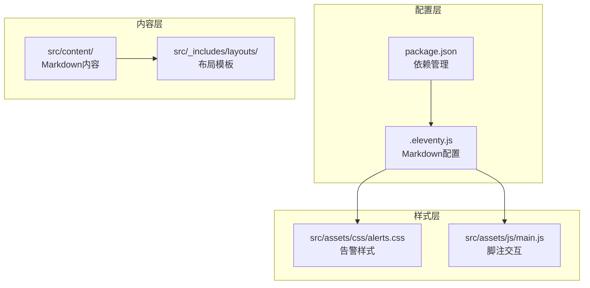
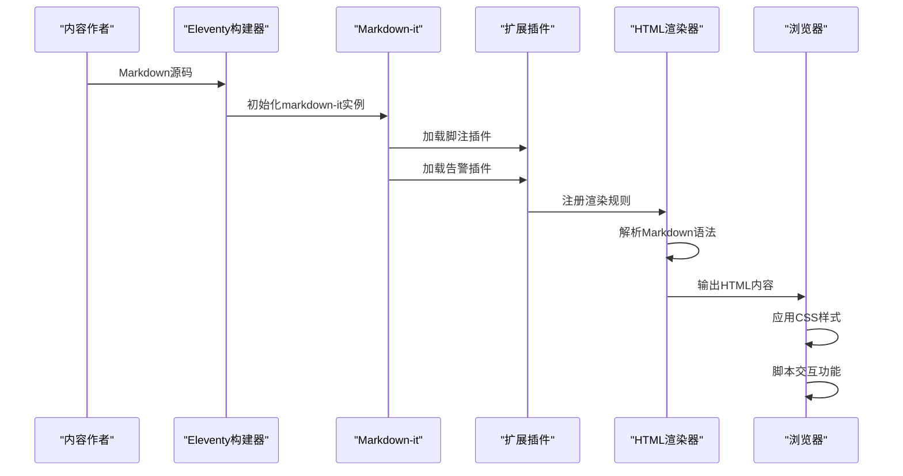
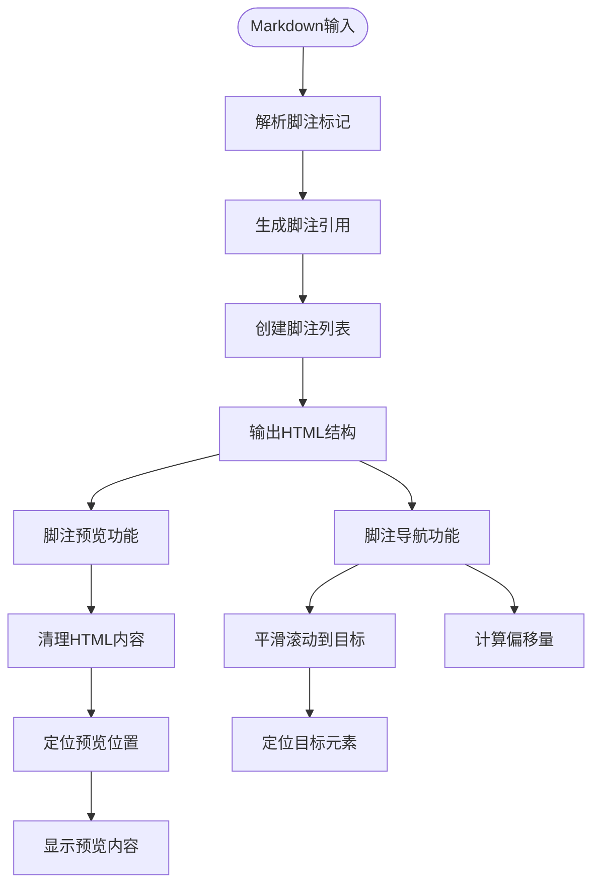
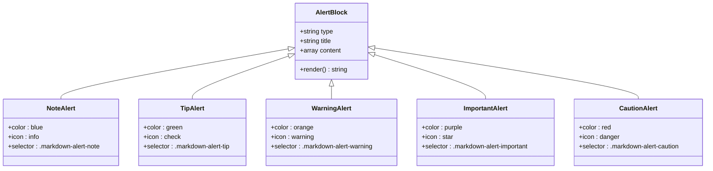
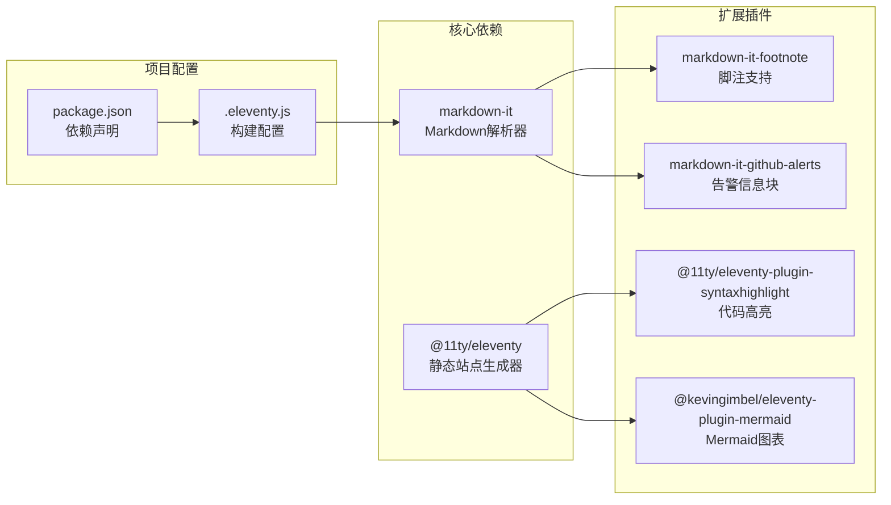

# Markdown扩展功能

<cite>
**本文档引用的文件**
- [.eleventy.js](file://.eleventy.js)
- [package.json](file://package.json)
- [src/assets/css/alerts.css](file://src/assets/css/alerts.css)
- [src/assets/js/main.js](file://src/assets/js/main.js)
- [src/content/pages/archive.njk](file://src/content/pages/archive.njk)
- [src/content/pages/index.njk](file://src/content/pages/index.njk)
</cite>

## 目录
1. [简介](#简介)
2. [项目结构](#项目结构)
3. [核心组件](#核心组件)
4. [架构概览](#架构概览)
5. [详细组件分析](#详细组件分析)
6. [依赖关系分析](#依赖关系分析)
7. [性能考虑](#性能考虑)
8. [故障排除指南](#故障排除指南)
9. [结论](#结论)

## 简介

本项目实现了两个重要的Markdown扩展功能：脚注支持和GitHub风格的告警信息块。这些功能通过markdown-it插件生态系统实现，为内容创作者提供了更丰富的文档表达能力。

项目采用Eleventy静态站点生成器，通过自定义的Markdown配置启用这些扩展功能。脚注功能允许在文档中添加学术性引用，而GitHub告警功能则提供了视觉化的信息分组，包括注意、提示、警告、重要和危险等不同类型。

## 项目结构

项目采用标准的Eleventy项目结构，Markdown扩展功能主要集中在配置文件和样式文件中：

**图表来源**
- [.eleventy.js:166-177](file://.eleventy.js#L166-L177)
- [package.json:22-27](file://package.json#L22-L27)

**章节来源**
- [.eleventy.js:166-177](file://.eleventy.js#L166-L177)
- [package.json:22-27](file://package.json#L22-L27)

## 核心组件

### Markdown-it配置

项目通过Eleventy的setLibrary方法配置了自定义的markdown-it实例，启用了HTML支持、硬换行和链接识别功能。

### 插件集成

系统集成了两个关键的markdown-it插件：
- **markdown-it-footnote**: 提供脚注标记、引用和脚注列表生成功能
- **markdown-it-github-alerts**: 实现GitHub风格的告警信息块渲染

### 样式系统

配套的CSS样式文件为告警信息块提供了完整的视觉设计，包括颜色主题、响应式布局和暗色模式支持。

**章节来源**
- [.eleventy.js:166-177](file://.eleventy.js#L166-L177)
- [src/assets/css/alerts.css:1-156](file://src/assets/css/alerts.css#L1-156)

## 架构概览

**图表来源**
- [.eleventy.js:166-177](file://.eleventy.js#L166-L177)
- [src/assets/js/main.js:280-455](file://src/assets/js/main.js#L280-L455)

## 详细组件分析

### 脚注系统

#### 语法实现

脚注功能通过markdown-it-footnote插件实现，支持标准的脚注标记、引用和列表生成：

**图表来源**
- [src/assets/js/main.js:280-455](file://src/assets/js/main.js#L280-L455)

#### 脚注预览功能

系统实现了智能的脚注预览功能，提供用户体验友好的交互：

- **悬停预览**: 用户将鼠标悬停在脚注引用上时显示完整内容
- **键盘导航**: 支持Tab键导航和Esc键关闭
- **响应式定位**: 自动调整预览框位置以适应屏幕边界
- **无障碍支持**: 包含ARIA属性和语义化标记

#### 脚注导航功能

提供便捷的脚注跳转功能：

- **双向导航**: 支持从引用跳转到脚注，从脚注返回引用
- **平滑滚动**: 自动调整页面滚动位置
- **偏移计算**: 考虑导航栏高度的精确定位

**章节来源**
- [src/assets/js/main.js:280-455](file://src/assets/js/main.js#L280-L455)

### GitHub告警系统

#### 语法支持

告警功能通过markdown-it-github-alerts插件实现，支持多种类型的信息块：

**图表来源**
- [src/assets/css/alerts.css:48-96](file://src/assets/css/alerts.css#L48-L96)

#### 样式设计

每种告警类型都有独特的视觉设计：

| 类型 | 颜色主题 | 左侧边框 | 背景色 | 标题颜色 |
|------|----------|----------|--------|----------|
| Note (注意) | 蓝色系 | #0969da | rgba(9, 105, 218, 0.05) | #0969da |
| Tip (提示) | 绿色系 | #1a7f37 | rgba(26, 127, 55, 0.05) | #1a7f37 |
| Warning (警告) | 橙黄色系 | #9a6700 | rgba(154, 103, 0, 0.05) | #9a6700 |
| Important (重要) | 紫色系 | #8250df | rgba(130, 80, 223, 0.05) | #8250df |
| Caution (危险) | 红色系 | #d1242f | rgba(209, 36, 47, 0.05) | #d1242f |

#### 暗色模式适配

系统完全支持暗色模式，所有告警类型都有相应的深色主题变体：

- **增强对比度**: 在暗色背景下提高可读性
- **柔和色彩**: 使用更柔和的颜色混合
- **统一风格**: 保持与亮色模式一致的设计语言

**章节来源**
- [src/assets/css/alerts.css:1-156](file://src/assets/css/alerts.css#L1-L156)

## 依赖关系分析

**图表来源**
- [package.json:22-33](file://package.json#L22-L33)
- [.eleventy.js:40-49](file://.eleventy.js#L40-L49)

**章节来源**
- [package.json:22-33](file://package.json#L22-L33)
- [.eleventy.js:40-49](file://.eleventy.js#L40-L49)

## 性能考虑

### 构建时优化

- **插件加载**: 仅在构建时加载必要的插件，避免运行时开销
- **缓存策略**: 利用Eleventy的内置缓存机制
- **资源优化**: 构建过程中自动优化CSS和JavaScript

### 运行时性能

- **懒加载**: 脚注预览功能采用惰性初始化
- **事件节流**: 防止频繁的DOM操作影响性能
- **内存管理**: 正确清理事件监听器和DOM节点

## 故障排除指南

### 常见问题

#### 脚注功能异常

**症状**: 脚注引用无法正常显示或点击无反应

**解决方案**:
1. 检查脚注标记是否正确闭合
2. 确认脚注内容包含有效的HTML结构
3. 验证CSS样式文件已正确加载

#### 告警样式显示异常

**症状**: 告警信息块显示为纯文本而非样式化块

**解决方案**:
1. 确认alerts.css文件路径正确
2. 检查CSS选择器是否被其他样式覆盖
3. 验证暗色模式切换功能正常

#### 构建失败

**症状**: 构建过程中出现插件相关错误

**解决方案**:
1. 更新npm包到最新版本
2. 检查插件兼容性
3. 清理node_modules并重新安装

**章节来源**
- [src/assets/js/main.js:280-455](file://src/assets/js/main.js#L280-L455)
- [src/assets/css/alerts.css:1-156](file://src/assets/css/alerts.css#L1-L156)

## 结论

本项目成功集成了两个强大的Markdown扩展功能，显著提升了内容创作的表达能力和用户体验。脚注系统提供了学术性和专业性的引用支持，而GitHub告警系统则增强了信息传达的效果。

通过合理的架构设计和样式适配，这些功能既保持了良好的性能表现，又提供了丰富的交互体验。项目结构清晰，易于维护和扩展，为后续的功能增强奠定了坚实的基础。