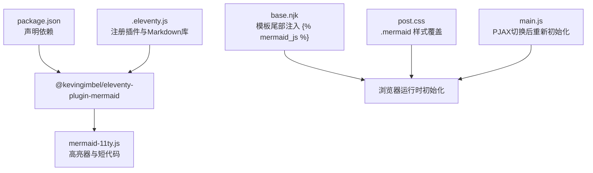
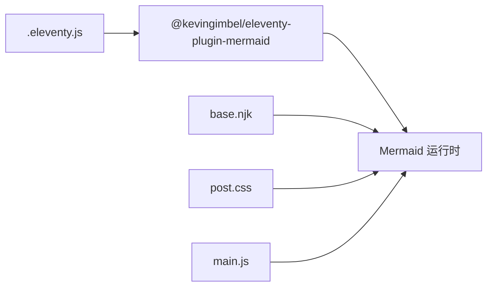

# Mermaid图表支持

<cite>
**本文引用的文件**
- [package.json](file://package.json)
- [.eleventy.js](file://.eleventy.js)
- [mermaid-11ty.js](file://node_modules/@kevingimbel/eleventy-plugin-mermaid/mermaid-11ty.js)
- [README.md（Mermaid 插件）](file://node_modules/@kevingimbel/eleventy-plugin-mermaid/README.md)
- [base.njk](file://src/_includes/layouts/base.njk)
- [post.njk](file://src/_includes/layouts/post.njk)
- [head.njk](file://src/_includes/headers/head.njk)
- [post.css](file://src/assets/css/pages/post.css)
- [main.js](file://src/assets/js/main.js)
- [markdown-syntax-test@sxjf.md](file://src/content/posts/资源下载/markdown-syntax-test@sxjf.md)
</cite>

## 目录
1. [简介](#简介)
2. [项目结构](#项目结构)
3. [核心组件](#核心组件)
4. [架构总览](#架构总览)
5. [组件详解](#组件详解)
6. [依赖关系分析](#依赖关系分析)
7. [性能考量](#性能考量)
8. [故障排查指南](#故障排查指南)
9. [结论](#结论)
10. [附录](#附录)

## 简介
本文件系统性介绍 @kevingimbel/eleventy-plugin-mermaid 在本项目中的安装、配置与使用方法，覆盖以下方面：
- 安装与启用步骤
- 在 Markdown 中编写 Mermaid 图表的语法要点（流程图、时序图、甘特图、类图等）
- 渲染机制与初始化流程
- 性能优化策略（懒加载、按需初始化、主题与样式适配）
- 实际图表示例与最佳实践
- 在不同页面类型（文章页、案例页等）中的应用建议

## 项目结构
本项目通过 Eleventy 的插件机制集成 Mermaid，并在模板中注入 Mermaid 初始化脚本；同时在文章样式中为 Mermaid 图表提供适配的 CSS。



**图示来源**
- [package.json:1-35](file://package.json#L1-L35)
- [.eleventy.js:36-49](file://.eleventy.js#L36-L49)
- [mermaid-11ty.js:1-25](file://node_modules/@kevingimbel/eleventy-plugin-mermaid/mermaid-11ty.js#L1-L25)
- [base.njk:17](file://src/_includes/layouts/base.njk#L17)
- [post.css:459-473](file://src/assets/css/pages/post.css#L459-L473)
- [main.js:1443-1447](file://src/assets/js/main.js#L1443-L1447)

**章节来源**
- [package.json:22-28](file://package.json#L22-L28)
- [.eleventy.js:36-49](file://.eleventy.js#L36-L49)
- [base.njk:17](file://src/_includes/layouts/base.njk#L17)

## 核心组件
- 插件入口与配置
  - 插件通过异步导入并在 Eleventy 配置中注册，同时设置 Markdown 库与高亮器。
  - 默认使用 CDN 加载 Mermaid ESM 模块，并通过短代码输出初始化脚本。
- 模板集成
  - 在基础布局模板尾部插入 ``，确保页面加载完成后初始化 Mermaid。
- 样式适配
  - 文章页样式针对 `.mermaid` 及其内部 SVG 提供透明背景、居中与无边框阴影的默认样式。
- 运行时初始化
  - 主脚本在页面加载完成时调用 `mermaid.initialize(...)`，并在 PJAX 切换后重新扫描并初始化新内容中的图表。

**章节来源**
- [.eleventy.js:36-49](file://.eleventy.js#L36-L49)
- [mermaid-11ty.js:3-12](file://node_modules/@kevingimbel/eleventy-plugin-mermaid/mermaid-11ty.js#L3-L12)
- [base.njk:17](file://src/_includes/layouts/base.njk#L17)
- [post.css:459-473](file://src/assets/css/pages/post.css#L459-L473)
- [main.js:1443-1447](file://src/assets/js/main.js#L1443-L1447)

## 架构总览
下图展示了从 Markdown 代码块到浏览器渲染的完整链路：

```mermaid
sequenceDiagram
participant MD as "Markdown 源文件"
participant HL as "Eleventy 高亮器<br/>mermaid-11ty.js"
participant TPL as "Nunjucks 模板<br/>base.njk"
participant DOM as "页面DOM"
participant INIT as "Mermaid 初始化<br/>mermaid.initialize()"
participant RUNTIME as "Mermaid 运行时"
MD->>HL : "
```mermaid ... ```"
  HL-->>DOM: "渲染为 <pre class='mermaid'>...</pre>"
  TPL-->>DOM: " 注入脚本"
  DOM->>INIT: "DOMContentLoaded 触发"
  INIT->>RUNTIME: "initialize(配置)"
  RUNTIME-->>DOM: "将代码块渲染为 SVG 图表"
```

**图示来源**
- [mermaid-11ty.js:14-22](file://node_modules/@kevingimbel/eleventy-plugin-mermaid/mermaid-11ty.js#L14-L22)
- [base.njk:17](file://src/_includes/layouts/base.njk#L17)
- [mermaid-11ty.js:10-11](file://node_modules/@kevingimbel/eleventy-plugin-mermaid/mermaid-11ty.js#L10-L11)

## 组件详解

### 安装与启用
- 依赖安装：插件已在依赖中声明，安装后即可在 Eleventy 配置中注册。
- 注册方式：在配置文件中动态导入并添加插件。
- Markdown 库：同时配置了 markdown-it 并启用脚注与 GitHub 类告警扩展。

**章节来源**
- [package.json:22-28](file://package.json#L22-L28)
- [.eleventy.js:36-49](file://.eleventy.js#L36-L49)
- [.eleventy.js:159-170](file://.eleventy.js#L159-L170)

### 配置项与默认行为
- 默认加载源：CDN（ESM 模块），可通过选项覆盖。
- 包装标签与额外类：默认使用 `pre` 标签包裹，可改为 `div` 并附加自定义类。
- 初始化配置：默认启用 `loadOnSave`（插件内部合并），可通过 `mermaid_config` 传入更多参数。
- 短代码输出：`` 输出带 `type="module"` 的脚本，并在 DOMContentLoaded 时初始化。

**章节来源**
- [mermaid-11ty.js:5-12](file://node_modules/@kevingimbel/eleventy-plugin-mermaid/mermaid-11ty.js#L5-L12)
- [README.md（Mermaid 插件）:56-85](file://node_modules/@kevingimbel/eleventy-plugin-mermaid/README.md#L56-L85)

### 在模板中注入初始化脚本
- 在基础布局的 `</body>` 前插入 ``，确保页面加载完成后自动初始化 Mermaid。
- 若采用本地资源，可在插件配置中指定 `mermaid_js_src` 为本地路径。

**章节来源**
- [base.njk:17](file://src/_includes/layouts/base.njk#L17)
- [README.md（Mermaid 插件）:40-54](file://node_modules/@kevingimbel/eleventy-plugin-mermaid/README.md#L40-L54)

### 样式与主题适配
- 默认样式：文章页 CSS 对 `.mermaid` 与内部 SVG 设置透明背景、无边框与居中显示。
- 主题适配：可通过 `mermaid_config` 传入主题（如 dark），或在单个图表中使用内联初始化配置覆盖。
- 自定义包装标签：若希望使用 `div` 包裹，可在插件配置中设置 `html_tag`。

**章节来源**
- [post.css:459-473](file://src/assets/css/pages/post.css#L459-L473)
- [README.md（Mermaid 插件）:68-85](file://node_modules/@kevingimbel/eleventy-plugin-mermaid/README.md#L68-L85)
- [mermaid-11ty.js:5-6](file://node_modules/@kevingimbel/eleventy-plugin-mermaid/mermaid-11ty.js#L5-L6)

### 运行时初始化与 PJAX 支持
- 页面初始化：Mermaid 在 DOMContentLoaded 时被初始化。
- 内容切换：PJAX 切换后，主脚本会重新查找并初始化页面中的 `.mermaid` 元素，保证 SPA 场景下的图表可用。

**章节来源**
- [mermaid-11ty.js:10-11](file://node_modules/@kevingimbel/eleventy-plugin-mermaid/mermaid-11ty.js#L10-L11)
- [main.js:1443-1447](file://src/assets/js/main.js#L1443-L1447)

### 在 Markdown 中编写 Mermaid 图表
- 语法：使用围栏代码块并指定语言为 `mermaid`。
- 常见类型：流程图、时序图、甘特图、类图、状态图、实体关系图等。
- 内联配置：可在图表代码块中使用 `%%{init: {...}}%%` 形式进行局部主题或参数覆盖。
- 示例参考：项目中存在 Markdown 语法测试文件，可作为书写规范与排版参考。

**章节来源**
- [README.md（Mermaid 插件）:103-115](file://node_modules/@kevingimbel/eleventy-plugin-mermaid/README.md#L103-L115)
- [README.md（Mermaid 插件）:87-102](file://node_modules/@kevingimbel/eleventy-plugin-mermaid/README.md#L87-L102)
- [markdown-syntax-test@sxjf.md:1-26](file://src/content/posts/资源下载/markdown-syntax-test@sxjf.md#L1-L26)

### 不同页面类型中的应用建议
- 文章页面（post）：适用于技术说明、架构设计、流程梳理等场景；可配合文章样式与 PJAX 切换保持图表可用。
- 案例页面：适合展示项目流程、用户旅程或阶段性成果（甘特图）。
- 说明页/FAQ：适合用流程图或时序图解释规则与步骤。
- 注意事项：尽量控制图表复杂度，避免过多图表导致页面体积与渲染压力过大。

**章节来源**
- [post.njk:1-49](file://src/_includes/layouts/post.njk#L1-L49)
- [main.js:1443-1447](file://src/assets/js/main.js#L1443-L1447)

## 依赖关系分析
- 外部依赖
  - @kevingimbel/eleventy-plugin-mermaid：提供 Mermaid 集成能力（高亮器、短代码、默认初始化脚本）。
  - mermaid（CDN/本地）：图表渲染运行时。
- 内部依赖
  - Eleventy 配置：注册插件、设置 Markdown 库、全局数据与集合。
  - 模板：在基础布局中注入初始化脚本。
  - 样式：为图表提供默认样式覆盖。
  - 主脚本：在 PJAX 切换后重新初始化图表。



**图示来源**
- [package.json:22-28](file://package.json#L22-L28)
- [.eleventy.js:36-49](file://.eleventy.js#L36-L49)
- [base.njk:17](file://src/_includes/layouts/base.njk#L17)
- [post.css:459-473](file://src/assets/css/pages/post.css#L459-L473)
- [main.js:1443-1447](file://src/assets/js/main.js#L1443-L1447)

**章节来源**
- [package.json:22-28](file://package.json#L22-L28)
- [.eleventy.js:36-49](file://.eleventy.js#L36-L49)

## 性能考量
- 按需加载与懒初始化
  - 使用 `` 会在 DOMContentLoaded 时初始化，避免阻塞首屏。
  - 在 PJAX 切换后仅初始化新增内容中的图表，减少重复初始化开销。
- 资源加载
  - 默认使用 CDN，加载速度快但受网络影响；可配置为本地资源以提升稳定性与离线可用性。
- 图表复杂度控制
  - 复杂图表会增加渲染时间与内存占用，建议拆分或延迟展示。
- 样式最小化
  - 已对图表容器与 SVG 设置透明背景与居中，避免额外重绘与阴影开销。

**章节来源**
- [mermaid-11ty.js:10-11](file://node_modules/@kevingimbel/eleventy-plugin-mermaid/mermaid-11ty.js#L10-L11)
- [main.js:1443-1447](file://src/assets/js/main.js#L1443-L1447)
- [README.md（Mermaid 插件）:61-66](file://node_modules/@kevingimbel/eleventy-plugin-mermaid/README.md#L61-L66)

## 故障排查指南
- 图表不显示
  - 确认模板中已插入 ``。
  - 检查浏览器控制台是否存在脚本加载失败（CDN 或本地路径问题）。
  - 确认 Markdown 代码块语言为 `mermaid`。
- 主题不生效
  - 检查 `mermaid_config` 是否正确传入主题参数。
  - 单个图表可使用内联初始化配置覆盖默认主题。
- PJAX 切换后图表丢失
  - 确认主脚本已调用重新初始化逻辑；检查选择器与作用域是否正确。
- 样式异常
  - 检查文章页样式中对 `.mermaid` 与 SVG 的覆盖是否被其他样式覆盖。

**章节来源**
- [base.njk:17](file://src/_includes/layouts/base.njk#L17)
- [README.md（Mermaid 插件）:87-102](file://node_modules/@kevingimbel/eleventy-plugin-mermaid/README.md#L87-L102)
- [main.js:1443-1447](file://src/assets/js/main.js#L1443-L1447)
- [post.css:459-473](file://src/assets/css/pages/post.css#L459-L473)

## 结论
本项目通过 @kevingimbel/eleventy-plugin-mermaid 将 Mermaid 图表无缝集成到 Eleventy 工作流中：插件负责将 `mermaid` 代码块转换为可渲染元素并提供初始化脚本短代码；模板在页面加载完成后自动初始化；文章样式与主脚本进一步保障了图表在 SPA 场景下的可用性与视觉一致性。结合合理的配置与样式覆盖，可在文章、案例等页面高效地呈现各类图表。

## 附录

### 快速上手清单
- 安装插件并加入 Eleventy 配置
- 在模板中插入 ``
- 在 Markdown 中使用 `mermaid` 代码块编写图表
- 如需主题或本地资源，通过插件配置项调整
- 在 PJAX 场景下无需额外处理，主脚本会自动重新初始化

**章节来源**
- [.eleventy.js:36-49](file://.eleventy.js#L36-L49)
- [base.njk:17](file://src/_includes/layouts/base.njk#L17)
- [README.md（Mermaid 插件）:22-54](file://node_modules/@kevingimbel/eleventy-plugin-mermaid/README.md#L22-L54)