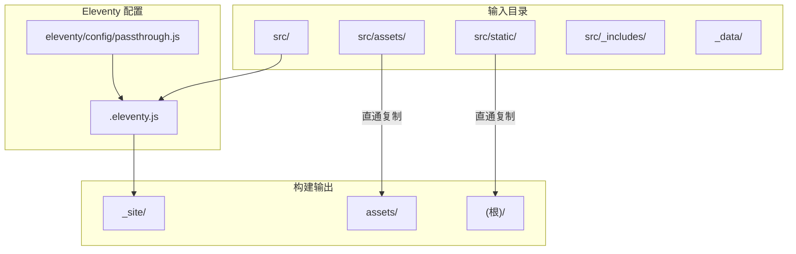
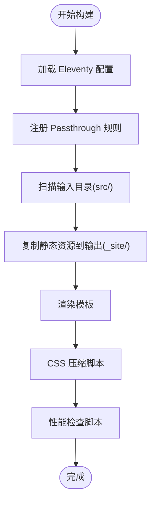
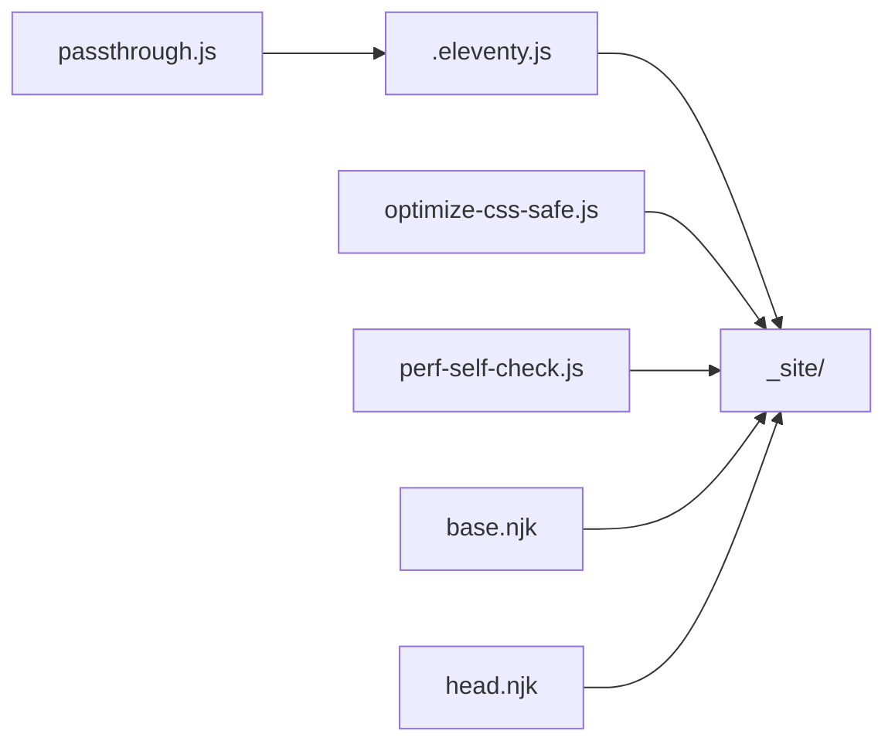

# Passthrough文件处理

<cite>
**本文引用的文件**
- [.eleventy.js](file://.eleventy.js)
- [eleventy/config/passthrough.js](file://eleventy/config/passthrough.js)
- [src/_includes/layouts/base.njk](file://src/_includes/layouts/base.njk)
- [src/_includes/partials/head.njk](file://src/_includes/partials/head.njk)
- [src/assets/css/style.css](file://src/assets/css/style.css)
- [src/static/robots.txt](file://src/static/robots.txt)
- [scripts/optimize-css-safe.js](file://scripts/optimize-css-safe.js)
- [scripts/perf-self-check.js](file://scripts/perf-self-check.js)
- [package.json](file://package.json)
</cite>

## 目录
1. [引言](#引言)
2. [项目结构](#项目结构)
3. [核心组件](#核心组件)
4. [架构总览](#架构总览)
5. [详细组件分析](#详细组件分析)
6. [依赖关系分析](#依赖关系分析)
7. [性能考量](#性能考量)
8. [故障排查指南](#故障排查指南)
9. [结论](#结论)
10. [附录](#附录)

## 引言
本文件系统性阐述 Eleventy 的 Passthrough Copy（直通复制）机制与静态资源处理策略，聚焦于以下目标：
- 解释 passthroughPaths 配置与文件复制规则
- 说明静态资源如何保留原路径与文件名
- 提供图片、字体、音频等资源的处理示例与建议
- 介绍资源优化与压缩策略（含构建脚本）
- 描述构建过程中文件处理流程
- 讨论与主题系统的关系及资源加载机制

## 项目结构
本项目采用“输入/输出/包含”三层目录组织，配合 Eleventy 的直通复制策略，将开发目录中的静态资源直接复制到构建输出目录中，保持资源路径与命名不变。



图表来源
- [.eleventy.js:12-30](file://.eleventy.js#L12-L30)
- [eleventy/config/passthrough.js:1-6](file://eleventy/config/passthrough.js#L1-L6)

章节来源
- [.eleventy.js:147-156](file://.eleventy.js#L147-L156)
- [eleventy/config/passthrough.js:1-6](file://eleventy/config/passthrough.js#L1-L6)

## 核心组件
- Passthrough 配置：定义需要直通复制的路径映射，确保构建时将指定目录下的资源原样复制到输出目录。
- 构建入口：Eleventy 配置文件注册 Passthrough 规则，并设置输入/输出目录。
- 资源引用：模板通过绝对路径引用直通复制后的静态资源，如样式、脚本、媒体与元数据文件。

章节来源
- [eleventy/config/passthrough.js:1-6](file://eleventy/config/passthrough.js#L1-L6)
- [.eleventy.js:12-30](file://.eleventy.js#L12-L30)
- [.eleventy.js:147-156](file://.eleventy.js#L147-L156)

## 架构总览
下图展示了从配置到构建输出的直通复制流程，以及模板如何引用这些资源。

```mermaid
sequenceDiagram
participant Dev as "开发者"
participant Config as "Eleventy 配置(.eleventy.js)"
participant Passthrough as "Passthrough 配置(passthrough.js)"
participant FS as "文件系统"
participant Builder as "Eleventy 构建器"
participant Site as "_site 输出"
Dev->>Config : 启动构建命令
Config->>Passthrough : 读取 passthroughPaths
Config->>Builder : 注册直通复制规则
Builder->>FS : 扫描输入目录(src/)
FS-->>Builder : 返回匹配文件列表
Builder->>Site : 复制文件至输出目录
Note over Builder,Site : 保留原始相对路径与文件名
Dev->>Template as "模板(.njk)"
Template->>Site : 以绝对路径引用资源
```

图表来源
- [.eleventy.js:26](file://.eleventy.js#L26)
- [eleventy/config/passthrough.js:1-6](file://eleventy/config/passthrough.js#L1-L6)

## 详细组件分析

### Passthrough 配置与复制规则
- 配置项 passthroughPaths 定义了两组直通复制规则：
  - 将 src/assets 下的资源复制到输出目录的 assets 子目录
  - 将 src/static 下的资源复制到输出目录根路径
- Eleventy 在初始化阶段遍历该数组，逐条调用 addPassthroughCopy 注册复制任务。
- 复制行为遵循“保留原路径”的原则：例如 src/assets/css/a.css 将被复制为 _site/assets/css/a.css；src/static/robots.txt 将被复制为 _site/robots.txt。

章节来源
- [eleventy/config/passthrough.js:1-6](file://eleventy/config/passthrough.js#L1-L6)
- [.eleventy.js:26](file://.eleventy.js#L26)

### 构建入口与目录映射
- 输入/输出目录由配置统一管理，输入目录为 src，输出目录为 _site。
- 这一映射决定了所有 Eleventy 处理的起点与终点，而 Passthrough 则在此基础上进行额外的静态资源复制。

章节来源
- [.eleventy.js:147-156](file://.eleventy.js#L147-L156)

### 资源引用与主题系统的关系
- 模板通过绝对路径引用直通复制后的资源，如样式与脚本：
  - 样式：在 head 片段中引入多个 CSS 文件，并在页面级内容中追加页面专用样式
  - 脚本：在基础布局中引入站点脚本与第三方图标库
- 主题系统通过 data 层与模板层协作，但静态资源的加载路径完全由直通复制后的输出结构决定，模板只需使用绝对路径即可正确加载。

章节来源
- [src/_includes/partials/head.njk:1-26](file://src/_includes/partials/head.njk#L1-L26)
- [src/_includes/layouts/base.njk:1-19](file://src/_includes/layouts/base.njk#L1-L19)

### 典型资源类型与处理示例
- 图片资源
  - 放置位置：src/assets/images 或 src/assets/media
  - 复制规则：按原路径复制到 _site/assets/images 或 _site/assets/media
  - 使用方式：在模板中以绝对路径引用，如 /assets/images/logo.png
- 字体资源
  - 放置位置：src/assets/fonts 或 src/static/fonts
  - 复制规则：字体文件将被复制到输出目录对应路径
  - 使用方式：在 CSS 中通过本地路径或 CDN 引用
- 音频/视频资源
  - 放置位置：src/assets/media
  - 复制规则：按原路径复制到 _site/assets/media
  - 使用方式：在模板中以绝对路径引用，如 /assets/media/intro.mp3
- 元数据文件
  - 放置位置：src/static
  - 复制规则：如 robots.txt 将复制到 _site/robots.txt
  - 使用方式：浏览器可直接访问

章节来源
- [src/static/robots.txt:1-2](file://src/static/robots.txt#L1-L2)
- [src/_includes/partials/head.njk:5-7](file://src/_includes/partials/head.njk#L5-L7)

### 构建流程与文件处理
- 初始化：Eleventy 读取 .eleventy.js，注册插件与 Passthrough 规则
- 扫描：构建器扫描输入目录，识别需直通复制的文件
- 复制：根据 passthroughPaths 规则将文件复制到输出目录，保持原路径与文件名
- 模板渲染：模板通过绝对路径引用直通复制后的资源
- 后处理：构建脚本对 CSS 进行安全压缩，并进行性能检查



图表来源
- [.eleventy.js:12-30](file://.eleventy.js#L12-L30)
- [scripts/optimize-css-safe.js:82-112](file://scripts/optimize-css-safe.js#L82-L112)
- [scripts/perf-self-check.js:170-199](file://scripts/perf-self-check.js#L170-L199)

## 依赖关系分析
- Eleventy 配置依赖 Passthrough 配置导出的规则数组
- 构建脚本依赖构建产物目录结构（_site/assets/css）
- 模板依赖绝对路径引用直通复制后的资源



图表来源
- [eleventy/config/passthrough.js:1-6](file://eleventy/config/passthrough.js#L1-L6)
- [.eleventy.js:26](file://.eleventy.js#L26)
- [scripts/optimize-css-safe.js:4](file://scripts/optimize-css-safe.js#L4)
- [scripts/perf-self-check.js:8](file://scripts/perf-self-check.js#L8)
- [src/_includes/layouts/base.njk:16](file://src/_includes/layouts/base.njk#L16)
- [src/_includes/partials/head.njk:8-11](file://src/_includes/partials/head.njk#L8-L11)

章节来源
- [package.json:6-16](file://package.json#L6-L16)

## 性能考量
- CSS 压缩
  - 脚本会递归扫描 _site/assets/css 下的所有 .css 文件，移除注释并进行安全压缩，最后写回原文件
  - 压缩前后字节统计与节省比例会在控制台输出
- 性能检查
  - 脚本遍历 _site 目录，统计 HTML/CSS/JS/图像/字体等类型的大小与 gzip 后大小
  - 对比预算阈值，输出报告并给出总体通过状态
- 建议
  - 图片优先使用现代格式（如 WebP/AVIF），并在模板中提供多尺寸与懒加载
  - 字体文件尽量使用子集化与预连接策略
  - 合理拆分与缓存策略，避免单个 CSS 过大

章节来源
- [scripts/optimize-css-safe.js:82-112](file://scripts/optimize-css-safe.js#L82-L112)
- [scripts/perf-self-check.js:10-15](file://scripts/perf-self-check.js#L10-L15)
- [scripts/perf-self-check.js:170-199](file://scripts/perf-self-check.js#L170-L199)

## 故障排查指南
- 资源 404
  - 确认资源是否位于 src/assets 或 src/static
  - 确认模板引用的是绝对路径（如 /assets/... 或 /...）
  - 确认构建命令已执行且未报错
- 路径不匹配
  - 若期望资源出现在输出根目录，请使用 passthroughPaths 的根路径映射
  - 若期望资源出现在 assets 子目录，请使用 assets 映射
- CSS 未生效
  - 检查构建后 _site/assets/css 是否存在目标文件
  - 确认模板 head 片段中已正确引入对应 CSS
- 性能检查失败
  - 关注报告中最大单文件与各类别总大小，针对性优化
  - 使用现代图片格式与压缩工具进一步减小体积

章节来源
- [src/_includes/partials/head.njk:8-11](file://src/_includes/partials/head.njk#L8-L11)
- [src/_includes/layouts/base.njk:16](file://src/_includes/layouts/base.njk#L16)
- [scripts/perf-self-check.js:170-199](file://scripts/perf-self-check.js#L170-L199)

## 结论
本项目的 Passthrough 文件处理机制通过简洁的配置实现了静态资源的可靠复制，模板仅需使用绝对路径即可加载资源。结合构建后的 CSS 压缩与性能检查脚本，可在保证可用性的前提下持续优化资源体积与加载表现。对于图片、字体、音视频等资源，建议遵循“放置于 src/assets 或 src/static，保持原路径”的原则，以获得一致的复制与引用体验。

## 附录
- 构建脚本入口
  - 构建：执行构建命令后，自动运行 CSS 压缩与性能检查脚本
  - 单独运行：可分别调用 CSS 压缩与性能检查脚本进行验证

章节来源
- [package.json:6-16](file://package.json#L6-L16)