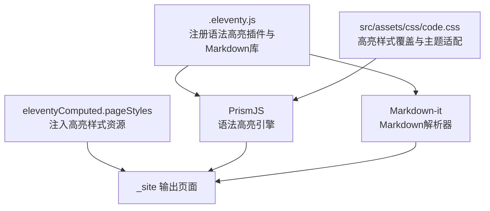
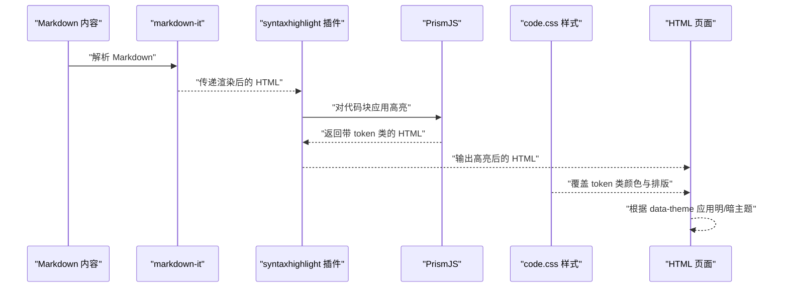
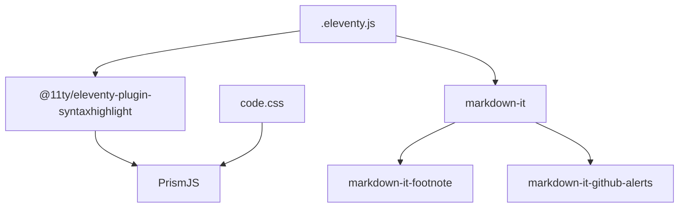

# 代码高亮功能

<cite>
**本文引用的文件**
- [.eleventy.js](file://.eleventy.js)
- [package.json](file://package.json)
- [src/assets/css/code.css](file://src/assets/css/code.css)
- [src/_includes/layouts/base.njk](file://src/_includes/layouts/base.njk)
- [src/_includes/partials/head.njk](file://src/_includes/partials/head.njk)
- [src/content/posts/资源下载/markdown-syntax-test@sxjf.md](file://src/content/posts/资源下载/markdown-syntax-test@sxjf.md)
- [src/content/posts/建站需求篇/建站需求清单：估算更新频率@xfq.md](file://src/content/posts/建站需求篇/建站需求清单：估算更新频率@xfq.md)
- [src/content/posts/开发执行篇/开发排期说明：从确认需求到交付上线@jssx.md](file://src/content/posts/开发执行篇/开发排期说明：从确认需求到交付上线@jssx.md)
- [README.md](file://README.md)
- [docs/本地写作与构建指南.md](file://docs/本地写作与构建指南.md)
</cite>

## 目录
1. [引言](#引言)
2. [项目结构](#项目结构)
3. [核心组件](#核心组件)
4. [架构总览](#架构总览)
5. [组件详解](#组件详解)
6. [依赖关系分析](#依赖关系分析)
7. [性能考量](#性能考量)
8. [故障排查指南](#故障排查指南)
9. [结论](#结论)
10. [附录](#附录)

## 引言
本章节概述项目中代码高亮功能的整体定位与目标。项目通过 Eleventy 的官方语法高亮插件实现 Markdown 代码块的语法高亮渲染，并结合自定义 CSS 主题与暗色模式适配，确保在明/暗主题下均具备良好的可读性与一致性。

## 项目结构
与代码高亮直接相关的结构要点如下：
- Eleventy 插件注册：在配置文件中启用语法高亮插件，并配置 Markdown 库以支持脚注与 GitHub 风格提示框等扩展。
- 样式覆盖：通过站点 CSS 对 PrismJS 输出的 token 类进行颜色与排版覆盖，形成统一的主题风格。
- 主题适配：针对明/暗两种主题提供差异化的 token 颜色映射，保证对比度与可读性。
- 构建集成：在全局数据中注入样式资源路径，确保高亮样式随页面加载。

图表来源
- [.eleventy.js:36-54](file://.eleventy.js#L36-L54)
- [.eleventy.js:159-170](file://.eleventy.js#L159-L170)
- [src/assets/css/code.css:1-285](file://src/assets/css/code.css#L1-L285)

章节来源
- [.eleventy.js:36-54](file://.eleventy.js#L36-L54)
- [.eleventy.js:159-170](file://.eleventy.js#L159-L170)
- [src/assets/css/code.css:1-285](file://src/assets/css/code.css#L1-L285)

## 核心组件
- 语法高亮插件
  - 使用官方插件进行代码块高亮渲染，无需额外配置即可生效。
  - 插件基于 PrismJS 实现，支持多种语言的 token 化与着色。
- Markdown 解析器
  - 使用 markdown-it 并启用脚注与 GitHub 风格提示框扩展，提升内容表达能力。
- 自定义样式层
  - 通过 code.css 对 token 类进行颜色与排版覆盖，统一高亮风格。
  - 提供明/暗主题下的 token 映射，确保在不同主题下保持一致的可读性。
- 构建与资源注入
  - 在 eleventyComputed 中注入高亮样式资源路径，确保页面加载时正确引入。

章节来源
- [.eleventy.js:36-54](file://.eleventy.js#L36-L54)
- [.eleventy.js:159-170](file://.eleventy.js#L159-L170)
- [src/assets/css/code.css:1-285](file://src/assets/css/code.css#L1-L285)

## 架构总览
下图展示了从 Markdown 到最终页面渲染的高亮处理链路，以及样式覆盖与主题适配的参与点。

图表来源
- [.eleventy.js:36-54](file://.eleventy.js#L36-L54)
- [.eleventy.js:159-170](file://.eleventy.js#L159-L170)
- [src/assets/css/code.css:151-284](file://src/assets/css/code.css#L151-L284)

章节来源
- [.eleventy.js:36-54](file://.eleventy.js#L36-L54)
- [.eleventy.js:159-170](file://.eleventy.js#L159-L170)
- [src/assets/css/code.css:151-284](file://src/assets/css/code.css#L151-L284)

## 组件详解

### 语法高亮插件与配置
- 插件启用
  - 在 Eleventy 配置中注册语法高亮插件，即可对 Markdown 代码块进行高亮渲染。
- 语言识别
  - 插件基于 PrismJS 的语言识别机制，通过代码块的语言标识选择对应的 token 类。
- 输出结构
  - 高亮后的代码块会包裹在 pre/code 结构中，并带有 language-* 的类名，便于样式覆盖。

章节来源
- [.eleventy.js:47](file://.eleventy.js#L47)

### Markdown 解析与扩展
- markdown-it 基础配置
  - 启用 HTML 支持、换行转换与链接识别，满足日常内容展示需求。
- 扩展插件
  - 脚注与 GitHub 风格提示框扩展增强内容表达力，与高亮功能协同工作。

章节来源
- [.eleventy.js:159-170](file://.eleventy.js#L159-L170)

### 样式覆盖与主题适配
- 基础样式覆盖
  - 对 token 类进行颜色与排版覆盖，统一高亮风格，确保在明/暗主题下具备良好的对比度。
- 明/暗主题映射
  - 提供 data-theme="dark" 下的 token 颜色映射，降低视觉疲劳并提升长时间阅读体验。
- 行内代码与块级代码
  - 对 :not(pre) > code 与 code[class*="language-"] 进行差异化样式设计，兼顾行内与块级场景。

章节来源
- [src/assets/css/code.css:35-149](file://src/assets/css/code.css#L35-L149)
- [src/assets/css/code.css:151-284](file://src/assets/css/code.css#L151-L284)

### 构建与资源注入
- 样式资源注入
  - 在 eleventyComputed.pageStyles 中注入高亮样式资源路径，确保页面加载时正确引入。
- 输出验证
  - 构建产物中应包含高亮样式资源，页面加载后高亮效果生效。

章节来源
- [.eleventy.js:148-156](file://.eleventy.js#L148-L156)

### Markdown 代码块语法与语言标识
- 语法规范
  - 使用三个反引号加语言标识表示代码块，语言标识用于选择对应的 PrismJS 语言处理器。
- 示例来源
  - 项目中的示例文章展示了如何在 Markdown 中编写代码块，便于验证高亮效果。

章节来源
- [README.md:58-66](file://README.md#L58-L66)
- [docs/本地写作与构建指南.md:33-43](file://docs/本地写作与构建指南.md#L33-L43)

### 常见编程语言示例与高亮效果
- 示例文章
  - 项目中包含多篇示例文章，展示了不同语言的代码块写法与高亮效果。
- 效果验证
  - 通过构建与预览，确认代码块在页面中正确渲染并应用样式。

章节来源
- [src/content/posts/资源下载/markdown-syntax-test@sxjf.md:1-26](file://src/content/posts/资源下载/markdown-syntax-test@sxjf.md#L1-L26)
- [src/content/posts/建站需求篇/建站需求清单：估算更新频率@xfq.md:1-28](file://src/content/posts/建站需求篇/建站需求清单：估算更新频率@xfq.md#L1-L28)
- [src/content/posts/开发执行篇/开发排期说明：从确认需求到交付上线@jssx.md:1-28](file://src/content/posts/开发执行篇/开发排期说明：从确认需求到交付上线@jssx.md#L1-L28)

### 复制功能与用户体验优化
- 复制能力
  - 当前配置未显式启用代码块复制按钮，若需复制功能，可在页面中引入相应的交互脚本并在构建流程中注入。
- 用户体验
  - 通过合理的行高、字间距与滚动条设计，提升代码块的可读性与易用性。
- 主题切换
  - data-theme 属性配合 CSS 变量，实现明/暗主题的无缝切换与一致的高亮表现。

章节来源
- [src/assets/css/code.css:35-149](file://src/assets/css/code.css#L35-L149)
- [src/assets/css/code.css:151-284](file://src/assets/css/code.css#L151-L284)

### 高亮性能优化与缓存策略
- 语言包裁剪
  - 仅保留常用语言的 PrismJS 语言包，减少打包体积与加载时间。
- 样式复用
  - 通过集中式样式覆盖与主题映射，避免重复计算与冗余规则。
- 构建缓存
  - Eleventy 的增量构建与缓存机制可减少重复高亮处理的时间开销。
- 资源版本化
  - 在样式资源路径中加入版本参数，便于浏览器缓存控制与更新管理。

章节来源
- [package.json:22-33](file://package.json#L22-L33)
- [.eleventy.js:148-156](file://.eleventy.js#L148-L156)

## 依赖关系分析
- 插件依赖
  - @11ty/eleventy-plugin-syntaxhighlight 作为语法高亮核心，依赖 PrismJS。
- 样式依赖
  - code.css 依赖于 PrismJS 输出的 token 类，通过类名匹配实现样式覆盖。
- 构建依赖
  - Eleventy 配置依赖 markdown-it 与相关扩展，共同完成 Markdown 到 HTML 的转换。

图表来源
- [package.json:22-33](file://package.json#L22-L33)
- [.eleventy.js:36-54](file://.eleventy.js#L36-L54)
- [src/assets/css/code.css:1-285](file://src/assets/css/code.css#L1-L285)

章节来源
- [package.json:22-33](file://package.json#L22-L33)
- [.eleventy.js:36-54](file://.eleventy.js#L36-L54)
- [src/assets/css/code.css:1-285](file://src/assets/css/code.css#L1-L285)

## 性能考量
- 语言包大小
  - 仅引入必要语言包，避免不必要的体积增长。
- 样式体积
  - 将 token 类覆盖集中在单一样式文件，减少选择器复杂度与重绘成本。
- 构建速度
  - 利用 Eleventy 的增量构建特性，减少重复高亮处理的开销。
- 缓存策略
  - 通过资源版本化与浏览器缓存控制，平衡更新频率与加载性能。

## 故障排查指南
- 高亮未生效
  - 检查是否正确注册语法高亮插件与 Markdown 库。
  - 确认代码块语言标识是否正确，且对应语言包已加载。
- 样式异常
  - 检查 code.css 是否正确引入，确认 token 类名与覆盖规则匹配。
  - 验证 data-theme 属性是否正确设置，以应用暗色主题映射。
- 构建问题
  - 确认构建脚本中已注入高亮样式资源路径，检查输出目录是否存在样式文件。

章节来源
- [.eleventy.js:36-54](file://.eleventy.js#L36-L54)
- [.eleventy.js:148-156](file://.eleventy.js#L148-L156)
- [src/assets/css/code.css:1-285](file://src/assets/css/code.css#L1-L285)

## 结论
本项目通过官方语法高亮插件与自定义样式层的组合，实现了稳定、可维护且具有良好可读性的代码高亮方案。配合明/暗主题适配与构建资源注入，能够在不同环境下提供一致的高亮体验。若需进一步优化，可考虑引入复制功能与更精细的缓存策略。

## 附录
- 代码块语法示例可参考项目中的示例文章，验证高亮效果。
- 若需启用复制功能，可在页面中引入相应脚本并在构建流程中注入。