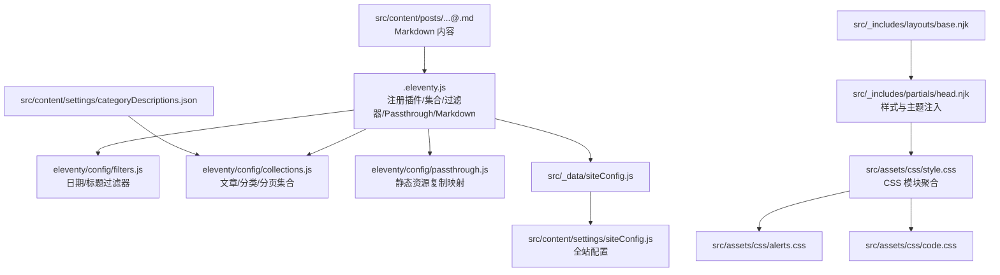
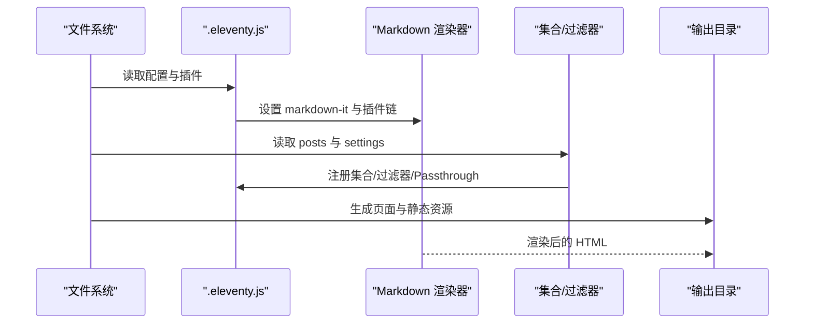
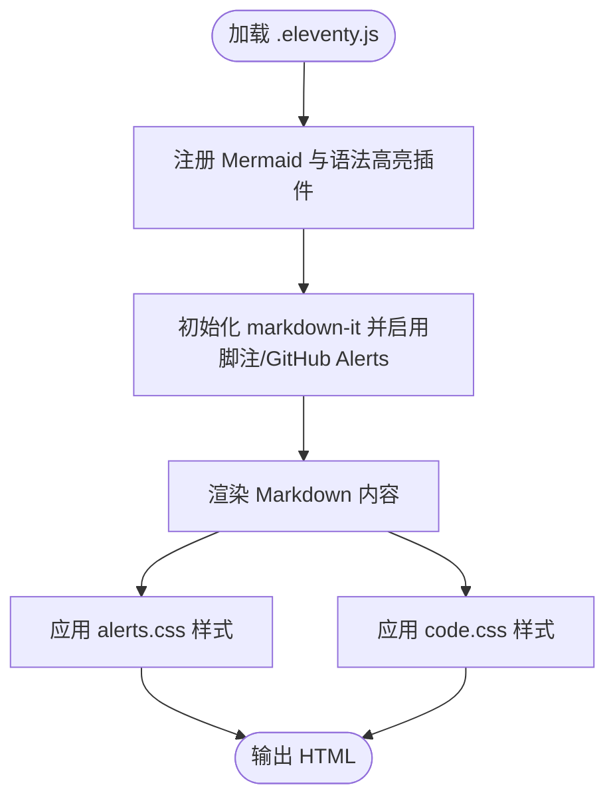
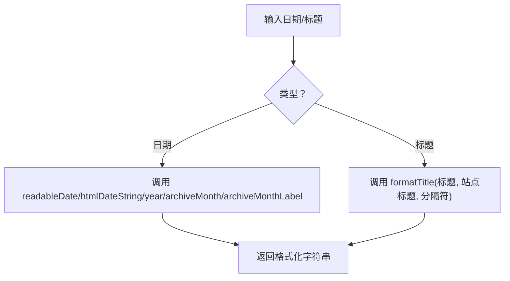
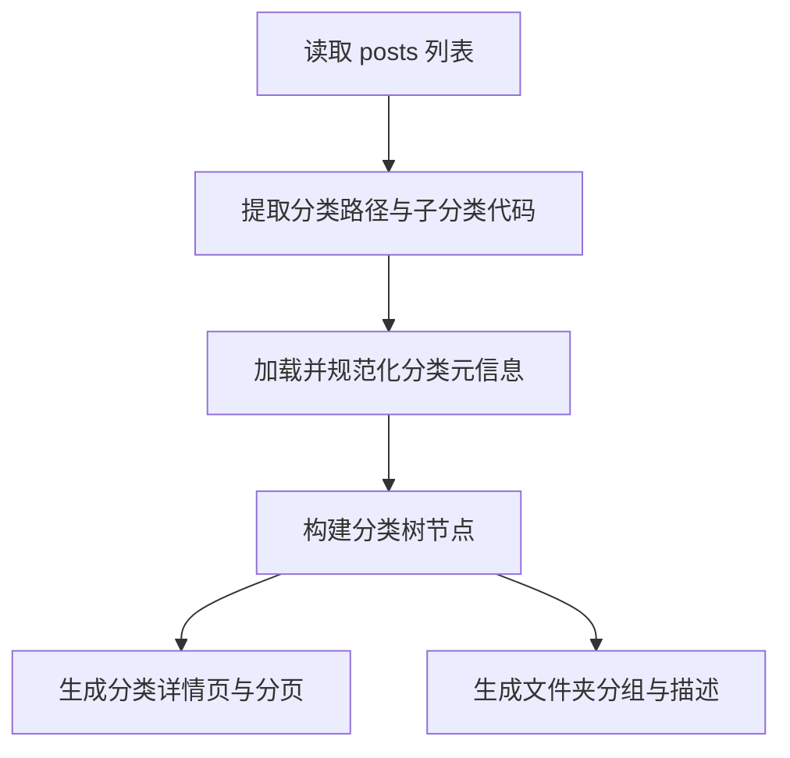
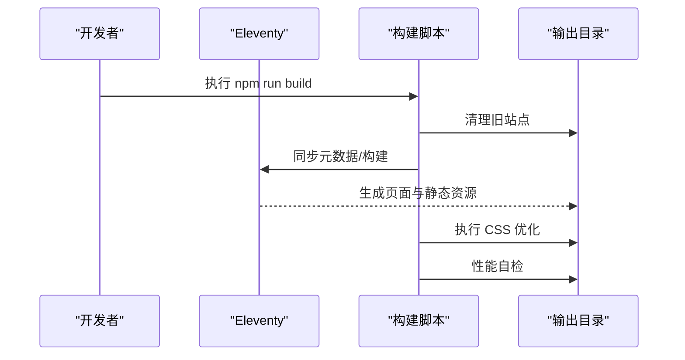
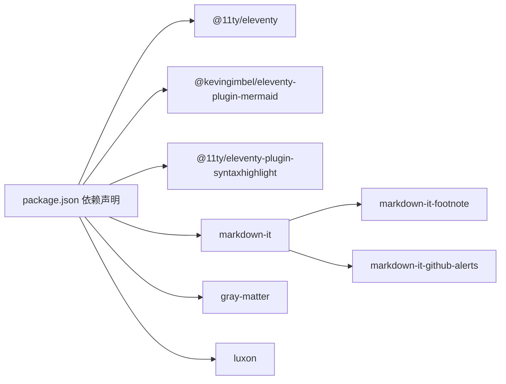

# 功能特性与插件

<cite>
**本文引用的文件**
- [.eleventy.js](file://.eleventy.js)
- [package.json](file://package.json)
- [eleventy/config/filters.js](file://eleventy/config/filters.js)
- [eleventy/config/collections.js](file://eleventy/config/collections.js)
- [eleventy/config/passthrough.js](file://eleventy/config/passthrough.js)
- [src/_data/siteConfig.js](file://src/_data/siteConfig.js)
- [src/content/settings/siteConfig.js](file://src/content/settings/siteConfig.js)
- [src/_includes/layouts/base.njk](file://src/_includes/layouts/base.njk)
- [src/_includes/partials/head.njk](file://src/_includes/partials/head.njk)
- [src/assets/css/style.css](file://src/assets/css/style.css)
- [src/assets/css/alerts.css](file://src/assets/css/alerts.css)
- [src/assets/css/code.css](file://src/assets/css/code.css)
- [src/content/settings/categoryDescriptions.json](file://src/content/settings/categoryDescriptions.json)
- [src/content/posts/方案策划篇/FAQ 页面怎么降低读者顾虑@xfq.md](file://src/content/posts/方案策划篇/FAQ 页面怎么降低读者顾虑@xfq.md)
</cite>

## 目录
1. [简介](#简介)
2. [项目结构](#项目结构)
3. [核心组件](#核心组件)
4. [架构总览](#架构总览)
5. [详细组件分析](#详细组件分析)
6. [依赖关系分析](#依赖关系分析)
7. [性能考量](#性能考量)
8. [故障排查指南](#故障排查指南)
9. [结论](#结论)
10. [附录](#附录)

## 简介
本文件系统性梳理 11ty RainyNight 的功能特性与插件体系，覆盖 Eleventy 插件集成（Mermaid 图表、代码高亮、GitHub Alerts）、自定义过滤器（日期与标题格式化）、Passthrough 文件处理与静态资源优化、Markdown 扩展（脚注、警告块）等，并提供插件开发与集成最佳实践、兼容性与版本管理策略、实际使用示例与配置模板。

## 项目结构
项目采用以内容为中心的组织方式，Eleventy 配置集中在根配置文件中，插件注册、过滤器、集合与 Passthrough 处理分别由独立模块负责；样式通过 CSS Modules 统一引入，Markdown 渲染通过 markdown-it 与插件链路完成。

**图示来源**
- [.eleventy.js:36-180](file://.eleventy.js#L36-L180)
- [eleventy/config/filters.js:6-42](file://eleventy/config/filters.js#L6-L42)
- [eleventy/config/collections.js:219-371](file://eleventy/config/collections.js#L219-L371)
- [eleventy/config/passthrough.js:1-7](file://eleventy/config/passthrough.js#L1-L7)
- [src/_includes/layouts/base.njk:1-20](file://src/_includes/layouts/base.njk#L1-L20)
- [src/_includes/partials/head.njk:1-27](file://src/_includes/partials/head.njk#L1-L27)
- [src/assets/css/style.css:1-6](file://src/assets/css/style.css#L1-L6)
- [src/assets/css/alerts.css:1-156](file://src/assets/css/alerts.css#L1-L156)
- [src/assets/css/code.css:1-285](file://src/assets/css/code.css#L1-L285)
- [src/content/settings/categoryDescriptions.json:1-60](file://src/content/settings/categoryDescriptions.json#L1-L60)

**章节来源**
- [.eleventy.js:36-180](file://.eleventy.js#L36-L180)
- [package.json:1-35](file://package.json#L1-L35)

## 核心组件
- 插件系统
  - Mermaid 图表：动态渲染 Markdown 中的图表代码块。
  - 代码高亮：基于 @11ty/eleventy-plugin-syntaxhighlight 提供语法高亮。
  - GitHub Alerts：启用 markdown-it-github-alerts，支持 GFM 风格的提示块。
  - 脚注：启用 markdown-it-footnote 支持脚注标记与引用。
- 自定义过滤器
  - 日期过滤器：可读日期、HTML 日期字符串、年份、归档月份与标签化显示。
  - 标题过滤器：自动拼接站点标题，避免重复。
- 集合与数据
  - 文章集合：按时间倒序输出 Markdown 文章。
  - 分类集合：按目录层级与子分类生成树形节点与分页。
  - 元信息：从 JSON 加载分类描述与子分类元数据。
- Passthrough 文件处理
  - 将 src/assets 复制到输出目录的 assets，将 src/static 复制到站点根路径。
- Markdown 渲染
  - 启用 HTML、换行与链接识别，串联脚注与 GitHub Alerts 插件。
- 主题与样式
  - 通过 Nunjucks 注入主题初始化逻辑与页面级样式表数组。
  - alerts.css 与 code.css 作为页面样式自动注入。

**章节来源**
- [.eleventy.js:47-48](file://.eleventy.js#L47-L48)
- [.eleventy.js:159-170](file://.eleventy.js#L159-L170)
- [eleventy/config/filters.js:6-42](file://eleventy/config/filters.js#L6-L42)
- [eleventy/config/collections.js:219-371](file://eleventy/config/collections.js#L219-L371)
- [eleventy/config/passthrough.js:1-7](file://eleventy/config/passthrough.js#L1-L7)
- [src/_includes/layouts/base.njk:17](file://src/_includes/layouts/base.njk#L17)
- [src/_includes/partials/head.njk:22-26](file://src/_includes/partials/head.njk#L22-L26)

## 架构总览
下图展示从内容到输出的整体流程：内容文件经 Eleventy 解析，应用集合与过滤器，渲染 Markdown 并注入样式与脚本，最终生成静态站点。

**图示来源**
- [.eleventy.js:36-180](file://.eleventy.js#L36-L180)
- [eleventy/config/collections.js:219-371](file://eleventy/config/collections.js#L219-L371)
- [eleventy/config/filters.js:6-42](file://eleventy/config/filters.js#L6-L42)

## 详细组件分析

### 插件与 Markdown 扩展
- Mermaid 图表
  - 在 Eleventy 中注册插件，页面通过模板标记注入脚本。
  - 使用场景：在文章中插入 Mermaid 图表，自动渲染为交互式图形。
- 代码高亮
  - 通过 @11ty/eleventy-plugin-syntaxhighlight 提供高亮能力。
  - 结合 alerts.css 与 code.css 实现暗色模式下的语法高亮与表格样式。
- GitHub Alerts
  - 启用 markdown-it-github-alerts，支持 note/tip/warning/important/caution 等提示块。
  - 样式由 alerts.css 提供，支持明暗主题切换。
- 脚注
  - 启用 markdown-it-footnote，支持脚注标记与引用解析。
- Markdown 渲染选项
  - 开启 HTML、换行与链接识别，确保内容可读性与链接可用性。

**图示来源**
- [.eleventy.js:39-48](file://.eleventy.js#L39-L48)
- [.eleventy.js:159-170](file://.eleventy.js#L159-L170)
- [src/assets/css/alerts.css:1-156](file://src/assets/css/alerts.css#L1-L156)
- [src/assets/css/code.css:1-285](file://src/assets/css/code.css#L1-L285)

**章节来源**
- [.eleventy.js:47-48](file://.eleventy.js#L47-L48)
- [.eleventy.js:159-170](file://.eleventy.js#L159-L170)
- [src/assets/css/alerts.css:1-156](file://src/assets/css/alerts.css#L1-L156)
- [src/assets/css/code.css:1-285](file://src/assets/css/code.css#L1-L285)

### 自定义过滤器
- 日期过滤器
  - readableDate/htmlDateString/year/archiveMonth/archiveMonthLabel：统一日期格式化输出。
  - 结合 luxon 进行时区转换与本地化格式化。
- 标题过滤器
  - formatTitle：自动拼接站点标题，避免重复。
- 文件夹名提取
  - folderNameFromPost：从文章路径提取目录层级作为“文件夹名”。

**图示来源**
- [eleventy/config/filters.js:6-42](file://eleventy/config/filters.js#L6-L42)

**章节来源**
- [eleventy/config/filters.js:6-42](file://eleventy/config/filters.js#L6-L42)

### 集合与分类系统
- 文章集合 posts
  - 过滤 src/content/posts 下的 Markdown 文件，按 date 倒序排序。
- 分类集合 categories/categoriesList
  - 基于目录层级与子分类生成树形节点，支持面包屑与分页。
- 分类详情页集合 categoryPages
  - 为每个分类生成分页列表，包含子分类、计数、面包屑与元信息。
- 文件夹分组 folderGroups
  - 按顶层目录分组，结合子分类元数据与描述生成展示项。
- 元信息加载
  - 从 categoryDescriptions.json 加载分类与子分类的名称与描述，进行规范化处理。

**图示来源**
- [eleventy/config/collections.js:31-40](file://eleventy/config/collections.js#L31-L40)
- [eleventy/config/collections.js:145-217](file://eleventy/config/collections.js#L145-L217)
- [eleventy/config/collections.js:253-316](file://eleventy/config/collections.js#L253-L316)
- [eleventy/config/collections.js:318-370](file://eleventy/config/collections.js#L318-L370)
- [src/content/settings/categoryDescriptions.json:1-60](file://src/content/settings/categoryDescriptions.json#L1-L60)

**章节来源**
- [eleventy/config/collections.js:219-371](file://eleventy/config/collections.js#L219-L371)
- [src/content/settings/categoryDescriptions.json:1-60](file://src/content/settings/categoryDescriptions.json#L1-L60)

### Passthrough 文件处理与静态资源优化
- Passthrough 映射
  - src/assets -> assets：复制静态样式与脚本。
  - src/static -> /：复制 robots.txt 等根级静态文件。
- 页面样式注入
  - 通过 pageStyles 数组在页面级别注入样式表，便于按需加载与缓存控制。
- 构建脚本
  - build 流程：清理站点、同步元数据、构建、CSS 优化、性能自检。
  - CSS 优化：提供独立脚本对 CSS 进行安全优化。
- 主题初始化
  - 通过 head.njk 注入主题初始化逻辑，支持明/暗主题切换。

**图示来源**
- [package.json:6-16](file://package.json#L6-L16)
- [eleventy/config/passthrough.js:1-7](file://eleventy/config/passthrough.js#L1-L7)
- [src/_includes/partials/head.njk:11-21](file://src/_includes/partials/head.njk#L11-L21)

**章节来源**
- [package.json:6-16](file://package.json#L6-L16)
- [eleventy/config/passthrough.js:1-7](file://eleventy/config/passthrough.js#L1-L7)
- [src/_includes/partials/head.njk:11-21](file://src/_includes/partials/head.njk#L11-L21)

### Markdown 扩展功能示例
- 脚注：在 Markdown 中使用脚注标记与引用，渲染为标准脚注。
- GitHub Alerts：使用 GFM 风格提示块，自动应用样式。
- 示例文章片段展示了提示块的使用方式。

**章节来源**
- [.eleventy.js:166-168](file://.eleventy.js#L166-L168)
- [src/content/posts/方案策划篇/FAQ 页面怎么降低读者顾虑@xfq.md:25](file://src/content/posts/方案策划篇/FAQ 页面怎么降低读者顾虑@xfq.md#L25)

## 依赖关系分析
- Eleventy 版本与插件
  - @11ty/eleventy: ^3.1.2
  - @kevingimbel/eleventy-plugin-mermaid: ^3.0.1
  - @11ty/eleventy-plugin-syntaxhighlight: ^5.0.2
  - markdown-it: ^14.1.0
  - markdown-it-footnote: ^4.0.0
  - markdown-it-github-alerts: ^1.0.1
  - gray-matter: ^4.0.3
  - luxon: ^3.7.2

**图示来源**
- [package.json:22-33](file://package.json#L22-L33)

**章节来源**
- [package.json:22-33](file://package.json#L22-L33)

## 性能考量
- 构建流程优化
  - 通过独立脚本执行 CSS 优化与性能自检，避免在 Eleventy 主流程中阻塞。
- 资源加载策略
  - 使用 pageStyles 按页面注入样式，减少无关样式加载。
  - 通过 CDN 引入 Font Awesome 与字体资源，提升首屏表现。
- 主题切换
  - 通过 data-theme 属性与本地存储实现即时主题切换，避免重绘成本。

**章节来源**
- [package.json:6-16](file://package.json#L6-L16)
- [src/_includes/partials/head.njk:5-21](file://src/_includes/partials/head.njk#L5-L21)
- [src/_includes/layouts/base.njk:15-17](file://src/_includes/layouts/base.njk#L15-L17)

## 故障排查指南
- 文章文件名格式错误
  - 规则：必须包含 @ 符号，格式为“标题@分类标识.md”。
  - 若缺失或格式不符，构建时抛出错误并提示正确格式。
- 缺失 slug
  - 在文章 Front Matter 中未设置 slug 时，将使用文件名派生的 fileSlug 作为最终 permalink。
- 更新时间检测
  - 当文件修改时间与发布日期差异超过一分钟且不超过当前时间时，视为有效更新时间。
- Mermaid 渲染失败
  - 确认已注册 Mermaid 插件并在模板中注入脚本标记。
- GitHub Alerts 样式异常
  - 确保页面样式数组包含 alerts.css 或在 head 中引入对应样式。

**章节来源**
- [.eleventy.js:57-72](file://.eleventy.js#L57-L72)
- [.eleventy.js:102-111](file://.eleventy.js#L102-L111)
- [.eleventy.js:117-135](file://.eleventy.js#L117-L135)
- [src/_includes/layouts/base.njk:17](file://src/_includes/layouts/base.njk#L17)
- [src/assets/css/alerts.css:1-156](file://src/assets/css/alerts.css#L1-L156)

## 结论
RainyNight 通过模块化的 Eleventy 配置与插件体系，实现了从内容到渲染再到输出的完整链路。Mermaid、代码高亮、GitHub Alerts 与脚注等扩展提升了内容表达力；自定义过滤器与集合系统提供了灵活的数据组织与展示能力；Passthrough 与样式注入策略保障了静态资源的高效管理与主题一致性。建议在团队协作中遵循统一的命名规范与构建流程，确保插件版本与主题切换的稳定性。

## 附录

### 插件开发与集成最佳实践
- 插件选择
  - 优先选择与 Eleventy 版本兼容的稳定插件，关注社区活跃度与维护状态。
- 配置顺序
  - 在 .eleventy.js 中尽早注册插件，确保后续渲染与集合处理生效。
- 样式隔离
  - 使用 pageStyles 为特定页面注入样式，避免全局污染。
- 主题一致性
  - 在 head.njk 中集中初始化主题逻辑，保证明/暗主题切换的一致性。

### 兼容性与版本管理策略
- 依赖锁定
  - 使用 package-lock.json 锁定版本，避免意外升级导致的构建失败。
- 渐进升级
  - 升级 Eleventy 或插件前，先在开发环境验证兼容性与渲染效果。
- 回滚预案
  - 保留上一版本的依赖快照，出现问题时快速回滚。

### 实际使用示例与配置模板
- Mermaid 图表
  - 在文章中插入 Mermaid 代码块，构建后自动渲染。
  - 参考路径：[Mermaid 注入标记](file://src/_includes/layouts/base.njk#L17)
- GitHub Alerts
  - 使用 GFM 提示块语法，配合 alerts.css 样式。
  - 参考路径：[样式定义:1-156](file://src/assets/css/alerts.css#L1-L156)
- 代码高亮
  - 使用代码块语法，结合 code.css 与语法高亮插件。
  - 参考路径：[样式定义:1-285](file://src/assets/css/code.css#L1-L285)
- 日期与标题过滤器
  - 在模板中使用 readableDate、archiveMonthLabel、formatTitle 等过滤器。
  - 参考路径：[过滤器定义:6-42](file://eleventy/config/filters.js#L6-L42)
- 分类与分页
  - 通过 categoriesList 与 categoryPages 集合生成分类页与分页。
  - 参考路径：[集合定义:253-316](file://eleventy/config/collections.js#L253-316)
- Passthrough 静态资源
  - 在 passthrough.js 中配置复制规则，确保资源路径正确。
  - 参考路径：[Passthrough 配置:1-7](file://eleventy/config/passthrough.js#L1-L7)