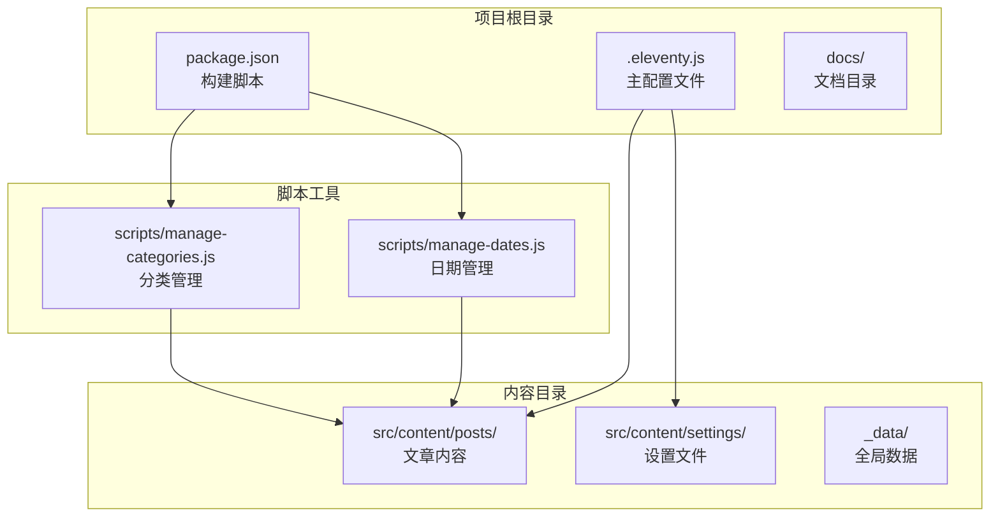
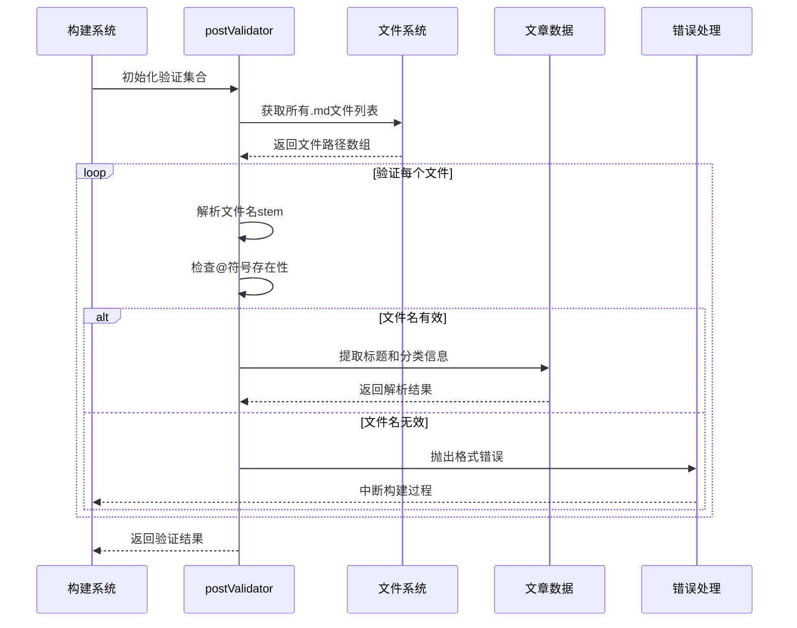
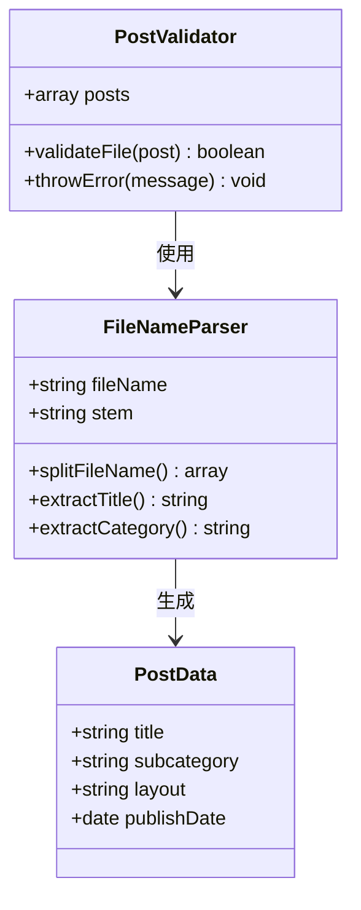
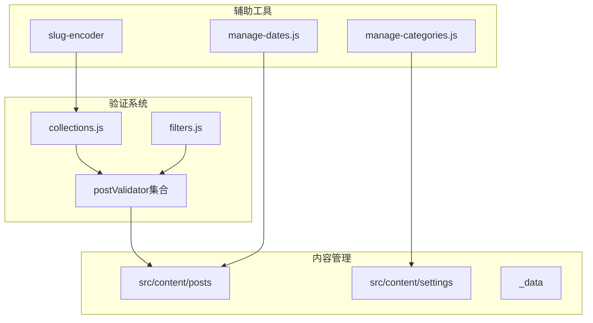
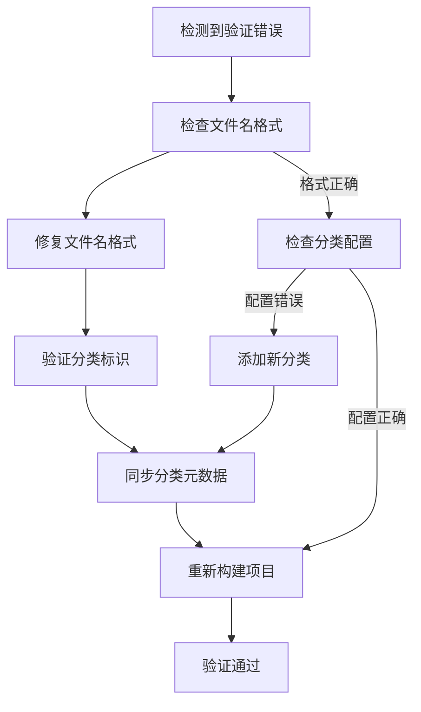

# 文章验证系统

<cite>
**本文档引用的文件**
- [.eleventy.js](file://.eleventy.js)
- [src/content/posts/建站需求篇/建站需求清单：估算更新频率@xfq.md](file://src/content/posts/建站需求篇/建站需求篇/建站需求清单：估算更新频率@xfq.md)
- [src/content/posts/方案策划篇/FAQ 页面怎么降低读者顾虑@xfq.md](file://src/content/posts/方案策划篇/FAQ 页面怎么降低读者顾虑@xfq.md)
- [src/content/posts/项目速览/演示案例 01：前端开发者个人主页@xs.md](file://src/content/posts/项目速览/演示案例 01：前端开发者个人主页@xs.md)
- [src/content/settings/categoryDescriptions.json](file://src/content/settings/categoryDescriptions.json)
- [scripts/manage-dates.js](file://scripts/manage-dates.js)
- [scripts/manage-categories.js](file://scripts/manage-categories.js)
- [package.json](file://package.json)
- [docs/本地写作与构建指南.md](file://docs/本地写作与构建指南.md)
</cite>

## 目录
1. [简介](#简介)
2. [项目结构](#项目结构)
3. [核心组件](#核心组件)
4. [架构概览](#架构概览)
5. [详细组件分析](#详细组件分析)
6. [依赖关系分析](#依赖关系分析)
7. [性能考虑](#性能考虑)
8. [故障排除指南](#故障排除指南)
9. [结论](#结论)
10. [附录](#附录)

## 简介

文章验证系统是本11ty项目中的一个关键质量保证机制，专门用于确保所有文章文件都遵循统一的命名规范。该系统通过postValidator集合实现，强制要求所有文章文件名必须包含@符号，形成"标题@分类标识.md"的标准格式。

该验证系统在构建过程中发挥着至关重要的作用，它不仅确保了内容管理的一致性，还为后续的自动元数据提取、分类管理和URL生成提供了可靠的基础。通过严格的文件命名验证，系统能够自动化地从文件名中解析出文章标题和子分类信息，大大简化了内容管理工作。

## 项目结构

项目采用基于功能的组织方式，核心验证逻辑集中在Eleventy配置文件中：



**图表来源**
- [.eleventy.js:12-147](file://.eleventy.js#L12-L147)
- [package.json:6-16](file://package.json#L6-L16)

**章节来源**
- [.eleventy.js:12-147](file://.eleventy.js#L12-L147)
- [package.json:1-35](file://package.json#L1-L35)

## 核心组件

### postValidator集合

postValidator是文章验证系统的核心组件，它是一个特殊的Eleventy集合，专门用于验证文章文件命名格式。该集合通过glob模式匹配所有位于`src/content/posts/**/*.md`路径下的Markdown文件，并对每个文件执行严格的命名验证。

验证逻辑的核心在于检查文件名的"stem"（不包含扩展名的部分）是否包含@符号。如果发现不符合要求的文件名，验证器会立即抛出详细的错误信息，阻止构建过程继续进行。

### 文件命名规范

系统强制要求所有文章文件采用以下格式：
- **标准格式**：`标题@分类标识.md`
- **示例**：`快速上手@abc.md`
- **中文支持**：完全支持中文标题和分类标识

这种命名约定的优势在于：
1. **自动化元数据提取**：系统可以从文件名自动解析标题和分类信息
2. **清晰的层次结构**：通过@符号明确分离标题和分类标识
3. **易于维护**：统一的命名格式便于内容管理和查找

**章节来源**
- [.eleventy.js:32-48](file://.eleventy.js#L32-L48)

## 架构概览

文章验证系统的整体架构体现了"预防性质量控制"的设计理念：



**图表来源**
- [.eleventy.js:32-48](file://.eleventy.js#L32-L48)

该架构的关键特点包括：
- **早期验证**：在构建过程的早期阶段执行验证
- **全面覆盖**：验证所有位于指定路径下的Markdown文件
- **即时反馈**：发现问题时立即停止构建并报告详细错误
- **自动化提取**：成功验证的文件自动被解析为可用的数据

## 详细组件分析

### 验证算法实现

postValidator集合的验证算法具有以下特征：

```mermaid
flowchart TD
Start([开始验证]) --> GetFiles[获取文件列表]
GetFiles --> LoopFiles{遍历文件}
LoopFiles --> ParseName[解析文件名]
ParseName --> ExtractStem[提取文件名stem]
ExtractStem --> CheckSymbol{检查@符号}
CheckSymbol --> |存在| ParseData[解析标题和分类]
CheckSymbol --> |不存在| ThrowError[抛出错误]
ParseData --> NextFile[下一个文件]
ThrowError --> StopBuild[停止构建]
NextFile --> LoopFiles
LoopFiles --> |完成| Success[验证成功]
Success --> End([结束])
StopBuild --> End
```

**图表来源**
- [.eleventy.js:33-47](file://.eleventy.js#L33-L47)

### 数据提取机制

成功的文件验证会触发自动数据提取过程：



**图表来源**
- [.eleventy.js:51-73](file://.eleventy.js#L51-L73)

### 元数据自动填充

验证系统不仅验证文件名格式，还会自动填充相关的元数据：

| 元数据字段 | 来源 | 自动填充逻辑 |
|-----------|------|-------------|
| title | 文件名stem的@符号前部分 | 从文件名解析标题 |
| subcategory | 文件名stem的@符号后部分 | 从文件名解析分类标识 |
| layout | 默认值 | 如果未指定则使用"layouts/post.njk" |
| publishDate | 文件创建时间 | 如果未指定则使用文件修改时间 |

**章节来源**
- [.eleventy.js:51-123](file://.eleventy.js#L51-L123)

## 依赖关系分析

文章验证系统与其他项目组件的依赖关系如下：



**图表来源**
- [.eleventy.js:1-11](file://.eleventy.js#L1-L11)
- [scripts/manage-dates.js:1-85](file://scripts/manage-dates.js#L1-L85)
- [scripts/manage-categories.js:1-212](file://scripts/manage-categories.js#L1-L212)

**章节来源**
- [.eleventy.js:1-11](file://.eleventy.js#L1-L11)
- [scripts/manage-dates.js:1-85](file://scripts/manage-dates.js#L1-L85)
- [scripts/manage-categories.js:1-212](file://scripts/manage-categories.js#L1-L212)

## 性能考虑

### 验证效率优化

postValidator集合在设计时充分考虑了性能因素：

1. **延迟加载**：只在需要时才执行验证逻辑
2. **高效匹配**：使用glob模式快速定位目标文件
3. **内存优化**：逐个处理文件而非一次性加载所有文件
4. **早期退出**：发现第一个错误就立即停止处理

### 复杂度分析

- **时间复杂度**：O(n)，其中n是匹配到的文件数量
- **空间复杂度**：O(1)，只使用常量级别的额外空间
- **验证开销**：每个文件的验证操作都是O(1)时间复杂度

## 故障排除指南

### 常见错误类型及解决方案

#### 文件名格式错误

**错误表现**：
```
文章文件名格式错误: "快速上手.md"
必须包含 @ 符号，格式: 标题@分类标识.md
例如: 快速上手@abc.md
```

**解决方案**：
1. 检查文件名是否包含@符号
2. 确保@符号前后都有有效内容
3. 避免使用特殊字符作为分类标识
4. 重新保存文件并重命名

#### 分类标识不匹配

**错误表现**：
```
分类标识与现有分类不匹配
```

**解决方案**：
1. 检查分类标识是否存在于categoryDescriptions.json中
2. 使用现有的分类标识或添加新的分类
3. 执行`npm run sync-meta`同步分类元数据

### 验证失败的调试步骤



**图表来源**
- [.eleventy.js:39-44](file://.eleventy.js#L39-L44)

**章节来源**
- [.eleventy.js:39-44](file://.eleventy.js#L39-L44)

## 结论

文章验证系统通过postValidator集合实现了对文章文件命名的严格控制，确保了整个内容管理系统的质量和一致性。该系统的设计体现了以下优势：

1. **预防性质量控制**：在构建早期就发现并阻止格式错误
2. **自动化数据提取**：从文件名中自动解析有用的信息
3. **统一的命名规范**：为团队协作提供了清晰的指导原则
4. **易于维护**：简洁的验证逻辑便于理解和修改

通过强制执行"标题@分类标识.md"的命名格式，系统不仅提高了内容管理的效率，还为后续的分类管理、元数据提取和URL生成奠定了坚实的基础。这对于维护大型内容库和确保网站结构的完整性具有重要意义。

## 附录

### 正确的文件命名示例

以下是一些符合规范的文件命名示例：

- `快速上手@abc.md`
- `建站需求清单：估算更新频率@xfq.md`
- `FAQ 页面怎么降低读者顾虑@xfq.md`
- `演示案例 01：前端开发者个人主页@xs.md`

### 错误的文件命名示例

以下是一些不符合规范的文件命名示例：

- `快速上手.md`（缺少@符号）
- `快速上手@.md`（分类标识为空）
- `@abc.md`（标题为空）
- `快速上手@@abc.md`（多个@符号）

### 自定义验证规则开发指南

如果需要扩展验证规则，可以按照以下步骤进行：

1. **修改验证逻辑**：在postValidator集合中添加新的验证条件
2. **更新错误消息**：提供清晰的错误描述和解决方案
3. **测试验证规则**：创建测试用例验证新规则的有效性
4. **文档更新**：更新相关文档说明新的验证要求

**章节来源**
- [.eleventy.js:32-48](file://.eleventy.js#L32-L48)