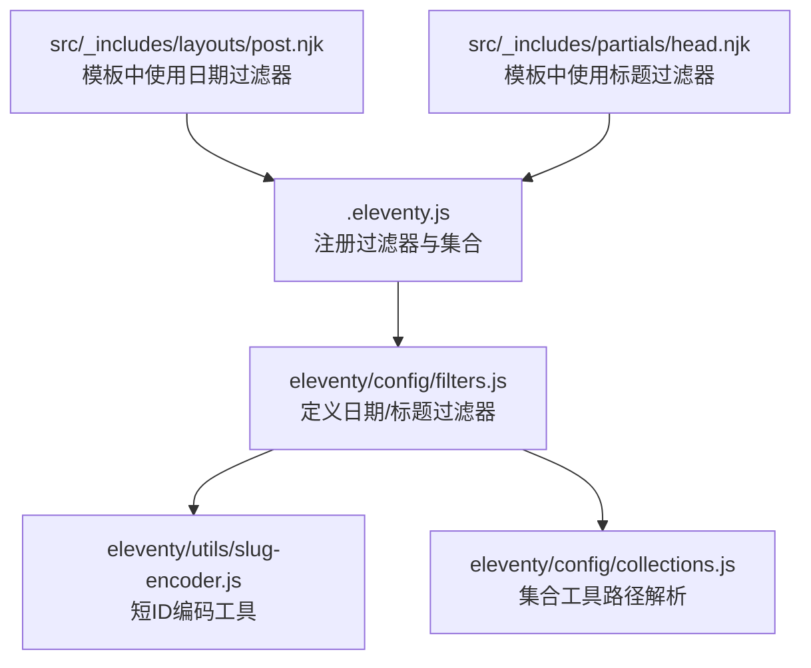
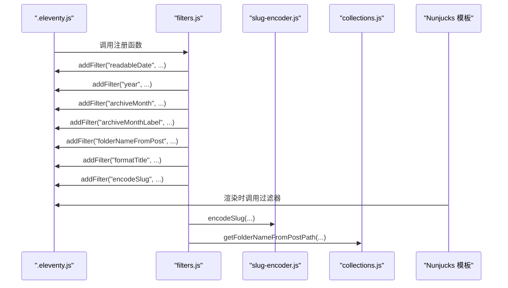
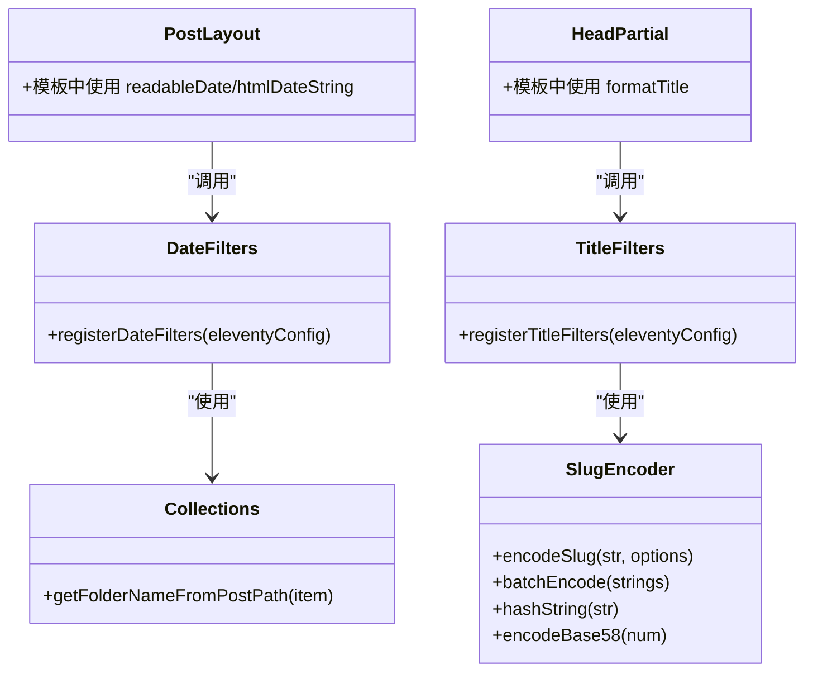
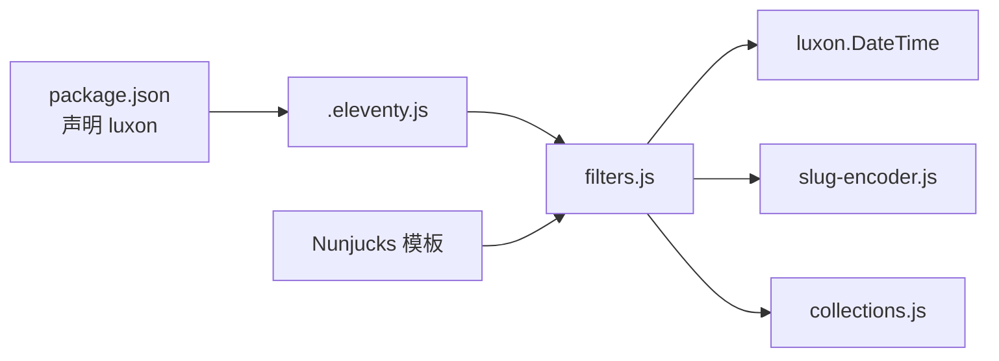
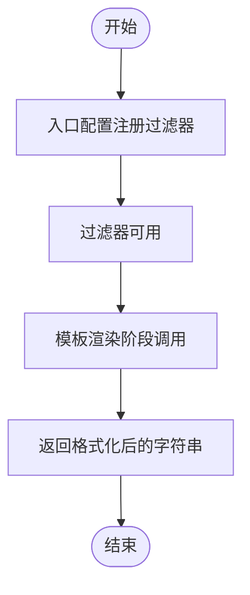

# 自定义过滤器

<cite>
**本文引用的文件**
- [eleventy\config\filters.js](file://eleventy/config/filters.js)
- [.eleventy.js](file://.eleventy.js)
- [eleventy\utils\slug-encoder.js](file://eleventy/utils/slug-encoder.js)
- [eleventy\config\collections.js](file://eleventy/config/collections.js)
- [src\_includes\layouts\post.njk](file://src/_includes/layouts/post.njk)
- [src\_includes\partials\head.njk](file://src/_includes/partials/head.njk)
- [src\_data\siteConfig.js](file://src/_data/siteConfig.js)
- [package.json](file://package.json)
</cite>

## 目录
1. [简介](#简介)
2. [项目结构](#项目结构)
3. [核心组件](#核心组件)
4. [架构总览](#架构总览)
5. [详细组件分析](#详细组件分析)
6. [依赖关系分析](#依赖关系分析)
7. [性能考量](#性能考量)
8. [故障排查指南](#故障排查指南)
9. [结论](#结论)
10. [附录](#附录)

## 简介
本文件系统性地介绍项目中的自定义过滤器体系，重点覆盖两类过滤器：
- 日期过滤器：提供可读日期、HTML日期字符串、年份、归档月份、带标签的归档月份、以及从文章路径提取目录名等能力。
- 标题过滤器：提供标题标准化拼接、以及将任意字符串编码为“BV风格短ID”的能力。

文档将详细说明过滤器的注册机制、调用方式、参数与返回值、典型使用场景、最佳实践、扩展方法与性能注意事项，并给出可视化图示帮助理解。

## 项目结构
过滤器位于 Eleventy 配置目录下，通过入口配置文件统一注册；模板中以管道语法调用；部分过滤器依赖工具函数或集合工具。

图表来源
- [.eleventy.js:12-29](file://.eleventy.js#L12-L29)
- [eleventy\config\filters.js:1-48](file://eleventy/config/filters.js#L1-L48)
- [eleventy\utils\slug-encoder.js:1-98](file://eleventy/utils/slug-encoder.js#L1-L98)
- [eleventy\config\collections.js:1-377](file://eleventy/config/collections.js#L1-L377)
- [src\_includes\layouts\post.njk:14-22](file://src/_includes/layouts/post.njk#L14-L22)
- [src\_includes\partials\head.njk:3](file://src/_includes/partials/head.njk#L3)

章节来源
- [.eleventy.js:12-29](file://.eleventy.js#L12-L29)
- [eleventy\config\filters.js:1-48](file://eleventy/config/filters.js#L1-L48)

## 核心组件
- 日期过滤器注册与实现：在配置文件中注册多个日期相关的过滤器，统一使用 UTC 时区进行格式化输出。
- 标题过滤器注册与实现：提供标题标准化拼接与短ID编码能力，后者基于自定义编码器。
- 工具与集合：短ID编码器提供哈希与 Base58 编码逻辑；集合工具提供从文章路径提取目录名的能力。

章节来源
- [eleventy\config\filters.js:7-31](file://eleventy/config/filters.js#L7-L31)
- [eleventy\config\filters.js:33-46](file://eleventy/config/filters.js#L33-L46)
- [eleventy\utils\slug-encoder.js:49-64](file://eleventy/utils/slug-encoder.js#L49-L64)
- [eleventy\config\collections.js:7-22](file://eleventy/config/collections.js#L7-L22)

## 架构总览
过滤器的生命周期包括：配置阶段注册、模板渲染阶段调用、数据流中参与计算。

图表来源
- [.eleventy.js:26-27](file://.eleventy.js#L26-L27)
- [eleventy\config\filters.js:7-31](file://eleventy/config/filters.js#L7-L31)
- [eleventy\config\filters.js:33-46](file://eleventy/config/filters.js#L33-L46)
- [eleventy\utils\slug-encoder.js:49-64](file://eleventy/utils/slug-encoder.js#L49-L64)
- [eleventy\config\collections.js:7-22](file://eleventy/config/collections.js#L7-L22)

## 详细组件分析

### 日期过滤器
- readableDate
  - 功能：将日期对象转换为 UTC 的可读日期字符串（格式：年-月-日）。
  - 参数：日期对象。
  - 返回：字符串。
  - 使用场景：文章发布日期、更新日期等显示。
  - 模板示例路径：[src\_includes\layouts\post.njk:14-22](file://src/_includes/layouts/post.njk#L14-L22)

- htmlDateString
  - 功能：将日期对象转换为 HTML 日期字符串（格式：年-月-日），便于语义化标记。
  - 参数：日期对象。
  - 返回：字符串。
  - 使用场景：time 元素的 datetime 属性。
  - 模板示例路径：[src\_includes\layouts\post.njk:16](file://src/_includes/layouts/post.njk#L16)

- year
  - 功能：提取日期的年份。
  - 参数：日期对象。
  - 返回：字符串。
  - 使用场景：归档、统计、导航分组。

- archiveMonth
  - 功能：提取日期的月份（两位）。
  - 参数：日期对象。
  - 返回：字符串。
  - 使用场景：按月归档列表。

- archiveMonthLabel
  - 功能：生成带中文标签的月份显示（格式：年+中文月）。
  - 参数：日期对象。
  - 返回：字符串。
  - 使用场景：归档页面标题或导航标签。

- folderNameFromPost
  - 功能：从文章的 inputPath 中提取顶层目录名，用于分组展示。
  - 参数：数据项（含 inputPath）。
  - 返回：字符串。
  - 依赖：集合工具函数。
  - 模板示例路径：[src\_includes\partials\head.njk:3](file://src/_includes/partials/head.njk#L3)

章节来源
- [eleventy\config\filters.js:7-31](file://eleventy/config/filters.js#L7-L31)
- [eleventy\config\collections.js:7-22](file://eleventy/config/collections.js#L7-L22)
- [src\_includes\layouts\post.njk:14-22](file://src/_includes/layouts/post.njk#L14-L22)
- [src\_includes\partials\head.njk:3](file://src/_includes/partials/head.njk#L3)

### 标题过滤器
- formatTitle
  - 功能：将页面标题与站点标题拼接，自动避免重复，支持自定义分隔符。
  - 参数：
    - title：当前页面标题。
    - siteTitle：站点标题。
    - sep：可选，分隔符，默认为“ | ”。
  - 返回：字符串。
  - 使用场景：页面 title 标签生成。
  - 模板示例路径：[src\_includes\partials\head.njk:3](file://src/_includes/partials/head.njk#L3)

- encodeSlug
  - 功能：将任意字符串编码为“BV风格短ID”，用于生成简洁稳定的 URL 片段。
  - 参数：
    - str：原始字符串。
    - options：可选配置对象，包含：
      - prefix：前缀，默认 'p'。
      - minLength：最小长度，默认 6。
  - 返回：字符串。
  - 依赖：自定义编码器（哈希 + Base58 编码）。
  - 实现参考：[eleventy\utils\slug-encoder.js:49-64](file://eleventy/utils/slug-encoder.js#L49-L64)

章节来源
- [eleventy\config\filters.js:33-46](file://eleventy/config/filters.js#L33-L46)
- [eleventy\utils\slug-encoder.js:49-64](file://eleventy/utils/slug-encoder.js#L49-L64)
- [src\_includes\partials\head.njk:3](file://src/_includes/partials/head.njk#L3)

### 类与依赖关系图

图表来源
- [eleventy\config\filters.js:7-31](file://eleventy/config/filters.js#L7-L31)
- [eleventy\config\filters.js:33-46](file://eleventy/config/filters.js#L33-L46)
- [eleventy\utils\slug-encoder.js:49-64](file://eleventy/utils/slug-encoder.js#L49-L64)
- [eleventy\config\collections.js:7-22](file://eleventy/config/collections.js#L7-L22)
- [src\_includes\layouts\post.njk:14-22](file://src/_includes/layouts/post.njk#L14-L22)
- [src\_includes\partials\head.njk:3](file://src/_includes/partials/head.njk#L3)

## 依赖关系分析
- 注册机制：入口配置文件在初始化阶段调用注册函数，向 Eleventy 注册过滤器。
- 运行时调用：模板中以管道语法调用过滤器，传入所需参数。
- 外部依赖：日期格式化依赖 luxon；短ID编码依赖自定义工具。
- 数据依赖：标题过滤器依赖站点配置；目录名过滤器依赖集合工具。

图表来源
- [package.json:32](file://package.json#L32)
- [.eleventy.js:12-29](file://.eleventy.js#L12-L29)
- [eleventy\config\filters.js:1-3](file://eleventy/config/filters.js#L1-L3)
- [eleventy\utils\slug-encoder.js:1-98](file://eleventy/utils/slug-encoder.js#L1-L98)
- [eleventy\config\collections.js:1-377](file://eleventy/config/collections.js#L1-L377)

章节来源
- [package.json:22-33](file://package.json#L22-L33)
- [.eleventy.js:12-29](file://.eleventy.js#L12-L29)

## 性能考量
- 过滤器复用与缓存：Eleventy 在内部对过滤器调用进行依赖追踪与缓存，减少重复计算。
- 日期格式化：统一使用 UTC 时区，避免跨时区差异带来的重复格式化开销。
- 字符串编码：短ID编码为纯计算逻辑，建议在构建阶段避免对大量重复字符串反复编码；必要时可结合批量编码策略。
- 模板调用：尽量在模板中只传递必要参数，避免在过滤器内部进行昂贵的数据处理。

## 故障排查指南
- 日期格式异常
  - 现象：输出不符合预期。
  - 排查：确认输入是否为有效日期对象；检查时区设置是否符合预期。
  - 参考：日期过滤器实现与调用位置。

- 标题重复或缺失
  - 现象：标题未正确拼接或出现重复。
  - 排查：检查站点标题与页面标题是否为空；确认分隔符设置。
  - 参考：标题过滤器实现与模板调用。

- 目录名解析错误
  - 现象：分组显示异常。
  - 排查：确认文章路径结构是否符合约定；检查集合工具函数的路径解析逻辑。
  - 参考：集合工具函数与模板调用。

- 短ID冲突或长度不足
  - 现象：生成的短ID不符合预期。
  - 排查：检查前缀与最小长度配置；必要时使用批量编码辅助检测冲突。
  - 参考：短ID编码器实现。

章节来源
- [eleventy\config\filters.js:7-31](file://eleventy/config/filters.js#L7-L31)
- [eleventy\config\filters.js:33-46](file://eleventy/config/filters.js#L33-L46)
- [eleventy\config\collections.js:7-22](file://eleventy/config/collections.js#L7-L22)
- [eleventy\utils\slug-encoder.js:49-64](file://eleventy/utils/slug-encoder.js#L49-L64)

## 结论
本项目通过集中注册与清晰职责划分，实现了稳定、可扩展的过滤器体系。日期过滤器保证了时间信息的一致性与可读性，标题过滤器提升了 SEO 与品牌一致性，短ID编码器则为内容路由提供了简洁稳定的标识。遵循本文的最佳实践与扩展建议，可在保持性能的同时持续增强过滤器能力。

## 附录

### 过滤器注册与调用流程

图表来源
- [.eleventy.js:26-27](file://.eleventy.js#L26-L27)
- [eleventy\config\filters.js:7-31](file://eleventy/config/filters.js#L7-L31)
- [eleventy\config\filters.js:33-46](file://eleventy/config/filters.js#L33-L46)

### 实际使用示例（路径）
- 日期过滤器在文章布局中的使用：[src\_includes\layouts\post.njk:14-22](file://src/_includes/layouts/post.njk#L14-L22)
- 标题过滤器在头部模板中的使用：[src\_includes\partials\head.njk:3](file://src/_includes/partials/head.njk#L3)

### 开发自定义过滤器与扩展现有功能
- 新增过滤器步骤
  - 在配置文件中新增注册函数或扩展现有注册函数。
  - 在过滤器实现中定义参数与返回值，确保类型安全与健壮性。
  - 在模板中以管道语法调用新过滤器。
- 扩展建议
  - 对于复杂逻辑，优先拆分为工具函数（如短ID编码器）以便复用与测试。
  - 保持过滤器无副作用，避免在过滤器中进行 IO 或状态变更。
  - 为过滤器提供合理的默认参数与错误处理，提升易用性。