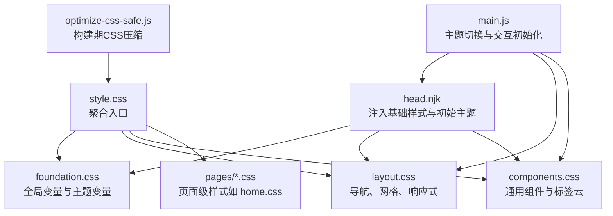
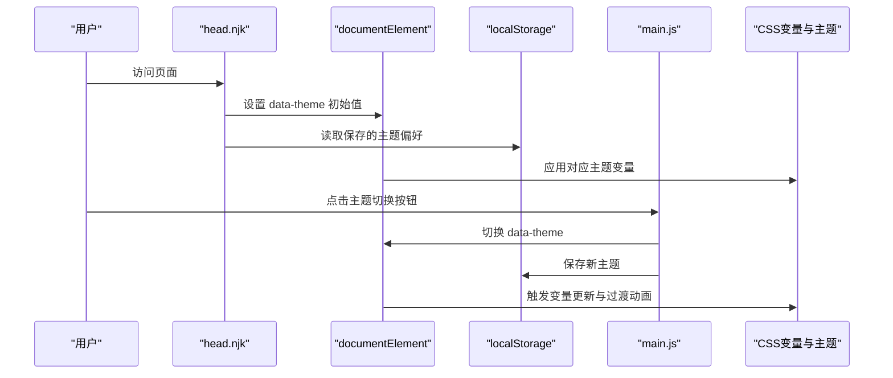
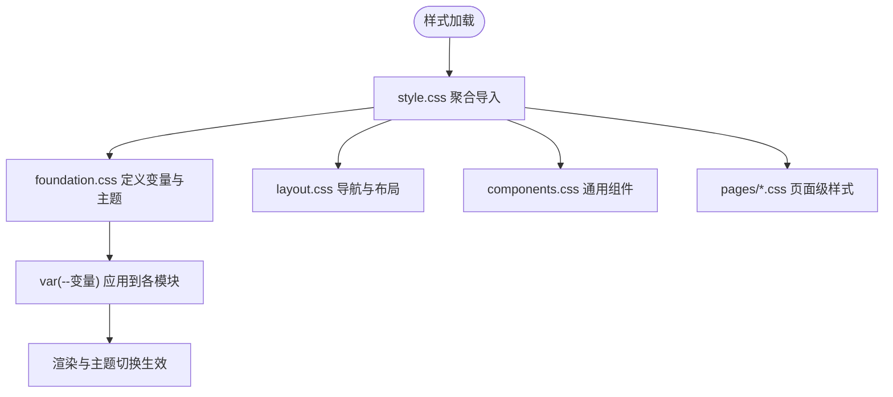
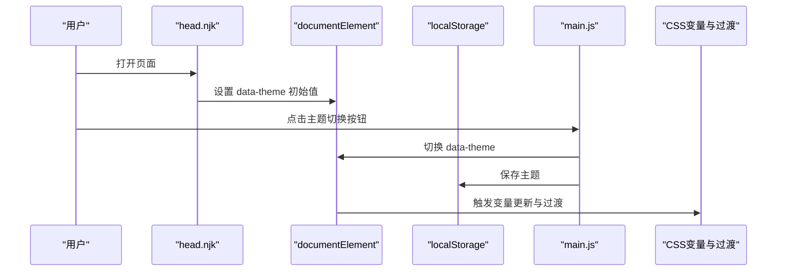
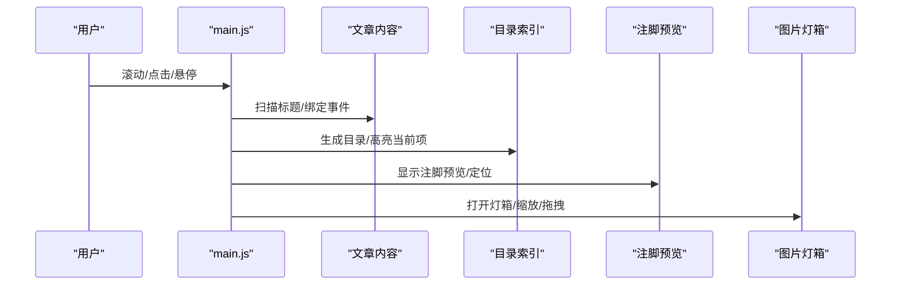
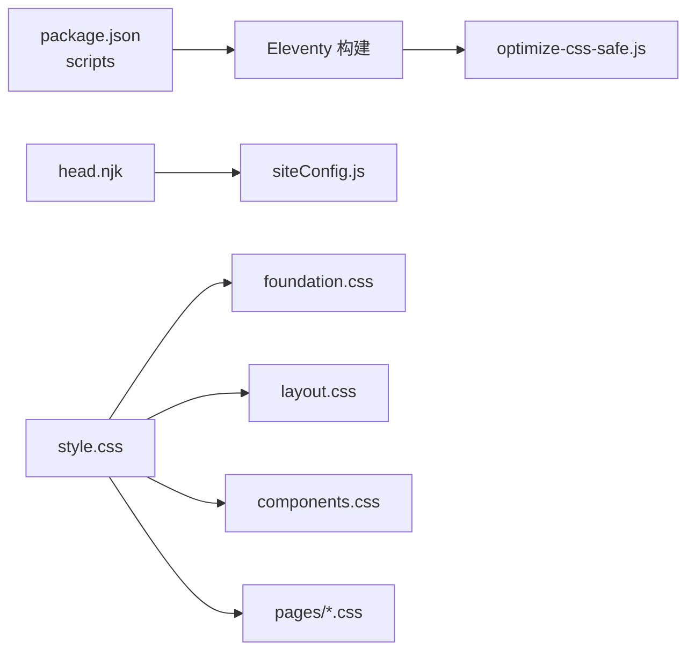

# 主题定制与样式扩展

<cite>
**本文引用的文件**
- [style.css](file://src/assets/css/style.css)
- [foundation.css](file://src/assets/css/foundation.css)
- [layout.css](file://src/assets/css/layout.css)
- [components.css](file://src/assets/css/components.css)
- [home.css](file://src/assets/css/pages/home.css)
- [head.njk](file://src/_includes/partials/head.njk)
- [siteConfig.js](file://src/content/settings/siteConfig.js)
- [main.js](file://src/assets/js/main.js)
- [optimize-css-safe.js](file://scripts/optimize-css-safe.js)
- [package.json](file://package.json)
- [theme-logic.test.js](file://tests/theme-logic.test.js)
</cite>

## 目录
1. [引言](#引言)
2. [项目结构](#项目结构)
3. [核心组件](#核心组件)
4. [架构总览](#架构总览)
5. [详细组件分析](#详细组件分析)
6. [依赖关系分析](#依赖关系分析)
7. [性能考量](#性能考量)
8. [故障排查指南](#故障排查指南)
9. [结论](#结论)
10. [附录](#附录)

## 引言
本指南面向需要基于 RainyNight 主题进行深度定制与样式扩展的开发者与设计师。文档围绕现有 CSS 架构、主题切换机制、样式继承与覆盖策略、响应式适配、JavaScript 交互扩展与自定义组件开发、性能优化与浏览器兼容最佳实践展开，帮助你在不破坏既有设计语言的前提下，安全地进行主题定制与样式增强。

## 项目结构
RainyNight 的样式体系采用“分层聚合”的组织方式：通过一个聚合入口将基础变量、布局、组件、页面级样式拼装为最终输出；同时配合 JavaScript 实现主题切换与交互增强。构建脚本负责在生产构建中对 CSS 进行安全压缩与体积优化。

**图表来源**
- [style.css:1-6](file://src/assets/css/style.css#L1-L6)
- [foundation.css:1-271](file://src/assets/css/foundation.css#L1-L271)
- [layout.css:1-276](file://src/assets/css/layout.css#L1-L276)
- [components.css:1-304](file://src/assets/css/components.css#L1-L304)
- [home.css:1-508](file://src/assets/css/pages/home.css#L1-L508)
- [head.njk:1-27](file://src/_includes/partials/head.njk#L1-L27)
- [main.js:1081-1104](file://src/assets/js/main.js#L1081-L1104)
- [optimize-css-safe.js:1-112](file://scripts/optimize-css-safe.js#L1-L112)

**章节来源**
- [style.css:1-6](file://src/assets/css/style.css#L1-L6)
- [head.njk:1-27](file://src/_includes/partials/head.njk#L1-L27)
- [package.json:6-16](file://package.json#L6-L16)

## 核心组件
- 全局样式聚合器：通过聚合入口统一引入基础变量、布局、组件与页面级样式，保证加载顺序与作用域边界清晰。
- 主题变量与主题切换：以 CSS 自定义属性为核心，结合 data-theme 属性与本地存储实现主题持久化与即时切换。
- 响应式布局与交互：导航、菜单、主题切换按钮、图片灯箱、目录索引等均具备移动端适配与无障碍支持。
- 构建期优化：提供安全的 CSS 压缩脚本，去除注释与多余空白，保留字符串与选择器完整性。

**章节来源**
- [style.css:1-6](file://src/assets/css/style.css#L1-L6)
- [foundation.css:1-271](file://src/assets/css/foundation.css#L1-L271)
- [layout.css:1-276](file://src/assets/css/layout.css#L1-L276)
- [components.css:1-304](file://src/assets/css/components.css#L1-L304)
- [head.njk:11-21](file://src/_includes/partials/head.njk#L11-L21)
- [main.js:1081-1104](file://src/assets/js/main.js#L1081-L1104)
- [optimize-css-safe.js:66-76](file://scripts/optimize-css-safe.js#L66-L76)

## 架构总览
RainyNight 的样式架构遵循“变量驱动 + 层次化样式 + 主题切换 + 构建优化”的设计原则。下图展示了从页面头部注入、主题初始化、到交互初始化的整体流程。

**图表来源**
- [head.njk:11-21](file://src/_includes/partials/head.njk#L11-L21)
- [main.js:1081-1104](file://src/assets/js/main.js#L1081-L1104)
- [foundation.css:198-211](file://src/assets/css/foundation.css#L198-L211)

**章节来源**
- [head.njk:11-21](file://src/_includes/partials/head.njk#L11-L21)
- [main.js:1081-1104](file://src/assets/js/main.js#L1081-L1104)
- [foundation.css:198-211](file://src/assets/css/foundation.css#L198-L211)

## 详细组件分析

### CSS 文件组织与样式继承机制
- 聚合入口：style.css 作为唯一入口，按顺序引入 foundation、layout、components、alerts、code 等样式模块，确保变量与规则的解析顺序可控。
- 变量与主题：foundation.css 定义 :root 默认变量与 [data-theme="light"] 覆盖，形成明暗两套主题变量体系；其余样式通过 var(--variable-name) 使用变量，实现跨模块继承与主题切换。
- 层次化样式：layout.css 负责全局布局与导航；components.css 提供卡片、标签云、步骤条等通用组件；pages/*.css 提供页面级差异化样式，如 home.css 的首页首屏网格背景与搜索区。
- 继承与覆盖：组件样式通过 var(--变量) 与主题选择器 [data-theme="..."] 实现继承；页面级样式通过更具体的选择器覆盖通用组件行为。

**图表来源**
- [style.css:1-6](file://src/assets/css/style.css#L1-L6)
- [foundation.css:1-271](file://src/assets/css/foundation.css#L1-L271)
- [layout.css:1-276](file://src/assets/css/layout.css#L1-L276)
- [components.css:1-304](file://src/assets/css/components.css#L1-L304)
- [home.css:1-508](file://src/assets/css/pages/home.css#L1-L508)

**章节来源**
- [style.css:1-6](file://src/assets/css/style.css#L1-L6)
- [foundation.css:1-271](file://src/assets/css/foundation.css#L1-L271)
- [layout.css:1-276](file://src/assets/css/layout.css#L1-L276)
- [components.css:1-304](file://src/assets/css/components.css#L1-L304)
- [home.css:1-508](file://src/assets/css/pages/home.css#L1-L508)

### 主题切换功能实现原理
- 初始化：head.njk 在页面头部注入一段内联脚本，根据配置与本地存储设置 documentElement 的 data-theme 属性，确保首次渲染即处于正确主题。
- 切换逻辑：main.js 中的 initThemeToggle 监听点击事件，切换 data-theme 并持久化到 localStorage；同时添加 theme-transition 类以触发平滑过渡动画。
- 过渡效果：foundation.css 定义了 .theme-transition 及其子元素的过渡属性与时长，确保主题切换时背景、文字、边框、阴影等同步变化。
- 测试验证：tests/theme-logic.test.js 通过模拟浏览器环境验证默认主题、持久化与切换逻辑，确保主题系统在无浏览器上下文时也能被正确测试。

**图表来源**
- [head.njk:11-21](file://src/_includes/partials/head.njk#L11-L21)
- [main.js:1081-1104](file://src/assets/js/main.js#L1081-L1104)
- [foundation.css:198-211](file://src/assets/css/foundation.css#L198-L211)
- [theme-logic.test.js:28-95](file://tests/theme-logic.test.js#L28-L95)

**章节来源**
- [head.njk:11-21](file://src/_includes/partials/head.njk#L11-L21)
- [main.js:1081-1104](file://src/assets/js/main.js#L1081-L1104)
- [foundation.css:198-211](file://src/assets/css/foundation.css#L198-L211)
- [theme-logic.test.js:28-95](file://tests/theme-logic.test.js#L28-L95)

### 样式扩展示例（颜色方案、字体配置、布局调整）
- 颜色方案扩展
  - 在 foundation.css 中新增或调整 :root 与 [data-theme="light"] 下的变量，例如 --color-primary、--accent-color、--tag-* 系列变量，即可实现主题色彩统一变更。
  - 页面级高对比强调色：通过在目标页面容器上叠加额外类（如 .post-bg-highlight 或 .post-bg-faq），配合变量覆盖实现局部高亮背景，避免与整体主题冲突。
- 字体配置
  - head.njk 已引入 Space Grotesk、Syncopate、JetBrains Mono 等字体，可在 foundation.css 或页面级样式中通过 font-family 变量化使用，便于主题切换时统一调整。
- 布局调整
  - 导航与网格：通过 layout.css 的 .site-nav、.menu-links、.menu-toggle 等选择器进行间距、对齐与响应式断点调整；必要时在 pages/*.css 中为特定页面添加专属布局。
  - 卡片与网格：components.css 的 .clean-card、.clean-grid、.process-steps 等提供可复用的网格与卡片骨架，可通过 var(--tile-bg-*)、--tile-shadow 等变量控制外观。

**章节来源**
- [foundation.css:1-271](file://src/assets/css/foundation.css#L1-L271)
- [layout.css:1-276](file://src/assets/css/layout.css#L1-L276)
- [components.css:1-304](file://src/assets/css/components.css#L1-L304)
- [home.css:1-508](file://src/assets/css/pages/home.css#L1-L508)
- [head.njk:5-7](file://src/_includes/partials/head.njk#L5-L7)

### 响应式设计定制与移动端适配
- 断点与布局
  - 移动端断点集中在 1024px 与 768px：1024px 以内启用汉堡菜单与侧边栏抽屉；768px 以内进一步简化页脚与主内容区布局。
  - 通过 .menu-overlay、.menu-links.is-active、.menu-toggle.is-active 等状态类控制菜单显隐与动画。
- 图标与交互
  - 主题切换图标在明暗主题下自动切换，确保在不同背景下具备足够对比度。
  - 通过 .theme-transition 在主题切换时提供平滑过渡，避免突变。
- 页面级响应式
  - home.css 对首页搜索区、特性卡片、“适合谁使用”网格等在 768px 以下进行内边距与网格密度调整，保证移动端阅读体验。

**章节来源**
- [layout.css:229-276](file://src/assets/css/layout.css#L229-L276)
- [components.css:174-177](file://src/assets/css/components.css#L174-L177)
- [home.css:329-352](file://src/assets/css/pages/home.css#L329-L352)
- [foundation.css:198-211](file://src/assets/css/foundation.css#L198-L211)

### JavaScript 交互扩展与自定义组件开发
- 主题切换
  - initThemeToggle：监听点击事件，切换 data-theme 并持久化；添加 .theme-transition 触发 CSS 过渡。
- 目录索引与回到顶部
  - initPostToc：动态扫描文章标题生成桌面/移动端目录，支持滚动高亮与点击跳转；计算最大高度与垂直居中位置，避免遮挡页脚与操作区。
- 注脚预览与导航
  - initFootnotePreview：鼠标悬停或聚焦注脚引用时显示预览气泡，支持键盘 ESC 关闭与视口变化重定位。
  - initFootnoteNavigation：点击注记/返回链接平滑滚动到目标锚点，维护 URL 锚点状态。
- 图片灯箱
  - initImageLightbox：点击图片打开灯箱，支持滚轮缩放、拖拽移动、工具栏缩放与重置；根据图片自然尺寸与容器尺寸计算最佳初始缩放。
- 导航显隐
  - initNavVisibility：根据滚动方向与阈值控制导航栏显隐，提升阅读专注度。

**图表来源**
- [main.js:81-278](file://src/assets/js/main.js#L81-L278)
- [main.js:280-455](file://src/assets/js/main.js#L280-L455)
- [main.js:496-792](file://src/assets/js/main.js#L496-L792)
- [main.js:794-870](file://src/assets/js/main.js#L794-L870)

**章节来源**
- [main.js:81-278](file://src/assets/js/main.js#L81-L278)
- [main.js:280-455](file://src/assets/js/main.js#L280-L455)
- [main.js:496-792](file://src/assets/js/main.js#L496-L792)
- [main.js:794-870](file://src/assets/js/main.js#L794-L870)

### 自定义主题开发方法
- 基于现有变量体系扩展
  - 在 :root 下新增变量族（如 --brand-*、--surface-*），在 [data-theme="light"] 下提供对应覆盖，确保明暗两套值完备。
- 逐步覆盖与最小改动
  - 优先通过变量覆盖实现主题差异，避免直接修改基础变量导致全局影响；仅在必要时在 pages/*.css 中为特定页面添加专用覆盖。
- 主题切换与过渡
  - 保持 .theme-transition 类的使用，确保主题切换时的视觉一致性；如需调整过渡时长或缓动曲线，可在 foundation.css 中统一修改。

**章节来源**
- [foundation.css:1-271](file://src/assets/css/foundation.css#L1-L271)
- [layout.css:69-108](file://src/assets/css/layout.css#L69-L108)
- [components.css:179-283](file://src/assets/css/components.css#L179-L283)

## 依赖关系分析
- 样式依赖
  - style.css 依赖 foundation、layout、components、pages/*.css；head.njk 依赖 siteConfig.js 获取默认主题配置。
- 构建依赖
  - package.json 的 build 脚本在 Eleventy 生成静态站点后，依次执行 CSS 压缩与性能自检脚本，确保产物体积与质量。
- 测试依赖
  - theme-logic.test.js 通过模拟浏览器环境验证主题初始化与切换逻辑，保障主题系统稳定性。

**图表来源**
- [package.json:6-16](file://package.json#L6-L16)
- [optimize-css-safe.js:82-109](file://scripts/optimize-css-safe.js#L82-L109)
- [head.njk:13-19](file://src/_includes/partials/head.njk#L13-L19)
- [siteConfig.js:36-38](file://src/content/settings/siteConfig.js#L36-L38)
- [style.css:1-6](file://src/assets/css/style.css#L1-L6)

**章节来源**
- [package.json:6-16](file://package.json#L6-L16)
- [optimize-css-safe.js:82-109](file://scripts/optimize-css-safe.js#L82-L109)
- [head.njk:13-19](file://src/_includes/partials/head.njk#L13-L19)
- [siteConfig.js:36-38](file://src/content/settings/siteConfig.js#L36-L38)
- [style.css:1-6](file://src/assets/css/style.css#L1-L6)

## 性能考量
- 构建期压缩
  - optimize-css-safe.js 递归遍历 _site/assets/css 目录，安全地去除注释与多余空白，保留字符串与选择器完整性，显著降低 CSS 体积。
- 加载与缓存
  - head.njk 为样式资源附加版本查询参数，有助于浏览器缓存与刷新；建议在生产环境开启 Gzip/Brotli 压缩与 CDN 缓存。
- 过渡与动画
  - .theme-transition 为主题切换提供统一过渡，建议保持默认时长与缓动函数，避免过度动画影响性能。
- 响应式与渲染
  - 在移动端断点处减少复杂阴影与滤镜使用，优先使用 transform 与 opacity，提升滚动流畅度。

**章节来源**
- [optimize-css-safe.js:6-76](file://scripts/optimize-css-safe.js#L6-L76)
- [head.njk:8-10](file://src/_includes/partials/head.njk#L8-L10)
- [foundation.css:198-211](file://src/assets/css/foundation.css#L198-L211)

## 故障排查指南
- 主题未生效或切换无效
  - 检查 head.njk 是否正确设置 data-theme；确认 main.js 的 initThemeToggle 是否被调用；核对 localStorage 中是否存在 "theme" 键。
- 切换后页面闪烁或样式错乱
  - 确认 .theme-transition 类是否在切换时被正确添加与移除；检查 CSS 过渡时长是否与 JS 同步。
- 移动端菜单无法打开或遮挡内容
  - 检查 .menu-overlay、.menu-links.is-active、.menu-toggle.is-active 的状态切换逻辑；确认 z-index 与 pointer-events 设置。
- 目录索引不更新或高亮异常
  - 确认 initPostToc 是否在 DOMContentLoaded 后执行；检查标题扫描与锚点生成逻辑；关注滚动与 resize 事件绑定。
- 注脚预览位置异常
  - 确认 getBoundingClientRect 结果与定位计算；检查视口边界与 tooltip 宽度限制逻辑。
- 图片灯箱无法缩放或拖拽
  - 检查自然宽高是否就绪；确认最小/最大缩放阈值与偏移量钳制逻辑；关注指针事件与滚轮事件的阻止默认行为。

**章节来源**
- [head.njk:11-21](file://src/_includes/partials/head.njk#L11-L21)
- [main.js:1081-1104](file://src/assets/js/main.js#L1081-L1104)
- [layout.css:209-227](file://src/assets/css/layout.css#L209-L227)
- [main.js:81-278](file://src/assets/js/main.js#L81-L278)
- [main.js:280-455](file://src/assets/js/main.js#L280-L455)
- [main.js:496-792](file://src/assets/js/main.js#L496-L792)

## 结论
RainyNight 的样式体系以变量为核心、以层次化模块化组织为基础，辅以 JavaScript 交互与构建期优化，形成了可扩展、可维护、可测试的主题系统。通过遵循本文提供的变量扩展、主题覆盖、响应式适配与性能优化建议，你可以在不破坏既有设计语言的前提下，安全地完成主题定制与样式增强，并为未来迭代打下坚实基础。

## 附录
- 快速检查清单
  - 变量扩展：在 :root 与 [data-theme="light"] 下补充变量，确保明暗两套值一致。
  - 主题切换：确认 initThemeToggle 正常工作，过渡类与 localStorage 同步。
  - 响应式：在 1024px/768px 断点下验证菜单、网格与内容区布局。
  - 交互：目录索引、注脚预览、图片灯箱在滚动/点击/悬停场景下的稳定性。
  - 构建：执行 npm run build，确保 CSS 压缩与性能检查通过。