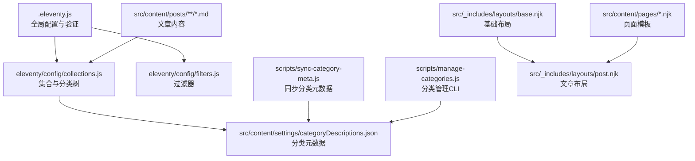
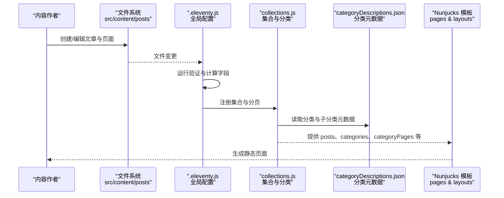
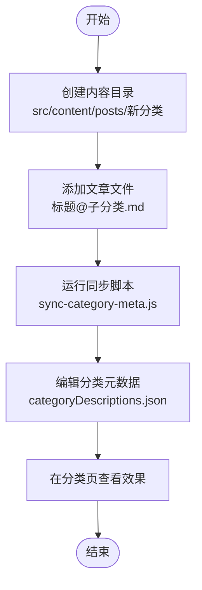
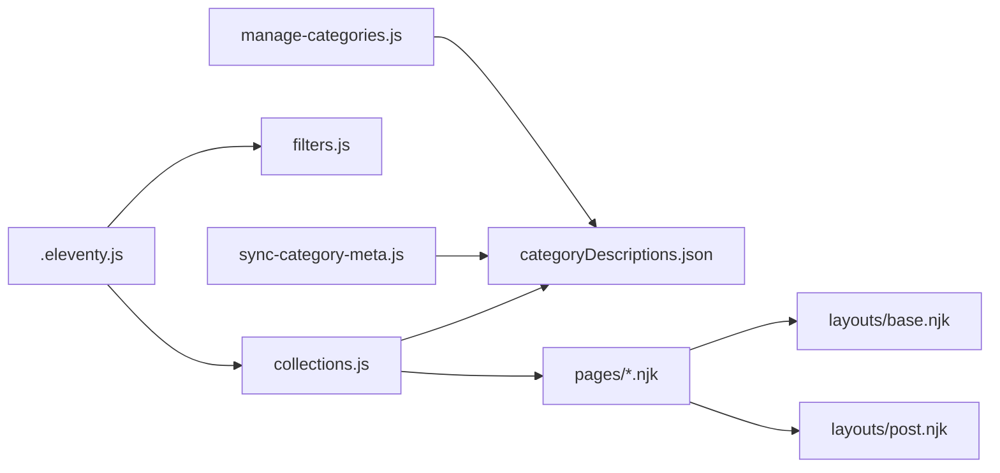

# 内容模型扩展

<cite>
**本文引用的文件**
- [.eleventy.js](file://.eleventy.js)
- [src/_data/siteConfig.js](file://src/_data/siteConfig.js)
- [src/content/settings/siteConfig.js](file://src/content/settings/siteConfig.js)
- [src/content/settings/categoryDescriptions.json](file://src/content/settings/categoryDescriptions.json)
- [scripts/manage-categories.js](file://scripts/manage-categories.js)
- [scripts/sync-category-meta.js](file://scripts/sync-category-meta.js)
- [eleventy/config/collections.js](file://eleventy/config/collections.js)
- [eleventy/config/filters.js](file://eleventy/config/filters.js)
- [src/_includes/layouts/base.njk](file://src/_includes/layouts/base.njk)
- [src/_includes/layouts/post.njk](file://src/_includes/layouts/post.njk)
- [src/content/posts/建站需求篇/建站需求清单：估算更新频率@xfq.md](file://src/content/posts/建站需求篇/建站需求清单：估算更新频率@xfq.md)
- [src/content/posts/方案策划篇/为什么个人网站要写清楚'不做什么'@xfq.md](file://src/content/posts/方案策划篇/为什么个人网站要写清楚'不做什么'@xfq.md)
- [src/content/pages/index.njk](file://src/content/pages/index.njk)
- [src/content/pages/archive.njk](file://src/content/pages/archive.njk)
- [src/content/pages/categories.njk](file://src/content/pages/categories.njk)
</cite>

## 目录
1. [简介](#简介)
2. [项目结构](#项目结构)
3. [核心组件](#核心组件)
4. [架构总览](#架构总览)
5. [详细组件分析](#详细组件分析)
6. [依赖关系分析](#依赖关系分析)
7. [性能考量](#性能考量)
8. [故障排查指南](#故障排查指南)
9. [结论](#结论)
10. [附录](#附录)

## 简介
本指南面向希望在 11ty RainyNight 中扩展内容模型的开发者与内容运营人员。文档围绕以下目标展开：
- 扩展现有内容模型以支持新的页面类型与内容结构
- 明确内容文件命名规范与元数据配置方法
- 解释内容分类系统（含子分类）的扩展与新分类添加流程
- 提供新页面类型的开发示例（自定义布局、数据模型与渲染逻辑）
- 说明内容验证机制与数据完整性检查
- 总结内容组织最佳实践与 SEO 优化要点
- 给出内容迁移与版本管理的指导原则

## 项目结构
RainyNight 的内容模型主要由以下部分组成：
- Eleventy 配置与构建管线：.eleventy.js 定义全局数据、过滤器、集合与验证规则，并设置 Markdown 库
- 内容目录：src/content 下的 posts（文章）与 pages（页面），以及 settings（站点配置与分类元数据）
- 布局与模板：src/_includes/layouts 提供基础布局与文章布局
- 分类与集合：eleventy/config/collections.js 定义文章集合、分类树与分页
- 工具脚本：scripts 下的分类管理与同步工具，辅助维护分类元数据
- 数据入口：src/_data/siteConfig.js 导入站点配置

图表来源
- [.eleventy.js:12-156](file://.eleventy.js#L12-L156)
- [eleventy/config/collections.js:219-371](file://eleventy/config/collections.js#L219-L371)
- [scripts/sync-category-meta.js:36-205](file://scripts/sync-category-meta.js#L36-L205)
- [scripts/manage-categories.js:95-212](file://scripts/manage-categories.js#L95-L212)
- [src/_includes/layouts/base.njk:1-20](file://src/_includes/layouts/base.njk#L1-L20)
- [src/_includes/layouts/post.njk:1-49](file://src/_includes/layouts/post.njk#L1-L49)

章节来源
- [.eleventy.js:12-156](file://.eleventy.js#L12-L156)
- [eleventy/config/collections.js:219-371](file://eleventy/config/collections.js#L219-L371)
- [scripts/sync-category-meta.js:36-205](file://scripts/sync-category-meta.js#L36-L205)
- [scripts/manage-categories.js:95-212](file://scripts/manage-categories.js#L95-L212)
- [src/_includes/layouts/base.njk:1-20](file://src/_includes/layouts/base.njk#L1-L20)
- [src/_includes/layouts/post.njk:1-49](file://src/_includes/layouts/post.njk#L1-L49)

## 核心组件
- 全局数据与计算字段：通过 eleventyComputed 在 .eleventy.js 中为文章自动推断标题、子分类、布局、永久链接、发布时间、更新时间、标签、页面样式等
- 内容验证：在 .eleventy.js 中注册 postValidator 集合，强制要求文章文件名包含 @ 符号
- 分类与集合：collections.js 构建分类树、生成分类页、按文件夹分组、处理分页与面包屑
- 分类元数据：categoryDescriptions.json 存储分类与子分类的描述；同步与管理脚本保证一致性
- 布局与模板：base.njk 提供通用 HTML 结构，post.njk 为文章专用布局，页面模板位于 src/content/pages

章节来源
- [.eleventy.js:32-48](file://.eleventy.js#L32-L48)
- [.eleventy.js:50-132](file://.eleventy.js#L50-L132)
- [eleventy/config/collections.js:219-371](file://eleventy/config/collections.js#L219-L371)
- [src/content/settings/categoryDescriptions.json:1-60](file://src/content/settings/categoryDescriptions.json#L1-L60)

## 架构总览
下图展示了内容模型扩展的关键交互：内容文件经由集合与过滤器进入模板渲染，分类元数据驱动导航与展示。

图表来源
- [.eleventy.js:12-156](file://.eleventy.js#L12-L156)
- [eleventy/config/collections.js:219-371](file://eleventy/config/collections.js#L219-L371)
- [src/content/settings/categoryDescriptions.json:1-60](file://src/content/settings/categoryDescriptions.json#L1-L60)

## 详细组件分析

### 内容文件命名规范与元数据配置
- 文件命名规范
  - 文章文件名必须包含 @ 符号，格式为“标题@子分类标识.md”，例如“快速上手@abc.md”
  - 该规则由 postValidator 集合在构建时强制执行
- 自动推断与默认值
  - 标题：若未显式设置，从文件名解析；否则使用 front matter 中的 title
  - 子分类：从文件名解析 @ 后的部分作为子分类标识
  - 布局：文章默认使用 post.njk
  - 永久链接：基于标题生成 BV 风格短 ID
  - 发布与更新时间：若未设置，发布时间为当前时间；更新时间根据文件修改时间与发布日期差判断
  - 标签：确保包含 posts 标签
  - 页面样式：文章默认加载 alerts.css、code.css 与 pages/post.css
- 手动元数据
  - 支持在 front matter 中设置 date、tags、category、subcategory、description、updated 等字段
  - 若未设置 category，将根据内容目录层级推断顶级分类

章节来源
- [.eleventy.js:32-48](file://.eleventy.js#L32-L48)
- [.eleventy.js:50-132](file://.eleventy.js#L50-L132)
- [src/content/posts/建站需求篇/建站需求清单：估算更新频率@xfq.md:1-28](file://src/content/posts/建站需求篇/建站需求清单：估算更新频率@xfq.md#L1-L28)
- [src/content/posts/方案策划篇/为什么个人网站要写清楚'不做什么'@xfq.md:1-31](file://src/content/posts/方案策划篇/为什么个人网站要写清楚'不做什么'@xfq.md#L1-L31)

### 内容分类系统的扩展与新分类添加流程
- 分类层级
  - 顶级分类：由内容目录层级推断（如“建站需求篇”）
  - 子分类：通过文件名中的 @ 后缀标识（如“xfq”），并在 categoryDescriptions.json 中配置显示名称与描述
- 新分类添加步骤
  1) 在 src/content/posts 下创建对应目录（如“新分类目录”）
  2) 在该目录下创建文章文件，文件名使用“标题@子分类标识.md”
  3) 运行同步脚本生成/更新分类元数据
     - node scripts/sync-category-meta.js
  4) 编辑 src/content/settings/categoryDescriptions.json，为顶级分类与子分类填写描述
  5) 如需批量重命名或删除分类，使用管理脚本
     - node scripts/manage-categories.js list/rename/delete/meta
- 分类元数据结构
  - categories: 顶级分类 -> subcategories: 子分类标识 -> { name, description }

图表来源
- [scripts/sync-category-meta.js:36-205](file://scripts/sync-category-meta.js#L36-L205)
- [src/content/settings/categoryDescriptions.json:1-60](file://src/content/settings/categoryDescriptions.json#L1-L60)

章节来源
- [scripts/sync-category-meta.js:36-205](file://scripts/sync-category-meta.js#L36-L205)
- [scripts/manage-categories.js:95-212](file://scripts/manage-categories.js#L95-L212)
- [src/content/settings/categoryDescriptions.json:1-60](file://src/content/settings/categoryDescriptions.json#L1-L60)

### 新页面类型的开发示例
- 自定义页面布局
  - 在 src/_includes/layouts 下新增布局文件（如 newpage.njk），并在页面模板中通过 front matter 指定 layout
  - 页面模板可复用 base.njk 的结构，仅替换主体内容
- 数据模型与渲染逻辑
  - 使用 collections.* 提供的数据（如 posts、categories、categoryPages、folderGroups）进行渲染
  - 示例页面模板：index.njk、archive.njk、categories.njk 展示了不同页面的数据消费方式
- 持久化链接与样式
  - 通过 permalink 控制页面输出路径
  - 通过 pageStyles 数组注入页面专属样式

章节来源
- [src/_includes/layouts/base.njk:1-20](file://src/_includes/layouts/base.njk#L1-L20)
- [src/_includes/layouts/post.njk:1-49](file://src/_includes/layouts/post.njk#L1-L49)
- [src/content/pages/index.njk:1-94](file://src/content/pages/index.njk#L1-L94)
- [src/content/pages/archive.njk:1-57](file://src/content/pages/archive.njk#L1-L57)
- [src/content/pages/categories.njk:1-67](file://src/content/pages/categories.njk#L1-L67)

### 内容验证机制与数据完整性检查
- 文件名验证
  - 构建时扫描所有 .md 文件，若文件名不含 @，抛出错误提示
- 计算字段完整性
  - 自动推断标题、子分类、布局、永久链接、发布时间、更新时间、标签与页面样式
  - 若文件存在但缺少某些字段，系统仍可正常工作，但建议在 front matter 中显式声明
- 分类元数据一致性
  - 同步脚本会自动发现新分类与子分类，并补充默认描述
  - 管理脚本支持重命名与删除分类及其子项，并同步更新元数据

章节来源
- [.eleventy.js:32-48](file://.eleventy.js#L32-L48)
- [.eleventy.js:50-132](file://.eleventy.js#L50-L132)
- [scripts/sync-category-meta.js:36-205](file://scripts/sync-category-meta.js#L36-L205)
- [scripts/manage-categories.js:95-212](file://scripts/manage-categories.js#L95-L212)

### 内容组织最佳实践与 SEO 优化
- 内容组织
  - 使用清晰的目录层级表达顶级分类，子分类通过文件名 @ 后缀标识
  - 为每个分类与子分类在 categoryDescriptions.json 中提供简洁描述
- SEO 优化
  - 在 front matter 中设置 title、description、date 等字段，提升搜索可见性
  - 使用合理的永久链接策略（系统已基于标题生成短 ID）
  - 为页面设置合适的 bodyClass 与 pageStyles，便于主题与样式控制
- 渲染体验
  - 利用 filters.js 中的 readableDate、encodeSlug 等过滤器统一格式
  - 在文章布局中启用目录与更新时间展示，提升阅读体验

章节来源
- [eleventy/config/filters.js:7-46](file://eleventy/config/filters.js#L7-L46)
- [src/_includes/layouts/post.njk:1-49](file://src/_includes/layouts/post.njk#L1-L49)
- [src/content/settings/categoryDescriptions.json:1-60](file://src/content/settings/categoryDescriptions.json#L1-L60)

### 内容迁移与版本管理
- 迁移策略
  - 使用 manage-categories.js 的 rename/delete 命令批量迁移分类
  - 使用 sync-category-meta.js 同步新旧结构下的分类元数据
- 版本管理
  - 分类元数据文件（categoryDescriptions.json）应纳入版本控制
  - 对大规模结构调整，建议先在分支中运行同步与管理脚本，核验无误后再合并
- 变更影响面
  - 更改分类层级或子分类标识会影响永久链接与分类页结构，需评估对现有链接的影响

章节来源
- [scripts/manage-categories.js:95-212](file://scripts/manage-categories.js#L95-L212)
- [scripts/sync-category-meta.js:36-205](file://scripts/sync-category-meta.js#L36-L205)

## 依赖关系分析
- 配置层依赖
  - .eleventy.js 依赖 collections.js 与 filters.js，同时读取站点配置与分类元数据
- 数据层依赖
  - collections.js 依赖 categoryDescriptions.json 与站点配置，生成分类树与分页数据
- 工具层依赖
  - sync-category-meta.js 与 manage-categories.js 依赖 posts 目录与 settings 目录
- 模板层依赖
  - 页面模板依赖布局与集合数据，通过 filters.js 提供的过滤器统一格式

图表来源
- [.eleventy.js:12-156](file://.eleventy.js#L12-L156)
- [eleventy/config/collections.js:219-371](file://eleventy/config/collections.js#L219-L371)
- [scripts/sync-category-meta.js:36-205](file://scripts/sync-category-meta.js#L36-L205)
- [scripts/manage-categories.js:95-212](file://scripts/manage-categories.js#L95-L212)
- [src/_includes/layouts/base.njk:1-20](file://src/_includes/layouts/base.njk#L1-L20)
- [src/_includes/layouts/post.njk:1-49](file://src/_includes/layouts/post.njk#L1-L49)

章节来源
- [.eleventy.js:12-156](file://.eleventy.js#L12-L156)
- [eleventy/config/collections.js:219-371](file://eleventy/config/collections.js#L219-L371)
- [scripts/sync-category-meta.js:36-205](file://scripts/sync-category-meta.js#L36-L205)
- [scripts/manage-categories.js:95-212](file://scripts/manage-categories.js#L95-L212)
- [src/_includes/layouts/base.njk:1-20](file://src/_includes/layouts/base.njk#L1-L20)
- [src/_includes/layouts/post.njk:1-49](file://src/_includes/layouts/post.njk#L1-L49)

## 性能考量
- 构建阶段的计算字段与集合构建会遍历所有内容文件，建议保持内容目录结构清晰，避免过深嵌套
- 分类页采用分页策略，合理设置分页大小以平衡加载性能与可读性
- 使用过滤器统一日期与标题格式，减少模板中的重复逻辑

## 故障排查指南
- 文章无法生成或报错
  - 检查文章文件名是否包含 @ 符号
  - 确认 front matter 字段（如 date、tags、category）格式正确
- 分类页缺失或显示异常
  - 运行同步脚本生成/更新分类元数据
  - 检查 categoryDescriptions.json 的结构与键名
- 更新时间未显示
  - 确认文章文件修改时间晚于发布日期且未超过一分钟误差
- 页面样式未生效
  - 检查页面模板的 pageStyles 是否正确注入

章节来源
- [.eleventy.js:32-48](file://.eleventy.js#L32-L48)
- [.eleventy.js:87-110](file://.eleventy.js#L87-L110)
- [scripts/sync-category-meta.js:36-205](file://scripts/sync-category-meta.js#L36-L205)
- [src/content/settings/categoryDescriptions.json:1-60](file://src/content/settings/categoryDescriptions.json#L1-L60)

## 结论
通过本文档的指引，您可以安全地扩展 RainyNight 的内容模型：遵循命名规范与元数据配置，利用集合与过滤器完成数据组织与渲染，借助同步与管理脚本维护分类元数据，并结合 SEO 与性能最佳实践提升内容质量与用户体验。

## 附录
- 站点配置入口
  - src/_data/siteConfig.js 导入 src/content/settings/siteConfig.js
- 关键集合与过滤器
  - posts、categories、categoriesList、categoryPages、folderGroups
  - readableDate、encodeSlug、formatTitle 等

章节来源
- [src/_data/siteConfig.js:1-2](file://src/_data/siteConfig.js#L1-L2)
- [src/content/settings/siteConfig.js](file://src/content/settings/siteConfig.js)
- [eleventy/config/collections.js:219-371](file://eleventy/config/collections.js#L219-L371)
- [eleventy/config/filters.js:7-46](file://eleventy/config/filters.js#L7-L46)