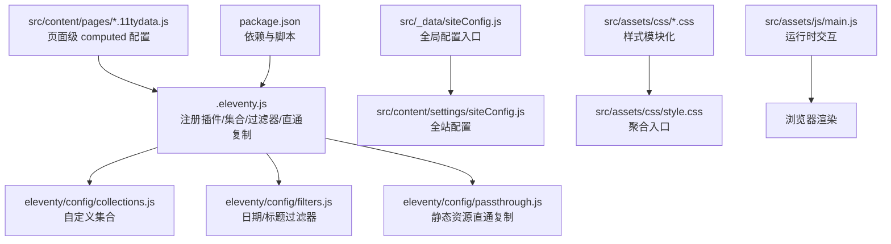
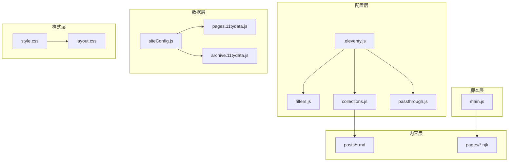
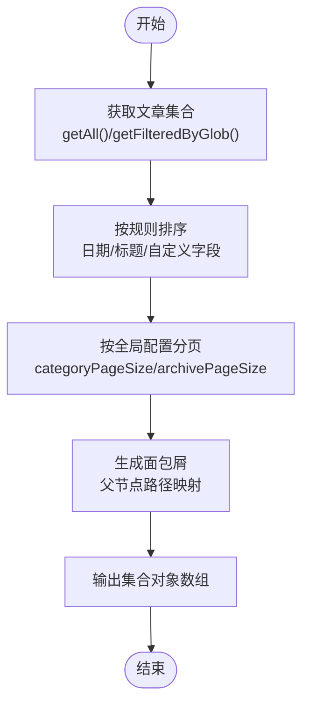
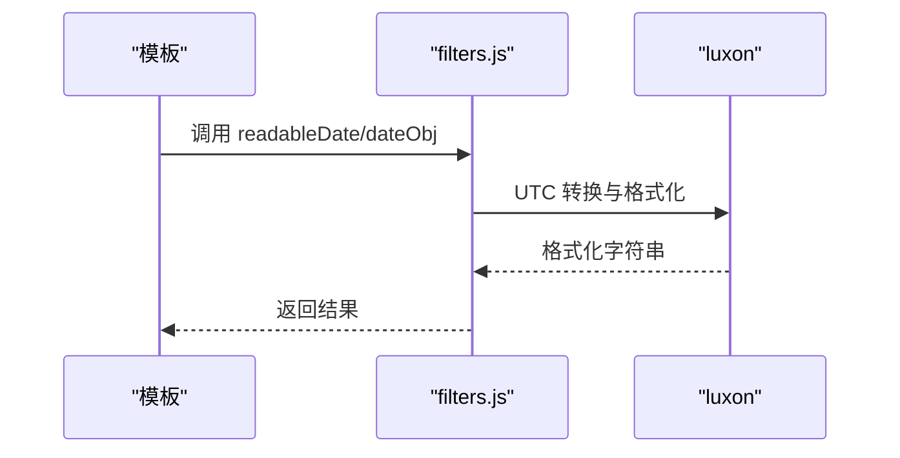
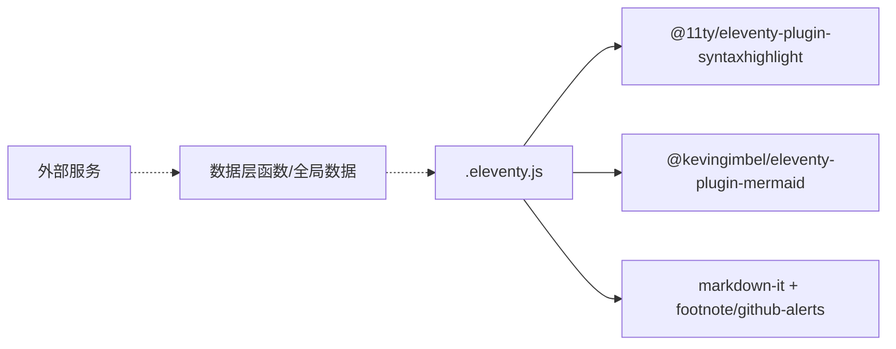
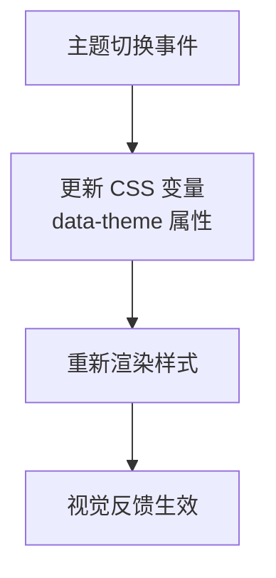
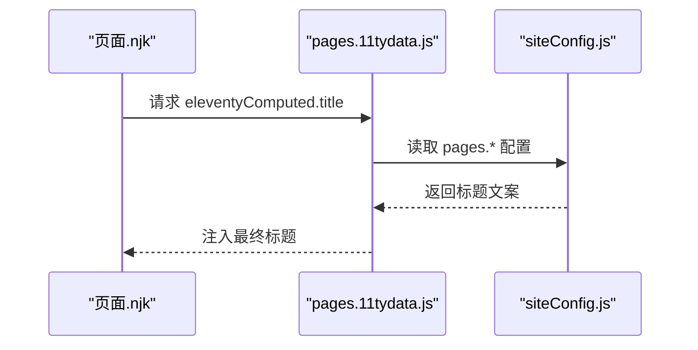
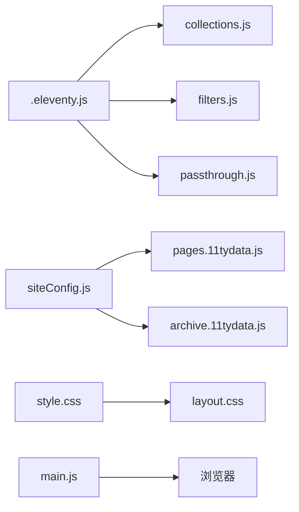

# 定制与扩展

<cite>
**本文引用的文件**
- [.eleventy.js](file://.eleventy.js)
- [eleventy/config/collections.js](file://eleventy/config/collections.js)
- [eleventy/config/filters.js](file://eleventy/config/filters.js)
- [eleventy/config/passthrough.js](file://eleventy/config/passthrough.js)
- [src/_data/siteConfig.js](file://src/_data/siteConfig.js)
- [src/content/settings/siteConfig.js](file://src/content/settings/siteConfig.js)
- [src/content/pages/archive.11tydata.js](file://src/content/pages/archive.11tydata.js)
- [src/content/pages/pages.11tydata.js](file://src/content/pages/pages.11tydata.js)
- [src/assets/js/main.js](file://src/assets/js/main.js)
- [src/assets/css/style.css](file://src/assets/css/style.css)
- [src/assets/css/layout.css](file://src/assets/css/layout.css)
- [package.json](file://package.json)
</cite>

## 目录
1. [引言](#引言)
2. [项目结构](#项目结构)
3. [核心组件](#核心组件)
4. [架构总览](#架构总览)
5. [详细组件分析](#详细组件分析)
6. [依赖关系分析](#依赖关系分析)
7. [性能考量](#性能考量)
8. [故障排查指南](#故障排查指南)
9. [结论](#结论)
10. [附录](#附录)

## 引言
本指南面向希望在 RainyNight 主题基础上进行定制与扩展的开发者。我们将围绕集合（Collections）与过滤器（Filters）两大扩展点展开，系统讲解如何：
- 基于现有架构扩展自定义集合与页面类型
- 扩展过滤器系统并编写自定义过滤器
- 插件集成与第三方服务接入
- 主题定制与样式扩展
- 内容模型扩展与新页面类型的开发流程
- 架构扩展的设计原则与实现策略，并提供可复用的定制案例与扩展示例。

## 项目结构
RainyNight 采用 Eleventy 的约定式目录结构，核心扩展点集中在配置层与数据层：
- 配置层：Eleventy 入口文件注册插件、集合、过滤器与静态资源直通复制
- 数据层：全局配置与页面级 computed 配置驱动页面标题、分页与元信息
- 内容层：Markdown 文章与 Nunjucks 页面模板
- 样式层：CSS 模块化导入，便于主题切换与局部覆盖
- 脚本层：构建与优化脚本，辅助 SEO 与性能检查

图表来源
- [.eleventy.js:36-181](file://.eleventy.js#L36-L181)
- [eleventy/config/collections.js:219-371](file://eleventy/config/collections.js#L219-L371)
- [eleventy/config/filters.js:6-43](file://eleventy/config/filters.js#L6-L43)
- [eleventy/config/passthrough.js:1-7](file://eleventy/config/passthrough.js#L1-L7)
- [src/_data/siteConfig.js:1-2](file://src/_data/siteConfig.js#L1-L2)
- [src/content/settings/siteConfig.js:1-168](file://src/content/settings/siteConfig.js#L1-L168)
- [src/content/pages/archive.11tydata.js:1-22](file://src/content/pages/archive.11tydata.js#L1-L22)
- [src/content/pages/pages.11tydata.js:1-31](file://src/content/pages/pages.11tydata.js#L1-L31)
- [src/assets/css/style.css:1-6](file://src/assets/css/style.css#L1-L6)
- [src/assets/js/main.js:1-800](file://src/assets/js/main.js#L1-L800)
- [package.json:1-35](file://package.json#L1-L35)

章节来源
- [.eleventy.js:36-181](file://.eleventy.js#L36-L181)
- [package.json:1-35](file://package.json#L1-L35)

## 核心组件
- Eleventy 配置入口：注册语法高亮、Mermaid、Markdown 库、集合、过滤器与静态资源直通复制
- 自定义集合：文章集合、分类树、分类详情分页、文件夹分组等
- 过滤器：日期格式化、标题拼接、文件夹名提取等
- 页面级 computed：根据全局配置动态设置页面标题与分页
- 全局配置：品牌、导航、页脚、元信息、主题、分页标签等
- 样式与脚本：模块化 CSS 导入与运行时交互逻辑

章节来源
- [.eleventy.js:36-181](file://.eleventy.js#L36-L181)
- [eleventy/config/collections.js:219-371](file://eleventy/config/collections.js#L219-L371)
- [eleventy/config/filters.js:6-43](file://eleventy/config/filters.js#L6-L43)
- [src/content/pages/archive.11tydata.js:1-22](file://src/content/pages/archive.11tydata.js#L1-L22)
- [src/content/pages/pages.11tydata.js:1-31](file://src/content/pages/pages.11tydata.js#L1-L31)
- [src/content/settings/siteConfig.js:1-168](file://src/content/settings/siteConfig.js#L1-L168)
- [src/assets/css/style.css:1-6](file://src/assets/css/style.css#L1-L6)
- [src/assets/js/main.js:1-800](file://src/assets/js/main.js#L1-L800)

## 架构总览
RainyNight 的扩展遵循“配置即代码”的原则：通过 Eleventy 配置文件集中注册扩展点；通过全局配置与页面级 computed 控制页面行为；通过集合与过滤器抽象内容模型与渲染逻辑；通过静态资源直通复制与模块化样式实现主题与性能的灵活控制。

图表来源
- [.eleventy.js:36-181](file://.eleventy.js#L36-L181)
- [eleventy/config/filters.js:6-43](file://eleventy/config/filters.js#L6-L43)
- [eleventy/config/collections.js:219-371](file://eleventy/config/collections.js#L219-L371)
- [eleventy/config/passthrough.js:1-7](file://eleventy/config/passthrough.js#L1-L7)
- [src/_data/siteConfig.js:1-2](file://src/_data/siteConfig.js#L1-L2)
- [src/content/pages/pages.11tydata.js:1-31](file://src/content/pages/pages.11tydata.js#L1-L31)
- [src/content/pages/archive.11tydata.js:1-22](file://src/content/pages/archive.11tydata.js#L1-L22)
- [src/assets/css/style.css:1-6](file://src/assets/css/style.css#L1-L6)
- [src/assets/css/layout.css:1-200](file://src/assets/css/layout.css#L1-L200)
- [src/assets/js/main.js:1-800](file://src/assets/js/main.js#L1-L800)

## 详细组件分析

### 自定义集合（Collections）扩展
- 扩展目标：新增业务相关的集合（如“动态”、“作品集”、“服务项”等）
- 实现路径：在集合注册函数中添加新的 addCollection 调用，利用 getAll/getFilteredByGlob 等 API 获取内容，结合 siteConfig 与元数据进行排序、分页与面包屑生成
- 设计要点：
  - 使用统一的排序规则（如日期倒序、标题本地化排序）
  - 分页参数来自全局配置，确保一致性
  - 面包屑与层级关系通过路径解析与父子节点映射生成
- 参考实现位置：
  - 集合注册入口：[eleventy/config/collections.js:219-371](file://eleventy/config/collections.js#L219-L371)
  - 全局分页配置：[src/content/settings/siteConfig.js:40-49](file://src/content/settings/siteConfig.js#L40-L49)

图表来源
- [eleventy/config/collections.js:219-371](file://eleventy/config/collections.js#L219-L371)
- [src/content/settings/siteConfig.js:40-49](file://src/content/settings/siteConfig.js#L40-L49)

章节来源
- [eleventy/config/collections.js:219-371](file://eleventy/config/collections.js#L219-L371)
- [src/content/settings/siteConfig.js:40-49](file://src/content/settings/siteConfig.js#L40-L49)

### 过滤器系统扩展（Filters）
- 扩展目标：为日期、标题、分类等场景提供可复用的渲染逻辑
- 实现路径：在过滤器注册函数中 addFilter，复用 luxon 进行时区转换与格式化，或封装工具函数（如从数据中提取文件夹名）
- 编写规范：
  - 输入参数类型明确，返回值稳定
  - 本地化字符串使用 zh-Hans-CN 区域规则
  - 与集合工具函数解耦，避免循环依赖
- 参考实现位置：
  - 日期过滤器注册：[eleventy/config/filters.js:6-30](file://eleventy/config/filters.js#L6-L30)
  - 标题过滤器注册：[eleventy/config/filters.js:32-40](file://eleventy/config/filters.js#L32-L40)
  - 工具函数复用：[eleventy/config/filters.js:27-29](file://eleventy/config/filters.js#L27-L29)

图表来源
- [eleventy/config/filters.js:6-30](file://eleventy/config/filters.js#L6-L30)

章节来源
- [eleventy/config/filters.js:6-43](file://eleventy/config/filters.js#L6-L43)

### 插件集成与第三方服务接入
- 插件注册：在 Eleventy 入口中 addPlugin，支持语法高亮、Mermaid、Markdown-it 插件链
- 第三方服务接入建议：
  - 使用环境变量与全局数据隔离外部配置
  - 将服务调用封装为 Eleventy 数据层函数，避免在模板中直接引入外部 SDK
  - 对异步请求进行缓存与降级处理，保证构建稳定性
- 参考实现位置：
  - 插件注册与 Markdown 库配置：[.eleventy.js:39-170](file://.eleventy.js#L39-L170)
  - 依赖声明：[package.json:22-33](file://package.json#L22-L33)

图表来源
- [.eleventy.js:39-170](file://.eleventy.js#L39-L170)
- [package.json:22-33](file://package.json#L22-L33)

章节来源
- [.eleventy.js:39-170](file://.eleventy.js#L39-L170)
- [package.json:22-33](file://package.json#L22-L33)

### 主题定制与样式扩展
- 主题切换：通过 data-theme 属性与 CSS 变量实现明暗主题切换
- 样式模块化：style.css 聚合导入基础、布局、组件、代码与告警样式
- 扩展策略：
  - 新增页面样式：在 assets/css/pages 下新增页面级样式文件，并在 eleventyComputed 中注入
  - 覆盖主题变量：在主题切换时动态更新 CSS 变量，避免破坏性修改
  - 组件化扩展：将通用 UI 抽象为组件样式，减少重复与冲突
- 参考实现位置：
  - 主题切换与变量：[src/assets/css/layout.css:69-108](file://src/assets/css/layout.css#L69-L108)
  - 样式聚合入口：[src/assets/css/style.css:1-6](file://src/assets/css/style.css#L1-L6)
  - 页面样式注入（post 页面）：[.eleventy.js:148-156](file://.eleventy.js#L148-L156)

图表来源
- [src/assets/css/layout.css:69-108](file://src/assets/css/layout.css#L69-L108)

章节来源
- [src/assets/css/layout.css:69-108](file://src/assets/css/layout.css#L69-L108)
- [src/assets/css/style.css:1-6](file://src/assets/css/style.css#L1-L6)
- [.eleventy.js:148-156](file://.eleventy.js#L148-L156)

### 内容模型扩展与新页面类型开发
- 内容模型扩展：在集合中增加对新类型内容的识别与排序规则，如“动态”条目
- 新页面类型开发流程：
  - 在 src/content/pages 下新增页面与 11tydata 配置
  - 使用全局配置中的 pages.* 字段为页面提供标题与文案
  - 通过 eleventyComputed 动态设置页面标题与分页
- 参考实现位置：
  - 页面级 computed 标题解析：[src/content/pages/pages.11tydata.js:15-29](file://src/content/pages/pages.11tydata.js#L15-L29)
  - 归档页面分页配置：[src/content/pages/archive.11tydata.js:7-21](file://src/content/pages/archive.11tydata.js#L7-L21)
  - 全站配置 pages.* 字段：[src/content/settings/siteConfig.js:51-163](file://src/content/settings/siteConfig.js#L51-L163)

图表来源
- [src/content/pages/pages.11tydata.js:15-29](file://src/content/pages/pages.11tydata.js#L15-L29)
- [src/content/settings/siteConfig.js:51-163](file://src/content/settings/siteConfig.js#L51-L163)

章节来源
- [src/content/pages/pages.11tydata.js:15-29](file://src/content/pages/pages.11tydata.js#L15-L29)
- [src/content/pages/archive.11tydata.js:7-21](file://src/content/pages/archive.11tydata.js#L7-L21)
- [src/content/settings/siteConfig.js:51-163](file://src/content/settings/siteConfig.js#L51-L163)

### 架构扩展的设计原则与实现策略
- 单一职责：集合负责内容聚合，过滤器负责格式化，页面级 computed 负责页面行为
- 可配置性：分页、文案、样式等通过全局配置集中管理
- 可测试性：过滤器与工具函数尽量纯函数化，便于单元测试
- 可维护性：模块化导入与命名空间清晰，避免全局污染
- 性能：静态资源直通复制、构建脚本优化与懒加载策略

## 依赖关系分析
- Eleventy 配置依赖：插件、Markdown 库、集合与过滤器
- 数据依赖：全局配置与页面级 computed
- 样式依赖：模块化导入与 CSS 变量
- 脚本依赖：运行时交互与构建脚本

图表来源
- [.eleventy.js:36-181](file://.eleventy.js#L36-L181)
- [eleventy/config/collections.js:219-371](file://eleventy/config/collections.js#L219-L371)
- [eleventy/config/filters.js:6-43](file://eleventy/config/filters.js#L6-L43)
- [eleventy/config/passthrough.js:1-7](file://eleventy/config/passthrough.js#L1-L7)
- [src/_data/siteConfig.js:1-2](file://src/_data/siteConfig.js#L1-L2)
- [src/content/pages/pages.11tydata.js:1-31](file://src/content/pages/pages.11tydata.js#L1-L31)
- [src/content/pages/archive.11tydata.js:1-22](file://src/content/pages/archive.11tydata.js#L1-L22)
- [src/assets/css/style.css:1-6](file://src/assets/css/style.css#L1-L6)
- [src/assets/css/layout.css:1-200](file://src/assets/css/layout.css#L1-L200)
- [src/assets/js/main.js:1-800](file://src/assets/js/main.js#L1-L800)

章节来源
- [.eleventy.js:36-181](file://.eleventy.js#L36-L181)
- [package.json:1-35](file://package.json#L1-35)

## 性能考量
- 构建优化：通过脚本在构建后进行 CSS 优化与性能自检
- 资源直通：静态资源直通复制减少不必要的处理
- 懒加载：图片与交互组件按需初始化，降低首屏压力
- 分页策略：合理设置分页大小，平衡加载与 SEO

章节来源
- [package.json:6-16](file://package.json#L6-L16)
- [eleventy/config/passthrough.js:1-7](file://eleventy/config/passthrough.js#L1-L7)
- [src/assets/js/main.js:1-800](file://src/assets/js/main.js#L1-L800)

## 故障排查指南
- 文章文件名格式错误：构建时对文章文件名进行校验，要求包含“@”符号
- 缺失 slug：在 post 默认 computed 中自动推断或提示占位符
- 更新时间检测：基于文件 mtime 与发布日期差异判断是否更新
- 分类元数据异常：JSON 解析失败时回退到默认描述
- 插件报错：检查插件版本与依赖安装状态

章节来源
- [.eleventy.js:56-157](file://.eleventy.js#L56-L157)
- [eleventy/config/collections.js:63-71](file://eleventy/config/collections.js#L63-L71)

## 结论
RainyNight 提供了清晰的扩展边界与可操作的实现路径。通过集合与过滤器扩展内容模型与渲染逻辑，借助全局配置与页面级 computed 控制页面行为，结合静态资源直通复制与模块化样式实现主题与性能的灵活控制。遵循本文的设计原则与实现策略，可高效地完成定制与扩展任务。

## 附录
- 实际定制案例与扩展示例（以路径指引代替代码片段）：
  - 新增“动态”页面类型：参考页面级 computed 的标题解析与分页配置
    - [src/content/pages/pages.11tydata.js:15-29](file://src/content/pages/pages.11tydata.js#L15-L29)
    - [src/content/pages/archive.11tydata.js:7-21](file://src/content/pages/archive.11tydata.js#L7-L21)
  - 扩展分类集合：参考集合注册与分类元数据解析
    - [eleventy/config/collections.js:219-371](file://eleventy/config/collections.js#L219-L371)
  - 新增过滤器：参考日期与标题过滤器注册
    - [eleventy/config/filters.js:6-43](file://eleventy/config/filters.js#L6-L43)
  - 主题样式扩展：参考 CSS 变量与模块化导入
    - [src/assets/css/layout.css:69-108](file://src/assets/css/layout.css#L69-L108)
    - [src/assets/css/style.css:1-6](file://src/assets/css/style.css#L1-L6)
  - 插件集成：参考 Eleventy 入口与依赖声明
    - [.eleventy.js:39-170](file://.eleventy.js#L39-L170)
    - [package.json:22-33](file://package.json#L22-L33)