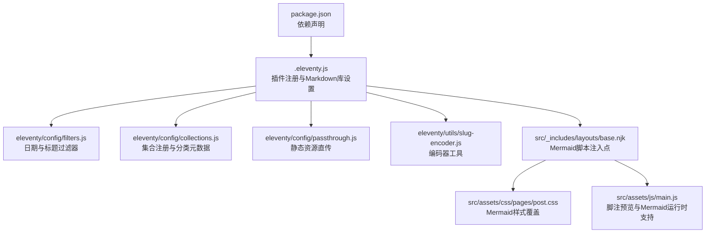
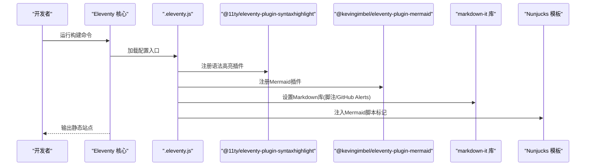
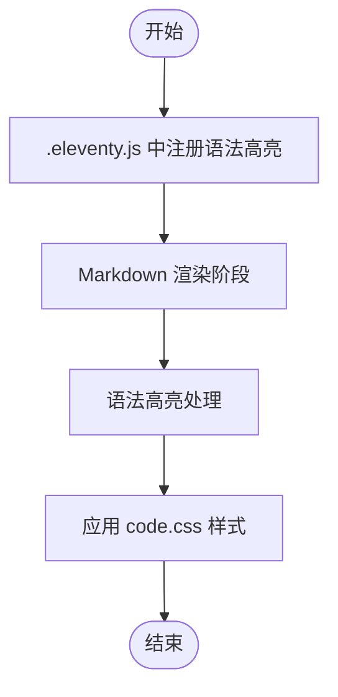
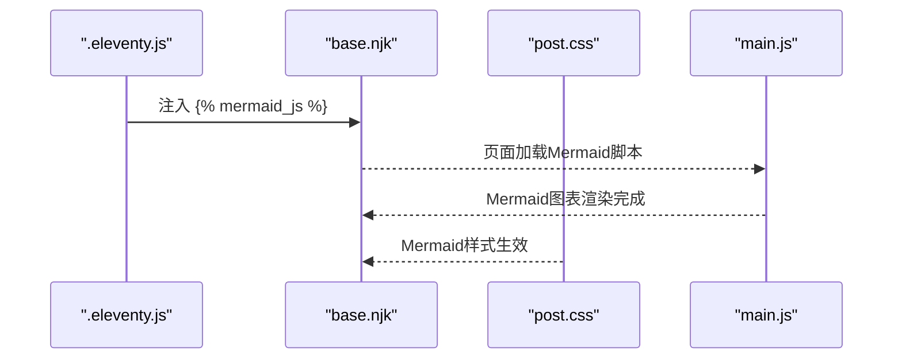
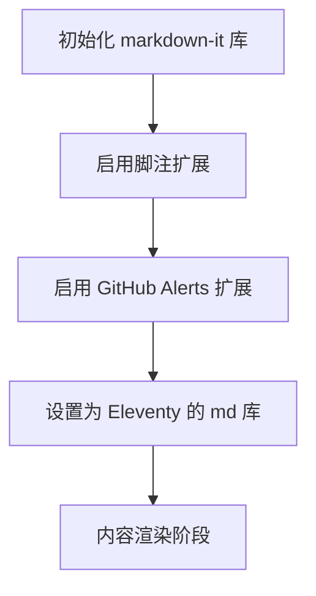
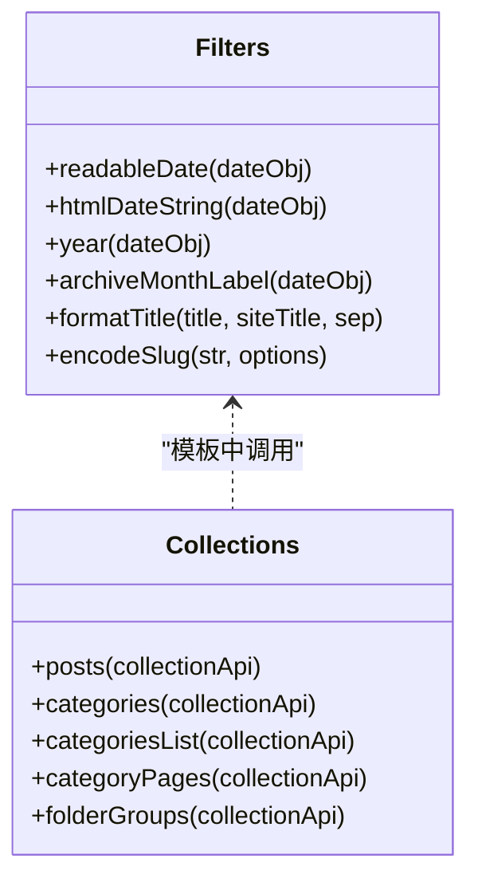
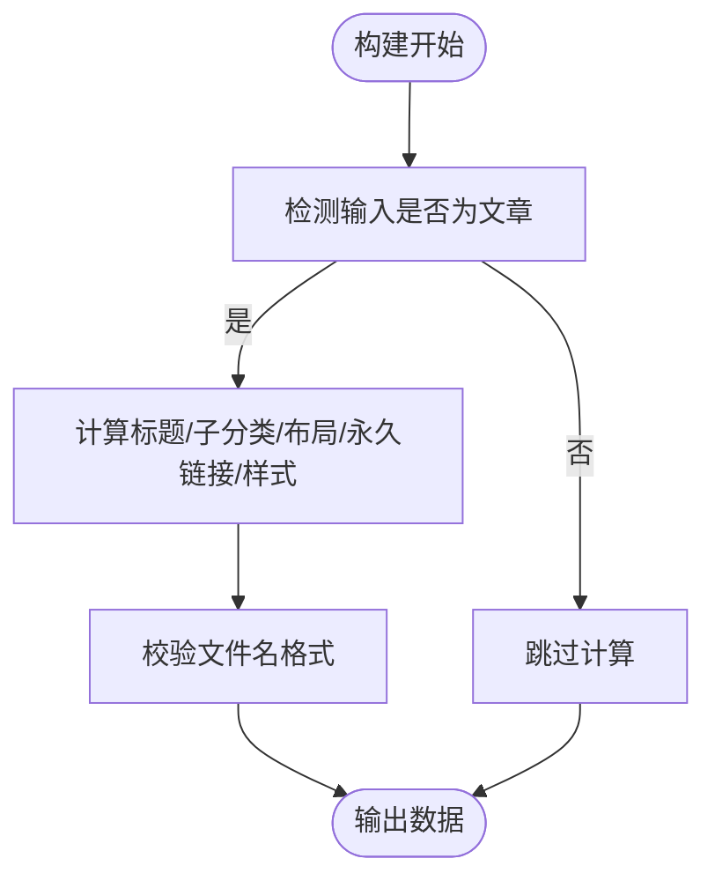
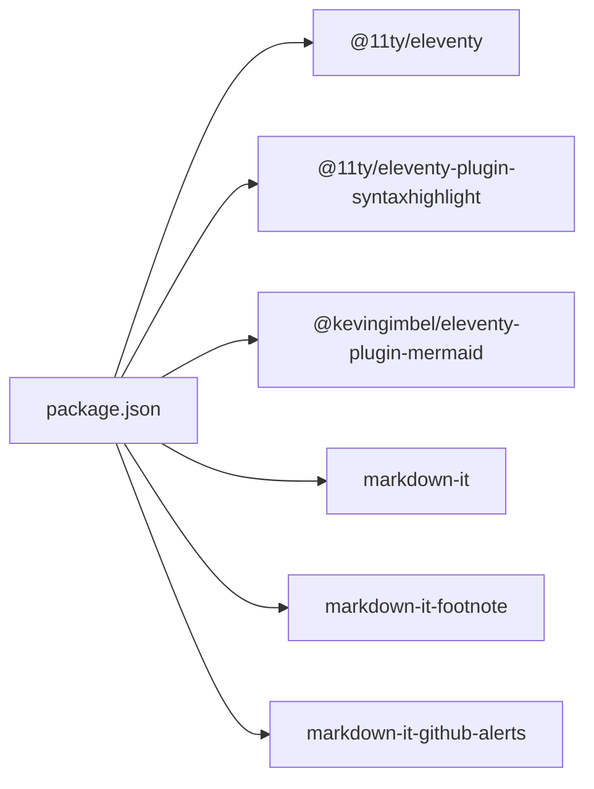

# 插件集成与扩展

<cite>
**本文引用的文件**
- [.eleventy.js](file://.eleventy.js)
- [package.json](file://package.json)
- [eleventy/config/filters.js](file://eleventy/config/filters.js)
- [eleventy/config/collections.js](file://eleventy/config/collections.js)
- [eleventy/config/passthrough.js](file://eleventy/config/passthrough.js)
- [eleventy/utils/slug-encoder.js](file://eleventy/utils/slug-encoder.js)
- [src/_includes/layouts/base.njk](file://src/_includes/layouts/base.njk)
- [src/assets/css/pages/post.css](file://src/assets/css/pages/post.css)
- [src/assets/css/code.css](file://src/assets/css/code.css)
- [src/assets/js/main.js](file://src/assets/js/main.js)
- [src/content/posts/建站需求篇/建站需求清单：估算更新频率@xfq.md](file://src/content/posts/建站需求篇/建站需求清单：估算更新频率@xfq.md)
</cite>

## 目录
1. [引言](#引言)
2. [项目结构](#项目结构)
3. [核心组件](#核心组件)
4. [架构总览](#架构总览)
5. [详细组件分析](#详细组件分析)
6. [依赖关系分析](#依赖关系分析)
7. [性能考量](#性能考量)
8. [故障排除指南](#故障排除指南)
9. [结论](#结论)
10. [附录](#附录)

## 引言
本指南面向希望在11ty RainyNight项目中集成与扩展Eleventy插件系统的工程师与内容作者。文档围绕以下目标展开：
- 深入说明当前已集成插件（语法高亮、Mermaid）的配置与使用路径
- 解释插件注册机制与addPlugin方法的使用方式
- 提供第三方插件的集成步骤与配置要点
- 说明插件间兼容性与冲突处理策略
- 阐述自定义插件的开发流程与发布机制
- 分析插件对构建性能的影响并给出优化建议
- 提供常见插件集成案例与故障排除清单

## 项目结构
RainyNight采用标准的11ty项目布局，核心配置集中在根目录的配置文件中，插件注册与Markdown库设置在此完成；主题与UI逻辑通过Nunjucks模板与CSS/JS资源实现。

**图示来源**
- [.eleventy.js:37-187](file://.eleventy.js#L37-L187)
- [eleventy/config/filters.js:1-49](file://eleventy/config/filters.js#L1-L49)
- [eleventy/config/collections.js:1-377](file://eleventy/config/collections.js#L1-L377)
- [eleventy/config/passthrough.js:1-7](file://eleventy/config/passthrough.js#L1-L7)
- [eleventy/utils/slug-encoder.js:1-98](file://eleventy/utils/slug-encoder.js#L1-L98)
- [src/_includes/layouts/base.njk:1-19](file://src/_includes/layouts/base.njk#L1-L19)
- [src/assets/css/pages/post.css:459-473](file://src/assets/css/pages/post.css#L459-L473)
- [src/assets/js/main.js:280-319](file://src/assets/js/main.js#L280-L319)
- [package.json:1-35](file://package.json#L1-L35)

**章节来源**
- [.eleventy.js:37-187](file://.eleventy.js#L37-L187)
- [package.json:1-35](file://package.json#L1-L35)

## 核心组件
- 插件注册与Markdown库
  - 在配置入口中注册语法高亮与Mermaid插件，并设置Markdown库以启用脚注与GitHub风格告警块。
- 过滤器与集合
  - 注册日期与标题过滤器，以及多类集合（文章、分类树、分页分类页、按目录分组等），并加载分类元数据。
- 资源直传与全局数据
  - 配置静态资源直传路径，注册全局computed数据以统一文章默认字段与样式。
- 工具函数
  - 提供BV风格短ID编码器，用于生成稳定的slug。

**章节来源**
- [.eleventy.js:37-187](file://.eleventy.js#L37-L187)
- [eleventy/config/filters.js:1-49](file://eleventy/config/filters.js#L1-L49)
- [eleventy/config/collections.js:219-371](file://eleventy/config/collections.js#L219-L371)
- [eleventy/config/passthrough.js:1-7](file://eleventy/config/passthrough.js#L1-L7)
- [eleventy/utils/slug-encoder.js:49-64](file://eleventy/utils/slug-encoder.js#L49-L64)

## 架构总览
下图展示了插件系统在构建流程中的位置与交互：

**图示来源**
- [.eleventy.js:37-187](file://.eleventy.js#L37-L187)

## 详细组件分析

### 语法高亮插件（syntaxHighlight）
- 插件注册
  - 通过addPlugin方法注册官方语法高亮插件，用于渲染代码块高亮。
- 样式与主题
  - 项目内置代码高亮样式文件，支持明暗主题下的颜色覆盖，确保阅读体验与品牌一致。
- 使用建议
  - 在Markdown中使用标准代码块语法即可触发高亮；如需特定语言或主题定制，可在插件配置中扩展（若需要）。

**图示来源**
- [.eleventy.js:48](file://.eleventy.js#L48)
- [src/assets/css/code.css:151-284](file://src/assets/css/code.css#L151-L284)

**章节来源**
- [.eleventy.js:48](file://.eleventy.js#L48)
- [src/assets/css/code.css:151-284](file://src/assets/css/code.css#L151-L284)

### Mermaid 图表插件（mermaidPlugin）
- 插件注册与注入
  - 在配置中注册Mermaid插件，并在基础布局中注入Mermaid脚本标记，使页面可渲染Mermaid图表。
- 样式覆盖
  - 为Mermaid容器与SVG提供透明背景、居中与边框移除等样式，确保与站点设计一致。
- 运行时支持
  - 页面脚本中包含脚注预览等交互逻辑，Mermaid渲染完成后可与页面其他脚本协同工作。

**图示来源**
- [.eleventy.js:37-187](file://.eleventy.js#L37-L187)
- [src/_includes/layouts/base.njk:17](file://src/_includes/layouts/base.njk#L17-L17)
- [src/assets/css/pages/post.css:459-473](file://src/assets/css/pages/post.css#L459-L473)
- [src/assets/js/main.js:280-319](file://src/assets/js/main.js#L280-L319)

**章节来源**
- [.eleventy.js:37-187](file://.eleventy.js#L37-L187)
- [src/_includes/layouts/base.njk:17](file://src/_includes/layouts/base.njk#L17-L17)
- [src/assets/css/pages/post.css:459-473](file://src/assets/css/pages/post.css#L459-L473)
- [src/assets/js/main.js:280-319](file://src/assets/js/main.js#L280-L319)

### Markdown 库与扩展（markdown-it）
- 配置与扩展
  - 设置Markdown库选项，启用HTML、换行与链接识别；并启用脚注与GitHub风格告警块扩展。
- 与插件的关系
  - 插件与Markdown库共同作用于内容渲染，插件负责特定功能（如Mermaid、语法高亮），Markdown库负责通用解析。

**图示来源**
- [.eleventy.js:166-177](file://.eleventy.js#L166-L177)

**章节来源**
- [.eleventy.js:166-177](file://.eleventy.js#L166-L177)

### 过滤器与集合
- 过滤器
  - 提供日期格式化、年份提取、归档月份标签、标题格式化与slug编码等过滤器，便于模板中复用。
- 集合
  - 定义文章、分类树、分页分类页、按目录分组等集合，并加载分类元数据，支持子分类与描述管理。

**图示来源**
- [eleventy/config/filters.js:7-46](file://eleventy/config/filters.js#L7-L46)
- [eleventy/config/collections.js:219-371](file://eleventy/config/collections.js#L219-L371)

**章节来源**
- [eleventy/config/filters.js:1-49](file://eleventy/config/filters.js#L1-L49)
- [eleventy/config/collections.js:1-377](file://eleventy/config/collections.js#L1-L377)

### 全局数据与默认字段
- 全局computed数据
  - 对文章输入进行统一处理，自动推断标题、子分类、布局、永久链接、发布时间、更新时间、标签、body类名与页面样式，减少Front Matter重复配置。
- 文件名规范校验
  - 通过集合校验文章文件名必须包含“@”符号，确保URL与分类一致性。

**图示来源**
- [.eleventy.js:41-46](file://.eleventy.js#L41-L46)
- [.eleventy.js:75-164](file://.eleventy.js#L75-L164)
- [.eleventy.js:57-73](file://.eleventy.js#L57-L73)

**章节来源**
- [.eleventy.js:41-46](file://.eleventy.js#L41-L46)
- [.eleventy.js:75-164](file://.eleventy.js#L75-L164)
- [.eleventy.js:57-73](file://.eleventy.js#L57-L73)

### 资源直传与静态资源
- 直传配置
  - 将assets与static目录映射到输出目录，保证图片、字体、脚本等资源原样复制。
- 与插件的关系
  - 直传不影响插件行为，但确保插件生成或引用的资源（如Mermaid脚本、语法高亮样式）可被正确访问。

**章节来源**
- [eleventy/config/passthrough.js:1-7](file://eleventy/config/passthrough.js#L1-L7)
- [.eleventy.js:51](file://.eleventy.js#L51)

### 示例内容与验证
- 示例文章
  - 文章示例展示了Front Matter字段与正文结构，可用于验证过滤器、集合与默认字段计算。
- 文件名校验
  - 若文件名不含“@”，构建时将抛出错误，提示正确的命名格式。

**章节来源**
- [src/content/posts/建站需求篇/建站需求清单：估算更新频率@xfq.md:1-28](file://src/content/posts/建站需求篇/建站需求清单：估算更新频率@xfq.md#L1-L28)
- [.eleventy.js:57-73](file://.eleventy.js#L57-L73)

## 依赖关系分析
- 依赖声明
  - 项目声明了Eleventy核心、Mermaid插件、语法高亮插件、markdown-it及其扩展等依赖。
- 版本与兼容性
  - 通过锁定版本确保插件与核心的兼容性；升级时应关注各包的变更日志与破坏性更新。

**图示来源**
- [package.json:22-33](file://package.json#L22-L33)

**章节来源**
- [package.json:1-35](file://package.json#L1-L35)

## 性能考量
- 插件开销
  - 语法高亮与Mermaid均在构建阶段处理，可能增加构建时间；Mermaid渲染涉及DOM操作与SVG生成，需注意页面脚本加载顺序与延迟策略。
- 优化建议
  - 合理拆分内容，避免单页过多Mermaid图表。
  - 使用懒加载或条件渲染，仅在需要时初始化Mermaid。
  - 控制代码块数量与语言种类，减少不必要的高亮处理。
  - 利用缓存与增量构建（Eleventy内置能力）提升迭代效率。

[本节为通用指导，无需具体文件引用]

## 故障排除指南
- Mermaid图表不显示
  - 检查布局中是否注入Mermaid脚本标记，确认Mermaid脚本加载顺序。
  - 确认Mermaid样式未被覆盖，必要时检查CSS优先级。
- 语法高亮异常
  - 确认代码块语言标识正确；检查样式文件是否加载。
- 文件名格式错误
  - 构建时若出现文件名校验错误，请按提示在文件名中添加“@”分隔符。
- Markdown扩展冲突
  - 若启用多个Markdown扩展导致渲染异常，逐项禁用以定位冲突源。

**章节来源**
- [src/_includes/layouts/base.njk:17](file://src/_includes/layouts/base.njk#L17-L17)
- [src/assets/css/pages/post.css:459-473](file://src/assets/css/pages/post.css#L459-L473)
- [.eleventy.js:57-73](file://.eleventy.js#L57-L73)
- [.eleventy.js:166-177](file://.eleventy.js#L166-L177)

## 结论
RainyNight的插件体系以简洁清晰的方式集成语法高亮与Mermaid，并通过过滤器、集合与全局数据进一步提升内容生产效率。遵循本文的集成步骤与最佳实践，可安全地扩展更多插件并保持良好的性能与可维护性。

[本节为总结性内容，无需具体文件引用]

## 附录

### 第三方插件集成步骤
- 选择插件
  - 在npm上搜索符合需求的Eleventy插件，确认与当前Eleventy版本兼容。
- 安装依赖
  - 使用npm/yarn安装插件包，并将其加入package.json。
- 注册插件
  - 在配置入口中引入插件并调用addPlugin方法；如插件需要配置，传入options对象。
- 验证与调试
  - 运行构建命令，检查输出与浏览器控制台是否有错误；根据需要调整模板或样式。

**章节来源**
- [.eleventy.js:37-187](file://.eleventy.js#L37-L187)
- [package.json:22-33](file://package.json#L22-L33)

### 自定义插件开发与发布
- 开发流程
  - 设计插件接口与生命周期钩子；在配置入口中注册并测试。
  - 编写文档与示例，确保易于集成。
- 发布机制
  - 将插件发布至npm，编写README与CHANGELOG；在仓库中提供最小可运行示例。

[本节为通用指导，无需具体文件引用]