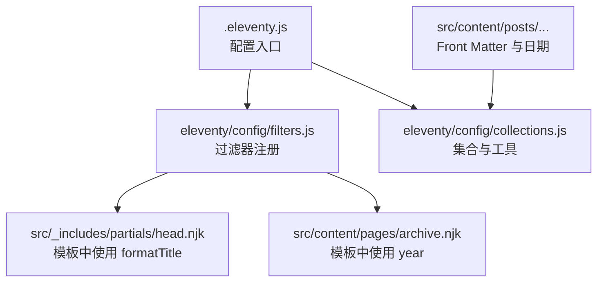
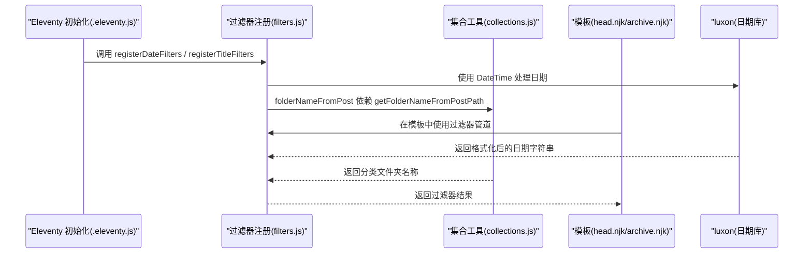
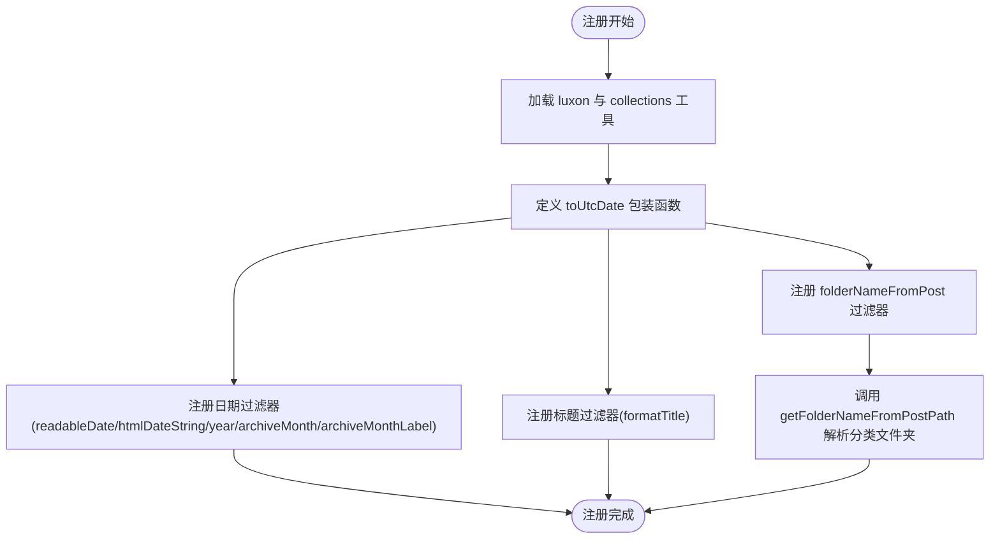
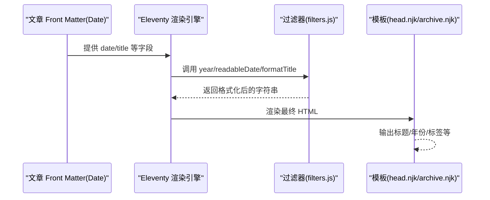
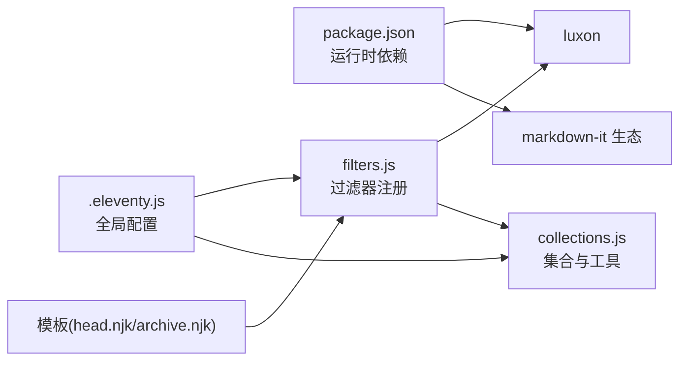

# 自定义过滤器扩展

<cite>
**本文引用的文件**
- [.eleventy.js](file://.eleventy.js)
- [eleventy/config/filters.js](file://eleventy/config/filters.js)
- [eleventy/config/collections.js](file://eleventy/config/collections.js)
- [package.json](file://package.json)
- [src/_includes/partials/head.njk](file://src/_includes/partials/head.njk)
- [src/content/pages/archive.njk](file://src/content/pages/archive.njk)
- [src/content/posts/建站需求篇/建站需求清单：估算更新频率@xfq.md](file://src/content/posts/建站需求篇/建站需求清单：估算更新频率@xfq.md)
</cite>

## 目录
1. [引言](#引言)
2. [项目结构](#项目结构)
3. [核心组件](#核心组件)
4. [架构总览](#架构总览)
5. [详细组件分析](#详细组件分析)
6. [依赖关系分析](#依赖关系分析)
7. [性能考虑](#性能考虑)
8. [故障排查指南](#故障排查指南)
9. [结论](#结论)
10. [附录](#附录)

## 引言
本指南面向希望在 11ty RainyNight 主题中扩展自定义过滤器的开发者。文档围绕现有 filters.js 的实现，系统讲解过滤器注册机制、调用方式与数据处理流程，并提供可直接复用的扩展思路与最佳实践，覆盖日期格式化、标题处理、字符串与数组操作等常见场景。

## 项目结构
与过滤器扩展密切相关的目录与文件如下：
- Eleventy 配置入口：.eleventy.js
- 过滤器注册：eleventy/config/filters.js
- 集合与工具：eleventy/config/collections.js
- 模板使用示例：src/_includes/partials/head.njk、src/content/pages/archive.njk
- 示例内容：src/content/posts/...（用于日期与元数据验证）

图表来源
- [.eleventy.js:36-54](file://.eleventy.js#L36-L54)
- [eleventy/config/filters.js:1-42](file://eleventy/config/filters.js#L1-L42)
- [eleventy/config/collections.js:1-377](file://eleventy/config/collections.js#L1-L377)
- [src/_includes/partials/head.njk:3](file://src/_includes/partials/head.njk#L3)
- [src/content/pages/archive.njk:17](file://src/content/pages/archive.njk#L17)

章节来源
- [.eleventy.js:36-54](file://.eleventy.js#L36-L54)
- [eleventy/config/filters.js:1-42](file://eleventy/config/filters.js#L1-L42)
- [eleventy/config/collections.js:1-377](file://eleventy/config/collections.js#L1-L377)

## 核心组件
- 过滤器注册模块：提供 registerDateFilters 与 registerTitleFilters 两个注册函数，分别向 Eleventy 注册日期与标题相关的全局过滤器。
- 日期过滤器：readableDate、htmlDateString、year、archiveMonth、archiveMonthLabel、folderNameFromPost。
- 标题过滤器：formatTitle，用于生成带站点标题的页面标题，自动去重与分隔符控制。
- 依赖工具：luxon（日期处理）、collections.js 中的 getFolderNameFromPostPath（路径解析）。

章节来源
- [eleventy/config/filters.js:6-30](file://eleventy/config/filters.js#L6-L30)
- [eleventy/config/filters.js:32-40](file://eleventy/config/filters.js#L32-L40)
- [eleventy/config/collections.js:7-22](file://eleventy/config/collections.js#L7-L22)
- [package.json:22-33](file://package.json#L22-L33)

## 架构总览
过滤器在 Eleventy 初始化阶段被注册，并在模板渲染过程中通过管道语法调用。下图展示了从配置到模板使用的整体流程：

图表来源
- [.eleventy.js:52-53](file://.eleventy.js#L52-L53)
- [eleventy/config/filters.js:6-30](file://eleventy/config/filters.js#L6-L30)
- [eleventy/config/filters.js:32-40](file://eleventy/config/filters.js#L32-L40)
- [eleventy/config/collections.js:7-22](file://eleventy/config/collections.js#L7-L22)

## 详细组件分析

### 过滤器注册机制与实现原理
- 注册入口：.eleventy.js 在初始化回调中调用 registerDateFilters 与 registerTitleFilters，完成全局过滤器注册。
- 注册方式：通过 eleventyConfig.addFilter(name, fn) 将过滤器函数挂载为全局可用的管道。
- 日期处理：内部统一使用 luxon 的 DateTime.fromJSDate 并设置时区为 UTC，再以 toFormat 进行格式化，确保输出稳定一致。
- 工具函数：folderNameFromPost 依赖 getFolderNameFromPostPath，从文章 inputPath 解析出顶层分类文件夹名。

图表来源
- [.eleventy.js:52-53](file://.eleventy.js#L52-L53)
- [eleventy/config/filters.js:6-30](file://eleventy/config/filters.js#L6-L30)
- [eleventy/config/filters.js:32-40](file://eleventy/config/filters.js#L32-L40)
- [eleventy/config/collections.js:7-22](file://eleventy/config/collections.js#L7-L22)

章节来源
- [.eleventy.js:52-53](file://.eleventy.js#L52-L53)
- [eleventy/config/filters.js:6-30](file://eleventy/config/filters.js#L6-L30)
- [eleventy/config/filters.js:32-40](file://eleventy/config/filters.js#L32-L40)
- [eleventy/config/collections.js:7-22](file://eleventy/config/collections.js#L7-L22)

### registerDateFilters 实现要点
- readableDate/htmlDateString：统一输出 yyyy-MM-dd 格式，便于人类阅读与 HTML date 输入。
- year/archiveMonth/archiveMonthLabel：分别输出年份、月份与中文月份标签，满足归档与导航需求。
- folderNameFromPost：从文章路径中提取顶层分类文件夹名，作为页面或导航的依据。

章节来源
- [eleventy/config/filters.js:6-30](file://eleventy/config/filters.js#L6-L30)
- [eleventy/config/collections.js:7-22](file://eleventy/config/collections.js#L7-L22)

### registerTitleFilters 实现要点
- formatTitle(title, siteTitle, sep = " | ")：自动拼接标题与站点标题，若标题已包含站点标题则去重，否则按分隔符拼接。
- 类型安全：对传入参数进行显式 String 转换，避免非字符串导致的异常。

章节来源
- [eleventy/config/filters.js:32-40](file://eleventy/config/filters.js#L32-L40)

### 模板中的使用方式与数据流
- 标题拼接：head.njk 中通过 {{ title | formatTitle(siteConfig.meta.title) }} 生成最终页面标题。
- 年份分组：archive.njk 中通过 {{ post.date | year }} 获取发布年份，实现按年份分组列表。
- 全局数据：.eleventy.js 中通过 addGlobalData 计算默认标题、布局、永久链接等，减少模板逻辑复杂度。

图表来源
- [src/_includes/partials/head.njk:3](file://src/_includes/partials/head.njk#L3)
- [src/content/pages/archive.njk:17](file://src/content/pages/archive.njk#L17)
- [.eleventy.js:75-157](file://.eleventy.js#L75-L157)

章节来源
- [src/_includes/partials/head.njk:3](file://src/_includes/partials/head.njk#L3)
- [src/content/pages/archive.njk:17](file://src/content/pages/archive.njk#L17)
- [.eleventy.js:75-157](file://.eleventy.js#L75-L157)

### 过滤器语法与参数说明
- 语法：在 Nunjucks 模板中使用管道符“|”连接过滤器，如 {{ value | filterName(param) }}。
- 参数：formatTitle 支持三个参数（title、siteTitle、sep），其余日期过滤器接收日期对象或可转换为日期的值。
- 返回值：所有过滤器返回字符串，便于直接在模板中输出。

章节来源
- [eleventy/config/filters.js:6-40](file://eleventy/config/filters.js#L6-L40)

### 扩展开发示例（基于现有模式）
以下示例遵循现有注册与实现风格，仅描述思路与调用位置，不直接粘贴代码：

- 字符串处理：新增“首字母大写”过滤器
  - 思路：在 filters.js 中注册 addFilter("capitalizeFirst", fn)，fn 接收字符串并返回首字母大写的版本。
  - 使用：在模板中 {{ post.data.title | capitalizeFirst }}。
  - 位置参考：[filters.js:6-30](file://eleventy/config/filters.js#L6-L30)

- 数组操作：新增“按字段排序”过滤器
  - 思路：在 filters.js 中注册 addFilter("sortByField", fn)，fn 接收数组与字段名，返回排序后的数组。
  - 使用：在模板中 {{ posts | sortByField('date') }}。
  - 位置参考：[filters.js:6-30](file://eleventy/config/filters.js#L6-L30)

- 日期转换：新增“ISO 8601 到本地格式”
  - 思路：在 filters.js 中注册 addFilter("isoToLocal", fn)，fn 使用 luxon 将 ISO 字符串转成本地格式。
  - 使用：在模板中 {{ post.data.updated | isoToLocal }}。
  - 位置参考：[filters.js:6-30](file://eleventy/config/filters.js#L6-L30)

- 分类名称：复用 folderNameFromPost
  - 思路：直接在模板中使用 {{ post | folderNameFromPost }} 获取分类文件夹名。
  - 位置参考：[filters.js:27-29](file://eleventy/config/filters.js#L27-L29)

章节来源
- [eleventy/config/filters.js:6-30](file://eleventy/config/filters.js#L6-L30)
- [eleventy/config/filters.js:27-29](file://eleventy/config/filters.js#L27-L29)

## 依赖关系分析
- 运行时依赖：luxon 用于日期处理；markdown-it 生态插件用于 Markdown 渲染。
- 过滤器依赖：collections.js 提供路径解析工具；.eleventy.js 提供全局数据与集合注册。
- 模板依赖：head.njk 与 archive.njk 直接使用过滤器，形成“数据 → 过滤器 → 模板”的链路。

图表来源
- [package.json:22-33](file://package.json#L22-L33)
- [.eleventy.js:36-54](file://.eleventy.js#L36-L54)
- [eleventy/config/filters.js:1-42](file://eleventy/config/filters.js#L1-L42)
- [eleventy/config/collections.js:1-377](file://eleventy/config/collections.js#L1-L377)

章节来源
- [package.json:22-33](file://package.json#L22-L33)
- [.eleventy.js:36-54](file://.eleventy.js#L36-L54)
- [eleventy/config/filters.js:1-42](file://eleventy/config/filters.js#L1-L42)
- [eleventy/config/collections.js:1-377](file://eleventy/config/collections.js#L1-L377)

## 性能考虑
- 过滤器计算：尽量在过滤器中进行轻量级计算，避免在模板中重复处理同一数据。
- 缓存策略：对于昂贵的计算（如远程请求或复杂数组处理），可在全局数据层缓存结果，减少过滤器重复计算。
- 时区与格式：统一使用 UTC 转换与固定格式，减少跨环境差异带来的额外处理。
- 模板复杂度：将复杂逻辑移至集合或全局数据层，过滤器保持“纯函数式”，提升可维护性与可测试性。

## 故障排查指南
- 过滤器未生效
  - 检查 .eleventy.js 是否正确调用 registerDateFilters/registerTitleFilters。
  - 确认模板中使用了正确的过滤器名称与参数顺序。
  - 参考：[.eleventy.js:52-53](file://.eleventy.js#L52-L53)

- 日期格式异常
  - 确保传入的是可识别的日期对象或字符串；过滤器内部会进行 UTC 转换与格式化。
  - 参考：[eleventy/config/filters.js:6-30](file://eleventy/config/filters.js#L6-L30)

- 标题重复或缺失
  - formatTitle 会自动去重；若标题为空，将回退到站点标题或原标题。
  - 参考：[eleventy/config/filters.js:32-40](file://eleventy/config/filters.js#L32-L40)

- 分类文件夹名不正确
  - folderNameFromPost 依赖文章路径；检查文章 Front Matter 与文件命名规范。
  - 参考：[eleventy/config/collections.js:7-22](file://eleventy/config/collections.js#L7-L22)

章节来源
- [.eleventy.js:52-53](file://.eleventy.js#L52-L53)
- [eleventy/config/filters.js:6-30](file://eleventy/config/filters.js#L6-L30)
- [eleventy/config/filters.js:32-40](file://eleventy/config/filters.js#L32-L40)
- [eleventy/config/collections.js:7-22](file://eleventy/config/collections.js#L7-L22)

## 结论
通过现有 filters.js 的注册模式与 collections.js 的工具函数，RainyNight 已具备清晰的过滤器扩展路径。建议在新增过滤器时遵循“轻量、纯函数、可复用”的原则，并将复杂逻辑迁移至集合或全局数据层，以获得更好的可维护性与性能表现。

## 附录
- 模板中使用示例位置
  - 标题过滤器：[src/_includes/partials/head.njk:3](file://src/_includes/partials/head.njk#L3)
  - 年份过滤器：[src/content/pages/archive.njk:17](file://src/content/pages/archive.njk#L17)
- 示例内容（含日期）：[src/content/posts/建站需求篇/建站需求清单：估算更新频率@xfq.md:1-28](file://src/content/posts/建站需求篇/建站需求清单：估算更新频率@xfq.md#L1-L28)