# 自定义集合开发

<cite>
**本文引用的文件列表**
- [collections.js](file://eleventy/config/collections.js)
- [.eleventy.js](file://.eleventy.js)
- [siteConfig.js](file://src/content/settings/siteConfig.js)
- [categoryDescriptions.json](file://src/content/settings/categoryDescriptions.json)
- [categories.njk](file://src/content/pages/categories.njk)
- [category-detail.njk](file://src/content/pages/category-detail.njk)
- [search.11ty.js](file://src/content/search.11ty.js)
- [main.js](file://src/assets/js/main.js)
- [manage-categories.js](file://scripts/manage-categories.js)
- [sync-category-meta.js](file://scripts/sync-category-meta.js)
</cite>

## 目录
1. [简介](#简介)
2. [项目结构](#项目结构)
3. [核心组件](#核心组件)
4. [架构总览](#架构总览)
5. [详细组件分析](#详细组件分析)
6. [依赖关系分析](#依赖关系分析)
7. [性能考量](#性能考量)
8. [故障排查指南](#故障排查指南)
9. [结论](#结论)
10. [附录](#附录)

## 简介
本指南面向希望在11ty RainyNight主题中扩展自定义集合（collections）的开发者。我们将基于现有的集合注册机制与现有集合实现，系统讲解：
- 集合注册机制与registerCollections函数的工作原理
- 如何创建新的内容集合（文章集合、页面集合、自定义内容类型）
- 集合的过滤、排序与分组策略
- 与模板系统的集成方式与数据传递机制
- 实战示例：按分类、标签、日期等条件筛选内容
- 性能优化技巧与最佳实践

## 项目结构
本项目采用“按功能分层”的组织方式：
- 配置层：Eleventy主配置与集合注册
- 数据层：全局配置与分类元数据
- 内容层：文章与页面内容
- 模板层：Nunjucks模板与页面
- 工具脚本：分类元数据同步与管理工具

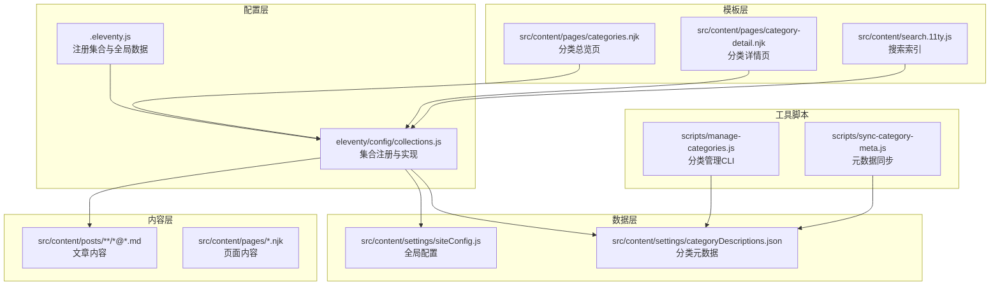

图表来源
- [.eleventy.js:36-54](file://.eleventy.js#L36-L54)
- [collections.js:219-371](file://eleventy/config/collections.js#L219-L371)
- [siteConfig.js:40-49](file://src/content/settings/siteConfig.js#L40-L49)
- [categoryDescriptions.json:1-60](file://src/content/settings/categoryDescriptions.json#L1-L60)

章节来源
- [.eleventy.js:36-54](file://.eleventy.js#L36-L54)
- [collections.js:219-371](file://eleventy/config/collections.js#L219-L371)

## 核心组件
- 集合注册器：在Eleventy主配置中调用registerCollections，向Eleventy注册多个集合。
- 文章集合：从内容目录中筛选Markdown文章并按日期排序。
- 分类集合：按层级路径构建分类树，支持子分类与描述。
- 分类页面集合：为每个分类生成分页页面，包含面包屑、子分类卡片等。
- 文件夹分组集合：按文章所在目录分组，聚合分类与描述信息。
- 全局配置：提供分页大小等参数，影响分类页面的分页行为。
- 分类元数据：JSON文件提供分类与子分类的描述信息，用于渲染UI。

章节来源
- [collections.js:219-371](file://eleventy/config/collections.js#L219-L371)
- [.eleventy.js:36-54](file://.eleventy.js#L36-L54)
- [siteConfig.js:40-49](file://src/content/settings/siteConfig.js#L40-L49)
- [categoryDescriptions.json:1-60](file://src/content/settings/categoryDescriptions.json#L1-L60)

## 架构总览
集合系统的核心是registerCollections函数，它在Eleventy初始化时被调用，向Eleventy注册多个集合。集合的数据来源主要是内容目录中的Markdown文件，经过过滤、解析与加工后，输出给模板使用。

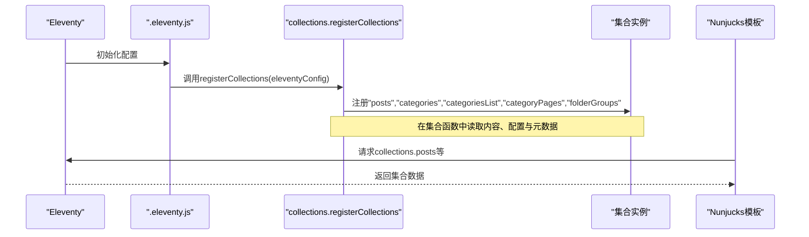

图表来源
- [.eleventy.js:54](file://.eleventy.js#L54)
- [collections.js:219-371](file://eleventy/config/collections.js#L219-L371)

## 详细组件分析

### 集合注册机制与registerCollections
- 注册时机：在Eleventy主配置中调用registerCollections，确保集合在模板渲染前可用。
- 集合命名：通过addCollection注册多个集合名称，模板中以collections.<name>访问。
- 参数来源：集合函数接收collectionApi，可使用getAll、getFilteredByGlob等API获取内容；同时读取全局配置与分类元数据。

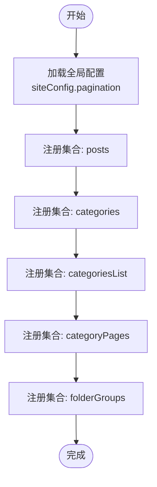

图表来源
- [.eleventy.js:54](file://.eleventy.js#L54)
- [collections.js:219-371](file://eleventy/config/collections.js#L219-L371)

章节来源
- [.eleventy.js:54](file://.eleventy.js#L54)
- [collections.js:219-371](file://eleventy/config/collections.js#L219-L371)

### 文章集合（posts）
- 数据来源：通过getAll过滤出内容目录下的Markdown文章。
- 排序规则：按date字段降序排列。
- 使用场景：首页、归档页、搜索索引等。

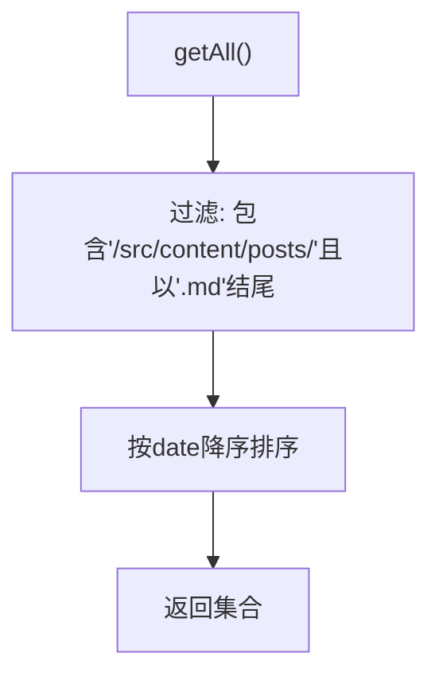

图表来源
- [collections.js:31-40](file://eleventy/config/collections.js#L31-L40)

章节来源
- [collections.js:31-40](file://eleventy/config/collections.js#L31-L40)

### 分类集合（categories）
- 数据来源：基于文章集合，按分类路径构建层级映射。
- 结果结构：以分类路径为键，值为该分类下的文章数组。
- 使用场景：用于构建分类树或直接按分类键访问。

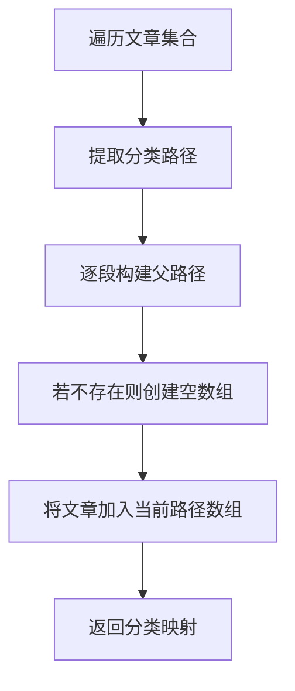

图表来源
- [collections.js:228-251](file://eleventy/config/collections.js#L228-L251)

章节来源
- [collections.js:228-251](file://eleventy/config/collections.js#L228-L251)

### 分类列表集合（categoriesList）
- 数据来源：基于文章集合与分类元数据，构建分类树节点。
- 节点属性：包含key、title、posts、children、parent、meta等。
- 使用场景：分类总览页展示多文件夹分组与分类卡片。

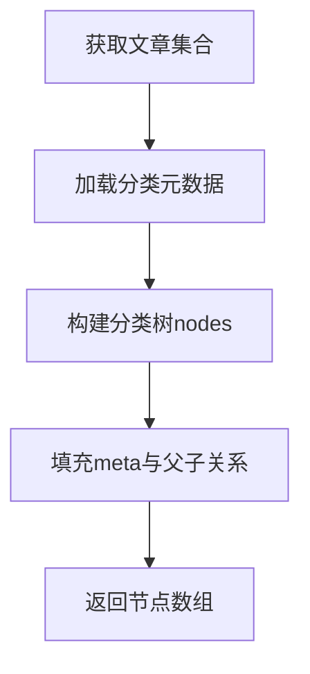

图表来源
- [collections.js:253-258](file://eleventy/config/collections.js#L253-L258)
- [collections.js:145-217](file://eleventy/config/collections.js#L145-L217)

章节来源
- [collections.js:253-258](file://eleventy/config/collections.js#L253-L258)
- [collections.js:145-217](file://eleventy/config/collections.js#L145-L217)

### 分类页面集合（categoryPages）
- 数据来源：基于分类树节点，对每篇文章按自定义顺序、日期、标题排序。
- 分页逻辑：根据全局配置的分页大小计算总页数与URL。
- 输出字段：包含key、title、url、baseUrl、pageNumber、totalPages、count、posts、children、breadcrumbs、meta等。
- 使用场景：分类详情页，支持分页与子分类导航。

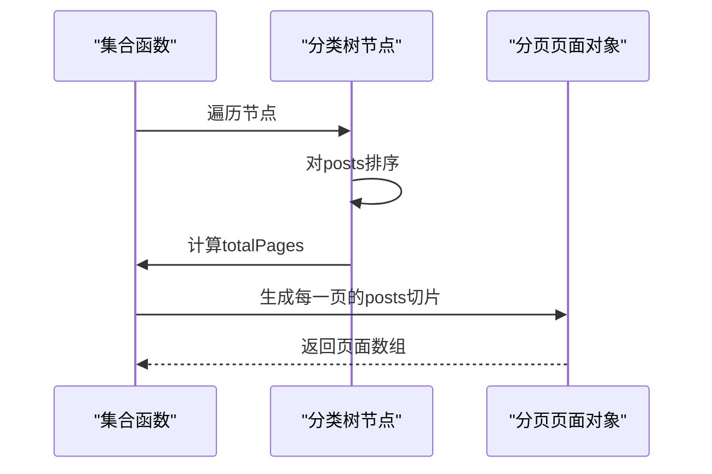

图表来源
- [collections.js:260-316](file://eleventy/config/collections.js#L260-L316)
- [siteConfig.js:40-49](file://src/content/settings/siteConfig.js#L40-L49)

章节来源
- [collections.js:260-316](file://eleventy/config/collections.js#L260-L316)
- [siteConfig.js:40-49](file://src/content/settings/siteConfig.js#L40-L49)

### 文件夹分组集合（folderGroups）
- 数据来源：基于文章集合，按文章所在目录分组，聚合分类与描述信息。
- 显示逻辑：支持子分类显示名称与描述，自动回退到顶级分类描述。
- 使用场景：分类总览页的“文件夹”卡片布局。

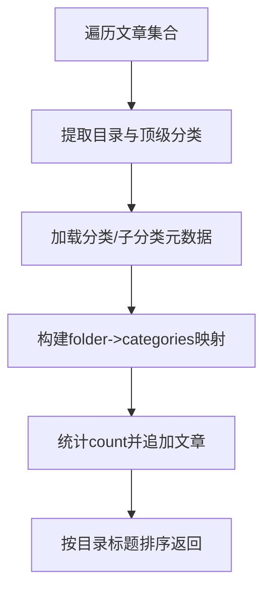

图表来源
- [collections.js:318-370](file://eleventy/config/collections.js#L318-L370)
- [categoryDescriptions.json:1-60](file://src/content/settings/categoryDescriptions.json#L1-L60)

章节来源
- [collections.js:318-370](file://eleventy/config/collections.js#L318-L370)
- [categoryDescriptions.json:1-60](file://src/content/settings/categoryDescriptions.json#L1-L60)

### 模板系统集成与数据传递
- 模板访问集合：在Nunjucks模板中通过collections.posts、collections.categoriesList等访问集合数据。
- 分页集成：分类详情页通过pagination配置绑定到categoryPages集合，实现分页渲染。
- 全局样式与脚本：通过eleventyComputed为文章页注入样式与脚本，提升交互体验。

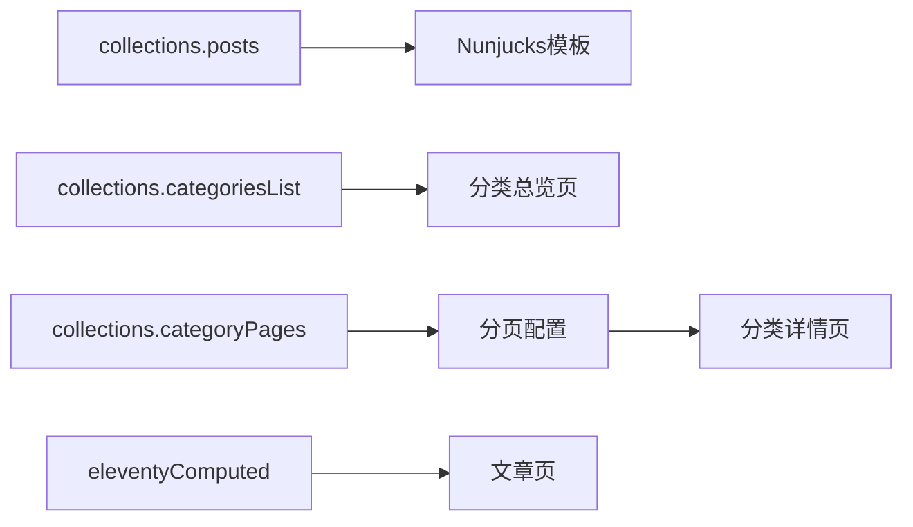

图表来源
- [categories.njk:17-52](file://src/content/pages/categories.njk#L17-L52)
- [category-detail.njk:4-11](file://src/content/pages/category-detail.njk#L4-L11)
- [.eleventy.js:75-157](file://.eleventy.js#L75-L157)

章节来源
- [categories.njk:17-52](file://src/content/pages/categories.njk#L17-L52)
- [category-detail.njk:4-11](file://src/content/pages/category-detail.njk#L4-L11)
- [.eleventy.js:75-157](file://.eleventy.js#L75-L157)

### 过滤、排序与分组实现
- 过滤：通过getAll与路径匹配过滤出文章；也可使用getFilteredByGlob按通配符过滤。
- 排序：按日期降序；分类详情页按自定义顺序、日期、标题排序。
- 分组：按分类路径分组；按文章所在目录分组；按子分类代码分组。

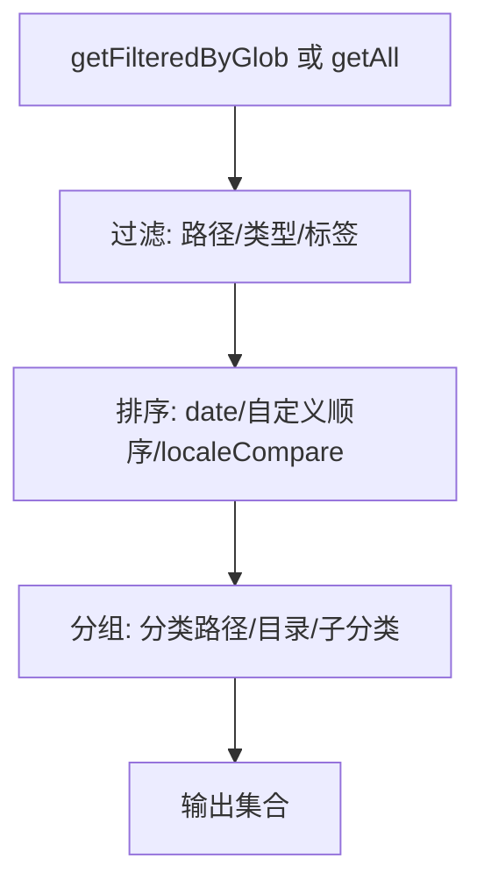

图表来源
- [collections.js:31-40](file://eleventy/config/collections.js#L31-L40)
- [collections.js:50-61](file://eleventy/config/collections.js#L50-L61)
- [collections.js:318-370](file://eleventy/config/collections.js#L318-L370)

章节来源
- [collections.js:31-40](file://eleventy/config/collections.js#L31-L40)
- [collections.js:50-61](file://eleventy/config/collections.js#L50-L61)
- [collections.js:318-370](file://eleventy/config/collections.js#L318-L370)

### 自定义集合开发示例

#### 示例一：创建按标签过滤的文章集合
- 目标：只输出带有特定标签的文章集合。
- 步骤：
  1) 在集合函数中获取所有文章集合。
  2) 使用filter按tags字段过滤。
  3) 可选：按date排序。
  4) 在模板中通过collections.<name>访问。

章节来源
- [collections.js:31-40](file://eleventy/config/collections.js#L31-L40)

#### 示例二：创建按日期范围分组的集合
- 目标：按年/月分组文章。
- 步骤：
  1) 获取文章集合。
  2) 使用date字段提取年/月。
  3) 以年/月为键构建映射。
  4) 可选：按年/月降序排序。
  5) 在模板中渲染分组列表。

章节来源
- [collections.js:31-40](file://eleventy/config/collections.js#L31-L40)

#### 示例三：创建页面集合（非文章内容）
- 目标：输出页面内容集合（如静态页面、服务说明页）。
- 步骤：
  1) 使用getFilteredByGlob匹配页面文件。
  2) 可选：按permalink或date排序。
  3) 在模板中渲染页面列表。

章节来源
- [.eleventy.js:57-72](file://.eleventy.js#L57-L72)

#### 示例四：创建自定义内容类型集合
- 目标：输出自定义数据模型（如Moments、Records）。
- 步骤：
  1) 定义数据来源（JSON、YAML或Markdown）。
  2) 在集合函数中读取并转换为统一结构。
  3) 可选：按date或自定义字段排序。
  4) 在模板中渲染。

章节来源
- [collections.js:219-371](file://eleventy/config/collections.js#L219-L371)

## 依赖关系分析
- 集合依赖：
  - 依赖全局配置（分页大小）。
  - 依赖分类元数据（描述、子分类）。
  - 依赖内容目录结构（文章路径、文件名约定）。
- 模板依赖：
  - 分类总览页依赖folderGroups与categoriesList。
  - 分类详情页依赖categoryPages与pagination配置。
  - 搜索索引依赖posts集合。

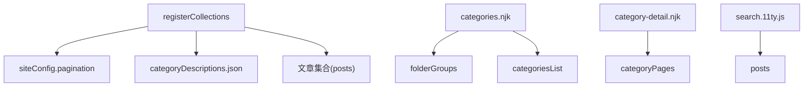

图表来源
- [collections.js:219-371](file://eleventy/config/collections.js#L219-L371)
- [siteConfig.js:40-49](file://src/content/settings/siteConfig.js#L40-L49)
- [categoryDescriptions.json:1-60](file://src/content/settings/categoryDescriptions.json#L1-L60)
- [categories.njk:17-52](file://src/content/pages/categories.njk#L17-L52)
- [category-detail.njk:4-11](file://src/content/pages/category-detail.njk#L4-L11)
- [search.11ty.js:36-47](file://src/content/search.11ty.js#L36-L47)

章节来源
- [collections.js:219-371](file://eleventy/config/collections.js#L219-L371)
- [siteConfig.js:40-49](file://src/content/settings/siteConfig.js#L40-L49)
- [categoryDescriptions.json:1-60](file://src/content/settings/categoryDescriptions.json#L1-L60)
- [categories.njk:17-52](file://src/content/pages/categories.njk#L17-L52)
- [category-detail.njk:4-11](file://src/content/pages/category-detail.njk#L4-L11)
- [search.11ty.js:36-47](file://src/content/search.11ty.js#L36-L47)

## 性能考量
- 减少重复计算：在集合函数内部缓存中间结果（如分类树、元数据），避免多次解析。
- 控制集合规模：通过分页与过滤限制单次渲染的数据量。
- 优化排序与比较：使用本地化比较时指定语言环境，避免不必要的字符串转换。
- 避免I/O频繁：分类元数据读取应尽量在进程启动时完成，减少运行时开销。
- 模板侧懒加载：对于大列表，采用分页或虚拟滚动，减少DOM压力。
- 构建性能监控：可参考性能自检脚本，定期评估构建产物体积与质量。

[本节为通用指导，无需具体文件引用]

## 故障排查指南
- 文章文件名格式错误：集合验证器会检查文章文件名是否包含“@”符号，不符合要求会抛出错误。
- 分类元数据无效：当JSON文件格式错误时，集合会使用默认描述并发出警告。
- 分类页面分页异常：检查全局配置中的分页大小是否为正数，否则使用默认值。
- 子分类描述缺失：若未配置子分类描述，将回退到顶级分类描述或默认描述。

章节来源
- [.eleventy.js:57-72](file://.eleventy.js#L57-L72)
- [collections.js:63-71](file://eleventy/config/collections.js#L63-L71)
- [collections.js:220-222](file://eleventy/config/collections.js#L220-L222)
- [collections.js:129-136](file://eleventy/config/collections.js#L129-L136)

## 结论
通过理解并复用现有的集合注册机制与实现模式，开发者可以高效地扩展自定义集合，满足多样化的页面需求。建议遵循以下原则：
- 将集合逻辑集中在collections.js中，保持模板简洁。
- 使用全局配置控制分页与排序策略。
- 通过分类元数据提升内容可读性与可维护性。
- 在模板中合理使用分页与懒加载，保证性能与体验。

[本节为总结，无需具体文件引用]

## 附录

### 常用集合开发模式速查
- 文章集合：过滤内容目录下的Markdown，按date排序。
- 分类集合：按分类路径构建层级映射。
- 分类页面集合：为每个分类生成分页页面，包含面包屑与子分类。
- 文件夹分组集合：按目录分组，聚合分类与描述。
- 页面集合：使用getFilteredByGlob匹配页面文件。
- 自定义内容类型：读取外部数据源并转换为统一结构。

章节来源
- [collections.js:31-40](file://eleventy/config/collections.js#L31-L40)
- [collections.js:228-251](file://eleventy/config/collections.js#L228-L251)
- [collections.js:260-316](file://eleventy/config/collections.js#L260-L316)
- [collections.js:318-370](file://eleventy/config/collections.js#L318-L370)
- [.eleventy.js:57-72](file://.eleventy.js#L57-L72)

### 分类元数据管理工具
- 分类管理CLI：提供列出、重命名、删除、设置描述等操作。
- 元数据同步：扫描内容目录，自动生成分类与子分类的描述占位。

章节来源
- [manage-categories.js:195-211](file://scripts/manage-categories.js#L195-L211)
- [sync-category-meta.js:45-84](file://scripts/sync-category-meta.js#L45-L84)