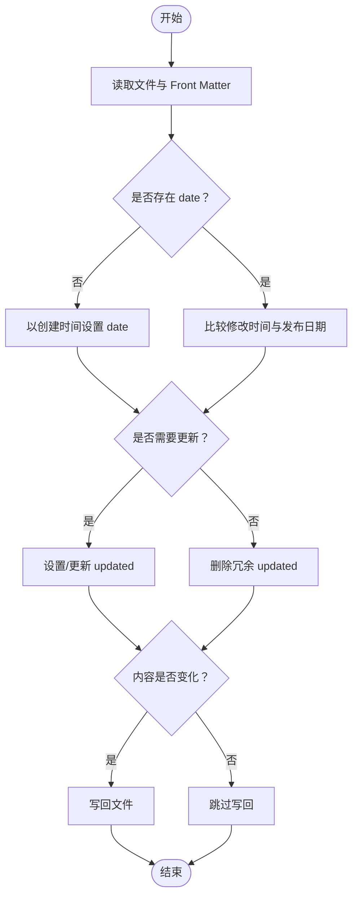
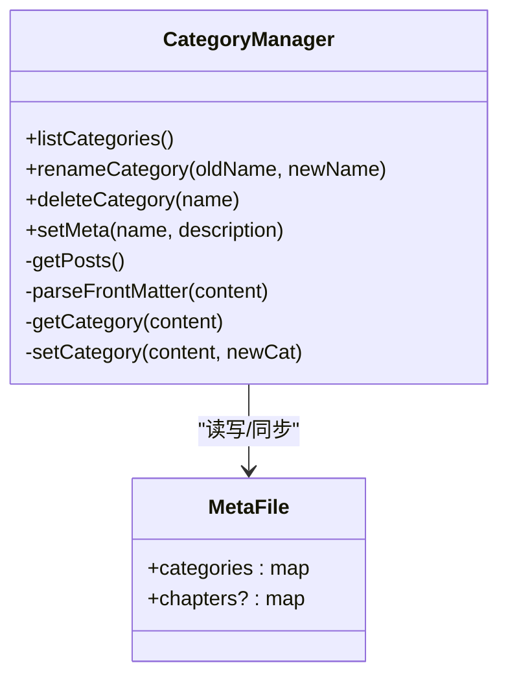
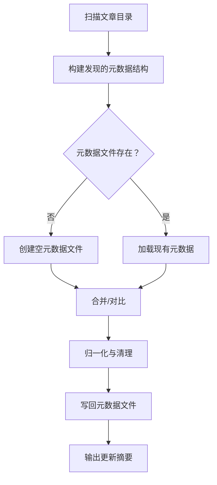
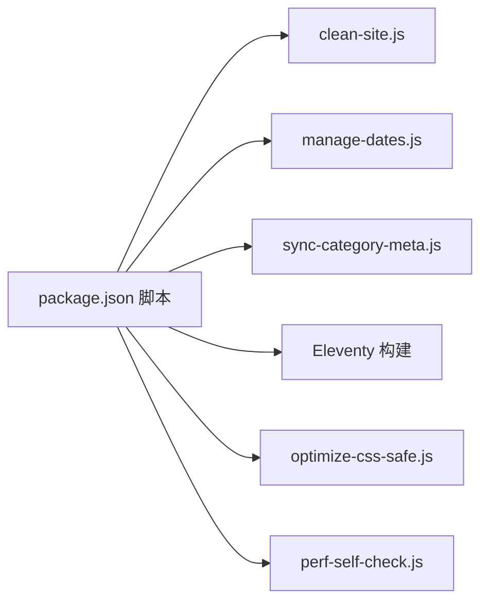

# 内容管理脚本

<cite>
**本文引用的文件列表**
- [manage-dates.js](file://scripts/manage-dates.js)
- [manage-categories.js](file://scripts/manage-categories.js)
- [sync-category-meta.js](file://scripts/sync-category-meta.js)
- [categoryDescriptions.json](file://src/content/settings/categoryDescriptions.json)
- [package.json](file://package.json)
- [clean-site.js](file://scripts/clean-site.js)
- [optimize-css-safe.js](file://scripts/optimize-css-safe.js)
- [perf-self-check.js](file://scripts/perf-self-check.js)
- [建站需求清单：估算更新频率@xfq.md](file://src/content/posts/建站需求篇/建站需求清单：估算更新频率@xfq.md)
- [演示案例 01：前端开发者个人主页@xs.md](file://src/content/posts/项目速览/演示案例 01：前端开发者个人主页@xs.md)
</cite>

## 目录
1. [简介](#简介)
2. [项目结构](#项目结构)
3. [核心组件](#核心组件)
4. [架构总览](#架构总览)
5. [详细组件分析](#详细组件分析)
6. [依赖关系分析](#依赖关系分析)
7. [性能考量](#性能考量)
8. [故障排查指南](#故障排查指南)
9. [结论](#结论)
10. [附录](#附录)

## 简介
本文件系统性梳理并解读内容管理脚本，覆盖以下三个关键脚本：
- manage-dates.js：批量更新文章 Front Matter 中的创建与修改日期，基于文件系统的时间戳自动推断并规范化日期格式。
- manage-categories.js：对文章分类进行创建、删除、重命名与层级调整，并同步分类元数据（描述）。
- sync-category-meta.js：扫描文章目录，自动生成/同步分类与子分类的元数据文件，确保描述与实际内容一致。

同时给出使用示例、参数说明、最佳实践、备份建议及在内容维护工作流中的自动化处理流程。

## 项目结构
仓库采用“内容驱动 + Eleventy 构建”的组织方式，内容位于 src/content 下，构建脚本位于 scripts 目录，站点输出在 _site。构建流程通过 npm scripts 自动串联多个脚本，形成“预构建 -> 元数据同步 -> 构建 -> 资源优化 -> 性能自检”的闭环。

```mermaid
graph TB
subgraph "构建脚本"
MD["scripts/manage-dates.js"]
MC["scripts/manage-categories.js"]
SM["scripts/sync-category-meta.js"]
CS["scripts/clean-site.js"]
OC["scripts/optimize-css-safe.js"]
PS["scripts/perf-self-check.js"]
end
subgraph "内容与设置"
POSTS["src/content/posts"]
SETT["src/content/settings"]
DESC["src/content/settings/categoryDescriptions.json"]
end
PKG["package.json"]
PKG --> MD
PKG --> SM
PKG --> CS
PKG --> OC
PKG --> PS
MD --> POSTS
MC --> POSTS
MC --> DESC
SM --> POSTS
SM --> DESC
OC --> "_site/assets/css"
PS --> "_site"
```

图表来源
- [package.json:6-16](file://package.json#L6-L16)
- [manage-dates.js:5-85](file://scripts/manage-dates.js#L5-L85)
- [manage-categories.js:4-11](file://scripts/manage-categories.js#L4-L11)
- [sync-category-meta.js:4-6](file://scripts/sync-category-meta.js#L4-L6)

章节来源
- [package.json:6-16](file://package.json#L6-L16)

## 核心组件
- manage-dates.js：遍历文章目录，解析 Front Matter，依据文件创建/修改时间自动补全或更新 date 与 updated 字段，避免冗余，仅在内容变化时写回。
- manage-categories.js：提供分类管理 CLI，支持列出、重命名、删除分类，以及为分类设置描述；同时同步 categoryDescriptions.json 的元数据。
- sync-category-meta.js：扫描文章目录，根据目录结构与文件名中的子分类标识生成/同步元数据，保证描述文件与实际内容一致。

章节来源
- [manage-dates.js:16-85](file://scripts/manage-dates.js#L16-L85)
- [manage-categories.js:63-211](file://scripts/manage-categories.js#L63-L211)
- [sync-category-meta.js:36-205](file://scripts/sync-category-meta.js#L36-L205)

## 架构总览
下图展示了构建流程中各脚本的调用顺序与职责边界，以及与内容/设置文件的交互关系。

```mermaid
sequenceDiagram
participant Dev as "开发者"
participant NPM as "npm scripts(package.json)"
participant Clean as "clean-site.js"
participant Dates as "manage-dates.js"
participant Sync as "sync-category-meta.js"
participant Eleventy as "Eleventy 构建"
participant Opt as "optimize-css-safe.js"
participant Perf as "perf-self-check.js"
Dev->>NPM : 执行构建命令
NPM->>Clean : 清理旧站点
NPM->>Dates : 更新文章日期
NPM->>Sync : 同步分类元数据
NPM->>Eleventy : 生成静态站点
Eleventy-->>Opt : 输出到 _site
Opt-->>Perf : 优化 CSS 并统计体积
Perf-->>Dev : 输出性能报告
```

图表来源
- [package.json:9-16](file://package.json#L9-L16)
- [clean-site.js:1-11](file://scripts/clean-site.js#L1-L11)
- [manage-dates.js:82-85](file://scripts/manage-dates.js#L82-L85)
- [sync-category-meta.js:204-205](file://scripts/sync-category-meta.js#L204-L205)
- [optimize-css-safe.js:82-112](file://scripts/optimize-css-safe.js#L82-L112)
- [perf-self-check.js:170-199](file://scripts/perf-self-check.js#L170-L199)

## 详细组件分析

### manage-dates.js：批量日期管理
- 目标：确保每篇文章的 Front Matter 中存在 date 字段，并在显著修改后自动更新 updated 字段，未修改则移除冗余字段。
- 关键逻辑
  - 解析 Front Matter 与文件系统 stat，提取创建时间与最后修改时间。
  - 若 Front Matter 缺失 date，则以文件创建时间填充。
  - 若文件最后修改时间明显晚于发布日期（超过阈值），则更新 updated；否则删除冗余 updated。
  - 仅在内容确实发生变化时写回文件，避免不必要的磁盘写入。
- 时间戳与格式化
  - 使用本地时间格式化为 YYYY-MM-DD 字符串，便于人类阅读与一致性。
  - 通过最小更新间隔阈值（毫秒级）避免微小改动导致的频繁更新。
- 处理流程图



图表来源
- [manage-dates.js:16-68](file://scripts/manage-dates.js#L16-L68)

章节来源
- [manage-dates.js:8-14](file://scripts/manage-dates.js#L8-L14)
- [manage-dates.js:25-55](file://scripts/manage-dates.js#L25-L55)
- [manage-dates.js:57-67](file://scripts/manage-dates.js#L57-L67)
- [manage-dates.js:70-80](file://scripts/manage-dates.js#L70-L80)

使用示例与参数
- 批量运行：直接执行脚本即可扫描 src/content/posts 下所有 Markdown 文件并按规则更新日期。
- 适用场景：首次导入大量文章、迁移内容后统一日期、定期维护时自动刷新更新时间。

最佳实践
- 在构建前运行，确保 Front Matter 日期稳定。
- 修改时间与发布日期差异过小（如秒级）可能被忽略，属于预期行为。
- 若需手动干预，可在执行后检查日志并进行微调。

### manage-categories.js：分类管理与元数据同步
- 目标：提供分类的增删改查与层级调整能力，并同步分类元数据文件。
- 主要功能
  - 列出现有分类及其数量：从文章 Front Matter 中提取 category 字段并统计。
  - 重命名分类：支持根分类与子分类（含斜杠路径）的批量重命名，并同步元数据键名。
  - 删除分类：移除文章 Front Matter 中的 category 字段，并清理元数据。
  - 设置元数据：为分类设置描述，兼容字符串与对象两种格式。
- 数据模型与文件
  - 分类元数据文件：src/content/settings/categoryDescriptions.json，结构包含 categories 与 subcategories。
  - 文章 Front Matter：category 字段用于标识分类路径（支持斜杠分隔的层级）。
- 类图



图表来源
- [manage-categories.js:13-32](file://scripts/manage-categories.js#L13-L32)
- [manage-categories.js:34-61](file://scripts/manage-categories.js#L34-L61)
- [manage-categories.js:95-146](file://scripts/manage-categories.js#L95-L146)
- [manage-categories.js:148-174](file://scripts/manage-categories.js#L148-L174)
- [manage-categories.js:176-189](file://scripts/manage-categories.js#L176-L189)
- [categoryDescriptions.json:1-60](file://src/content/settings/categoryDescriptions.json#L1-L60)

章节来源
- [manage-categories.js:63-93](file://scripts/manage-categories.js#L63-L93)
- [manage-categories.js:95-146](file://scripts/manage-categories.js#L95-L146)
- [manage-categories.js:148-174](file://scripts/manage-categories.js#L148-L174)
- [manage-categories.js:176-189](file://scripts/manage-categories.js#L176-L189)
- [categoryDescriptions.json:1-60](file://src/content/settings/categoryDescriptions.json#L1-L60)

使用示例与参数
- 列出分类：node scripts/manage-categories.js list
- 重命名分类：node scripts/manage-categories.js rename <旧名称> <新名称>
- 删除分类：node scripts/manage-categories.js delete <分类名称>
- 设置元数据：node scripts/manage-categories.js meta "<分类路径>" "<描述>"

最佳实践
- 重命名时注意层级路径（如“父/子”），脚本会自动处理子分类的批量替换。
- 元数据文件若缺失会自动创建空结构，确保脚本可安全运行。
- 建议在重命名或删除前备份元数据文件，以防误操作。

### sync-category-meta.js：分类元数据同步
- 目标：扫描文章目录，根据目录结构与文件名中的子分类标识，自动生成/同步分类与子分类的元数据，确保描述文件与实际内容一致。
- 关键逻辑
  - 遍历文章目录，识别顶层分类（目录名）与子分类代码（文件名 @ 后缀）。
  - 生成临时发现的元数据结构，包含 categories 与 subcategories。
  - 与现有元数据文件对比，执行新增、删除、归一化等操作：
    - 新增：将发现但不存在的分类加入元数据。
    - 删除：移除不再存在的分类。
    - 归一化：修复旧格式、移除无效字段、确保结构正确。
  - 默认描述：未定义时使用默认提示文本。
- 流程图



图表来源
- [sync-category-meta.js:36-205](file://scripts/sync-category-meta.js#L36-L205)

章节来源
- [sync-category-meta.js:9-25](file://scripts/sync-category-meta.js#L9-L25)
- [sync-category-meta.js:27-34](file://scripts/sync-category-meta.js#L27-L34)
- [sync-category-meta.js:36-88](file://scripts/sync-category-meta.js#L36-L88)
- [sync-category-meta.js:117-188](file://scripts/sync-category-meta.js#L117-L188)
- [sync-category-meta.js:190-202](file://scripts/sync-category-meta.js#L190-L202)

使用示例与参数
- 直接运行：node scripts/sync-category-meta.js
- 作用：生成/更新 src/content/settings/categoryDescriptions.json，便于后续编辑描述。

最佳实践
- 在添加新分类或重命名分类后运行，确保元数据与内容一致。
- 若元数据文件损坏，脚本会尝试重建，但仍建议先备份。

## 依赖关系分析
- 构建脚本之间的耦合度低，职责清晰：
  - manage-dates.js 仅依赖 Node FS 与 gray-matter（在其他脚本中使用）。
  - manage-categories.js 依赖 Node FS，读取文章与元数据文件。
  - sync-category-meta.js 依赖 Node FS，扫描文章目录并写回元数据。
- 构建流程通过 npm scripts 串联，形成稳定的自动化链路。



图表来源
- [package.json:6-16](file://package.json#L6-L16)

章节来源
- [package.json:6-16](file://package.json#L6-L16)

## 性能考量
- manage-dates.js：仅在内容变化时写回，避免重复 I/O；递归遍历目录，复杂度 O(N)（N 为 Markdown 文件数）。
- manage-categories.js：遍历文章、正则替换 Front Matter，整体 O(N)；重命名涉及多处替换，注意大项目规模下的耗时。
- sync-category-meta.js：扫描全量文章并对比元数据，复杂度 O(N)；归一化与清理步骤为额外常数开销。
- 优化建议
  - 在 CI 或本地开发环境按需运行，避免在每次保存时触发。
  - 对超大规模内容，可考虑分批处理或增量扫描策略。

## 故障排查指南
- Front Matter 解析失败
  - 现象：分类重命名/设置元数据未生效。
  - 排查：确认文章 Front Matter 是否以 YAML 格式正确包裹，且 category 字段存在。
  - 参考示例文件
    - [建站需求清单：估算更新频率@xfq.md:1-8](file://src/content/posts/建站需求篇/建站需求清单：估算更新频率@xfq.md#L1-L8)
    - [演示案例 01：前端开发者个人主页@xs.md:1-8](file://src/content/posts/项目速览/演示案例 01：前端开发者个人主页@xs.md#L1-L8)
- 元数据文件损坏或格式错误
  - 现象：同步脚本报错或元数据未更新。
  - 排查：检查 src/content/settings/categoryDescriptions.json 结构是否为对象，categories 字段是否存在。
  - 处理：脚本会在解析失败时重建空文件，建议先备份再重试。
- 权限问题
  - 现象：无法写回文章或元数据文件。
  - 处理：确保脚本运行用户对 src/content 与 src/content/settings 具有读写权限。
- 构建失败
  - 现象：构建后 _site 缺失或体积异常。
  - 排查：运行性能自检脚本，检查最大单文件与总体积是否超出预算。

章节来源
- [categoryDescriptions.json:1-60](file://src/content/settings/categoryDescriptions.json#L1-L60)
- [perf-self-check.js:10-15](file://scripts/perf-self-check.js#L10-L15)
- [perf-self-check.js:170-199](file://scripts/perf-self-check.js#L170-L199)

## 结论
上述三个脚本构成了内容维护的自动化基石：
- manage-dates.js 确保文章日期的准确性与一致性；
- manage-categories.js 提供分类治理能力并同步元数据；
- sync-category-meta.js 保障元数据与内容的实时一致性。
配合 npm scripts 的构建链路，形成“预处理 -> 元数据同步 -> 构建 -> 优化 -> 自检”的高效工作流。

## 附录

### 使用示例与参数说明
- 批量更新日期
  - 命令：node scripts/manage-dates.js
  - 行为：扫描 src/content/posts 下所有 Markdown，自动补全/更新 date 与 updated。
- 分类管理
  - 列出：node scripts/manage-categories.js list
  - 重命名：node scripts/manage-categories.js rename <旧名称> <新名称>
  - 删除：node scripts/manage-categories.js delete <分类名称>
  - 设置元数据：node scripts/manage-categories.js meta "<分类路径>" "<描述>"
- 元数据同步
  - 命令：node scripts/sync-category-meta.js
  - 行为：扫描文章目录，生成/更新 src/content/settings/categoryDescriptions.json。

章节来源
- [manage-dates.js:82-85](file://scripts/manage-dates.js#L82-L85)
- [manage-categories.js:195-211](file://scripts/manage-categories.js#L195-L211)
- [sync-category-meta.js:204-205](file://scripts/sync-category-meta.js#L204-L205)

### 最佳实践与备份建议
- 备份
  - 在执行重命名/删除/元数据变更前，备份 src/content/settings/categoryDescriptions.json。
  - 构建前可运行 clean-site.js 清理旧站点，避免历史状态干扰。
- 批量操作
  - 先在小范围测试，确认效果后再推广到全部文章。
  - 对于大规模重命名，建议分批次执行并观察日志。
- 工作流集成
  - 将 manage-dates.js 与 sync-category-meta.js 纳入构建前流程，确保每次构建前元数据与日期均处于最新状态。
  - 使用 perf-self-check.js 定期检查构建产物体积与性能指标。

章节来源
- [clean-site.js:1-11](file://scripts/clean-site.js#L1-L11)
- [package.json:9-16](file://package.json#L9-L16)