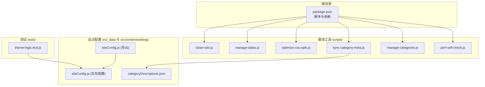
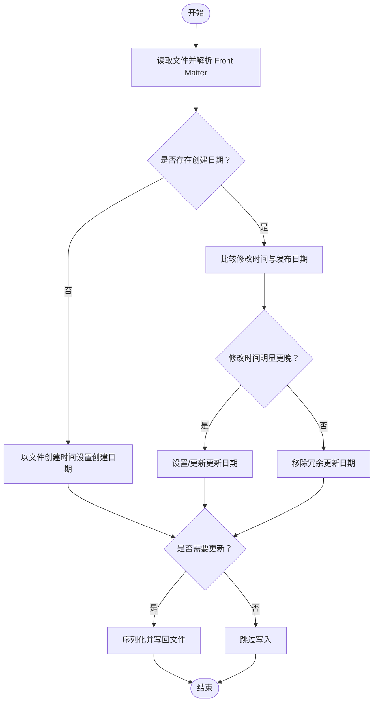
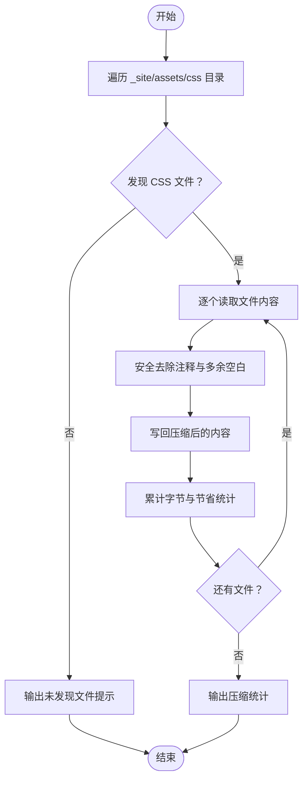
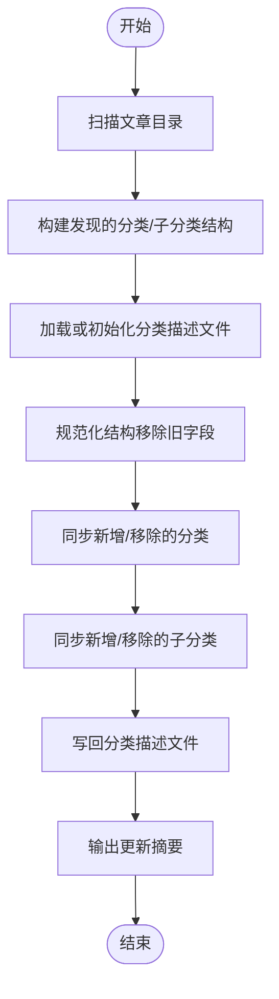
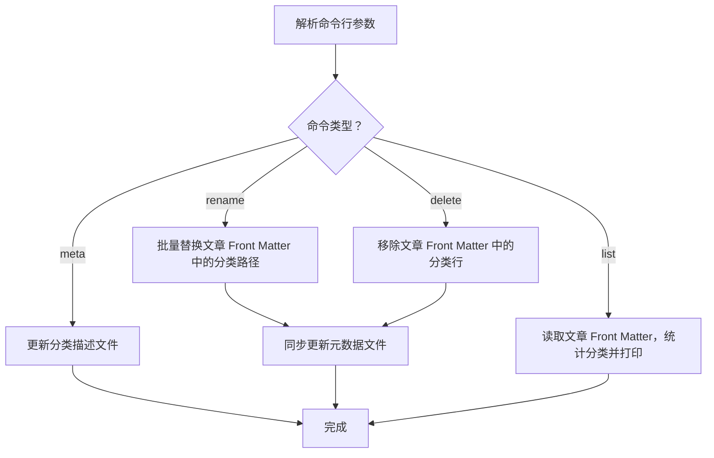
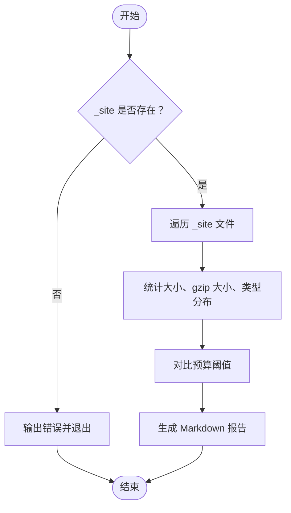
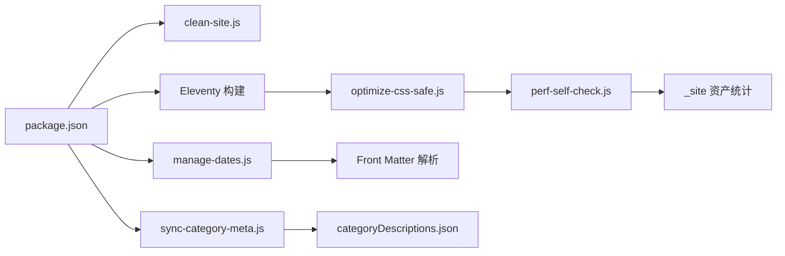

# 开发工具与脚本

<cite>
**本文引用的文件**
- [package.json](file://package.json)
- [scripts/clean-site.js](file://scripts/clean-site.js)
- [scripts/manage-dates.js](file://scripts/manage-dates.js)
- [scripts/optimize-css-safe.js](file://scripts/optimize-css-safe.js)
- [scripts/sync-category-meta.js](file://scripts/sync-category-meta.js)
- [scripts/manage-categories.js](file://scripts/manage-categories.js)
- [scripts/perf-self-check.js](file://scripts/perf-self-check.js)
- [tests/theme-logic.test.js](file://tests/theme-logic.test.js)
- [src/assets/js/main.js](file://src/assets/js/main.js)
- [src/_data/siteConfig.js](file://src/_data/siteConfig.js)
- [src/content/settings/siteConfig.js](file://src/content/settings/siteConfig.js)
- [src/content/settings/categoryDescriptions.json](file://src/content/settings/categoryDescriptions.json)
</cite>

## 目录
1. [简介](#简介)
2. [项目结构](#项目结构)
3. [核心组件](#核心组件)
4. [架构总览](#架构总览)
5. [详细组件分析](#详细组件分析)
6. [依赖关系分析](#依赖关系分析)
7. [性能考量](#性能考量)
8. [故障排查指南](#故障排查指南)
9. [结论](#结论)
10. [附录](#附录)

## 简介
本文件系统性梳理 11ty RainyNight 的开发工具与脚本体系，覆盖以下方面：
- 自动化脚本：日期管理、CSS 安全压缩、元数据同步、分类管理、构建自检与站点清理
- 测试系统：主题逻辑单元测试的编写思路与运行方式
- 开发环境：构建脚本、调试技巧与最佳实践
- 性能监控与自我检查：构建产物体积与单文件大小预算
- 扩展与定制：如何基于现有脚本扩展新功能
- 常见问题与调试：定位与解决典型问题的方法

## 项目结构
仓库采用“内容驱动 + Eleventy 构建”的组织方式，开发工具集中在 scripts 目录，测试集中在 tests 目录，站点配置通过 _data 与 settings 文件集中管理。



图表来源
- [package.json:6-16](file://package.json#L6-L16)
- [scripts/clean-site.js:1-11](file://scripts/clean-site.js#L1-L11)
- [scripts/manage-dates.js:1-85](file://scripts/manage-dates.js#L1-L85)
- [scripts/optimize-css-safe.js:1-112](file://scripts/optimize-css-safe.js#L1-L112)
- [scripts/sync-category-meta.js:1-205](file://scripts/sync-category-meta.js#L1-L205)
- [scripts/manage-categories.js:1-212](file://scripts/manage-categories.js#L1-L212)
- [scripts/perf-self-check.js:1-199](file://scripts/perf-self-check.js#L1-L199)
- [tests/theme-logic.test.js:1-97](file://tests/theme-logic.test.js#L1-L97)
- [src/_data/siteConfig.js:1-2](file://src/_data/siteConfig.js#L1-L2)
- [src/content/settings/siteConfig.js:1-168](file://src/content/settings/siteConfig.js#L1-L168)
- [src/content/settings/categoryDescriptions.json:1-60](file://src/content/settings/categoryDescriptions.json#L1-L60)

章节来源
- [package.json:6-16](file://package.json#L6-L16)

## 核心组件
- 构建与清理
  - 清理站点输出：删除 _site 目录，确保干净构建
  - 构建管线：预处理（更新日期）、同步分类元数据、Eleventy 构建、CSS 压缩、性能自检
- 内容与元数据
  - 日期管理：自动补全 Front Matter 的创建与更新时间
  - 分类元数据同步：扫描文章，生成/更新分类描述文件
  - 分类管理工具：列出、重命名、删除分类，维护元数据
- 资产优化
  - CSS 安全压缩：去除注释、精简空白，安全地最小化 CSS
- 性能自检
  - 统计各类型资产总量与最大单文件，输出 Markdown 报告
- 测试
  - 主题切换逻辑的单元测试，模拟浏览器环境与本地存储

章节来源
- [package.json:6-16](file://package.json#L6-L16)
- [scripts/clean-site.js:1-11](file://scripts/clean-site.js#L1-L11)
- [scripts/manage-dates.js:1-85](file://scripts/manage-dates.js#L1-L85)
- [scripts/sync-category-meta.js:1-205](file://scripts/sync-category-meta.js#L1-L205)
- [scripts/manage-categories.js:1-212](file://scripts/manage-categories.js#L1-L212)
- [scripts/optimize-css-safe.js:1-112](file://scripts/optimize-css-safe.js#L1-L112)
- [scripts/perf-self-check.js:1-199](file://scripts/perf-self-check.js#L1-L199)
- [tests/theme-logic.test.js:1-97](file://tests/theme-logic.test.js#L1-L97)

## 架构总览
下图展示了构建流程中各脚本的调用顺序与职责边界。

```mermaid
sequenceDiagram
participant Dev as "开发者"
participant NPM as "NPM 脚本"
participant Clean as "clean-site.js"
participant Dates as "manage-dates.js"
participant Sync as "sync-category-meta.js"
participant Eleventy as "Eleventy 构建"
participant Opt as "optimize-css-safe.js"
participant Perf as "perf-self-check.js"
Dev->>NPM : 运行构建命令
NPM->>Clean : 删除 _site
NPM->>Dates : 更新文章 Front Matter 日期
NPM->>Sync : 同步分类元数据
NPM->>Eleventy : 生成静态站点
Eleventy-->>Opt : 产出 _site/assets/css
NPM->>Opt : 压缩 CSS 并统计字节
Opt-->>Perf : 产出最终构建产物
NPM->>Perf : 自检构建产物体积与单文件上限
Perf-->>Dev : 输出报告
```

图表来源
- [package.json:6-16](file://package.json#L6-L16)
- [scripts/clean-site.js:1-11](file://scripts/clean-site.js#L1-L11)
- [scripts/manage-dates.js:1-85](file://scripts/manage-dates.js#L1-L85)
- [scripts/sync-category-meta.js:1-205](file://scripts/sync-category-meta.js#L1-L205)
- [scripts/optimize-css-safe.js:1-112](file://scripts/optimize-css-safe.js#L1-L112)
- [scripts/perf-self-check.js:1-199](file://scripts/perf-self-check.js#L1-L199)

## 详细组件分析

### 日期管理脚本（manage-dates.js）
- 功能要点
  - 解析 Markdown Front Matter，自动补全创建日期（取文件创建时间）
  - 若修改时间显著晚于发布日期，则更新 updated 字段；否则移除冗余字段
  - 仅在内容确有变化时写回，避免不必要的磁盘写入
- 关键流程



图表来源
- [scripts/manage-dates.js:16-68](file://scripts/manage-dates.js#L16-L68)

章节来源
- [scripts/manage-dates.js:1-85](file://scripts/manage-dates.js#L1-L85)

### CSS 安全压缩脚本（optimize-css-safe.js）
- 功能要点
  - 遍历 _site/assets/css 下的 CSS 文件
  - 安全去除注释（忽略字符串内的注释标记），并进行空白精简
  - 记录压缩前后字节数，输出节省比例
- 关键流程



图表来源
- [scripts/optimize-css-safe.js:6-112](file://scripts/optimize-css-safe.js#L6-L112)

章节来源
- [scripts/optimize-css-safe.js:1-112](file://scripts/optimize-css-safe.js#L1-L112)

### 分类元数据同步（sync-category-meta.js）
- 功能要点
  - 扫描文章目录，提取分类与子分类编码，生成/更新分类描述文件
  - 支持默认分类、子分类识别、去重与规范化
  - 输出变更摘要，指导手动编辑描述文件
- 关键流程



图表来源
- [scripts/sync-category-meta.js:36-205](file://scripts/sync-category-meta.js#L36-L205)

章节来源
- [scripts/sync-category-meta.js:1-205](file://scripts/sync-category-meta.js#L1-L205)

### 分类管理工具（manage-categories.js）
- 功能要点
  - 列出现有分类与数量
  - 重命名分类（含子分类路径）
  - 删除分类（含子分类路径）
  - 设置分类元数据描述
- 使用方式
  - 列表：node scripts/manage-categories.js list
  - 重命名：node scripts/manage-categories.js rename <旧名> <新名>
  - 删除：node scripts/manage-categories.js delete <名称>
  - 设置元数据：node scripts/manage-categories.js meta "<分类路径>" "<描述>"
- 关键流程



图表来源
- [scripts/manage-categories.js:63-212](file://scripts/manage-categories.js#L63-L212)

章节来源
- [scripts/manage-categories.js:1-212](file://scripts/manage-categories.js#L1-L212)

### 构建自检脚本（perf-self-check.js）
- 功能要点
  - 遍历 _site 目录，统计各类资产大小与 gzip 大小
  - 对比预算阈值（HTML/CSS/JS 总量与最大单文件）
  - 生成 Markdown 报告，包含总计、分类型汇总与前 10 大文件
- 关键流程



图表来源
- [scripts/perf-self-check.js:170-199](file://scripts/perf-self-check.js#L170-L199)

章节来源
- [scripts/perf-self-check.js:1-199](file://scripts/perf-self-check.js#L1-L199)

### 站点清理脚本（clean-site.js）
- 功能要点
  - 删除 _site 目录，确保后续构建从零开始
- 使用方式
  - npm run clean:site 或直接 node scripts/clean-site.js

章节来源
- [scripts/clean-site.js:1-11](file://scripts/clean-site.js#L1-L11)

### 测试系统（theme-logic.test.js）
- 功能要点
  - 模拟浏览器环境（window、document、localStorage）
  - 测试主题默认逻辑、持久化逻辑与切换逻辑
- 运行方式
  - 在项目根目录执行：node tests/theme-logic.test.js

章节来源
- [tests/theme-logic.test.js:1-97](file://tests/theme-logic.test.js#L1-L97)

### 配置与数据层
- 站点配置集中于 src/content/settings/siteConfig.js，并通过 src/_data/siteConfig.js 导出供模板使用
- 分类描述文件 src/content/settings/categoryDescriptions.json 由同步脚本维护

章节来源
- [src/_data/siteConfig.js:1-2](file://src/_data/siteConfig.js#L1-L2)
- [src/content/settings/siteConfig.js:1-168](file://src/content/settings/siteConfig.js#L1-L168)
- [src/content/settings/categoryDescriptions.json:1-60](file://src/content/settings/categoryDescriptions.json#L1-L60)

## 依赖关系分析
- 构建脚本依赖
  - package.json 定义了构建链路：清理站点、更新日期、同步元数据、Eleventy 构建、CSS 压缩、性能自检
  - Eleventy 插件与语法高亮等依赖在 devDependencies 中声明
- 脚本间耦合
  - optimize-css-safe.js 与 perf-self-check.js 均依赖 _site 目录
  - manage-dates.js 与 sync-category-meta.js 依赖 src/content/posts 与 src/content/settings 目录
- 数据依赖
  - 分类描述文件作为分类管理与渲染的输入



图表来源
- [package.json:6-16](file://package.json#L6-L16)
- [scripts/manage-dates.js:1-85](file://scripts/manage-dates.js#L1-L85)
- [scripts/sync-category-meta.js:1-205](file://scripts/sync-category-meta.js#L1-L205)
- [scripts/optimize-css-safe.js:1-112](file://scripts/optimize-css-safe.js#L1-L112)
- [scripts/perf-self-check.js:1-199](file://scripts/perf-self-check.js#L1-L199)

章节来源
- [package.json:6-34](file://package.json#L6-L34)

## 性能考量
- 预算阈值
  - HTML/CSS/JS 总量与最大单文件大小均有硬性预算，超出将触发警告
- 压缩策略
  - CSS 压缩在构建后执行，减少传输体积
- 实施建议
  - 控制单页组件体积，避免大图片与字体资源
  - 合理拆分样式与脚本，利用懒加载与按需加载
  - 定期运行性能自检，保持指标稳定

章节来源
- [scripts/perf-self-check.js:10-15](file://scripts/perf-self-check.js#L10-L15)
- [scripts/optimize-css-safe.js:82-112](file://scripts/optimize-css-safe.js#L82-L112)

## 故障排查指南
- 构建失败（缺少 _site）
  - 现象：性能自检脚本报错提示缺少构建输出目录
  - 排查：先执行构建命令，确保 _site 存在后再运行自检
- CSS 未被压缩
  - 现象：optimize-css-safe.js 提示未发现 CSS 文件
  - 排查：确认 Eleventy 已生成 _site/assets/css；检查路径与权限
- 分类元数据未更新
  - 现象：sync-category-meta.js 未检测到新增分类
  - 排查：确认文章目录结构与文件命名规则；检查 categoryDescriptions.json 权限
- 日期未更新
  - 现象：manage-dates.js 未写回 Front Matter
  - 排查：确认文件创建时间与修改时间差异；检查内容是否确实发生变化
- 测试失败
  - 现象：主题逻辑测试断言失败
  - 排查：核对本地存储与 DOM 属性设置；确保模拟环境一致

章节来源
- [scripts/perf-self-check.js:170-174](file://scripts/perf-self-check.js#L170-L174)
- [scripts/optimize-css-safe.js:82-87](file://scripts/optimize-css-safe.js#L82-L87)
- [scripts/sync-category-meta.js:36-42](file://scripts/sync-category-meta.js#L36-L42)
- [scripts/manage-dates.js:57-67](file://scripts/manage-dates.js#L57-L67)
- [tests/theme-logic.test.js:28-46](file://tests/theme-logic.test.js#L28-L46)

## 结论
本项目通过一组职责清晰的脚本实现了内容与资产的自动化管理，配合构建自检与单元测试，保障了构建质量与开发效率。建议在团队协作中遵循统一的脚本调用规范与提交前自检流程，持续优化预算阈值与压缩策略，以维持良好的性能表现。

## 附录

### 开发工作流最佳实践
- 提交前执行
  - npm run update-dates
  - npm run sync-meta
  - npm run perf:check
- 调试技巧
  - 使用 DEBUG=* eleventy 启动 Eleventy，观察详细日志
  - 在浏览器中打开构建产物，结合性能自检报告定位瓶颈
- 版本控制与协作
  - 将脚本变更纳入变更日志
  - 对分类与元数据的批量操作，保留操作记录以便回溯

章节来源
- [package.json:6-16](file://package.json#L6-L16)

### 开发工具扩展与定制指南
- 新增脚本
  - 位于 scripts/ 目录，遵循单一职责原则
  - 在 package.json 中添加对应 npm 脚本，便于集成到构建流程
- 扩展分类管理
  - 可在 manage-categories.js 基础上增加“迁移”或“合并”功能
- 扩展性能自检
  - 在预算阈值中加入新的类型（如 SVG、WASM）或细化规则
- 测试扩展
  - 在 tests/ 目录新增针对新功能的单元测试，复用现有模拟环境

章节来源
- [scripts/manage-categories.js:1-212](file://scripts/manage-categories.js#L1-L212)
- [scripts/perf-self-check.js:10-15](file://scripts/perf-self-check.js#L10-L15)
- [tests/theme-logic.test.js:1-97](file://tests/theme-logic.test.js#L1-L97)