# 构建脚本工具

<cite>
**本文档引用的文件**
- [clean-site.js](file://scripts/clean-site.js)
- [optimize-css-safe.js](file://scripts/optimize-css-safe.js)
- [perf-self-check.js](file://scripts/perf-self-check.js)
- [manage-categories.js](file://scripts/manage-categories.js)
- [manage-dates.js](file://scripts/manage-dates.js)
- [sync-category-meta.js](file://scripts/sync-category-meta.js)
- [package.json](file://package.json)
- [.eleventy.js](file://.eleventy.js)
- [siteConfig.js](file://src/_data/siteConfig.js)
</cite>

## 目录
1. [简介](#简介)
2. [项目结构](#项目结构)
3. [核心组件](#核心组件)
4. [架构概览](#架构概览)
5. [详细组件分析](#详细组件分析)
6. [依赖关系分析](#依赖关系分析)
7. [性能考虑](#性能考虑)
8. [故障排除指南](#故障排除指南)
9. [结论](#结论)

## 简介

本项目是一个基于 Eleventy 的静态站点生成器，包含一套完整的构建脚本工具集。这些脚本负责清理构建产物、优化 CSS 性能以及进行性能自检，确保生成的静态站点具有最佳的性能表现和质量标准。

构建脚本工具集主要包含以下核心组件：
- **clean-site.js**: 清理站点构建产物的脚本
- **optimize-css-safe.js**: 安全的 CSS 优化和压缩脚本
- **perf-self-check.js**: 性能自检和报告生成脚本

这些脚本通过 NPM 脚本进行编排，在构建流程中自动执行，确保每次构建都符合预设的质量标准。

## 项目结构

项目采用模块化的文件组织方式，构建脚本集中管理在 `scripts/` 目录下，每个脚本都有明确的功能职责：

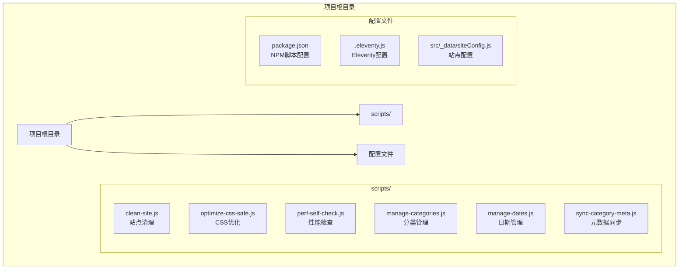

**图表来源**
- [package.json:6-16](file://package.json#L6-L16)
- [.eleventy.js:36-180](file://.eleventy.js#L36-L180)

**章节来源**
- [package.json:1-35](file://package.json#L1-L35)
- [.eleventy.js:1-181](file://.eleventy.js#L1-L181)

## 核心组件

### 构建脚本工具概述

构建脚本工具集通过 NPM 脚本进行统一管理，形成完整的构建流水线：

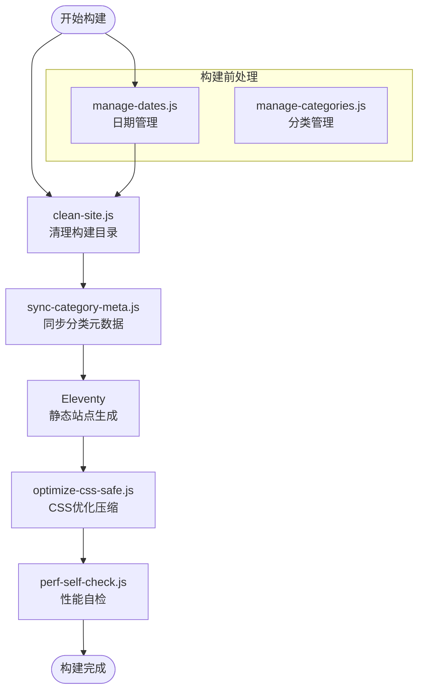

**图表来源**
- [package.json:9-11](file://package.json#L9-L11)
- [clean-site.js:1-11](file://scripts/clean-site.js#L1-L11)
- [optimize-css-safe.js:82-112](file://scripts/optimize-css-safe.js#L82-L112)
- [perf-self-check.js:170-199](file://scripts/perf-self-check.js#L170-L199)

### NPM 脚本配置

项目通过 package.json 统一管理构建脚本，提供了灵活的执行选项：

| 脚本名称 | 命令 | 描述 |
|---------|------|------|
| clean:site | `node scripts/clean-site.js` | 清理构建输出目录 |
| build | `npm run clean:site && npm run sync-meta && eleventy && node scripts/optimize-css-safe.js && node scripts/perf-self-check.js` | 完整构建流程 |
| css:optimize | `node scripts/optimize-css-safe.js` | 仅执行 CSS 优化 |
| perf:check | `node scripts/perf-self-check.js` | 仅执行性能检查 |
| prebuild | `npm run update-dates` | 构建前日期更新 |
| start | `eleventy --serve` | 启动开发服务器 |

**章节来源**
- [package.json:6-16](file://package.json#L6-L16)

## 架构概览

构建脚本工具集采用分层架构设计，每个脚本专注于特定的构建任务：

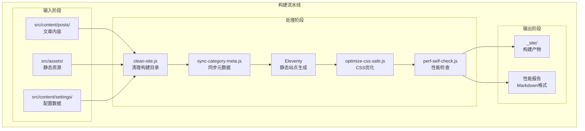

**图表来源**
- [package.json:9-11](file://package.json#L9-L11)
- [.eleventy.js:172-180](file://.eleventy.js#L172-L180)

## 详细组件分析

### clean-site.js - 站点清理脚本

clean-site.js 是一个简洁高效的清理脚本，专门用于删除 Eleventy 的构建输出目录。

#### 实现原理

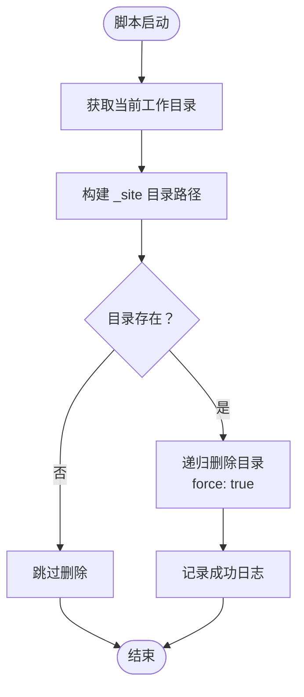

**图表来源**
- [clean-site.js:6-11](file://scripts/clean-site.js#L6-L11)

#### 核心特性

- **简单高效**: 使用 Node.js 内置的 fs.rmSync 方法，一行代码完成清理
- **安全删除**: 通过 force: true 参数确保即使目录不存在也不会抛出异常
- **递归删除**: 使用 recursive: true 参数确保子目录和文件都被清理
- **即时反馈**: 删除完成后输出详细的日志信息

#### 执行时机

clean-site.js 在完整构建流程的最开始执行，确保每次构建都从干净的状态开始。

**章节来源**
- [clean-site.js:1-11](file://scripts/clean-site.js#L1-L11)

### optimize-css-safe.js - CSS 优化脚本

optimize-css-safe.js 是一个智能的 CSS 优化脚本，专门处理构建后的 CSS 文件，确保在不破坏样式的情况下进行压缩。

#### 工作机制

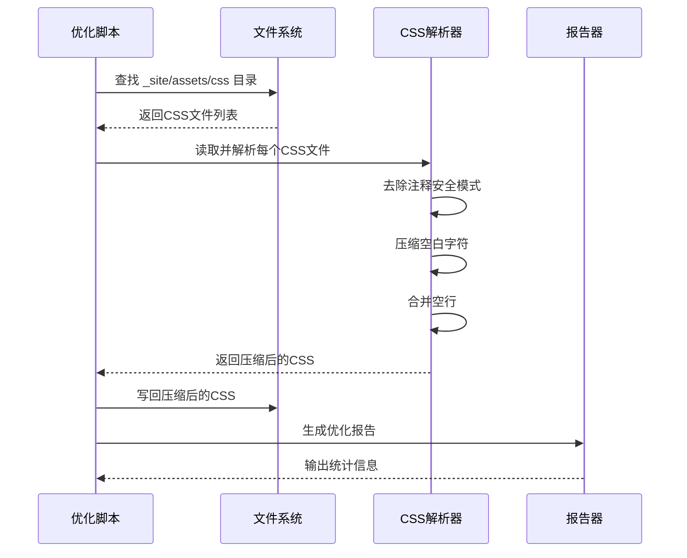

**图表来源**
- [optimize-css-safe.js:82-112](file://scripts/optimize-css-safe.js#L82-L112)

#### 安全压缩算法

脚本实现了独特的安全压缩算法，确保不会破坏 CSS 语法：

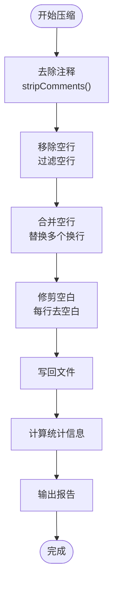

**图表来源**
- [optimize-css-safe.js:25-76](file://scripts/optimize-css-safe.js#L25-L76)

#### 关键优化策略

1. **注释安全去除**: 通过状态机识别字符串字面量，避免误删注释
2. **空白安全压缩**: 保持语义完整性的同时减少文件大小
3. **统计报告**: 提供详细的压缩效果统计

#### 命令行参数

optimize-css-safe.js 支持以下执行方式：
- `node scripts/optimize-css-safe.js` - 执行完整的 CSS 优化流程
- `npm run css:optimize` - 通过 NPM 脚本执行

#### 最佳实践

- 在构建流程的最后阶段执行，确保处理最新的 CSS 文件
- 与版本控制系统配合使用，监控 CSS 文件大小变化
- 结合 perf-self-check.js 使用，验证优化效果

**章节来源**
- [optimize-css-safe.js:1-112](file://scripts/optimize-css-safe.js#L1-L112)

### perf-self-check.js - 性能自检脚本

perf-self-check.js 是一个全面的性能检查工具，负责验证构建产物是否满足预设的性能预算。

#### 检测逻辑

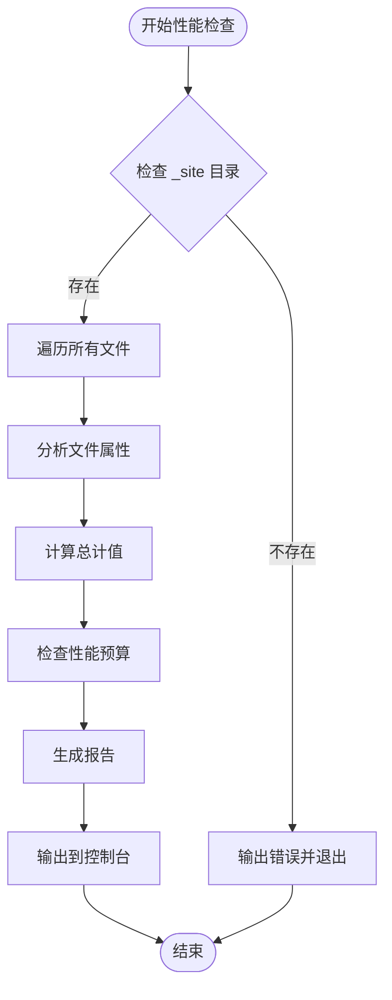

**图表来源**
- [perf-self-check.js:170-199](file://scripts/perf-self-check.js#L170-L199)

#### 性能预算配置

脚本定义了严格的性能预算，确保站点性能：

| 指标类型 | 预算限制 | 单位 |
|---------|---------|------|
| HTML 总大小 | 800 KB | 字节 |
| CSS 总大小 | 300 KB | 字节 |
| JavaScript 总大小 | 350 KB | 字节 |
| 单个资源最大值 | 500 KB | 字节 |

#### 报告生成机制

脚本生成详细的 Markdown 格式报告，包含以下信息：

1. **总体统计**: 文件数量、总大小、gzip 大小
2. **预算检查**: 各项指标的实际值与预算对比
3. **按类型统计**: HTML、CSS、JS、图片、字体等各类别的大小分布
4. **文件分析**: 前 10 个最大的文件及其 gzip 大小

#### 命令行参数

perf-self-check.js 支持以下执行方式：
- `node scripts/perf-self-check.js` - 执行完整的性能检查
- `npm run perf:check` - 通过 NPM 脚本执行

#### 执行时机

perf-self-check.js 在 CSS 优化之后执行，确保检查的是最终的构建产物。

**章节来源**
- [perf-self-check.js:1-199](file://scripts/perf-self-check.js#L1-L199)

### 辅助脚本分析

#### manage-categories.js - 分类管理脚本

manage-categories.js 提供了完整的分类管理系统，支持分类的查询、重命名和删除操作。

##### 主要功能

- **分类列表**: 显示所有现有分类及其文章数量
- **分类重命名**: 支持重命名分类和子分类
- **分类删除**: 删除指定分类及其相关元数据
- **元数据管理**: 设置和更新分类描述

##### CLI 接口

```bash
node scripts/manage-categories.js list      # 列出所有分类
node scripts/manage-categories.js rename old new  # 重命名分类
node scripts/manage-categories.js delete name     # 删除分类
node scripts/manage-categories.js meta "Tech/Web" "Web开发相关内容"  # 设置元数据
```

**章节来源**
- [manage-categories.js:1-212](file://scripts/manage-categories.js#L1-L212)

#### manage-dates.js - 日期管理脚本

manage-dates.js 自动处理文章的创建日期和更新日期，确保 Front Matter 中的日期信息准确。

##### 处理逻辑

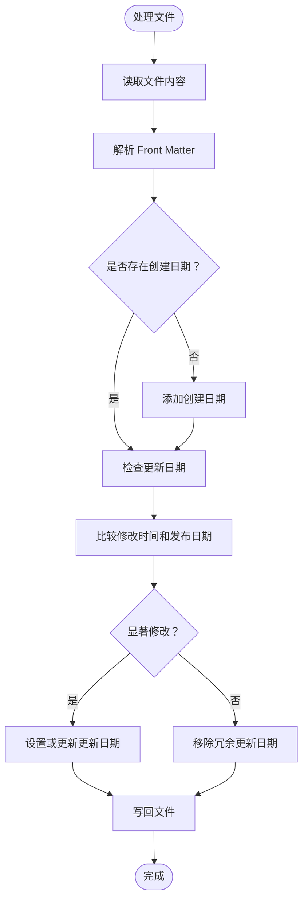

**图表来源**
- [manage-dates.js:16-68](file://scripts/manage-dates.js#L16-L68)

**章节来源**
- [manage-dates.js:1-85](file://scripts/manage-dates.js#L1-L85)

#### sync-category-meta.js - 分类元数据同步脚本

sync-category-meta.js 自动扫描文章并同步分类元数据，确保分类描述文件与实际内容保持一致。

##### 同步流程

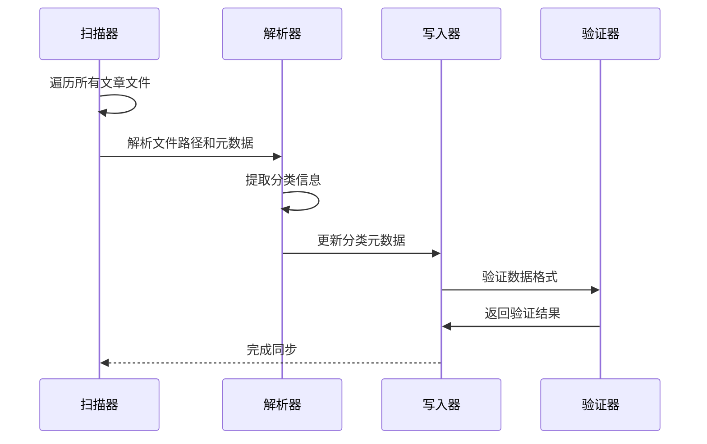

**图表来源**
- [sync-category-meta.js:36-205](file://scripts/sync-category-meta.js#L36-L205)

**章节来源**
- [sync-category-meta.js:1-205](file://scripts/sync-category-meta.js#L1-L205)

## 依赖关系分析

构建脚本工具集之间的依赖关系形成了一个完整的构建生态系统：

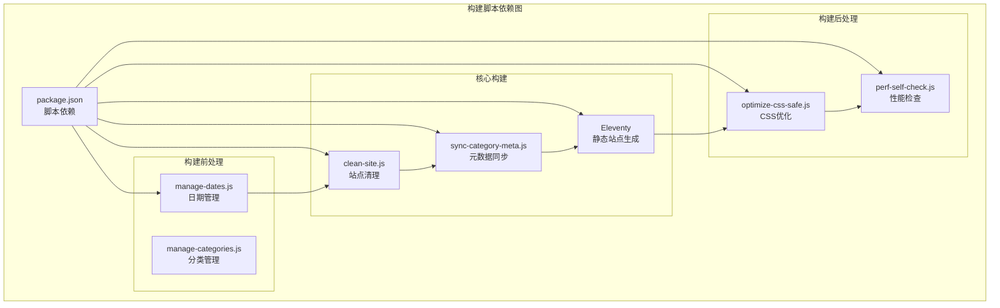

**图表来源**
- [package.json:9-16](file://package.json#L9-L16)

### 外部依赖

项目的主要外部依赖包括：

- **@11ty/eleventy**: 静态站点生成器核心
- **@11ty/eleventy-plugin-syntaxhighlight**: 代码高亮插件
- **markdown-it**: Markdown 解析器
- **gray-matter**: Front Matter 解析器

### 内部依赖关系

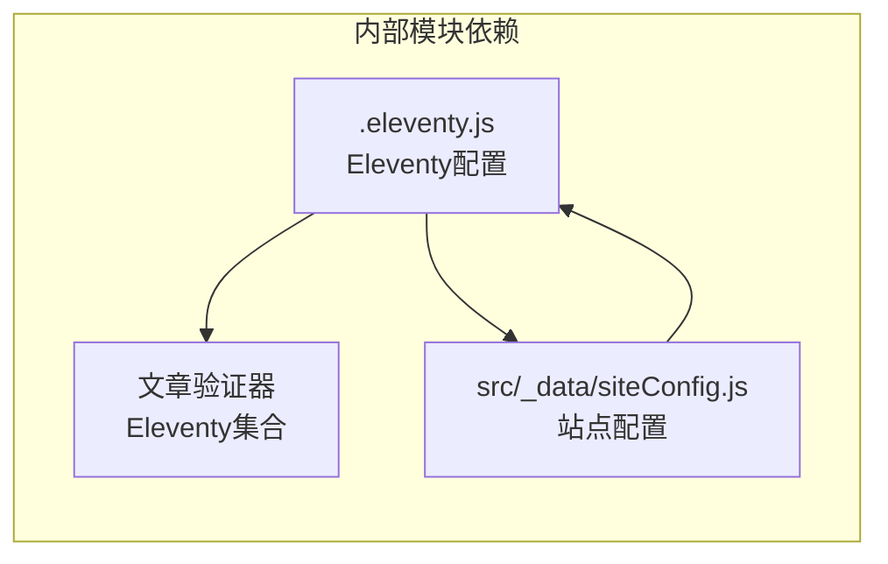

**图表来源**
- [.eleventy.js:36-180](file://.eleventy.js#L36-L180)
- [siteConfig.js:1-2](file://src/_data/siteConfig.js#L1-L2)

**章节来源**
- [package.json:22-33](file://package.json#L22-L33)
- [.eleventy.js:1-181](file://.eleventy.js#L1-L181)

## 性能考虑

### 构建性能优化

1. **并行处理**: 脚本之间可以并行执行，提高整体构建效率
2. **增量更新**: 通过文件系统检查避免不必要的处理
3. **内存管理**: 合理的文件读写策略，避免内存泄漏
4. **I/O 优化**: 批量文件操作，减少磁盘访问次数

### CSS 优化性能

optimize-css-safe.js 采用了多项性能优化策略：

- **流式处理**: 逐文件处理，避免大文件加载到内存
- **原地压缩**: 直接覆盖原文件，减少额外的 I/O 操作
- **统计缓存**: 计算前后大小差异，避免重复计算

### 性能监控

perf-self-check.js 提供了实时的性能监控能力：

- **多维度分析**: 包含原始大小和 gzip 大小的双重分析
- **预算对比**: 自动检查各项指标是否超出预算
- **详细报告**: 生成可读性强的性能报告

## 故障排除指南

### 常见问题及解决方案

#### 清理脚本问题

**问题**: clean-site.js 删除失败
**原因**: 权限不足或文件被占用
**解决方案**: 
- 检查文件权限
- 关闭可能占用文件的程序
- 手动删除 _site 目录

#### CSS 优化问题

**问题**: optimize-css-safe.js 无法找到 CSS 文件
**原因**: 构建尚未生成 CSS 文件
**解决方案**:
- 先运行完整构建流程
- 检查 CSS 文件路径是否正确
- 确认 Eleventy 构建成功

#### 性能检查问题

**问题**: perf-self-check.js 报告预算超限
**原因**: 构建产物过大
**解决方案**:
- 检查是否有未压缩的资源
- 优化图片和静态资源
- 减少不必要的 JavaScript 代码

### 调试方法

#### 启用详细日志

```bash
# 启动开发服务器并显示详细日志
DEBUG=* npm start

# 运行单个脚本并查看详细输出
node -v scripts/clean-site.js
```

#### 错误处理机制

所有脚本都实现了基本的错误处理：

```javascript
try {
    // 主要逻辑
} catch (error) {
    console.error(`[脚本名] 错误: ${error.message}`);
    process.exit(1);
}
```

#### 性能分析

```bash
# 使用 Node.js 性能分析工具
node --prof scripts/perf-self-check.js
```

**章节来源**
- [clean-site.js:9](file://scripts/clean-site.js#L9)
- [optimize-css-safe.js:84-87](file://scripts/optimize-css-safe.js#L84-L87)
- [perf-self-check.js:171-174](file://scripts/perf-self-check.js#L171-L174)

## 结论

构建脚本工具集为 Eleventy 项目提供了完整的自动化构建解决方案。通过精心设计的脚本架构，实现了：

1. **模块化设计**: 每个脚本专注于特定任务，便于维护和扩展
2. **自动化流程**: 通过 NPM 脚本统一管理，确保构建一致性
3. **质量保证**: 性能预算检查确保构建产物符合预期标准
4. **开发友好**: 提供详细的日志输出和错误处理机制

这套工具集不仅提高了构建效率，还确保了站点的性能和质量。通过合理的配置和使用，可以显著提升开发体验和站点性能表现。

建议在团队协作中：
- 固化构建脚本的使用方式
- 定期审查性能预算设置
- 建立 CI/CD 流程中的自动化测试
- 持续监控构建性能指标