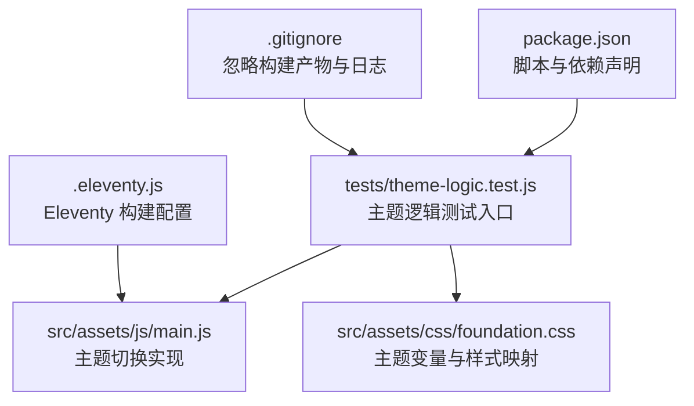
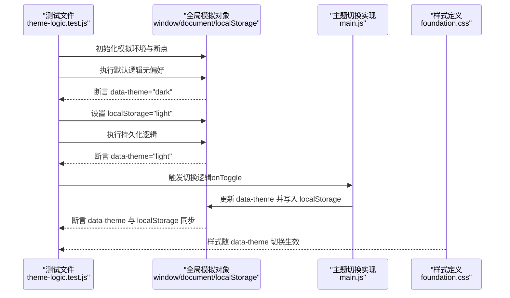
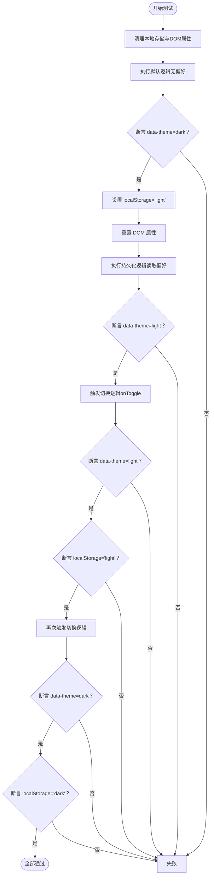
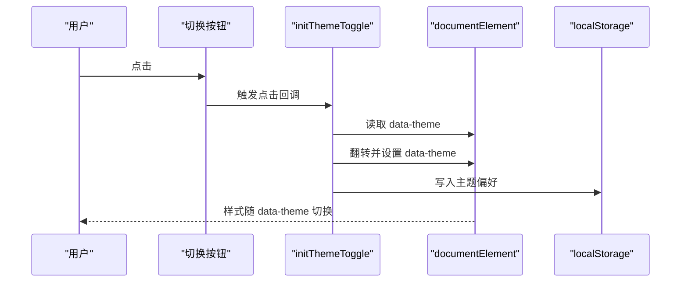
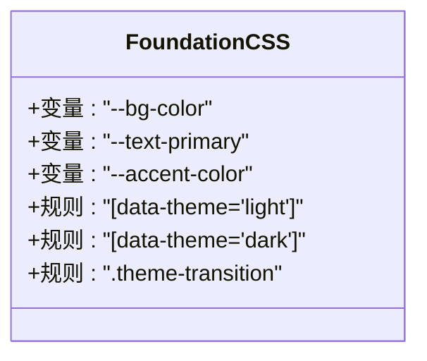
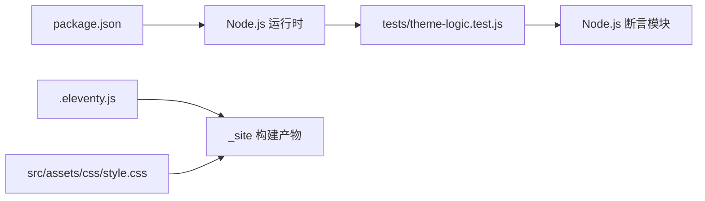

# 测试系统

<cite>
**本文引用的文件**
- [tests/theme-logic.test.js](file://tests/theme-logic.test.js)
- [package.json](file://package.json)
- [.eleventy.js](file://.eleventy.js)
- [src/assets/js/main.js](file://src/assets/js/main.js)
- [src/assets/css/foundation.css](file://src/assets/css/foundation.css)
- [src/assets/css/style.css](file://src/assets/css/style.css)
- [.gitignore](file://.gitignore)
</cite>

## 目录
1. [简介](#简介)
2. [项目结构](#项目结构)
3. [核心组件](#核心组件)
4. [架构总览](#架构总览)
5. [详细组件分析](#详细组件分析)
6. [依赖分析](#依赖分析)
7. [性能考量](#性能考量)
8. [故障排查指南](#故障排查指南)
9. [结论](#结论)
10. [附录](#附录)

## 简介
本文件面向“测试系统”的主题逻辑测试，聚焦于 tests/theme-logic.test.js 的实现原理与测试用例设计。文档将从测试框架选择与配置、测试环境搭建与依赖管理、单元测试编写规范与最佳实践、测试执行命令与 CI/CD 集成、测试覆盖率监控与报告生成、测试驱动开发（TDD）实践与持续集成策略、常见测试场景示例与调试技巧等方面进行系统化阐述，帮助读者快速理解并扩展该主题逻辑测试体系。

## 项目结构
该项目采用基于 Eleventy 的静态站点生成器，测试代码位于 tests 目录下，核心主题逻辑由前端 JavaScript 与 CSS 共同实现。测试文件通过 Node.js 原生断言模块与浏览器环境模拟对象，验证主题切换的默认行为、持久化偏好与切换逻辑。

图表来源
- [tests/theme-logic.test.js:1-97](file://tests/theme-logic.test.js#L1-L97)
- [src/assets/js/main.js:1080-1104](file://src/assets/js/main.js#L1080-L1104)
- [src/assets/css/foundation.css:55-101](file://src/assets/css/foundation.css#L55-L101)
- [package.json:6-16](file://package.json#L6-L16)
- [.eleventy.js:36-180](file://.eleventy.js#L36-L180)
- [.gitignore:1-34](file://.gitignore#L1-L34)

章节来源
- [tests/theme-logic.test.js:1-97](file://tests/theme-logic.test.js#L1-L97)
- [package.json:1-35](file://package.json#L1-L35)
- [.eleventy.js:1-181](file://.eleventy.js#L1-L181)
- [.gitignore:1-34](file://.gitignore#L1-L34)

## 核心组件
- 测试文件：tests/theme-logic.test.js
  - 使用 Node.js 原生断言模块进行断言。
  - 通过全局对象模拟浏览器环境（window、document、localStorage），以无浏览器上下文运行测试。
  - 包含三个测试场景：默认主题逻辑、持久化偏好逻辑、切换逻辑。
- 主题实现：src/assets/js/main.js
  - 提供主题切换初始化函数，监听切换按钮事件，读取当前 data-theme 属性并翻转，同时写入 localStorage。
- 样式定义：src/assets/css/foundation.css
  - 定义 data-theme="light/dark" 的样式映射与过渡动画类 theme-transition。
- 构建配置：.eleventy.js
  - Eleventy 插件注册与全局数据计算，确保构建产物中包含主题相关资源。
- 项目脚本：package.json
  - 当前未配置具体测试脚本，需补充以支持测试执行与 CI 集成。
- 版本控制忽略：.gitignore
  - 忽略 node_modules、构建输出目录与日志文件，便于测试隔离与 CI 清洁环境。

章节来源
- [tests/theme-logic.test.js:1-97](file://tests/theme-logic.test.js#L1-L97)
- [src/assets/js/main.js:1080-1104](file://src/assets/js/main.js#L1080-L1104)
- [src/assets/css/foundation.css:55-101](file://src/assets/css/foundation.css#L55-L101)
- [.eleventy.js:36-180](file://.eleventy.js#L36-L180)
- [package.json:6-16](file://package.json#L6-L16)
- [.gitignore:1-34](file://.gitignore#L1-L34)

## 架构总览
测试系统围绕“主题逻辑”这一核心域展开，通过 Node.js 环境下的模拟对象与断言，覆盖以下关键路径：
- 默认主题：当未设置 localStorage 中的主题偏好时，应默认应用深色主题。
- 持久化偏好：当存在 light 偏好时，应尊重并应用浅色主题。
- 切换逻辑：点击切换按钮后，data-theme 与 localStorage 应正确翻转。

图表来源
- [tests/theme-logic.test.js:28-97](file://tests/theme-logic.test.js#L28-L97)
- [src/assets/js/main.js:1080-1104](file://src/assets/js/main.js#L1080-L1104)
- [src/assets/css/foundation.css:55-101](file://src/assets/css/foundation.css#L55-L101)

## 详细组件分析

### 测试文件：theme-logic.test.js
- 测试目标
  - 验证主题默认值、持久化偏好与切换行为。
- 测试环境搭建
  - 通过全局对象模拟浏览器 API 与存储，避免对真实 DOM 的依赖。
- 测试用例设计
  - 默认逻辑：清除偏好，断言默认为深色。
  - 持久化逻辑：设置 light 偏好，断言应用浅色。
  - 切换逻辑：模拟点击切换，断言 data-theme 与 localStorage 同步翻转。
- 断言方法
  - 使用严格相等断言，确保属性值与预期一致。
- 模拟数据与边界
  - 通过内存存储模拟 localStorage，避免磁盘 IO。
  - 通过 documentElement.attributes 模拟 data-theme 属性读写。

图表来源
- [tests/theme-logic.test.js:28-97](file://tests/theme-logic.test.js#L28-L97)

章节来源
- [tests/theme-logic.test.js:1-97](file://tests/theme-logic.test.js#L1-L97)

### 主题切换实现：main.js
- 关键点
  - 通过查询切换按钮元素，绑定点击事件。
  - 读取并翻转 data-theme，写入 localStorage。
  - 添加过渡类以配合 CSS 过渡动画。
- 与测试的耦合关系
  - 测试通过模拟调用 onToggle 或直接操作 DOM 属性与存储，验证与实现的一致性。

图表来源
- [src/assets/js/main.js:1080-1104](file://src/assets/js/main.js#L1080-L1104)

章节来源
- [src/assets/js/main.js:1080-1104](file://src/assets/js/main.js#L1080-L1104)

### 样式与主题变量：foundation.css
- 关键点
  - 通过 data-theme="light/dark" 选择不同变量集。
  - 定义 theme-transition 类以统一过渡动画。
- 与测试的耦合关系
  - 测试通过断言 data-theme 属性值，间接验证样式是否按预期切换。

图表来源
- [src/assets/css/foundation.css:55-101](file://src/assets/css/foundation.css#L55-L101)
- [src/assets/css/foundation.css:198-211](file://src/assets/css/foundation.css#L198-L211)

章节来源
- [src/assets/css/foundation.css:55-101](file://src/assets/css/foundation.css#L55-L101)
- [src/assets/css/foundation.css:198-211](file://src/assets/css/foundation.css#L198-L211)

### 构建与资源：.eleventy.js 与 style.css
- 关键点
  - Eleventy 注册语法高亮与 Mermaid 插件，并设置全局数据计算。
  - style.css 作为入口聚合多个样式文件，确保主题样式被正确引入。
- 对测试的影响
  - 构建产物中样式文件的存在保证了 data-theme 的视觉一致性。

章节来源
- [.eleventy.js:36-180](file://.eleventy.js#L36-L180)
- [src/assets/css/style.css:1-6](file://src/assets/css/style.css#L1-L6)

## 依赖分析
- 测试依赖
  - Node.js 原生断言模块用于断言。
  - 通过全局对象模拟浏览器环境，无需额外测试框架。
- 运行时依赖
  - Eleventy 作为静态站点生成器，负责构建与资源处理。
  - 样式文件通过入口样式聚合，确保主题样式可用。
- 版本控制与产物隔离
  - .gitignore 忽略 node_modules、构建输出与日志，便于 CI 清洁环境。

图表来源
- [package.json:6-16](file://package.json#L6-L16)
- [tests/theme-logic.test.js:1-1](file://tests/theme-logic.test.js#L1-L1)
- [.eleventy.js:36-180](file://.eleventy.js#L36-L180)
- [src/assets/css/style.css:1-6](file://src/assets/css/style.css#L1-L6)

章节来源
- [package.json:1-35](file://package.json#L1-L35)
- [.eleventy.js:36-180](file://.eleventy.js#L36-L180)
- [src/assets/css/style.css:1-6](file://src/assets/css/style.css#L1-L6)
- [.gitignore:1-34](file://.gitignore#L1-L34)

## 性能考量
- 测试性能
  - 使用内存存储与简单断言，避免 I/O 与外部依赖，提升测试执行速度。
- 样式性能
  - CSS 过渡时间与 JavaScript 过渡类配合，确保切换动画平滑。
- 构建性能
  - Eleventy 插件与全局数据计算在构建阶段完成，减少运行时开销。

## 故障排查指南
- 常见问题
  - 断言失败：检查 data-theme 属性是否正确设置，localStorage 是否同步写入。
  - 样式未生效：确认样式入口文件已聚合，构建产物中样式存在。
  - 环境模拟缺失：确保 window、document、localStorage 已正确模拟。
- 调试技巧
  - 在测试中打印中间状态（如 data-theme 值），定位逻辑分支。
  - 将测试拆分为更小步骤，逐步断言，缩小问题范围。
  - 使用最小可复现场景（仅默认逻辑或仅切换逻辑）验证单点行为。

章节来源
- [tests/theme-logic.test.js:28-97](file://tests/theme-logic.test.js#L28-L97)
- [src/assets/css/foundation.css:55-101](file://src/assets/css/foundation.css#L55-L101)

## 结论
本测试系统以轻量级方式实现了主题逻辑的单元测试，通过浏览器环境模拟与严格断言，覆盖默认值、持久化偏好与切换行为。建议在现有基础上完善测试脚本与 CI 集成，以形成可持续的质量保障闭环。

## 附录

### 单元测试编写规范与最佳实践
- 设计原则
  - 每个测试只验证单一行为，命名清晰表达期望。
  - 使用模拟对象隔离外部依赖，确保测试稳定。
- 断言方法
  - 使用严格相等断言，避免类型转换导致的误判。
  - 对关键状态（如 data-theme、localStorage）分别断言。
- 模拟数据
  - 通过内存存储模拟 localStorage，避免磁盘 I/O。
  - 通过 documentElement.attributes 模拟 DOM 属性读写。

### 测试执行命令与 CI/CD 集成
- 当前脚本
  - package.json 中未配置 test 脚本，需补充以支持测试执行与 CI 集成。
- 建议命令
  - 在 package.json 的 scripts 中添加测试脚本，例如：
    - "test": "node tests/theme-logic.test.js"
    - "test:watch": "nodemon --exec 'node tests/theme-logic.test.js'"
- CI/CD 集成
  - 在 CI 流水线中增加安装依赖与执行测试的步骤，确保每次提交均运行测试。

章节来源
- [package.json:6-16](file://package.json#L6-L16)
- [tests/theme-logic.test.js:1-97](file://tests/theme-logic.test.js#L1-L97)

### 测试覆盖率监控与报告生成
- 当前状态
  - 仓库未包含覆盖率工具配置。
- 建议方案
  - 引入覆盖率工具（如 c8 或 nyc），在测试脚本中启用覆盖率收集与报告生成。
  - 在 CI 中上传覆盖率报告，结合阈值保护质量。

### 测试驱动开发（TDD）与持续集成策略
- TDD 实践
  - 先编写失败的测试，再实现最小逻辑使其通过，最后重构优化。
  - 将主题逻辑拆分为更小的可测试单元，逐步完善边界条件。
- 持续集成策略
  - 在 PR 中强制运行测试，失败则阻断合并。
  - 结合代码审查与自动化测试，确保变更不影响主题行为。