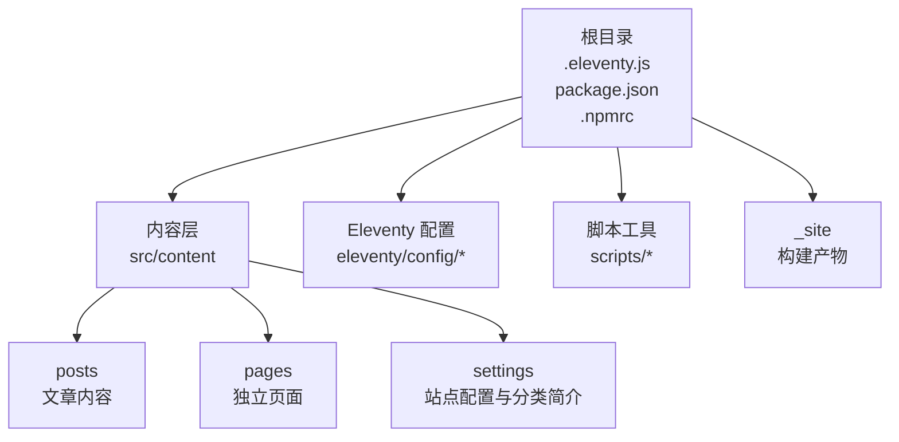
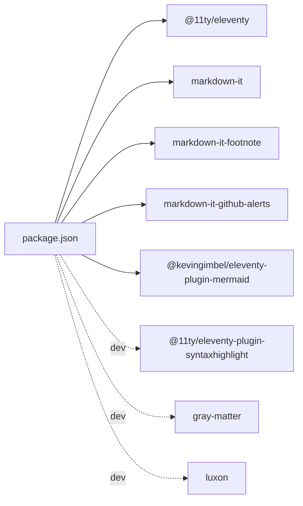

# 快速开始

<cite>
**本文引用的文件**
- [README.md](file://README.md)
- [package.json](file://package.json)
- [.npmrc](file://.npmrc)
- [.eleventy.js](file://.eleventy.js)
- [src/_data/siteConfig.js](file://src/_data/siteConfig.js)
- [src/content/settings/siteConfig.js](file://src/content/settings/siteConfig.js)
- [src/content/settings/categoryDescriptions.json](file://src/content/settings/categoryDescriptions.json)
- [eleventy/config/filters.js](file://eleventy/config/filters.js)
- [eleventy/config/collections.js](file://eleventy/config/collections.js)
- [scripts/manage-dates.js](file://scripts/manage-dates.js)
- [scripts/sync-category-meta.js](file://scripts/sync-category-meta.js)
- [scripts/optimize-css-safe.js](file://scripts/optimize-css-safe.js)
- [scripts/perf-self-check.js](file://scripts/perf-self-check.js)
- [src/content/posts/建站需求篇/建站需求清单：先确认你想展示什么@xfq.md](file://src/content/posts/建站需求篇/建站需求清单：先确认你想展示什么@xfq.md)
- [src/content/posts/建站需求篇/建站需求清单：估算更新频率@xfq.md](file://src/content/posts/建站需求篇/建站需求清单：估算更新频率@xfq.md)
</cite>

## 目录
1. [简介](#简介)
2. [项目结构](#项目结构)
3. [核心组件](#核心组件)
4. [架构总览](#架构总览)
5. [详细组件分析](#详细组件分析)
6. [依赖分析](#依赖分析)
7. [性能考虑](#性能考虑)
8. [故障排除指南](#故障排除指南)
9. [结论](#结论)
10. [附录](#附录)

## 简介
本指南面向首次接触 11ty RainyNight 项目的用户，帮助你在最短时间内完成环境准备、项目克隆、依赖安装与本地运行，并掌握各 npm 脚本命令的用途与使用场景。项目采用 Eleventy 作为静态站点生成器，结合多类自动化脚本，实现“约定优于配置”的写作与发布流程。

## 项目结构
- 根目录包含构建配置、Eleventy 主配置、NPM 脚本与脚本工具。
- 内容位于 src/content，分为 posts（文章）与 pages（独立页面）两类。
- 配置集中在 src/content/settings，包括站点全局文案与分类简介。
- Eleventy 插件与过滤器、集合（collections）逻辑位于 eleventy/config。
- 构建产物输出至 _site。



图表来源
- [.eleventy.js:36-180](file://.eleventy.js#L36-L180)
- [package.json:6-16](file://package.json#L6-L16)

章节来源
- [.eleventy.js:36-180](file://.eleventy.js#L36-L180)
- [package.json:6-16](file://package.json#L6-L16)

## 核心组件
- Eleventy 主配置：注册插件、Markdown 库、集合与全局计算数据；定义输入/输出目录。
- NPM 脚本：提供开发预览、构建、性能检查、CSS 优化、元数据同步与日期更新等命令。
- 自动化脚本：管理文章日期、同步分类元数据、优化 CSS、生成性能报告。
- 配置系统：集中管理站点品牌、导航、页脚、SEO、分页与页面文案。

章节来源
- [.eleventy.js:36-180](file://.eleventy.js#L36-L180)
- [package.json:6-16](file://package.json#L6-L16)
- [scripts/manage-dates.js:1-85](file://scripts/manage-dates.js#L1-L85)
- [scripts/sync-category-meta.js:1-205](file://scripts/sync-category-meta.js#L1-L205)
- [scripts/optimize-css-safe.js:1-112](file://scripts/optimize-css-safe.js#L1-L112)
- [scripts/perf-self-check.js:1-199](file://scripts/perf-self-check.js#L1-L199)
- [src/content/settings/siteConfig.js:1-168](file://src/content/settings/siteConfig.js#L1-L168)
- [src/content/settings/categoryDescriptions.json:1-60](file://src/content/settings/categoryDescriptions.json#L1-L60)

## 架构总览
下图展示了从命令行到构建产物的整体流程，以及关键脚本与 Eleventy 的交互关系。

```mermaid
sequenceDiagram
participant Dev as "开发者"
participant NPM as "NPM 脚本"
participant Dates as "manage-dates.js"
participant Clean as "clean-site.js"
participant Sync as "sync-category-meta.js"
participant Eleventy as "Eleventy"
participant Opt as "optimize-css-safe.js"
participant Perf as "perf-self-check.js"
Dev->>NPM : 运行 npm run build
NPM->>Dates : update-dates
Dates-->>NPM : 更新文章日期元数据
NPM->>Clean : 清理旧产物
Clean-->>NPM : 输出目录已清理
NPM->>Sync : 同步分类元数据
Sync-->>NPM : 写入分类描述文件
NPM->>Eleventy : 执行构建
Eleventy-->>NPM : 生成 _site
NPM->>Opt : 优化 CSS
Opt-->>NPM : 输出压缩后的 CSS
NPM->>Perf : 性能自检
Perf-->>Dev : 输出构建报告
```

图表来源
- [package.json:6-16](file://package.json#L6-L16)
- [scripts/manage-dates.js:1-85](file://scripts/manage-dates.js#L1-L85)
- [scripts/sync-category-meta.js:1-205](file://scripts/sync-category-meta.js#L1-L205)
- [scripts/optimize-css-safe.js:1-112](file://scripts/optimize-css-safe.js#L1-L112)
- [scripts/perf-self-check.js:1-199](file://scripts/perf-self-check.js#L1-L199)

## 详细组件分析

### 环境要求与安装
- Node.js 版本：项目依赖包含 @11ty/eleventy，建议使用稳定 LTS 版本以获得最佳兼容性。
- npm 配置：仓库内置 .npmrc，配置了国内镜像与二进制依赖源，有助于加速安装与减少失败率。
- 安装依赖：在项目根目录执行安装命令，等待依赖下载完成。

命令示例
- 安装依赖
  - npm install

章节来源
- [.npmrc:1-6](file://.npmrc#L1-L6)
- [README.md:87-91](file://README.md#L87-L91)

### 本地运行与开发预览
- 启动开发服务器：运行 npm start，Eleventy 将启动本地服务并监听文件变更自动刷新。
- 访问地址：通常为 http://localhost:port（具体端口由 Eleventy 分配）。

命令示例
- 启动开发服务器
  - npm start

章节来源
- [README.md:93-99](file://README.md#L93-L99)
- [package.json:8](file://package.json#L8)

### 构建流程与命令详解
- npm run build：发布前的唯一命令，串联多个子任务，最终输出到 _site。
- 子任务顺序与作用：
  1) update-dates：扫描文章目录，自动补全或更新 date 与 updated 元数据。
  2) clean:site：清理旧的构建产物。
  3) sync-meta：根据现有文章同步分类元数据到 settings 文件。
  4) eleventy：执行核心构建。
  5) css:optimize：压缩并优化 CSS。
  6) perf:check：生成构建性能报告。

命令示例
- 一次性构建
  - npm run build

章节来源
- [README.md:101-116](file://README.md#L101-L116)
- [package.json:9-16](file://package.json#L9-L16)
- [scripts/manage-dates.js:1-85](file://scripts/manage-dates.js#L1-L85)
- [scripts/sync-category-meta.js:1-205](file://scripts/sync-category-meta.js#L1-L205)
- [scripts/optimize-css-safe.js:1-112](file://scripts/optimize-css-safe.js#L1-L112)
- [scripts/perf-self-check.js:1-199](file://scripts/perf-self-check.js#L1-L199)

### 开发调试与日志
- npm run debug：启用 Eleventy 的调试日志，便于排查构建问题。
- 常见调试场景：插件加载异常、集合过滤错误、Markdown 渲染问题。

命令示例
- 启用调试日志
  - npm run debug

章节来源
- [package.json:14](file://package.json#L14)

### 写作规范与文件命名约定
- 文章位置：src/content/posts 下的分类文件夹。
- 文件命名约定：文章标题@分类ID.md。系统据此自动推导标题、分类与永久链接。
- Front-matter：建议仅保留 description 与 slug，其余由脚本自动填充。

示例参考
- [src/content/posts/建站需求篇/建站需求清单：先确认你想展示什么@xfq.md:1-28](file://src/content/posts/建站需求篇/建站需求清单：先确认你想展示什么@xfq.md#L1-L28)
- [src/content/posts/建站需求篇/建站需求清单：估算更新频率@xfq.md:1-28](file://src/content/posts/建站需求篇/建站需求清单：估算更新频率@xfq.md#L1-L28)

章节来源
- [README.md:24-82](file://README.md#L24-L82)

### 站点配置与文案管理
- 站点全局配置：src/content/settings/siteConfig.js，集中管理品牌、导航、页脚、SEO、分页与页面文案。
- 分类简介：src/content/settings/categoryDescriptions.json，为分类页面提供简介文本；新增分类后可用 npm run sync-meta 同步。

章节来源
- [src/content/settings/siteConfig.js:1-168](file://src/content/settings/siteConfig.js#L1-L168)
- [src/content/settings/categoryDescriptions.json:1-60](file://src/content/settings/categoryDescriptions.json#L1-L60)
- [README.md:120-137](file://README.md#L120-L137)

### Eleventy 配置与扩展
- 插件注册：语法高亮、Mermaid 图表、Markdown 扩展（脚注、GitHub Alerts）。
- Markdown 库：开启 HTML、换行与链接识别。
- 集合与过滤器：日期格式化、标题拼接、文章集合与分类树构建。
- 全局计算数据：自动填充文章标题、分类、布局、永久链接、标签、样式等。

章节来源
- [.eleventy.js:36-180](file://.eleventy.js#L36-L180)
- [eleventy/config/filters.js:1-43](file://eleventy/config/filters.js#L1-L43)
- [eleventy/config/collections.js:1-377](file://eleventy/config/collections.js#L1-L377)

## 依赖分析
- 运行时依赖
  - @11ty/eleventy：静态站点生成核心。
  - markdown-it 系列：Markdown 解析与扩展。
  - @kevingimbel/eleventy-plugin-mermaid：Mermaid 图表支持。
- 开发依赖
  - @11ty/eleventy-plugin-syntaxhighlight：代码高亮。
  - gray-matter：Front-matter 解析。
  - luxon：日期处理。



图表来源
- [package.json:22-33](file://package.json#L22-L33)

章节来源
- [package.json:22-33](file://package.json#L22-L33)

## 性能考虑
- CSS 优化：构建后自动压缩 CSS，减少体积与请求次数。
- 构建性能自检：统计 HTML/CSS/JS 总大小、最大单文件、Top 10 最大文件，并给出预算对比结果。
- 预算阈值：包含总 HTML/CSS/JS 体积与单文件体积上限，便于控制站点体积。

章节来源
- [scripts/optimize-css-safe.js:1-112](file://scripts/optimize-css-safe.js#L1-L112)
- [scripts/perf-self-check.js:10-15](file://scripts/perf-self-check.js#L10-L15)
- [scripts/perf-self-check.js:170-199](file://scripts/perf-self-check.js#L170-L199)

## 故障排除指南
- 无法启动开发服务器
  - 检查 Node.js 版本是否满足要求。
  - 清理缓存后重试：npm ci 或删除 node_modules 后重新安装。
- 构建失败或缺少输出
  - 确认 npm run build 是否完整执行，关注 update-dates、sync-meta、eleventy、css:optimize、perf:check 的输出。
  - 若 _site 目录缺失，检查 clean:site 是否正常清理与重建。
- 文章未显示或分类错误
  - 确保文件名符合“标题@分类ID.md”约定。
  - 使用 npm run sync-meta 同步分类元数据。
- 日期未更新
  - 确认 manage-dates 脚本是否执行，检查文章的 date 与 updated 字段是否被正确写入。
- 性能自检告警
  - 关注最大单文件与总 CSS/JS 体积是否超过预算阈值，必要时精简资源或拆分样式。

章节来源
- [README.md:87-116](file://README.md#L87-L116)
- [scripts/manage-dates.js:16-68](file://scripts/manage-dates.js#L16-L68)
- [scripts/sync-category-meta.js:36-205](file://scripts/sync-category-meta.js#L36-L205)
- [scripts/perf-self-check.js:170-199](file://scripts/perf-self-check.js#L170-L199)

## 结论
通过本指南，你已经完成了环境准备、项目克隆、依赖安装与本地运行，并掌握了 npm 脚本的使用方法与背后的工作机制。建议在熟悉基础流程后，进一步探索 Eleventy 的集合与过滤器、Markdown 扩展、Mermaid 图表集成，以及站点配置的深度定制。

## 附录

### 常用命令一览
- 安装依赖
  - npm install
- 开发预览
  - npm start
- 一次性构建
  - npm run build
- 更新文章日期
  - npm run update-dates
- 清理构建产物
  - npm run clean:site
- 同步分类元数据
  - npm run sync-meta
- 优化 CSS
  - npm run css:optimize
- 性能自检
  - npm run perf:check
- 启用调试日志
  - npm run debug

章节来源
- [README.md:87-116](file://README.md#L87-L116)
- [package.json:6-16](file://package.json#L6-L16)