# 性能优化脚本

<cite>
**本文档中引用的文件**
- [optimize-js.js](file://scripts/optimize-js.js)
- [optimize-css-safe.js](file://scripts/optimize-css-safe.js)
- [merge-css.js](file://scripts/merge-css.js)
- [perf-self-check.js](file://scripts/perf-self-check.js)
- [clean-site.js](file://scripts/clean-site.js)
- [manage-categories.js](file://scripts/manage-categories.js)
- [manage-dates.js](file://scripts/manage-dates.js)
- [sync-category-meta.js](file://scripts/sync-category-meta.js)
- [package.json](file://package.json)
- [.eleventy.js](file://.eleventy.js)
- [collections.js](file://eleventy/config/collections.js)
- [filters.js](file://eleventy/config/filters.js)
- [slug-encoder.js](file://eleventy/utils/slug-encoder.js)
- [siteConfig.js](file://src/content/settings/siteConfig.js)
</cite>

## 目录
1. [项目概述](#项目概述)
2. [性能优化架构](#性能优化架构)
3. [核心优化脚本分析](#核心优化脚本分析)
4. [构建流程优化](#构建流程优化)
5. [性能监控与检查](#性能监控与检查)
6. [自动化工具集成](#自动化工具集成)
7. [最佳实践建议](#最佳实践建议)
8. [故障排除指南](#故障排除指南)
9. [总结](#总结)

## 项目概述

rainyNight-doc 是一个基于 Eleventy 的静态网站生成器项目，专注于个人网站搭建演示站的性能优化。该项目通过一系列专门的 JavaScript 脚本实现了全面的前端资源优化，包括 CSS 合并、JavaScript 压缩、性能监控等功能。

项目采用模块化的架构设计，将性能优化功能分离为独立的脚本文件，每个脚本负责特定的优化任务。这种设计使得优化过程更加可控和可维护。

## 性能优化架构

### 整体架构图

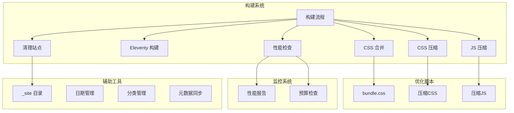

**图表来源**
- [package.json:6-18](file://package.json#L6-L18)
- [optimize-js.js:212-242](file://scripts/optimize-js.js#L212-L242)
- [optimize-css-safe.js:82-112](file://scripts/optimize-css-safe.js#L82-L112)
- [merge-css.js:142-198](file://scripts/merge-css.js#L142-L198)

### 优化流程序列图

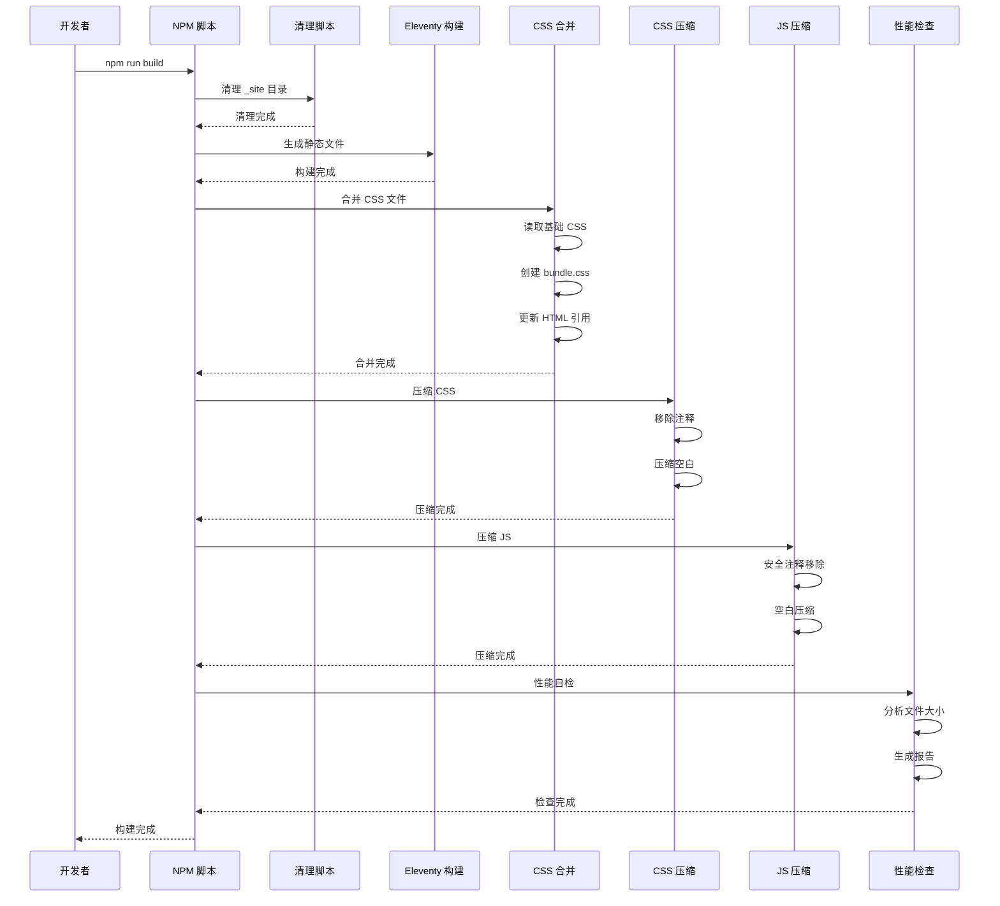

**图表来源**
- [package.json:9-10](file://package.json#L9-L10)
- [merge-css.js:142-198](file://scripts/merge-css.js#L142-L198)
- [optimize-css-safe.js:82-112](file://scripts/optimize-css-safe.js#L82-L112)
- [optimize-js.js:212-242](file://scripts/optimize-js.js#L212-L242)
- [perf-self-check.js:170-199](file://scripts/perf-self-check.js#L170-L199)

## 核心优化脚本分析

### CSS 合并脚本 (merge-css.js)

CSS 合并脚本实现了智能的样式文件合并功能，通过将多个基础 CSS 文件合并为单一的 bundle.css 来减少 HTTP 请求次数。

#### 主要功能特性

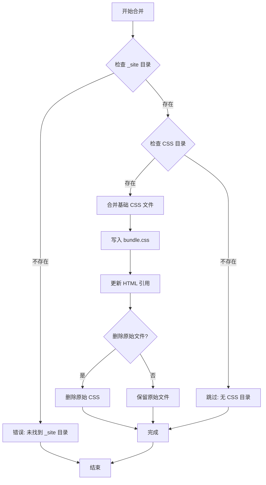

**图表来源**
- [merge-css.js:142-198](file://scripts/merge-css.js#L142-L198)
- [merge-css.js:59-80](file://scripts/merge-css.js#L59-L80)

#### 合并策略

脚本按照预定义的顺序合并 CSS 文件：
1. **foundation.css** - 基础样式
2. **layout.css** - 布局样式  
3. **components.css** - 组件样式
4. **alerts.css** - 警告提示样式
5. **code.css** - 代码高亮样式

#### HTML 引用更新机制

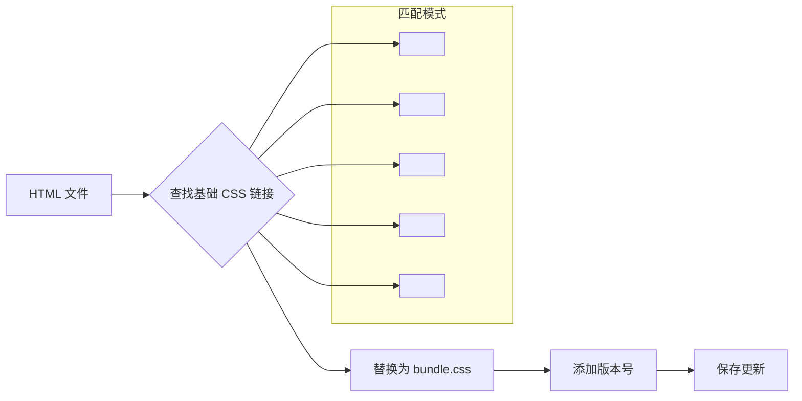

**图表来源**
- [merge-css.js:86-121](file://scripts/merge-css.js#L86-L121)
- [merge-css.js:173-181](file://scripts/merge-css.js#L173-L181)

**章节来源**
- [merge-css.js:1-198](file://scripts/merge-css.js#L1-L198)

### CSS 安全压缩脚本 (optimize-css-safe.js)

CSS 安全压缩脚本实现了保守的 CSS 压缩算法，确保在压缩过程中不会破坏 CSS 语法结构。

#### 压缩算法分析

```mermaid
flowchart TD
Input[输入 CSS 文件] --> StripComments[移除注释]
StripComments --> TrimLines[修剪行]
TrimLines --> FilterEmpty[过滤空行]
FilterEmpty --> CompressSpace[压缩空白]
CompressSpace --> Output[输出压缩 CSS]
subgraph "注释处理"
Comment1[/* 多行注释 */]
Comment2[// 单行注释]
StringLiteral["字符串字面量"]
end
StripComments --> Comment1
StripComments --> Comment2
StripComments --> StringLiteral
subgraph "字符串处理"
Quote1["' 单引号字符串"]
Quote2['" 双引号字符串']
Template[` 模板字符串]
end
StringLiteral --> Quote1
StringLiteral --> Quote2
StringLiteral --> Template
```

**图表来源**
- [optimize-css-safe.js:25-64](file://scripts/optimize-css-safe.js#L25-L64)
- [optimize-css-safe.js:66-76](file://scripts/optimize-css-safe.js#L66-L76)

#### 安全性保证

脚本通过状态机机制确保：
- **字符串字面量保护**：在字符串内部的注释不会被误删
- **选择器完整性**：CSS 选择器语法不会被破坏
- **属性值安全性**：CSS 属性值中的特殊字符得到正确处理

**章节来源**
- [optimize-css-safe.js:1-112](file://scripts/optimize-css-safe.js#L1-L112)

### JavaScript 压缩脚本 (optimize-js.js)

JavaScript 压缩脚本提供了高级的安全压缩功能，能够智能处理各种 JavaScript 语法结构。

#### 高级注释处理算法

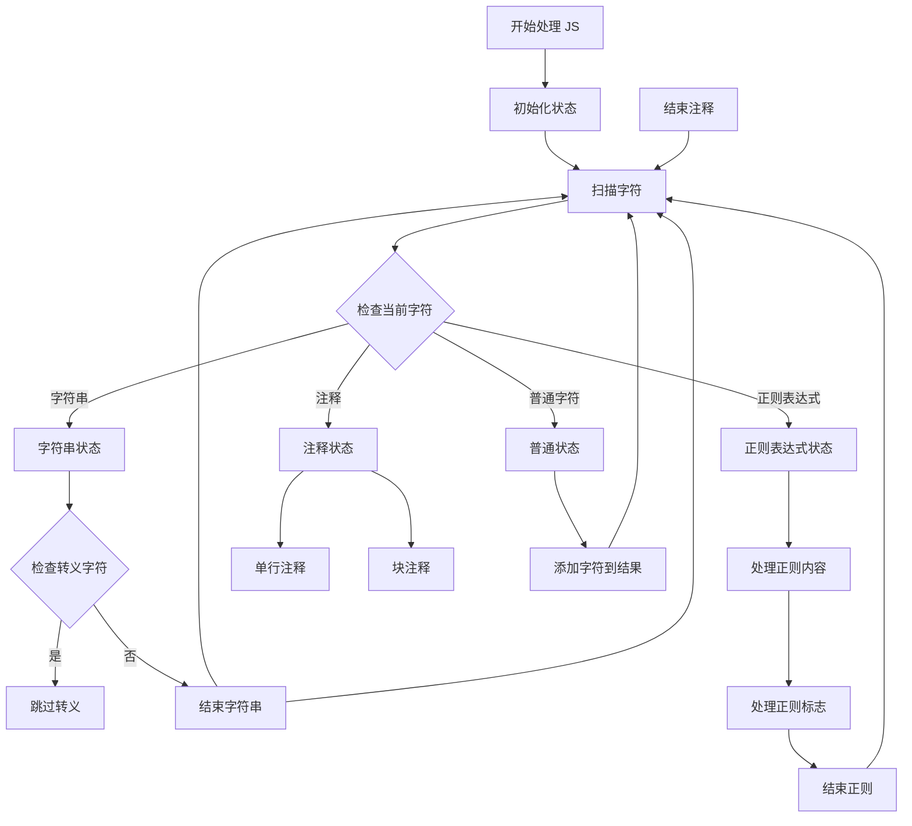

**图表来源**
- [optimize-js.js:39-181](file://scripts/optimize-js.js#L39-L181)

#### 正则表达式识别逻辑

脚本使用上下文分析来区分正则表达式和除法运算符：

```mermaid
flowchart LR
CheckChar[检查字符] --> PrevContext{获取前一个非空白字符}
PrevContext --> CheckChars{检查是否为正则前缀字符}
subgraph "正则表达式前缀字符"
Prefix1[=]
Prefix2[()]
Prefix3[,]
Prefix4[!]
Prefix5[&]
Prefix6[|]
Prefix7[?]
Prefix8[{]
Prefix9[}]
Prefix10[~]
Prefix11[^]
end
CheckChars --> |是| IsRegex[标记为正则表达式]
CheckChars --> |否| IsOperator[标记为运算符]
IsRegex --> ProcessRegex[处理正则表达式]
IsOperator --> ProcessOperator[处理运算符]
```

**图表来源**
- [optimize-js.js:111-145](file://scripts/optimize-js.js#L111-L145)

**章节来源**
- [optimize-js.js:1-242](file://scripts/optimize-js.js#L1-L242)

### 性能自检脚本 (perf-self-check.js)

性能自检脚本提供了全面的构建产物分析功能，包括文件大小统计、预算检查和详细报告生成。

#### 性能分析流程

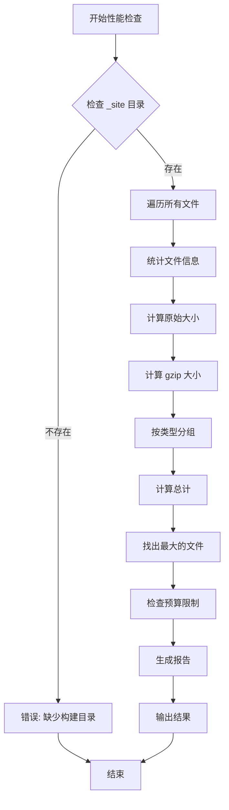

**图表来源**
- [perf-self-check.js:170-199](file://scripts/perf-self-check.js#L170-L199)
- [perf-self-check.js:50-126](file://scripts/perf-self-check.js#L50-L126)

#### 预算配置

脚本内置了严格的性能预算：
- **HTML 总大小**: ≤ 800 KiB
- **CSS 总大小**: ≤ 300 KiB  
- **JS 总大小**: ≤ 350 KiB
- **单个资源大小**: ≤ 500 KiB

#### 报告生成机制

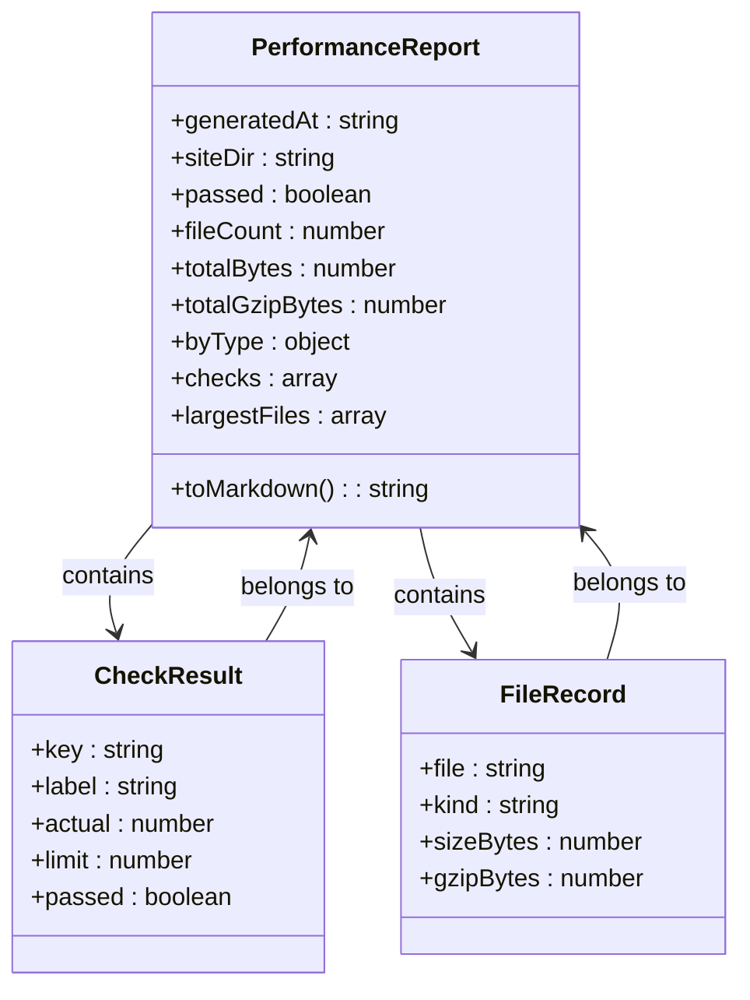

**图表来源**
- [perf-self-check.js:128-168](file://scripts/perf-self-check.js#L128-L168)
- [perf-self-check.js:170-199](file://scripts/perf-self-check.js#L170-L199)

**章节来源**
- [perf-self-check.js:1-199](file://scripts/perf-self-check.js#L1-L199)

## 构建流程优化

### 自动化构建管道

项目通过 NPM 脚本实现了完整的自动化构建流程，确保每次构建都经过相同的优化步骤。

#### 构建流程详解

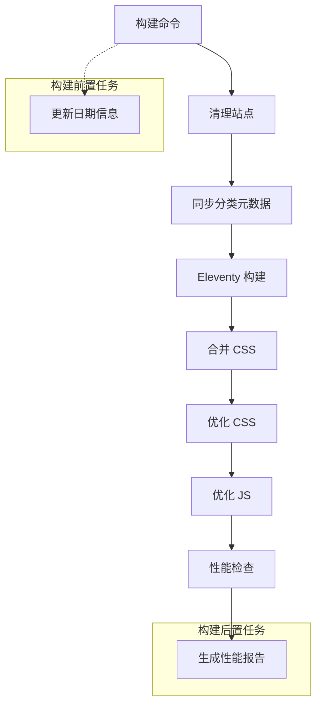

**图表来源**
- [package.json:9-10](file://package.json#L9-L10)
- [package.json:18](file://package.json#L18)

#### 依赖关系管理

```mermaid
graph LR
subgraph "开发依赖"
GrayMatter[gray-matter]
Luxon[luxon]
SyntaxHighlight[@11ty/eleventy-plugin-syntaxhighlight]
end
subgraph "运行时依赖"
Eleventy[@11ty/eleventy]
Mermaid[@kevingimbel/eleventy-plugin-mermaid]
MarkdownIt[markdown-it]
end
subgraph "性能优化脚本"
OptimizeJS[optimize-js]
OptimizeCSS[optimize-css-safe]
MergeCSS[merge-css]
PerfSelfCheck[perf-self-check]
end
Eleventy --> OptimizeJS
Eleventy --> OptimizeCSS
Eleventy --> MergeCSS
Eleventy --> PerfSelfCheck
```

**图表来源**
- [package.json:24-35](file://package.json#L24-L35)

**章节来源**
- [package.json:1-37](file://package.json#L1-L37)

## 性能监控与检查

### 实时性能监控

性能监控系统提供了多层次的监控能力，从文件级别的详细分析到整体性能预算检查。

#### 监控指标体系

| 指标类型 | 描述 | 预算阈值 | 当前实现 |
|---------|------|----------|----------|
| 总文件数 | 站点中文件的总数 | - | ✓ 实现 |
| 总大小 | 所有文件的原始大小 | - | ✓ 实现 |
| gzip 总大小 | 所有文件的压缩后大小 | - | ✓ 实现 |
| HTML 大小 | HTML 文件的总大小 | 800 KiB | ✓ 实现 |
| CSS 大小 | CSS 文件的总大小 | 300 KiB | ✓ 实现 |
| JS 大小 | JS 文件的总大小 | 350 KiB | ✓ 实现 |
| 单文件最大值 | 最大单个文件大小 | 500 KiB | ✓ 实现 |

#### 文件类型识别

脚本能够智能识别不同类型的文件并进行相应的处理：

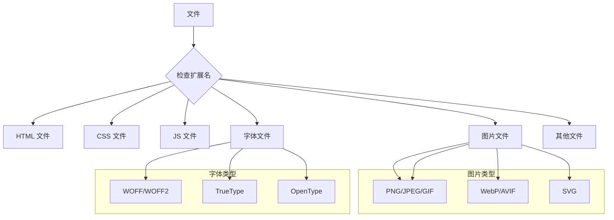

**图表来源**
- [perf-self-check.js:41-48](file://scripts/perf-self-check.js#L41-L48)

**章节来源**
- [perf-self-check.js:10-15](file://scripts/perf-self-check.js#L10-L15)
- [perf-self-check.js:41-48](file://scripts/perf-self-check.js#L41-L48)

### 性能报告生成

性能报告采用 Markdown 格式生成，便于在文档中展示和分享。

#### 报告结构

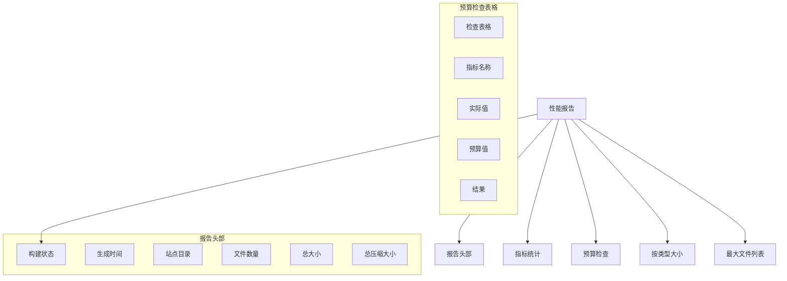

**图表来源**
- [perf-self-check.js:128-168](file://scripts/perf-self-check.js#L128-L168)

## 自动化工具集成

### 辅助工具集合

项目提供了多个辅助工具来支持内容管理和分类系统。

#### 分类管理工具

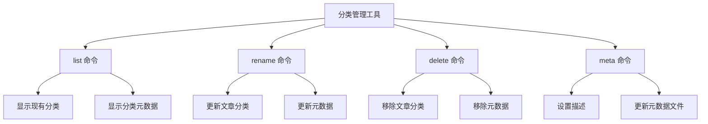

**图表来源**
- [manage-categories.js:195-212](file://scripts/manage-categories.js#L195-L212)

#### 日期管理工具

日期管理工具实现了智能的 Front Matter 处理功能：

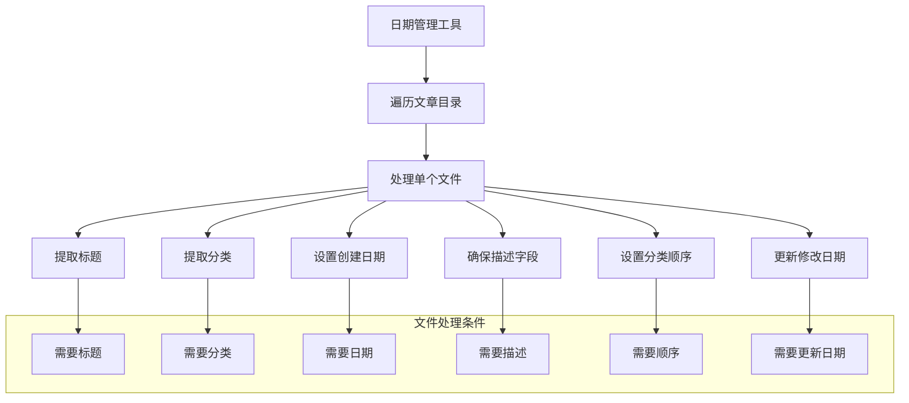

**图表来源**
- [manage-dates.js:38-127](file://scripts/manage-dates.js#L38-L127)

#### 元数据同步工具

元数据同步工具实现了双向的数据同步机制：

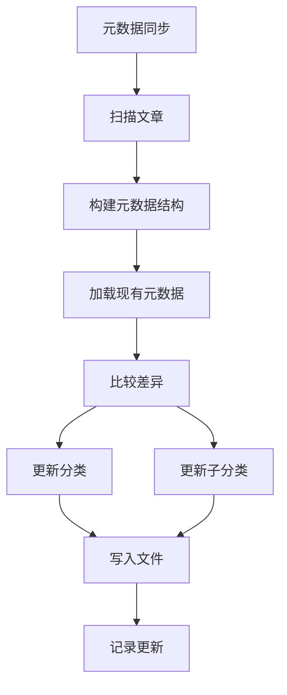

**图表来源**
- [sync-category-meta.js:36-233](file://scripts/sync-category-meta.js#L36-L233)

**章节来源**
- [manage-categories.js:1-212](file://scripts/manage-categories.js#L1-L212)
- [manage-dates.js:1-146](file://scripts/manage-dates.js#L1-L146)
- [sync-category-meta.js:1-233](file://scripts/sync-category-meta.js#L1-L233)

## 最佳实践建议

### 性能优化策略

基于项目现有的优化脚本，以下是推荐的最佳实践：

#### 1. CSS 优化最佳实践

- **文件组织**：保持基础样式文件的清晰分离
- **合并策略**：合理利用 CSS 合并减少 HTTP 请求
- **压缩质量**：使用安全压缩确保样式完整性

#### 2. JavaScript 优化建议

- **注释处理**：注意正则表达式的正确识别
- **字符串保护**：确保字符串内的注释不被误删
- **空白压缩**：在不影响语义的前提下减少文件大小

#### 3. 性能监控要点

- **定期检查**：建立定期的性能检查机制
- **预算管理**：严格遵守性能预算限制
- **报告跟踪**：持续跟踪性能指标变化趋势

### 构建流程优化

#### 1. 缓存策略

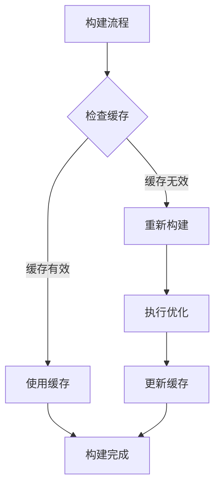

#### 2. 错误处理机制

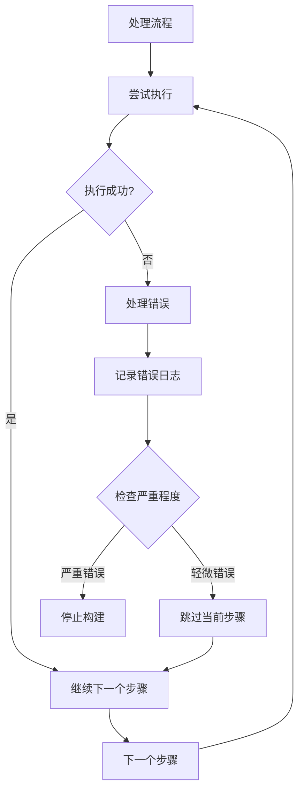

## 故障排除指南

### 常见问题诊断

#### 1. 构建失败问题

**问题症状**：构建过程中出现错误或中断

**可能原因**：
- `_site` 目录不存在或权限不足
- CSS 文件格式错误
- JavaScript 语法错误
- 磁盘空间不足

**解决方案**：
- 确保 `_site` 目录存在且可写
- 检查 CSS 文件的语法完整性
- 运行 `node scripts/optimize-css-safe.js` 单独测试 CSS 压缩
- 运行 `node scripts/optimize-js.js` 单独测试 JS 压缩

#### 2. 性能检查失败

**问题症状**：性能检查显示警告或失败

**可能原因**：
- 文件大小超过预算限制
- 某些文件类型过大
- 构建产物不完整

**解决方案**：
- 检查 `perf-self-check.js` 生成的详细报告
- 分析最大的文件并优化其内容
- 检查是否有不必要的资源包含在构建中

#### 3. CSS 合并问题

**问题症状**：CSS 合并后样式失效

**可能原因**：
- HTML 中的基础 CSS 链接格式不匹配
- bundle.css 生成失败
- 版本号冲突

**解决方案**：
- 检查 HTML 文件中的 CSS 链接格式
- 确认基础 CSS 文件都存在
- 清理浏览器缓存重新加载

### 调试技巧

#### 1. 日志分析

```bash
# 查看详细的构建日志
npm run build

# 查看特定脚本的执行情况
node scripts/perf-self-check.js

# 启用调试模式
DEBUG=* npm run build
```

#### 2. 性能分析

```bash
# 分别运行各个优化脚本
npm run css:merge
npm run css:optimize  
npm run js:optimize
npm run perf:check
```

#### 3. 清理和重置

```bash
# 清理构建目录
npm run clean:site

# 重新同步分类元数据
npm run sync-meta

# 重新更新日期信息
npm run update-dates
```

**章节来源**
- [clean-site.js:1-11](file://scripts/clean-site.js#L1-L11)
- [perf-self-check.js:170-199](file://scripts/perf-self-check.js#L170-L199)

## 总结

rainyNight-doc 项目通过精心设计的性能优化脚本集合，实现了全面的前端资源优化和自动化构建流程。项目的主要优势包括：

### 核心优势

1. **模块化设计**：每个优化脚本职责明确，便于维护和扩展
2. **安全性保障**：压缩算法充分考虑了语法完整性保护
3. **自动化程度高**：通过 NPM 脚本实现完整的构建流程自动化
4. **监控完善**：提供详细的性能监控和报告生成功能
5. **工具丰富**：包含多个辅助工具支持内容管理和分类系统

### 技术特色

- **智能注释处理**：JavaScript 压缩脚本能够准确识别和处理各种注释场景
- **保守压缩策略**：CSS 压缩采用保守模式，确保样式完整性
- **预算驱动优化**：内置性能预算检查，防止资源过度膨胀
- **版本控制集成**：CSS 合并支持版本号管理，优化缓存效果

### 应用价值

该项目为个人网站和内容管理系统提供了完整的性能优化解决方案，特别适用于需要高质量内容展示的网站项目。通过自动化优化流程，开发者可以专注于内容创作，而不必担心前端性能问题。