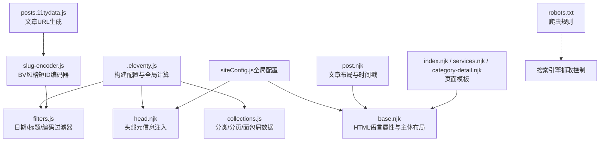
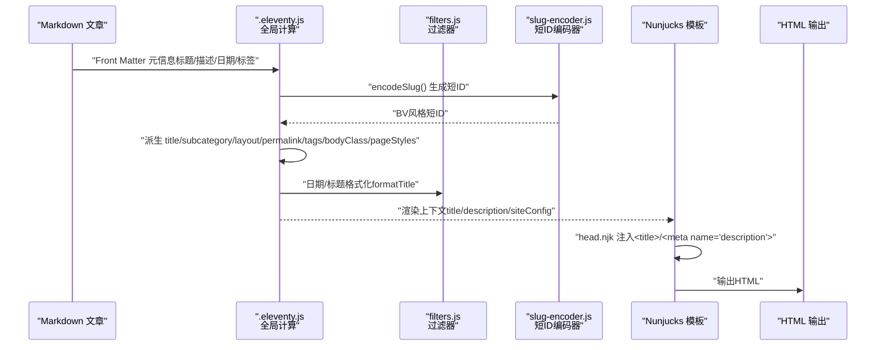
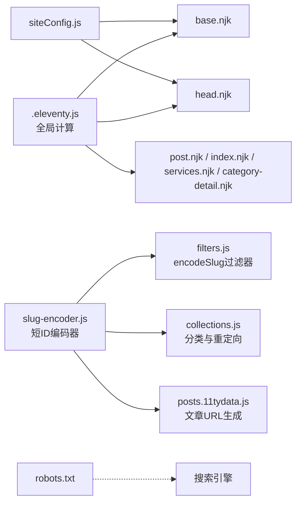

# SEO优化指南

<cite>
**本文引用的文件**
- [head.njk](file://src/_includes/partials/head.njk)
- [base.njk](file://src/_includes/layouts/base.njk)
- [post.njk](file://src/_includes/layouts/post.njk)
- [siteConfig.js（全局配置）](file://src/content/settings/siteConfig.js)
- [siteConfig.js（数据桥接）](file://src/_data/siteConfig.js)
- [.eleventy.js](file://.eleventy.js)
- [filters.js](file://eleventy/config/filters.js)
- [collections.js](file://eleventy/config/collections.js)
- [slug-encoder.js](file://eleventy/utils/slug-encoder.js)
- [posts.11tydata.js](file://src/content/posts/posts.11tydata.js)
- [index.njk（首页）](file://src/content/pages/index.njk)
- [services.njk（服务说明页）](file://src/content/pages/services.njk)
- [category-detail.njk（分类详情页）](file://src/content/pages/category-detail.njk)
- [robots.txt](file://src/static/robots.txt)
- [package.json](file://package.json)
</cite>

## 更新摘要
**变更内容**
- 新增BV风格短ID编码系统章节，详细介绍稳定的URL生成机制
- 更新URL结构优化部分，反映新的短ID编码策略
- 新增编码器工具类的SEO应用说明
- 更新重定向策略章节，涵盖从中文URL到短编码URL的迁移

## 目录
1. [引言](#引言)
2. [项目结构](#项目结构)
3. [核心组件](#核心组件)
4. [架构总览](#架构总览)
5. [详细组件分析](#详细组件分析)
6. [BV风格短ID编码系统](#bv风格短id编码系统)
7. [依赖关系分析](#依赖关系分析)
8. [性能考量](#性能考量)
9. [故障排查指南](#故障排查指南)
10. [结论](#结论)
11. [附录](#附录)

## 引言
本指南面向个人网站的SEO优化实践，结合当前仓库中已有的模板与构建配置，系统讲解页面标题优化、描述优化、关键词布局、URL结构、面包屑导航、内部链接策略、元标签配置、Open Graph与Twitter Card设置，并提供可落地的检查清单与优化案例，帮助提升搜索引擎收录质量与点击率。

**最新更新**：本版本新增了BV风格短ID编码系统，该系统提供稳定的URL生成机制，显著改善了SEO表现，确保URL的稳定性与可读性。

## 项目结构
该项目基于 Eleventy 静态站点生成器，采用 Nunjucks 模板与 Markdown 内容，通过全局配置集中管理站点元信息与页面文案，构建期计算标题、URL、分页与分类树，输出纯静态 HTML。核心结构如下：

**图表来源**
- [.eleventy.js:37-187](file://.eleventy.js#L37-L187)
- [head.njk:1-27](file://src/_includes/partials/head.njk#L1-L27)
- [base.njk:1-20](file://src/_includes/layouts/base.njk#L1-L20)
- [post.njk:1-49](file://src/_includes/layouts/post.njk#L1-L49)
- [slug-encoder.js:1-98](file://eleventy/utils/slug-encoder.js#L1-L98)
- [posts.11tydata.js:1-13](file://src/content/posts/posts.11tydata.js#L1-L13)
- [siteConfig.js（全局配置）:1-168](file://src/content/settings/siteConfig.js#L1-L168)
- [robots.txt:1-2](file://src/static/robots.txt#L1-L2)

**章节来源**
- [.eleventy.js:37-187](file://.eleventy.js#L37-L187)
- [siteConfig.js（数据桥接）:1-2](file://src/_data/siteConfig.js#L1-L2)
- [siteConfig.js（全局配置）:1-168](file://src/content/settings/siteConfig.js#L1-L168)
- [head.njk:1-27](file://src/_includes/partials/head.njk#L1-L27)
- [base.njk:1-20](file://src/_includes/layouts/base.njk#L1-L20)
- [post.njk:1-49](file://src/_includes/layouts/post.njk#L1-L49)
- [slug-encoder.js:1-98](file://eleventy/utils/slug-encoder.js#L1-L98)
- [posts.11tydata.js:1-13](file://src/content/posts/posts.11tydata.js#L1-L13)
- [index.njk（首页）:1-82](file://src/content/pages/index.njk#L1-L82)
- [services.njk（服务说明页）:1-55](file://src/content/pages/services.njk#L1-L55)
- [category-detail.njk（分类详情页）:1-79](file://src/content/pages/category-detail.njk#L1-L79)
- [robots.txt:1-2](file://src/static/robots.txt#L1-L2)

## 核心组件
- 全局配置与元信息
  - 站点品牌、导航、页脚、元数据（标题、描述、作者、邮箱、URL、语言）、分页参数等集中于全局配置文件，供模板与构建期计算共享。
- 构建期计算与标题/URL/分页
  - 通过全局计算字段自动派生文章标题、子分类、布局、永久链接、发布时间、更新时间、标签、页面样式等；同时生成分类树与面包屑数据。
- 模板层注入
  - 基础布局统一设置语言属性；头部模板注入标题、描述与预连接资源；文章布局展示发布与更新时间。
- 爬虫与索引控制
  - robots.txt 默认禁止所有爬虫，需按需调整以允许索引。

**章节来源**
- [siteConfig.js（全局配置）:1-168](file://src/content/settings/siteConfig.js#L1-L168)
- [.eleventy.js:76-164](file://.eleventy.js#L76-L164)
- [head.njk:1-27](file://src/_includes/partials/head.njk#L1-L27)
- [base.njk:1-20](file://src/_includes/layouts/base.njk#L1-L20)
- [post.njk:10-25](file://src/_includes/layouts/post.njk#L10-L25)
- [robots.txt:1-2](file://src/static/robots.txt#L1-L2)

## 架构总览
下图展示从内容到页面的SEO相关处理链路：内容文件经 Front Matter 提供元信息，构建期计算派生标题与URL，模板注入头部元标签，最终输出HTML。

**图表来源**
- [.eleventy.js:76-164](file://.eleventy.js#L76-L164)
- [filters.js:33-46](file://eleventy/config/filters.js#L33-L46)
- [slug-encoder.js:49-64](file://eleventy/utils/slug-encoder.js#L49-L64)
- [head.njk:3-4](file://src/_includes/partials/head.njk#L3-L4)
- [base.njk:2-2](file://src/_includes/layouts/base.njk#L2-L2)
- [post.njk:10-25](file://src/_includes/layouts/post.njk#L10-L25)

## 详细组件分析

### 页面标题优化（Title）
- 标题来源与拼接
  - 使用标题过滤器将"页面标题 + 站点标题"拼接，避免重复或缺失。
  - 构建期计算文章标题时，若未显式提供，会从文件名解析出标题片段，确保每篇文章都有稳定标题。
- 建议
  - 在 Front Matter 中为重要页面提供明确的 title，避免依赖自动推导。
  - 控制标题长度在 50-60 字符以内，突出核心关键词与品牌。

**章节来源**
- [filters.js:33-46](file://eleventy/config/filters.js#L33-L46)
- [.eleventy.js:76-102](file://.eleventy.js#L76-L102)
- [head.njk:3-3](file://src/_includes/partials/head.njk#L3-L3)

### 描述优化（Description）
- 描述来源
  - 头部模板优先使用页面级 description，否则回退到全局配置中的站点描述。
  - 文章 Front Matter 支持 description 字段，可作为页面级描述。
- 建议
  - 每个页面提供独特、简洁、含关键词的描述（建议 150-160 字符）。
  - 首页与服务页应体现站点价值主张与核心服务。

**章节来源**
- [head.njk:4-4](file://src/_includes/partials/head.njk#L4-L4)
- [siteConfig.js（全局配置）:27-34](file://src/content/settings/siteConfig.js#L27-L34)
- [方案策划篇/FAQ 页面怎么降低读者顾虑@xfq.md:7-7](file://src/content/posts/方案策划篇/FAQ 页面怎么降低读者顾虑@xfq.md#L7-L7)

### 关键词布局（Keywords）
- 当前实现
  - 项目未在模板中显式输出 keywords 元标签；文章 Front Matter 的 tags 用于分类与归档，不直接映射到 keywords。
- 建议
  - 不推荐使用自动 keywords，搜索引擎多忽略；优先通过标题、描述、URL、语义化结构与内容自然布局关键词。
  - 若需关键词提示，可在描述中自然融入目标关键词，保持语义通顺。

**章节来源**
- [.eleventy.js:143-150](file://.eleventy.js#L143-L150)
- [方案策划篇/FAQ 页面怎么降低读者顾虑@xfq.md:3-7](file://src/content/posts/方案策划篇/FAQ 页面怎么降低读者顾虑@xfq.md#L3-L7)

### URL 结构优化
- 自动化 permalink 生成
  - 文章默认 permalink 由标题派生编码生成，支持自定义 slug；若 slug 为空或为占位符则自动生成带前缀的编码ID，保证唯一性与稳定性。
- **新增** BV风格短ID编码系统
  - 使用 `encodeSlug()` 函数将中文标题转换为稳定的短ID，如 `pQ9Xk2m` 格式
  - 支持前缀配置（'p' 表示文章，'c' 表示分类）
  - 最小长度控制，确保URL的可读性和稳定性
- 建议
  - 为重要页面设置固定 permalink（如首页、服务页），避免频繁变更。
  - 使用语义化路径（如 `/posts/{slug}/`），避免参数化ID。

**章节来源**
- [.eleventy.js:103-118](file://.eleventy.js#L103-L118)
- [collections.js:260-316](file://eleventy/config/collections.js#L260-L316)
- [slug-encoder.js:49-64](file://eleventy/utils/slug-encoder.js#L49-L64)
- [posts.11tydata.js:7-11](file://src/content/posts/posts.11tydata.js#L7-L11)

### 面包屑导航
- 数据来源
  - 分类详情页通过集合计算生成面包屑数组，逐级拼接父节点标题与链接。
- 实现要点
  - 面包屑在分类详情页模板中直接渲染，形成"全部归档 / 父类 / 子类"的层级结构。
  - 使用编码后的短ID生成稳定的URL链接。
- 建议
  - 保持面包屑层级不超过 3 层，确保用户与搜索引擎都能清晰理解位置。
  - 链接文本使用可读性强的标题，避免使用"首页""返回"等无语境词汇。

**章节来源**
- [collections.js:260-282](file://eleventy/config/collections.js#L260-L282)
- [category-detail.njk（分类详情页）:17-22](file://src/content/pages/category-detail.njk#L17-L22)

### 内部链接策略
- 导航与入口
  - 基础布局中包含主导航（首页、内容归档、页面说明），服务页与首页提供明确的入口与跳转。
- 建议
  - 在文章与页面中自然嵌入相关页面链接，避免堆砌关键词。
  - 使用语义化锚文本（如"查看服务说明""了解更多"），提升可读性与相关性。

**章节来源**
- [base.njk:6-13](file://src/_includes/layouts/base.njk#L6-L13)
- [siteConfig.js（全局配置）:10-16](file://src/content/settings/siteConfig.js#L10-L16)
- [services.njk（服务说明页）:1-55](file://src/content/pages/services.njk#L1-L55)
- [index.njk（首页）:1-82](file://src/content/pages/index.njk#L1-L82)

### 元标签配置
- 语言与字符集
  - 基础布局设置 html lang 与 meta charset，确保可访问性与国际化支持。
- 预连接与样式
  - 头部模板预连接字体域并加载基础样式，有助于首屏渲染与 SEO 友好。
- 建议
  - 明确添加 viewport、robots、canonical、alternate 等常用元标签，必要时在模板中扩展。
  - 为首页与内容页分别设置不同的描述与关键词策略。

**章节来源**
- [base.njk:2-2](file://src/_includes/layouts/base.njk#L2-L2)
- [head.njk:1-27](file://src/_includes/partials/head.njk#L1-L27)

### Open Graph 与 Twitter Card 设置
- 当前状态
  - 项目未在模板中显式输出 Open Graph 或 Twitter Card 元标签。
- 建议
  - 在头部模板中增加 og:title、og:description、og:image、og:url、og:type 等；Twitter Card 对应添加 twitter:card、twitter:title、twitter:description、twitter:image 等。
  - 图片建议尺寸 1200×630，文件名包含关键词，URL 使用绝对路径。

**章节来源**
- [head.njk:3-4](file://src/_includes/partials/head.njk#L3-L4)
- [siteConfig.js（全局配置）:27-34](file://src/content/settings/siteConfig.js#L27-L34)

### 结构化数据（Schema.org）
- 当前状态
  - 项目未在模板中输出结构化数据（如 JSON-LD）。
- 建议
  - 在文章布局中输出 Article 或 BlogPosting 的 JSON-LD，包含 headline、datePublished、dateModified、author、publisher、image、description 等字段。
  - 在服务页输出 Organization 或 LocalBusiness 的 JSON-LD，包含 name、url、logo、sameAs 等。
  - 使用 schema.org 官方类型与属性，确保字段值与页面内容一致。

**章节来源**
- [post.njk:10-25](file://src/_includes/layouts/post.njk#L10-L25)
- [siteConfig.js（全局配置）:27-34](file://src/content/settings/siteConfig.js#L27-L34)

### 爬虫与索引控制
- 当前状态
  - robots.txt 默认禁止所有爬虫，将导致页面无法被索引。
- 建议
  - 将 robots.txt 修改为允许爬取，或仅限制特定爬虫；为重要页面设置 robots meta（如 noindex/noarchive）。
  - 提交 sitemap.xml 至搜索引擎平台，加速收录。

**章节来源**
- [robots.txt:1-2](file://src/static/robots.txt#L1-L2)

## BV风格短ID编码系统

### 系统概述
BV风格短ID编码系统是本项目新增的核心SEO优化组件，专门设计用于生成稳定、可读且对搜索引擎友好的URL标识符。该系统借鉴了B站（BV）短ID的设计理念，提供了一套完整的URL标准化解决方案。

### 编码原理
系统采用三层编码机制：
1. **字符串哈希**：使用djb2算法将输入字符串转换为32位整数哈希值
2. **Base58编码**：将数字转换为Base58字符集，去除易混淆字符（0、O、I、l）
3. **前缀与长度控制**：添加业务前缀（'p'表示文章，'c'表示分类）并确保最小长度

### 核心功能
- **encodeSlug()**：主要编码函数，支持自定义前缀和最小长度
- **batchEncode()**：批量编码，内置碰撞检测机制
- **hashString()**：底层哈希算法实现
- **encodeBase58()**：数字到Base58的转换函数

### SEO优势
- **稳定性**：相同的输入始终产生相同的输出，确保URL的持久性
- **可读性**：短ID长度适中，便于分享和记忆
- **搜索引擎友好**：避免中文URL的编码问题，提升爬虫识别效率
- **重定向支持**：自动处理从旧URL到新短ID的平滑迁移

### 实际应用
- **文章URL生成**：`/posts/pQ9Xk2m/` 替代 `/posts/建站需求清单：估算更新频率@xfq/`
- **分类URL生成**：`/categories/cABC123/` 替代 `/categories/方案策划篇/建站需求/`
- **重定向策略**：自动创建从中文URL到短ID的301重定向

### 配置选项
- **prefix**：前缀字符，'p'表示文章，'c'表示分类
- **minLength**：最小ID长度，默认6位
- **字符集**：Base58字符集，排除易混淆字符

**章节来源**
- [slug-encoder.js:1-98](file://eleventy/utils/slug-encoder.js#L1-L98)
- [filters.js:42-45](file://eleventy/config/filters.js#L42-L45)
- [collections.js:172-173](file://eleventy/config/collections.js#L172-L173)
- [posts.11tydata.js:7-11](file://src/content/posts/posts.11tydata.js#L7-L11)

## 依赖关系分析
- 模板与数据耦合
  - 基础布局依赖全局配置的语言与导航；头部模板依赖站点描述与标题；文章布局依赖日期与更新时间。
- 构建期计算与模板渲染
  - 全局计算字段在渲染前完成，减少模板逻辑复杂度，提升可维护性。
- **新增** 编码器集成
  - slug-encoder.js 与 filters.js、collections.js、posts.11tydata.js 深度集成
  - 提供统一的URL编码标准，确保全站URL的一致性
- 性能与SEO
  - 预连接字体域、按页面注入样式、稳定的 permalink 与清晰的面包屑，均有利于 SEO 与性能。

**图表来源**
- [siteConfig.js（全局配置）:1-168](file://src/content/settings/siteConfig.js#L1-L168)
- [base.njk:1-20](file://src/_includes/layouts/base.njk#L1-L20)
- [head.njk:1-27](file://src/_includes/partials/head.njk#L1-L27)
- [.eleventy.js:76-164](file://.eleventy.js#L76-L164)
- [slug-encoder.js:1-98](file://eleventy/utils/slug-encoder.js#L1-L98)
- [filters.js:42-45](file://eleventy/config/filters.js#L42-L45)
- [collections.js:172-173](file://eleventy/config/collections.js#L172-L173)
- [posts.11tydata.js:7-11](file://src/content/posts/posts.11tydata.js#L7-L11)
- [robots.txt:1-2](file://src/static/robots.txt#L1-L2)

**章节来源**
- [siteConfig.js（全局配置）:1-168](file://src/content/settings/siteConfig.js#L1-L168)
- [base.njk:1-20](file://src/_includes/layouts/base.njk#L1-L20)
- [head.njk:1-27](file://src/_includes/partials/head.njk#L1-L27)
- [.eleventy.js:76-164](file://.eleventy.js#L76-L164)
- [slug-encoder.js:1-98](file://eleventy/utils/slug-encoder.js#L1-L98)
- [filters.js:42-45](file://eleventy/config/filters.js#L42-L45)
- [collections.js:172-173](file://eleventy/config/collections.js#L172-L173)
- [posts.11tydata.js:7-11](file://src/content/posts/posts.11tydata.js#L7-L11)
- [robots.txt:1-2](file://src/static/robots.txt#L1-L2)

## 性能考量
- 静态输出与缓存友好
  - Eleventy 输出静态 HTML，利于 CDN 缓存与搜索引擎抓取。
- 资源加载
  - 预连接字体域、按页面注入样式，减少关键路径资源数量。
- **新增** 编码器性能
  - Base58编码算法简单高效，哈希计算开销极小
  - 批量编码支持碰撞检测，确保URL唯一性
- 建议
  - 启用 Gzip/Brotli 压缩与浏览器缓存；监控 Core Web Vitals；定期清理未使用的样式与脚本。

**章节来源**
- [head.njk:5-11](file://src/_includes/partials/head.njk#L5-L11)
- [post.njk:2-7](file://src/_includes/layouts/post.njk#L2-L7)
- [package.json:6-16](file://package.json#L6-L16)
- [slug-encoder.js:15-24](file://eleventy/utils/slug-encoder.js#L15-L24)

## 故障排查指南
- 页面未被索引
  - 检查 robots.txt 是否禁止抓取；确认首页与内容页是否有有效描述与标题。
- 标题重复或过长
  - 在 Front Matter 中设置明确 title；使用标题过滤器进行拼接控制。
- 分类页面包屑异常
  - 检查分类集合计算中的父节点路径与标题拼接逻辑。
- 更新时间未显示
  - 确认文章 Front Matter 中 updated 字段存在且格式正确；检查构建期计算是否覆盖了默认值。
- **新增** URL编码问题
  - 检查 slug-encoder.js 是否正确导入到相关模块
  - 验证 encodeSlug() 函数的参数配置（前缀、最小长度）
  - 确认重定向集合是否正确生成从中文URL到短ID的映射

**章节来源**
- [robots.txt:1-2](file://src/static/robots.txt#L1-L2)
- [filters.js:33-46](file://eleventy/config/filters.js#L33-L46)
- [collections.js:260-282](file://eleventy/config/collections.js#L260-L282)
- [post.njk:18-23](file://src/_includes/layouts/post.njk#L18-L23)
- [.eleventy.js:124-142](file://.eleventy.js#L124-L142)
- [slug-encoder.js:49-64](file://eleventy/utils/slug-encoder.js#L49-L64)

## 结论
通过集中化的全局配置、构建期计算与模板注入，本项目已具备良好的SEO基础。**最新更新**：新增的BV风格短ID编码系统进一步提升了URL的稳定性与SEO表现，通过统一的编码标准和智能重定向机制，确保了从中文URL到短ID的平滑迁移。建议在现有基础上补充 Open Graph/Twitter Card、结构化数据与 robots 规则，配合清晰的URL、面包屑与内部链接策略，进一步提升搜索引擎的收录质量与点击率。

## 附录

### SEO检查清单（落地版）
- 页面级
  - 每个页面提供独特描述（150-160字符），自然融入关键词
  - 标题控制在50-60字符，包含品牌与核心信息
  - 固定重要页面 permalink，避免参数化ID
  - 添加 canonical 与 alternate（如适用）
- 结构与导航
  - 首页与服务页提供明确入口与跳转
  - 分类详情页展示面包屑，层级不超过3层
  - 文章页展示发布与更新时间
  - **新增** 确保所有URL使用统一的短ID编码标准
- 社交与结构化
  - 添加 Open Graph 与 Twitter Card 元标签
  - 输出 Article/LocalBusiness 等 JSON-LD
- 抓取与索引
  - 调整 robots.txt 允许索引
  - 提交 sitemap.xml 至搜索引擎平台
  - 监控收录状态与点击率变化
  - **新增** 验证重定向从中文URL到短ID的正确性

### 优化案例（来自现有页面）
- 首页（index.njk）
  - 优势：提供搜索框与入口卡片，便于用户快速定位内容
  - 建议：为搜索页与入口卡片补充描述与关键词，增强相关性
- 服务说明页（services.njk）
  - 优势：清晰的服务项与列表，便于搜索引擎理解页面主题
  - 建议：为服务页输出结构化数据，标注服务类型与说明
- 分类详情页（category-detail.njk）
  - 优势：面包屑与分页清晰，利于爬虫抓取与用户导航
  - 建议：为分类页添加描述与关键词，提升主题相关性
  - **新增** 确保使用编码后的短ID生成稳定的分类URL

**章节来源**
- [index.njk（首页）:1-82](file://src/content/pages/index.njk#L1-L82)
- [services.njk（服务说明页）:1-55](file://src/content/pages/services.njk#L1-L55)
- [category-detail.njk（分类详情页）:1-79](file://src/content/pages/category-detail.njk#L1-L79)
- [slug-encoder.js:49-64](file://eleventy/utils/slug-encoder.js#L49-L64)
- [collections.js:330-363](file://eleventy/config/collections.js#L330-L363)