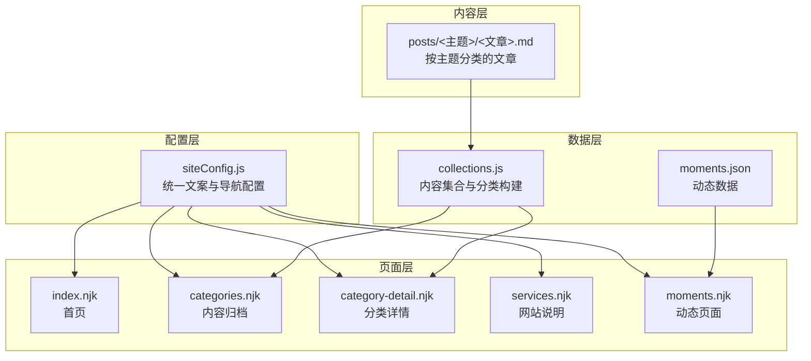
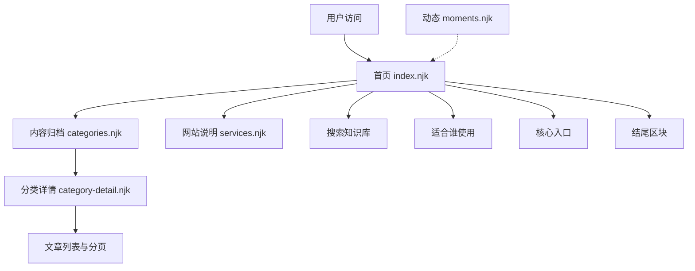
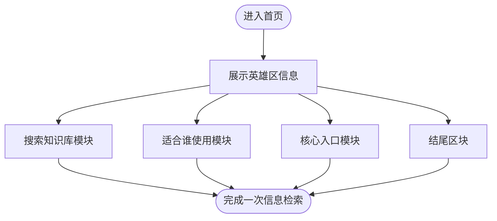
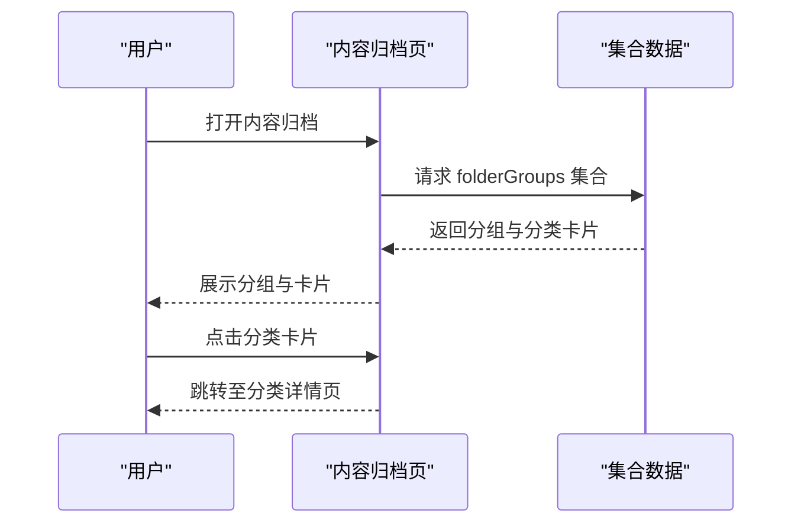
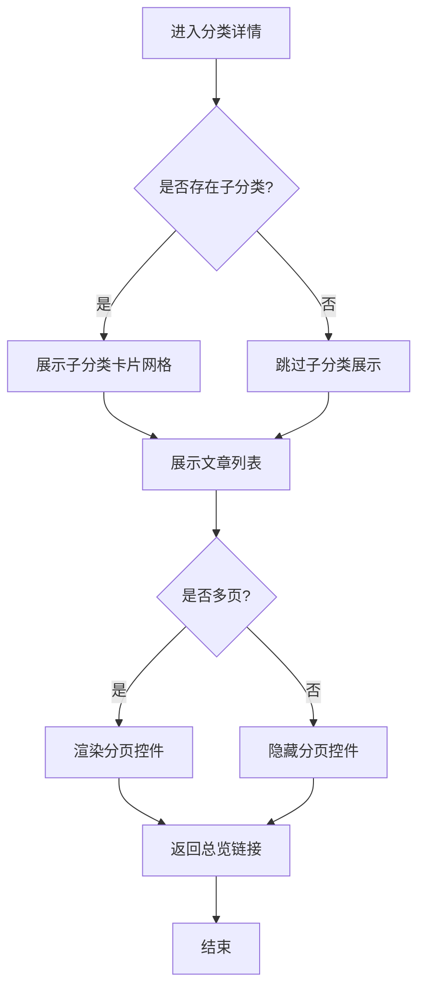
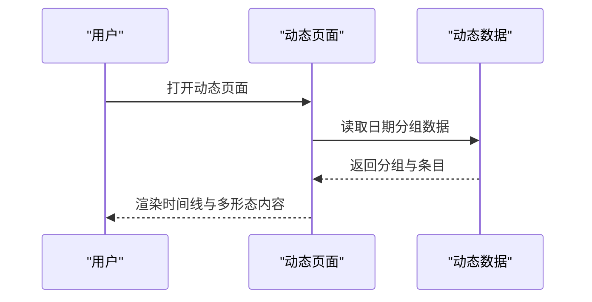
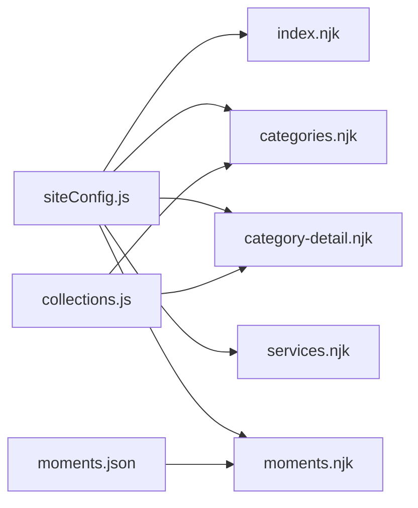

# 内容组织最佳实践

<cite>
**本文引用的文件**
- [src/content/settings/siteConfig.js](file://src/content/settings/siteConfig.js)
- [src/_data/siteConfig.js](file://src/_data/siteConfig.js)
- [src/content/pages/index.njk](file://src/content/pages/index.njk)
- [src/content/pages/categories.njk](file://src/content/pages/categories.njk)
- [src/content/pages/category-detail.njk](file://src/content/pages/category-detail.njk)
- [src/content/pages/services.njk](file://src/content/pages/services.njk)
- [src/content/pages/moments.njk](file://src/content/pages/moments.njk)
- [src/_data/moments.json](file://src/_data/moments.json)
- [eleventy/config/collections.js](file://eleventy/config/collections.js)
- [src/content/posts/方案策划篇/页面地图：先把个人网站结构画出来@xfq.md](file://src/content/posts/方案策划篇/页面地图：先把个人网站结构画出来@xfq.md)
- [src/content/posts/方案策划篇/首页文案要先讲你是谁还是先讲作品@xfq.md](file://src/content/posts/方案策划篇/首页文案要先讲你是谁还是先讲作品@xfq.md)
- [src/content/posts/网站示例篇/网站示例目录：从整理内容到上线的完整演示@alzs.md](file://src/content/posts/网站示例篇/网站示例目录：从整理内容到上线的完整演示@alzs.md)
- [src/content/posts/项目速览/演示案例 01：前端开发者个人主页@xs.md](file://src/content/posts/项目速览/演示案例 01：前端开发者个人主页@xs.md)
</cite>

## 目录
1. 引言
2. 项目结构
3. 核心组件
4. 架构总览
5. 详细组件分析
6. 依赖分析
7. 性能考虑
8. 故障排查指南
9. 结论
10. 附录

## 引言
本指南围绕个人网站的内容组织最佳实践展开，结合项目中的信息架构、分类与导航设计、内容优先级与标签系统、搜索友好结构，以及针对不同角色（自由职业者、设计师、摄影师、开发者等）的页面布局建议进行系统化阐述。同时提供Markdown内容编写规范与元数据配置示例，并通过实际页面组织案例与代码示例，帮助将复杂内容简化为清晰的信息架构。

## 项目结构
该项目采用基于 Eleventy 的静态站点生成器，内容以 Markdown 文档为主，配合 Nunjucks 模板与统一配置驱动页面渲染。核心结构包括：
- 配置层：集中于站点标题、导航、页脚、分页与页面文案配置
- 页面层：首页、内容归档、分类详情、服务说明、动态页面等
- 数据层：内容集合与分类元数据加载逻辑
- 内容层：按主题分类的文章集合，支持子分类与层级关系

图表来源
- [src/content/settings/siteConfig.js:1-168](file://src/content/settings/siteConfig.js#L1-L168)
- [src/content/pages/index.njk:1-94](file://src/content/pages/index.njk#L1-L94)
- [src/content/pages/categories.njk:1-67](file://src/content/pages/categories.njk#L1-L67)
- [src/content/pages/category-detail.njk:1-80](file://src/content/pages/category-detail.njk#L1-L80)
- [src/content/pages/services.njk:1-56](file://src/content/pages/services.njk#L1-L56)
- [src/content/pages/moments.njk:1-80](file://src/content/pages/moments.njk#L1-L80)
- [src/_data/moments.json:1-123](file://src/_data/moments.json#L1-L123)
- [eleventy/config/collections.js:1-377](file://eleventy/config/collections.js#L1-L377)

章节来源
- [src/content/settings/siteConfig.js:1-168](file://src/content/settings/siteConfig.js#L1-L168)
- [src/content/pages/index.njk:1-94](file://src/content/pages/index.njk#L1-L94)
- [src/content/pages/categories.njk:1-67](file://src/content/pages/categories.njk#L1-L67)
- [src/content/pages/category-detail.njk:1-80](file://src/content/pages/category-detail.njk#L1-L80)
- [src/content/pages/services.njk:1-56](file://src/content/pages/services.njk#L1-L56)
- [src/content/pages/moments.njk:1-80](file://src/content/pages/moments.njk#L1-L80)
- [src/_data/moments.json:1-123](file://src/_data/moments.json#L1-L123)
- [eleventy/config/collections.js:1-377](file://eleventy/config/collections.js#L1-L377)

## 核心组件
- 站点配置与导航
  - 集中式配置文件统一管理品牌、导航、页脚、元信息、主题与分页参数，首页与各页面标题、副标题、入口卡片与行动号召文案均来自配置。
- 内容集合与分类
  - 通过集合注册函数解析文章路径，提取主题与子分类，构建层级节点树；支持按日期、标题、自定义排序字段综合排序。
- 页面模板
  - 首页提供“搜索知识库”“适合谁使用”“核心入口”“结尾区块”等模块；内容归档页采用侧边栏分组与卡片网格；分类详情页支持面包屑、分页与子分类卡片；服务说明页以序号化模块展示要点；动态页面以时间线展示日常记录。
- 动态数据
  - 动态页面的数据来源于 JSON 文件，支持文本、图片、链接、视频等多形态内容。

章节来源
- [src/content/settings/siteConfig.js:1-168](file://src/content/settings/siteConfig.js#L1-L168)
- [src/content/pages/index.njk:1-94](file://src/content/pages/index.njk#L1-L94)
- [src/content/pages/categories.njk:1-67](file://src/content/pages/categories.njk#L1-L67)
- [src/content/pages/category-detail.njk:1-80](file://src/content/pages/category-detail.njk#L1-L80)
- [src/content/pages/services.njk:1-56](file://src/content/pages/services.njk#L1-L56)
- [src/content/pages/moments.njk:1-80](file://src/content/pages/moments.njk#L1-L80)
- [src/_data/moments.json:1-123](file://src/_data/moments.json#L1-L123)
- [eleventy/config/collections.js:1-377](file://eleventy/config/collections.js#L1-L377)

## 架构总览
信息架构围绕“主题—子分类—文章”的三层结构展开，首页作为入口与导览，内容归档页提供总览与筛选，分类详情页承载具体文章与分页，服务说明页解释站点用途与边界，动态页面承载日常记录与学习分享。

图表来源
- [src/content/pages/index.njk:1-94](file://src/content/pages/index.njk#L1-L94)
- [src/content/pages/categories.njk:1-67](file://src/content/pages/categories.njk#L1-L67)
- [src/content/pages/category-detail.njk:1-80](file://src/content/pages/category-detail.njk#L1-L80)
- [src/content/pages/services.njk:1-56](file://src/content/pages/services.njk#L1-L56)
- [src/content/pages/moments.njk:1-80](file://src/content/pages/moments.njk#L1-L80)

## 详细组件分析

### 首页（index.njk）
- 模块构成
  - 英雄区：站点标语、副标题与描述
  - 搜索知识库：支持关键词检索，返回标题、分类、摘要与正文匹配结果
  - 适合谁使用：图标+标题+描述，覆盖自由职业者、设计师、摄影师、开发者等角色
  - 核心入口：内容归档与页面说明两个主要导航
  - 结尾区块：行动号召与链接
- 设计要点
  - 将“信任建立”前置，通过“适合谁使用”与“核心入口”快速建立认知
  - 搜索入口置于显要位置，便于快速定位内容

图表来源
- [src/content/pages/index.njk:1-94](file://src/content/pages/index.njk#L1-L94)

章节来源
- [src/content/pages/index.njk:1-94](file://src/content/pages/index.njk#L1-L94)

### 内容归档（categories.njk）
- 功能概述
  - 侧边栏分组（文件夹）与卡片网格展示分类
  - 支持点击切换分组，展示对应分类卡片
  - 分类卡片包含标题、描述与数量单位
- 交互设计
  - 点击分类卡片跳转至分类详情页
  - 与配置中的“内容归档”“项目阶段导航”等文案联动

图表来源
- [src/content/pages/categories.njk:1-67](file://src/content/pages/categories.njk#L1-L67)
- [eleventy/config/collections.js:318-371](file://eleventy/config/collections.js#L318-L371)

章节来源
- [src/content/pages/categories.njk:1-67](file://src/content/pages/categories.njk#L1-L67)
- [eleventy/config/collections.js:318-371](file://eleventy/config/collections.js#L318-L371)

### 分类详情（category-detail.njk）
- 功能概述
  - 面包屑导航与标题/副标题
  - 子分类卡片网格（若存在）
  - 文章列表与分页控件
  - 返回总览链接
- 排序与分页
  - 默认按自定义排序字段、日期、标题排序
  - 分页大小由配置控制

图表来源
- [src/content/pages/category-detail.njk:1-80](file://src/content/pages/category-detail.njk#L1-L80)
- [eleventy/config/collections.js:260-316](file://eleventy/config/collections.js#L260-L316)

章节来源
- [src/content/pages/category-detail.njk:1-80](file://src/content/pages/category-detail.njk#L1-L80)
- [eleventy/config/collections.js:260-316](file://eleventy/config/collections.js#L260-L316)

### 网站说明（services.njk）
- 功能概述
  - 序号化模块展示“注意事项”“免责声明”等要点
  - 提供行动号召链接，引导至内容归档
- 适用场景
  - 作为“网站说明”或“服务流程页”的统一模板

章节来源
- [src/content/pages/services.njk:1-56](file://src/content/pages/services.njk#L1-L56)

### 动态页面（moments.njk）
- 功能概述
  - 时间线展示日常记录，支持文本、图片、链接、视频
  - 数据来源于 JSON 文件，按日期分组
- 适用场景
  - 适合记录学习、工作进展与创作动态

图表来源
- [src/content/pages/moments.njk:1-80](file://src/content/pages/moments.njk#L1-L80)
- [src/_data/moments.json:1-123](file://src/_data/moments.json#L1-L123)

章节来源
- [src/content/pages/moments.njk:1-80](file://src/content/pages/moments.njk#L1-L80)
- [src/_data/moments.json:1-123](file://src/_data/moments.json#L1-L123)

### 配置与导航（siteConfig.js）
- 导航与页脚
  - 主导航包含“首页”“内容归档”“页面说明”
  - 页脚包含版权、标语与社交链接
- 页面文案
  - 首页“适合谁使用”“核心入口”“结尾区块”等文案集中管理
  - 归档页、详情页、说明页标题与副标题统一维护
- 分页参数
  - 归档页、分类页、记录页分页大小与分页文案统一配置

章节来源
- [src/content/settings/siteConfig.js:1-168](file://src/content/settings/siteConfig.js#L1-L168)
- [src/_data/siteConfig.js:1-2](file://src/_data/siteConfig.js#L1-L2)

## 依赖分析
- 配置依赖
  - 页面模板依赖配置文件中的导航、文案与分页参数
- 集合依赖
  - 归档与详情页依赖集合构建函数提供的数据结构（文件夹分组、分类树、子分类元数据）
- 数据依赖
  - 动态页面依赖 JSON 数据文件

图表来源
- [src/content/settings/siteConfig.js:1-168](file://src/content/settings/siteConfig.js#L1-L168)
- [src/content/pages/index.njk:1-94](file://src/content/pages/index.njk#L1-L94)
- [src/content/pages/categories.njk:1-67](file://src/content/pages/categories.njk#L1-L67)
- [src/content/pages/category-detail.njk:1-80](file://src/content/pages/category-detail.njk#L1-L80)
- [src/content/pages/services.njk:1-56](file://src/content/pages/services.njk#L1-L56)
- [src/content/pages/moments.njk:1-80](file://src/content/pages/moments.njk#L1-L80)
- [src/_data/moments.json:1-123](file://src/_data/moments.json#L1-L123)
- [eleventy/config/collections.js:1-377](file://eleventy/config/collections.js#L1-L377)

章节来源
- [src/content/settings/siteConfig.js:1-168](file://src/content/settings/siteConfig.js#L1-L168)
- [eleventy/config/collections.js:1-377](file://eleventy/config/collections.js#L1-L377)

## 性能考虑
- 静态生成
  - 使用 Eleventy 预生成 HTML，减少运行时计算与数据库查询
- 分页与集合
  - 通过集合与分页参数控制每页数量，避免单页过大
- 懒加载与媒体优化
  - 动态页面中的图片采用懒加载属性，视频封面与链接卡片提升加载体验
- 搜索友好
  - 首页提供关键词搜索，支持标题、分类、摘要与正文检索，提升可发现性

## 故障排查指南
- 分类与子分类显示异常
  - 检查文章 Front Matter 中的主题与子分类字段是否正确
  - 确认集合构建函数对路径与层级的解析逻辑
- 分页不生效
  - 检查分页大小配置与集合中分页计算逻辑
- 导航与文案不一致
  - 确认配置文件中的导航项与文案是否与页面模板绑定
- 动态数据未渲染
  - 检查 JSON 数据格式与键名是否与模板一致

章节来源
- [eleventy/config/collections.js:220-316](file://eleventy/config/collections.js#L220-L316)
- [src/content/pages/category-detail.njk:1-80](file://src/content/pages/category-detail.njk#L1-L80)
- [src/content/pages/categories.njk:1-67](file://src/content/pages/categories.njk#L1-L67)
- [src/content/pages/index.njk:1-94](file://src/content/pages/index.njk#L1-L94)
- [src/_data/moments.json:1-123](file://src/_data/moments.json#L1-L123)

## 结论
本项目通过统一配置、集合构建与模板分离，实现了清晰的信息架构与良好的可维护性。建议在实际应用中：
- 明确角色定位与目标受众，围绕“信任建立—内容呈现—行动号召”设计首屏策略
- 采用“主题—子分类—文章”的层级结构，配合面包屑与分页提升可发现性
- 使用 Front Matter 的排序字段与日期字段实现可控的内容优先级
- 为不同角色（自由职业者、设计师、摄影师、开发者）提供针对性的页面布局与文案模板

## 附录

### 信息架构设计原则
- 层次清晰：主题—子分类—文章三级结构，便于用户逐层筛选
- 导航直观：首页提供“搜索知识库”“适合谁使用”“核心入口”，降低认知负担
- 优先级明确：通过 Front Matter 的排序字段与日期字段控制展示顺序
- 可扩展性：支持子分类与层级元数据，满足复杂内容组织

章节来源
- [src/content/pages/index.njk:1-94](file://src/content/pages/index.njk#L1-L94)
- [src/content/pages/categories.njk:1-67](file://src/content/pages/categories.njk#L1-L67)
- [src/content/pages/category-detail.njk:1-80](file://src/content/pages/category-detail.njk#L1-L80)
- [eleventy/config/collections.js:145-217](file://eleventy/config/collections.js#L145-L217)

### 内容分类策略与标签系统
- 分类策略
  - 以文章路径自动推导主题，支持子分类与层级元数据
  - 通过集合构建函数生成分类树与分页数据
- 标签系统
  - 文章 Front Matter 中的 tags 字段可用于辅助索引与过滤
  - 建议与分类体系协同使用，避免重复索引

章节来源
- [eleventy/config/collections.js:24-61](file://eleventy/config/collections.js#L24-L61)
- [src/content/posts/方案策划篇/页面地图：先把个人网站结构画出来@xfq.md:1-29](file://src/content/posts/方案策划篇/页面地图：先把个人网站结构画出来@xfq.md#L1-L29)
- [src/content/posts/方案策划篇/首页文案要先讲你是谁还是先讲作品@xfq.md:1-29](file://src/content/posts/方案策划篇/首页文案要先讲你是谁还是先讲作品@xfq.md#L1-L29)

### 不同角色的页面布局建议
- 自由职业者
  - 首屏突出“擅长方向”“可承接内容”“联系方式”，配合“核心入口”直达作品与报价
- 设计师与创作者
  - 首屏强调“风格说明”“代表作品”，配合“适合谁使用”与“核心入口”
- 摄影师与插画师
  - 首屏以“作品精选”“擅长方向”为主，配合“联系入口”与“页面说明”
- 个人开发者
  - 首屏聚焦“技术栈”“代表性项目”“合作方式”，配合“搜索知识库”与“内容归档”

章节来源
- [src/content/settings/siteConfig.js:62-109](file://src/content/settings/siteConfig.js#L62-L109)
- [src/content/pages/index.njk:1-94](file://src/content/pages/index.njk#L1-L94)
- [src/content/pages/services.njk:1-56](file://src/content/pages/services.njk#L1-L56)
- [src/content/posts/项目速览/演示案例 01：前端开发者个人主页@xs.md:1-28](file://src/content/posts/项目速览/演示案例 01：前端开发者个人主页@xs.md#L1-L28)

### Markdown 内容编写规范与元数据示例
- 必填元数据
  - date：文章发布时间（用于排序与归档）
  - category：主题分类（用于自动推导与集合构建）
  - description：页面描述（用于 SEO 与摘要）
- 可选元数据
  - tags：标签数组（辅助索引）
  - subcategory：子分类标识（用于子分类元数据与展示）
  - categoryOrder：自定义排序字段（数值越小优先级越高）
  - updated：更新时间（用于展示最新更新）
- 示例参考
  - 页面地图与首页文案示例展示了元数据的典型用法与文案要点

章节来源
- [src/content/posts/方案策划篇/页面地图：先把个人网站结构画出来@xfq.md:1-29](file://src/content/posts/方案策划篇/页面地图：先把个人网站结构画出来@xfq.md#L1-L29)
- [src/content/posts/方案策划篇/首页文案要先讲你是谁还是先讲作品@xfq.md:1-29](file://src/content/posts/方案策划篇/首页文案要先讲你是谁还是先讲作品@xfq.md#L1-L29)
- [eleventy/config/collections.js:50-61](file://eleventy/config/collections.js#L50-L61)

### 搜索友好的内容结构
- 首页提供关键词搜索，支持标题、分类、摘要与正文检索
- 通过“内容归档”“分类详情”“网站说明”等页面提供结构化导航
- 使用语义化标题与简短摘要，提升搜索引擎可读性

章节来源
- [src/content/pages/index.njk:23-44](file://src/content/pages/index.njk#L23-L44)
- [src/content/pages/categories.njk:1-67](file://src/content/pages/categories.njk#L1-L67)
- [src/content/pages/category-detail.njk:1-80](file://src/content/pages/category-detail.njk#L1-L80)
- [src/content/pages/services.njk:1-56](file://src/content/pages/services.njk#L1-L56)

### 实际页面组织案例与代码示例
- 网站示例目录
  - 通过示例目录页串联从整理内容到上线的完整流程，适合案例专题首页与项目集目录页
- 演示案例（前端开发者）
  - 展示如何在个人主页中统一呈现技能、项目与联系入口

章节来源
- [src/content/posts/网站示例篇/网站示例目录：从整理内容到上线的完整演示@alzs.md:1-28](file://src/content/posts/网站示例篇/网站示例目录：从整理内容到上线的完整演示@alzs.md#L1-L28)
- [src/content/posts/项目速览/演示案例 01：前端开发者个人主页@xs.md:1-28](file://src/content/posts/项目速览/演示案例 01：前端开发者个人主页@xs.md#L1-L28)