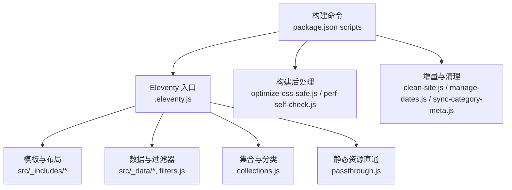
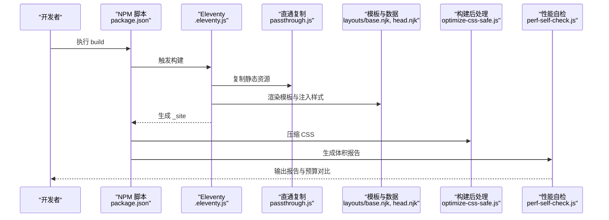
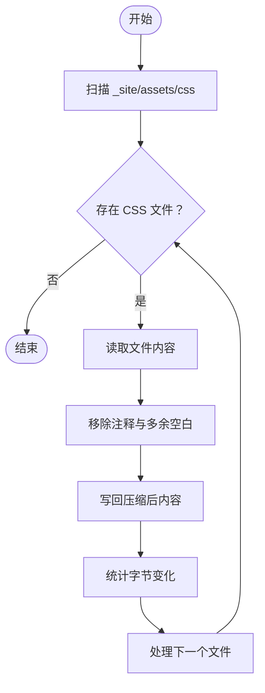
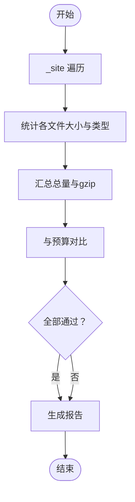
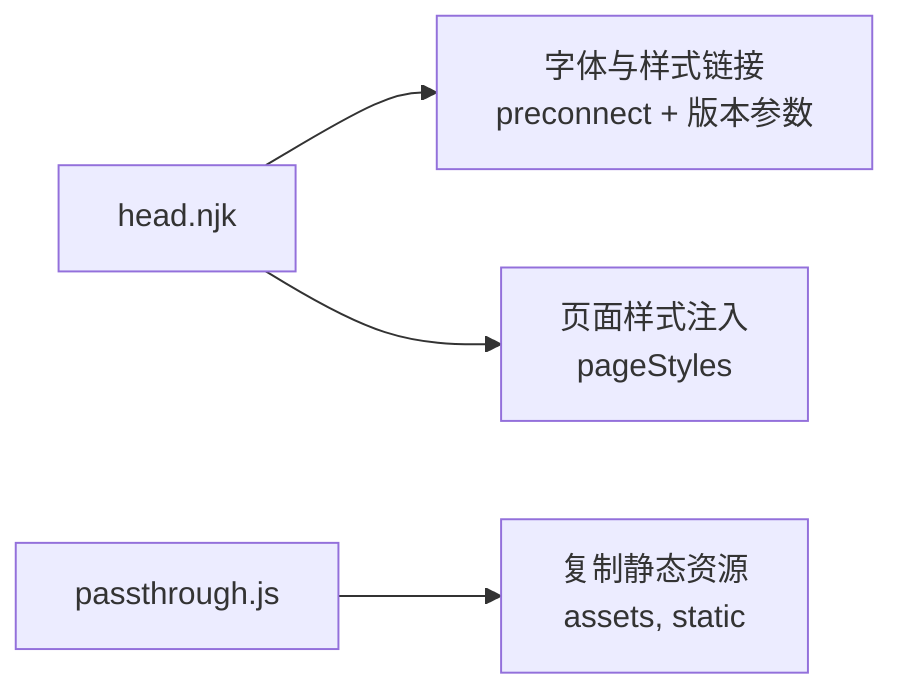
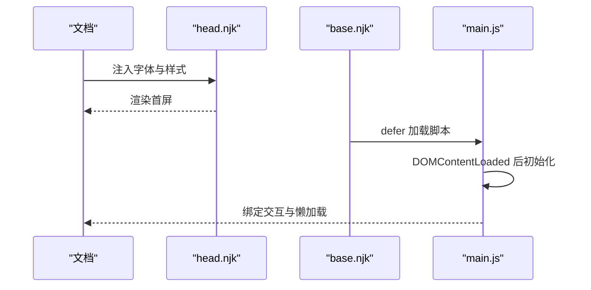
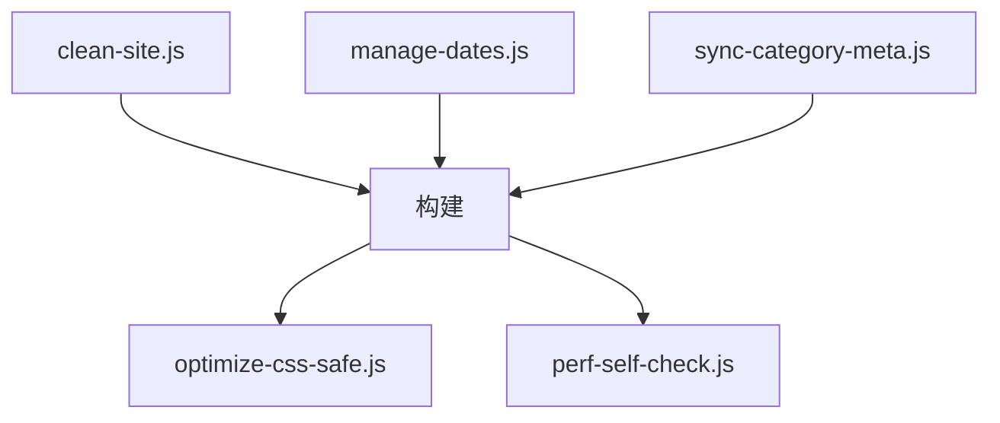
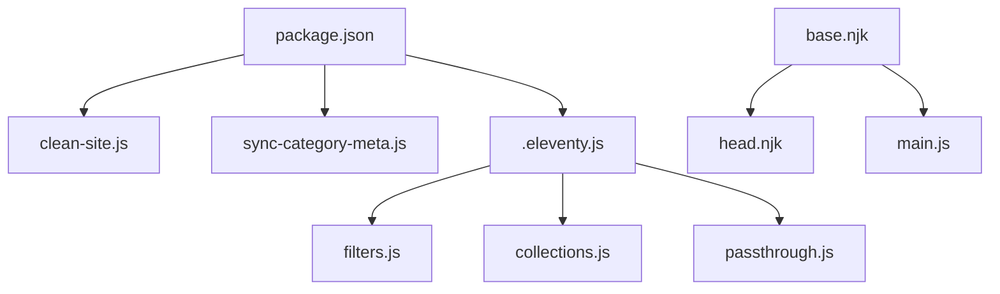

# 性能优化技巧

<cite>
**本文引用的文件**
- [.eleventy.js](file://.eleventy.js)
- [package.json](file://package.json)
- [scripts/optimize-css-safe.js](file://scripts/optimize-css-safe.js)
- [scripts/perf-self-check.js](file://scripts/perf-self-check.js)
- [scripts/clean-site.js](file://scripts/clean-site.js)
- [scripts/manage-dates.js](file://scripts/manage-dates.js)
- [scripts/sync-category-meta.js](file://scripts/sync-category-meta.js)
- [eleventy/config/passthrough.js](file://eleventy/config/passthrough.js)
- [eleventy/config/filters.js](file://eleventy/config/filters.js)
- [eleventy/config/collections.js](file://eleventy/config/collections.js)
- [src/_includes/layouts/base.njk](file://src/_includes/layouts/base.njk)
- [src/_includes/partials/head.njk](file://src/_includes/partials/head.njk)
- [src/assets/js/main.js](file://src/assets/js/main.js)
- [src/_data/siteConfig.js](file://src/_data/siteConfig.js)
</cite>

## 目录
1. [引言](#引言)
2. [项目结构](#项目结构)
3. [核心组件](#核心组件)
4. [架构总览](#架构总览)
5. [详细组件分析](#详细组件分析)
6. [依赖关系分析](#依赖关系分析)
7. [性能考量](#性能考量)
8. [故障排查指南](#故障排查指南)
9. [结论](#结论)
10. [附录](#附录)

## 引言
本指南围绕静态站点（Eleventy）的性能优化展开，结合仓库中已实现的脚本与配置，系统讲解以下主题：
- 构建期优化：CSS 压缩、资源体积预算检查、增量构建与清理策略
- 运行期优化：关键渲染路径、懒加载与预加载、主题切换与样式加载策略
- 监控与度量：构建产物体积与单文件大小预算、gzip 体积评估
- 实战案例：如何在功能丰富与加载速度之间取得平衡

## 项目结构
该项目采用 Eleventy 的标准目录组织，关键性能相关点如下：
- 构建入口与全局配置：.eleventy.js
- 构建脚本与任务编排：package.json 中的 scripts
- 构建后处理：scripts/*.js（CSS 压缩、性能自检、日期与元数据同步）
- 资源复制与静态资源直通：eleventy/config/passthrough.js
- 模板与样式注入：src/_includes/layouts/base.njk、src/_includes/partials/head.njk
- 客户端交互与懒加载：src/assets/js/main.js
- 数据与过滤器：src/_data/siteConfig.js、eleventy/config/filters.js、eleventy/config/collections.js

图表来源
- [package.json:1-35](file://package.json#L1-L35)
- [.eleventy.js:36-181](file://.eleventy.js#L36-L181)
- [scripts/optimize-css-safe.js:1-112](file://scripts/optimize-css-safe.js#L1-L112)
- [scripts/perf-self-check.js:1-199](file://scripts/perf-self-check.js#L1-L199)
- [eleventy/config/passthrough.js:1-7](file://eleventy/config/passthrough.js#L1-L7)
- [eleventy/config/filters.js:1-43](file://eleventy/config/filters.js#L1-L43)
- [eleventy/config/collections.js:1-377](file://eleventy/config/collections.js#L1-L377)

章节来源
- [package.json:6-16](file://package.json#L6-L16)
- [.eleventy.js:36-181](file://.eleventy.js#L36-L181)

## 核心组件
- 构建与发布流程
  - 构建脚本在 package.json 中定义，包含清理、同步元数据、构建、CSS 压缩与性能自检。
  - 清理脚本用于删除输出目录，确保增量构建的干净环境。
- 构建后处理
  - CSS 压缩脚本扫描 _site 下的 CSS 文件，安全地去除注释并进行最小化，统计节省字节与百分比。
  - 性能自检脚本遍历 _site 目录，计算各类资源总大小与 gzip 大小，对比预算并生成报告。
- 资源直通与样式加载
  - passthroughPaths 将 src/assets 与 src/static 直接复制到输出目录，减少构建期转换开销。
  - head.njk 注入字体与样式表链接，并通过版本查询参数实现缓存失效控制。
- 客户端交互与懒加载
  - main.js 在 DOMContentLoaded 后初始化交互，使用被动事件监听优化滚动与 resize 性能；图片点击放大等交互按需初始化。

章节来源
- [package.json:6-16](file://package.json#L6-L16)
- [scripts/clean-site.js:1-11](file://scripts/clean-site.js#L1-L11)
- [scripts/optimize-css-safe.js:82-112](file://scripts/optimize-css-safe.js#L82-L112)
- [scripts/perf-self-check.js:50-126](file://scripts/perf-self-check.js#L50-L126)
- [eleventy/config/passthrough.js:1-7](file://eleventy/config/passthrough.js#L1-L7)
- [src/_includes/partials/head.njk:1-27](file://src/_includes/partials/head.njk#L1-L27)
- [src/assets/js/main.js:1-800](file://src/assets/js/main.js#L1-L800)

## 架构总览
下图展示了从构建到运行的关键路径与性能相关节点：

图表来源
- [package.json:6-16](file://package.json#L6-L16)
- [.eleventy.js:36-181](file://.eleventy.js#L36-L181)
- [eleventy/config/passthrough.js:1-7](file://eleventy/config/passthrough.js#L1-L7)
- [src/_includes/layouts/base.njk:1-20](file://src/_includes/layouts/base.njk#L1-L20)
- [src/_includes/partials/head.njk:1-27](file://src/_includes/partials/head.njk#L1-L27)
- [scripts/optimize-css-safe.js:82-112](file://scripts/optimize-css-safe.js#L82-L112)
- [scripts/perf-self-check.js:170-199](file://scripts/perf-self-check.js#L170-L199)

## 详细组件分析

### CSS 压缩与体积优化
- 实现机制
  - 遍历 _site/assets/css 下所有 CSS 文件，安全去除注释与多余空白，保留字符串内注释不误删。
  - 记录压缩前后字节数，计算节省总量与百分比，直接覆写文件。
- 性能收益
  - 显著降低 CSS 体积，减少首屏传输时间；配合版本查询参数可实现缓存失效与增量更新。
- 使用建议
  - 在 CI 中固定运行 CSS 压缩，确保每次构建产物一致。
  - 对于动态样式或按页面注入的样式，保持版本参数以触发浏览器缓存更新。

图表来源
- [scripts/optimize-css-safe.js:6-112](file://scripts/optimize-css-safe.js#L6-L112)

章节来源
- [scripts/optimize-css-safe.js:66-112](file://scripts/optimize-css-safe.js#L66-L112)

### 构建体积预算与自检报告
- 实现机制
  - 遍历 _site 目录，统计 HTML/CSS/JS/图片/字体等类型资源的原始大小与 gzip 大小。
  - 对比预算阈值（HTML/CSS/JS 总量与最大单文件），生成 Markdown 报告。
- 指标说明
  - Total HTML/CSS/JS size：各类型资源总大小
  - Largest single asset：最大单文件字节
  - gzip 大小：更贴近网络传输体积
- 使用建议
  - 将预算阈值纳入 CI，超过阈值即阻断合并或发出警告。
  - 结合报告定位“最大单文件”，针对性优化图片、字体或第三方资源。

图表来源
- [scripts/perf-self-check.js:17-126](file://scripts/perf-self-check.js#L17-L126)
- [scripts/perf-self-check.js:170-199](file://scripts/perf-self-check.js#L170-L199)

章节来源
- [scripts/perf-self-check.js:10-15](file://scripts/perf-self-check.js#L10-L15)
- [scripts/perf-self-check.js:50-126](file://scripts/perf-self-check.js#L50-L126)

### 资源直通与样式加载策略
- 资源直通
  - passthroughPaths 将 src/assets 与 src/static 直接复制到输出目录，避免构建期额外处理，提升构建速度。
- 样式加载
  - head.njk 注入字体与通用样式表，并为每个页面注入 pageStyles（如 post.css）。通过版本查询参数实现缓存失效控制。
- 优化建议
  - 将页面级样式拆分到 pageStyles，仅在需要的页面加载，减少首屏 CSS 体积。
  - 字体资源使用 preconnect 提升连接复用，避免阻塞关键路径。

图表来源
- [src/_includes/partials/head.njk:1-27](file://src/_includes/partials/head.njk#L1-L27)
- [eleventy/config/passthrough.js:1-7](file://eleventy/config/passthrough.js#L1-L7)
- [.eleventy.js:152-156](file://.eleventy.js#L152-L156)

章节来源
- [src/_includes/partials/head.njk:5-26](file://src/_includes/partials/head.njk#L5-L26)
- [eleventy/config/passthrough.js:1-7](file://eleventy/config/passthrough.js#L1-L7)
- [.eleventy.js:152-156](file://.eleventy.js#L152-L156)

### 关键渲染路径优化与懒加载
- 关键路径
  - 通过 head.njk 注入必要的样式与字体，避免 FOUC（Flash of Unstyled Content）。
  - 主题切换逻辑在 DOMContentLoaded 前设置 data-theme，避免闪烁。
- 懒加载与交互
  - main.js 在 DOMContentLoaded 后初始化交互，使用 passive 事件监听优化滚动与 resize。
  - 图片点击放大等交互按需初始化，避免不必要的 DOM 查询与事件绑定。
- 优化建议
  - 将非关键 CSS 延迟加载或拆分为独立文件，仅在需要时注入。
  - 图片懒加载与骨架屏结合，提升感知性能。

图表来源
- [src/_includes/partials/head.njk:1-27](file://src/_includes/partials/head.njk#L1-L27)
- [src/_includes/layouts/base.njk:15-17](file://src/_includes/layouts/base.njk#L15-L17)
- [src/assets/js/main.js:1-800](file://src/assets/js/main.js#L1-L800)

章节来源
- [src/_includes/layouts/base.njk:6-17](file://src/_includes/layouts/base.njk#L6-L17)
- [src/assets/js/main.js:1-800](file://src/assets/js/main.js#L1-L800)

### 增量构建与清理策略
- 清理
  - clean-site.js 删除 _site 目录，确保构建产物干净，避免历史文件残留影响体积与缓存。
- 增量
  - manage-dates.js 仅在文件修改显著时更新 updated 字段，减少不必要的写入。
  - sync-category-meta.js 仅在发现新增分类或子分类时更新描述文件，避免全量重写。
- 建议
  - 在 CI 中先执行 clean-site，再执行构建与后处理，保证一致性。
  - 将 manage-dates 与 sync-category-meta 作为 prebuild 步骤，确保数据稳定后再构建。

图表来源
- [scripts/clean-site.js:1-11](file://scripts/clean-site.js#L1-L11)
- [scripts/manage-dates.js:16-68](file://scripts/manage-dates.js#L16-L68)
- [scripts/sync-category-meta.js:36-205](file://scripts/sync-category-meta.js#L36-L205)
- [scripts/optimize-css-safe.js:82-112](file://scripts/optimize-css-safe.js#L82-L112)
- [scripts/perf-self-check.js:170-199](file://scripts/perf-self-check.js#L170-L199)

章节来源
- [scripts/clean-site.js:1-11](file://scripts/clean-site.js#L1-L11)
- [scripts/manage-dates.js:16-68](file://scripts/manage-dates.js#L16-L68)
- [scripts/sync-category-meta.js:36-205](file://scripts/sync-category-meta.js#L36-L205)

### 页面样式与主题切换
- 页面样式
  - eleventy 配置在 eleventyComputed 中为文章页注入 pageStyles，按页面维度控制样式加载。
- 主题切换
  - head.njk 中通过脚本在 DOMContentLoaded 前设置 data-theme，避免闪烁。
- 建议
  - 将页面级样式与全局样式分离，仅在需要的页面加载对应 CSS。
  - 使用版本参数控制缓存失效，避免主题切换后样式未更新。

章节来源
- [.eleventy.js:148-156](file://.eleventy.js#L148-L156)
- [src/_includes/partials/head.njk:11-21](file://src/_includes/partials/head.njk#L11-L21)

## 依赖关系分析
- 构建脚本依赖
  - package.json 的 build 串联 clean、sync-meta、eleventy、optimize-css-safe、perf-self-check。
- Eleventy 配置依赖
  - .eleventy.js 依赖 filters、collections、passthrough 配置，以及 Markdown 库。
- 客户端依赖
  - base.njk 依赖 head.njk 注入样式与脚本，main.js 在 defer 模式下加载。

图表来源
- [package.json:6-16](file://package.json#L6-L16)
- [.eleventy.js:36-181](file://.eleventy.js#L36-L181)
- [eleventy/config/filters.js:1-43](file://eleventy/config/filters.js#L1-L43)
- [eleventy/config/collections.js:1-377](file://eleventy/config/collections.js#L1-L377)
- [eleventy/config/passthrough.js:1-7](file://eleventy/config/passthrough.js#L1-L7)
- [src/_includes/layouts/base.njk:1-20](file://src/_includes/layouts/base.njk#L1-L20)
- [src/_includes/partials/head.njk:1-27](file://src/_includes/partials/head.njk#L1-L27)
- [src/assets/js/main.js:1-800](file://src/assets/js/main.js#L1-L800)

章节来源
- [package.json:6-16](file://package.json#L6-L16)
- [.eleventy.js:36-181](file://.eleventy.js#L36-L181)

## 性能考量
- 构建期
  - 使用 passthrough 直通复制静态资源，减少构建转换成本。
  - 在 CI 中固定运行 CSS 压缩与性能自检，确保产物质量。
- 运行期
  - 首屏关键 CSS 与字体预连接，避免阻塞渲染。
  - 按需初始化交互，使用被动事件监听优化滚动性能。
- 缓存与版本控制
  - 样式与字体通过版本查询参数控制缓存失效，平衡更新与缓存命中。
- 预算与监控
  - 设定 HTML/CSS/JS 总量与最大单文件预算，结合 gzip 体积评估网络传输成本。

## 故障排查指南
- 构建后 CSS 未被压缩
  - 检查 _site/assets/css 是否存在；确认 optimize-css-safe.js 是否在 build 后执行。
- 性能自检失败
  - 确认 _site 目录存在且包含构建产物；检查预算阈值是否合理。
- 样式闪烁或主题不生效
  - 检查 head.njk 中的主题初始化脚本是否在 DOMContentLoaded 前执行。
- 资源未更新
  - 确认版本查询参数是否随内容变更；检查 passthrough 是否正确复制资源。

章节来源
- [scripts/optimize-css-safe.js:82-112](file://scripts/optimize-css-safe.js#L82-L112)
- [scripts/perf-self-check.js:170-199](file://scripts/perf-self-check.js#L170-L199)
- [src/_includes/partials/head.njk:11-21](file://src/_includes/partials/head.njk#L11-L21)
- [eleventy/config/passthrough.js:1-7](file://eleventy/config/passthrough.js#L1-L7)

## 结论
本项目在构建期与运行期均提供了完善的性能优化实践：通过直通复制与按页面样式注入减少首屏负担，通过 CSS 压缩与体积预算自检保障产物质量，通过主题初始化与被动事件监听优化用户体验。建议在现有基础上进一步引入图片与字体的自动压缩、关键资源的预加载策略，以及基于 Lighthouse 或 WebPageTest 的持续性能监控，以实现更全面的性能治理。

## 附录
- 实际优化案例
  - 将页面级样式拆分到 pageStyles，仅在文章页加载 post.css，减少首页 CSS 体积。
  - 为字体资源添加 preconnect，缩短 DNS 与握手时间。
  - 使用版本查询参数管理缓存失效，避免频繁更新导致缓存穿透。
- 代码示例路径
  - CSS 压缩实现：[scripts/optimize-css-safe.js:66-112](file://scripts/optimize-css-safe.js#L66-L112)
  - 性能自检报告生成：[scripts/perf-self-check.js:170-199](file://scripts/perf-self-check.js#L170-L199)
  - 样式注入与版本参数：[src/_includes/partials/head.njk:8-26](file://src/_includes/partials/head.njk#L8-L26)
  - 页面样式注入逻辑：[.eleventy.js:148-156](file://.eleventy.js#L148-L156)
  - 清理与增量脚本：[scripts/clean-site.js:1-11](file://scripts/clean-site.js#L1-L11)、[scripts/manage-dates.js:16-68](file://scripts/manage-dates.js#L16-L68)、[scripts/sync-category-meta.js:36-205](file://scripts/sync-category-meta.js#L36-L205)