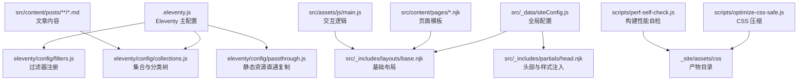
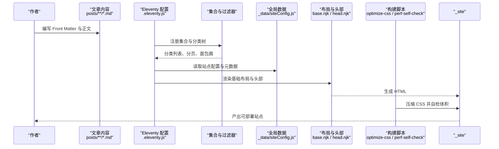
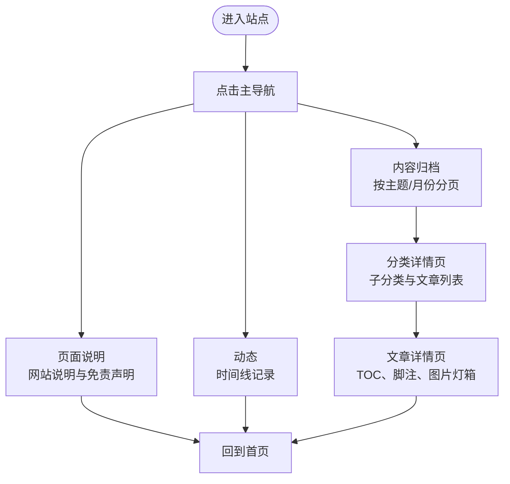
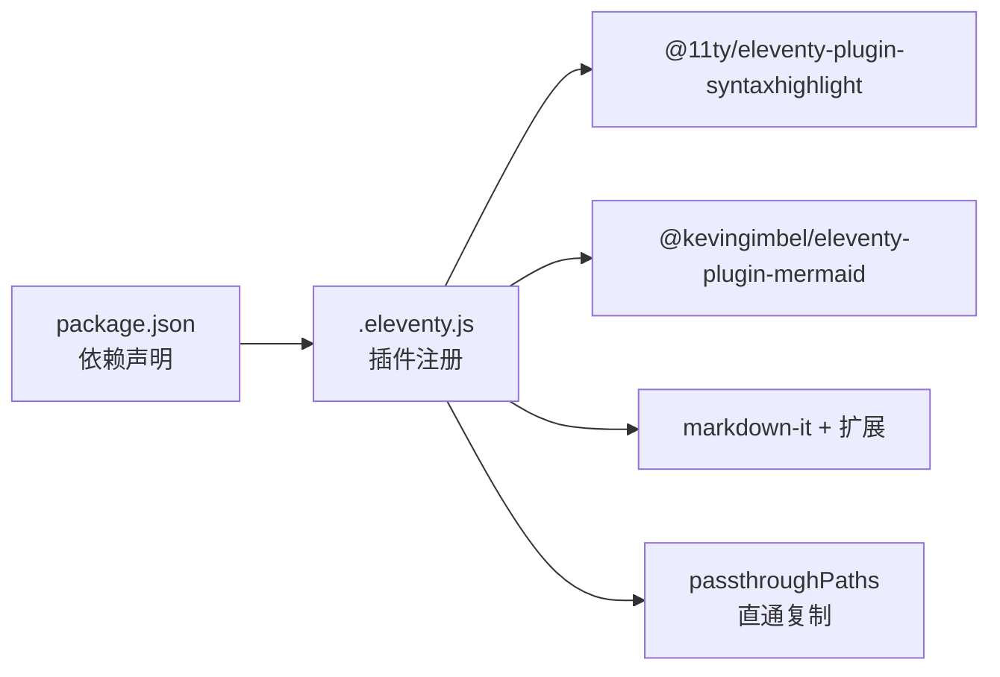
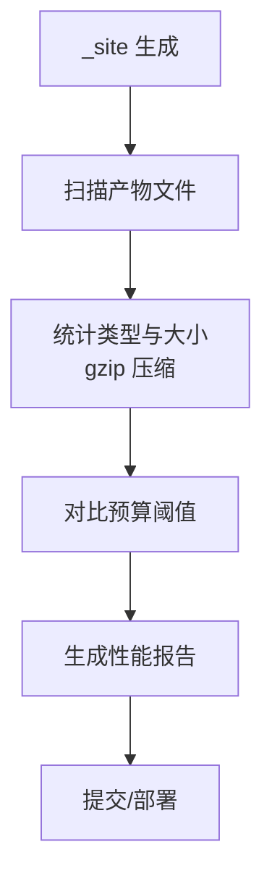

# 最佳实践与示例

<cite>
**本文引用的文件**
- [package.json](file://package.json)
- [.eleventy.js](file://.eleventy.js)
- [eleventy/config/filters.js](file://eleventy/config/filters.js)
- [eleventy/config/collections.js](file://eleventy/config/collections.js)
- [eleventy/config/passthrough.js](file://eleventy/config/passthrough.js)
- [src/_data/siteConfig.js](file://src/_data/siteConfig.js)
- [src/_data/moments.json](file://src/_data/moments.json)
- [src/_includes/layouts/base.njk](file://src/_includes/layouts/base.njk)
- [src/_includes/partials/head.njk](file://src/_includes/partials/head.njk)
- [src/content/pages/index.njk](file://src/content/pages/index.njk)
- [src/content/pages/moments.njk](file://src/content/pages/moments.njk)
- [src/content/settings/siteConfig.js](file://src/content/settings/siteConfig.js)
- [src/content/settings/categoryDescriptions.json](file://src/content/settings/categoryDescriptions.json)
- [src/assets/js/main.js](file://src/assets/js/main.js)
- [scripts/optimize-css-safe.js](file://scripts/optimize-css-safe.js)
- [scripts/perf-self-check.js](file://scripts/perf-self-check.js)
- [src/content/posts/建站需求篇/建站需求清单：估算更新频率@xfq.md](file://src/content/posts/建站需求篇/建站需求清单：估算更新频率@xfq.md)
- [src/content/posts/网站示例篇/案例一：前端开发者个人主页@alzs.md](file://src/content/posts/网站示例篇/案例一：前端开发者个人主页@alzs.md)
</cite>

## 目录
1. [简介](#简介)
2. [项目结构](#项目结构)
3. [核心组件](#核心组件)
4. [架构总览](#架构总览)
5. [组件详解](#组件详解)
6. [依赖关系分析](#依赖关系分析)
7. [性能优化](#性能优化)
8. [SEO 实用指南](#seo-实用指南)
9. [常见问题与故障排除](#常见问题与故障排除)
10. [实际案例与模板](#实际案例与模板)
11. [维护与更新最佳实践](#维护与更新最佳实践)
12. [团队协作与版本管理](#团队协作与版本管理)
13. [结论](#结论)

## 简介
本指南围绕 11ty RainyNight 演示站，系统总结个人网站搭建的最佳实践与实战案例，覆盖信息架构、导航策略、内容组织、性能优化、SEO、维护更新与团队协作等关键主题。通过仓库中的 Eleventy 配置、数据模型、页面模板与脚本工具，给出可复用的实现路径与检查清单，帮助你从零搭建并持续运营高质量的个人网站。

## 项目结构
项目采用“内容驱动 + 数据集中 + 构建脚本”的分层组织方式：
- 配置层：Eleventy 主配置与插件注册、过滤器、集合与直通复制
- 数据层：站点全局配置、分类元数据、动态时间线数据
- 模板层：Nunjucks 布局与局部组件，页面与文章模板
- 资源层：CSS 分层与按需加载、JS 交互逻辑
- 工具层：构建与性能自检、CSS 压缩、日期与标题过滤器

图表来源
- [.eleventy.js:36-181](file://.eleventy.js#L36-L181)
- [eleventy/config/filters.js:1-43](file://eleventy/config/filters.js#L1-L43)
- [eleventy/config/collections.js:219-371](file://eleventy/config/collections.js#L219-L371)
- [eleventy/config/passthrough.js:1-7](file://eleventy/config/passthrough.js#L1-L7)
- [src/_data/siteConfig.js:1-2](file://src/_data/siteConfig.js#L1-L2)
- [src/_includes/layouts/base.njk:1-20](file://src/_includes/layouts/base.njk#L1-L20)
- [src/_includes/partials/head.njk:1-27](file://src/_includes/partials/head.njk#L1-L27)
- [src/assets/js/main.js:1-800](file://src/assets/js/main.js#L1-L800)
- [scripts/optimize-css-safe.js:1-112](file://scripts/optimize-css-safe.js#L1-L112)
- [scripts/perf-self-check.js:1-199](file://scripts/perf-self-check.js#L1-L199)

章节来源
- [.eleventy.js:36-181](file://.eleventy.js#L36-L181)
- [eleventy/config/passthrough.js:1-7](file://eleventy/config/passthrough.js#L1-L7)

## 核心组件
- Eleventy 主配置与插件：注册语法高亮、Mermaid 图表、Markdown 扩展、直通复制与全局数据计算
- 过滤器：日期格式化、标题拼接、归档月份标签
- 集合与分类：基于目录层级与 Front Matter 的分类树、子分类元数据、分页与面包屑
- 页面与布局：基础布局、头部注入、主题切换、按页样式加载
- 动态时间线：JSON 驱动的动态页面，支持文本、图片、链接、视频等多形态
- 构建与性能：CSS 压缩与体积预算自检，确保产物体积可控

章节来源
- [.eleventy.js:36-181](file://.eleventy.js#L36-L181)
- [eleventy/config/filters.js:1-43](file://eleventy/config/filters.js#L1-L43)
- [eleventy/config/collections.js:219-371](file://eleventy/config/collections.js#L219-L371)
- [src/_includes/layouts/base.njk:1-20](file://src/_includes/layouts/base.njk#L1-L20)
- [src/_includes/partials/head.njk:1-27](file://src/_includes/partials/head.njk#L1-L27)
- [src/content/pages/moments.njk:1-80](file://src/content/pages/moments.njk#L1-L80)
- [scripts/optimize-css-safe.js:1-112](file://scripts/optimize-css-safe.js#L1-L112)
- [scripts/perf-self-check.js:1-199](file://scripts/perf-self-check.js#L1-L199)

## 架构总览
下图展示了从内容到产出的关键流程：内容文件经由集合与过滤器加工，结合全局数据与布局模板生成最终页面；构建脚本在生产阶段执行 CSS 压缩与体积自检，保证性能与质量。

图表来源
- [.eleventy.js:36-181](file://.eleventy.js#L36-L181)
- [eleventy/config/collections.js:219-371](file://eleventy/config/collections.js#L219-L371)
- [src/_data/siteConfig.js:1-2](file://src/_data/siteConfig.js#L1-L2)
- [src/_includes/layouts/base.njk:1-20](file://src/_includes/layouts/base.njk#L1-L20)
- [src/_includes/partials/head.njk:1-27](file://src/_includes/partials/head.njk#L1-L27)
- [scripts/optimize-css-safe.js:1-112](file://scripts/optimize-css-safe.js#L1-L112)
- [scripts/perf-self-check.js:1-199](file://scripts/perf-self-check.js#L1-L199)

## 组件详解

### 信息架构与导航策略
- 分类与子分类：通过目录层级与 Front Matter 的 category/subcategory 字段，构建分类树与子分类元数据，支持多级归档与详情页
- 归档与分页：按分类与月份归档，支持分页与面包屑导航，便于用户快速定位内容
- 导航与入口：站点导航集中于全局配置，首页提供核心入口（内容归档、页面说明），动态页作为内容补充

图表来源
- [src/content/settings/siteConfig.js:10-25](file://src/content/settings/siteConfig.js#L10-L25)
- [eleventy/config/collections.js:253-316](file://eleventy/config/collections.js#L253-L316)
- [src/content/pages/moments.njk:1-80](file://src/content/pages/moments.njk#L1-L80)

章节来源
- [src/content/settings/siteConfig.js:10-25](file://src/content/settings/siteConfig.js#L10-L25)
- [eleventy/config/collections.js:253-316](file://eleventy/config/collections.js#L253-L316)

### 内容组织最佳实践
- 文章命名与校验：要求文章文件名包含“标题@分类标识.md”，并在构建时进行校验，避免歧义
- 自动化字段：未显式设置时，自动生成标题、子分类、布局、永久链接、发布时间、更新时间、标签与页面样式
- 分类元数据：通过 JSON 配置子分类名称与描述，支持多语言与本地化文案

章节来源
- [.eleventy.js:56-157](file://.eleventy.js#L56-L157)
- [src/content/settings/categoryDescriptions.json:1-60](file://src/content/settings/categoryDescriptions.json#L1-L60)

### 页面与布局
- 基础布局：统一注入头部、页脚、Mermaid 脚本与主题初始化逻辑
- 头部组件：按页注入样式表与页面级样式数组，支持按需加载
- 主题切换：根据配置与本地存储初始化主题，保障一致性

章节来源
- [src/_includes/layouts/base.njk:1-20](file://src/_includes/layouts/base.njk#L1-L20)
- [src/_includes/partials/head.njk:1-27](file://src/_includes/partials/head.njk#L1-L27)
- [src/_data/siteConfig.js:36-38](file://src/_data/siteConfig.js#L36-L38)

### 动态时间线页面
- 数据驱动：以 JSON 提供日期分组与条目列表，支持文本、图片、链接、视频等形态
- 懒加载与无障碍：图片懒加载、可访问性标签与键盘操作
- 响应式布局：移动端与桌面端的卡片与时间轴样式

章节来源
- [src/_data/moments.json:1-123](file://src/_data/moments.json#L1-L123)
- [src/content/pages/moments.njk:1-80](file://src/content/pages/moments.njk#L1-L80)

### 文章详情页交互
- 目录与滚动激活：根据标题生成 TOC，滚动时激活当前段落
- 脚注预览与跳转：悬浮预览脚注内容，点击平滑跳转
- 图片灯箱：点击图片打开灯箱，支持缩放、拖拽与键盘快捷键

章节来源
- [src/assets/js/main.js:81-278](file://src/assets/js/main.js#L81-L278)
- [src/assets/js/main.js:280-494](file://src/assets/js/main.js#L280-L494)
- [src/assets/js/main.js:496-792](file://src/assets/js/main.js#L496-L792)

## 依赖关系分析
- Eleventy 插件：语法高亮、Mermaid 图表、Markdown 扩展（脚注、GitHub Alerts）
- Markdown 渲染：启用 HTML、换行与链接识别，增强文章可读性
- 直通复制：静态资源与字体目录直通输出，减少构建复杂度

图表来源
- [package.json:22-33](file://package.json#L22-L33)
- [.eleventy.js:47-54](file://.eleventy.js#L47-L54)
- [eleventy/config/passthrough.js:1-7](file://eleventy/config/passthrough.js#L1-L7)

章节来源
- [package.json:22-33](file://package.json#L22-L33)
- [.eleventy.js:47-54](file://.eleventy.js#L47-L54)

## 性能优化
- CSS 压缩：构建后扫描 _site/assets/css，去除注释与多余空白，统计压缩前后字节
- 体积预算：对 HTML/CSS/JS 总体大小与最大单文件进行预算检查，生成报告
- 体积自检：遍历构建产物，统计各类别文件大小、最大文件与 gzip 后体积

图表来源
- [scripts/optimize-css-safe.js:82-112](file://scripts/optimize-css-safe.js#L82-L112)
- [scripts/perf-self-check.js:50-126](file://scripts/perf-self-check.js#L50-L126)
- [scripts/perf-self-check.js:170-199](file://scripts/perf-self-check.js#L170-L199)

章节来源
- [scripts/optimize-css-safe.js:1-112](file://scripts/optimize-css-safe.js#L1-L112)
- [scripts/perf-self-check.js:1-199](file://scripts/perf-self-check.js#L1-L199)

## SEO 实用指南
- 标题与描述：通过过滤器统一拼接标题，避免重复；页面描述与站点描述保持一致
- 结构化语义：使用语义化标签与头部注入，确保搜索引擎可读
- 永久链接：文章永久链接按 slug 生成，利于长期可访问性
- 归档与索引：分类与月份归档页面便于爬虫抓取与用户浏览

章节来源
- [eleventy/config/filters.js:32-40](file://eleventy/config/filters.js#L32-L40)
- [src/_includes/partials/head.njk:3-4](file://src/_includes/partials/head.njk#L3-L4)
- [.eleventy.js:102-111](file://.eleventy.js#L102-L111)
- [eleventy/config/collections.js:253-316](file://eleventy/config/collections.js#L253-L316)

## 常见问题与故障排除
- 文章文件名格式错误：构建时报错提示必须包含“@”符号，修正为“标题@分类标识.md”
- 缺失 slug：若未设置 slug 或为占位符，将回退到文件名生成的 fileSlug
- 更新时间判定：当文件修改时间与发布日期差异超过阈值时，才视为更新
- 构建体积超限：检查 CSS/JS/HTML 总量与最大单文件，必要时精简样式或拆分脚本

章节来源
- [.eleventy.js:56-72](file://.eleventy.js#L56-L72)
- [.eleventy.js:102-135](file://.eleventy.js#L102-L135)
- [scripts/perf-self-check.js:10-15](file://scripts/perf-self-check.js#L10-L15)

## 实际案例与模板
- 个人主页案例：前端开发者主页，整合技能、项目与联系方式，突出可信度与转化入口
- 更新频率评估：帮助判断网站是“一次性交付”还是“持续更新”，影响页面结构与维护成本
- 页面说明：提供免责声明与使用须知，降低用户预期与法律风险
- 动态时间线：记录日常与学习，增强亲和力与真实性

章节来源
- [src/content/posts/网站示例篇/案例一：前端开发者个人主页@alzs.md:1-28](file://src/content/posts/网站示例篇/案例一：前端开发者个人主页@alzs.md#L1-L28)
- [src/content/posts/建站需求篇/建站需求清单：估算更新频率@xfq.md:1-28](file://src/content/posts/建站需求篇/建站需求清单：估算更新频率@xfq.md#L1-L28)
- [src/content/pages/moments.njk:1-80](file://src/content/pages/moments.njk#L1-L80)

## 维护与更新最佳实践
- 内容更新：遵循“先整理、后上线”的原则，确保信息架构清晰、导航直观
- 版本与分支：采用 feature 分支开发、develop 集成、master 发布的工作流
- 自动化：利用构建脚本与性能自检，确保每次变更符合体积与质量标准
- 用户反馈：通过动态时间线与页面说明收集用户关注点，持续优化表达与入口

章节来源
- [scripts/perf-self-check.js:170-199](file://scripts/perf-self-check.js#L170-L199)
- [src/content/pages/services.njk](file://src/content/pages/services.njk)

## 团队协作与版本管理
- 分工与职责：明确作者、设计与运维角色，统一内容命名与分类规范
- 协作流程：feature 分支开发，合并前进行自检与评审，避免破坏性变更
- 部署与回滚：使用自动化构建与版本化资源，出现问题可快速回滚

章节来源
- [package.json:6-16](file://package.json#L6-L16)
- [scripts/perf-self-check.js:170-199](file://scripts/perf-self-check.js#L170-L199)

## 结论
RainyNight 演示站以 Eleventy 为核心，结合统一的数据模型、灵活的集合与分类、可扩展的页面模板与构建脚本，提供了个人网站从内容组织到性能优化的完整实践路径。通过本指南的案例与模板，你可以快速搭建并持续运营高质量的个人网站，同时建立团队协作与版本管理的标准化流程。