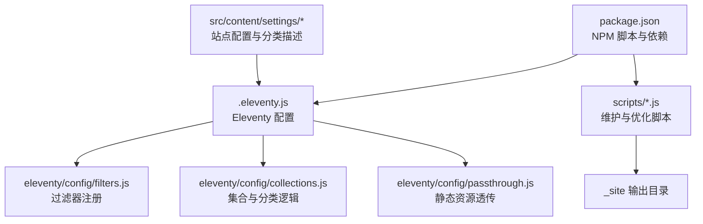
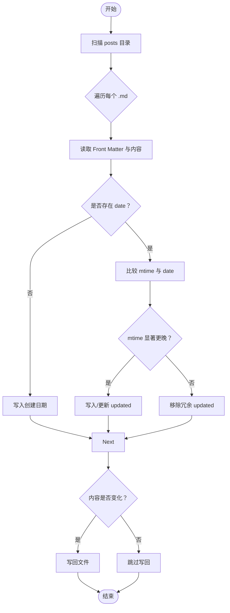
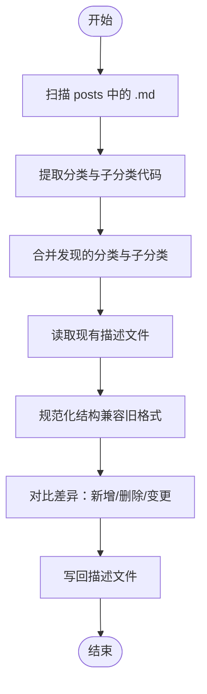
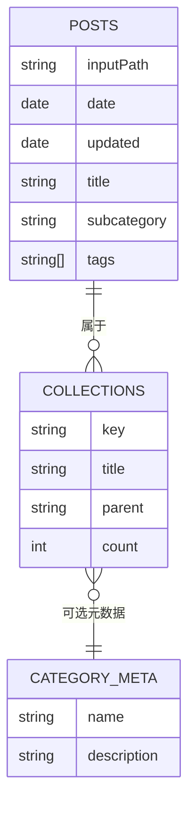
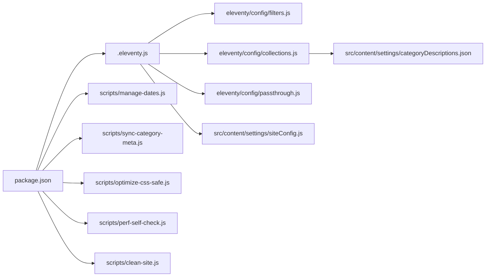

# 维护更新最佳实践

<cite>
**本文引用的文件**
- [package.json](file://package.json)
- [.eleventy.js](file://.eleventy.js)
- [scripts/clean-site.js](file://scripts/clean-site.js)
- [scripts/manage-dates.js](file://scripts/manage-dates.js)
- [scripts/optimize-css-safe.js](file://scripts/optimize-css-safe.js)
- [scripts/perf-self-check.js](file://scripts/perf-self-check.js)
- [scripts/sync-category-meta.js](file://scripts/sync-category-meta.js)
- [scripts/manage-categories.js](file://scripts/manage-categories.js)
- [eleventy/config/filters.js](file://eleventy/config/filters.js)
- [eleventy/config/collections.js](file://eleventy/config/collections.js)
- [eleventy/config/passthrough.js](file://eleventy/config/passthrough.js)
- [src/_data/siteConfig.js](file://src/_data/siteConfig.js)
- [src/content/settings/siteConfig.js](file://src/content/settings/siteConfig.js)
- [src/content/settings/categoryDescriptions.json](file://src/content/settings/categoryDescriptions.json)
- [.gitignore](file://.gitignore)
</cite>

## 目录
1. [简介](#简介)
2. [项目结构](#项目结构)
3. [核心组件](#核心组件)
4. [架构总览](#架构总览)
5. [详细组件分析](#详细组件分析)
6. [依赖关系分析](#依赖关系分析)
7. [性能考量](#性能考量)
8. [故障排查指南](#故障排查指南)
9. [结论](#结论)
10. [附录](#附录)

## 简介
本指南围绕个人网站的日常维护与持续更新，结合仓库中的构建脚本、Eleventy 配置与内容组织方式，系统性地给出内容更新、功能维护、性能监控、版本管理与协作开发、内容生命周期管理、自动化脚本使用与扩展等最佳实践。目标是帮助维护者建立可重复、可审计、可持续的网站运营流程。

## 项目结构
该项目采用 Eleventy 静态站点生成器，内容以 Markdown 文档为主，配合自定义脚本完成日期同步、分类元数据同步、CSS 压缩与性能自检。构建流程通过 NPM 脚本编排，输出至 _site 目录。



图表来源
- [package.json:1-35](file://package.json#L1-L35)
- [.eleventy.js:12-147](file://.eleventy.js#L12-L147)
- [eleventy/config/filters.js:1-49](file://eleventy/config/filters.js#L1-L49)
- [eleventy/config/collections.js:1-377](file://eleventy/config/collections.js#L1-L377)
- [eleventy/config/passthrough.js:1-7](file://eleventy/config/passthrough.js#L1-L7)

章节来源
- [package.json:1-35](file://package.json#L1-L35)
- [.eleventy.js:12-147](file://.eleventy.js#L12-L147)

## 核心组件
- 构建与脚本编排：通过 NPM scripts 统一入口，串联清理、同步、构建、优化与性能检查。
- Eleventy 配置：插件注册、Markdown 库、全局数据计算、集合与过滤器。
- 维护脚本：日期同步、分类元数据同步、CSS 压缩、性能自检、站点清理。
- 配置与数据：站点全局配置、分类描述、页面与导航配置。

章节来源
- [package.json:6-16](file://package.json#L6-L16)
- [.eleventy.js:12-147](file://.eleventy.js#L12-L147)
- [scripts/manage-dates.js:1-85](file://scripts/manage-dates.js#L1-L85)
- [scripts/sync-category-meta.js:1-205](file://scripts/sync-category-meta.js#L1-L205)
- [scripts/optimize-css-safe.js:1-112](file://scripts/optimize-css-safe.js#L1-L112)
- [scripts/perf-self-check.js:1-199](file://scripts/perf-self-check.js#L1-L199)
- [scripts/clean-site.js:1-11](file://scripts/clean-site.js#L1-L11)
- [src/_data/siteConfig.js:1-2](file://src/_data/siteConfig.js#L1-L2)
- [src/content/settings/siteConfig.js:1-168](file://src/content/settings/siteConfig.js#L1-L168)
- [src/content/settings/categoryDescriptions.json:1-60](file://src/content/settings/categoryDescriptions.json#L1-L60)

## 架构总览
下图展示了从内容变更到构建产出的关键流程，以及各脚本在流程中的职责与调用顺序。

```mermaid
sequenceDiagram
participant Dev as "维护者"
participant NPM as "NPM 脚本"
participant Clean as "clean-site.js"
participant Dates as "manage-dates.js"
participant Sync as "sync-category-meta.js"
participant Eleventy as "Eleventy 构建"
participant Opt as "optimize-css-safe.js"
participant Perf as "perf-self-check.js"
Dev->>NPM : 执行构建命令
NPM->>Clean : 清理 _site
NPM->>Dates : 同步文章日期
NPM->>Sync : 同步分类元数据
NPM->>Eleventy : 生成静态站点
Eleventy-->>Opt : 产出 CSS 文件
Opt->>Opt : 压缩 CSS安全去注释
Opt-->>Perf : 产出最终 _site
Perf->>Perf : 性能自检大小预算、最大单文件
Perf-->>Dev : 输出报告
```

图表来源
- [package.json:6-16](file://package.json#L6-L16)
- [scripts/clean-site.js:1-11](file://scripts/clean-site.js#L1-L11)
- [scripts/manage-dates.js:1-85](file://scripts/manage-dates.js#L1-L85)
- [scripts/sync-category-meta.js:1-205](file://scripts/sync-category-meta.js#L1-L205)
- [scripts/optimize-css-safe.js:1-112](file://scripts/optimize-css-safe.js#L1-L112)
- [scripts/perf-self-check.js:1-199](file://scripts/perf-self-check.js#L1-L199)

## 详细组件分析

### 构建与脚本编排（NPM scripts）
- 清理站点：删除 _site 目录，确保构建干净。
- 预构建：更新文章日期（基于文件系统时间）。
- 构建：清理、同步分类元数据、Eleventy 生成、CSS 压缩、性能自检。
- 调试：开启 Eleventy 调试日志。
- 其他：CSS 压缩、性能检查、分类元数据同步、日期更新。

章节来源
- [package.json:6-16](file://package.json#L6-L16)

### Eleventy 配置与全局数据
- 插件与库：语法高亮、Mermaid、Markdown-it（脚注、GitHub Alerts）。
- 透传复制：将 src/assets 与 src/static 直接复制到输出目录。
- 过滤器：日期格式化、标题格式化、编码过滤器。
- 全局数据计算：自动推断文章标题、子分类、布局、发布时间、更新时间、标签、页面样式等；并进行文章文件名格式校验。
- Markdown 配置：启用 HTML、换行、链接识别。

章节来源
- [.eleventy.js:12-147](file://.eleventy.js#L12-L147)
- [eleventy/config/filters.js:1-49](file://eleventy/config/filters.js#L1-L49)
- [eleventy/config/passthrough.js:1-7](file://eleventy/config/passthrough.js#L1-L7)

### 内容与分类体系
- 分类层级：支持多级分类，子分类由文件名中的“@”后缀提取。
- 分类元数据：通过 categoryDescriptions.json 维护分类与子分类的描述信息，集合与页面渲染时读取并规范化。
- 页面与导航：通过 siteConfig.js 集中管理品牌、导航、页脚、元信息、分页参数与页面文案。

章节来源
- [.eleventy.js:32-48](file://.eleventy.js#L32-L48)
- [eleventy/config/collections.js:24-371](file://eleventy/config/collections.js#L24-L371)
- [src/content/settings/categoryDescriptions.json:1-60](file://src/content/settings/categoryDescriptions.json#L1-L60)
- [src/content/settings/siteConfig.js:1-168](file://src/content/settings/siteConfig.js#L1-L168)

### 维护脚本详解

#### 日期同步（manage-dates.js）
- 自动为未设置日期的文章补充创建日期（基于文件创建时间）。
- 若修改时间显著晚于发布日期，则更新“updated”字段；否则移除冗余更新时间。
- 仅在内容确有变化时写回文件，避免无意义提交。



图表来源
- [scripts/manage-dates.js:16-68](file://scripts/manage-dates.js#L16-L68)

章节来源
- [scripts/manage-dates.js:1-85](file://scripts/manage-dates.js#L1-L85)

#### 分类元数据同步（sync-category-meta.js）
- 扫描 posts 下所有 .md，提取顶层分类与子分类代码（从文件名“@”后缀）。
- 与 categoryDescriptions.json 对比，自动新增/删除分类与子分类条目，保留默认描述。
- 支持对旧格式进行规范化（如移除旧字段），并提示编辑描述文件。



图表来源
- [scripts/sync-category-meta.js:36-204](file://scripts/sync-category-meta.js#L36-L204)

章节来源
- [scripts/sync-category-meta.js:1-205](file://scripts/sync-category-meta.js#L1-L205)

#### 分类管理工具（manage-categories.js）
- 列出现有分类及其数量。
- 重命名分类（含子分类路径）并同步描述元数据。
- 删除分类（移除 Front Matter 中的分类字段）。
- 设置/更新分类描述元数据。

章节来源
- [scripts/manage-categories.js:1-212](file://scripts/manage-categories.js#L1-L212)

#### CSS 压缩（optimize-css-safe.js）
- 安全压缩：去除块注释但保留字符串内注释，避免破坏字体或图片数据。
- 统计压缩前后字节与节省比例，覆盖 _site/assets/css 下所有 CSS 文件。

章节来源
- [scripts/optimize-css-safe.js:1-112](file://scripts/optimize-css-safe.js#L1-L112)

#### 性能自检（perf-self-check.js）
- 遍历 _site，统计 HTML/CSS/JS/图片/字体等类型大小与 gzip 大小。
- 校验总大小与最大单文件是否超过预算阈值，输出 Markdown 报告。

章节来源
- [scripts/perf-self-check.js:1-199](file://scripts/perf-self-check.js#L1-L199)

#### 站点清理（clean-site.js）
- 删除 _site 目录，确保构建干净。

章节来源
- [scripts/clean-site.js:1-11](file://scripts/clean-site.js#L1-L11)

### 数据模型与页面渲染
下图展示分类与子分类在集合与页面中的组织方式，以及元数据的加载与应用。



图表来源
- [eleventy/config/collections.js:145-217](file://eleventy/config/collections.js#L145-L217)
- [src/content/settings/categoryDescriptions.json:1-60](file://src/content/settings/categoryDescriptions.json#L1-L60)

## 依赖关系分析
- NPM 脚本驱动构建链路，串联多个维护脚本。
- Eleventy 配置依赖过滤器、集合与透传路径。
- 维护脚本依赖内容目录结构与配置文件（Front Matter、分类描述）。



图表来源
- [package.json:6-16](file://package.json#L6-L16)
- [.eleventy.js:12-147](file://.eleventy.js#L12-L147)
- [scripts/manage-dates.js:1-85](file://scripts/manage-dates.js#L1-L85)
- [scripts/sync-category-meta.js:1-205](file://scripts/sync-category-meta.js#L1-L205)
- [scripts/optimize-css-safe.js:1-112](file://scripts/optimize-css-safe.js#L1-L112)
- [scripts/perf-self-check.js:1-199](file://scripts/perf-self-check.js#L1-L199)
- [scripts/clean-site.js:1-11](file://scripts/clean-site.js#L1-L11)
- [eleventy/config/filters.js:1-49](file://eleventy/config/filters.js#L1-L49)
- [eleventy/config/collections.js:1-377](file://eleventy/config/collections.js#L1-L377)
- [eleventy/config/passthrough.js:1-7](file://eleventy/config/passthrough.js#L1-L7)
- [src/content/settings/categoryDescriptions.json:1-60](file://src/content/settings/categoryDescriptions.json#L1-L60)
- [src/content/settings/siteConfig.js:1-168](file://src/content/settings/siteConfig.js#L1-L168)

## 性能考量
- 构建后自动进行性能自检，涵盖 HTML/CSS/JS 总量与最大单文件大小，便于及时发现回归。
- CSS 压缩在保证可用性的前提下减少体积，提升加载速度。
- 建议定期运行性能自检，将报告纳入发布检查项。

章节来源
- [scripts/perf-self-check.js:10-126](file://scripts/perf-self-check.js#L10-L126)
- [scripts/optimize-css-safe.js:66-109](file://scripts/optimize-css-safe.js#L66-L109)

## 故障排查指南
- 构建失败或输出为空
  - 确认已执行清理脚本或删除 _site 后重新构建。
  - 检查 Eleventy 配置与输入/输出目录映射。
- 文章未显示或排序异常
  - 检查文章 Front Matter 是否包含有效日期与标题。
  - 确认文件名包含“@”分隔符且子分类代码正确。
- 分类缺失或描述不生效
  - 运行分类元数据同步脚本，确保 categoryDescriptions.json 与实际内容一致。
  - 使用分类管理工具进行重命名或删除操作。
- 性能自检告警
  - 检查最大单文件是否超限，定位大体积资源并优化。
  - 关注 CSS/JS 压缩是否成功，必要时手动清理缓存后重试。

章节来源
- [scripts/clean-site.js:6-10](file://scripts/clean-site.js#L6-L10)
- [.eleventy.js:32-48](file://.eleventy.js#L32-L48)
- [scripts/sync-category-meta.js:36-204](file://scripts/sync-category-meta.js#L36-L204)
- [scripts/perf-self-check.js:170-199](file://scripts/perf-self-check.js#L170-L199)

## 结论
通过 NPM 脚本编排与 Eleventy 配置，本项目实现了从内容到构建的自动化与标准化。维护脚本覆盖了日期同步、分类元数据、CSS 压缩与性能自检等关键环节。建议将上述流程固化为团队规范，配合版本管理与协作规范，保障网站长期健康运营。

## 附录

### 日常维护任务清单
- 内容更新
  - 新增/修改文章后，运行日期同步脚本，确保 Front Matter 日期准确。
  - 更新分类后，运行分类元数据同步脚本，保持描述文件与内容一致。
- 功能维护
  - 构建前清理 _site，避免历史残留影响。
  - 构建后运行性能自检，关注总量与单文件阈值。
- 性能监控
  - 定期运行性能自检，记录报告并跟踪趋势。
  - 对超限资源进行优化（压缩、懒加载、CDN 等）。

章节来源
- [scripts/manage-dates.js:1-85](file://scripts/manage-dates.js#L1-L85)
- [scripts/sync-category-meta.js:1-205](file://scripts/sync-category-meta.js#L1-L205)
- [scripts/perf-self-check.js:1-199](file://scripts/perf-self-check.js#L1-L199)
- [scripts/clean-site.js:1-11](file://scripts/clean-site.js#L1-L11)

### 版本管理与协作规范
- 提交前
  - 运行预构建脚本（自动更新日期、同步分类元数据）。
  - 运行性能自检，修正超限问题。
- 分支与合并
  - 功能分支命名清晰，合并前确保本地构建通过。
  - 大文件与资源变更需在 PR 中说明优化措施。
- 发布与回滚
  - 发布前在测试环境验证构建产物与性能报告。
  - 回滚策略：基于 Git 标签与构建产物备份。

章节来源
- [package.json:6-16](file://package.json#L6-L16)
- [scripts/manage-dates.js:1-85](file://scripts/manage-dates.js#L1-L85)
- [scripts/sync-category-meta.js:1-205](file://scripts/sync-category-meta.js#L1-L205)
- [scripts/perf-self-check.js:1-199](file://scripts/perf-self-check.js#L1-L199)

### 内容生命周期管理
- 草稿处理
  - 使用未公开的 Front Matter 字段或临时目录隔离草稿。
  - 草稿完成后统一运行日期同步与分类元数据同步。
- 发布流程
  - 确认标题、日期、分类、标签、描述等信息完整。
  - 构建并运行性能自检，通过后再合并与发布。
- 归档策略
  - 对历史内容进行归档与描述更新，保持分类元数据一致性。
  - 使用集合与页面导航引导访问，避免首页过长。

章节来源
- [eleventy/config/collections.js:253-316](file://eleventy/config/collections.js#L253-L316)
- [src/content/settings/siteConfig.js:111-163](file://src/content/settings/siteConfig.js#L111-L163)

### 自动化脚本使用与扩展
- 使用方式
  - 通过 NPM 脚本统一调用，或直接运行对应脚本。
  - 扩展脚本遵循“只在内容变化时写回”的原则，避免产生无效提交。
- 自定义脚本开发建议
  - 明确输入/输出目录与文件类型。
  - 添加日志与错误处理，便于排查。
  - 与现有构建流程集成，作为 prebuild/build/perf 阶段的一部分。

章节来源
- [package.json:6-16](file://package.json#L6-L16)
- [scripts/manage-dates.js:1-85](file://scripts/manage-dates.js#L1-L85)
- [scripts/sync-category-meta.js:1-205](file://scripts/sync-category-meta.js#L1-L205)
- [scripts/optimize-css-safe.js:1-112](file://scripts/optimize-css-safe.js#L1-L112)
- [scripts/perf-self-check.js:1-199](file://scripts/perf-self-check.js#L1-L199)

### 更新日志模板
- 版本：vYYYYMMDD
- 主要变更
  - 内容更新：新增/修订文章数量、涉及分类
  - 功能优化：脚本改进、构建流程优化
  - 性能指标：总大小、gzip 大小、最大单文件
- 问题修复：列出修复的问题与影响范围
- 待办事项：后续优化计划与回归风险