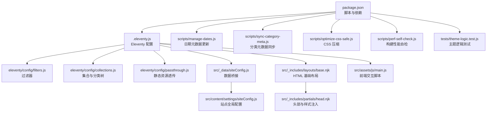
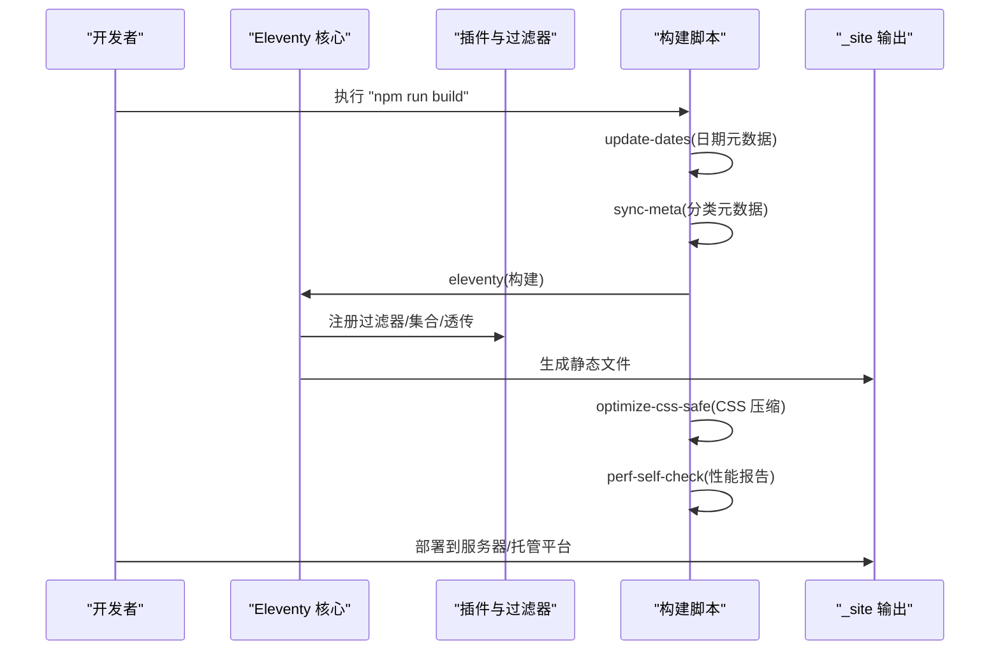
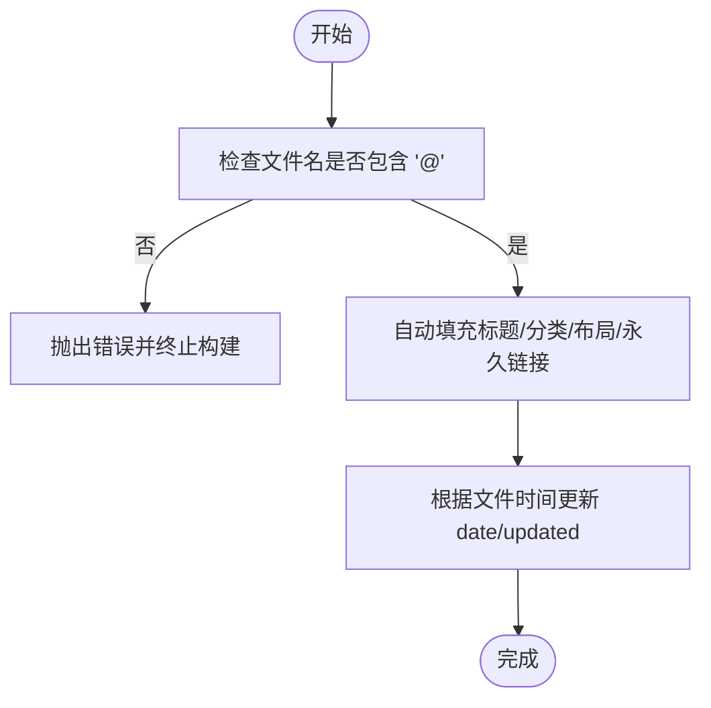
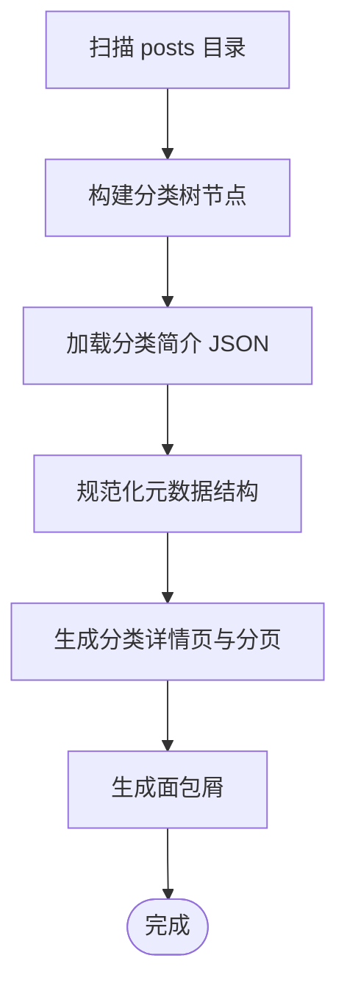
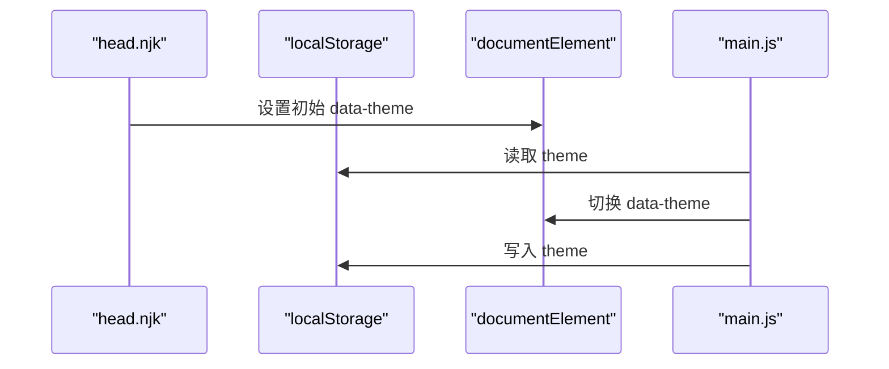
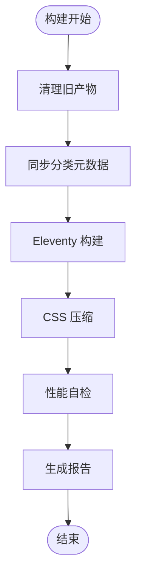
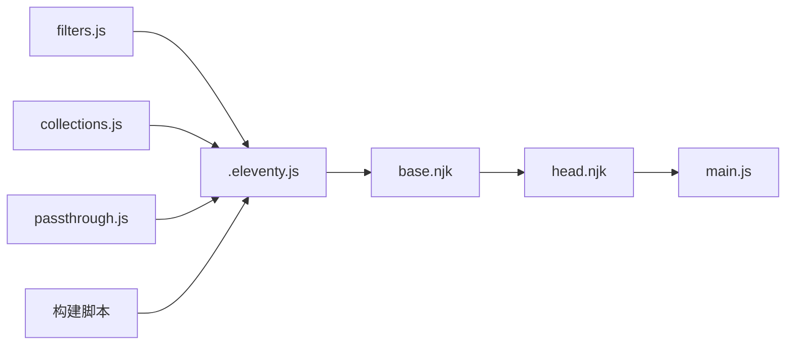

# 问题诊断与解决方案

<cite>
**本文引用的文件**
- [package.json](file://package.json)
- [.eleventy.js](file://.eleventy.js)
- [README.md](file://README.md)
- [docs/本地写作与构建指南.md](file://docs/本地写作与构建指南.md)
- [src/_data/siteConfig.js](file://src/_data/siteConfig.js)
- [src/content/settings/siteConfig.js](file://src/content/settings/siteConfig.js)
- [eleventy/config/filters.js](file://eleventy/config/filters.js)
- [eleventy/config/collections.js](file://eleventy/config/collections.js)
- [eleventy/config/passthrough.js](file://eleventy/config/passthrough.js)
- [src/_includes/layouts/base.njk](file://src/_includes/layouts/base.njk)
- [src/_includes/partials/head.njk](file://src/_includes/partials/head.njk)
- [src/assets/js/main.js](file://src/assets/js/main.js)
- [scripts/manage-dates.js](file://scripts/manage-dates.js)
- [scripts/sync-category-meta.js](file://scripts/sync-category-meta.js)
- [scripts/optimize-css-safe.js](file://scripts/optimize-css-safe.js)
- [scripts/perf-self-check.js](file://scripts/perf-self-check.js)
- [tests/theme-logic.test.js](file://tests/theme-logic.test.js)
</cite>

## 目录
1. [引言](#引言)
2. [项目结构](#项目结构)
3. [核心组件](#核心组件)
4. [架构总览](#架构总览)
5. [详细组件分析](#详细组件分析)
6. [依赖关系分析](#依赖关系分析)
7. [性能考量](#性能考量)
8. [故障排除指南](#故障排除指南)
9. [结论](#结论)
10. [附录](#附录)

## 引言
本指南聚焦于个人网站（基于 Eleventy 的内容站模板）在搭建与维护过程中的常见问题与系统化诊断方法。内容覆盖构建错误、样式冲突、功能异常、主题切换逻辑、分类与元数据同步、性能自检与优化、测试策略与质量保障等。文档提供可操作的排查步骤、错误信息解读、修复建议与实际案例，帮助开发者快速定位并解决问题。

## 项目结构
该项目采用“约定优于配置”的结构，核心目录与职责如下：
- src/content/posts：文章内容，按分类子目录组织，文件名需满足“标题@分类ID.md”约定。
- src/content/settings：站点配置与分类简介等全局设置。
- src/_includes：Nunjucks 模板布局与片段。
- src/assets：样式与脚本资源。
- scripts：构建期自动化脚本（日期更新、分类元数据同步、CSS 优化、性能自检）。
- eleventy/config：Eleventy 插件注册、过滤器、集合与透传路径配置。
- tests：前端主题逻辑的单元测试。

**图表来源**
- [package.json:1-35](file://package.json#L1-L35)
- [.eleventy.js:12-154](file://.eleventy.js#L12-L154)
- [eleventy/config/filters.js:1-49](file://eleventy/config/filters.js#L1-L49)
- [eleventy/config/collections.js:1-377](file://eleventy/config/collections.js#L1-L377)
- [eleventy/config/passthrough.js:1-7](file://eleventy/config/passthrough.js#L1-L7)
- [src/_data/siteConfig.js:1-2](file://src/_data/siteConfig.js#L1-L2)
- [src/content/settings/siteConfig.js:1-168](file://src/content/settings/siteConfig.js#L1-L168)
- [src/_includes/layouts/base.njk:1-20](file://src/_includes/layouts/base.njk#L1-L20)
- [src/_includes/partials/head.njk:1-27](file://src/_includes/partials/head.njk#L1-L27)
- [src/assets/js/main.js:1-800](file://src/assets/js/main.js#L1-L800)
- [scripts/manage-dates.js:1-85](file://scripts/manage-dates.js#L1-L85)
- [scripts/sync-category-meta.js:1-205](file://scripts/sync-category-meta.js#L1-L205)
- [scripts/optimize-css-safe.js:1-112](file://scripts/optimize-css-safe.js#L1-L112)
- [scripts/perf-self-check.js:1-199](file://scripts/perf-self-check.js#L1-L199)
- [tests/theme-logic.test.js:1-97](file://tests/theme-logic.test.js#L1-L97)

**章节来源**
- [README.md:1-137](file://README.md#L1-L137)
- [docs/本地写作与构建指南.md:1-98](file://docs/本地写作与构建指南.md#L1-L98)

## 核心组件
- Eleventy 配置与插件：注册语法高亮、Mermaid、Markdown 库，设置输入/输出目录，注册过滤器与集合，启用透传复制。
- 数据层：通过 _data 桥接 src/content/settings 中的站点配置，供模板渲染使用。
- 主题与样式：head 片段注入默认主题逻辑与页面级样式表，基础布局负责引入脚本与 Mermaid 资源。
- 前端脚本：提供文章页目录、脚注预览与跳转、图片灯箱、导航可见性等交互能力。
- 构建脚本：日期更新、分类元数据同步、CSS 压缩、性能自检，形成一键式生产构建流水线。
- 测试：主题逻辑的单元测试，模拟浏览器环境验证默认/持久化/切换行为。

**章节来源**
- [.eleventy.js:12-154](file://.eleventy.js#L12-L154)
- [src/_data/siteConfig.js:1-2](file://src/_data/siteConfig.js#L1-L2)
- [src/content/settings/siteConfig.js:1-168](file://src/content/settings/siteConfig.js#L1-L168)
- [src/_includes/partials/head.njk:1-27](file://src/_includes/partials/head.njk#L1-L27)
- [src/assets/js/main.js:1-800](file://src/assets/js/main.js#L1-L800)
- [scripts/manage-dates.js:1-85](file://scripts/manage-dates.js#L1-L85)
- [scripts/sync-category-meta.js:1-205](file://scripts/sync-category-meta.js#L1-L205)
- [scripts/optimize-css-safe.js:1-112](file://scripts/optimize-css-safe.js#L1-L112)
- [scripts/perf-self-check.js:1-199](file://scripts/perf-self-check.js#L1-L199)
- [tests/theme-logic.test.js:1-97](file://tests/theme-logic.test.js#L1-L97)

## 架构总览
下图展示了从内容到构建再到运行时的关键流转：

**图表来源**
- [package.json:6-16](file://package.json#L6-L16)
- [.eleventy.js:12-154](file://.eleventy.js#L12-L154)
- [scripts/manage-dates.js:1-85](file://scripts/manage-dates.js#L1-L85)
- [scripts/sync-category-meta.js:1-205](file://scripts/sync-category-meta.js#L1-L205)
- [scripts/optimize-css-safe.js:1-112](file://scripts/optimize-css-safe.js#L1-L112)
- [scripts/perf-self-check.js:1-199](file://scripts/perf-self-check.js#L1-L199)

## 详细组件分析

### 组件A：文章命名与元数据自动化
- 约定：文件名必须包含“@”，格式为“标题@分类ID.md”，否则构建阶段会抛出错误。
- 自动字段：title、date、updated、layout、permalink、tags、bodyClass、pageStyles 等。
- 更新策略：根据文件创建/修改时间自动写入或清理 updated 字段。

**图表来源**
- [.eleventy.js:30-46](file://.eleventy.js#L30-L46)
- [.eleventy.js:49-130](file://.eleventy.js#L49-L130)
- [scripts/manage-dates.js:16-68](file://scripts/manage-dates.js#L16-L68)

**章节来源**
- [.eleventy.js:30-46](file://.eleventy.js#L30-L46)
- [.eleventy.js:49-130](file://.eleventy.js#L49-L130)
- [scripts/manage-dates.js:1-85](file://scripts/manage-dates.js#L1-L85)

### 组件B：分类与集合（categoriesList/categoryPages）
- 支持多级分类与子分类，读取分类简介 JSON 并构建分类树节点。
- 对分类详情页进行分页与面包屑生成，支持自定义排序字段。
- 若分类简介文件缺失或格式异常，会回退并告警。

**图表来源**
- [eleventy/config/collections.js:123-143](file://eleventy/config/collections.js#L123-L143)
- [eleventy/config/collections.js:145-217](file://eleventy/config/collections.js#L145-L217)
- [eleventy/config/collections.js:253-316](file://eleventy/config/collections.js#L253-L316)

**章节来源**
- [eleventy/config/collections.js:1-377](file://eleventy/config/collections.js#L1-L377)
- [scripts/sync-category-meta.js:1-205](file://scripts/sync-category-meta.js#L1-L205)

### 组件C：主题切换与样式注入
- 默认主题由站点配置决定，若未保存则按默认值初始化。
- 通过 localStorage 持久化用户选择，切换时更新根元素的 data-theme 属性。
- 页面级样式通过 pageStyles 注入，确保文章页加载必要样式。

**图表来源**
- [src/_includes/partials/head.njk:11-21](file://src/_includes/partials/head.njk#L11-L21)
- [src/assets/js/main.js:74-83](file://src/assets/js/main.js#L74-L83)
- [tests/theme-logic.test.js:28-95](file://tests/theme-logic.test.js#L28-L95)

**章节来源**
- [src/_includes/partials/head.njk:1-27](file://src/_includes/partials/head.njk#L1-L27)
- [src/assets/js/main.js:1-800](file://src/assets/js/main.js#L1-L800)
- [tests/theme-logic.test.js:1-97](file://tests/theme-logic.test.js#L1-L97)

### 组件D：构建与性能自检
- 构建顺序：清理旧产物 -> 同步元数据 -> Eleventy 构建 -> CSS 压缩 -> 性能自检。
- 性能自检统计 HTML/CSS/JS 总大小、最大单文件、Top 10 最大文件，并输出 Markdown 报告。

**图表来源**
- [package.json:6-16](file://package.json#L6-L16)
- [scripts/optimize-css-safe.js:82-112](file://scripts/optimize-css-safe.js#L82-L112)
- [scripts/perf-self-check.js:170-199](file://scripts/perf-self-check.js#L170-L199)

**章节来源**
- [package.json:1-35](file://package.json#L1-L35)
- [scripts/optimize-css-safe.js:1-112](file://scripts/optimize-css-safe.js#L1-L112)
- [scripts/perf-self-check.js:1-199](file://scripts/perf-self-check.js#L1-L199)

## 依赖关系分析
- Eleventy 配置依赖过滤器、集合与透传路径；过滤器依赖 luxon 与 slug 编码工具；集合依赖站点配置与分类简介 JSON。
- 构建脚本相互配合：日期更新与分类元数据同步在 Eleventy 之前执行，CSS 压缩与性能自检在构建之后执行。
- 前端脚本依赖基础布局与头部片段提供的样式与脚本入口。

**图表来源**
- [eleventy/config/filters.js:1-49](file://eleventy/config/filters.js#L1-L49)
- [eleventy/config/collections.js:1-377](file://eleventy/config/collections.js#L1-L377)
- [eleventy/config/passthrough.js:1-7](file://eleventy/config/passthrough.js#L1-L7)
- [.eleventy.js:12-154](file://.eleventy.js#L12-L154)
- [src/_includes/layouts/base.njk:1-20](file://src/_includes/layouts/base.njk#L1-L20)
- [src/_includes/partials/head.njk:1-27](file://src/_includes/partials/head.njk#L1-L27)
- [src/assets/js/main.js:1-800](file://src/assets/js/main.js#L1-L800)

**章节来源**
- [.eleventy.js:12-154](file://.eleventy.js#L12-L154)

## 性能考量
- 资源体积预算：HTML/CSS/JS 总体积与最大单文件大小有预算阈值，超限会触发警告。
- 压缩策略：CSS 压缩在构建后执行，移除注释与多余空白，减少体积。
- 自检报告：输出各类型资源总量、gzip 后大小与 Top 10 最大文件，便于定位瓶颈。

**章节来源**
- [scripts/perf-self-check.js:10-126](file://scripts/perf-self-check.js#L10-L126)
- [scripts/perf-self-check.js:128-168](file://scripts/perf-self-check.js#L128-L168)
- [scripts/optimize-css-safe.js:66-76](file://scripts/optimize-css-safe.js#L66-L76)

## 故障排除指南

### 1. 构建报错：文章文件名不符合约定
- 症状：构建阶段抛出“文章文件名格式错误”错误。
- 原因：文件名缺少“@”或格式不正确。
- 排查步骤：
  - 检查 src/content/posts 下目标文章的文件名是否包含“@”。
  - 确认“@”前为标题，“@”后为分类ID。
- 修复建议：按“标题@分类ID.md”格式重命名文件，或在 front-matter 中显式提供 title 与 category。

**章节来源**
- [.eleventy.js:30-46](file://.eleventy.js#L30-L46)

### 2. 文章日期异常（未更新/冗余字段）
- 症状：文章列表中更新时间未变化或出现冗余 updated 字段。
- 原因：文件修改时间与发布日期差距小于最小更新间隔，或未显著修改。
- 排查步骤：
  - 查看 manage-dates 脚本日志，确认是否写入/删除 updated 字段。
  - 检查文件最近修改时间与 front-matter 中 date/updated。
- 修复建议：确保对文章内容进行实质性修改后再构建，或手动清理冗余 updated 字段。

**章节来源**
- [scripts/manage-dates.js:16-68](file://scripts/manage-dates.js#L16-L68)

### 3. 分类页面缺失或样式异常
- 症状：分类详情页为空、分页不生效或样式缺失。
- 原因：分类简介 JSON 未生成或格式异常；页面级样式未注入。
- 排查步骤：
  - 执行 npm run sync-meta，确认生成 src/content/settings/categoryDescriptions.json。
  - 检查 head.njk 是否注入 pageStyles，确认文章页 computed 的 pageStyles 数组。
- 修复建议：补充分类简介 description；确保文章页 computed 的 pageStyles 正常返回。

**章节来源**
- [scripts/sync-category-meta.js:1-205](file://scripts/sync-category-meta.js#L1-L205)
- [.eleventy.js:121-130](file://.eleventy.js#L121-L130)
- [src/_includes/partials/head.njk:22-26](file://src/_includes/partials/head.njk#L22-L26)

### 4. 主题切换无效或默认主题不符
- 症状：刷新后主题恢复默认，或初始主题与预期不符。
- 原因：localStorage 中未保存 theme，或站点配置默认值与 head 初始化逻辑不一致。
- 排查步骤：
  - 在浏览器控制台检查 localStorage 中的 theme 值。
  - 检查 head.njk 中默认主题的计算逻辑。
- 修复建议：确保站点配置 theme.default 有效；在切换后写入 localStorage。

**章节来源**
- [src/_includes/partials/head.njk:11-21](file://src/_includes/partials/head.njk#L11-L21)
- [src/assets/js/main.js:74-83](file://src/assets/js/main.js#L74-L83)
- [tests/theme-logic.test.js:28-95](file://tests/theme-logic.test.js#L28-L95)

### 5. 图片灯箱/目录/脚注功能异常
- 症状：点击图片无反应、目录不显示、脚注预览不出现。
- 原因：DOM 结构缺失、事件监听未绑定、滚动/尺寸变更未触发更新。
- 排查步骤：
  - 检查文章页是否包含相应容器（如 .post-content、.post-toc-desktop）。
  - 确认 main.js 中对应初始化函数已调用且未提前返回。
- 修复建议：确保模板结构与脚本期望一致；在窗口 resize/scroll 时重新计算布局。

**章节来源**
- [src/assets/js/main.js:496-792](file://src/assets/js/main.js#L496-L792)
- [src/assets/js/main.js:81-278](file://src/assets/js/main.js#L81-L278)
- [src/assets/js/main.js:280-494](file://src/assets/js/main.js#L280-L494)

### 6. 构建失败或输出目录为空
- 症状：构建后 _site 不存在或为空。
- 原因：构建脚本未执行或 Eleventy 抛错中断。
- 排查步骤：
  - 检查 package.json 中 build 脚本顺序。
  - 查看 perf-self-check 是否提示缺少输出目录。
- 修复建议：先执行 npm run clean:site，再执行 npm run build；确保 Eleventy 成功生成静态文件。

**章节来源**
- [package.json:6-16](file://package.json#L6-L16)
- [scripts/perf-self-check.js:170-174](file://scripts/perf-self-check.js#L170-L174)

### 7. CSS 体积过大或加载缓慢
- 症状：页面加载慢、资源体积超预算。
- 原因：CSS 未压缩或存在冗余样式。
- 排查步骤：
  - 查看 perf-self-check 报告中的 CSS 总量与最大单文件。
  - 使用 optimize-css-safe 检查压缩日志。
- 修复建议：合并重复样式、移除未使用规则；确保构建流程执行 CSS 压缩。

**章节来源**
- [scripts/perf-self-check.js:10-126](file://scripts/perf-self-check.js#L10-L126)
- [scripts/optimize-css-safe.js:82-112](file://scripts/optimize-css-safe.js#L82-L112)

### 8. 开发预览无法热更新
- 症状：修改内容后浏览器未自动刷新。
- 原因：开发服务器未启动或端口占用。
- 排查步骤：
  - 确认 npm start 已执行且输出本地地址。
  - 检查端口占用情况。
- 修复建议：更换端口或关闭占用进程后重启开发服务器。

**章节来源**
- [README.md:93-99](file://README.md#L93-L99)

## 结论
本指南提供了从内容组织、构建流程、样式与脚本、到性能与测试的全链路问题诊断方法。遵循“约定优于配置”的文件命名与目录规范，结合自动化脚本与性能自检，可显著降低个人网站搭建过程中的不确定性与维护成本。建议在每次重大更新后运行构建与自检流程，并保留测试用例以保障关键交互逻辑的稳定性。

## 附录

### A. 常见错误信息与含义
- “文章文件名格式错误”：文件名未包含“@”或格式不正确。
- “Missing build output directory”：_site 目录不存在，通常是构建未完成或被清理。
- JSON 解析失败（分类简介）：categoryDescriptions.json 格式异常，脚本会回退并重建。

**章节来源**
- [.eleventy.js:30-46](file://.eleventy.js#L30-L46)
- [scripts/perf-self-check.js:170-174](file://scripts/perf-self-check.js#L170-L174)
- [scripts/sync-category-meta.js:100-106](file://scripts/sync-category-meta.js#L100-L106)

### B. 测试策略与质量保证
- 单元测试：主题逻辑测试覆盖默认主题、持久化偏好与切换行为。
- 手动测试：在不同设备与浏览器下验证主题切换、目录滚动、脚注预览、图片灯箱等交互。
- 集成测试：执行完整构建流程，检查 _site 输出完整性与性能报告。

**章节来源**
- [tests/theme-logic.test.js:1-97](file://tests/theme-logic.test.js#L1-L97)
- [README.md:101-116](file://README.md#L101-L116)