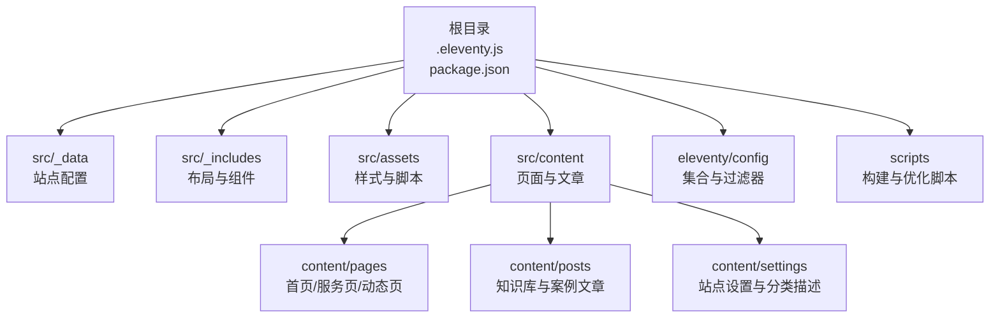
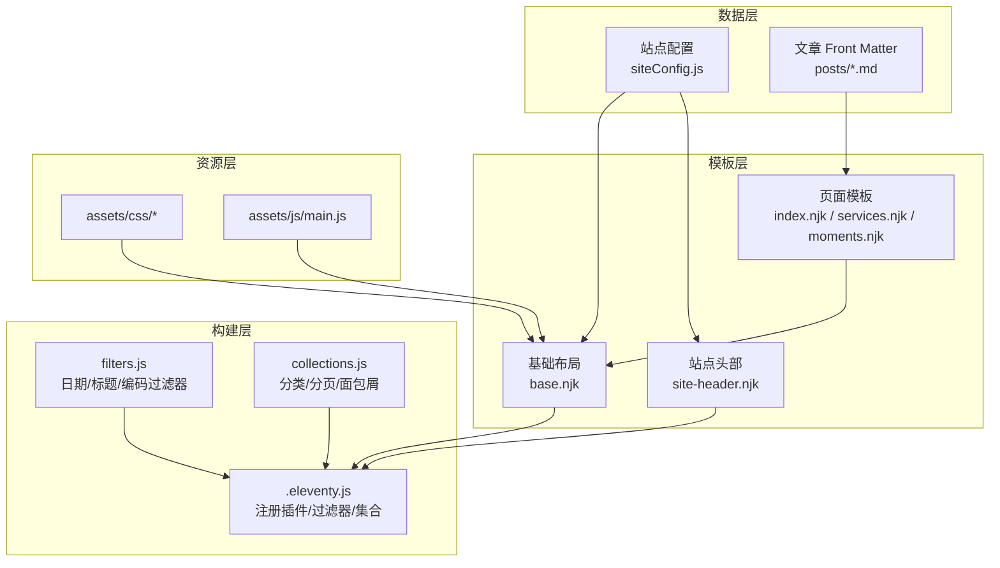
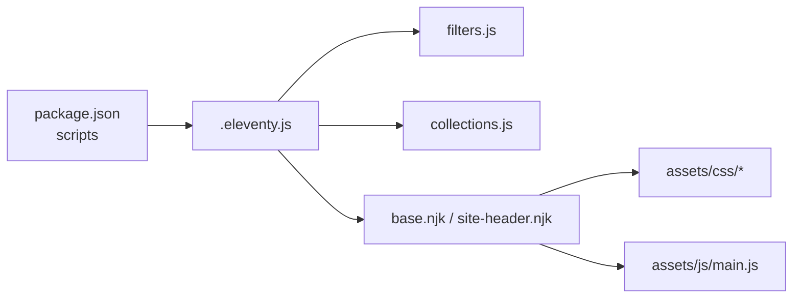

# 项目实战案例

<cite>
**本文引用的文件**
- [package.json](file://package.json)
- [.eleventy.js](file://.eleventy.js)
- [src/_data/siteConfig.js](file://src/_data/siteConfig.js)
- [src/content/settings/siteConfig.js](file://src/content/settings/siteConfig.js)
- [src/_includes/layouts/base.njk](file://src/_includes/layouts/base.njk)
- [src/_includes/partials/site-header.njk](file://src/_includes/partials/site-header.njk)
- [src/assets/js/main.js](file://src/assets/js/main.js)
- [eleventy/config/collections.js](file://eleventy/config/collections.js)
- [eleventy/config/filters.js](file://eleventy/config/filters.js)
- [src/content/pages/index.njk](file://src/content/pages/index.njk)
- [src/content/pages/services.njk](file://src/content/pages/services.njk)
- [src/content/pages/moments.njk](file://src/content/pages/moments.njk)
- [src/content/posts/网站示例篇/案例一：前端开发者个人主页@alzs.md](file://src/content/posts/网站示例篇/案例一：前端开发者个人主页@alzs.md)
- [src/content/posts/网站示例篇/案例二：留学顾问个人预约站@alzs.md](file://src/content/posts/网站示例篇/案例二：留学顾问个人预约站@alzs.md)
- [src/content/posts/网站示例篇/案例三：摄影师个人作品集@alzs.md](file://src/content/posts/网站示例篇/案例三：摄影师个人作品集@alzs.md)
- [src/content/posts/网站示例篇/案例四：插画师个人展示站@alzs.md](file://src/content/posts/网站示例篇/案例四：插画师个人展示站@alzs.md)
- [src/content/posts/网站示例篇/案例五：求职简历展示站@alzs.md](file://src/content/posts/网站示例篇/案例五：求职简历展示站@alzs.md)
- [src/content/posts/项目速览/演示案例 01：前端开发者个人主页@xs.md](file://src/content/posts/项目速览/演示案例 01：前端开发者个人主页@xs.md)
</cite>

## 目录
1. [引言](#引言)
2. [项目结构](#项目结构)
3. [核心组件](#核心组件)
4. [架构总览](#架构总览)
5. [详细组件分析](#详细组件分析)
6. [依赖关系分析](#依赖关系分析)
7. [性能考量](#性能考量)
8. [故障排查指南](#故障排查指南)
9. [结论](#结论)
10. [附录](#附录)

## 引言
本项目是一个以“个人网站搭建”为主题的知识型演示站，采用 11ty（Eleventy）静态站点生成器构建，提供从需求分析到上线部署的完整流程示例，并配套 20 个不同角色的实战案例页面（如前端开发者、独立设计师、摄影师、留学顾问、插画师等）。项目通过统一的站点配置、可复用的布局与组件、Markdown 文章与 Nunjucks 模板相结合的方式，形成一套可直接套用的模板与最佳实践。

## 项目结构
项目采用典型的 11ty 结构，核心目录与职责如下：
- src：站点源文件，包含数据、模板、样式与内容
  - _data：全局数据（如站点配置）
  - _includes：布局与局部组件（如头部、底部、基础布局）
  - assets：静态资源（CSS、JS）
  - content：页面与文章内容（pages、posts、settings、search）
- eleventy：构建期配置（collections、filters、passthrough）
- scripts：构建与优化脚本（清理、日期同步、CSS 优化、性能自检）
- 根目录：构建配置与依赖（.eleventy.js、package.json）

图表来源
- [.eleventy.js:147-155](file://.eleventy.js#L147-L155)
- [src/_data/siteConfig.js:1-2](file://src/_data/siteConfig.js#L1-L2)
- [src/content/settings/siteConfig.js:1-168](file://src/content/settings/siteConfig.js#L1-L168)
- [src/_includes/layouts/base.njk:1-20](file://src/_includes/layouts/base.njk#L1-L20)
- [src/_includes/partials/site-header.njk:1-44](file://src/_includes/partials/site-header.njk#L1-L44)
- [src/assets/js/main.js:1-800](file://src/assets/js/main.js#L1-L800)
- [eleventy/config/collections.js:1-377](file://eleventy/config/collections.js#L1-L377)
- [eleventy/config/filters.js:1-49](file://eleventy/config/filters.js#L1-L49)

章节来源
- [.eleventy.js:147-155](file://.eleventy.js#L147-L155)
- [package.json:1-35](file://package.json#L1-L35)

## 核心组件
- 站点配置中心：集中管理品牌、导航、页脚、元信息、主题、分页与页面文案
- 构建配置：注册 Markdown 渲染、语法高亮、Mermaid 图表、集合与过滤器
- 页面与布局：基础布局与头部/底部组件，统一注入样式与脚本
- 内容集合：基于文章目录结构自动构建分类、子分类与分页
- 前端交互：文章目录、脚注预览、图片灯箱、回到顶部与导航可见性控制

章节来源
- [src/content/settings/siteConfig.js:1-168](file://src/content/settings/siteConfig.js#L1-L168)
- [.eleventy.js:12-31](file://.eleventy.js#L12-L31)
- [src/_includes/layouts/base.njk:1-20](file://src/_includes/layouts/base.njk#L1-L20)
- [src/_includes/partials/site-header.njk:1-44](file://src/_includes/partials/site-header.njk#L1-L44)
- [eleventy/config/collections.js:219-371](file://eleventy/config/collections.js#L219-L371)
- [src/assets/js/main.js:13-278](file://src/assets/js/main.js#L13-L278)

## 架构总览
系统采用“数据驱动 + 模板渲染 + 静态输出”的架构模式：
- 数据层：站点配置与文章 Front Matter 提供页面元数据
- 模板层：Nunjucks 布局与组件组合页面结构
- 构建层：Eleventy 处理 Markdown、注册过滤器与集合、生成静态文件
- 资源层：CSS 与 JS 在构建期处理与优化

图表来源
- [src/content/settings/siteConfig.js:1-168](file://src/content/settings/siteConfig.js#L1-L168)
- [src/_includes/layouts/base.njk:1-20](file://src/_includes/layouts/base.njk#L1-L20)
- [src/_includes/partials/site-header.njk:1-44](file://src/_includes/partials/site-header.njk#L1-L44)
- [src/content/pages/index.njk:1-94](file://src/content/pages/index.njk#L1-L94)
- [src/content/pages/services.njk:1-56](file://src/content/pages/services.njk#L1-L56)
- [src/content/pages/moments.njk:1-80](file://src/content/pages/moments.njk#L1-L80)
- [.eleventy.js:12-31](file://.eleventy.js#L12-L31)
- [eleventy/config/filters.js:1-49](file://eleventy/config/filters.js#L1-L49)
- [eleventy/config/collections.js:219-371](file://eleventy/config/collections.js#L219-L371)
- [src/assets/js/main.js:13-278](file://src/assets/js/main.js#L13-L278)

## 详细组件分析

### 站点配置与页面文案
- 站点配置集中于 settings/siteConfig.js，涵盖品牌、导航、页脚、元信息、主题与分页参数
- 页面模板通过 Nunjucks 读取配置，实现文案与结构的统一管理
- 示例页面：首页、服务说明页、动态页均通过 Front Matter 指定布局与样式

章节来源
- [src/content/settings/siteConfig.js:1-168](file://src/content/settings/siteConfig.js#L1-L168)
- [src/content/pages/index.njk:1-94](file://src/content/pages/index.njk#L1-L94)
- [src/content/pages/services.njk:1-56](file://src/content/pages/services.njk#L1-L56)
- [src/content/pages/moments.njk:1-80](file://src/content/pages/moments.njk#L1-L80)

### 布局与组件
- 基础布局 base.njk 注入头部、主体与底部，并加载 Font Awesome 与主脚本
- 站点头部 site-header.njk 提供导航、菜单切换、主题切换与菜单覆盖层
- 组件化设计便于扩展与维护，适合不同角色的页面风格适配

章节来源
- [src/_includes/layouts/base.njk:1-20](file://src/_includes/layouts/base.njk#L1-L20)
- [src/_includes/partials/site-header.njk:1-44](file://src/_includes/partials/site-header.njk#L1-L44)

### 内容集合与分类
- collections.js 自动解析文章目录层级，生成分类树、子分类、分页与面包屑
- 支持通过 Front Matter 的 categoryOrder 控制分类页排序
- 通过 JSON 描述文件为分类与子分类提供描述与名称映射

章节来源
- [eleventy/config/collections.js:1-377](file://eleventy/config/collections.js#L1-L377)

### 过滤器与工具
- filters.js 提供日期格式化、标题拼接与短 ID 编码等过滤器
- 与集合配合，实现内容页标题、URL 与样式注入的自动化

章节来源
- [eleventy/config/filters.js:1-49](file://eleventy/config/filters.js#L1-L49)

### 前端交互与可访问性
- main.js 实现文章目录（桌面/移动端）、脚注预览、图片灯箱、回到顶部与导航可见性控制
- 通过事件监听与计算布局高度，确保在不同设备与滚动状态下的稳定体验

章节来源
- [src/assets/js/main.js:13-278](file://src/assets/js/main.js#L13-L278)

### 案例文章与页面模板
- 网站示例篇与项目速览中的文章提供不同角色的页面结构与文案要点
- 页面模板（index.njk、services.njk、moments.njk）展示如何将配置与内容结合，形成可复用的页面骨架

章节来源
- [src/content/posts/网站示例篇/案例一：前端开发者个人主页@alzs.md:1-28](file://src/content/posts/网站示例篇/案例一：前端开发者个人主页@alzs.md#L1-L28)
- [src/content/posts/网站示例篇/案例二：留学顾问个人预约站@alzs.md:1-28](file://src/content/posts/网站示例篇/案例二：留学顾问个人预约站@alzs.md#L1-L28)
- [src/content/posts/网站示例篇/案例三：摄影师个人作品集@alzs.md:1-28](file://src/content/posts/网站示例篇/案例三：摄影师个人作品集@alzs.md#L1-L28)
- [src/content/posts/网站示例篇/案例四：插画师个人展示站@alzs.md:1-28](file://src/content/posts/网站示例篇/案例四：插画师个人展示站@alzs.md#L1-L28)
- [src/content/posts/网站示例篇/案例五：求职简历展示站@alzs.md:1-28](file://src/content/posts/网站示例篇/案例五：求职简历展示站@alzs.md#L1-L28)
- [src/content/posts/项目速览/演示案例 01：前端开发者个人主页@xs.md:1-28](file://src/content/posts/项目速览/演示案例 01：前端开发者个人主页@xs.md#L1-L28)
- [src/content/pages/index.njk:1-94](file://src/content/pages/index.njk#L1-L94)
- [src/content/pages/services.njk:1-56](file://src/content/pages/services.njk#L1-L56)
- [src/content/pages/moments.njk:1-80](file://src/content/pages/moments.njk#L1-L80)

## 依赖关系分析
- Eleventy 主配置注册插件与库，设置输入/输出目录
- 构建脚本通过 package.json 中的 scripts 定义开发与生产流程
- 前端脚本与样式在基础布局中统一引入，确保页面一致性

图表来源
- [package.json:6-16](file://package.json#L6-L16)
- [.eleventy.js:12-31](file://.eleventy.js#L12-L31)
- [eleventy/config/filters.js:1-49](file://eleventy/config/filters.js#L1-L49)
- [eleventy/config/collections.js:219-371](file://eleventy/config/collections.js#L219-L371)
- [src/_includes/layouts/base.njk:1-20](file://src/_includes/layouts/base.njk#L1-L20)
- [src/assets/js/main.js:1-800](file://src/assets/js/main.js#L1-L800)

章节来源
- [package.json:1-35](file://package.json#L1-L35)
- [.eleventy.js:12-31](file://.eleventy.js#L12-L31)

## 性能考量
- 构建期优化：通过脚本对 CSS 进行安全优化与性能自检
- 资源懒加载：图片与脚本按需加载，减少首屏压力
- 语义化与可访问性：为交互元素提供 ARIA 属性与键盘支持
- 分页与缓存：合理分页与静态输出，降低运行时开销

## 故障排查指南
- 文章命名规范：构建时会对文章文件名进行校验，要求包含“@”符号
- 更新时间检测：若文章修改时间与发布日期偏差超过阈值，将自动标注更新
- 标签与样式注入：文章默认注入标签与样式数组，确保页面一致性
- Markdown 渲染：启用脚注与 GitHub 警告块，提升内容表达力

章节来源
- [.eleventy.js:32-48](file://.eleventy.js#L32-L48)
- [.eleventy.js:87-110](file://.eleventy.js#L87-L110)
- [.eleventy.js:111-132](file://.eleventy.js#L111-L132)
- [.eleventy.js:134-146](file://.eleventy.js#L134-L146)

## 结论
本项目以“可落地的个人网站搭建”为核心目标，提供从需求梳理、页面规划、内容组织到上线部署的完整流程与可复用模板。通过统一配置、组件化布局与自动化集合，能够快速适配不同角色与行业特点，帮助开发者高效产出高质量的个人网站。

## 附录
- 20 个实战案例页面建议（基于现有文章与页面模板）
  - 前端开发者个人主页：强调技术栈、项目精选与联系方式
  - 独立设计师作品集：以视觉为主、服务说明与预约入口清晰
  - 摄影师个人网站：作品分类、拍摄流程与档期咨询一体化
  - 留学顾问个人预约站：人群定位前置、表单与微信入口统一
  - 插画师展示页：风格卖点先行、作品模块围绕来访者需求
  - 律师个人介绍站：专业背书与服务范围说明
  - 室内设计师个人站：案例分类与报价说明
  - 求职简历站：经历与项目前置、技能可视化
  - 家教老师说明页：教学理念与价格体系
  - 个人顾问主页：服务流程与客户见证
  - 个人博客首页：内容导航与订阅入口
  - 民宿主理人介绍页：空间展示与预订流程
  - 视频剪辑师个人站：作品集与服务套餐
  - 婚礼摄影师主页：风格案例与档期预约
  - 翻译顾问个人站：语言能力与服务范围
  - 插画课程报名页：课程亮点与报名表单
  - 独立开发者项目页：开源项目与文档
  - 音乐人个人主页：作品展示与演出日程
  - 健身教练个人页：训练理念与私教介绍
  - 写作者个人专题页：作品合集与活动日程

- 设计差异与适配策略
  - 前端/开发者：简洁信息流、技术栈可视化、GitHub/博客链接
  - 设计师/摄影师：大图作品、分类筛选、预约/询价入口
  - 留学/顾问：信任背书、服务流程、多入口统一
  - 求职/简历：经历优先、项目量化、联系方式直达
  - 创作者/音乐人：作品与日程、演出/课程信息

- 可直接使用的模板与代码片段
  - 页面模板：首页、服务页、动态页
  - 布局与组件：基础布局、站点头部
  - 前端交互：文章目录、脚注预览、图片灯箱、回到顶部
  - 内容集合：分类树、分页与面包屑
  - 过滤器：日期格式化、标题拼接、短 ID 编码

章节来源
- [src/content/pages/index.njk:1-94](file://src/content/pages/index.njk#L1-L94)
- [src/content/pages/services.njk:1-56](file://src/content/pages/services.njk#L1-L56)
- [src/content/pages/moments.njk:1-80](file://src/content/pages/moments.njk#L1-L80)
- [src/_includes/layouts/base.njk:1-20](file://src/_includes/layouts/base.njk#L1-L20)
- [src/_includes/partials/site-header.njk:1-44](file://src/_includes/partials/site-header.njk#L1-L44)
- [src/assets/js/main.js:13-278](file://src/assets/js/main.js#L13-L278)
- [eleventy/config/collections.js:219-371](file://eleventy/config/collections.js#L219-L371)
- [eleventy/config/filters.js:1-49](file://eleventy/config/filters.js#L1-L49)
- [src/content/posts/网站示例篇/案例一：前端开发者个人主页@alzs.md:1-28](file://src/content/posts/网站示例篇/案例一：前端开发者个人主页@alzs.md#L1-L28)
- [src/content/posts/网站示例篇/案例二：留学顾问个人预约站@alzs.md:1-28](file://src/content/posts/网站示例篇/案例二：留学顾问个人预约站@alzs.md#L1-L28)
- [src/content/posts/网站示例篇/案例三：摄影师个人作品集@alzs.md:1-28](file://src/content/posts/网站示例篇/案例三：摄影师个人作品集@alzs.md#L1-L28)
- [src/content/posts/网站示例篇/案例四：插画师个人展示站@alzs.md:1-28](file://src/content/posts/网站示例篇/案例四：插画师个人展示站@alzs.md#L1-L28)
- [src/content/posts/网站示例篇/案例五：求职简历展示站@alzs.md:1-28](file://src/content/posts/网站示例篇/案例五：求职简历展示站@alzs.md#L1-L28)
- [src/content/posts/项目速览/演示案例 01：前端开发者个人主页@xs.md:1-28](file://src/content/posts/项目速览/演示案例 01：前端开发者个人主页@xs.md#L1-L28)