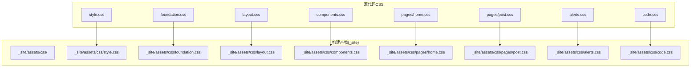
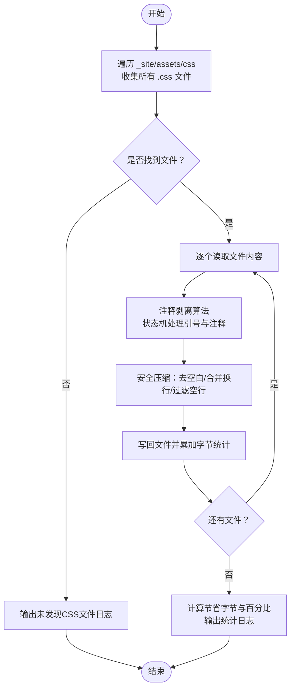
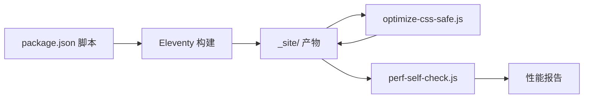

# CSS优化

<cite>
**本文引用的文件**
- [optimize-css-safe.js](file://scripts/optimize-css-safe.js)
- [package.json](file://package.json)
- [perf-self-check.js](file://scripts/perf-self-check.js)
- [style.css](file://src/assets/css/style.css)
- [foundation.css](file://src/assets/css/foundation.css)
- [layout.css](file://src/assets/css/layout.css)
- [components.css](file://src/assets/css/components.css)
- [home.css](file://src/assets/css/pages/home.css)
- [post.css](file://src/assets/css/pages/post.css)
- [alerts.css](file://src/assets/css/alerts.css)
- [code.css](file://src/assets/css/code.css)
</cite>

## 目录
1. [引言](#引言)
2. [项目结构](#项目结构)
3. [核心组件](#核心组件)
4. [架构总览](#架构总览)
5. [详细组件分析](#详细组件分析)
6. [依赖关系分析](#依赖关系分析)
7. [性能考量](#性能考量)
8. [故障排查指南](#故障排查指南)
9. [结论](#结论)
10. [附录](#附录)

## 引言
本文件围绕CSS优化策略展开，聚焦于仓库中的CSS优化脚本与构建流程，系统性阐述以下主题：
- optimize-css-safe.js的工作机制：CSS文件遍历、注释剥离算法、安全压缩流程与输出统计
- CSS压缩实现细节：空白字符处理、重复规则检测能力边界、文件大小优化效果
- CSS组织最佳实践：模块化结构、选择器优化与性能影响分析
- 关键CSS提取策略与懒加载技术建议
- 优化前后对比示例与性能收益计算方法

## 项目结构
该项目采用模块化的CSS组织方式，通过入口样式文件集中引入各模块样式，便于构建与优化阶段的统一处理。构建完成后，优化脚本会对生成目录下的所有CSS进行安全压缩。



图表来源
- [style.css:1-6](file://src/assets/css/style.css#L1-L6)
- [foundation.css:1-271](file://src/assets/css/foundation.css#L1-L271)
- [layout.css:1-276](file://src/assets/css/layout.css#L1-L276)
- [components.css:1-304](file://src/assets/css/components.css#L1-L304)
- [home.css:1-508](file://src/assets/css/pages/home.css#L1-L508)
- [post.css:1-912](file://src/assets/css/pages/post.css#L1-L912)
- [alerts.css:1-156](file://src/assets/css/alerts.css#L1-L156)
- [code.css:1-285](file://src/assets/css/code.css#L1-L285)

章节来源
- [style.css:1-6](file://src/assets/css/style.css#L1-L6)
- [foundation.css:1-271](file://src/assets/css/foundation.css#L1-L271)
- [layout.css:1-276](file://src/assets/css/layout.css#L1-L276)
- [components.css:1-304](file://src/assets/css/components.css#L1-L304)
- [home.css:1-508](file://src/assets/css/pages/home.css#L1-L508)
- [post.css:1-912](file://src/assets/css/pages/post.css#L1-L912)
- [alerts.css:1-156](file://src/assets/css/alerts.css#L1-L156)
- [code.css:1-285](file://src/assets/css/code.css#L1-L285)

## 核心组件
本节聚焦optimize-css-safe.js脚本，解析其工作流与关键算法。

- CSS文件遍历
  - 递归扫描构建产物目录下的所有CSS文件，确保覆盖多级子目录
  - 若未发现CSS文件，输出提示信息并终止执行
- 注释剥离算法
  - 支持单行与块注释的识别与剔除
  - 在字符串字面量内部正确跳过注释匹配，避免误删
  - 使用状态机跟踪单引号与双引号的开启/关闭，确保逻辑正确
- 安全压缩流程
  - 去除注释后按行分割，逐行去除首尾空白
  - 过滤空行，保留必要的换行以维持可读性
  - 合并连续空行，最终统一trim处理
- 性能统计与输出
  - 记录压缩前后的字节数，计算节省空间与百分比
  - 输出处理数量、压缩前/后大小与节省比例

章节来源
- [optimize-css-safe.js:1-112](file://scripts/optimize-css-safe.js#L1-L112)

## 架构总览
构建与优化的整体流程如下：Eleventy构建生成静态资源，随后运行CSS优化脚本对产物进行安全压缩，并通过性能自检工具评估整体体积与预算达标情况。

```mermaid
sequenceDiagram
participant Dev as "开发者"
participant NPM as "NPM脚本(package.json)"
participant Eleventy as "Eleventy构建"
participant Opt as "optimize-css-safe.js"
participant Perf as "perf-self-check.js"
Dev->>NPM : 执行构建命令
NPM->>Eleventy : 生成静态站点
Eleventy-->>NPM : 产出 _site/
NPM->>Opt : 运行CSS优化
Opt->>Opt : 遍历 _site/assets/css 下的CSS
Opt->>Opt : 注释剥离 + 安全压缩
Opt-->>NPM : 输出统计日志
NPM->>Perf : 运行性能自检
Perf-->>NPM : 输出报告
NPM-->>Dev : 构建完成
```

图表来源
- [package.json:6-16](file://package.json#L6-L16)
- [optimize-css-safe.js:82-112](file://scripts/optimize-css-safe.js#L82-L112)
- [perf-self-check.js:170-199](file://scripts/perf-self-check.js#L170-L199)

章节来源
- [package.json:6-16](file://package.json#L6-L16)
- [optimize-css-safe.js:82-112](file://scripts/optimize-css-safe.js#L82-L112)
- [perf-self-check.js:170-199](file://scripts/perf-self-check.js#L170-L199)

## 详细组件分析

### optimize-css-safe.js：工作原理与算法
- 文件遍历
  - 递归读取目录条目，遇子目录继续深入，遇CSS文件加入结果集
  - 返回路径数组供后续处理
- 注释剥离算法
  - 状态机维护单引号与双引号开关，防止在字符串内误判注释
  - 遇到“/*”且不在字符串内时，跳过直至遇到“*/”，期间忽略所有字符
  - 单引号与双引号切换遵循转义规则，避免被反斜杠转义影响
- 安全压缩
  - 去注释后按行处理：trim、过滤空行、合并多余换行
  - 最终统一trim，保证输出整洁且无多余空白
- 统计与输出
  - 使用Buffer.byteLength计算原始与压缩后字节数
  - 计算节省字节与百分比，打印汇总信息



图表来源
- [optimize-css-safe.js:6-23](file://scripts/optimize-css-safe.js#L6-L23)
- [optimize-css-safe.js:25-64](file://scripts/optimize-css-safe.js#L25-L64)
- [optimize-css-safe.js:66-76](file://scripts/optimize-css-safe.js#L66-L76)
- [optimize-css-safe.js:82-112](file://scripts/optimize-css-safe.js#L82-L112)

章节来源
- [optimize-css-safe.js:6-23](file://scripts/optimize-css-safe.js#L6-L23)
- [optimize-css-safe.js:25-64](file://scripts/optimize-css-safe.js#L25-L64)
- [optimize-css-safe.js:66-76](file://scripts/optimize-css-safe.js#L66-L76)
- [optimize-css-safe.js:82-112](file://scripts/optimize-css-safe.js#L82-L112)

### CSS压缩实现细节
- 空白字符处理
  - 按行trim，去除每行首尾空白
  - 合并连续空行，仅保留单个换行
  - 最终统一trim，避免多余空白
- 重复规则检测
  - 当前实现未包含重复规则检测或去重逻辑
  - 若需进一步优化，可在压缩前进行规则解析与去重（例如基于选择器与声明排序）
- 文件大小优化
  - 注释剥离与空白压缩可显著减少体积
  - 对于大型样式表（如页面级样式），收益尤为明显

章节来源
- [optimize-css-safe.js:66-76](file://scripts/optimize-css-safe.js#L66-L76)

### CSS组织最佳实践
- 模块化结构
  - 入口样式集中引入基础、布局、组件、页面等模块，便于构建与优化
  - 示例：入口样式文件通过@import组织模块，构建后由优化脚本统一处理
- 选择器优化
  - 避免深层嵌套与冗余选择器，减少匹配成本
  - 使用语义化类名，提高可维护性
- 性能影响分析
  - 大量注释与空白会放大传输体积，压缩后可显著降低带宽占用
  - 通过性能自检工具监控总体体积与单文件上限，确保符合预算

章节来源
- [style.css:1-6](file://src/assets/css/style.css#L1-L6)
- [foundation.css:1-271](file://src/assets/css/foundation.css#L1-L271)
- [layout.css:1-276](file://src/assets/css/layout.css#L1-L276)
- [components.css:1-304](file://src/assets/css/components.css#L1-L304)
- [home.css:1-508](file://src/assets/css/pages/home.css#L1-L508)
- [post.css:1-912](file://src/assets/css/pages/post.css#L1-L912)
- [alerts.css:1-156](file://src/assets/css/alerts.css#L1-L156)
- [code.css:1-285](file://src/assets/css/code.css#L1-L285)

### 关键CSS提取策略与懒加载技术
- 关键CSS提取
  - 识别首屏渲染必需的最小CSS集合，优先内联到HTML头部
  - 将非关键CSS延迟加载或异步加载，减少阻塞
- 懒加载技术
  - 页面级样式可按需加载，例如通过<link rel="lazyload">或动态插入link标签
  - 结合服务端缓存与CDN分发，提升二次访问性能
- 与现有脚本的结合
  - 优化脚本专注于压缩，关键CSS提取与懒加载建议在构建阶段或运行时配合实现

[本节为概念性指导，不直接分析具体文件，故无章节来源]

## 依赖关系分析
- 构建链路
  - package.json中定义了构建脚本，依次执行清理、元数据同步、Eleventy构建、CSS优化与性能自检
  - CSS优化脚本依赖_node:fs_与_node:path_，在构建产物目录上进行操作
- 性能自检
  - perf-self-check.js遍历_build输出目录，统计各类资源总量与最大单文件，输出报告



图表来源
- [package.json:6-16](file://package.json#L6-L16)
- [optimize-css-safe.js:4-4](file://scripts/optimize-css-safe.js#L4-L4)
- [perf-self-check.js:7-8](file://scripts/perf-self-check.js#L7-L8)

章节来源
- [package.json:6-16](file://package.json#L6-L16)
- [optimize-css-safe.js:4-4](file://scripts/optimize-css-safe.js#L4-L4)
- [perf-self-check.js:7-8](file://scripts/perf-self-check.js#L7-L8)

## 性能考量
- 压缩收益
  - 注释剥离与空白压缩可显著降低CSS体积，尤其在大型样式表中
  - 建议在构建流程中启用此优化，作为默认步骤
- 预算控制
  - 性能自检工具提供总CSS体积、最大单文件等指标，帮助判断是否需要进一步优化
  - 可根据预算阈值调整样式组织与提取策略

[本节提供通用指导，不直接分析具体文件，故无章节来源]

## 故障排查指南
- 未发现CSS文件
  - 现象：优化脚本输出“未发现CSS文件”的提示
  - 排查：确认构建已成功生成_site/assets/css目录；检查路径拼接是否正确
- 压缩后样式异常
  - 现象：页面样式错乱或缺失
  - 排查：确认注释剥离算法未误删字符串内的“/*”；检查是否存在转义引号导致的状态机错误
- 性能自检失败
  - 现象：报告中某项指标超出预算
  - 排查：检查关键CSS提取策略与懒加载实现；优化选择器与重复规则（如存在）

章节来源
- [optimize-css-safe.js:82-112](file://scripts/optimize-css-safe.js#L82-L112)
- [perf-self-check.js:170-199](file://scripts/perf-self-check.js#L170-L199)

## 结论
本项目通过模块化CSS组织与构建后安全压缩，有效降低了CSS体积与传输开销。optimize-css-safe.js提供了可靠的注释剥离与空白压缩能力，结合性能自检工具，可形成闭环的质量保障。为进一步提升性能，建议在构建阶段引入关键CSS提取与懒加载策略，并持续监控预算指标。

[本节为总结性内容，不直接分析具体文件，故无章节来源]

## 附录

### 优化前后对比示例与性能收益计算
- 对比示例
  - 压缩前：某页面样式包含大量注释与空白，体积较大
  - 压缩后：注释剥离与空白压缩后，体积明显下降
- 收益计算
  - 节省字节 = 压缩前字节 - 压缩后字节
  - 节省百分比 = (节省字节 / 压缩前字节) × 100%
  - 优化脚本会输出处理文件数、压缩前/后大小与节省比例，便于快速评估

章节来源
- [optimize-css-safe.js:82-112](file://scripts/optimize-css-safe.js#L82-L112)