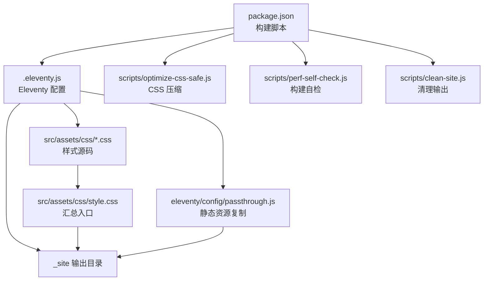
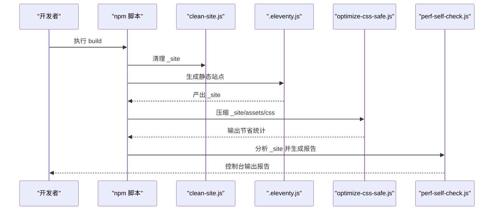
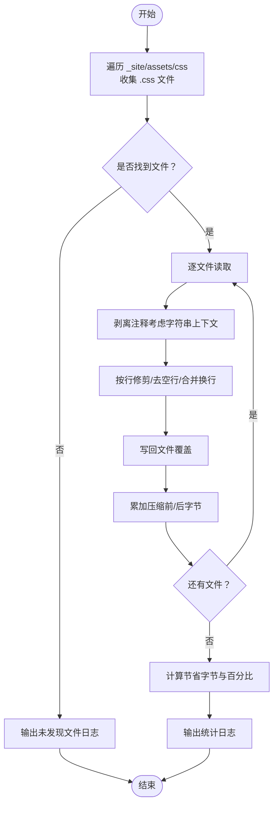
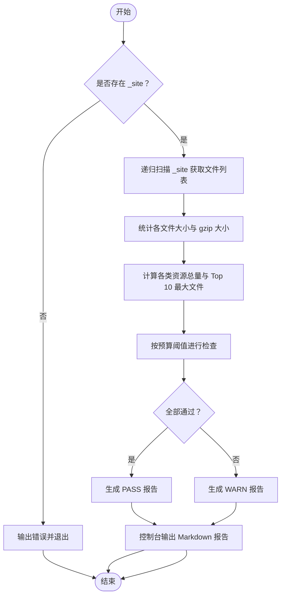
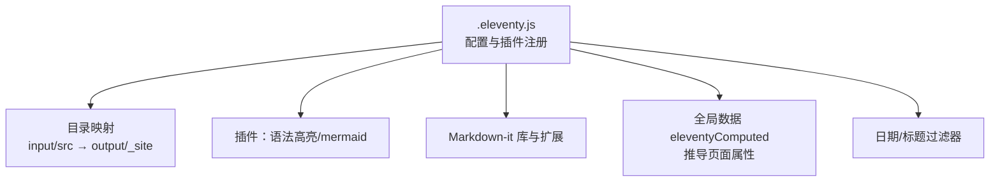
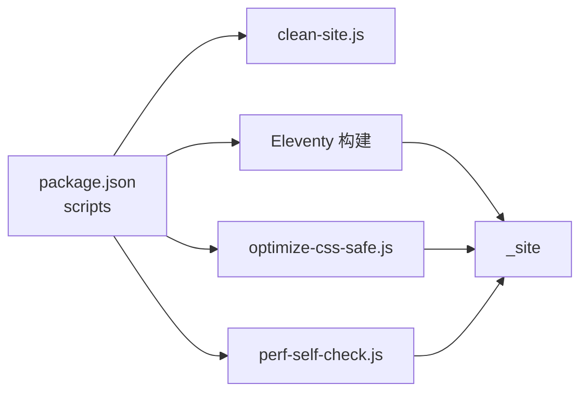

# 性能优化

<cite>
**本文引用的文件**
- [scripts/optimize-css-safe.js](file://scripts/optimize-css-safe.js)
- [scripts/perf-self-check.js](file://scripts/perf-self-check.js)
- [scripts/clean-site.js](file://scripts/clean-site.js)
- [.eleventy.js](file://.eleventy.js)
- [package.json](file://package.json)
- [src/assets/css/style.css](file://src/assets/css/style.css)
- [src/assets/css/foundation.css](file://src/assets/css/foundation.css)
- [src/assets/css/layout.css](file://src/assets/css/layout.css)
- [src/_data/siteConfig.js](file://src/_data/siteConfig.js)
- [src/content/settings/siteConfig.js](file://src/content/settings/siteConfig.js)
- [src/content/settings/categoryDescriptions.json](file://src/content/settings/categoryDescriptions.json)
- [eleventy/config/passthrough.js](file://eleventy/config/passthrough.js)
- [eleventy/config/filters.js](file://eleventy/config/filters.js)
</cite>

## 目录
1. [简介](#简介)
2. [项目结构](#项目结构)
3. [核心组件](#核心组件)
4. [架构总览](#架构总览)
5. [详细组件分析](#详细组件分析)
6. [依赖关系分析](#依赖关系分析)
7. [性能考量](#性能考量)
8. [故障排查指南](#故障排查指南)
9. [结论](#结论)
10. [附录](#附录)

## 简介
本文件系统性梳理 11ty RainyNight 的性能优化策略，围绕以下目标展开：
- 解释 CSS 优化脚本的工作原理与优化技术（CSS 压缩、注释剥离、空白清理等）
- 阐述性能自检脚本的检测机制与评估标准
- 提供静态资源优化最佳实践（图片、字体、缓存策略）
- 说明构建时的性能监控与分析方法
- 给出性能基准测试与持续优化指导
- 提供不同部署环境的优化建议

## 项目结构
该项目采用 11ty 静态站点生成器，构建产物输出至 _site。性能相关的关键位置如下：
- 构建脚本与优化工具位于 scripts/
- CSS 源码位于 src/assets/css，通过 style.css 汇总
- Eleventy 配置位于 .eleventy.js，包含全局数据、过滤器、插件与目录映射
- 静态资源复制通过 passthrough 配置实现
- 包装构建流程的 npm scripts 定义于 package.json

图表来源
- [package.json:1-35](file://package.json#L1-L35)
- [.eleventy.js:173-181](file://.eleventy.js#L173-L181)
- [scripts/optimize-css-safe.js:1-112](file://scripts/optimize-css-safe.js#L1-L112)
- [scripts/perf-self-check.js:1-199](file://scripts/perf-self-check.js#L1-L199)
- [scripts/clean-site.js:1-11](file://scripts/clean-site.js#L1-L11)
- [src/assets/css/style.css:1-6](file://src/assets/css/style.css#L1-L6)
- [eleventy/config/passthrough.js:1-7](file://eleventy/config/passthrough.js#L1-L7)

章节来源
- [package.json:6-16](file://package.json#L6-L16)
- [.eleventy.js:173-181](file://.eleventy.js#L173-L181)
- [src/assets/css/style.css:1-6](file://src/assets/css/style.css#L1-L6)
- [eleventy/config/passthrough.js:1-7](file://eleventy/config/passthrough.js#L1-L7)

## 核心组件
- CSS 压缩脚本：遍历 _site/assets/css 下的 CSS 文件，安全地剥离注释与多余空白，原地覆盖并统计节省字节与压缩比
- 性能自检脚本：扫描 _site 目录，计算各类资源大小与 gzip 大小，对比预算阈值，输出 Markdown 报告
- Eleventy 构建链路：注册过滤器、插件与全局数据，设置输入/输出目录，启用语法高亮与 Mermaid 插件
- 静态资源复制：通过 passthrough 将 src/assets 与 src/static 直接复制到 _site
- 清理脚本：删除 _site 目录，确保构建一致性

章节来源
- [scripts/optimize-css-safe.js:82-112](file://scripts/optimize-css-safe.js#L82-L112)
- [scripts/perf-self-check.js:50-126](file://scripts/perf-self-check.js#L50-L126)
- [.eleventy.js:37-181](file://.eleventy.js#L37-L181)
- [eleventy/config/passthrough.js:1-7](file://eleventy/config/passthrough.js#L1-L7)
- [scripts/clean-site.js:6-11](file://scripts/clean-site.js#L6-L11)

## 架构总览
构建流程在 package.json 中串联：清理 -> 同步元数据 -> Eleventy 生成 -> CSS 压缩 -> 自检报告。Eleventy 将 src 内容与数据渲染为 _site；CSS 压缩脚本在构建后处理 _site 中的 CSS；自检脚本对最终产物进行体积与单文件上限检查。

图表来源
- [package.json:10](file://package.json#L10)
- [scripts/clean-site.js:6-11](file://scripts/clean-site.js#L6-L11)
- [.eleventy.js:37-181](file://.eleventy.js#L37-L181)
- [scripts/optimize-css-safe.js:82-112](file://scripts/optimize-css-safe.js#L82-L112)
- [scripts/perf-self-check.js:170-199](file://scripts/perf-self-check.js#L170-L199)

## 详细组件分析

### CSS 优化脚本：工作原理与优化技术
- 目标路径：_site/assets/css
- 遍历策略：递归扫描目录，收集 .css 文件
- 注释剥离：逐字符扫描，区分字符串上下文与注释上下文，仅移除非字符串中的块注释
- 压缩策略：按行 trim，过滤空行，合并连续换行，最终统一 trim
- 统计与输出：累计压缩前/后字节数，计算节省字节与百分比

图表来源
- [scripts/optimize-css-safe.js:6-23](file://scripts/optimize-css-safe.js#L6-L23)
- [scripts/optimize-css-safe.js:25-76](file://scripts/optimize-css-safe.js#L25-L76)
- [scripts/optimize-css-safe.js:82-112](file://scripts/optimize-css-safe.js#L82-L112)

章节来源
- [scripts/optimize-css-safe.js:1-112](file://scripts/optimize-css-safe.js#L1-L112)

### 性能自检脚本：检测机制与评估标准
- 目标目录：_site
- 扫描与统计：递归遍历，统计每文件大小与 gzip 大小，汇总各类资源总量
- 预算阈值（BUDGETS）：
  - HTML 总量上限
  - CSS 总量上限
  - JS 总量上限
  - 单文件最大上限
- 报告内容：状态（PASS/WARN）、文件数量、总大小、gzip 总大小、各项指标对比、Top 10 最大文件、按类型统计

图表来源
- [scripts/perf-self-check.js:170-199](file://scripts/perf-self-check.js#L170-L199)
- [scripts/perf-self-check.js:50-126](file://scripts/perf-self-check.js#L50-L126)
- [scripts/perf-self-check.js:10-15](file://scripts/perf-self-check.js#L10-L15)

章节来源
- [scripts/perf-self-check.js:1-199](file://scripts/perf-self-check.js#L1-L199)

### Eleventy 构建链路与全局数据
- 目录映射：输入 src，输出 _site，includes 与 data 目录
- 插件与库：语法高亮、Mermaid、Markdown-it 及其扩展
- 全局数据（eleventyComputed）：自动推导标题、子分类、布局、永久链接、发布时间、更新时间、标签、页面样式等
- 过滤器：日期格式化、标题拼接等

图表来源
- [.eleventy.js:37-181](file://.eleventy.js#L37-L181)

章节来源
- [.eleventy.js:37-181](file://.eleventy.js#L37-L181)
- [eleventy/config/filters.js:1-43](file://eleventy/config/filters.js#L1-L43)

### 静态资源复制与缓存策略
- 复制策略：通过 passthrough 将 src/assets 复制到 _site/assets，src/static 复制到根
- 缓存建议：
  - 对 CSS/JS 添加版本查询参数或内容哈希命名，以实现强缓存
  - 对图片与字体采用现代格式（如 WebP/AVIF、WOFF2），并提供降级方案
  - 使用 CDN 与边缘缓存，结合合理的 Cache-Control 与 ETag

章节来源
- [eleventy/config/passthrough.js:1-7](file://eleventy/config/passthrough.js#L1-L7)
- [src/assets/css/style.css:1-6](file://src/assets/css/style.css#L1-L6)

### 清理与一致性保障
- 清理脚本删除 _site，避免历史残留影响构建结果
- 在构建前执行清理，确保自检与压缩脚本作用于干净产物

章节来源
- [scripts/clean-site.js:6-11](file://scripts/clean-site.js#L6-L11)
- [package.json:10](file://package.json#L10)

## 依赖关系分析
- 构建顺序：clean-site → 同步元数据 → Eleventy → optimize-css-safe → perf-self-check
- Eleventy 依赖：@11ty/eleventy、markdown-it 生态、语法高亮插件
- 数据与配置：全局数据与站点配置集中于 .eleventy.js 与 src/_data、src/content/settings

图表来源
- [package.json:6-16](file://package.json#L6-L16)
- [scripts/clean-site.js:6-11](file://scripts/clean-site.js#L6-L11)
- [.eleventy.js:37-181](file://.eleventy.js#L37-L181)
- [scripts/optimize-css-safe.js:82-112](file://scripts/optimize-css-safe.js#L82-L112)
- [scripts/perf-self-check.js:170-199](file://scripts/perf-self-check.js#L170-L199)

章节来源
- [package.json:6-16](file://package.json#L6-L16)

## 性能考量
- CSS 压缩：通过剥离注释与多余空白减少体积，适合在构建后执行，避免污染源码
- 资源体积预算：自检脚本提供 HTML/CSS/JS 总量与单文件上限阈值，便于持续监控
- gzip 体积：自检同时计算 gzip 大小，反映网络传输体积
- 静态资源优化：
  - 图片：优先 WebP/AVIF，提供 fallback；按视口尺寸裁切与懒加载
  - 字体：WOFF2 优先，按需加载与子集化
  - 缓存：版本化/指纹化文件名，合理 Cache-Control
- 构建监控：在 CI 中运行自检脚本，将报告作为质量门禁

## 故障排查指南
- 构建失败（缺少 _site）：perf-self-check 会在缺失 _site 时输出错误并退出
- 未发现 CSS 文件：optimize-css-safe 会在 _site/assets/css 为空时输出提示
- 构建体积超限：根据自检报告定位超限资源类型与最大文件，针对性优化
- 清理不彻底：确认 clean-site 是否在 build 前执行，避免历史文件干扰

章节来源
- [scripts/perf-self-check.js:170-174](file://scripts/perf-self-check.js#L170-L174)
- [scripts/optimize-css-safe.js:82-87](file://scripts/optimize-css-safe.js#L82-L87)
- [package.json:10](file://package.json#L10)

## 结论
本项目通过“构建前清理 + Eleventy 生成 + 构建后压缩 + 构建自检”的闭环，实现了对静态站点体积与质量的自动化把控。CSS 压缩脚本与性能自检脚本分别负责体积优化与质量门禁，配合 Eleventy 的全局数据与插件生态，形成可维护、可扩展的性能优化体系。建议在 CI 中集成自检报告，持续跟踪体积趋势并推动优化。

## 附录

### 关键配置与数据
- 站点配置：品牌、导航、页脚、元信息、主题默认值、分页参数与页面文案
- 全局数据：页面标题、子分类、布局、永久链接、发布/更新时间、标签、页面样式数组
- 过滤器：日期格式化、标题拼接

章节来源
- [src/content/settings/siteConfig.js:1-168](file://src/content/settings/siteConfig.js#L1-L168)
- [src/_data/siteConfig.js:1-2](file://src/_data/siteConfig.js#L1-L2)
- [.eleventy.js:76-158](file://.eleventy.js#L76-L158)
- [eleventy/config/filters.js:6-42](file://eleventy/config/filters.js#L6-L42)