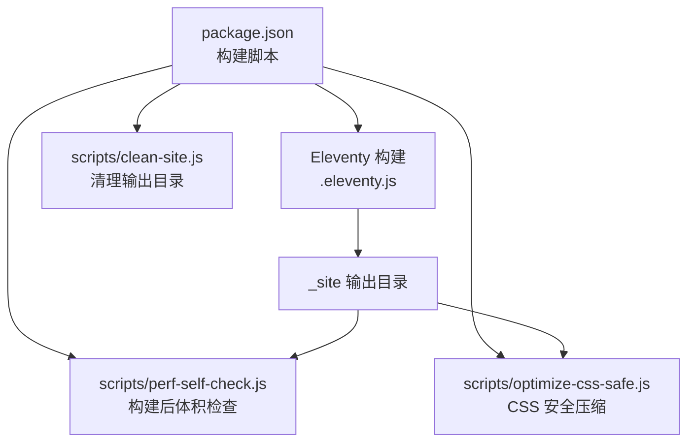
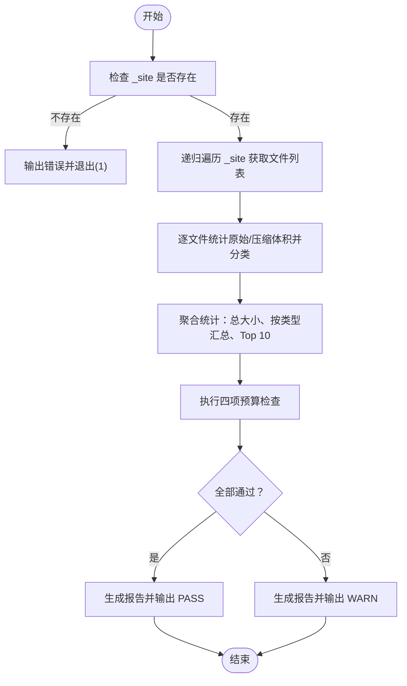
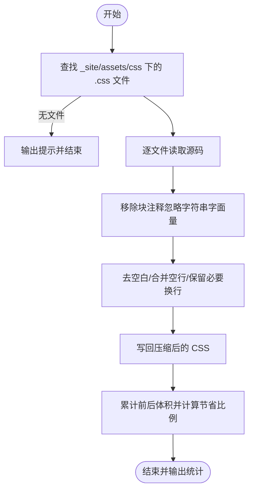
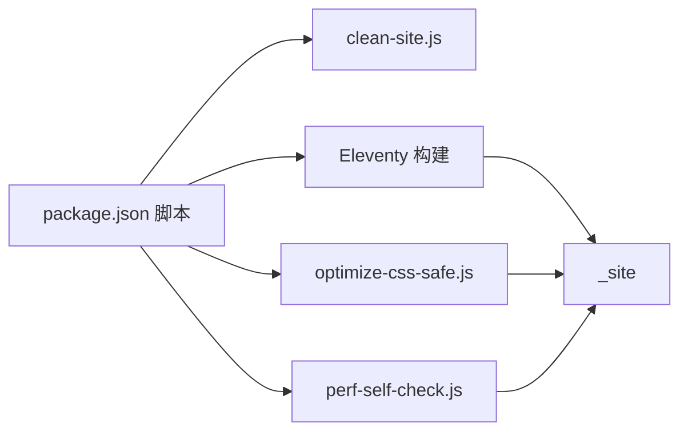

# 性能监控

<cite>
**本文引用的文件**
- [perf-self-check.js](file://scripts/perf-self-check.js)
- [optimize-css-safe.js](file://scripts/optimize-css-safe.js)
- [clean-site.js](file://scripts/clean-site.js)
- [package.json](file://package.json)
- [.eleventy.js](file://.eleventy.js)
- [main.js](file://src/assets/js/main.js)
- [style.css](file://src/assets/css/style.css)
</cite>

## 目录
1. [引言](#引言)
2. [项目结构](#项目结构)
3. [核心组件](#核心组件)
4. [架构总览](#架构总览)
5. [详细组件分析](#详细组件分析)
6. [依赖关系分析](#依赖关系分析)
7. [性能考量](#性能考量)
8. [故障排查指南](#故障排查指南)
9. [结论](#结论)
10. [附录](#附录)

## 引言
本文件系统性梳理本项目的性能监控机制，聚焦于构建期自检（build-time self-check）、样式压缩优化（safe CSS minification）以及与 Eleventy 构建流程的集成。文档围绕以下目标展开：
- 解释 perf-self-check.js 的检测逻辑与评估标准（页面加载时间、资源体积、用户体验指标）
- 阐述性能基准测试方法与工具使用（Lighthouse 集成与自动化测试流程）
- 提供性能指标解读指南（Core Web Vitals 分析与优化建议）
- 说明持续性能监控的实施策略与告警机制
- 给出性能问题诊断与解决方案的实用指南

## 项目结构
本项目采用 Eleventy 静态站点生成器，构建产物输出至 _site 目录。性能监控相关脚本位于 scripts/，构建流程通过 package.json 中的脚本进行编排。



图表来源
- [package.json:6-16](file://package.json#L6-L16)
- [.eleventy.js:137-144](file://.eleventy.js#L137-L144)
- [perf-self-check.js:7-8](file://scripts/perf-self-check.js#L7-L8)
- [optimize-css-safe.js:4](file://scripts/optimize-css-safe.js#L4)

章节来源
- [package.json:6-16](file://package.json#L6-L16)
- [.eleventy.js:137-144](file://.eleventy.js#L137-L144)

## 核心组件
- 构建后体积自检脚本：对 _site 下所有产物进行扫描，统计 HTML/CSS/JS/图像/字体等类型体积，并与预算阈值对比，输出 Markdown 报告。
- CSS 安全压缩脚本：在不破坏字符串字面量与注释语义的前提下，移除 CSS 注释与多余空白，减少体积。
- 清理脚本：删除 _site 目录，确保构建前后状态一致。
- Eleventy 构建配置：定义输入/输出目录、插件与全局数据，影响最终产物体积与结构。

章节来源
- [perf-self-check.js:10-15](file://scripts/perf-self-check.js#L10-L15)
- [optimize-css-safe.js:82-109](file://scripts/optimize-css-safe.js#L82-L109)
- [clean-site.js:6-10](file://scripts/clean-site.js#L6-L10)
- [.eleventy.js:137-144](file://.eleventy.js#L137-L144)

## 架构总览
下图展示了从构建到性能自检的整体流程，以及与 Eleventy 的集成点。

```mermaid
sequenceDiagram
participant Dev as "开发者"
participant NPM as "npm 脚本"
participant Eleventy as "Eleventy 构建"
participant Clean as "clean-site.js"
participant Opt as "optimize-css-safe.js"
participant Perf as "perf-self-check.js"
participant Site as "_site"
Dev->>NPM : 执行构建命令
NPM->>Clean : 删除 _site
Clean-->>Site : 清空输出目录
NPM->>Eleventy : 生成静态站点
Eleventy-->>Site : 写入 HTML/CSS/JS/资源
NPM->>Opt : 对 CSS 进行安全压缩
Opt-->>Site : 更新压缩后的 CSS
NPM->>Perf : 执行体积自检
Perf-->>Dev : 输出报告与状态
```

图表来源
- [package.json:10](file://package.json#L10)
- [clean-site.js:6-10](file://scripts/clean-site.js#L6-L10)
- [optimize-css-safe.js:82-109](file://scripts/optimize-css-safe.js#L82-L109)
- [perf-self-check.js:170-196](file://scripts/perf-self-check.js#L170-L196)

## 详细组件分析

### perf-self-check.js：构建后体积自检
- 目标：在构建完成后，对 _site 目录进行递归扫描，统计各类资源体积与单文件最大体积，与预算阈值比较，输出可读报告。
- 关键逻辑
  - 预算阈值：HTML/CSS/JS 总体积与最大单文件体积。
  - 文件遍历：递归遍历 _site，仅处理文件条目。
  - 类型识别：根据扩展名归类为 html/css/js/image/font/other。
  - 体积计算：原始字节与 gzip 字节（压缩级别 9）。
  - 排序与取 Top 10：按原始体积排序，输出最大的 10 个文件。
  - 检查项：四项预算检查，全部通过视为 PASS，否则 WARN。
  - 报告生成：Markdown 表格形式，包含时间、站点目录、状态、文件数、总体积、gzip 总体积、各项检查、按类型汇总、Top 10 最大文件。
- 评估标准
  - HTML 总体积上限
  - CSS 总体积上限
  - JS 总体积上限
  - 单文件最大体积上限
- 输出与退出码
  - 控制台打印状态与报告正文
  - 若 _site 不存在，输出错误并以非零退出码终止



图表来源
- [perf-self-check.js:170-196](file://scripts/perf-self-check.js#L170-L196)
- [perf-self-check.js:50-126](file://scripts/perf-self-check.js#L50-L126)
- [perf-self-check.js:10-15](file://scripts/perf-self-check.js#L10-L15)

章节来源
- [perf-self-check.js:10-15](file://scripts/perf-self-check.js#L10-L15)
- [perf-self-check.js:50-126](file://scripts/perf-self-check.js#L50-L126)
- [perf-self-check.js:128-168](file://scripts/perf-self-check.js#L128-L168)
- [perf-self-check.js:170-196](file://scripts/perf-self-check.js#L170-L196)

### optimize-css-safe.js：CSS 安全压缩
- 目标：在不破坏字符串字面量与注释语义的前提下，移除 CSS 注释与多余空白，减少体积。
- 关键逻辑
  - 遍历 _site/assets/css 下的 .css 文件。
  - 使用状态机识别字符串字面量与块注释，仅移除块注释。
  - 去除行首行尾空白、合并连续空行，保持必要的换行。
  - 记录压缩前后体积，输出节省字节数与百分比。
- 适用场景
  - 构建后对已产出的 CSS 进行无损压缩，提升传输效率。



图表来源
- [optimize-css-safe.js:82-109](file://scripts/optimize-css-safe.js#L82-L109)
- [optimize-css-safe.js:25-76](file://scripts/optimize-css-safe.js#L25-L76)

章节来源
- [optimize-css-safe.js:82-109](file://scripts/optimize-css-safe.js#L82-L109)
- [optimize-css-safe.js:25-76](file://scripts/optimize-css-safe.js#L25-L76)

### clean-site.js：清理输出目录
- 目标：删除 _site 目录，确保构建前后状态一致。
- 行为：递归强制删除，输出日志。

章节来源
- [clean-site.js:6-10](file://scripts/clean-site.js#L6-L10)

### Eleventy 构建配置与输出
- 输入/输出目录：input=src，output=_site，includes=_includes，data=_data。
- 插件与全局数据：语法高亮、Mermaid、日期/标题过滤器、集合注册、Markdown 库设置。
- 影响：决定最终产物的体量与结构，间接影响体积自检结果。

章节来源
- [.eleventy.js:137-144](file://.eleventy.js#L137-L144)

## 依赖关系分析
- 构建脚本顺序
  - clean-site.js → Eleventy 构建 → optimize-css-safe.js → perf-self-check.js
- 关键依赖
  - Node 内置模块：fs、path、zlib
  - Eleventy：负责模板渲染与静态资源复制
  - 本仓库脚本：自检与压缩



图表来源
- [package.json:10](file://package.json#L10)
- [perf-self-check.js:7-8](file://scripts/perf-self-check.js#L7-L8)
- [optimize-css-safe.js:4](file://scripts/optimize-css-safe.js#L4)

章节来源
- [package.json:10](file://package.json#L10)

## 性能考量
- 体积预算与阈值
  - HTML 总体积上限
  - CSS 总体积上限
  - JS 总体积上限
  - 单文件最大体积上限
- 体积度量
  - 原始字节与 gzip 字节（压缩级别 9），用于更贴近网络传输体积的评估。
- 类型分布
  - 按 html/css/js/image/font/other 统计，便于定位体积异常来源。
- Top 10 最大文件
  - 快速定位超大资源，如未压缩的图片、第三方库或未拆分的样式表。

章节来源
- [perf-self-check.js:10-15](file://scripts/perf-self-check.js#L10-L15)
- [perf-self-check.js:50-126](file://scripts/perf-self-check.js#L50-L126)

## 故障排查指南
- _site 不存在
  - 现象：脚本报错并以非零退出码终止
  - 处理：先执行 clean-site.js 或手动创建 _site，再运行构建脚本
  - 参考：[perf-self-check.js:170-174](file://scripts/perf-self-check.js#L170-L174)
- CSS 未被压缩
  - 现象：optimize-css-safe.js 输出“未找到 CSS 文件”
  - 处理：确认构建是否成功生成 _site/assets/css；检查 Eleventy 输出目录配置
  - 参考：[optimize-css-safe.js:82-87](file://scripts/optimize-css-safe.js#L82-L87)
- 自检失败（WARN）
  - 现象：某项或多项预算检查未通过
  - 处理：查看报告中“Top 10 最大文件”与“按类型汇总”，定位超限资源并优化
  - 参考：[perf-self-check.js:128-168](file://scripts/perf-self-check.js#L128-L168)
- 构建产物体积异常
  - 现象：HTML/CSS/JS 总体积偏大
  - 处理：检查 Eleventy 全局数据与页面样式注入；确认未重复引入大型依赖；考虑拆分样式与懒加载脚本
  - 参考：[.eleventy.js:113-121](file://.eleventy.js#L113-L121)

章节来源
- [perf-self-check.js:170-174](file://scripts/perf-self-check.js#L170-L174)
- [optimize-css-safe.js:82-87](file://scripts/optimize-css-safe.js#L82-L87)
- [.eleventy.js:113-121](file://.eleventy.js#L113-L121)

## 结论
本项目的性能监控以构建期自检为核心，结合安全的 CSS 压缩与严格的体积预算，形成闭环的质量保障。通过定期运行 perf-self-check.js，可及时发现体积回归与异常资源，配合 Eleventy 的构建配置与样式组织，能够有效控制页面加载体积与用户体验指标。建议在 CI 中集成该流程，以实现持续性能监控与告警。

## 附录

### Lighthouse 集成与自动化测试流程（建议）
- 在 CI 中添加 Lighthouse 测试步骤，对生产构建产物进行端到端性能评测。
- 将 Lighthouse 报告中的 Core Web Vitals 指标（LCP、FID、CLS）纳入质量门禁。
- 与 perf-self-check.js 报告联动，建立“体积 + 指标”的双维度评估。

### Core Web Vitals 指标解读与优化建议（建议）
- LCP（最大内容绘制）：优化首屏渲染，延迟加载非关键资源，使用现代图片格式与合适的尺寸。
- FID（首次输入延迟）：减少主线程阻塞，拆分与懒加载脚本，使用 Web Workers 处理耗时任务。
- CLS（累积布局偏移）：为动态内容预留空间，避免使用内联脚本导致的布局抖动。

### 持续性能监控与告警策略（建议）
- 在 CI 中固定运行 perf-self-check.js 与 Lighthouse，记录历史趋势。
- 设定阈值告警：当任一预算项或关键指标超过阈值时触发通知。
- 将报告上传至制品库或文档平台，便于追溯与复盘。