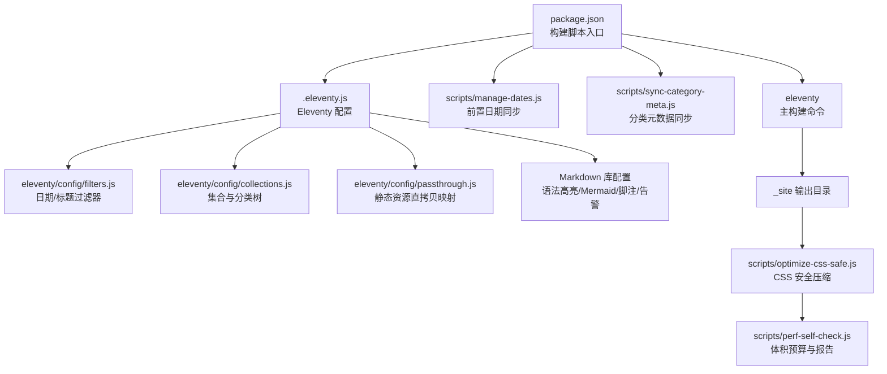
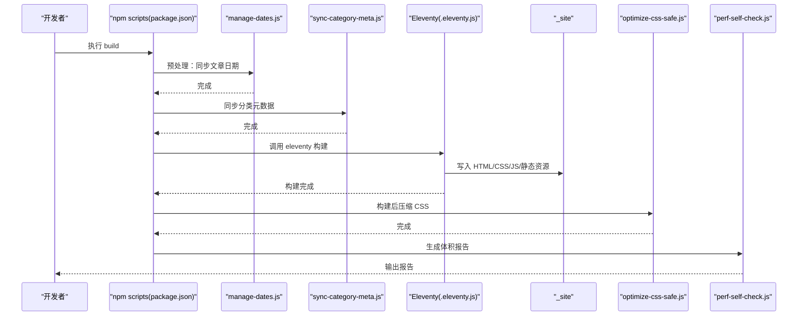
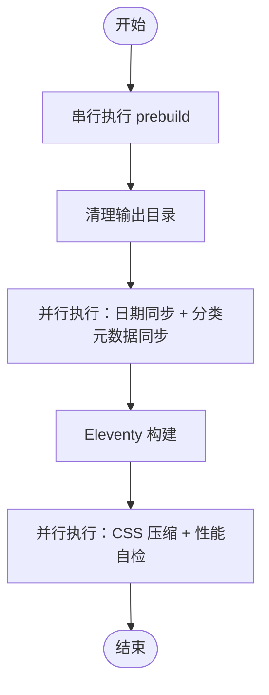
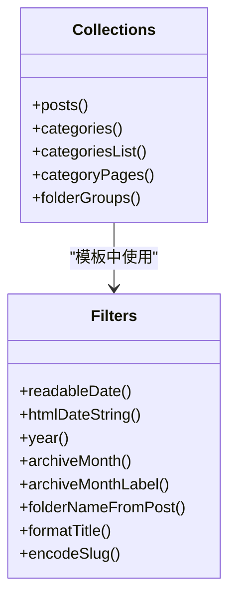
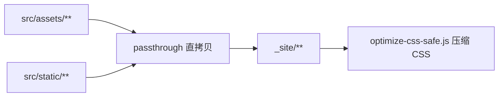
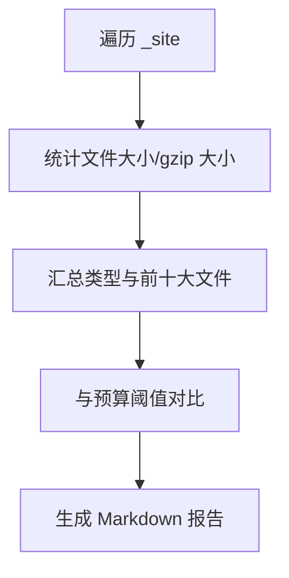
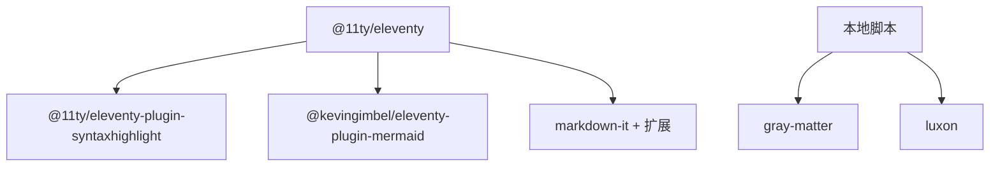

# 构建性能

<cite>
**本文引用的文件**
- [.eleventy.js](file://.eleventy.js)
- [package.json](file://package.json)
- [scripts/perf-self-check.js](file://scripts/perf-self-check.js)
- [scripts/optimize-css-safe.js](file://scripts/optimize-css-safe.js)
- [scripts/sync-category-meta.js](file://scripts/sync-category-meta.js)
- [scripts/manage-dates.js](file://scripts/manage-dates.js)
- [eleventy/config/filters.js](file://eleventy/config/filters.js)
- [eleventy/config/collections.js](file://eleventy/config/collections.js)
- [eleventy/config/passthrough.js](file://eleventy/config/passthrough.js)
- [src/_data/siteConfig.js](file://src/_data/siteConfig.js)
- [src/content/settings/siteConfig.js](file://src/content/settings/siteConfig.js)
- [src/content/settings/categoryDescriptions.json](file://src/content/settings/categoryDescriptions.json)
- [src/_includes/layouts/base.njk](file://src/_includes/layouts/base.njk)
- [src/assets/css/style.css](file://src/assets/css/style.css)
- [src/assets/css/layout.css](file://src/assets/css/layout.css)
- [src/assets/js/main.js](file://src/assets/js/main.js)
</cite>

## 目录
1. [简介](#简介)
2. [项目结构](#项目结构)
3. [核心组件](#核心组件)
4. [架构总览](#架构总览)
5. [详细组件分析](#详细组件分析)
6. [依赖分析](#依赖分析)
7. [性能考量](#性能考量)
8. [故障排查指南](#故障排查指南)
9. [结论](#结论)
10. [附录](#附录)

## 简介
本文件围绕 Eleventy 构建性能进行系统性梳理，结合仓库现有构建脚本与配置，识别潜在性能瓶颈，并提出可落地的优化策略。重点覆盖：
- 构建脚本的串行与并行处理现状与改进建议
- 增量构建与缓存策略（基于 Eleventy 的输入/输出目录与数据层）
- 构建时间分析与打包优化（CSS 压缩、体积预算、静态资源直拷贝）
- 开发与生产环境的差异化优化配置
- CI/CD 中的性能优化实践与回归检测
- 失败排查与性能回归检测的实用指南

## 项目结构
该项目采用典型的 Eleventy 结构：以 src 为输入根，_site 为输出根，通过 .eleventy.js 注册插件、过滤器、集合与 Markdown 库；构建脚本位于 scripts 目录，配合 package.json 的 npm scripts 完成预处理、构建与后处理。

图表来源
- [.eleventy.js:11-146](file://.eleventy.js#L11-L146)
- [package.json:6-16](file://package.json#L6-L16)
- [scripts/manage-dates.js:1-85](file://scripts/manage-dates.js#L1-L85)
- [scripts/sync-category-meta.js:1-205](file://scripts/sync-category-meta.js#L1-L205)
- [scripts/optimize-css-safe.js:1-112](file://scripts/optimize-css-safe.js#L1-L112)
- [scripts/perf-self-check.js:1-199](file://scripts/perf-self-check.js#L1-L199)

章节来源
- [.eleventy.js:11-146](file://.eleventy.js#L11-L146)
- [package.json:6-16](file://package.json#L6-L16)

## 核心组件
- Eleventy 配置与插件注册：在 .eleventy.js 中注册语法高亮、Mermaid、Markdown 扩展库，并设置目录结构与全局数据计算。
- 过滤器与集合：在 filters.js 与 collections.js 中定义日期/标题过滤器与多类集合（文章、分类、分类详情、文件夹分组），影响渲染复杂度与构建时间。
- 静态资源直拷贝：passthrough.js 映射 src/assets 与 src/static 到输出根，减少构建期处理开销。
- 构建脚本链路：package.json 中的 prebuild/build 串联日期同步、分类元数据同步、Eleventy 主构建、CSS 压缩与性能自检。
- 性能自检与体积预算：perf-self-check.js 对 _site 下产物进行体积统计与预算检查，生成 Markdown 报告。
- CSS 安全压缩：optimize-css-safe.js 在构建后对 CSS 文件进行安全压缩，减少体积。
- 数据与配置：siteConfig.js 与 categoryDescriptions.json 提供主题、分页、导航等配置，间接影响模板渲染与集合数量。

章节来源
- [.eleventy.js:11-146](file://.eleventy.js#L11-L146)
- [eleventy/config/filters.js:1-49](file://eleventy/config/filters.js#L1-L49)
- [eleventy/config/collections.js:1-377](file://eleventy/config/collections.js#L1-L377)
- [eleventy/config/passthrough.js:1-7](file://eleventy/config/passthrough.js#L1-L7)
- [scripts/perf-self-check.js:10-199](file://scripts/perf-self-check.js#L10-L199)
- [scripts/optimize-css-safe.js:1-112](file://scripts/optimize-css-safe.js#L1-L112)
- [src/_data/siteConfig.js:1-2](file://src/_data/siteConfig.js#L1-L2)
- [src/content/settings/siteConfig.js:1-168](file://src/content/settings/siteConfig.js#L1-L168)
- [src/content/settings/categoryDescriptions.json:1-60](file://src/content/settings/categoryDescriptions.json#L1-L60)

## 架构总览
下图展示从 npm scripts 到最终产出的构建流程，以及与性能相关的处理点。

图表来源
- [package.json:6-16](file://package.json#L6-L16)
- [scripts/manage-dates.js:1-85](file://scripts/manage-dates.js#L1-L85)
- [scripts/sync-category-meta.js:1-205](file://scripts/sync-category-meta.js#L1-L205)
- [.eleventy.js:11-146](file://.eleventy.js#L11-L146)
- [scripts/optimize-css-safe.js:1-112](file://scripts/optimize-css-safe.js#L1-L112)
- [scripts/perf-self-check.js:170-199](file://scripts/perf-self-check.js#L170-L199)

## 详细组件分析

### 组件A：构建脚本链路与并行化潜力
- 现状：当前构建脚本为串行执行（prebuild -> clean -> sync-meta -> eleventy -> css:optimize -> perf:check）。
- 并行化建议：
  - 将“日期同步”和“分类元数据同步”作为独立任务并行启动，缩短等待时间。
  - Eleventy 构建完成后，CSS 压缩与性能自检可并行执行，避免相互阻塞。
- 增量构建建议：
  - 使用 Eleventy 的增量构建能力（如 watch 模式）在开发环境启用，仅重建变更文件。
  - 对于大规模集合，可在集合中增加“仅在变更时重新计算”的逻辑（例如基于文件 mtime 的判断）。

章节来源
- [package.json:6-16](file://package.json#L6-L16)
- [scripts/manage-dates.js:1-85](file://scripts/manage-dates.js#L1-L85)
- [scripts/sync-category-meta.js:1-205](file://scripts/sync-category-meta.js#L1-L205)
- [.eleventy.js:11-146](file://.eleventy.js#L11-L146)
- [scripts/optimize-css-safe.js:1-112](file://scripts/optimize-css-safe.js#L1-L112)
- [scripts/perf-self-check.js:170-199](file://scripts/perf-self-check.js#L170-L199)

### 组件B：集合与过滤器对构建性能的影响
- 集合复杂度：categoriesList、categoryPages、folderGroups 等集合涉及递归遍历、排序与分页计算，文件数量增长时会显著增加构建时间。
- 过滤器复杂度：日期格式化、标题编码等过滤器在大量模板中被调用，应避免重复计算，必要时引入缓存或延迟计算。
- 优化建议：
  - 对集合结果进行缓存（如基于输入文件列表的哈希），仅在输入变化时重建。
  - 将耗时计算移至数据层或预处理阶段（如 manage-dates.js 已在构建前处理日期）。

图表来源
- [eleventy/config/collections.js:219-371](file://eleventy/config/collections.js#L219-L371)
- [eleventy/config/filters.js:7-46](file://eleventy/config/filters.js#L7-L46)

章节来源
- [eleventy/config/collections.js:1-377](file://eleventy/config/collections.js#L1-L377)
- [eleventy/config/filters.js:1-49](file://eleventy/config/filters.js#L1-L49)

### 组件C：静态资源直拷贝与打包优化
- 直拷贝策略：passthrough.js 将 src/assets 与 src/static 直接复制到输出目录，减少构建期处理，提升速度。
- 打包优化：
  - CSS：optimize-css-safe.js 在构建后对 CSS 进行安全压缩（去注释、空白折叠），降低体积。
  - JS：当前未见专门的 JS 压缩步骤，可在 CI 中引入压缩与 Tree-shaking。
  - 图片与字体：建议在 CI 中引入压缩与格式转换（如 WebP/AVIF），并在模板中使用现代格式与懒加载。

图表来源
- [eleventy/config/passthrough.js:1-7](file://eleventy/config/passthrough.js#L1-L7)
- [scripts/optimize-css-safe.js:1-112](file://scripts/optimize-css-safe.js#L1-L112)

章节来源
- [eleventy/config/passthrough.js:1-7](file://eleventy/config/passthrough.js#L1-L7)
- [scripts/optimize-css-safe.js:1-112](file://scripts/optimize-css-safe.js#L1-L112)

### 组件D：性能自检与体积预算
- 自检能力：perf-self-check.js 遍历 _site，统计各类文件大小、gzip 大小与前十大文件，输出 Markdown 报告。
- 预算阈值：内置 HTML/CSS/JS 总量与单文件上限，便于快速发现异常。
- 实践建议：
  - 将报告输出到 CI artifacts，便于对比 PR 间的变化。
  - 对热点页面（首页、分类页）建立基线，监控回归。

图表来源
- [scripts/perf-self-check.js:17-199](file://scripts/perf-self-check.js#L17-L199)

章节来源
- [scripts/perf-self-check.js:1-199](file://scripts/perf-self-check.js#L1-L199)

### 组件E：开发与生产环境的差异化配置
- 开发环境（--serve）：启用热重载与增量构建，减少不必要的后处理（如 CSS 压缩）。
- 生产环境：执行完整链路（含 CSS 压缩与性能自检），确保产物体积达标。
- 建议：
  - 通过环境变量切换“是否压缩 CSS”、“是否生成性能报告”，避免在开发时浪费时间。

章节来源
- [.eleventy.js:8,124-135:8-135](file://.eleventy.js#L8-L135)
- [package.json:8,10-12](file://package.json#L8,L10-L12)

## 依赖分析
- Eleventy 插件与库：
  - @11ty/eleventy-plugin-syntaxhighlight：语法高亮，可能在构建时对代码块进行处理。
  - @kevingimbel/eleventy-plugin-mermaid：Mermaid 图表渲染，需注意大图的性能。
  - markdown-it + markdown-it-footnote + markdown-it-github-alerts：Markdown 渲染扩展，影响文本处理时间。
- 本地脚本依赖：
  - gray-matter：用于解析 Front Matter，影响文章处理时间。
  - luxon：日期处理，影响过滤器与集合排序。

图表来源
- [.eleventy.js:2-7](file://.eleventy.js#L2-L7)
- [package.json:22-33](file://package.json#L22-L33)

章节来源
- [.eleventy.js:2-7](file://.eleventy.js#L2-L7)
- [package.json:22-33](file://package.json#L22-L33)

## 性能考量
- 构建时间热点
  - 集合与过滤器：大量文章与复杂集合排序是主要耗时点。
  - Markdown 渲染：Mermaid 与语法高亮在大文档中成本较高。
  - 静态资源：直拷贝已优化，但图片/字体未压缩，建议在 CI 引入。
- 优化策略
  - 并行化：将预处理与后处理并行，缩短总时长。
  - 增量构建：开发模式启用 watch 与增量，生产模式执行完整链路。
  - 缓存：对集合结果与过滤器中间结果进行缓存，基于输入哈希判定失效。
  - 压缩：CSS 已在构建后压缩，建议补充 JS 压缩与图片/字体优化。
  - 预算与回归：通过 perf-self-check.js 建立预算与报告，纳入 CI 回归检测。

[本节为通用性能指导，无需具体文件来源]

## 故障排查指南
- 构建失败常见原因
  - 输入路径或文件名不符合规范（如文章文件名缺少 @ 符号），将在 postValidator 中抛错。
  - 缺少构建输出目录导致性能自检失败。
  - 分类元数据 JSON 格式异常，将回退为默认值并警告。
- 排查步骤
  - 检查 .eleventy.js 中的验证逻辑与全局数据计算。
  - 确认 scripts 目录下的预处理脚本是否成功执行。
  - 查看 perf-self-check.js 的输出报告，定位超限文件与类型分布。
  - 在 CI 中开启详细日志（DEBUG=*），复现问题。
- 性能回归检测
  - 将 perf-self-check.js 的报告保存为 CI artifacts，对比 PR 前后报告。
  - 设定阈值报警，防止体积异常增长。

章节来源
- [.eleventy.js:31-47](file://.eleventy.js#L31-L47)
- [scripts/perf-self-check.js:170-199](file://scripts/perf-self-check.js#L170-L199)
- [scripts/sync-category-meta.js:63-74](file://scripts/sync-category-meta.js#L63-L74)

## 结论
本项目已具备良好的构建脚本骨架与性能自检机制。通过引入并行化、增量构建与缓存策略，可进一步显著缩短构建时间；在 CI 中完善 CSS/JS/图片压缩与体积预算，有助于稳定长期性能表现。建议在开发与生产环境之间建立差异化的构建策略，并将性能报告纳入 CI 回归检测流程。

[本节为总结，无需具体文件来源]

## 附录
- 关键配置与数据文件
  - Eleventy 目录结构与全局数据计算：见 .eleventy.js。
  - 分类与分页配置：见 src/content/settings/siteConfig.js。
  - 分类描述与子分类元数据：见 src/content/settings/categoryDescriptions.json。
  - 布局与样式入口：见 src/_includes/layouts/base.njk、src/assets/css/style.css、src/assets/css/layout.css。
  - 主 JS 入口：见 src/assets/js/main.js。

章节来源
- [.eleventy.js:137-144](file://.eleventy.js#L137-L144)
- [src/content/settings/siteConfig.js:1-168](file://src/content/settings/siteConfig.js#L1-L168)
- [src/content/settings/categoryDescriptions.json:1-60](file://src/content/settings/categoryDescriptions.json#L1-L60)
- [src/_includes/layouts/base.njk:1-20](file://src/_includes/layouts/base.njk#L1-L20)
- [src/assets/css/style.css:1-6](file://src/assets/css/style.css#L1-L6)
- [src/assets/css/layout.css:1-276](file://src/assets/css/layout.css#L1-L276)
- [src/assets/js/main.js:1-800](file://src/assets/js/main.js#L1-L800)