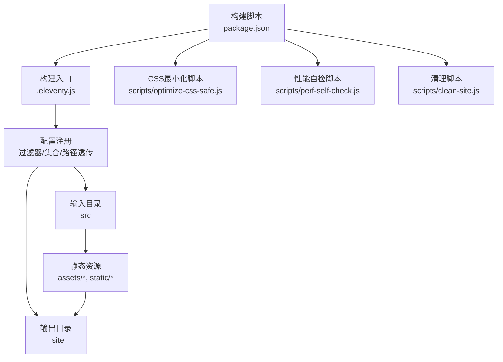
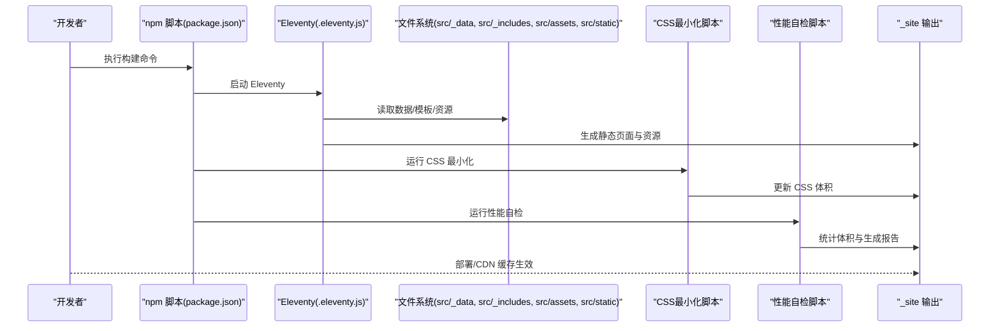
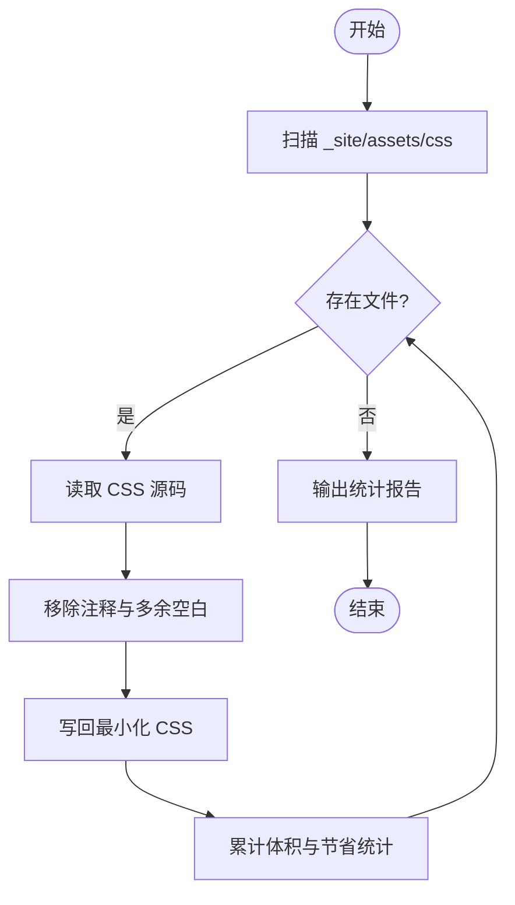
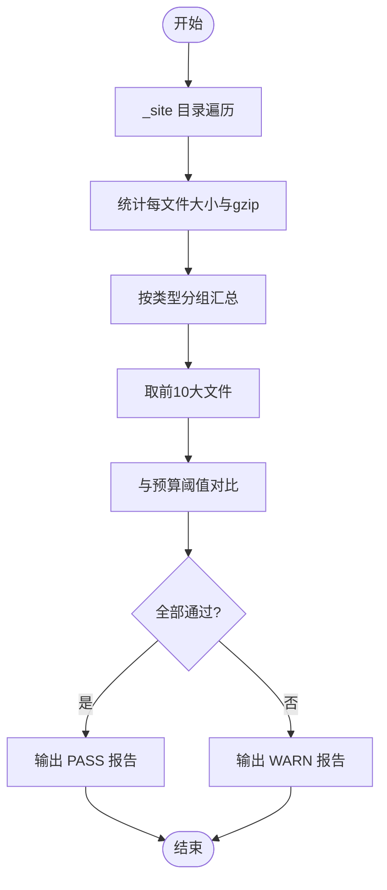
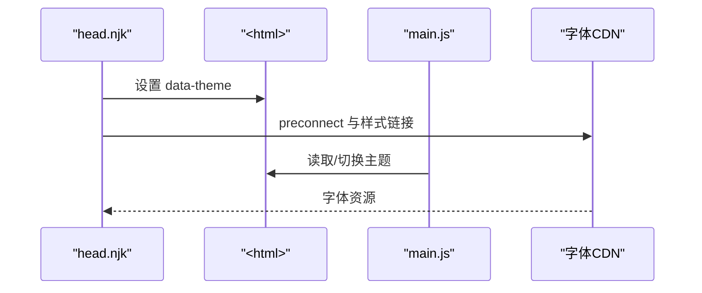
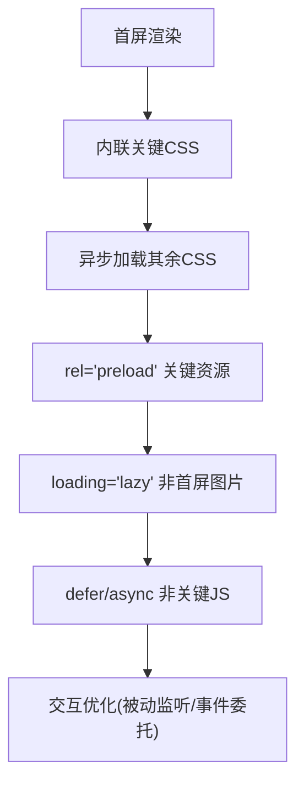
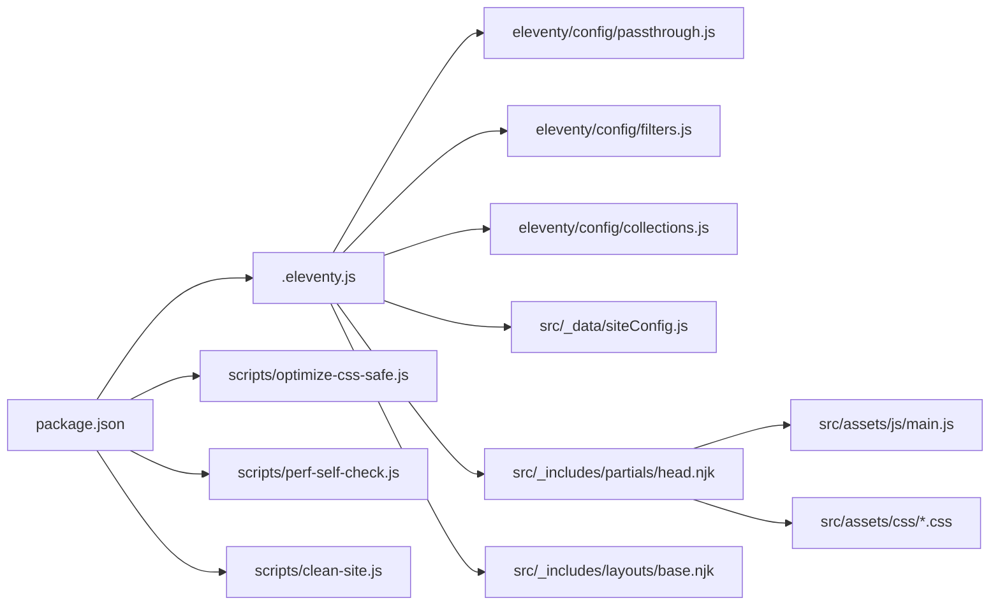

# 静态资源优化

<cite>
**本文引用的文件**
- [.eleventy.js](file://.eleventy.js)
- [package.json](file://package.json)
- [eleventy/config/passthrough.js](file://eleventy/config/passthrough.js)
- [eleventy/config/filters.js](file://eleventy/config/filters.js)
- [eleventy/config/collections.js](file://eleventy/config/collections.js)
- [src/_data/siteConfig.js](file://src/_data/siteConfig.js)
- [src/_includes/partials/head.njk](file://src/_includes/partials/head.njk)
- [src/_includes/layouts/base.njk](file://src/_includes/layouts/base.njk)
- [src/assets/js/main.js](file://src/assets/js/main.js)
- [src/assets/css/style.css](file://src/assets/css/style.css)
- [src/assets/css/foundation.css](file://src/assets/css/foundation.css)
- [src/assets/css/pages/post.css](file://src/assets/css/pages/post.css)
- [scripts/optimize-css-safe.js](file://scripts/optimize-css-safe.js)
- [scripts/perf-self-check.js](file://scripts/perf-self-check.js)
- [scripts/clean-site.js](file://scripts/clean-site.js)
</cite>

## 目录
1. [引言](#引言)
2. [项目结构](#项目结构)
3. [核心组件](#核心组件)
4. [架构总览](#架构总览)
5. [详细组件分析](#详细组件分析)
6. [依赖关系分析](#依赖关系分析)
7. [性能考量](#性能考量)
8. [故障排查指南](#故障排查指南)
9. [结论](#结论)
10. [附录](#附录)

## 引言
本文件围绕静态资源优化策略进行系统化梳理，结合 Eleventy 构建流程与现有实现，给出图片压缩、字体优化、媒体文件处理、缓存策略、CDN 集成、资源加载性能优化（懒加载、预加载、优先级排序）以及多部署环境下的配置建议。文档同时总结了项目中已有的 CSS 最小化与体积监控能力，并提供可扩展的优化路径。

## 项目结构
项目采用 Eleventy 的标准目录组织，静态资源主要位于 src/assets 与 src/static，构建输出至 _site。构建脚本通过 package.json 中的 npm scripts 驱动，包含清理、同步元数据、构建、CSS 最小化与性能自检等步骤。

图表来源
- [.eleventy.js:11-145](file://.eleventy.js#L11-L145)
- [package.json:6-16](file://package.json#L6-L16)
- [eleventy/config/passthrough.js:1-7](file://eleventy/config/passthrough.js#L1-L7)

章节来源
- [.eleventy.js:11-145](file://.eleventy.js#L11-L145)
- [package.json:6-16](file://package.json#L6-L16)
- [eleventy/config/passthrough.js:1-7](file://eleventy/config/passthrough.js#L1-L7)

## 核心组件
- 构建配置与目录映射：Eleventy 主配置定义输入/输出目录、插件注册、全局数据计算与 Markdown 库；路径透传配置将 src/assets 与 src/static 直接复制到输出目录。
- 资源引用与版本控制：头部模板通过查询参数附加版本标记，便于浏览器缓存失效与增量发布。
- CSS 处理管线：构建后对 _site/assets/css 下的 CSS 文件进行安全最小化，统计前后体积与节省比例。
- 性能自检：遍历 _site 目录，按类型统计体积、最大单文件、gzip 后大小，并与预算阈值对比生成报告。
- 运行时资源：JavaScript 在页面底部加载，配合 CSS 主题切换与图片灯箱等交互。

章节来源
- [.eleventy.js:11-145](file://.eleventy.js#L11-L145)
- [eleventy/config/passthrough.js:1-7](file://eleventy/config/passthrough.js#L1-L7)
- [src/_includes/partials/head.njk:8-26](file://src/_includes/partials/head.njk#L8-L26)
- [scripts/optimize-css-safe.js:82-112](file://scripts/optimize-css-safe.js#L82-L112)
- [scripts/perf-self-check.js:10-16](file://scripts/perf-self-check.js#L10-L16)

## 架构总览
下图展示了从构建到运行时的关键资源流转与优化点：

图表来源
- [package.json:6-16](file://package.json#L6-L16)
- [.eleventy.js:11-145](file://.eleventy.js#L11-L145)
- [scripts/optimize-css-safe.js:82-112](file://scripts/optimize-css-safe.js#L82-L112)
- [scripts/perf-self-check.js:170-199](file://scripts/perf-self-check.js#L170-L199)

## 详细组件分析

### CSS 最小化与体积统计
- 实现机制：递归扫描 _site/assets/css，逐文件去除注释与多余空白，写回并统计前后字节数与节省百分比。
- 适用场景：构建后对已产出的 CSS 进行安全压缩，减少传输体积。
- 注意事项：确保在 Eleventy 生成后再执行，避免覆盖未压缩产物。

图表来源
- [scripts/optimize-css-safe.js:6-23](file://scripts/optimize-css-safe.js#L6-L23)
- [scripts/optimize-css-safe.js:25-76](file://scripts/optimize-css-safe.js#L25-L76)
- [scripts/optimize-css-safe.js:82-112](file://scripts/optimize-css-safe.js#L82-L112)

章节来源
- [scripts/optimize-css-safe.js:6-112](file://scripts/optimize-css-safe.js#L6-L112)

### 性能自检与体积预算
- 实现机制：遍历 _site 目录，按扩展名分类统计原始与 gzip 体积，筛选前 10 大文件，与 HTML/CSS/JS/单文件预算对比。
- 报告维度：总文件数、总大小、gzip 总大小、各类别占比、前 10 大文件明细。
- 使用建议：将预算阈值纳入 CI 校验，触发告警或阻断发布。

图表来源
- [scripts/perf-self-check.js:17-29](file://scripts/perf-self-check.js#L17-L29)
- [scripts/perf-self-check.js:50-126](file://scripts/perf-self-check.js#L50-L126)
- [scripts/perf-self-check.js:170-199](file://scripts/perf-self-check.js#L170-L199)

章节来源
- [scripts/perf-self-check.js:10-16](file://scripts/perf-self-check.js#L10-L16)
- [scripts/perf-self-check.js:50-126](file://scripts/perf-self-check.js#L50-L126)
- [scripts/perf-self-check.js:170-199](file://scripts/perf-self-check.js#L170-L199)

### 资源引用与版本控制
- 版本策略：头部模板为 CSS 资源附加查询参数版本标记，便于浏览器缓存失效与增量发布。
- 主题切换：通过脚本在 <html> 上设置 data-theme 属性，实现明暗主题切换。
- 字体加载：通过 preconnect 与外部字体服务建立连接，提升字体加载性能。

图表来源
- [src/_includes/partials/head.njk:8-26](file://src/_includes/partials/head.njk#L8-L26)
- [src/_includes/partials/head.njk:11-21](file://src/_includes/partials/head.njk#L11-L21)
- [src/_includes/layouts/base.njk:15-17](file://src/_includes/layouts/base.njk#L15-L17)
- [src/assets/js/main.js:1-12](file://src/assets/js/main.js#L1-L12)

章节来源
- [src/_includes/partials/head.njk:8-26](file://src/_includes/partials/head.njk#L8-L26)
- [src/_includes/layouts/base.njk:15-17](file://src/_includes/layouts/base.njk#L15-L17)
- [src/assets/js/main.js:1-12](file://src/assets/js/main.js#L1-L12)

### 图片与媒体资源处理
- 当前状态：项目中存在图片灯箱交互与图片点击放大逻辑，但未发现专门的图片压缩或格式转换脚本。
- 推荐实践（概念性说明）：
  - 图片压缩：在构建前使用工具链对 PNG/JPG/WebP/AVIF 进行有损/无损压缩与尺寸裁剪。
  - 响应式图片：使用 srcset 与 sizes 或现代 picture 元素，按视口密度与宽度选择最优资源。
  - 渐进式图片：启用 webp/avif 并提供回退格式，结合占位图与低分辨率首屏图。
  - 懒加载：为非首屏图片添加 loading="lazy" 与 IntersectionObserver 降权加载。
  - 预加载：对关键首屏图片使用 <link rel="prefetch/preload"> 提前获取。
- 与现有代码的衔接：可在构建脚本中插入图片处理任务，并在模板中按需输出 srcset 与格式回退。

[本节为通用实践说明，不直接分析具体文件，故无“章节来源”]

### 字体优化
- 当前状态：通过外部字体服务加载字体，使用 preconnect 提升连接速度。
- 推荐实践（概念性说明）：
  - 子集化：仅加载页面实际使用的字符子集，显著减少体积。
  - 字体显示策略：合理设置 font-display（如 swap/fallback），避免 FOIT。
  - 自托管：将关键字体自托管于 CDN，结合 HTTP 缓存与版本号。
  - 字体回退：提供系统字体作为回退，保证降级体验。
- 与现有代码的衔接：可在头部模板中替换字体链接与缓存策略，或在构建后对字体资源进行压缩与格式优化。

[本节为通用实践说明，不直接分析具体文件，故无“章节来源”]

### 缓存策略与版本控制
- 查询参数版本：CSS 资源附加版本参数，实现强缓存与失效控制。
- 构建后最小化：通过脚本更新 CSS 内容，结合版本号形成新指纹。
- 建议补充：
  - HTTP 缓存头：静态资源设置长 TTL（如一年），HTML 设置短 TTL 或 no-cache。
  - ETag/Last-Modified：结合版本号生成唯一指纹，提升协商缓存命中率。
  - CDN 缓存：利用 CDN 的边缘缓存与压缩能力，开启 Brotli/Gzip。
  - 资源分组：CSS/JS/字体/图片按类型设置不同缓存策略与失效周期。

[本节为通用实践说明，不直接分析具体文件，故无“章节来源”]

### CDN 集成与静态资源托管
- 当前状态：字体资源指向外部 CDN，便于跨域与加速。
- 推荐实践（概念性说明）：
  - 全站静态资源迁移至自有 CDN，统一缓存与压缩策略。
  - 使用对象存储 + CDN 的组合，结合全球节点与边缘计算。
  - 配置缓存键：以文件内容哈希为键，避免版本混淆。
  - 安全与监控：启用 HTTPS、访问日志与带宽/请求监控。
- 与现有代码的衔接：修改模板中的资源链接为 CDN 域名，并在构建脚本中输出对应路径。

[本节为通用实践说明，不直接分析具体文件，故无“章节来源”]

### 资源加载性能优化
- 懒加载：对非首屏图片与 iframe 使用 loading="lazy"，并在滚动时按需加载。
- 预加载与预连接：对关键字体与首屏资源使用 rel="preload/preconnect"。
- 优先级排序：将关键 CSS 内联，其余 CSS 异步加载；将非关键 JS defer/async。
- 交互优化：图片灯箱与目录导航使用事件委托与被动监听，减少主线程压力。

图表来源
- [src/_includes/partials/head.njk:5-7](file://src/_includes/partials/head.njk#L5-L7)
- [src/_includes/layouts/base.njk:15-17](file://src/_includes/layouts/base.njk#L15-L17)
- [src/assets/js/main.js:496-792](file://src/assets/js/main.js#L496-L792)

章节来源
- [src/_includes/partials/head.njk:5-7](file://src/_includes/partials/head.njk#L5-L7)
- [src/_includes/layouts/base.njk:15-17](file://src/_includes/layouts/base.njk#L15-L17)
- [src/assets/js/main.js:496-792](file://src/assets/js/main.js#L496-L792)

### 不同部署环境下的优化配置示例
- 本地开发：禁用 CSS 最小化与体积检查，启用热更新与调试信息。
- 预发布/测试：启用 CSS 最小化与性能自检，输出报告供评审。
- 生产环境：启用 CDN、长缓存、压缩与版本号，结合 ETag 协商缓存。
- 多站点/多语言：按站点或语言生成独立版本号，避免缓存污染。

[本节为通用实践说明，不直接分析具体文件，故无“章节来源”]

## 依赖关系分析
- 构建脚本依赖：package.json 的 scripts 串联 Eleventy、清理、CSS 最小化与性能自检。
- Eleventy 配置依赖：路径透传、过滤器、集合与全局数据计算共同决定资源与页面生成。
- 运行时依赖：头部模板与布局模板决定资源加载顺序与缓存策略。

图表来源
- [package.json:6-16](file://package.json#L6-L16)
- [.eleventy.js:7-29](file://.eleventy.js#L7-L29)
- [eleventy/config/passthrough.js:1-7](file://eleventy/config/passthrough.js#L1-L7)
- [eleventy/config/filters.js:1-49](file://eleventy/config/filters.js#L1-L49)
- [eleventy/config/collections.js:1-377](file://eleventy/config/collections.js#L1-L377)
- [src/_data/siteConfig.js:1](file://src/_data/siteConfig.js#L1)
- [src/_includes/partials/head.njk:8-26](file://src/_includes/partials/head.njk#L8-L26)
- [src/_includes/layouts/base.njk:15-17](file://src/_includes/layouts/base.njk#L15-L17)
- [src/assets/js/main.js:1-12](file://src/assets/js/main.js#L1-L12)

章节来源
- [package.json:6-16](file://package.json#L6-L16)
- [.eleventy.js:7-29](file://.eleventy.js#L7-L29)
- [eleventy/config/passthrough.js:1-7](file://eleventy/config/passthrough.js#L1-L7)
- [eleventy/config/filters.js:1-49](file://eleventy/config/filters.js#L1-L49)
- [eleventy/config/collections.js:1-377](file://eleventy/config/collections.js#L1-L377)
- [src/_data/siteConfig.js:1](file://src/_data/siteConfig.js#L1)
- [src/_includes/partials/head.njk:8-26](file://src/_includes/partials/head.njk#L8-L26)
- [src/_includes/layouts/base.njk:15-17](file://src/_includes/layouts/base.njk#L15-L17)
- [src/assets/js/main.js:1-12](file://src/assets/js/main.js#L1-L12)

## 性能考量
- 构建后最小化：对已产出的 CSS 进行安全压缩，减少传输体积，建议在 CI 中保留此步骤。
- 体积预算：通过性能自检设定预算阈值，防止资源膨胀影响加载性能。
- 运行时优化：图片懒加载、字体预连接、关键 CSS 内联与非关键 JS 异步加载。
- 缓存策略：结合版本号与 CDN 长缓存，提升二次访问性能。

[本节提供通用指导，不直接分析具体文件，故无“章节来源”]

## 故障排查指南
- 构建失败或缺少输出：确认构建脚本顺序与 Eleventy 配置，检查清理脚本是否误删中间产物。
- CSS 体积异常：检查最小化脚本是否正确扫描 _site/assets/css，确认构建后执行顺序。
- 性能自检失败：根据报告定位超预算文件，优化其体积或拆分加载。
- 字体加载慢：检查 preconnect 是否生效，必要时引入字体子集与回退策略。

章节来源
- [scripts/clean-site.js:6-11](file://scripts/clean-site.js#L6-L11)
- [scripts/optimize-css-safe.js:82-112](file://scripts/optimize-css-safe.js#L82-L112)
- [scripts/perf-self-check.js:170-199](file://scripts/perf-self-check.js#L170-L199)

## 结论
本项目已具备构建后 CSS 最小化与体积监控的基础能力。建议在此基础上进一步完善图片与字体的自动化优化、HTTP 缓存与 CDN 策略、以及资源加载优先级与懒加载体系，从而在多环境下实现稳定、高效的静态资源交付。

## 附录
- 样式组织：foundation.css 定义主题变量与基础样式，style.css 通过 @import 组织页面样式，post.css 专注文章页布局与交互。
- 数据与模板：siteConfig.js 提供全局配置，head.njk 与 base.njk 决定资源加载与页面骨架。

章节来源
- [src/assets/css/style.css:1-6](file://src/assets/css/style.css#L1-L6)
- [src/assets/css/foundation.css:1-200](file://src/assets/css/foundation.css#L1-L200)
- [src/assets/css/pages/post.css:1-200](file://src/assets/css/pages/post.css#L1-L200)
- [src/_data/siteConfig.js:1](file://src/_data/siteConfig.js#L1)
- [src/_includes/partials/head.njk:8-26](file://src/_includes/partials/head.njk#L8-L26)
- [src/_includes/layouts/base.njk:15-17](file://src/_includes/layouts/base.njk#L15-L17)