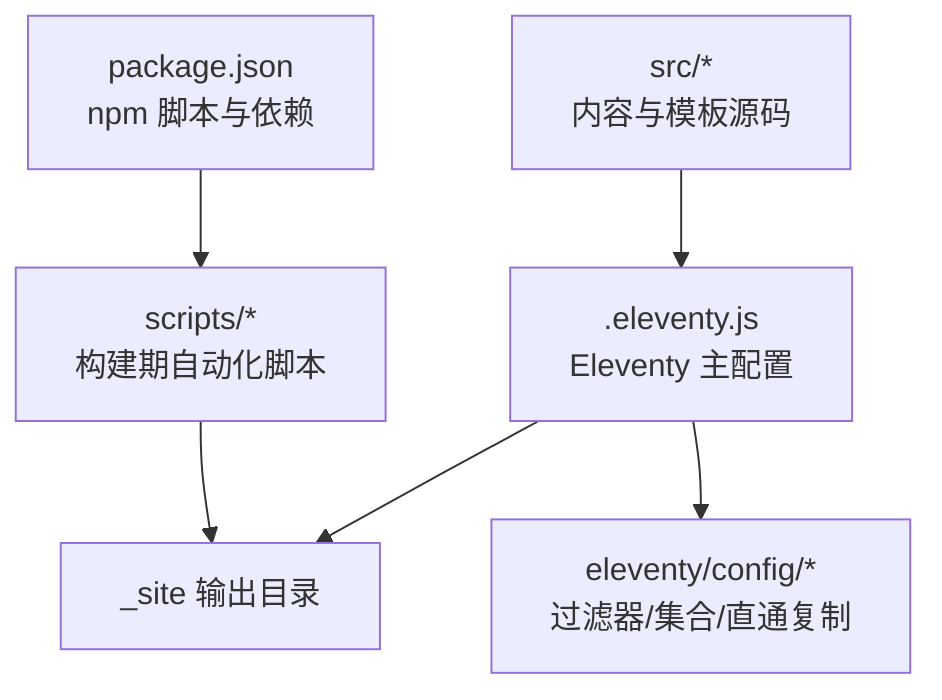
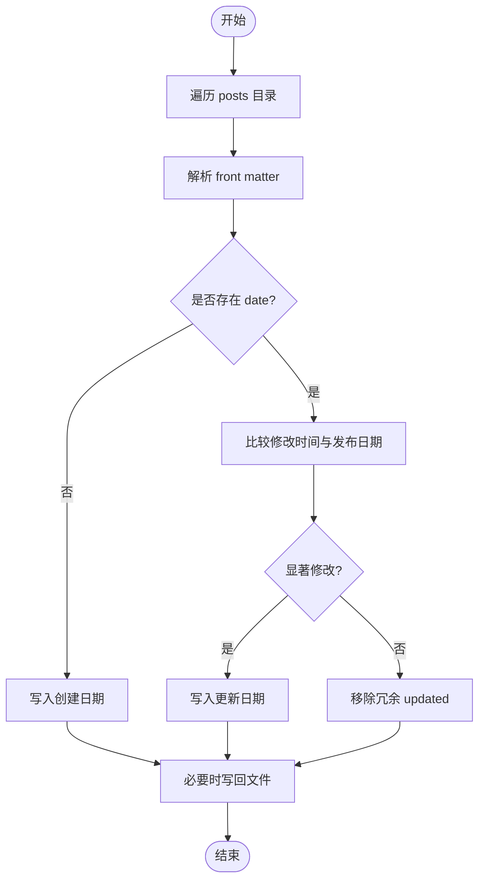
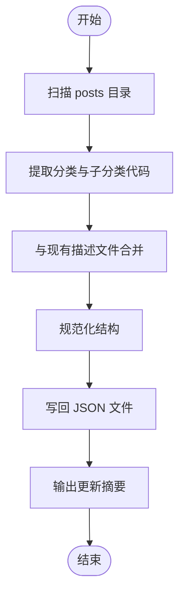
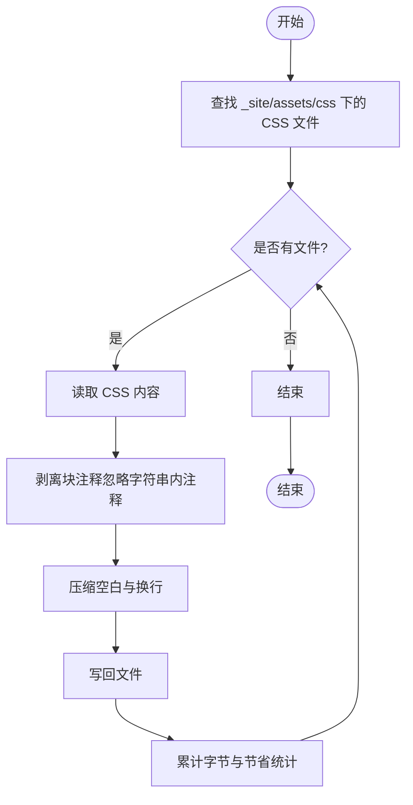
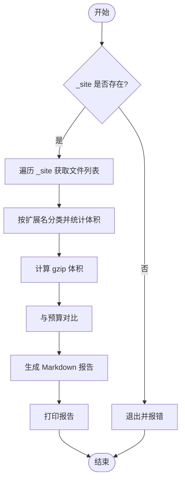
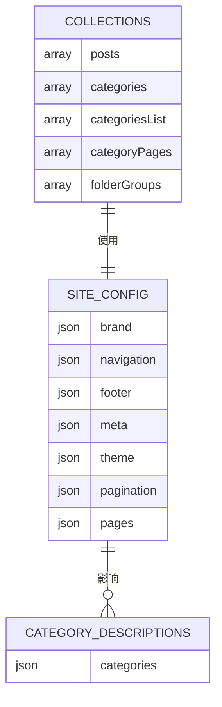
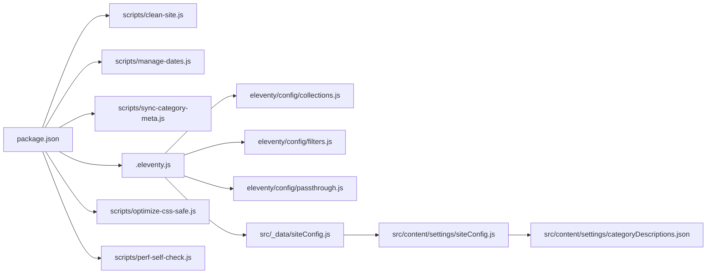

# 构建与部署

<cite>
**本文引用的文件**   
- [package.json](file://package.json)
- [.eleventy.js](file://.eleventy.js)
- [scripts/clean-site.js](file://scripts/clean-site.js)
- [scripts/optimize-css-safe.js](file://scripts/optimize-css-safe.js)
- [scripts/perf-self-check.js](file://scripts/perf-self-check.js)
- [scripts/manage-dates.js](file://scripts/manage-dates.js)
- [scripts/sync-category-meta.js](file://scripts/sync-category-meta.js)
- [scripts/manage-categories.js](file://scripts/manage-categories.js)
- [eleventy/config/filters.js](file://eleventy/config/filters.js)
- [eleventy/config/collections.js](file://eleventy/config/collections.js)
- [eleventy/config/passthrough.js](file://eleventy/config/passthrough.js)
- [src/_data/siteConfig.js](file://src/_data/siteConfig.js)
- [src/content/settings/siteConfig.js](file://src/content/settings/siteConfig.js)
- [src/content/settings/categoryDescriptions.json](file://src/content/settings/categoryDescriptions.json)
- [README.md](file://README.md)
- [docs/本地写作与构建指南.md](file://docs/本地写作与构建指南.md)
</cite>

## 目录
1. [简介](#简介)
2. [项目结构](#项目结构)
3. [核心组件](#核心组件)
4. [架构总览](#架构总览)
5. [详细组件分析](#详细组件分析)
6. [依赖关系分析](#依赖关系分析)
7. [性能考量](#性能考量)
8. [故障排除指南](#故障排除指南)
9. [结论](#结论)
10. [附录](#附录)

## 简介
本文件系统性梳理 11ty RainyNight 的构建与部署体系，覆盖从开发到生产的完整流程与优化策略。重点包括：
- npm 脚本的执行顺序与职责划分（清理、同步、构建、优化、性能检查）
- 自动化脚本的设计与实现（CSS 优化、日期管理、元数据同步）
- 部署最佳实践（静态托管平台选择与配置要点）
- 性能优化策略（资源压缩、缓存与加载优化）
- CI/CD 集成建议与示例
- 部署故障排除与监控方案

## 项目结构
项目采用“内容驱动 + Eleventy 静态生成”的组织方式，核心目录与职责如下：
- src：内容与模板源码，包含数据、布局、页面与资源
- scripts：构建期自动化脚本（日期、分类元数据、CSS 优化、性能检查等）
- eleventy/config：Eleventy 插件、过滤器、集合与直通复制配置
- tests：主题逻辑测试（可扩展）
- docs：本地写作与构建指南
- 根目录配置：package.json（脚本与依赖）、.eleventy.js（Eleventy 主配置）



图表来源
- [package.json:1-35](file://package.json#L1-L35)
- [.eleventy.js:36-181](file://.eleventy.js#L36-L181)
- [eleventy/config/passthrough.js:1-7](file://eleventy/config/passthrough.js#L1-L7)

章节来源
- [README.md:1-137](file://README.md#L1-L137)
- [docs/本地写作与构建指南.md:1-98](file://docs/本地写作与构建指南.md#L1-L98)

## 核心组件
- 构建脚本链路：通过 npm run build 统一调度，串联清理、同步、Eleventy 构建、CSS 优化与性能自检。
- Eleventy 配置：注册语法高亮、Mermaid、Markdown 扩展库；配置输入/输出目录、直通复制、全局计算数据与集合。
- 自动化脚本：日期管理（自动补全/更新文章日期）、分类元数据同步（扫描文章生成/规范化分类描述）、CSS 安全压缩、构建性能自检。
- 数据与配置：站点全局配置、分类描述、过滤器与集合用于渲染与导航。

章节来源
- [package.json:6-16](file://package.json#L6-L16)
- [.eleventy.js:36-181](file://.eleventy.js#L36-L181)
- [scripts/manage-dates.js:1-85](file://scripts/manage-dates.js#L1-L85)
- [scripts/sync-category-meta.js:1-205](file://scripts/sync-category-meta.js#L1-L205)
- [scripts/optimize-css-safe.js:1-112](file://scripts/optimize-css-safe.js#L1-L112)
- [scripts/perf-self-check.js:1-199](file://scripts/perf-self-check.js#L1-L199)
- [eleventy/config/filters.js:1-43](file://eleventy/config/filters.js#L1-L43)
- [eleventy/config/collections.js:1-377](file://eleventy/config/collections.js#L1-L377)
- [src/content/settings/siteConfig.js:1-168](file://src/content/settings/siteConfig.js#L1-L168)
- [src/content/settings/categoryDescriptions.json:1-60](file://src/content/settings/categoryDescriptions.json#L1-L60)

## 架构总览
下图展示了生产构建的端到端流程，从 npm 脚本到 Eleventy 生成，再到资源优化与性能检查。

```mermaid
sequenceDiagram
participant Dev as "开发者"
participant NPM as "npm 脚本"
participant Clean as "clean-site.js"
participant Dates as "manage-dates.js"
participant Sync as "sync-category-meta.js"
participant Eleventy as "Eleventy 构建"
participant Opt as "optimize-css-safe.js"
participant Perf as "perf-self-check.js"
Dev->>NPM : 运行 npm run build
NPM->>Clean : 清理旧输出目录
NPM->>Dates : 更新文章日期元数据
NPM->>Sync : 同步分类元数据
NPM->>Eleventy : 执行静态生成
Eleventy-->>NPM : 生成 _site
NPM->>Opt : 压缩 CSS 资源
NPM->>Perf : 生成构建性能报告
Perf-->>Dev : 输出报告与统计
```

图表来源
- [package.json:6-16](file://package.json#L6-L16)
- [scripts/clean-site.js:1-11](file://scripts/clean-site.js#L1-L11)
- [scripts/manage-dates.js:1-85](file://scripts/manage-dates.js#L1-L85)
- [scripts/sync-category-meta.js:1-205](file://scripts/sync-category-meta.js#L1-L205)
- [scripts/optimize-css-safe.js:1-112](file://scripts/optimize-css-safe.js#L1-L112)
- [scripts/perf-self-check.js:1-199](file://scripts/perf-self-check.js#L1-L199)

## 详细组件分析

### npm 脚本与执行顺序
- 清理：clean:site 调用 clean-site.js 删除 _site 目录，确保干净构建。
- 预构建：prebuild 调用 update-dates，自动补全/更新文章的创建与修改日期。
- 构建：build 串行执行 clean:site、sync-meta、eleventy、optimize-css-safe、perf-self-check。
- 元数据同步：sync-meta 扫描文章生成/规范化分类描述文件。
- CSS 优化：optimize-css-safe 安全压缩 CSS 并统计体积节省。
- 性能检查：perf-self-check 对 _site 进行体积与预算对比，生成报告。
- 开发：start 启动 Eleventy 开发服务器；debug 使用 DEBUG 环境变量开启调试日志。

章节来源
- [package.json:6-16](file://package.json#L6-L16)
- [README.md:85-117](file://README.md#L85-L117)
- [docs/本地写作与构建指南.md:65-78](file://docs/本地写作与构建指南.md#L65-L78)

### Eleventy 主配置与数据层
- 插件与库：注册语法高亮、Mermaid、Markdown 扩展（脚注、GitHub Alerts）。
- 目录结构：输入 src、输出 _site、包含目录 _includes、数据目录 _data。
- 直通复制：将 src/assets 与 src/static 直接复制到输出目录，保证静态资源原样发布。
- 全局计算数据：针对文章类型（posts）自动推导 title、subcategory、layout、permalink、publishDate、updated、tags、bodyClass、pageStyles 等。
- 验证与规范：校验文章文件名必须包含 @ 符号；缺失 slug 时提示；自动设置文章布局与永久链接。
- Markdown 配置：启用 HTML、换行、链接识别等选项。

章节来源
- [.eleventy.js:36-181](file://.eleventy.js#L36-L181)
- [eleventy/config/passthrough.js:1-7](file://eleventy/config/passthrough.js#L1-L7)

### 过滤器与集合
- 过滤器：提供日期格式化（可读日期、HTML 日期字符串、年份、归档月份与标签）、根据站点标题格式化页面标题。
- 集合：
  - posts：筛选所有文章并按日期倒序。
  - categories：按层级路径聚合文章，支持父子节点与计数。
  - categoriesList：基于分类元数据构建树形节点，包含元信息与子分类。
  - categoryPages：按分页大小生成分类详情页，含面包屑、子分类列表与分页信息。
  - folderGroups：按顶层分类与子分类聚合，结合元数据生成展示信息。

章节来源
- [eleventy/config/filters.js:1-43](file://eleventy/config/filters.js#L1-L43)
- [eleventy/config/collections.js:219-371](file://eleventy/config/collections.js#L219-L371)

### 自动化脚本设计与实现

#### 日期管理（manage-dates.js）
- 功能目标：为文章自动补全创建日期（来自文件创建时间），并在显著修改后更新“updated”字段，否则移除冗余字段。
- 关键流程：
  - 遍历 src/content/posts 下所有 .md 文件
  - 读取 front matter，判断是否需要添加/更新/移除 date 与 updated
  - 使用灰度 YAML 解析与 stringify 仅在内容实际变化时写回
- 复杂度：O(N) 遍历，N 为文章数量；I/O 为主。



图表来源
- [scripts/manage-dates.js:16-68](file://scripts/manage-dates.js#L16-L68)

章节来源
- [scripts/manage-dates.js:1-85](file://scripts/manage-dates.js#L1-L85)

#### 分类元数据同步（sync-category-meta.js）
- 功能目标：扫描文章，发现分类与子分类，同步至 src/content/settings/categoryDescriptions.json，并规范化结构。
- 关键流程：
  - 递归扫描 posts 子目录，提取顶层分类与子分类代码
  - 与现有描述文件合并，新增/删除条目，保持结构一致
  - 输出提示，引导用户补充 description
- 复杂度：O(N) 扫描文章；JSON 读写与对象操作开销低。



图表来源
- [scripts/sync-category-meta.js:36-204](file://scripts/sync-category-meta.js#L36-L204)

章节来源
- [scripts/sync-category-meta.js:1-205](file://scripts/sync-category-meta.js#L1-L205)

#### CSS 安全优化（optimize-css-safe.js）
- 功能目标：安全地剥离注释、压缩空白、写回 _site 中的 CSS，统计压缩前后字节与节省比例。
- 关键流程：
  - 递归遍历 _site/assets/css 下的 .css 文件
  - 去注释（区分字符串内引号）、去多余空白、保留必要换行
  - 计算字节数与节省百分比并输出统计
- 复杂度：O(T) 总字符数；I/O 与字符串处理为主。



图表来源
- [scripts/optimize-css-safe.js:66-112](file://scripts/optimize-css-safe.js#L66-L112)

章节来源
- [scripts/optimize-css-safe.js:1-112](file://scripts/optimize-css-safe.js#L1-L112)

#### 构建性能自检（perf-self-check.js）
- 功能目标：对 _site 进行全量扫描，统计各类资源体积、gzip 体积、最大单文件，与预算对比，生成 Markdown 报告。
- 关键流程：
  - 遍历 _site，按扩展名分类（html/css/js/image/font/other）
  - 计算原始与 gzip 体积，汇总 Top 10 最大文件
  - 与预算（HTML/CSS/JS 总量与最大单文件）对比，输出报告
- 复杂度：O(F) 文件数；gzip 计算为 O(S) 字节，总体 O(F+S)。



图表来源
- [scripts/perf-self-check.js:170-199](file://scripts/perf-self-check.js#L170-L199)

章节来源
- [scripts/perf-self-check.js:1-199](file://scripts/perf-self-check.js#L1-L199)

### 数据模型与站点配置
- 站点全局配置：品牌、导航、页脚、SEO 元数据、主题、分页参数与各页面文案。
- 分类描述：顶层分类与子分类的描述与名称映射，供分类页展示与 SEO 使用。
- 过滤器与集合：为模板渲染提供日期格式化与分类树形结构。



图表来源
- [src/content/settings/siteConfig.js:1-168](file://src/content/settings/siteConfig.js#L1-L168)
- [src/content/settings/categoryDescriptions.json:1-60](file://src/content/settings/categoryDescriptions.json#L1-L60)
- [eleventy/config/collections.js:219-371](file://eleventy/config/collections.js#L219-L371)

章节来源
- [src/_data/siteConfig.js:1-2](file://src/_data/siteConfig.js#L1-L2)
- [src/content/settings/siteConfig.js:1-168](file://src/content/settings/siteConfig.js#L1-L168)
- [src/content/settings/categoryDescriptions.json:1-60](file://src/content/settings/categoryDescriptions.json#L1-L60)
- [eleventy/config/collections.js:1-377](file://eleventy/config/collections.js#L1-L377)

## 依赖关系分析
- npm 脚本依赖：build 串行依赖 clean:site、update-dates、sync-meta、eleventy、optimize-css-safe、perf-self-check。
- Eleventy 依赖：语法高亮、Mermaid、Markdown 扩展、gray-matter、luxon。
- 构建脚本依赖：node:fs、node:path、node:zlib、gray-matter、luxon。



图表来源
- [package.json:6-16](file://package.json#L6-L16)
- [.eleventy.js:36-181](file://.eleventy.js#L36-L181)
- [eleventy/config/collections.js:1-377](file://eleventy/config/collections.js#L1-L377)
- [eleventy/config/filters.js:1-43](file://eleventy/config/filters.js#L1-L43)
- [eleventy/config/passthrough.js:1-7](file://eleventy/config/passthrough.js#L1-L7)
- [src/_data/siteConfig.js:1-2](file://src/_data/siteConfig.js#L1-L2)
- [src/content/settings/siteConfig.js:1-168](file://src/content/settings/siteConfig.js#L1-L168)
- [src/content/settings/categoryDescriptions.json:1-60](file://src/content/settings/categoryDescriptions.json#L1-L60)

章节来源
- [package.json:22-33](file://package.json#L22-L33)
- [.eleventy.js:4-11](file://.eleventy.js#L4-L11)

## 性能考量
- 资源压缩
  - CSS：在构建完成后对 _site 中的 CSS 进行安全压缩，剥离注释与多余空白，减少传输体积。
  - 图片与字体：通过直通复制保留源文件，建议在 CI 中引入图片压缩与字体子集化工具（如 imagemin、sharp、fontmin）以进一步优化。
- 缓存策略
  - 静态托管平台应启用强缓存（如一年）于哈希命名的资源（CSS/JS/图片），并对 HTML 设置较短缓存或协商缓存。
  - 版本查询参数（如样式文件中的版本号）可用于失效控制。
- 加载优化
  - 按需加载：将非首屏 CSS 延迟加载，JavaScript 异步化与拆分。
  - 预连接与预加载：对关键字体与图标资源进行预连接与预加载。
  - 响应式图片：提供多尺寸与格式（WebP/AVIF），按视口选择最优资源。
- 预检与预算
  - 构建期预算检查（HTML/CSS/JS 总量与最大单文件）帮助维持性能基线，避免回归。

## 故障排除指南
- 构建失败：检查 _site 是否存在、权限是否足够、磁盘空间是否充足。
- 文章未生成或链接异常：确认文章文件名包含 @ 符号且符合“标题@分类ID.md”格式；检查 front matter 是否覆盖了 slug 或 permalink 导致路径异常。
- 分类描述未生效：运行 sync-meta 同步分类结构，再在 categoryDescriptions.json 补充 description。
- CSS 未压缩：确认 optimize-css-safe.js 已执行且 _site/assets/css 存在；检查权限与文件是否被后续构建覆盖。
- 性能自检不通过：关注最大单文件与总量超限项，优先优化图片与脚本体积；考虑拆分与懒加载。
- 开发服务器无法热更新：确认监听端口未被占用，依赖安装完整，Eleventy 版本兼容。

章节来源
- [scripts/perf-self-check.js:170-199](file://scripts/perf-self-check.js#L170-L199)
- [.eleventy.js:56-72](file://.eleventy.js#L56-L72)
- [README.md:118-137](file://README.md#L118-L137)

## 结论
本项目通过 npm 脚本与一组专用自动化脚本，将内容创作、元数据管理、静态生成、资源优化与性能自检整合为一条可靠的构建流水线。Eleventy 配置与集合/过滤器进一步提升了渲染一致性与可维护性。配合合理的静态托管与缓存策略，可稳定产出高性能的静态站点。

## 附录

### 部署最佳实践
- 静态托管平台选择
  - GitHub Pages、Vercel、Cloudflare Pages、Netlify 等均支持静态站点部署。
  - 推荐启用：
    - 自动构建与部署（CI 触发）
    - HTTPS 与强制跳转
    - CDN 加速与边缘缓存
    - 自定义域名与 404 页面
- 构建产物
  - 上传 _site 目录全部文件；确保直通复制的静态资源（如 robots.txt、favicon 等）已包含。
- 缓存与版本
  - 对带哈希的资源（CSS/JS/图片）设置长缓存；对 HTML 设置短缓存或协商缓存。
  - 使用版本查询参数或文件名哈希作为失效手段。

### CI/CD 集成建议
- 触发条件
  - 推送至 main 分支或创建标签时触发构建。
- 步骤建议
  - 安装依赖（npm ci）
  - 运行构建脚本（npm run build）
  - 上传构建产物到托管平台（如使用官方部署 Action）
- 示例（Vercel/Netlify/GitHub Actions）
  - Vercel：无需额外配置，直接连接仓库；构建产物目录指向根目录或 _site。
  - Netlify：配置构建命令与发布目录；启用缓存与 CDN。
  - GitHub Actions：使用 actions/checkout、actions/setup-node、部署到目标平台的 Action。

### 监控与回归防护
- 构建性能报告：定期审阅 perf-self-check 生成的报告，关注总量与最大单文件趋势。
- 自动化检查：在 CI 中加入性能预算失败即阻断发布的策略。
- 日志与回滚：保留构建日志与产物快照，便于定位问题与回滚。