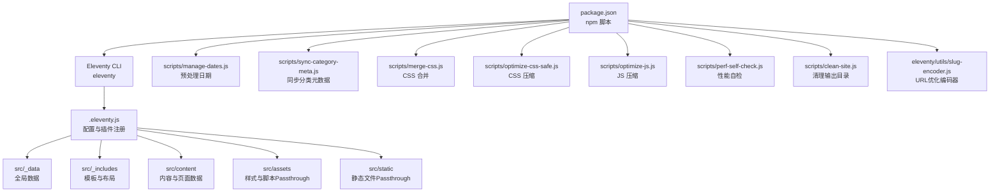
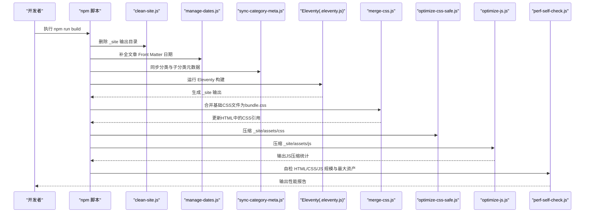
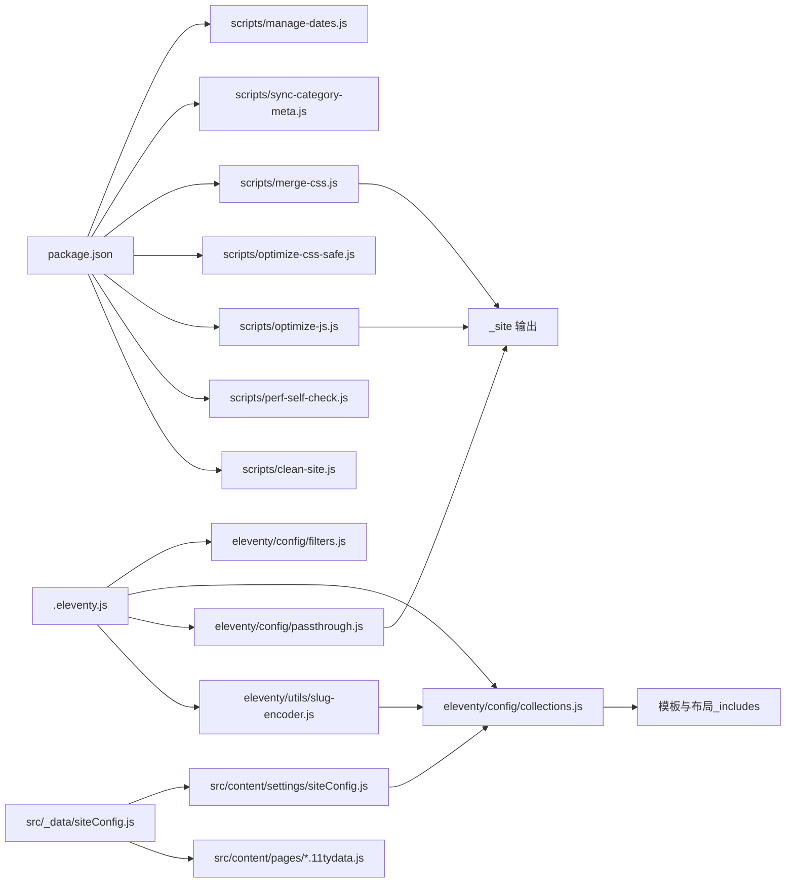

# 构建流程

<cite>
**本文引用的文件**
- [package.json](file://package.json)
- [.eleventy.js](file://.eleventy.js)
- [scripts/clean-site.js](file://scripts/clean-site.js)
- [scripts/manage-dates.js](file://scripts/manage-dates.js)
- [scripts/sync-category-meta.js](file://scripts/sync-category-meta.js)
- [scripts/merge-css.js](file://scripts/merge-css.js)
- [scripts/optimize-css-safe.js](file://scripts/optimize-css-safe.js)
- [scripts/optimize-js.js](file://scripts/optimize-js.js)
- [scripts/perf-self-check.js](file://scripts/perf-self-check.js)
- [eleventy/config/filters.js](file://eleventy/config/filters.js)
- [eleventy/config/collections.js](file://eleventy/config/collections.js)
- [eleventy/config/passthrough.js](file://eleventy/config/passthrough.js)
- [eleventy/utils/slug-encoder.js](file://eleventy/utils/slug-encoder.js)
- [src/_data/siteConfig.js](file://src/_data/siteConfig.js)
- [src/content/settings/siteConfig.js](file://src/content/settings/siteConfig.js)
- [src/content/settings/categoryDescriptions.json](file://src/content/settings/categoryDescriptions.json)
- [src/content/pages/archive.11tydata.js](file://src/content/pages/archive.11tydata.js)
- [src/content/pages/pages.11tydata.js](file://src/content/pages/pages.11tydata.js)
</cite>

## 目录
1. [简介](#简介)
2. [项目结构](#项目结构)
3. [核心组件](#核心组件)
4. [架构总览](#架构总览)
5. [详细组件分析](#详细组件分析)
6. [依赖分析](#依赖分析)
7. [性能考量](#性能考量)
8. [故障排查指南](#故障排查指南)
9. [结论](#结论)
10. [附录](#附录)

## 简介
本文件系统性梳理 11ty RainyNight 的构建生命周期，覆盖从开发环境启动到生产构建的完整流程。重点解释 npm 脚本的执行顺序与依赖关系（含 prebuild 钩子）、清理任务、同步任务与核心构建步骤；深入阐述 Eleventy 构建过程中的输入文件处理、数据层合并、模板渲染与输出生成；说明构建配置文件的作用与参数设置；并提供调试方法、常见问题解决方案与性能优化建议。

**更新** 本次更新包含了新的性能优化步骤和URL优化集成，包括CSS合并、JS压缩和BV风格短ID编码的URL优化。

## 项目结构
该项目采用"内容驱动 + Eleventy 静态生成"的典型结构：
- 输入目录：src（包含内容、模板、数据与静态资源）
- Eleventy 配置：.eleventy.js（注册插件、过滤器、集合、全局数据与目录映射）
- 构建脚本：scripts/*（日期补全、分类元数据同步、CSS 合并、CSS 压缩、JS压缩、性能自检等）
- 配置数据：src/_data 与 src/content/settings 下的 siteConfig 与 categoryDescriptions
- URL优化：eleventy/utils/slug-encoder.js（BV风格短ID编码器）

**图表来源**
- [package.json:6-18](file://package.json#L6-L18)
- [.eleventy.js:11-145](file://.eleventy.js#L11-L145)
- [eleventy/config/passthrough.js:1-7](file://eleventy/config/passthrough.js#L1-L7)
- [eleventy/utils/slug-encoder.js:1-98](file://eleventy/utils/slug-encoder.js#L1-L98)

**章节来源**
- [package.json:6-18](file://package.json#L6-L18)
- [.eleventy.js:11-145](file://.eleventy.js#L11-L145)

## 核心组件
- npm 脚本与生命周期
  - prebuild：执行 update-dates，确保文章 Front Matter 中的日期字段完备且最新
  - build：按序执行 clean:site → sync-meta → eleventy → merge-css → optimize-css-safe → optimize-js → perf-self-check
  - start：eleventy --serve 启动本地开发服务器
  - debug：DEBUG=* eleventy 输出详细日志
- Eleventy 配置
  - 插件：语法高亮、Mermaid、Markdown-it 扩展
  - 过滤器：日期、标题格式化
  - 集合：文章、分类树、分类详情页、按文件夹分组，包含URL重定向集合
  - 全局数据：post 默认字段推导（标题、副标题、布局、永久链接、发布时间、更新时间、标签、页面样式等）
  - 目录映射：input/src、output/_site、includes/_includes、data/_data
  - Passthrough：复制 src/assets 到 _site/assets，src/static 到 _site/
- 构建脚本
  - 清理：删除 _site 目录
  - 日期补全：扫描 src/content/posts，自动补全/更新 date 与 updated
  - 分类元数据同步：解析文章文件名与目录，生成/维护 categoryDescriptions.json
  - CSS 合并：将多个基础CSS文件合并为单一bundle.css，减少HTTP请求
  - CSS 压缩：安全地压缩 _site/assets/css 下的 CSS 文件
  - JS 压缩：安全地压缩 _site/assets/js 下的 JS 文件
  - 性能自检：统计 HTML/CSS/JS 总量、最大单文件、TopN 最大文件，并输出报告
- URL优化
  - BV风格短ID编码器：将中文或其他字符串转换为短字符串ID
  - URL重定向：从旧的中文URL重定向到新的短编码URL

**更新** 新增了CSS合并和JS压缩步骤，以及URL优化相关的编码器和重定向集合。

**章节来源**
- [package.json:6-18](file://package.json#L6-L18)
- [.eleventy.js:11-145](file://.eleventy.js#L11-L145)
- [scripts/clean-site.js:1-11](file://scripts/clean-site.js#L1-L11)
- [scripts/manage-dates.js:1-85](file://scripts/manage-dates.js#L1-L85)
- [scripts/sync-category-meta.js:1-233](file://scripts/sync-category-meta.js#L1-L233)
- [scripts/merge-css.js:1-198](file://scripts/merge-css.js#L1-L198)
- [scripts/optimize-css-safe.js:1-112](file://scripts/optimize-css-safe.js#L1-L112)
- [scripts/optimize-js.js:1-242](file://scripts/optimize-js.js#L1-L242)
- [scripts/perf-self-check.js:1-199](file://scripts/perf-self-check.js#L1-L199)
- [eleventy/utils/slug-encoder.js:1-98](file://eleventy/utils/slug-encoder.js#L1-L98)

## 架构总览
下面以序列图展示一次完整的构建生命周期，从 npm 脚本到 Eleventy 处理再到后处理与自检。

**更新** 新增了CSS合并和JS压缩步骤的序列图。

**图表来源**
- [package.json:10](file://package.json#L10)
- [scripts/clean-site.js:9](file://scripts/clean-site.js#L9)
- [scripts/manage-dates.js:82-85](file://scripts/manage-dates.js#L82-L85)
- [scripts/sync-category-meta.js:232](file://scripts/sync-category-meta.js#L232)
- [.eleventy.js:11-145](file://.eleventy.js#L11-L145)
- [scripts/merge-css.js:197](file://scripts/merge-css.js#L197)
- [scripts/optimize-css-safe.js:111](file://scripts/optimize-css-safe.js#L111)
- [scripts/optimize-js.js:241](file://scripts/optimize-js.js#L241)
- [scripts/perf-self-check.js:198](file://scripts/perf-self-check.js#L198)

## 详细组件分析

### npm 脚本与执行顺序
- 生命周期与依赖
  - prebuild：通过 npm run update-dates 在正式构建前完成日期补全
  - build：严格顺序执行 clean → sync-meta → eleventy → merge-css → optimize-css-safe → optimize-js → perf-self-check
  - start：eleventy --serve 提供热重载与实时预览
  - debug：DEBUG=* eleventy 输出详细日志便于定位问题
- 关键点
  - clean 保证每次构建从干净状态开始，避免残留文件影响输出一致性
  - sync-meta 与 manage-dates 为 Eleventy 的数据层提供稳定输入
  - merge-css、optimize-css-safe 与 optimize-js 作为构建收尾，保障产物质量和性能
  - perf-self-check 作为最后一步，统计并输出性能报告

**更新** 构建顺序中新增了CSS合并和JS压缩步骤。

**章节来源**
- [package.json:6-18](file://package.json#L6-L18)

### Eleventy 配置与数据层
- 插件与库
  - 注册语法高亮、Mermaid、Markdown-it 扩展（脚注、GitHub Alerts）
  - 设置 Markdown 库选项（HTML 支持、换行、链接识别）
- 过滤器
  - 日期过滤器：可读日期、HTML 日期字符串、年份、归档月份与标签
  - 标题过滤器：根据站点标题与分隔符格式化页面标题
- 集合
  - posts：筛选 src/content/posts 下的 Markdown 文章并按日期倒序
  - categories：按层级路径聚合文章
  - categoriesList：基于分类元数据构建树节点列表
  - categoryPages：生成带分页的分类详情页集合，使用BV风格短ID编码
  - folderGroups：按文件夹分组并结合元数据显示
  - categoryRedirects：生成分类页面重定向（旧中文URL → 新短编码URL）
  - postRedirects：生成文章页面重定向（旧fileSlug URL → 新短编码URL）
- 全局数据与推导
  - eleventyComputed：针对文章输入自动推导 title、subcategory、layout、permalink、publishDate、updated、tags、bodyClass、pageStyles
  - 文件名校验：要求文章文件名包含 @ 符号，格式为 标题@分类标识.md
- 目录映射与 Passthrough
  - input/src、output/_site、includes/_includes、data/_data
  - 将 src/assets 复制到 _site/assets，src/static 复制到 _site/
- URL优化
  - 使用 encodeSlug 工具生成BV风格短ID
  - 重定向集合确保从旧URL到新URL的平滑过渡

**更新** 新增了URL优化相关的集合和编码器配置。

**章节来源**
- [.eleventy.js:11-145](file://.eleventy.js#L11-L145)
- [eleventy/config/filters.js:1-43](file://eleventy/config/filters.js#L1-L43)
- [eleventy/config/collections.js:1-468](file://eleventy/config/collections.js#L1-L468)
- [eleventy/config/passthrough.js:1-7](file://eleventy/config/passthrough.js#L1-L7)
- [eleventy/utils/slug-encoder.js:1-98](file://eleventy/utils/slug-encoder.js#L1-L98)

### 数据配置与页面数据
- 全站配置
  - src/_data/siteConfig.js 导出 src/content/settings/siteConfig.js
  - siteConfig.js 定义品牌、导航、页脚、元信息、主题、分页、页面文案等
- 页面级数据
  - pages.11tydata.js：根据文件 slug 动态设置页面标题
  - archive.11tydata.js：配置归档页面的分页数据与永久链接
- 分类元数据
  - categoryDescriptions.json：维护分类与子分类的名称与描述，供集合与模板使用

**章节来源**
- [src/_data/siteConfig.js:1-2](file://src/_data/siteConfig.js#L1-L2)
- [src/content/settings/siteConfig.js:1-170](file://src/content/settings/siteConfig.js#L1-L170)
- [src/content/pages/pages.11tydata.js:1-31](file://src/content/pages/pages.11tydata.js#L1-L31)
- [src/content/pages/archive.11tydata.js:1-22](file://src/content/pages/archive.11tydata.js#L1-L22)
- [src/content/settings/categoryDescriptions.json:1-60](file://src/content/settings/categoryDescriptions.json#L1-L60)

### 构建后处理与性能自检
- CSS 合并
  - 将 foundation.css、layout.css、components.css、alerts.css、code.css 合并为 bundle.css
  - 减少HTTP请求次数，从5个请求减少到1个
  - 更新HTML文件中的CSS引用，保持其他页面样式不变
  - 生成版本号用于缓存控制
- CSS 压缩
  - 遍历 _site/assets/css，安全去除注释并压缩空白，原地写回，输出节省统计
- JS 压缩
  - 安全地移除注释（保留URL和正则中的//）
  - 压缩空白（保守模式 - 只移除多余空白和空行）
  - 统计压缩前后字节数，计算节省百分比
- 性能自检
  - 遍历 _site，统计 HTML/CSS/JS 总量、gzip 后大小、最大单文件、TopN 最大文件
  - 对比预算阈值（HTML/CSS/JS 总量与最大单资产），输出 Markdown 报告

**更新** 新增了CSS合并和JS压缩的详细说明。

**章节来源**
- [scripts/merge-css.js:1-198](file://scripts/merge-css.js#L1-L198)
- [scripts/optimize-css-safe.js:1-112](file://scripts/optimize-css-safe.js#L1-L112)
- [scripts/optimize-js.js:1-242](file://scripts/optimize-js.js#L1-L242)
- [scripts/perf-self-check.js:1-199](file://scripts/perf-self-check.js#L1-L199)

### 开发与调试流程
- 启动开发服务器
  - npm run start 使用 eleventy --serve 提供本地预览与热重载
- 调试构建
  - npm run debug 使用 DEBUG=* eleventy 输出详细日志
- 常见问题定位
  - 文章文件名未包含 @：触发 postValidator 抛错
  - 缺失 slug：eleventyComputed 推导 permalink 时使用 fileSlug 或占位符
  - 输出目录缺失：perf-self-check 在 _site 不存在时报错并退出
  - CSS合并失败：检查 _site 目录是否存在和基础CSS文件是否完整
  - JS压缩失败：检查 _site/assets/js 目录是否存在和JS文件格式

**更新** 新增了CSS合并和JS压缩相关的调试指导。

**章节来源**
- [package.json:8-17](file://package.json#L8-L17)
- [.eleventy.js:31-47](file://.eleventy.js#L31-L47)
- [.eleventy.js:101-122](file://.eleventy.js#L101-L122)
- [scripts/perf-self-check.js:170-174](file://scripts/perf-self-check.js#L170-L174)

## 依赖分析
- npm 脚本依赖链
  - prebuild → update-dates（管理文章日期）
  - build 串行依赖：clean-site → sync-category-meta → eleventy → merge-css → optimize-css-safe → optimize-js → perf-self-check
- Eleventy 配置依赖
  - collections 依赖 siteConfig 与 categoryDescriptions.json
  - filters 依赖 luxon
  - passthrough.js 提供静态资源复制
  - slug-encoder.js 提供URL优化编码功能
- 数据依赖
  - 全局数据 siteConfig → 页面数据 pages.11tydata.js 与 archive.11tydata.js
  - 分类元数据 categoryDescriptions.json → 集合与模板渲染
  - URL优化依赖 encodeSlug 工具

**更新** 新增了URL优化相关的依赖关系。

**图表来源**
- [package.json:6-18](file://package.json#L6-L18)
- [.eleventy.js:11-145](file://.eleventy.js#L11-L145)
- [eleventy/config/filters.js:1-43](file://eleventy/config/filters.js#L1-L43)
- [eleventy/config/collections.js:1-468](file://eleventy/config/collections.js#L1-L468)
- [eleventy/config/passthrough.js:1-7](file://eleventy/config/passthrough.js#L1-L7)
- [eleventy/utils/slug-encoder.js:1-98](file://eleventy/utils/slug-encoder.js#L1-L98)
- [src/_data/siteConfig.js:1-2](file://src/_data/siteConfig.js#L1-L2)
- [src/content/pages/pages.11tydata.js:1-31](file://src/content/pages/pages.11tydata.js#L1-L31)
- [src/content/pages/archive.11tydata.js:1-22](file://src/content/pages/archive.11tydata.js#L1-L22)

**章节来源**
- [package.json:6-18](file://package.json#L6-L18)
- [.eleventy.js:11-145](file://.eleventy.js#L11-L145)

## 性能考量
- 并行策略
  - 当前构建脚本为串行执行，可在 CI 中考虑将独立任务并行化（如日期补全与分类元数据同步）
  - CSS合并和JS压缩可以在某些情况下并行执行，但需要确保Eleventy构建已完成
- 压缩与体积控制
  - merge-css 将5个CSS文件合并为1个，减少HTTP请求，提高加载性能
  - optimize-css-safe 仅在 _site/assets/css 存在时生效，避免空目录报错
  - optimize-js 安全地压缩JS文件，保留注释和正则表达式中的//，避免破坏功能
  - perf-self-check 提供总量与最大单文件阈值，便于及时发现异常
- 清理与增量
  - clean 保证每次构建干净，但可能增加时间成本；可评估是否保留部分缓存以提升二次构建速度
- 模板与数据
  - 合理使用 eleventyComputed 减少重复计算，利用集合与过滤器减少模板逻辑复杂度
- URL优化
  - BV风格短ID编码器将长URL转换为短ID，减少URL长度和存储空间
  - URL重定向集合确保SEO友好，避免404错误

**更新** 新增了CSS合并、JS压缩和URL优化相关的性能考量。

[本节为通用性能建议，无需特定文件引用]

## 故障排查指南
- 构建失败
  - 检查 _site 是否存在（perf-self-check 会在缺失时报错）
  - 查看 DEBUG=* 日志定位 Eleventy 插件或过滤器问题
- 文章无法生成
  - 确认文章文件名包含 @ 符号，符合 标题@分类标识.md 格式
  - 检查 src/content/posts 下是否存在非法文件名导致 postValidator 抛错
- 标题/永久链接异常
  - 检查 eleventyComputed 推导逻辑（title、subcategory、permalink、publishDate、updated、tags、bodyClass、pageStyles）
  - 确认 pages.11tydata.js 的 slug 映射是否正确
- 分类/子分类显示异常
  - 确认 categoryDescriptions.json 结构与内容是否规范
  - 重新运行 sync-category-meta 以刷新元数据
- 日期不正确
  - 运行 update-dates（由 prebuild 自动触发）或手动执行 npm run update-dates
- CSS合并失败
  - 检查 _site 目录是否存在和基础CSS文件是否完整
  - 确认HTML文件中基础CSS引用格式正确
- JS压缩失败
  - 检查 _site/assets/js 目录是否存在和JS文件格式
  - 确认JS文件中注释和空白字符格式
- URL重定向问题
  - 检查分类和文章的编码是否正确生成
  - 确认重定向集合是否包含所有必要的旧URL

**更新** 新增了CSS合并、JS压缩和URL优化相关的故障排查指导。

**章节来源**
- [scripts/perf-self-check.js:170-174](file://scripts/perf-self-check.js#L170-L174)
- [.eleventy.js:31-47](file://.eleventy.js#L31-L47)
- [.eleventy.js:101-122](file://.eleventy.js#L101-L122)
- [src/content/pages/pages.11tydata.js:15-30](file://src/content/pages/pages.11tydata.js#L15-L30)
- [scripts/sync-category-meta.js:120-136](file://scripts/sync-category-meta.js#L120-L136)
- [scripts/manage-dates.js:16-68](file://scripts/manage-dates.js#L16-L68)
- [scripts/merge-css.js:145-155](file://scripts/merge-css.js#L145-L155)
- [scripts/optimize-js.js:212-217](file://scripts/optimize-js.js#L212-L217)

## 结论
本项目通过 npm 脚本串联预处理、Eleventy 构建与后处理，形成稳定的构建生命周期。Eleventy 配置在数据层与模板层协同工作，借助全局数据推导与集合体系，实现内容与页面的自动化装配。配合性能自检、CSS合并、JS压缩和URL优化，能够持续保障产物质量与性能。建议在 CI 中探索并行化与缓存策略以进一步提升效率。

**更新** 新增了CSS合并、JS压缩和URL优化带来的性能提升说明。

[本节为总结，无需特定文件引用]

## 附录
- 常用命令
  - 开发：npm run start
  - 构建：npm run build
  - 预处理：npm run prebuild（内部触发 update-dates）
  - 同步分类元数据：npm run sync-meta
  - 合并CSS：npm run css:merge
  - 压缩CSS：npm run css:optimize
  - 压缩JS：npm run js:optimize
  - 性能自检：npm run perf:check
  - 调试：npm run debug

**更新** 新增了CSS合并和JS压缩的相关命令。

**章节来源**
- [package.json:6-18](file://package.json#L6-L18)