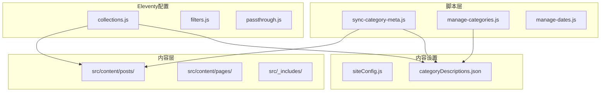
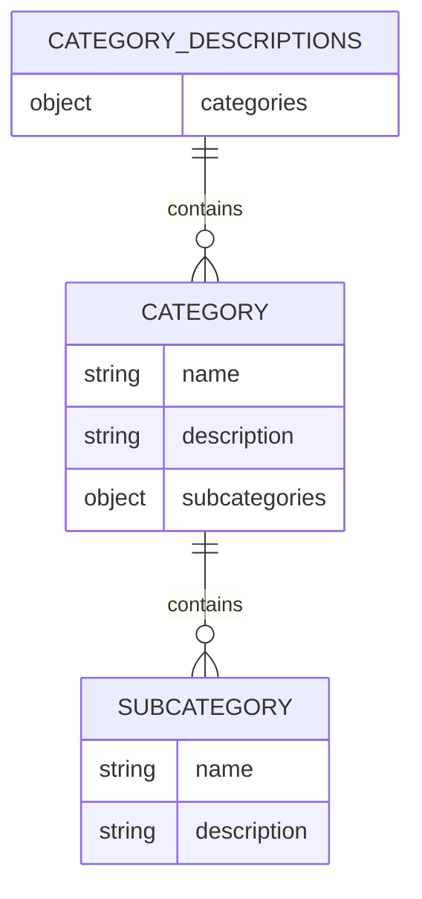
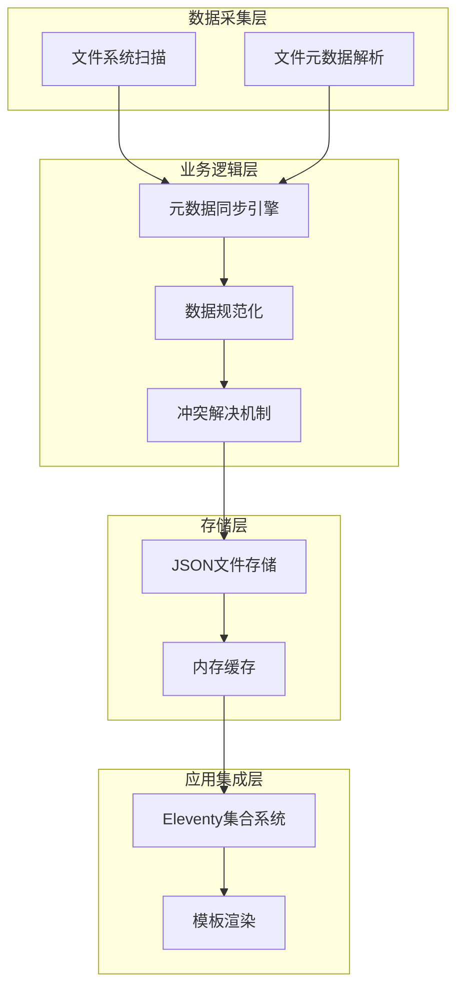
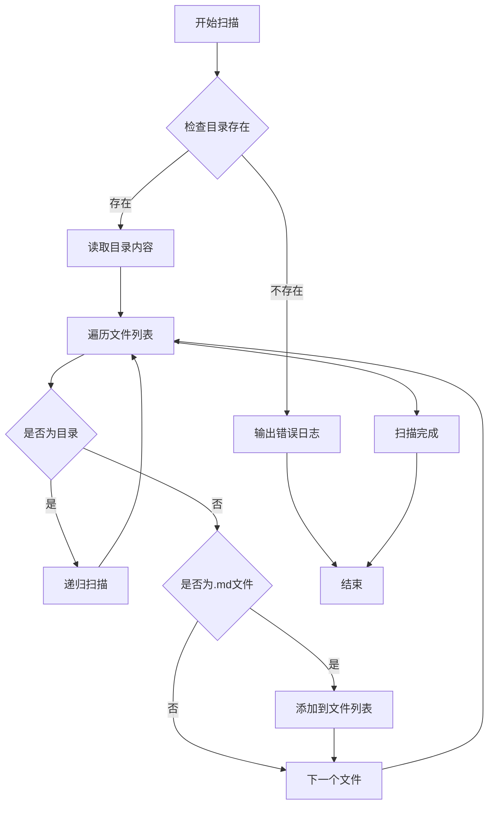
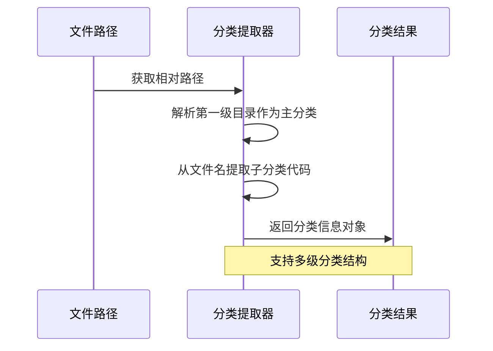
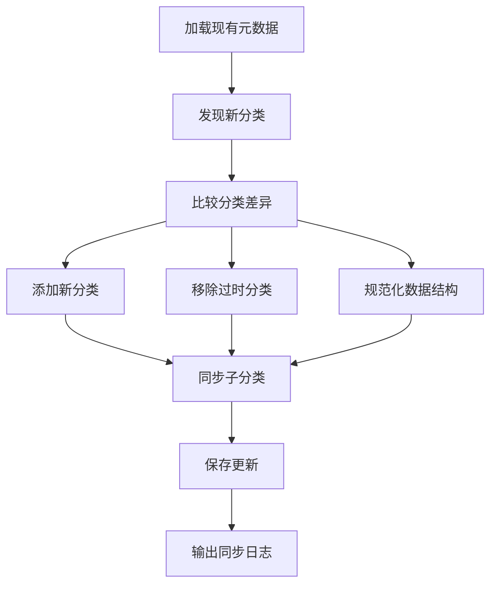
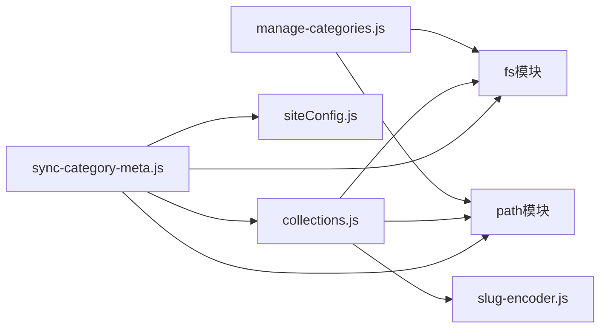
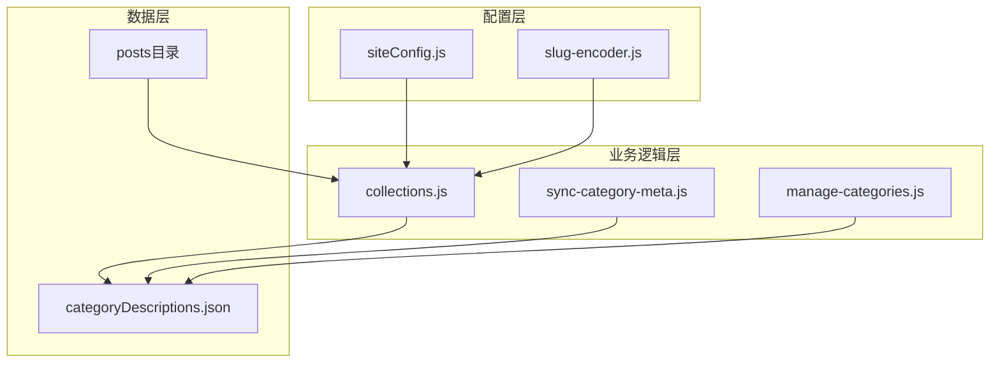
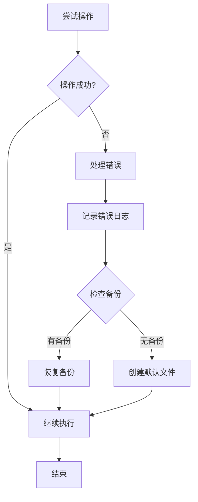

# 元数据同步脚本

<cite>
**本文档引用的文件**
- [sync-category-meta.js](file://scripts/sync-category-meta.js)
- [collections.js](file://eleventy/config/collections.js)
- [siteConfig.js](file://src/_data/siteConfig.js)
- [siteConfig.js](file://src/content/settings/siteConfig.js)
- [slug-encoder.js](file://eleventy/utils/slug-encoder.js)
- [manage-categories.js](file://scripts/manage-categories.js)
</cite>

## 目录
1. [简介](#简介)
2. [项目结构](#项目结构)
3. [核心组件](#核心组件)
4. [架构概览](#架构概览)
5. [详细组件分析](#详细组件分析)
6. [依赖关系分析](#依赖关系分析)
7. [性能考虑](#性能考虑)
8. [故障排除指南](#故障排除指南)
9. [结论](#结论)

## 简介

sync-category-meta.js 是一个专门用于同步和维护 Eleventy 内容管理系统中分类元数据的自动化脚本。该脚本通过扫描内容目录中的 Markdown 文件，自动发现分类结构，同步分类描述，并维护分类状态的一致性。

该脚本在内容管理系统中扮演着关键的协调角色，确保分类元数据与实际内容结构保持同步，为用户提供准确的分类导航和内容组织。

## 项目结构

该项目采用基于功能的文件组织方式，主要结构如下：

**图表来源**
- [sync-category-meta.js:1-205](file://scripts/sync-category-meta.js#L1-L205)
- [collections.js:1-384](file://eleventy/config/collections.js#L1-L384)

**章节来源**
- [sync-category-meta.js:1-205](file://scripts/sync-category-meta.js#L1-L205)
- [collections.js:1-384](file://eleventy/config/collections.js#L1-L384)

## 核心组件

### 分类元数据同步器

sync-category-meta.js 提供了完整的分类元数据同步功能，包括：

- **自动分类发现**：递归扫描内容目录，识别所有分类结构
- **子分类提取**：从文件名中解析子分类代码
- **元数据同步**：维护分类描述文件的完整性
- **状态管理**：跟踪新增、删除和修改的分类项

### 数据结构定义

脚本使用标准化的数据结构来表示分类元数据：

**图表来源**
- [sync-category-meta.js:44-74](file://scripts/sync-category-meta.js#L44-L74)
- [sync-category-meta.js:100-113](file://scripts/sync-category-meta.js#L100-L113)

**章节来源**
- [sync-category-meta.js:36-202](file://scripts/sync-category-meta.js#L36-L202)

## 架构概览

该系统采用分层架构设计，各组件职责明确：

**图表来源**
- [sync-category-meta.js:36-202](file://scripts/sync-category-meta.js#L36-L202)
- [collections.js:124-144](file://eleventy/config/collections.js#L124-L144)

## 详细组件分析

### 文件扫描器组件

文件扫描器负责遍历内容目录并识别所有 Markdown 文件：

**图表来源**
- [sync-category-meta.js:9-25](file://scripts/sync-category-meta.js#L9-L25)

**章节来源**
- [sync-category-meta.js:9-25](file://scripts/sync-category-meta.js#L9-L25)

### 分类提取器组件

分类提取器从文件路径和文件名中解析分类信息：

**图表来源**
- [sync-category-meta.js:47-74](file://scripts/sync-category-meta.js#L47-L74)

**章节来源**
- [sync-category-meta.js:27-34](file://scripts/sync-category-meta.js#L27-L34)

### 同步引擎组件

同步引擎负责维护分类元数据文件的完整性：

**图表来源**
- [sync-category-meta.js:117-188](file://scripts/sync-category-meta.js#L117-L188)

**章节来源**
- [sync-category-meta.js:117-188](file://scripts/sync-category-meta.js#L117-L188)

### 冲突解决机制

系统实现了多层次的冲突解决策略：

1. **数据格式验证**：确保元数据文件结构正确
2. **分类状态同步**：维护分类的存在状态
3. **子分类一致性**：保证子分类与实际内容匹配
4. **默认值回退**：使用预定义默认值处理缺失数据

**章节来源**
- [sync-category-meta.js:108-115](file://scripts/sync-category-meta.js#L108-L115)
- [sync-category-meta.js:141-157](file://scripts/sync-category-meta.js#L141-L157)

## 依赖关系分析

### 外部依赖

脚本依赖于以下核心模块：

**图表来源**
- [sync-category-meta.js:1-2](file://scripts/sync-category-meta.js#L1-L2)
- [collections.js:1-4](file://eleventy/config/collections.js#L1-L4)

### 内部依赖关系

**图表来源**
- [collections.js:124-128](file://eleventy/config/collections.js#L124-L128)
- [sync-category-meta.js:6,100](file://scripts/sync-category-meta.js#L6,L100)

**章节来源**
- [collections.js:124-128](file://eleventy/config/collections.js#L124-L128)
- [sync-category-meta.js:4-6](file://scripts/sync-category-meta.js#L4-L6)

## 性能考虑

### 时间复杂度分析

- **文件扫描**：O(n)，其中 n 是 Markdown 文件数量
- **分类解析**：O(m)，其中 m 是分类层级数
- **元数据同步**：O(k)，其中 k 是分类总数
- **总体复杂度**：O(n + m + k)

### 内存优化策略

1. **流式处理**：逐个处理文件而非一次性加载所有文件
2. **增量更新**：只更新发生变化的分类元数据
3. **内存缓存**：缓存已解析的分类信息减少重复计算

### I/O 优化

- **批量文件操作**：减少文件系统调用次数
- **原子写入**：确保元数据文件的完整性
- **错误重试机制**：处理临时性的文件锁定问题

## 故障排除指南

### 常见问题及解决方案

#### 1. 目录不存在错误

**症状**：脚本无法找到内容目录
**解决方案**：
- 检查 CONTENT_DIR 路径配置
- 确认目录权限设置
- 验证相对路径的正确性

#### 2. JSON文件解析失败

**症状**：元数据文件格式错误导致解析异常
**解决方案**：
- 检查 JSON语法正确性
- 验证文件编码格式
- 使用备份文件恢复

#### 3. 分类同步不一致

**症状**：分类描述与实际内容不符
**解决方案**：
- 运行同步脚本重新生成元数据
- 检查文件命名约定
- 验证子分类代码格式

### 错误处理机制

脚本实现了多层次的错误处理：

**图表来源**
- [sync-category-meta.js:101-106](file://scripts/sync-category-meta.js#L101-L106)

**章节来源**
- [sync-category-meta.js:101-106](file://scripts/sync-category-meta.js#L101-L106)

### 调试技巧

1. **启用详细日志**：观察同步过程中的详细信息
2. **检查中间状态**：验证分类发现和解析结果
3. **验证最终输出**：确认元数据文件的完整性

## 结论

sync-category-meta.js 脚本为 Eleventy 内容管理系统提供了强大的分类元数据管理能力。通过自动化同步机制，确保了分类结构与实际内容的一致性，为用户提供了准确的分类导航体验。

该脚本的主要优势包括：

- **自动化程度高**：减少手动维护分类元数据的工作量
- **数据一致性强**：通过冲突解决机制保证数据完整性
- **扩展性强**：支持复杂的多级分类结构
- **错误处理完善**：具备健壮的错误恢复机制

在未来的发展中，可以考虑增加更多的自定义选项和配置参数，以满足不同项目的需求。同时，可以优化性能表现，支持更大规模的内容管理和同步需求。