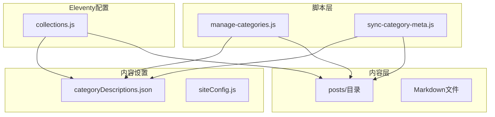
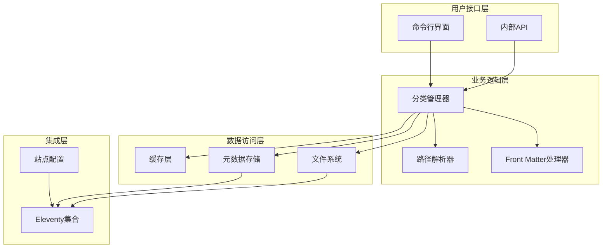
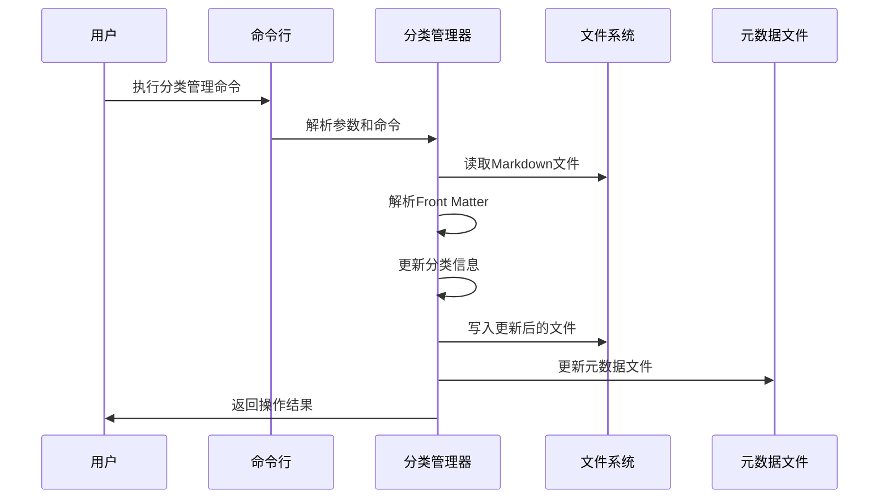
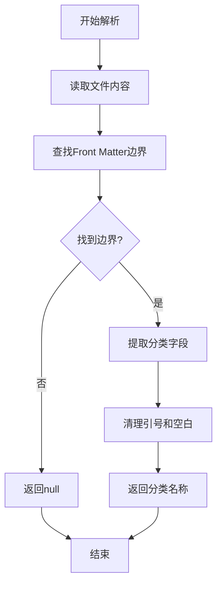
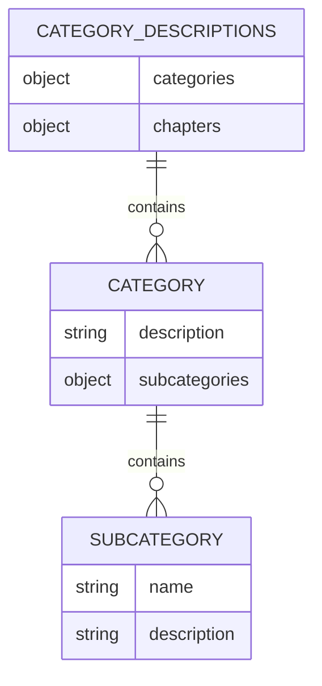
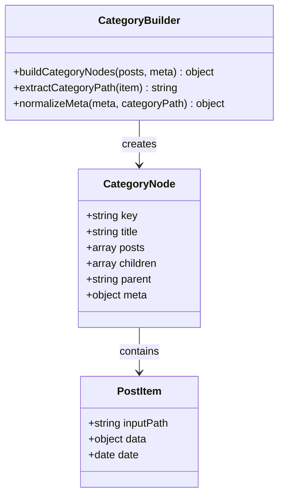
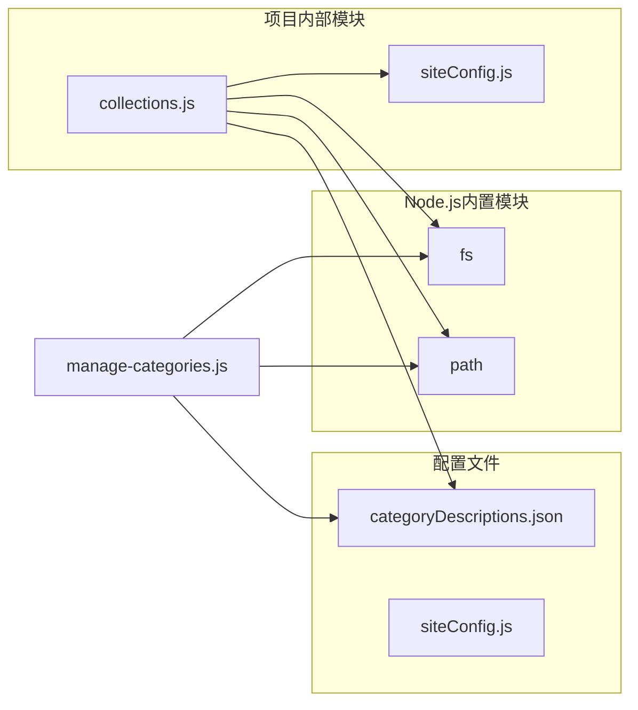

# 分类管理脚本

<cite>
**本文档引用的文件**
- [manage-categories.js](file://scripts/manage-categories.js)
- [collections.js](file://eleventy/config/collections.js)
- [sync-category-meta.js](file://scripts/sync-category-meta.js)
- [categoryDescriptions.json](file://src/content/settings/categoryDescriptions.json)
- [siteConfig.js](file://src/content/settings/siteConfig.js)
- [package.json](file://package.json)
- [演示案例 01：前端开发者个人主页@xs.md](file://src/content/posts/项目速览/演示案例 01：前端开发者个人主页@xs.md)
- [建站需求清单：估算更新频率@xfq.md](file://src/content/posts/建站需求篇/建站需求清单：估算更新频率@xfq.md)
- [FAQ 页面怎么降低读者顾虑@xfq.md](file://src/content/posts/方案策划篇/FAQ 页面怎么降低读者顾虑@xfq.md)
</cite>

## 目录
1. [简介](#简介)
2. [项目结构](#项目结构)
3. [核心组件](#核心组件)
4. [架构概览](#架构概览)
5. [详细组件分析](#详细组件分析)
6. [依赖关系分析](#依赖关系分析)
7. [性能考虑](#性能考虑)
8. [故障排除指南](#故障排除指南)
9. [结论](#结论)
10. [附录](#附录)

## 简介

manage-categories.js 是一个专门用于管理 Eleventy 内容分类的命令行工具脚本。该脚本提供了完整的分类生命周期管理功能，包括分类的创建、更新、重命名、删除和元数据维护。它与 Eleventy 的集合系统深度集成，支持多层级分类结构和子分类管理。

该脚本的核心价值在于：
- 自动化分类元数据同步
- 支持层级化分类管理
- 提供分类冲突检测和解决机制
- 确保数据一致性与完整性
- 与 Eleventy 集合系统无缝集成

## 项目结构

该项目采用典型的 Eleventy 博客/文档站点结构，分类管理相关的文件分布如下：



**图表来源**
- [manage-categories.js:1-212](file://scripts/manage-categories.js#L1-L212)
- [collections.js:1-377](file://eleventy/config/collections.js#L1-L377)
- [sync-category-meta.js:1-205](file://scripts/sync-category-meta.js#L1-L205)

**章节来源**
- [manage-categories.js:1-212](file://scripts/manage-categories.js#L1-L212)
- [collections.js:1-377](file://eleventy/config/collections.js#L1-L377)
- [sync-category-meta.js:1-205](file://scripts/sync-category-meta.js#L1-L205)

## 核心组件

### 分类管理器 (Category Manager)

manage-categories.js 提供了完整的分类管理功能，包括：

#### 基础操作功能
- **列表显示**: `list` - 显示所有现有分类及其统计信息
- **重命名**: `rename <old> <new>` - 重命名分类及其子分类
- **删除**: `delete <name>` - 删除指定分类及其所有内容
- **元数据设置**: `meta <category_path> <description>` - 设置分类描述

#### 分类解析与处理
- **Front Matter 解析**: 自动提取 `category` 字段
- **层级分类支持**: 处理 `parent/child` 层级结构
- **子分类识别**: 通过文件名中的 `@标识符` 识别子分类

#### 数据一致性保证
- **原子性操作**: 所有文件修改都是原子性的
- **冲突检测**: 检测并处理分类名称冲突
- **回滚机制**: 在错误情况下保持数据完整性

**章节来源**
- [manage-categories.js:63-93](file://scripts/manage-categories.js#L63-L93)
- [manage-categories.js:95-146](file://scripts/manage-categories.js#L95-L146)
- [manage-categories.js:148-174](file://scripts/manage-categories.js#L148-L174)
- [manage-categories.js:176-189](file://scripts/manage-categories.js#L176-L189)

## 架构概览

分类管理系统采用分层架构设计，确保各组件职责清晰且松耦合：



**图表来源**
- [manage-categories.js:191-212](file://scripts/manage-categories.js#L191-L212)
- [collections.js:219-371](file://eleventy/config/collections.js#L219-L371)

### 数据流架构



**图表来源**
- [manage-categories.js:13-32](file://scripts/manage-categories.js#L13-L32)
- [manage-categories.js:34-61](file://scripts/manage-categories.js#L34-L61)

## 详细组件分析

### 分类解析组件

#### Front Matter 解析器
负责从 Markdown 文件中提取分类信息：



**图表来源**
- [manage-categories.js:34-51](file://scripts/manage-categories.js#L34-L51)

#### 分类路径解析器
支持层级化分类路径解析：

| 分类类型 | 示例路径 | 解析结果 |
|---------|---------|---------|
| 一级分类 | `"项目速览"` | `"项目速览"` |
| 二级分类 | `"方案策划篇/xfq"` | `"方案策划篇/xfq"` |
| 子分类 | `"建站需求篇@xfq"` | `"建站需求篇"` |
| 混合分类 | `"方案策划篇@xfq/子主题"` | `"方案策划篇/子主题"` |

**章节来源**
- [manage-categories.js:40-51](file://scripts/manage-categories.js#L40-L51)
- [collections.js:24-29](file://eleventy/config/collections.js#L24-L29)

### 元数据管理组件

#### 分类元数据结构
分类元数据采用 JSON 格式存储，支持以下结构：



**图表来源**
- [categoryDescriptions.json:1-60](file://src/content/settings/categoryDescriptions.json#L1-L60)

#### 元数据规范化处理
系统自动处理元数据格式转换：

| 输入格式 | 规范化结果 | 处理逻辑 |
|---------|-----------|---------|
| `"简述"` | `{description: "简述"}` | 字符串转对象 |
| `{description: "简述"}` | `{description: "简述"}` | 保持原格式 |
| `{}` | `{description: "暂无简介"}` | 默认值填充 |
| `null` | `{description: "暂无简介"}` | 默认值填充 |

**章节来源**
- [collections.js:73-92](file://eleventy/config/collections.js#L73-L92)
- [collections.js:123-127](file://eleventy/config/collections.js#L123-L127)

### 集合构建组件

#### 分类节点构建器
将内容转换为分类树形结构：



**图表来源**
- [collections.js:145-217](file://eleventy/config/collections.js#L145-L217)

#### 分类页面生成器
支持分页和面包屑导航：

| 页面类型 | URL模式 | 分页参数 |
|---------|--------|---------|
| 分类总览 | `/categories/{key}/` | 第1页 |
| 分类分页 | `/categories/{key}/page/{page}/` | 页码递增 |
| 子分类详情 | `/categories/{parent}/{code}/` | 无分页 |
| 面包屑导航 | 自动构建层级路径 | 逐级父节点 |

**章节来源**
- [collections.js:253-316](file://eleventy/config/collections.js#L253-L316)

## 依赖关系分析

### 外部依赖



**图表来源**
- [manage-categories.js:1-6](file://scripts/manage-categories.js#L1-L6)
- [collections.js:1-4](file://eleventy/config/collections.js#L1-L4)

### 内部依赖关系

| 组件 | 依赖组件 | 用途 |
|------|---------|------|
| manage-categories.js | fs, path | 文件系统操作 |
| collections.js | fs, path, siteConfig | Eleventy集合配置 |
| sync-category-meta.js | fs, path | 元数据同步 |
| categoryDescriptions.json | 无 | 分类元数据存储 |
| siteConfig.js | 无 | 站点全局配置 |

**章节来源**
- [package.json:6-16](file://package.json#L6-L16)
- [collections.js:123-127](file://eleventy/config/collections.js#L123-L127)

## 性能考虑

### 文件系统操作优化

1. **批量文件扫描**: 使用递归遍历减少 I/O 操作次数
2. **内存缓存**: 对已读取的元数据进行缓存
3. **增量更新**: 仅对变更的文件进行处理

### 内存使用优化

- **流式处理**: 大文件采用流式读取
- **对象复用**: 复用分类节点对象减少内存分配
- **及时释放**: 处理完成后及时释放文件句柄

### 并发处理

- **异步操作**: 所有文件操作采用异步模式
- **错误隔离**: 单个文件错误不影响整体操作
- **进度反馈**: 提供实时操作进度信息

## 故障排除指南

### 常见问题及解决方案

#### 分类重命名失败
**症状**: 重命名命令执行后分类未更新
**原因分析**:
1. 源分类名称不存在
2. 目标分类名称已被占用
3. 文件权限不足

**解决步骤**:
1. 使用 `list` 命令验证源分类存在性
2. 检查目标分类是否已存在
3. 确认文件系统写权限

#### 元数据同步异常
**症状**: 新增分类未反映在元数据文件中
**原因分析**:
1. 内容目录结构不符合规范
2. 文件编码格式不正确
3. JSON 文件格式损坏

**解决步骤**:
1. 检查内容文件是否位于正确目录
2. 验证文件编码为 UTF-8
3. 使用 `sync-category-meta.js` 重新同步

#### 集合构建错误
**症状**: Eleventy 构建时出现分类相关错误
**原因分析**:
1. Front Matter 格式不正确
2. 分类路径包含非法字符
3. 元数据文件格式错误

**解决步骤**:
1. 验证 Front Matter 语法
2. 检查分类路径合法性
3. 修复元数据文件格式

**章节来源**
- [manage-categories.js:95-146](file://scripts/manage-categories.js#L95-L146)
- [collections.js:63-71](file://eleventy/config/collections.js#L63-L71)

## 结论

manage-categories.js 脚本为 Eleventy 项目提供了完整的分类管理解决方案。通过自动化工具与手动配置相结合的方式，实现了：

1. **完整的分类生命周期管理**: 从创建到维护的全流程支持
2. **层级化分类结构**: 支持多层级分类和子分类管理
3. **数据一致性保证**: 通过原子性操作和冲突检测确保数据完整性
4. **与 Eleventy 深度集成**: 无缝对接集合系统和页面渲染
5. **灵活的配置选项**: 支持自定义分类规则和元数据管理

该脚本特别适用于内容丰富的个人网站或文档站点，能够有效管理大量的分类内容，提供良好的用户体验和维护便利性。

## 附录

### 使用示例

#### 基础操作
```bash
# 列出所有分类
node scripts/manage-categories.js list

# 重命名分类
node scripts/manage-categories.js rename "旧分类名" "新分类名"

# 删除分类
node scripts/manage-categories.js delete "要删除的分类"

# 设置分类描述
node scripts/manage-categories.js meta "分类路径" "分类描述"
```

#### 集成配置
在构建流程中自动执行分类元数据同步：

```json
{
  "scripts": {
    "build": "npm run clean:site && npm run sync-meta && eleventy"
  }
}
```

### 配置选项

| 选项 | 类型 | 默认值 | 描述 |
|------|------|--------|------|
| categoryPageSize | number | 10 | 分类页面分页大小 |
| pagination.labels | object | - | 分页标签配置 |
| navigation.main | array | - | 主导航菜单配置 |

**章节来源**
- [siteConfig.js:40-49](file://src/content/settings/siteConfig.js#L40-L49)
- [package.json:10](file://package.json#L10)