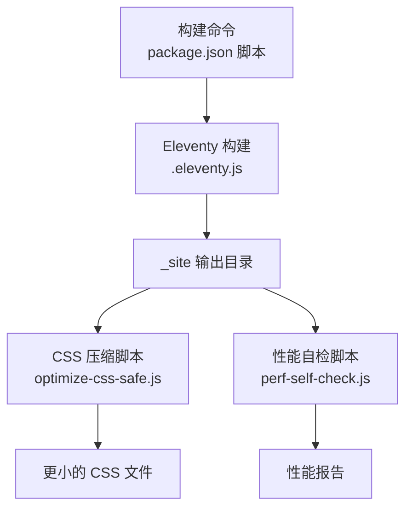
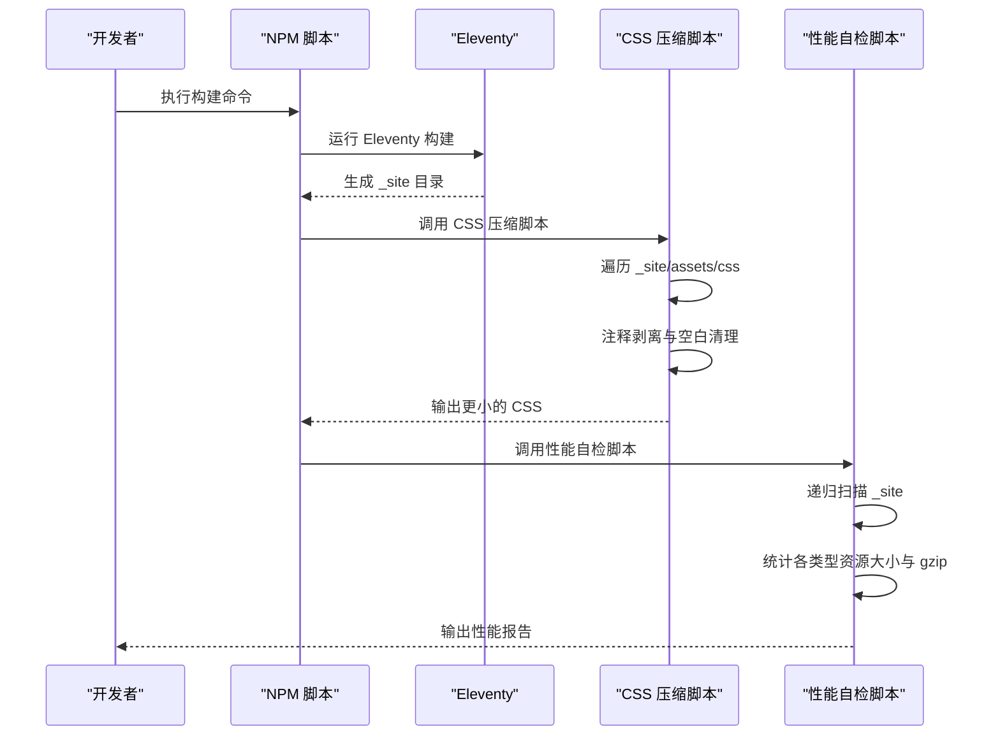
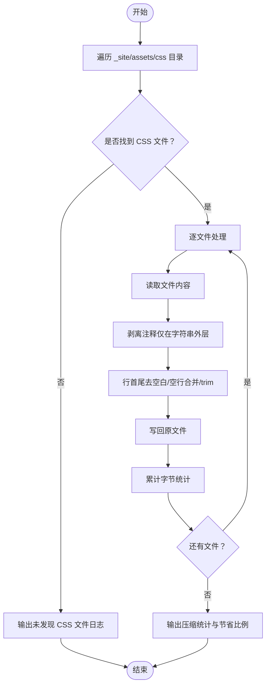
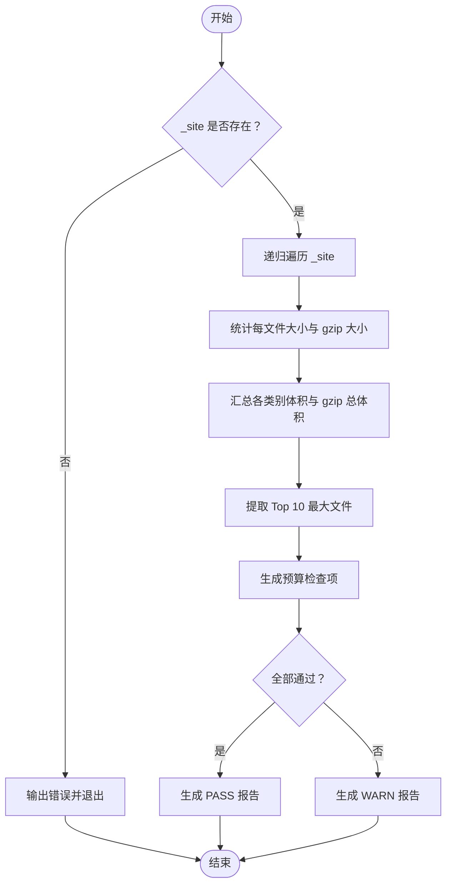
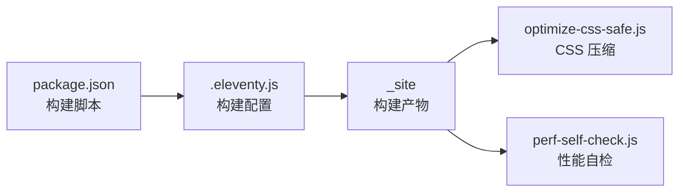

# 性能优化脚本

<cite>
**本文档引用的文件**
- [optimize-css-safe.js](file://scripts/optimize-css-safe.js)
- [perf-self-check.js](file://scripts/perf-self-check.js)
- [package.json](file://package.json)
- [.eleventy.js](file://.eleventy.js)
- [style.css](file://src/assets/css/style.css)
- [layout.css](file://src/assets/css/layout.css)
</cite>

## 目录
1. [简介](#简介)
2. [项目结构](#项目结构)
3. [核心组件](#核心组件)
4. [架构总览](#架构总览)
5. [详细组件分析](#详细组件分析)
6. [依赖关系分析](#依赖关系分析)
7. [性能考量](#性能考量)
8. [故障排查指南](#故障排查指南)
9. [结论](#结论)
10. [附录](#附录)

## 简介
本文件聚焦于两个关键的性能优化脚本：
- optimize-css-safe.js：在 Eleventy 构建产物中安全地压缩和优化 CSS 文件，移除注释与多余空白，同时保持语义正确性。
- perf-self-check.js：对构建输出目录进行自检，统计各类资源大小、生成报告，并基于预算阈值给出通过/警告状态。

这两个脚本共同构成构建阶段的“体积控制与质量门禁”，确保最终产物在体积与可维护性方面满足预期目标。

## 项目结构
与性能优化直接相关的文件组织如下：
- scripts/：存放构建后处理脚本（CSS 压缩、性能自检）
- src/assets/css/：Eleventy 构建前的样式源文件，由 Eleventy 合并与产出至 _site/assets/css
- _site/：Eleventy 输出目录，CSS 压缩与性能检查均在此目录下进行
- package.json：定义构建链路与脚本命令

图表来源
- [package.json:10-12](file://package.json#L10-L12)
- [.eleventy.js:137-145](file://.eleventy.js#L137-L145)

章节来源
- [package.json:6-16](file://package.json#L6-L16)
- [.eleventy.js:137-145](file://.eleventy.js#L137-L145)

## 核心组件
- CSS 安全压缩脚本（optimize-css-safe.js）：遍历 _site/assets/css 下所有 CSS 文件，逐个进行注释剥离与空白清理，原地覆盖并统计节省字节数与压缩比例。
- 性能自检脚本（perf-self-check.js）：递归扫描 _site，按类型统计资源大小与 gzip 大小，计算预算检查项并通过 Markdown 生成报告。

章节来源
- [optimize-css-safe.js:82-111](file://scripts/optimize-css-safe.js#L82-L111)
- [perf-self-check.js:170-198](file://scripts/perf-self-check.js#L170-L198)

## 架构总览
构建与优化的整体流程如下：

图表来源
- [package.json:10](file://package.json#L10)
- [optimize-css-safe.js:82-111](file://scripts/optimize-css-safe.js#L82-L111)
- [perf-self-check.js:170-198](file://scripts/perf-self-check.js#L170-L198)

## 详细组件分析

### CSS 安全压缩脚本（optimize-css-safe.js）
- 目标与职责
  - 在构建产物中安全地压缩 CSS，避免破坏选择器或属性的语义。
  - 计算压缩前后字节差与压缩率，便于追踪优化效果。
- 关键流程
  - 遍历 _site/assets/css 及子目录下的所有 .css 文件。
  - 对每个文件读取源码，剥离注释（仅在字符串外层移除块注释），再进行行首尾去空白、空行合并与整体 trim。
  - 将处理后的结果写回原文件，累计统计压缩前/后总字节数。
  - 输出处理数量、压缩前/后字节数与节省百分比。
- 安全性设计
  - 注释剥离逻辑考虑了单引号与双引号内的转义场景，避免误删字符串中的“/*”或“*/”。
  - 仅在字符串外层移除块注释，确保字体 URL、背景图等字符串中的注释被保留。
- 复杂度与性能
  - 时间复杂度近似 O(N)，其中 N 为所有 CSS 字符总数；空间复杂度 O(N)（用于中间字符串拼接）。
  - 采用逐文件顺序处理，I/O 成本主要取决于磁盘吞吐与文件数量。
- 质量保证机制
  - 原地覆盖写回，若无匹配文件则提示“未找到 CSS 文件”。
  - 输出压缩统计，便于 CI 中断或记录。

图表来源
- [optimize-css-safe.js:6-23](file://scripts/optimize-css-safe.js#L6-L23)
- [optimize-css-safe.js:25-64](file://scripts/optimize-css-safe.js#L25-L64)
- [optimize-css-safe.js:66-76](file://scripts/optimize-css-safe.js#L66-L76)
- [optimize-css-safe.js:82-111](file://scripts/optimize-css-safe.js#L82-L111)

章节来源
- [optimize-css-safe.js:6-23](file://scripts/optimize-css-safe.js#L6-L23)
- [optimize-css-safe.js:25-64](file://scripts/optimize-css-safe.js#L25-L64)
- [optimize-css-safe.js:66-76](file://scripts/optimize-css-safe.js#L66-L76)
- [optimize-css-safe.js:82-111](file://scripts/optimize-css-safe.js#L82-L111)

### 性能自检脚本（perf-self-check.js）
- 目标与职责
  - 对 _site 目录进行全面扫描，统计 HTML/CSS/JS/图片/字体等类型的资源大小与 gzip 大小。
  - 基于预算阈值进行检查，输出通过/警告状态与 Markdown 报告。
- 关键流程
  - 递归遍历 _site，统计每类资源的原始大小与 gzip 大小。
  - 计算各类资源总大小与最大单文件大小。
  - 依据预算阈值生成检查项（HTML/CSS/JS 总量与最大单文件）。
  - 生成 Markdown 报告，包含时间戳、站点目录、状态、文件数、总体积、gzip 总体积、各类别体积、Top 10 最大文件列表。
- 指标与预算
  - 预算项：
    - HTML 总量上限
    - CSS 总量上限
    - JS 总量上限
    - 单文件最大体积上限
  - 指标项：
    - 各类型资源体积分布
    - 最大单文件及其 gzip 体积
    - 总文件数、总体积、gzip 总体积
- 复杂度与性能
  - 时间复杂度 O(F)，F 为 _site 中文件数量；空间复杂度 O(F)（存储文件记录）。
  - gzip 计算使用 zlib 的最高压缩级别，确保更贴近真实传输体积。
- 质量保证机制
  - 若 _site 不存在，直接报错并退出。
  - 检查项全部通过才视为 PASS，否则为 WARN。
  - 以 Markdown 形式输出报告，便于集成到 CI 日志或制品。

图表来源
- [perf-self-check.js:170-198](file://scripts/perf-self-check.js#L170-L198)
- [perf-self-check.js:50-126](file://scripts/perf-self-check.js#L50-L126)
- [perf-self-check.js:10-15](file://scripts/perf-self-check.js#L10-L15)

章节来源
- [perf-self-check.js:170-198](file://scripts/perf-self-check.js#L170-L198)
- [perf-self-check.js:50-126](file://scripts/perf-self-check.js#L50-L126)
- [perf-self-check.js:10-15](file://scripts/perf-self-check.js#L10-L15)

## 依赖关系分析
- 构建链路
  - package.json 中的构建命令串联：清理站点、同步元数据、Eleventy 构建、CSS 压缩、性能自检。
  - Eleventy 的输出目录为 _site，CSS 压缩与性能自检均以此为输入。
- 脚本间耦合
  - 两者均依赖 _site 目录的存在与内容完整性。
  - 无直接代码依赖，但共享构建产物作为输入。
- 外部依赖
  - optimize-css-safe.js：Node FS、Path。
  - perf-self-check.js：Node FS、Path、Zlib。

图表来源
- [package.json:10](file://package.json#L10)
- [.eleventy.js:137-145](file://.eleventy.js#L137-L145)

章节来源
- [package.json:10](file://package.json#L10)
- [.eleventy.js:137-145](file://.eleventy.js#L137-L145)

## 性能考量
- 压缩策略
  - 注释剥离与空白清理在不改变选择器与属性的前提下减少体积，适合静态构建产物。
  - 由于仅做文本层面的处理，无需引入外部 CSS 压缩库，降低依赖与构建时间。
- 自检粒度
  - 按类型统计有助于识别异常增长的资源类别（如图片、字体）。
  - gzip 大小更贴近实际网络传输体积，建议优先参考。
- 预算阈值
  - 预算值可根据项目规模与目标用户网络环境调整，建议在 CI 中作为硬性门槛。
- 并发与 I/O
  - 当前脚本为顺序处理，若文件数量较多可考虑分批或并行化（需注意写回一致性）。
- 缓存与增量
  - 可结合构建缓存策略，仅对变更文件执行压缩与自检，减少重复工作。

## 故障排查指南
- CSS 压缩脚本
  - 症状：未发现任何 CSS 文件
    - 排查：确认 Eleventy 已成功构建且输出到 _site/assets/css
    - 参考：[optimize-css-safe.js:84-87](file://scripts/optimize-css-safe.js#L84-L87)
  - 症状：压缩后体积未变化
    - 排查：确认 CSS 中存在注释或多余空白；检查是否被第三方工具提前压缩
    - 参考：[optimize-css-safe.js:66-76](file://scripts/optimize-css-safe.js#L66-L76)
- 性能自检脚本
  - 症状：缺少 _site 目录
    - 排查：先执行 Eleventy 构建，再运行自检
    - 参考：[perf-self-check.js:171-174](file://scripts/perf-self-check.js#L171-L174)
  - 症状：报告中某类型体积异常偏高
    - 排查：检查该类型资源是否过大或未压缩；关注 Top 10 最大文件
    - 参考：[perf-self-check.js:77-85](file://scripts/perf-self-check.js#L77-L85)

章节来源
- [optimize-css-safe.js:84-87](file://scripts/optimize-css-safe.js#L84-L87)
- [optimize-css-safe.js:66-76](file://scripts/optimize-css-safe.js#L66-L76)
- [perf-self-check.js:171-174](file://scripts/perf-self-check.js#L171-L174)
- [perf-self-check.js:77-85](file://scripts/perf-self-check.js#L77-L85)

## 结论
- optimize-css-safe.js 通过安全的注释剥离与空白清理，在不破坏语义的前提下有效减小 CSS 体积，适合作为构建后处理环节。
- perf-self-check.js 提供了全面的体积与预算检查能力，帮助在构建阶段及时发现潜在问题。
- 二者配合，形成“压缩—自检”的闭环，有助于维持站点体积健康与发布质量。

## 附录

### 性能调优配置与自定义优化规则
- 自定义预算阈值
  - 在性能自检脚本中修改预算对象，以适应不同项目规模与网络环境。
  - 参考：[perf-self-check.js:10-15](file://scripts/perf-self-check.js#L10-L15)
- 自定义 CSS 压缩规则
  - 可在现有注释剥离与空白清理基础上扩展更多规则（如选择器去重、属性排序等），但需谨慎验证语义正确性。
  - 参考：[optimize-css-safe.js:25-64](file://scripts/optimize-css-safe.js#L25-L64)
- 构建链路集成
  - 通过 package.json 的构建脚本串联多个步骤，确保每次构建都执行压缩与自检。
  - 参考：[package.json:10](file://package.json#L10)

章节来源
- [perf-self-check.js:10-15](file://scripts/perf-self-check.js#L10-L15)
- [optimize-css-safe.js:25-64](file://scripts/optimize-css-safe.js#L25-L64)
- [package.json:10](file://package.json#L10)

### 性能基准测试与瓶颈分析方法
- 基准测试
  - 使用自检脚本的报告作为基准：记录总体积、gzip 总体积、各类别体积与 Top 10 最大文件。
  - 在不同网络环境与设备上对比 gzip 体积，评估真实传输效率。
- 瓶颈分析
  - 若 HTML/CSS/JS 总量超限，优先检查模板与样式规模；若单文件过大，定位具体资源并考虑拆分或压缩。
  - 参考：[perf-self-check.js:119-126](file://scripts/perf-self-check.js#L119-L126)

章节来源
- [perf-self-check.js:119-126](file://scripts/perf-self-check.js#L119-L126)

### 脚本在整体性能优化策略中的作用
- 构建阶段门禁：在构建完成后立即进行体积与预算检查，防止问题进入生产环境。
- 产物质量保障：通过压缩与统计，确保最终产物在体积与可维护性方面达到预期。
- 参考：构建链路与配置
  - [package.json:10](file://package.json#L10)
  - [.eleventy.js:137-145](file://.eleventy.js#L137-L145)

章节来源
- [package.json:10](file://package.json#L10)
- [.eleventy.js:137-145](file://.eleventy.js#L137-L145)