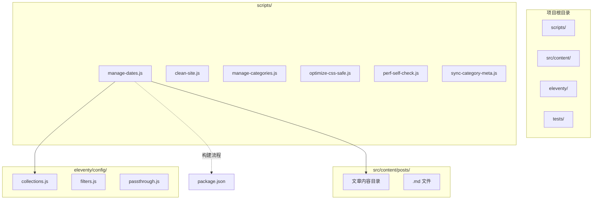
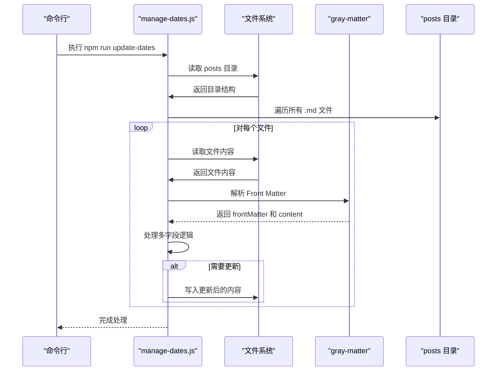
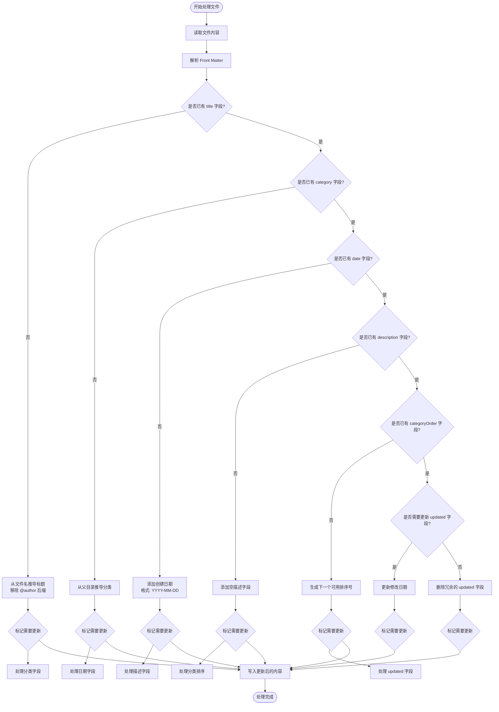
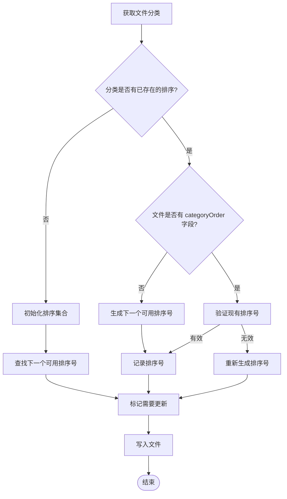
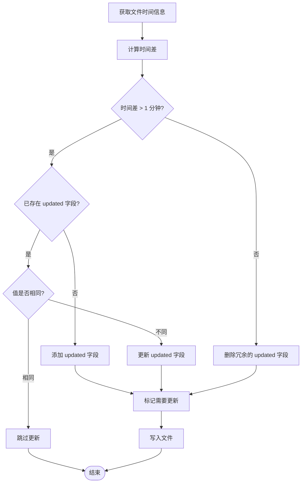
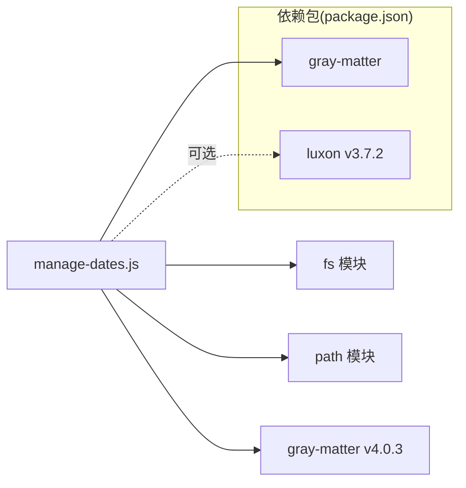
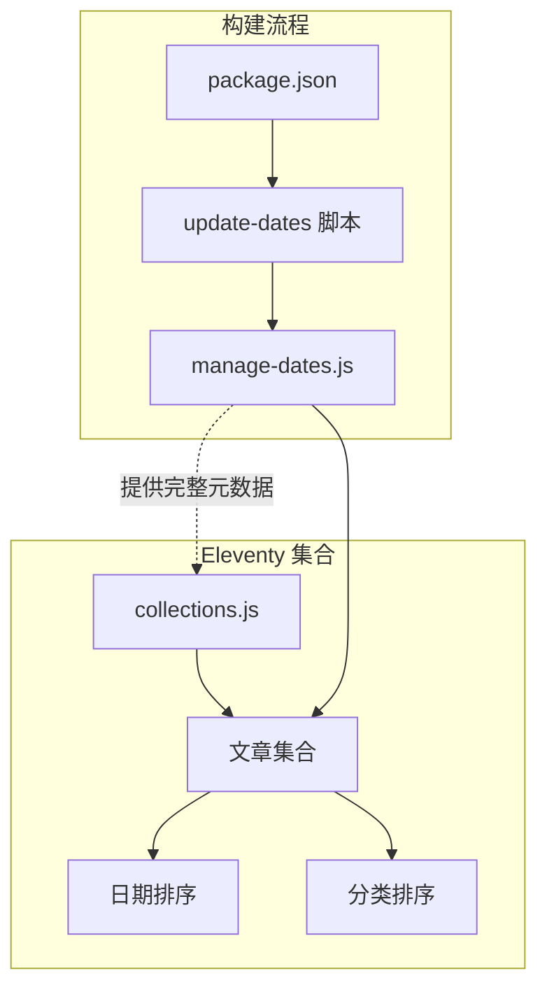

# 日期管理脚本

<cite>
**本文档引用的文件**
- [manage-dates.js](file://scripts/manage-dates.js)
- [collections.js](file://eleventy/config/collections.js)
- [filters.js](file://eleventy/config/filters.js)
- [siteConfig.js](file://src/_data/siteConfig.js)
- [siteConfig.js](file://src/content/settings/siteConfig.js)
- [package.json](file://package.json)
- [FAQ 页面怎么降低读者顾虑@xfq.md](file://src/content/posts/方案策划篇/FAQ 页面怎么降低读者顾虑@xfq.md)
- [上线前的内容校对应该怎么安排@xfq.md](file://src/content/posts/方案策划篇/上线前的内容校对应该怎么安排@xfq.md)
</cite>

## 更新摘要
**变更内容**
- 增强了自动填充功能，新增标题、分类、描述和分类排序的自动处理
- 更新了日期处理逻辑，改进了修改日期的智能管理
- 优化了文件遍历和处理流程，提升性能和可靠性
- 增强了错误处理和日志记录功能

## 目录
1. [简介](#简介)
2. [项目结构](#项目结构)
3. [核心组件](#核心组件)
4. [架构概览](#架构概览)
5. [详细组件分析](#详细组件分析)
6. [依赖关系分析](#依赖关系分析)
7. [性能考虑](#性能考虑)
8. [故障排除指南](#故障排除指南)
9. [结论](#结论)

## 简介

manage-dates.js 是一个全面的内容文件管理脚本，专门用于自动化处理 Eleventy 博客系统中 Markdown 文件的各种元数据。该脚本不仅处理日期格式化和时间戳管理，还提供了强大的自动填充功能，包括标题推导、分类识别、描述字段管理和分类排序编号生成。

脚本通过智能分析文件名、目录结构和现有内容，自动完善 Front Matter 数据，确保内容管理系统具有完整、一致且高质量的元数据。该功能在构建流程中通过 npm 脚本 "update-dates" 自动运行，为内容组织、分类管理和排序提供可靠的基础数据。

## 项目结构

该脚本位于项目的 scripts 目录中，作为构建工具链的重要组成部分：

**图表来源**
- [manage-dates.js:1-146](file://scripts/manage-dates.js#L1-L146)
- [package.json:18-18](file://package.json#L18-L18)

**章节来源**
- [manage-dates.js:1-146](file://scripts/manage-dates.js#L1-L146)
- [package.json:18-18](file://package.json#L18-L18)

## 核心组件

### 主要功能模块

manage-dates.js 包含以下增强的核心功能模块：

1. **智能文件遍历器** - 递归扫描指定目录下的所有 Markdown 文件
2. **多字段自动填充器** - 自动填充标题、分类、描述和排序字段
3. **日期格式化器** - 将 JavaScript Date 对象格式化为 YYYY-MM-DD 格式
4. **内容处理器** - 处理每个文件的 Front Matter 数据
5. **时间戳管理器** - 管理创建时间和修改时间的关系
6. **智能更新器** - 根据修改时间智能添加或删除 updated 字段
7. **分类排序管理器** - 自动生成分类内的排序编号

### 输入参数

脚本接受以下输入参数：

- **目标目录**：默认指向 `../src/content/posts`
- **文件类型**：仅处理 `.md` 扩展名的文件
- **Front Matter 字段**：
  - `title`：文章标题（从文件名推导）
  - `category`：文章分类（从父目录推导）
  - `date`：创建日期（YYYY-MM-DD）
  - `updated`：修改日期（YYYY-MM-DD）
  - `description`：文章描述（默认为空字符串）
  - `categoryOrder`：分类内排序编号（自动生成）

### 输出结果

脚本执行后会产生以下增强的结果：

- 自动添加缺失的标题字段（从文件名推导）
- 智能添加分类字段（从目录结构推导）
- 自动添加描述字段（默认为空）
- 自动生成分类内排序编号
- 智能更新修改日期字段
- 删除冗余的修改日期字段
- 保存更新后的文件内容

**章节来源**
- [manage-dates.js:38-127](file://scripts/manage-dates.js#L38-L127)

## 架构概览

**图表来源**
- [manage-dates.js:129-145](file://scripts/manage-dates.js#L129-L145)

## 详细组件分析

### 多字段处理流程

**图表来源**
- [manage-dates.js:38-127](file://scripts/manage-dates.js#L38-L127)

### 自动填充算法

#### 标题自动填充

脚本通过分析文件名自动推导标题信息：

1. **文件名解析**：移除 `.md` 扩展名
2. **作者标识移除**：移除 `@author` 后缀
3. **空白处理**：去除多余空白字符
4. **智能命名**：保持原始标题的语义完整性

#### 分类自动填充

脚本通过分析文件路径自动推导分类信息：

1. **目录结构分析**：获取文件的父目录名称
2. **分类映射**：将目录名称直接映射为分类
3. **层次结构支持**：支持多级分类目录

#### 描述自动填充

脚本自动为所有文件添加描述字段：

1. **默认值设置**：设置为空字符串
2. **用户可编辑**：允许用户后续填写具体内容
3. **SEO友好**：为搜索引擎优化提供基础

#### 分类排序管理

脚本通过智能算法管理分类内的排序：

**图表来源**
- [manage-dates.js:28-36](file://scripts/manage-dates.js#L28-L36)
- [manage-dates.js:76-91](file://scripts/manage-dates.js#L76-L91)

### 日期处理算法

#### 创建日期处理

脚本通过文件的创建时间（birthtime）自动添加缺失的 `date` 字段：

1. **检测缺失**：检查 Front Matter 中是否存在 `date` 字段
2. **提取时间**：使用文件系统统计信息获取创建时间
3. **格式化输出**：将时间转换为 `YYYY-MM-DD` 格式
4. **智能添加**：仅在缺失时添加，避免覆盖手动设置的日期

#### 修改日期处理

脚本通过比较文件修改时间和发布日期来智能管理 `updated` 字段：

**图表来源**
- [manage-dates.js:93-114](file://scripts/manage-dates.js#L93-L114)

### 错误处理机制

脚本实现了多层次的错误处理：

1. **文件读取错误**：捕获文件不存在或权限不足的情况
2. **Front Matter 解析错误**：处理格式不正确的 YAML 前言
3. **文件写入错误**：确保内容变更后能够正确保存
4. **时间戳处理错误**：处理无效日期格式的情况
5. **目录遍历错误**：处理目录访问权限和结构异常
6. **日志记录**：提供详细的处理过程跟踪

### 性能优化特性

- **单次遍历优化**：只遍历目录一次，同时收集排序信息和处理文件
- **增量更新**：仅在内容实际发生变化时才写入文件
- **智能跳过**：避免重复处理已处理过的文件
- **内存优化**：逐个文件处理，避免大量内存占用
- **并发控制**：顺序处理确保文件系统的一致性
- **去重机制**：使用 Set 数据结构避免重复的排序编号

**章节来源**
- [manage-dates.js:129-145](file://scripts/manage-dates.js#L129-L145)

## 依赖关系分析

### 外部依赖

脚本依赖以下外部库：

**图表来源**
- [manage-dates.js:1-3](file://scripts/manage-dates.js#L1-L3)
- [package.json:33-34](file://package.json#L33-L34)

### 内部依赖关系

**图表来源**
- [package.json:18-18](file://package.json#L18-L18)
- [collections.js:51-62](file://eleventy/config/collections.js#L51-L62)

**章节来源**
- [package.json:18-18](file://package.json#L18-L18)
- [collections.js:51-62](file://eleventy/config/collections.js#L51-L62)

## 性能考虑

### 时间复杂度分析

- **文件遍历**：O(n)，其中 n 是目录中文件的数量
- **Front Matter 解析**：O(1) 平均时间
- **日期格式化**：O(1)
- **文件写入**：O(1) 条件下进行
- **排序编号生成**：O(k)，其中 k 是该分类中已存在的项目数量

### 内存使用优化

- 使用流式读取避免大文件内存占用
- 逐个文件处理，保持稳定的内存使用
- 及时释放不再使用的变量
- 使用 Set 数据结构进行高效去重

### 缓存策略

- 利用文件系统 stat 信息避免重复计算
- 智能跳过未变化的文件
- 减少不必要的文件读写操作
- 单次遍历收集所有排序信息

## 故障排除指南

### 常见问题及解决方案

#### 1. 文件未被处理

**症状**：某些 Markdown 文件没有被脚本处理
**可能原因**：
- 文件不在 posts 目录下
- 文件扩展名不是 .md
- 文件路径包含特殊字符

**解决方法**：
- 确认文件位于 `src/content/posts/` 目录下
- 检查文件扩展名是否为 .md
- 验证文件路径是否包含空格或其他特殊字符

#### 2. 标题推导不正确

**症状**：生成的标题不符合预期
**可能原因**：
- 文件名包含多个 @ 符号
- 文件名包含特殊字符
- 文件名过长或过短

**解决方法**：
- 检查文件名格式，确保遵循 `标题@作者.md` 格式
- 验证文件名中 @ 符号的使用
- 手动修改文件名以改善标题推导效果

#### 3. 分类推导错误

**症状**：分类字段推导不正确
**可能原因**：
- 文件不在正确的子目录中
- 目录名称包含特殊字符
- 目录结构不符合预期

**解决方法**：
- 确认文件位于正确的分类子目录中
- 检查目录名称是否符合中文命名规范
- 验证目录结构的层次关系

#### 4. 分类排序混乱

**症状**：分类内排序编号不连续或重复
**可能原因**：
- 手动设置了 categoryOrder 字段
- 文件移动导致排序冲突
- 数据库或缓存问题

**解决方法**：
- 删除手动设置的 categoryOrder 字段
- 重新运行脚本以重新生成排序编号
- 检查是否有重复的排序编号

#### 5. 日期格式不正确

**症状**：生成的日期格式不符合预期
**可能原因**：
- 系统时区设置问题
- 文件创建时间异常
- 手动设置了日期字段

**解决方法**：
- 检查系统时区设置
- 手动验证文件的创建时间
- 确认文件系统支持 birthtime 属性

#### 6. 更新字段未正确添加

**症状**：updated 字段没有按预期添加或删除
**可能原因**：
- 修改时间与发布时间差距小于 1 分钟
- 手动设置了 updated 字段但格式不正确
- 文件系统时间精度问题

**解决方法**：
- 确保修改时间与发布时间有足够的时间差
- 检查手动设置的 updated 字段格式
- 验证 MIN_UPDATE_GAP_MS 常量设置

#### 7. 构建失败

**症状**：npm run update-dates 命令执行失败
**可能原因**：
- 依赖包安装不完整
- Node.js 版本不兼容
- 文件权限问题

**解决方法**：
- 运行 `npm install` 重新安装依赖
- 检查 Node.js 版本要求
- 清理 npm 缓存后重新安装
- 检查文件系统权限

**章节来源**
- [manage-dates.js:116-126](file://scripts/manage-dates.js#L116-L126)

## 结论

manage-dates.js 脚本为 Eleventy 博客系统提供了全面的内容管理解决方案。通过自动化处理内容文件的多种元数据，该脚本确保了：

1. **数据完整性**：自动补全缺失的标题、分类、描述和排序字段
2. **准确性**：智能管理修改日期，避免冗余信息
3. **一致性**：统一的日期格式化标准和元数据结构
4. **可维护性**：减少手动维护元数据的工作量
5. **可扩展性**：支持复杂的分类结构和排序需求

该脚本与 Eleventy 的集合系统完美集成，为内容组织、分类管理和排序提供了坚实的数据基础。通过合理的错误处理、性能优化和智能算法，确保了在大型项目中的稳定运行。

未来的发展方向包括：
- 支持更多自定义字段的自动填充
- 添加批量处理和进度显示功能
- 实现更灵活的元数据处理规则
- 增加详细的日志记录和调试信息
- 支持配置文件驱动的自定义规则