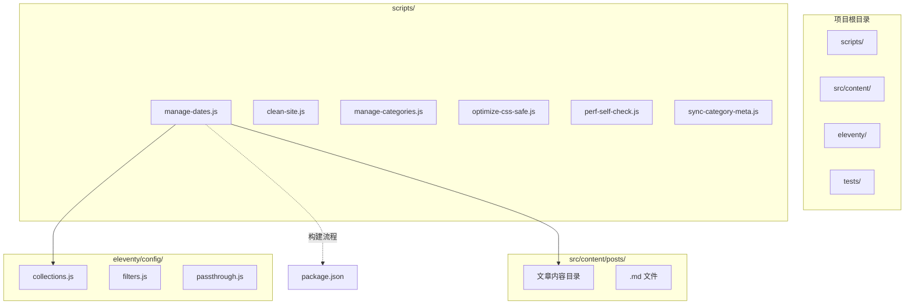
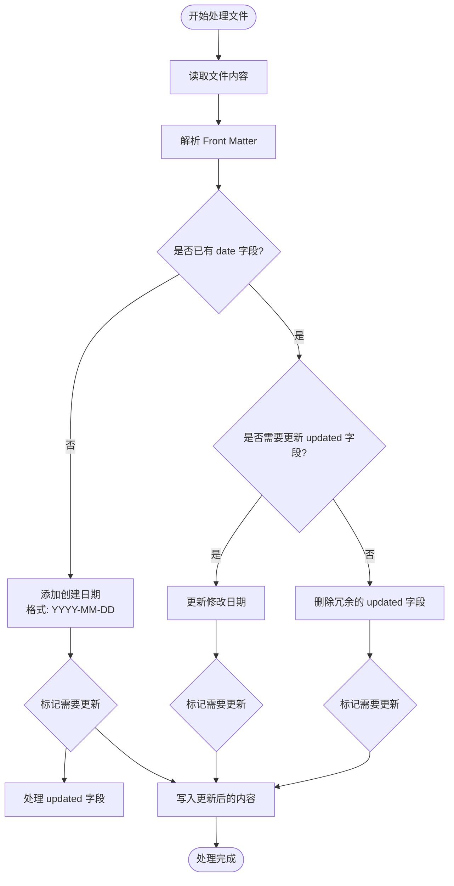
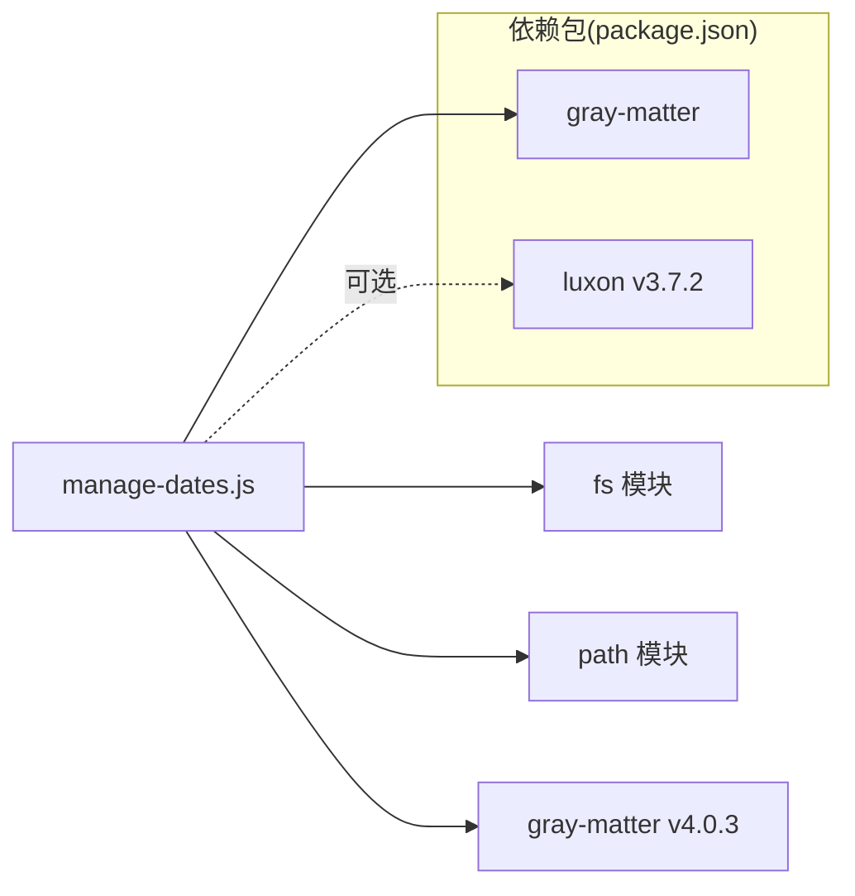
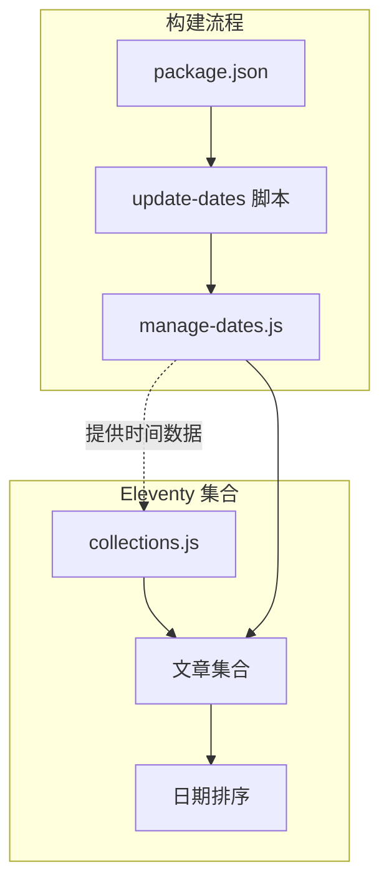

# 日期管理脚本

<cite>
**本文档引用的文件**
- [manage-dates.js](file://scripts/manage-dates.js)
- [collections.js](file://eleventy/config/collections.js)
- [siteConfig.js](file://src/_data/siteConfig.js)
- [siteConfig.js](file://src/content/settings/siteConfig.js)
- [package.json](file://package.json)
- [moments.json](file://src/_data/moments.json)
- [FAQ 页面怎么降低读者顾虑@xfq.md](file://src/content/posts/方案策划篇/FAQ 页面怎么降低读者顾虑@xfq.md)
- [上线前的内容校对应该怎么安排@xfq.md](file://src/content/posts/方案策划篇/上线前的内容校对应该怎么安排@xfq.md)
</cite>

## 目录
1. [简介](#简介)
2. [项目结构](#项目结构)
3. [核心组件](#核心组件)
4. [架构概览](#架构概览)
5. [详细组件分析](#详细组件分析)
6. [依赖关系分析](#依赖关系分析)
7. [性能考虑](#性能考虑)
8. [故障排除指南](#故障排除指南)
9. [结论](#结论)

## 简介

manage-dates.js 是一个专门用于管理内容文件日期相关操作的脚本，主要负责处理 Eleventy 博客系统中 Markdown 文件的日期格式化、时间戳管理和日期排序功能。该脚本通过自动检测和更新内容文件的创建日期（date）和修改日期（updated），确保内容管理系统的时间信息准确性和一致性。

该脚本在构建流程中扮演着重要角色，通过 npm 脚本 "update-dates" 在构建前自动运行，为后续的内容组织和排序提供可靠的时间数据基础。

## 项目结构

该脚本位于项目的 scripts 目录中，与其它构建工具脚本并列：

**图表来源**
- [manage-dates.js:1-85](file://scripts/manage-dates.js#L1-L85)
- [package.json:16-16](file://package.json#L16-L16)

**章节来源**
- [manage-dates.js:1-85](file://scripts/manage-dates.js#L1-L85)
- [package.json:16-16](file://package.json#L16-L16)

## 核心组件

### 主要功能模块

manage-dates.js 包含以下核心功能模块：

1. **文件遍历器** - 递归扫描指定目录下的所有 Markdown 文件
2. **日期格式化器** - 将 JavaScript Date 对象格式化为 YYYY-MM-DD 格式
3. **内容处理器** - 处理每个文件的 Front Matter 数据
4. **时间戳管理器** - 管理创建时间和修改时间的关系
5. **智能更新器** - 根据修改时间智能添加或删除 updated 字段

### 输入参数

脚本接受以下输入参数：

- **目标目录**：默认指向 `../src/content/posts`
- **文件类型**：仅处理 `.md` 扩展名的文件
- **Front Matter 字段**：
  - `date`：创建日期（YYYY-MM-DD）
  - `updated`：修改日期（YYYY-MM-DD）

### 输出结果

脚本执行后会产生以下结果：

- 自动添加缺失的创建日期字段
- 智能更新修改日期字段
- 删除冗余的修改日期字段
- 保存更新后的文件内容

**章节来源**
- [manage-dates.js:5-85](file://scripts/manage-dates.js#L5-L85)

## 架构概览

**图表来源**
- [manage-dates.js:16-85](file://scripts/manage-dates.js#L16-L85)

## 详细组件分析

### 文件处理流程

**图表来源**
- [manage-dates.js:16-68](file://scripts/manage-dates.js#L16-L68)

### 日期处理算法

#### 创建日期处理

脚本通过文件的创建时间（birthtime）自动添加缺失的 `date` 字段：

1. **检测缺失**：检查 Front Matter 中是否存在 `date` 字段
2. **提取时间**：使用文件系统统计信息获取创建时间
3. **格式化输出**：将时间转换为 `YYYY-MM-DD` 格式
4. **智能添加**：仅在缺失时添加，避免覆盖手动设置的日期

#### 修改日期处理

脚本通过比较文件修改时间和发布日期来智能管理 `updated` 字段：

**图表来源**
- [manage-dates.js:25-55](file://scripts/manage-dates.js#L25-L55)

**章节来源**
- [manage-dates.js:25-55](file://scripts/manage-dates.js#L25-L55)

### 错误处理机制

脚本实现了多层次的错误处理：

1. **文件读取错误**：捕获文件不存在或权限不足的情况
2. **Front Matter 解析错误**：处理格式不正确的 YAML 前言
3. **文件写入错误**：确保内容变更后能够正确保存
4. **时间戳处理错误**：处理无效日期格式的情况

### 性能优化特性

- **增量更新**：仅在内容实际发生变化时才写入文件
- **智能跳过**：避免重复处理已处理过的文件
- **内存优化**：逐个文件处理，避免大量内存占用
- **并发控制**：顺序处理确保文件系统的一致性

**章节来源**
- [manage-dates.js:57-67](file://scripts/manage-dates.js#L57-L67)

## 依赖关系分析

### 外部依赖

脚本依赖以下外部库：

**图表来源**
- [manage-dates.js:1-3](file://scripts/manage-dates.js#L1-L3)
- [package.json:31-32](file://package.json#L31-L32)

### 内部依赖关系

**图表来源**
- [package.json:16-16](file://package.json#L16-L16)
- [collections.js:50-61](file://eleventy/config/collections.js#L50-L61)

**章节来源**
- [package.json:16-16](file://package.json#L16-L16)
- [collections.js:50-61](file://eleventy/config/collections.js#L50-L61)

## 性能考虑

### 时间复杂度分析

- **文件遍历**：O(n)，其中 n 是目录中文件的数量
- **Front Matter 解析**：O(1) 平均时间
- **日期格式化**：O(1)
- **文件写入**：O(1) 条件下进行

### 内存使用优化

- 使用流式读取避免大文件内存占用
- 逐个文件处理，保持稳定的内存使用
- 及时释放不再使用的变量

### 缓存策略

- 利用文件系统 stat 信息避免重复计算
- 智能跳过未变化的文件
- 减少不必要的文件读写操作

## 故障排除指南

### 常见问题及解决方案

#### 1. 文件未被处理

**症状**：某些 Markdown 文件没有被脚本处理
**可能原因**：
- 文件不在 posts 目录下
- 文件扩展名不是 .md
- 文件路径包含特殊字符

**解决方法**：
- 确认文件位于 `src/content/posts/` 目录下
- 检查文件扩展名是否为 .md
- 验证文件路径是否包含空格或其他特殊字符

#### 2. 日期格式不正确

**症状**：生成的日期格式不符合预期
**可能原因**：
- 系统时区设置问题
- 文件创建时间异常

**解决方法**：
- 检查系统时区设置
- 手动验证文件的创建时间
- 确认文件系统支持 birthtime 属性

#### 3. 更新字段未正确添加

**症状**：updated 字段没有按预期添加或删除
**可能原因**：
- 修改时间与发布时间差距小于 1 分钟
- 手动设置了 updated 字段但格式不正确

**解决方法**：
- 确保修改时间与发布时间有足够的时间差
- 检查手动设置的 updated 字段格式
- 验证 MIN_UPDATE_GAP_MS 常量设置

#### 4. 构建失败

**症状**：npm run update-dates 命令执行失败
**可能原因**：
- 依赖包安装不完整
- Node.js 版本不兼容

**解决方法**：
- 运行 `npm install` 重新安装依赖
- 检查 Node.js 版本要求
- 清理 npm 缓存后重新安装

**章节来源**
- [manage-dates.js:34-34](file://scripts/manage-dates.js#L34-L34)

## 结论

manage-dates.js 脚本为 Eleventy 博客系统提供了可靠的日期管理解决方案。通过自动化处理内容文件的日期信息，该脚本确保了：

1. **数据完整性**：自动补全缺失的创建日期
2. **准确性**：智能管理修改日期，避免冗余信息
3. **一致性**：统一的日期格式化标准
4. **可维护性**：减少手动维护日期信息的工作量

该脚本与 Eleventy 的集合系统完美集成，为内容组织和排序提供了坚实的时间数据基础。通过合理的错误处理和性能优化，确保了在大型项目中的稳定运行。

在未来的发展中，该脚本可以进一步增强以下方面：
- 支持自定义日期格式配置
- 添加批量处理和进度显示功能
- 实现更灵活的日期处理规则
- 增加详细的日志记录和调试信息