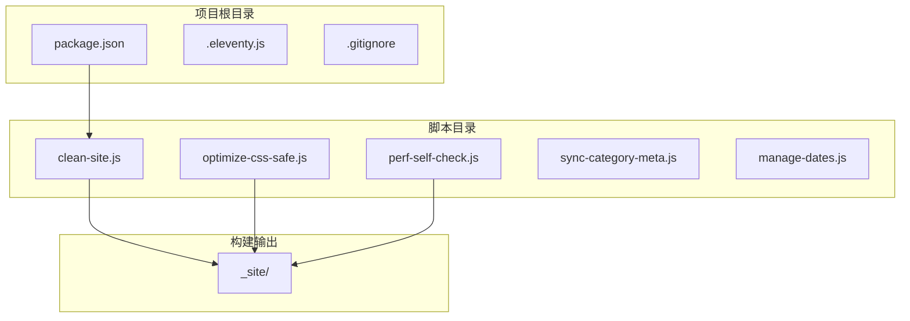
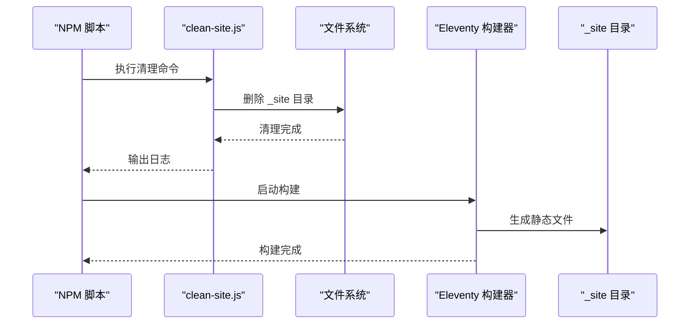
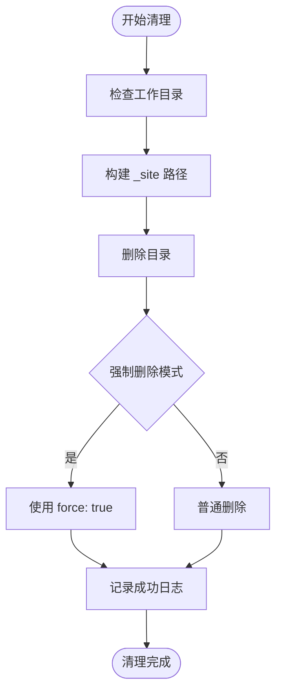
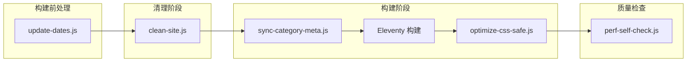
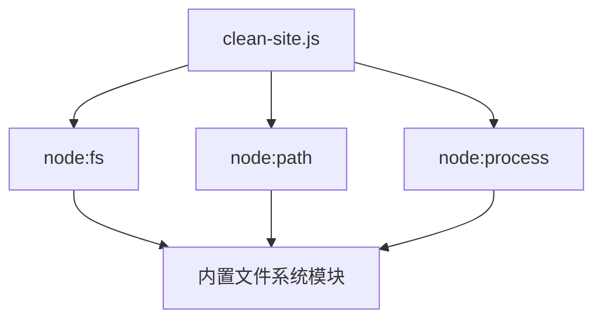
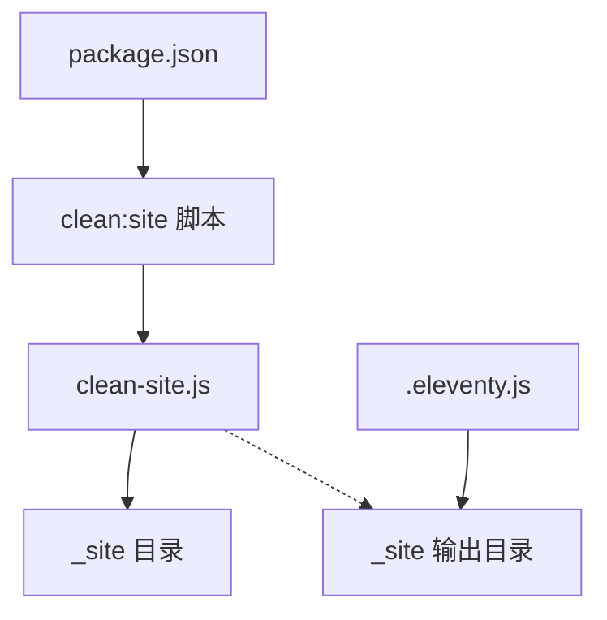

# 构建清理脚本

<cite>
**本文引用的文件**
- [clean-site.js](file://scripts/clean-site.js)
- [package.json](file://package.json)
- [.eleventy.js](file://.eleventy.js)
- [perf-self-check.js](file://scripts/perf-self-check.js)
- [.gitignore](file://.gitignore)
</cite>

## 目录
1. [简介](#简介)
2. [项目结构](#项目结构)
3. [核心组件](#核心组件)
4. [架构概览](#架构概览)
5. [详细组件分析](#详细组件分析)
6. [依赖关系分析](#依赖关系分析)
7. [性能考虑](#性能考虑)
8. [故障排除指南](#故障排除指南)
9. [结论](#结论)

## 简介

clean-site.js 是一个专门用于清理 Eleventy 静态站点生成器构建输出目录的轻量级脚本。该脚本通过删除 `_site` 目录来确保每次构建都从干净的状态开始，避免旧构建文件残留影响新构建结果。

在本项目的构建流程中，clean-site.js 扮演着关键的清理角色，确保构建输出的一致性和可靠性。它与其他构建脚本协同工作，形成完整的构建管道。

## 项目结构

该项目采用典型的 Eleventy 静态站点结构，其中构建清理脚本位于 `scripts/` 目录下：



**图表来源**
- [package.json:6-16](file://package.json#L6-L16)
- [clean-site.js:1-11](file://scripts/clean-site.js#L1-L11)

**章节来源**
- [package.json:1-35](file://package.json#L1-L35)
- [clean-site.js:1-11](file://scripts/clean-site.js#L1-L11)

## 核心组件

### clean-site.js 脚本分析

clean-site.js 是一个极简但高效的清理工具，其核心功能包括：

#### 主要功能特性
- **目录清理**：递归删除 `_site` 目录及其所有内容
- **强制删除**：使用 `force: true` 参数确保即使目录不存在也不会报错
- **即时反馈**：删除完成后输出清晰的日志信息
- **简单可靠**：仅 11 行代码，减少出错可能性

#### 执行逻辑
脚本按照以下顺序执行：
1. 获取当前工作目录路径
2. 构建 `_site` 目录的完整路径
3. 使用同步方法删除目录
4. 输出删除完成的日志

**章节来源**
- [clean-site.js:1-11](file://scripts/clean-site.js#L1-L11)

## 架构概览

clean-site.js 在整体构建架构中扮演着清理器的角色，与 Eleventy 构建系统紧密集成：



**图表来源**
- [package.json:10](file://package.json#L10)
- [clean-site.js:9](file://scripts/clean-site.js#L9)

## 详细组件分析

### 文件删除策略

#### 安全删除机制
clean-site.js 实现了多重安全保护措施：



**图表来源**
- [clean-site.js:6-10](file://scripts/clean-site.js#L6-L10)

#### 删除策略特点
- **递归删除**：使用 `{ recursive: true }` 确保删除整个目录树
- **强制模式**：使用 `{ force: true }` 避免目录不存在时报错
- **同步执行**：使用 `rmSync` 确保删除操作的原子性
- **路径安全**：基于当前工作目录构建绝对路径

### 与构建流程的集成

#### 构建管道中的位置
clean-site.js 在构建流程中处于关键位置：



**图表来源**
- [package.json:9-10](file://package.json#L9-L10)
- [package.json:10](file://package.json#L10)

**章节来源**
- [package.json:6-16](file://package.json#L6-L16)

### 配置选项和自定义方法

#### 当前配置状态
目前 clean-site.js 采用硬编码配置，直接删除项目根目录下的 `_site` 目录。

#### 自定义清理规则建议

##### 1. 环境变量配置
```javascript
// 示例：基于环境变量的动态配置
const targetDir = process.env.CLEAN_TARGET || '_site';
const forceMode = process.env.FORCE_CLEAN === 'true';
```

##### 2. 多目标清理
```javascript
// 示例：清理多个目录
const targets = ['_site', 'dist', '.cache'];
targets.forEach(target => {
    const fullPath = path.join(root, target);
    fs.rmSync(fullPath, { recursive: true, force: true });
});
```

##### 3. 条件清理
```javascript
// 示例：仅在特定条件下清理
const skipCleanup = process.env.SKIP_CLEANUP === 'true';
if (!skipCleanup) {
    fs.rmSync(siteDir, { recursive: true, force: true });
}
```

##### 4. 选择性清理
```javascript
// 示例：保留特定文件类型
const keepPatterns = ['.gitkeep', 'robots.txt'];
// 实现逻辑：删除除指定模式外的所有文件
```

### 安全检查机制

#### 现有安全措施
- **路径验证**：基于工作目录构建绝对路径，避免相对路径攻击
- **强制模式**：即使目录不存在也不会抛出异常
- **同步执行**：确保删除操作的原子性

#### 建议的安全增强
```javascript
// 增强的安全检查
function safeDelete(dirPath) {
    // 1. 验证路径是否在项目范围内
    const rootPath = process.cwd();
    if (!dirPath.startsWith(rootPath)) {
        throw new Error('拒绝访问超出项目范围的路径');
    }
    
    // 2. 验证目标不是根目录
    if (dirPath === rootPath) {
        throw new Error('拒绝删除项目根目录');
    }
    
    // 3. 验证目标不是关键配置文件
    const dangerousTargets = ['package.json', '.eleventy.js', 'scripts/'];
    if (dangerousTargets.some(target => dirPath.includes(target))) {
        throw new Error('拒绝删除关键项目文件');
    }
    
    // 4. 执行删除
    fs.rmSync(dirPath, { recursive: true, force: true });
}
```

## 依赖关系分析

### 外部依赖

clean-site.js 仅依赖 Node.js 内置模块：



**图表来源**
- [clean-site.js:3-4](file://scripts/clean-site.js#L3-L4)

### 内部依赖关系

#### 与构建系统的耦合
clean-site.js 与项目构建系统存在以下依赖关系：



**图表来源**
- [package.json:7](file://package.json#L7)
- [.eleventy.js:139-144](file://.eleventy.js#L139-L144)

**章节来源**
- [package.json:1-35](file://package.json#L1-L35)
- [.eleventy.js:139-144](file://.eleventy.js#L139-L144)

## 性能考虑

### 清理性能特征

#### 时间复杂度
- **删除操作**：O(n) - n 为目录中文件和子目录的数量
- **内存使用**：O(1) - 使用同步 API，不需要额外内存缓冲

#### 性能优化建议

##### 1. 并行清理（可选）
对于大型项目，可以考虑实现并行清理：

```javascript
// 示例：并行删除多个目录
async function parallelClean(targets) {
    const promises = targets.map(target => 
        fs.rm(target, { recursive: true, force: true })
    );
    await Promise.all(promises);
}
```

##### 2. 增量清理
实现智能清理，仅删除过期或损坏的文件：

```javascript
// 示例：基于时间戳的增量清理
function incrementalClean(dir, maxAge) {
    const now = Date.now();
    // 实现逻辑：仅删除超过指定年龄的文件
}
```

### 资源使用情况

- **CPU 使用**：极低 - 主要是文件系统调用
- **内存占用**：最小 - 不需要加载大量数据
- **磁盘 I/O**：中等 - 需要遍历和删除文件

## 故障排除指南

### 常见问题及解决方案

#### 1. 权限不足错误
**症状**：删除目录时出现权限错误
**解决方案**：
- 检查目录权限设置
- 确保 Node.js 进程具有足够的文件系统权限
- 在某些操作系统上可能需要管理员权限

#### 2. 目录锁定问题
**症状**：删除失败，提示目录被占用
**解决方案**：
- 关闭可能正在使用 `_site` 目录的进程
- 检查是否有文件编辑器或服务器仍在运行
- 重启开发服务器后再试

#### 3. 路径解析错误
**症状**：脚本无法找到正确的清理目标
**解决方案**：
- 确认脚本在项目根目录下运行
- 检查工作目录是否正确
- 验证 `_site` 目录是否存在

### 调试技巧

#### 1. 添加调试输出
```javascript
console.log('工作目录:', root);
console.log('目标路径:', siteDir);
console.log('路径验证:', siteDir.startsWith(root));
```

#### 2. 错误捕获和处理
```javascript
try {
    fs.rmSync(siteDir, { recursive: true, force: true });
    console.log(`[clean-site] 成功删除 ${siteDir}`);
} catch (error) {
    console.error('[clean-site] 删除失败:', error.message);
    throw error;
}
```

**章节来源**
- [clean-site.js:9](file://scripts/clean-site.js#L9)

## 结论

clean-site.js 虽然代码简洁，但在整个构建流程中发挥着至关重要的作用。它确保了构建输出的纯净性和一致性，为后续的构建步骤提供了可靠的基础。

### 主要优势
- **简单可靠**：极简设计减少了复杂性带来的风险
- **高效执行**：同步删除确保了操作的原子性
- **易于维护**：少量代码便于理解和修改
- **集成良好**：与现有构建流程无缝衔接

### 改进建议
1. **增强安全性**：添加路径验证和权限检查
2. **增加灵活性**：支持配置化的清理目标
3. **改进错误处理**：提供更详细的错误信息
4. **添加日志级别**：支持不同级别的日志输出

### 最佳实践
- 在每次构建前运行清理脚本
- 确保清理脚本在正确的目录中执行
- 监控清理操作的成功率
- 定期审查清理策略的有效性

通过合理使用和适当改进，clean-site.js 可以成为构建系统中更加完善和可靠的清理工具。