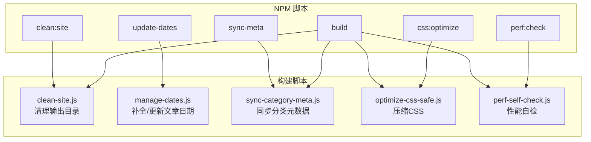
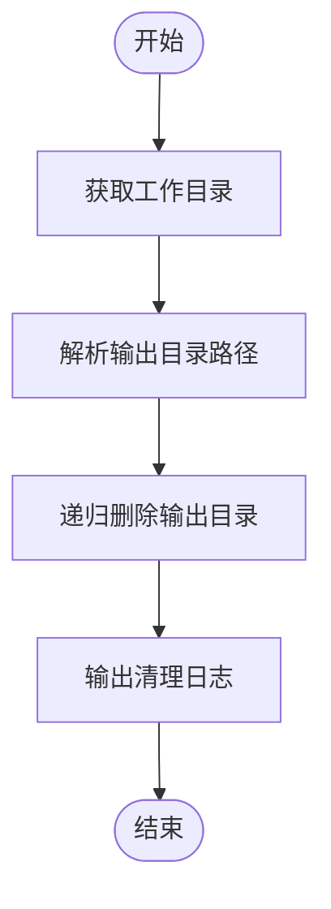
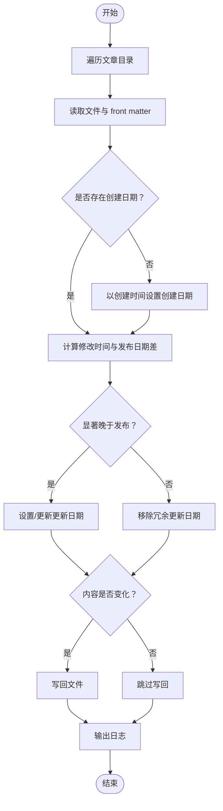
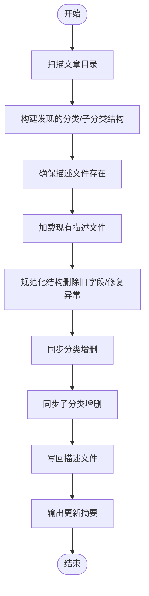
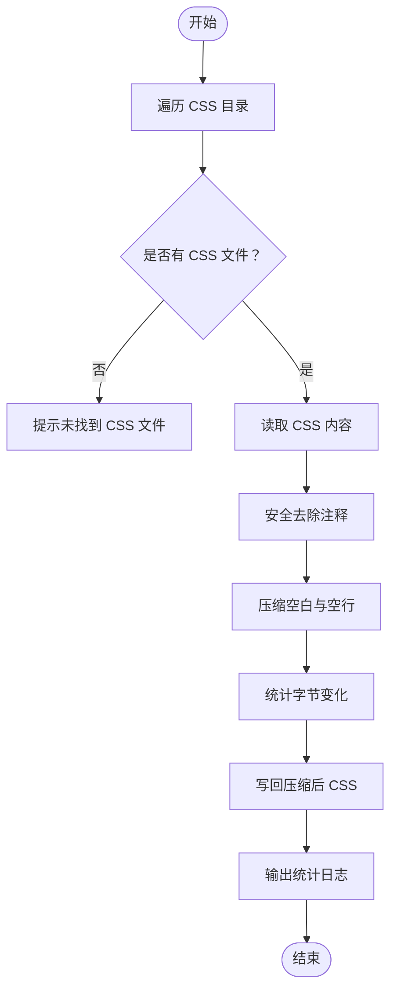
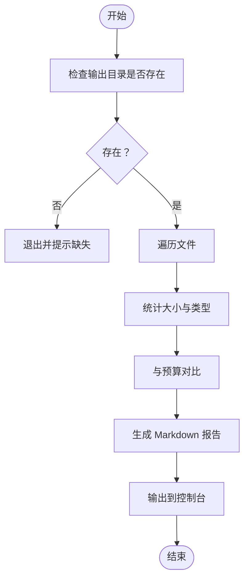
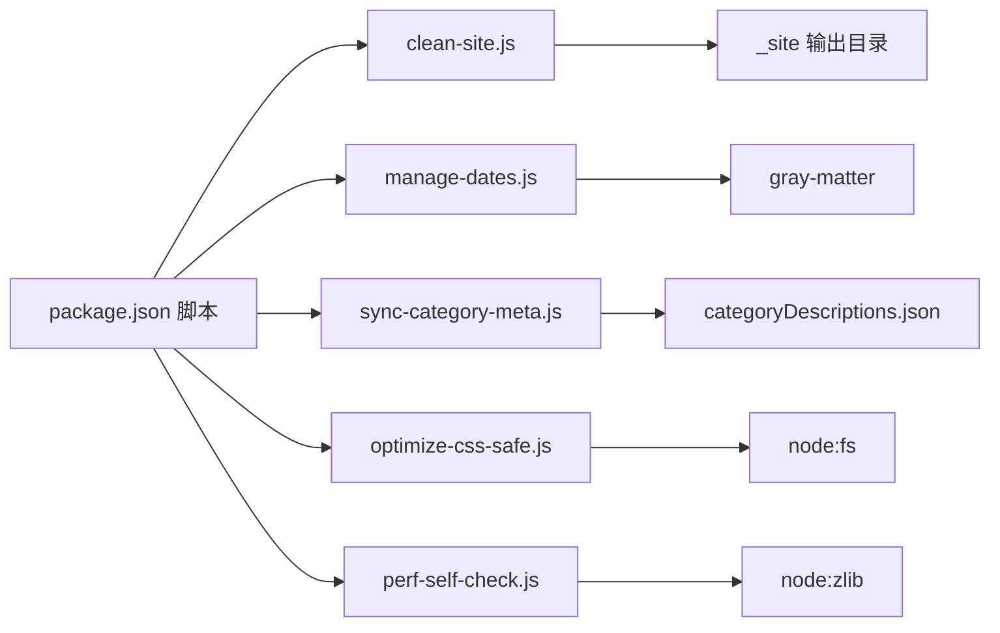

# 自动化脚本

<cite>
**本文引用的文件**
- [package.json](file://package.json)
- [scripts/clean-site.js](file://scripts/clean-site.js)
- [scripts/manage-categories.js](file://scripts/manage-categories.js)
- [scripts/manage-dates.js](file://scripts/manage-dates.js)
- [scripts/optimize-css-safe.js](file://scripts/optimize-css-safe.js)
- [scripts/perf-self-check.js](file://scripts/perf-self-check.js)
- [scripts/sync-category-meta.js](file://scripts/sync-category-meta.js)
- [src/content/settings/categoryDescriptions.json](file://src/content/settings/categoryDescriptions.json)
- [src/content/settings/siteConfig.js](file://src/content/settings/siteConfig.js)
- [src/_data/siteConfig.js](file://src/_data/siteConfig.js)
- [src/content/posts/建站需求篇/建站需求清单：先确认你想展示什么@xfq.md](file://src/content/posts/建站需求篇/建站需求清单：先确认你想展示什么@xfq.md)
</cite>

## 目录
1. [简介](#简介)
2. [项目结构](#项目结构)
3. [核心组件](#核心组件)
4. [架构总览](#架构总览)
5. [详细组件分析](#详细组件分析)
6. [依赖分析](#依赖分析)
7. [性能考虑](#性能考虑)
8. [故障排除指南](#故障排除指南)
9. [结论](#结论)
10. [附录](#附录)

## 简介
本文件为 11ty RainyNight 的自动化脚本系统提供综合文档，覆盖站点清理、日期管理、元数据同步、CSS 优化与性能自检等脚本。文档解释每个脚本的功能、输入输出、执行条件、错误处理、依赖关系与执行顺序，并给出定制与扩展建议、调试技巧与性能优化策略，帮助维护者与贡献者高效地管理与扩展自动化流程。

## 项目结构
自动化脚本位于 scripts 目录，通过 package.json 中的 npm scripts 统一编排，贯穿本地开发与构建流程：
- 清理站点：构建前清理输出目录，确保干净构建。
- 日期管理：自动补全与更新文章 front matter 中的创建与更新时间。
- 元数据同步：扫描文章目录，生成/同步分类与子分类描述元数据文件。
- CSS 优化：安全地压缩已构建的 CSS 文件，统计体积变化。
- 性能自检：对构建产物进行体积与类型统计，生成报告并给出预算检查结果。



图表来源
- [package.json:6-16](file://package.json#L6-L16)
- [scripts/clean-site.js:1-11](file://scripts/clean-site.js#L1-L11)
- [scripts/manage-dates.js:1-85](file://scripts/manage-dates.js#L1-L85)
- [scripts/sync-category-meta.js:1-205](file://scripts/sync-category-meta.js#L1-L205)
- [scripts/optimize-css-safe.js:1-112](file://scripts/optimize-css-safe.js#L1-L112)
- [scripts/perf-self-check.js:1-199](file://scripts/perf-self-check.js#L1-L199)

章节来源
- [package.json:6-16](file://package.json#L6-L16)

## 核心组件
- 站点清理脚本（clean-site.js）
  - 功能：删除构建输出目录，确保每次构建从干净状态开始。
  - 输入：当前工作目录。
  - 输出：控制台日志提示已删除的目录路径。
  - 错误处理：无显式 try/catch；若目录不存在则静默忽略。
  - 执行条件：构建前调用。
- 日期管理脚本（manage-dates.js）
  - 功能：读取文章 front matter，基于文件系统时间补全创建日期与更新日期，避免冗余。
  - 输入：文章目录树（递归遍历）。
  - 输出：修改后的 Markdown 文件（必要时），控制台日志。
  - 错误处理：对单个文件失败不中断整体流程；仅在内容真正变化时写回。
  - 执行条件：构建前（prebuild）。
- 分类元数据同步脚本（sync-category-meta.js）
  - 功能：扫描文章目录，生成/同步分类与子分类描述文件，保持与实际内容一致。
  - 输入：文章目录、现有元数据文件。
  - 输出：更新后的分类描述文件，控制台日志。
  - 错误处理：解析失败时重建空结构；删除旧格式字段；规范化结构。
  - 执行条件：构建前（prebuild）。
- CSS 安全压缩脚本（optimize-css-safe.js）
  - 功能：遍历构建产物中的 CSS 文件，安全去除注释并压缩空白，统计节省字节。
  - 输入：构建产物中的 CSS 目录。
  - 输出：覆盖写回压缩后的 CSS，控制台统计信息。
  - 错误处理：未找到 CSS 文件时提示；对字符串内注释与引号内的“/* */”进行安全处理。
  - 执行条件：构建中（build 后）。
- 性能自检脚本（perf-self-check.js）
  - 功能：统计构建产物总体大小、按类型分布、最大单文件，与预算对比，生成报告。
  - 输入：构建输出目录。
  - 输出：控制台报告与 Markdown 文本。
  - 错误处理：缺失输出目录时退出进程；gzip 计算失败时跳过该项。
  - 执行条件：构建后（build 后）。

章节来源
- [scripts/clean-site.js:1-11](file://scripts/clean-site.js#L1-L11)
- [scripts/manage-dates.js:1-85](file://scripts/manage-dates.js#L1-L85)
- [scripts/sync-category-meta.js:1-205](file://scripts/sync-category-meta.js#L1-L205)
- [scripts/optimize-css-safe.js:1-112](file://scripts/optimize-css-safe.js#L1-L112)
- [scripts/perf-self-check.js:1-199](file://scripts/perf-self-check.js#L1-L199)

## 架构总览
自动化脚本通过 NPM 脚本串联，形成“预处理 → 构建 → 后处理”的流水线。构建前执行日期与元数据同步，构建后执行 CSS 压缩与性能自检，确保产出质量与一致性。

```mermaid
sequenceDiagram
participant Dev as "开发者"
participant NPM as "NPM 脚本"
participant Clean as "clean-site.js"
participant Dates as "manage-dates.js"
participant Sync as "sync-category-meta.js"
participant Eleventy as "Eleventy 构建"
participant Opt as "optimize-css-safe.js"
participant Perf as "perf-self-check.js"
Dev->>NPM : 执行 build
NPM->>Clean : 清理输出目录
NPM->>Dates : 补全/更新文章日期
NPM->>Sync : 同步分类元数据
NPM->>Eleventy : 生成静态站点
NPM->>Opt : 压缩 CSS
NPM->>Perf : 性能自检
Perf-->>Dev : 输出报告
```

图表来源
- [package.json:6-16](file://package.json#L6-L16)
- [scripts/clean-site.js:1-11](file://scripts/clean-site.js#L1-L11)
- [scripts/manage-dates.js:1-85](file://scripts/manage-dates.js#L1-L85)
- [scripts/sync-category-meta.js:1-205](file://scripts/sync-category-meta.js#L1-L205)
- [scripts/optimize-css-safe.js:1-112](file://scripts/optimize-css-safe.js#L1-L112)
- [scripts/perf-self-check.js:1-199](file://scripts/perf-self-check.js#L1-L199)

## 详细组件分析

### 站点清理脚本（clean-site.js）
- 功能要点
  - 获取当前工作目录与输出目录路径。
  - 递归删除输出目录（强制存在即删）。
  - 输出清理完成的日志。
- 输入输出
  - 输入：process.cwd()。
  - 输出：控制台日志。
- 错误处理
  - 无 try/catch；若目录不存在不会报错。
- 执行时机
  - 构建前，确保干净构建。



图表来源
- [scripts/clean-site.js:1-11](file://scripts/clean-site.js#L1-L11)

章节来源
- [scripts/clean-site.js:1-11](file://scripts/clean-site.js#L1-L11)

### 日期管理脚本（manage-dates.js）
- 功能要点
  - 递归遍历文章目录，读取 front matter。
  - 若未设置创建日期，则以文件创建时间填充。
  - 若修改时间显著晚于发布日期，则设置/更新 updated 字段；否则移除冗余字段。
  - 仅在内容真正变化时写回文件。
- 输入输出
  - 输入：文章目录树。
  - 输出：修改后的 Markdown 文件（必要时），控制台日志。
- 错误处理
  - 单文件异常不影响整体流程；写回前再次比较内容是否变化。
- 执行时机
  - 构建前（prebuild）。



图表来源
- [scripts/manage-dates.js:1-85](file://scripts/manage-dates.js#L1-L85)

章节来源
- [scripts/manage-dates.js:1-85](file://scripts/manage-dates.js#L1-L85)

### 分类元数据同步脚本（sync-category-meta.js）
- 功能要点
  - 扫描文章目录，提取分类与子分类代码（从文件名 @ 后缀）。
  - 生成发现的分类/子分类结构，写入描述文件。
  - 规范化现有描述文件结构，删除旧字段，修复异常条目。
  - 同步新增/移除的分类与子分类，保留用户已有描述。
- 输入输出
  - 输入：文章目录、现有描述文件。
  - 输出：更新后的描述文件，控制台日志。
- 错误处理
  - 解析失败时重建空结构；删除旧格式字段；规范化顶层结构。
- 执行时机
  - 构建前（prebuild）。



图表来源
- [scripts/sync-category-meta.js:1-205](file://scripts/sync-category-meta.js#L1-L205)

章节来源
- [scripts/sync-category-meta.js:1-205](file://scripts/sync-category-meta.js#L1-L205)
- [src/content/settings/categoryDescriptions.json:1-60](file://src/content/settings/categoryDescriptions.json#L1-L60)

### CSS 安全压缩脚本（optimize-css-safe.js）
- 功能要点
  - 遍历构建产物中的 CSS 文件。
  - 安全去除注释（区分字符串内注释与普通注释）。
  - 去除多余空白与空行，保留必要的换行。
  - 统计压缩前后字节数，输出节省比例。
- 输入输出
  - 输入：构建产物中的 CSS 目录。
  - 输出：覆盖写回压缩后的 CSS，控制台统计。
- 错误处理
  - 未找到 CSS 文件时提示；对字符串内注释与引号内的“/* */”进行安全处理。
- 执行时机
  - 构建后（build 后）。



图表来源
- [scripts/optimize-css-safe.js:1-112](file://scripts/optimize-css-safe.js#L1-L112)

章节来源
- [scripts/optimize-css-safe.js:1-112](file://scripts/optimize-css-safe.js#L1-L112)

### 性能自检脚本（perf-self-check.js）
- 功能要点
  - 遍历构建输出目录，统计各类文件大小与 gzip 大小。
  - 汇总按类型分布与最大单文件，与预算对比。
  - 生成 Markdown 报告，输出到控制台。
- 输入输出
  - 输入：构建输出目录。
  - 输出：控制台报告与 Markdown 文本。
- 错误处理
  - 缺失输出目录时退出进程；gzip 计算失败时跳过该项。
- 执行时机
  - 构建后（build 后）。



图表来源
- [scripts/perf-self-check.js:1-199](file://scripts/perf-self-check.js#L1-L199)

章节来源
- [scripts/perf-self-check.js:1-199](file://scripts/perf-self-check.js#L1-L199)

## 依赖分析
- NPM 脚本与脚本映射
  - clean:site → clean-site.js
  - update-dates → manage-dates.js
  - sync-meta → sync-category-meta.js
  - prebuild → update-dates
  - build → clean:site + sync-meta + eleventy + optimize-css-safe.js + perf-self-check.js
  - css:optimize → optimize-css-safe.js
  - perf:check → perf-self-check.js
- 外部依赖
  - gray-matter：用于解析 front matter（manage-dates.js 使用）。
  - node:fs、node:path、node:zlib：内置模块，分别用于文件系统操作、路径解析与 gzip 压缩。
- 数据文件
  - 分类描述文件：src/content/settings/categoryDescriptions.json，被多个脚本读写。
  - 站点配置：src/content/settings/siteConfig.js 与 src/_data/siteConfig.js，供 Eleventy 使用。



图表来源
- [package.json:6-16](file://package.json#L6-L16)
- [scripts/manage-dates.js:1-85](file://scripts/manage-dates.js#L1-L85)
- [scripts/optimize-css-safe.js:1-112](file://scripts/optimize-css-safe.js#L1-L112)
- [scripts/perf-self-check.js:1-199](file://scripts/perf-self-check.js#L1-L199)
- [scripts/sync-category-meta.js:1-205](file://scripts/sync-category-meta.js#L1-L205)
- [src/content/settings/categoryDescriptions.json:1-60](file://src/content/settings/categoryDescriptions.json#L1-L60)

章节来源
- [package.json:6-16](file://package.json#L6-L16)
- [scripts/manage-dates.js:1-85](file://scripts/manage-dates.js#L1-L85)
- [scripts/optimize-css-safe.js:1-112](file://scripts/optimize-css-safe.js#L1-L112)
- [scripts/perf-self-check.js:1-199](file://scripts/perf-self-check.js#L1-L199)
- [scripts/sync-category-meta.js:1-205](file://scripts/sync-category-meta.js#L1-L205)
- [src/content/settings/categoryDescriptions.json:1-60](file://src/content/settings/categoryDescriptions.json#L1-L60)

## 性能考虑
- I/O 与遍历
  - 递归遍历目录在大型项目中可能成为瓶颈。建议：
    - 在 CI 中启用增量构建，仅处理变更文件。
    - 对于 CSS 压缩，可结合构建工具链（如 PostCSS 插件）在构建阶段完成，减少二次遍历。
- 并发执行
  - 当前脚本均为串行执行。可在满足依赖顺序的前提下，将独立任务并行化：
    - 清理与日期/元数据同步可并行。
    - CSS 压缩与性能自检可并行。
- 内存与字符串处理
  - CSS 注释去除与空白压缩涉及大字符串处理，建议：
    - 使用流式处理或分块读取，避免一次性加载超大文件。
    - 对字符串内注释的判断逻辑已较为健壮，但可进一步缓存正则结果或采用更高效的算法。
- 日志与可观测性
  - 控制台日志在大量文件时会产生较多输出。建议：
    - 提供日志级别开关，仅在需要时输出详细日志。
    - 将统计信息输出到文件，便于后续分析。

## 故障排除指南
- 构建前未执行日期/元数据同步
  - 症状：front matter 缺少创建日期或更新日期；分类描述不完整。
  - 排查：确认 prebuild 是否执行；检查文章目录与 front matter 结构。
  - 参考
    - [scripts/manage-dates.js:1-85](file://scripts/manage-dates.js#L1-L85)
    - [scripts/sync-category-meta.js:1-205](file://scripts/sync-category-meta.js#L1-L205)
- 输出目录缺失导致性能自检失败
  - 症状：脚本报错提示缺少构建输出目录。
  - 排查：先执行构建，再运行性能自检。
  - 参考
    - [scripts/perf-self-check.js:171-174](file://scripts/perf-self-check.js#L171-L174)
- CSS 未被压缩
  - 症状：_site/assets/css 下无 CSS 文件或未被写回。
  - 排查：确认构建产物路径正确；检查权限与磁盘空间。
  - 参考
    - [scripts/optimize-css-safe.js:4-23](file://scripts/optimize-css-safe.js#L4-L23)
- 分类描述文件损坏
  - 症状：解析失败或结构异常。
  - 排查：脚本会尝试重建空结构；手动备份后重试。
  - 参考
    - [scripts/sync-category-meta.js:100-116](file://scripts/sync-category-meta.js#L100-L116)
- 调试技巧
  - 使用 DEBUG 环境变量运行 Eleventy，观察构建细节。
  - 参考
    - [package.json](file://package.json#L14)

章节来源
- [scripts/manage-dates.js:1-85](file://scripts/manage-dates.js#L1-L85)
- [scripts/sync-category-meta.js:1-205](file://scripts/sync-category-meta.js#L1-L205)
- [scripts/perf-self-check.js:171-174](file://scripts/perf-self-check.js#L171-L174)
- [scripts/optimize-css-safe.js:4-23](file://scripts/optimize-css-safe.js#L4-L23)
- [package.json](file://package.json#L14)

## 结论
本自动化脚本系统围绕“预处理 → 构建 → 后处理”的流水线，实现了站点清理、日期管理、元数据同步、CSS 压缩与性能自检的闭环。通过 NPM 脚本编排，保证了构建的一致性与可重复性。建议在保持现有顺序的基础上，逐步引入并行化与增量处理，以提升大规模项目的构建效率与稳定性。

## 附录
- 执行顺序与依赖
  - clean:site → update-dates → sync-meta → eleventy → optimize-css-safe.js → perf-self-check.js
- 新增自动化任务建议
  - 任务命名：遵循 npm scripts 命名规范（如 lint:css、bundle:js）。
  - 依赖声明：在 package.json 中添加脚本，并在 prebuild/build 中声明依赖。
  - 错误处理：对关键步骤增加 try/catch 与退出码，避免静默失败。
  - 日志与报告：输出结构化日志或报告文件，便于 CI/CD 集成。
- 示例：front matter 结构参考
  - 参考
    - [src/content/posts/建站需求篇/建站需求清单：先确认你想展示什么@xfq.md:1-8](file://src/content/posts/建站需求篇/建站需求清单：先确认你想展示什么@xfq.md#L1-L8)
- 配置文件位置
  - 分类描述文件：src/content/settings/categoryDescriptions.json
  - 站点配置：src/content/settings/siteConfig.js 与 src/_data/siteConfig.js