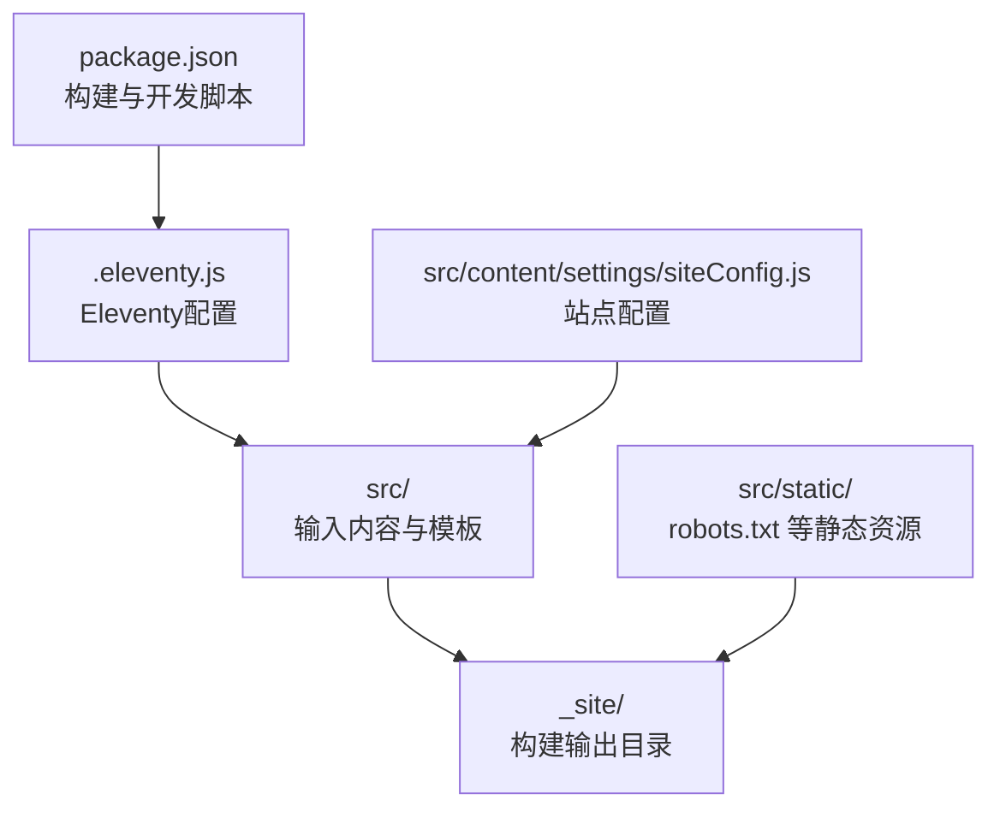
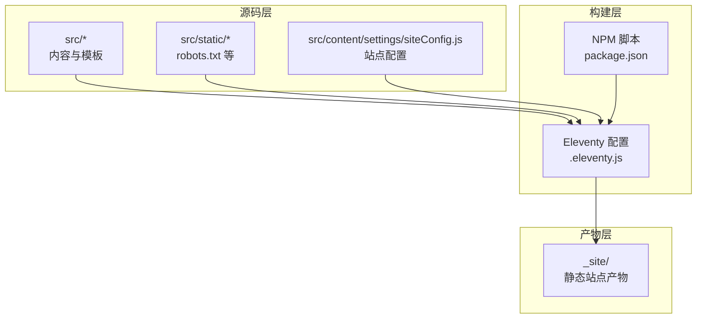
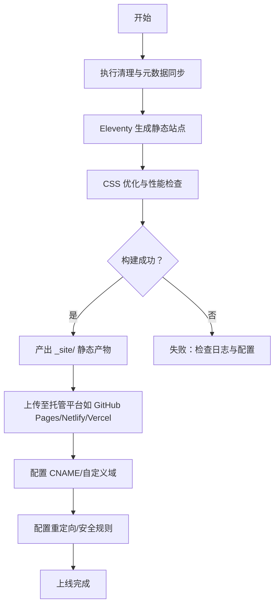
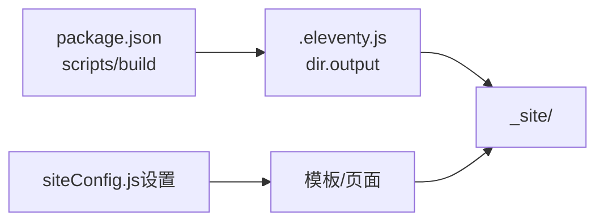

# 部署策略

<cite>
**本文引用的文件**
- [package.json](file://package.json)
- [.eleventy.js](file://.eleventy.js)
- [siteConfig.js（数据）](file://src/_data/siteConfig.js)
- [siteConfig.js（设置）](file://src/content/settings/siteConfig.js)
- [robots.txt](file://src/static/robots.txt)
- [.gitignore](file://.gitignore)
</cite>

## 目录
1. [引言](#引言)
2. [项目结构](#项目结构)
3. [核心组件](#核心组件)
4. [架构总览](#架构总览)
5. [详细组件分析](#详细组件分析)
6. [依赖分析](#依赖分析)
7. [性能考虑](#性能考虑)
8. [故障排除指南](#故障排除指南)
9. [结论](#结论)
10. [附录](#附录)

## 引言
本文件面向11ty RainyNight项目的部署与运维，聚焦静态站点生成与发布策略。基于仓库中的构建脚本、Eleventy配置与站点元数据，系统性梳理了部署目标、构建产物、配置要点与可扩展的部署平台对接思路。由于仓库未包含CI/CD配置文件与平台专属配置，本文提供通用的部署流程、配置建议与最佳实践，帮助在GitHub Pages、Netlify、Vercel等平台完成稳定、可追踪且具备安全与SEO基础能力的发布。

## 项目结构
- 构建与运行
  - 使用NPM脚本驱动构建与本地开发，构建命令会清理输出、同步元数据、执行Eleventy生成、并进行CSS优化与性能自检。
  - Eleventy配置定义输入/输出目录、插件注册、Markdown渲染器与全局计算属性。
  - 站点配置集中于内容设置文件，供模板与页面读取，统一管理品牌、导航、页脚、元信息与分页参数。
  - 静态资源与robots.txt位于src/static，.gitignore屏蔽生产构建产物与环境变量文件。

图表来源
- [package.json:1-35](file://package.json#L1-L35)
- [.eleventy.js:146-154](file://.eleventy.js#L146-L154)
- [siteConfig.js（设置）:1-168](file://src/content/settings/siteConfig.js#L1-L168)
- [robots.txt:1-2](file://src/static/robots.txt#L1-L2)
- [.gitignore:1-35](file://.gitignore#L1-L35)

章节来源
- [package.json:6-16](file://package.json#L6-L16)
- [.eleventy.js:13-154](file://.eleventy.js#L13-L154)
- [siteConfig.js（数据）:1-2](file://src/_data/siteConfig.js#L1-L2)
- [siteConfig.js（设置）:1-168](file://src/content/settings/siteConfig.js#L1-L168)
- [robots.txt:1-2](file://src/static/robots.txt#L1-L2)
- [.gitignore:6-9](file://.gitignore#L6-L9)

## 核心组件
- 构建脚本与流程
  - 清理站点、同步分类元数据、执行Eleventy生成、CSS优化与性能自检。
  - 本地开发通过Eleventy内置服务器启动。
- Eleventy配置
  - 插件：语法高亮、Mermaid图示；Markdown增强（脚注、GitHub Alerts）。
  - 目录映射：输入src、输出_site、包含模板路径_data与_include。
  - 全局计算属性：自动推导文章标题、子分类、永久链接、发布时间、更新时间、标签、页面样式等。
- 站点配置
  - 品牌、导航、页脚、元信息（标题、描述、作者、站点URL、语言）、主题默认值、分页参数与页面文案。
- 静态资源与忽略项
  - robots.txt声明允许爬取；.gitignore屏蔽_node_modules、_site、dist、reports与环境变量文件。

章节来源
- [package.json:6-16](file://package.json#L6-L16)
- [.eleventy.js:22-29](file://.eleventy.js#L22-L29)
- [.eleventy.js:146-154](file://.eleventy.js#L146-L154)
- [.eleventy.js:50-131](file://.eleventy.js#L50-L131)
- [siteConfig.js（数据）:1-2](file://src/_data/siteConfig.js#L1-L2)
- [siteConfig.js（设置）:4-38](file://src/content/settings/siteConfig.js#L4-L38)
- [robots.txt:1-2](file://src/static/robots.txt#L1-L2)
- [.gitignore:11-16](file://.gitignore#L11-L16)

## 架构总览
下图展示了从源码到构建产物的关键路径，以及与外部平台的对接位置（概念示意）：

图表来源
- [.eleventy.js:146-154](file://.eleventy.js#L146-L154)
- [package.json:6-16](file://package.json#L6-L16)
- [siteConfig.js（设置）:1-168](file://src/content/settings/siteConfig.js#L1-L168)
- [robots.txt:1-2](file://src/static/robots.txt#L1-L2)

## 详细组件分析

### 构建与发布流程（概念）
- 本地开发
  - 启动开发服务器，实时预览与热更新。
- 本地构建
  - 执行清理、元数据同步、Eleventy生成、CSS优化与性能检查，最终产出静态站点至输出目录。
- 发布到平台
  - 将构建产物作为静态站点发布；如需自定义域名，可在平台配置CNAME或自定义域；如需重定向，可在平台规则中添加。

（本图为概念流程，不对应具体源码文件）

### 部署平台对接（概念）
- GitHub Pages
  - 推送代码到仓库；选择分支与目录（如gh-pages或docs），或使用Actions自动部署到gh-pages。
  - 自定义域名：在仓库设置中配置CNAME；如需强制HTTPS，启用Pages设置中的HTTPS。
- Netlify/Vercel
  - 连接仓库后，平台自动检测构建命令与输出目录；设置环境变量（如基础路径）与自定义域。
  - 重定向：在平台提供的重定向规则界面添加；安全：启用HTTPS、安全Headers、访问控制等。
- 平台差异提示
  - 不同平台的构建命令、输出目录、环境变量与重定向语法存在差异，需按平台文档调整。

（本节为通用对接说明，不对应具体源码文件）

### HTTPS、SEO与安全（建议）
- HTTPS
  - 平台托管默认提供HTTPS；如使用自定义域名，确保平台已启用HTTPS。
- SEO
  - robots.txt当前允许爬取；如需限制，请根据平台规则或新增robots指令。
  - 站点元信息由配置文件统一管理，确保标题、描述、语言等正确注入。
- 安全
  - .gitignore已屏蔽环境变量与构建产物；避免将敏感信息提交到仓库。
  - 平台侧可启用安全Headers、访问控制与WAF等。

章节来源
- [robots.txt:1-2](file://src/static/robots.txt#L1-L2)
- [siteConfig.js（设置）:27-34](file://src/content/settings/siteConfig.js#L27-L34)
- [.gitignore:11-16](file://.gitignore#L11-L16)

### CI/CD 集成（概念）
- GitHub Actions/GitLab CI
  - 触发条件：推送主分支或创建标签。
  - 步骤：安装依赖、执行构建脚本、上传产物到平台或静态托管。
  - 缓存：缓存依赖以提升速度。
  - 多环境：区分开发、预发布、生产环境，分别指向不同分支或标签。
- 回滚策略
  - 保留历史版本工件；通过平台回滚到上一个稳定版本。
  - 对于平台托管，可使用平台的“回滚到上次成功构建”或切换到上一个发布版本。

（本节为通用CI/CD说明，不对应具体源码文件）

## 依赖分析
- 构建链路
  - NPM脚本驱动Eleventy生成；Eleventy配置决定输入/输出目录与插件；站点配置被模板读取以生成页面。
- 输出产物
  - 构建产物位于输出目录；.gitignore将其纳入忽略列表，避免提交到仓库。
- 关键耦合点
  - 构建命令与输出目录需与平台配置保持一致；站点配置变更会影响页面内容与元信息。

图表来源
- [package.json:6-16](file://package.json#L6-L16)
- [.eleventy.js:146-154](file://.eleventy.js#L146-L154)
- [siteConfig.js（设置）:1-168](file://src/content/settings/siteConfig.js#L1-L168)

章节来源
- [package.json:6-16](file://package.json#L6-L16)
- [.eleventy.js:146-154](file://.eleventy.js#L146-L154)
- [.gitignore:6-9](file://.gitignore#L6-L9)

## 性能考虑
- 构建阶段
  - 构建脚本包含CSS优化与性能自检步骤，有助于在构建期发现潜在问题。
- 运行阶段
  - 平台托管通常提供CDN加速；合理设置缓存策略与压缩可进一步提升加载速度。
- 内容组织
  - 分类与分页参数已在配置中集中管理，便于控制页面规模与加载性能。

章节来源
- [package.json:10-12](file://package.json#L10-L12)
- [siteConfig.js（设置）:40-49](file://src/content/settings/siteConfig.js#L40-L49)

## 故障排除指南
- 构建失败
  - 检查构建脚本是否报错；确认Eleventy配置与输入/输出目录一致；核对站点配置文件是否存在语法错误。
- 本地与线上差异
  - 确认基础路径、自定义域名与平台设置一致；核对CNAME与重定向规则。
- 文件未生效
  - 确认robots.txt与静态资源已包含在构建产物中；检查.gitignore是否误忽略必要文件。
- 回滚策略
  - 使用平台提供的回滚功能；或切换到上一个稳定分支/标签重新触发构建。

章节来源
- [package.json:6-16](file://package.json#L6-L16)
- [.eleventy.js:146-154](file://.eleventy.js#L146-L154)
- [robots.txt:1-2](file://src/static/robots.txt#L1-L2)
- [.gitignore:6-9](file://.gitignore#L6-L9)

## 结论
本项目以Eleventy为核心，配合NPM脚本实现可重复的静态站点构建流程。通过集中式站点配置与严格的构建产物管理，可平滑对接多种托管平台。建议在实际部署时结合平台文档完善CNAME、重定向与安全设置，并建立CI/CD与回滚机制，以保障发布质量与可追溯性。

## 附录
- 关键配置定位
  - 构建脚本与开发命令：[package.json:6-16](file://package.json#L6-L16)
  - Eleventy目录映射与插件：[.eleventy.js:146-154](file://.eleventy.js#L146-L154)
  - 站点配置（品牌/导航/元信息等）：[siteConfig.js（设置）:4-38](file://src/content/settings/siteConfig.js#L4-L38)
  - robots.txt：[robots.txt:1-2](file://src/static/robots.txt#L1-L2)
  - 构建产物忽略：[.gitignore:6-9](file://.gitignore#L6-L9)