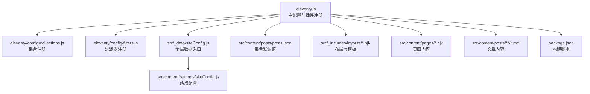
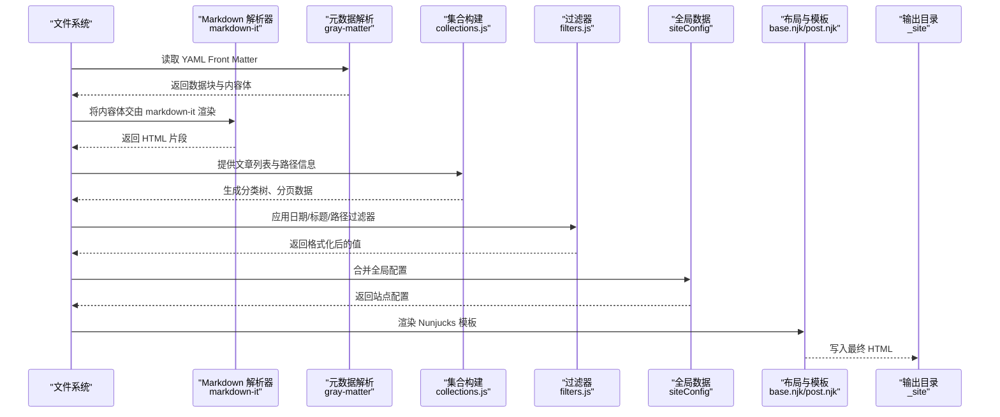
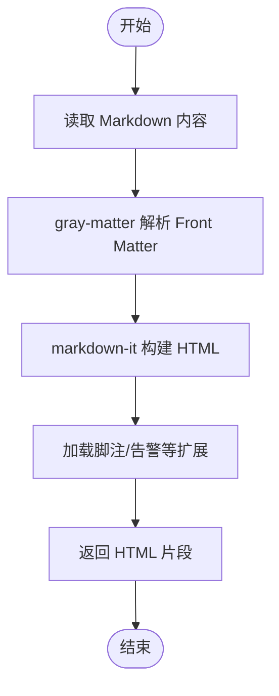
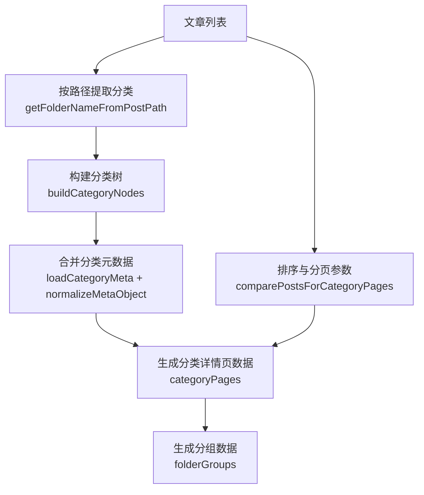
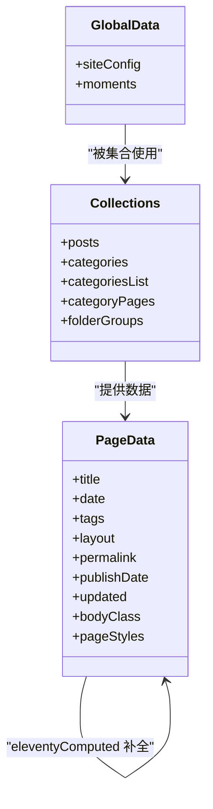
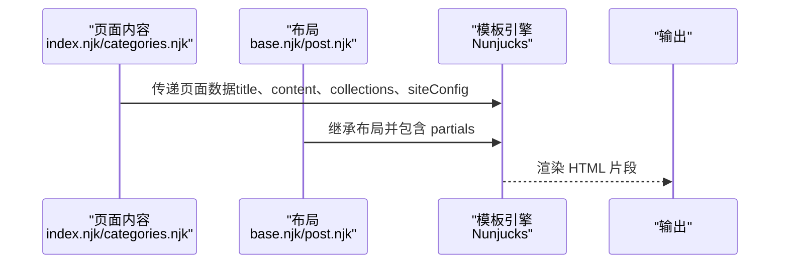
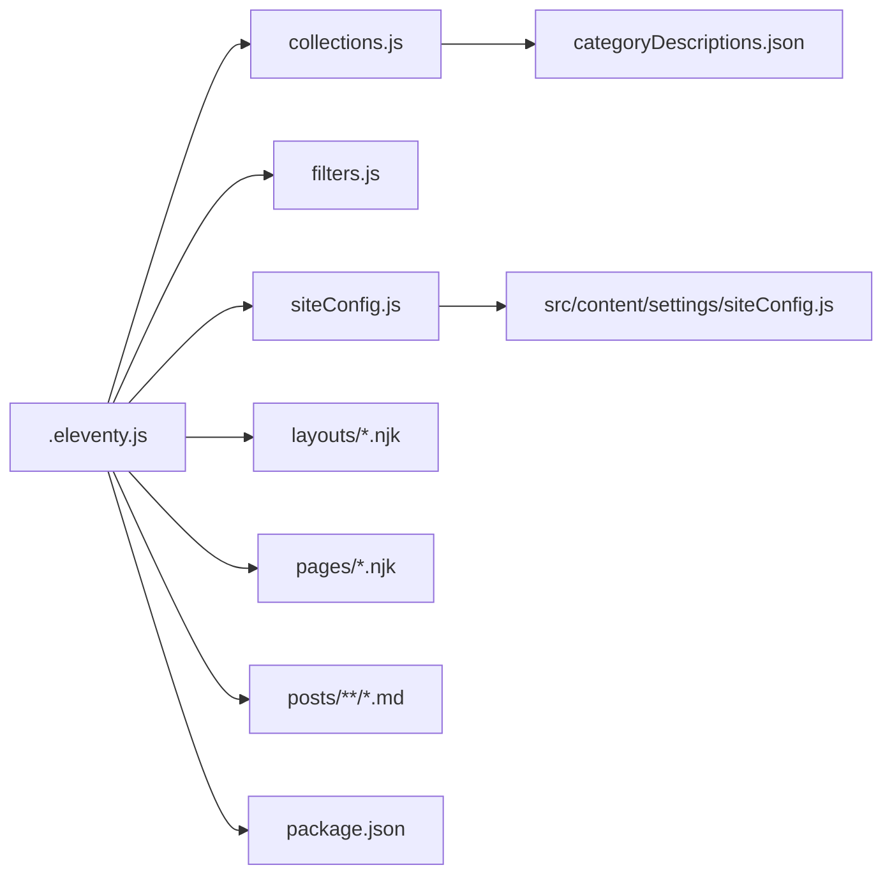

# 数据流设计

<cite>
**本文引用的文件**
- [.eleventy.js](file://.eleventy.js)
- [collections.js](file://eleventy/config/collections.js)
- [filters.js](file://eleventy/config/filters.js)
- [siteConfig.js](file://src/_data/siteConfig.js)
- [siteConfig.js](file://src/content/settings/siteConfig.js)
- [categoryDescriptions.json](file://src/content/settings/categoryDescriptions.json)
- [posts.json](file://src/content/posts/posts.json)
- [base.njk](file://src/_includes/layouts/base.njk)
- [post.njk](file://src/_includes/layouts/post.njk)
- [index.njk](file://src/content/pages/index.njk)
- [categories.njk](file://src/content/pages/categories.njk)
- [方案策划篇/为什么很多个人网站上线后依然不够清楚@xfq.md](file://src/content/posts/方案策划篇/为什么很多个人网站上线后依然不够清楚@xfq.md)
- [package.json](file://package.json)
</cite>

## 目录
1. [简介](#简介)
2. [项目结构](#项目结构)
3. [核心组件](#核心组件)
4. [架构总览](#架构总览)
5. [详细组件分析](#详细组件分析)
6. [依赖关系分析](#依赖关系分析)
7. [性能考量](#性能考量)
8. [故障排查指南](#故障排查指南)
9. [结论](#结论)
10. [附录](#附录)

## 简介
本文件为 11ty RainyNight 项目的“数据流设计”文档，围绕从 Markdown 内容文件到最终 HTML 输出的完整数据处理流程进行系统化梳理。重点覆盖以下环节：
- 内容解析：Markdown 解析与语法扩展（footnote、GitHub Alerts、代码高亮）
- 元数据提取：YAML Front Matter 的解析与合并
- 数据转换：集合（collections）构建、过滤器（filters）应用、全局计算数据（eleventyComputed）
- 模板渲染：Nunjucks 模板编译与布局继承
- 静态输出：HTML 文件生成与资源复制

同时，文档深入解释 Eleventy 的数据处理管道（全局数据、集合数据、页面数据），并给出数据流图与处理步骤序列图，讨论缓存与性能优化策略。

## 项目结构
RainyNight 采用典型的 Eleventy 项目布局，核心目录与职责如下：
- src：源内容与模板
  - _data：全局数据（如 siteConfig）
  - _includes：模板与布局（layouts、partials）
  - content：页面与文章内容（pages、posts、settings）
  - assets：静态资源（css、js）
  - static：无需处理的静态文件（robots.txt）
- eleventy/config：Eleventy 插件、集合、过滤器、透传复制等配置
- scripts：构建辅助脚本（清理、优化、同步元数据等）
- 根目录配置：.eleventy.js（Eleventy 主配置）、package.json（脚本与依赖）

图表来源
- [.eleventy.js](file://.eleventy.js)
- [collections.js](file://eleventy/config/collections.js)
- [filters.js](file://eleventy/config/filters.js)
- [siteConfig.js](file://src/_data/siteConfig.js)
- [siteConfig.js](file://src/content/settings/siteConfig.js)
- [posts.json](file://src/content/posts/posts.json)
- [base.njk](file://src/_includes/layouts/base.njk)
- [post.njk](file://src/_includes/layouts/post.njk)
- [index.njk](file://src/content/pages/index.njk)
- [categories.njk](file://src/content/pages/categories.njk)
- [package.json](file://package.json)

章节来源
- [.eleventy.js](file://.eleventy.js)
- [package.json](file://package.json)

## 核心组件
- 主配置与插件
  - 注册语法高亮、Mermaid 图表插件
  - 注册透传复制路径
  - 注册日期与标题过滤器
  - 注册集合
  - 定义全局计算数据（eleventyComputed）
  - 自定义 Markdown 库（启用 html、换行、链接识别，并加载 footnotes 与 GitHub Alerts）
- 集合（Collections）
  - posts：筛选并排序文章
  - categories：按路径层级聚合文章
  - categoriesList：构建分类树节点
  - categoryPages：生成分页的分类详情页数据
  - folderGroups：按顶层文件夹分组的文章集合
- 过滤器（Filters）
  - 日期格式化（可读日期、HTML 日期字符串、年份、归档月份与标签）
  - 标题格式化（站点标题拼接）
  - 文章路径推导（从数据中提取文件夹名）
- 全局数据（Global Data）
  - siteConfig：统一站点配置
  - moments.json：动态时间线数据
- 页面与布局
  - base.njk：基础布局，包含 head、header、footer、Mermaid 脚本
  - post.njk：文章布局，继承 base.njk，内置样式数组与文章元信息渲染
  - index.njk、categories.njk：页面内容，使用集合与全局配置渲染

章节来源
- [.eleventy.js](file://.eleventy.js)
- [collections.js](file://eleventy/config/collections.js)
- [filters.js](file://eleventy/config/filters.js)
- [siteConfig.js](file://src/_data/siteConfig.js)
- [siteConfig.js](file://src/content/settings/siteConfig.js)
- [moments.json](file://src/_data/moments.json)
- [base.njk](file://src/_includes/layouts/base.njk)
- [post.njk](file://src/_includes/layouts/post.njk)
- [index.njk](file://src/content/pages/index.njk)
- [categories.njk](file://src/content/pages/categories.njk)

## 架构总览
下图展示了从内容文件到最终 HTML 的端到端数据流，涵盖解析、元数据提取、集合与过滤器、模板渲染与输出。

图表来源
- [.eleventy.js](file://.eleventy.js)
- [collections.js](file://eleventy/config/collections.js)
- [filters.js](file://eleventy/config/filters.js)
- [siteConfig.js](file://src/_data/siteConfig.js)
- [base.njk](file://src/_includes/layouts/base.njk)
- [post.njk](file://src/_includes/layouts/post.njk)

## 详细组件分析

### Markdown 解析与语法扩展
- 使用 markdown-it 并启用：
  - HTML 允许
  - 自动换行
  - 链接识别
  - 脚注（footnote）
  - GitHub Alerts 扩展
- 通过 setLibrary("md", mdLib) 将自定义 Markdown 实例注入 Eleventy，确保所有 Markdown 内容使用统一配置。

图表来源
- [.eleventy.js](file://.eleventy.js)

章节来源
- [.eleventy.js](file://.eleventy.js)

### 元数据提取（YAML Front Matter）
- Front Matter 中的键值（如 date、tags、description、updated 等）会被解析并与页面数据合并
- 对于文章（posts），集合与全局计算数据会基于 Front Matter 与文件路径进行补充与修正（如标题、子分类、永久链接、发布时间、更新时间、标签、样式等）

章节来源
- [.eleventy.js](file://.eleventy.js)
- [方案策划篇/为什么很多个人网站上线后依然不够清楚@xfq.md](file://src/content/posts/方案策划篇/为什么很多个人网站上线后依然不够清楚@xfq.md)

### 数据转换：集合处理与过滤器应用
- 集合（Collections）
  - posts：筛选 src/content/posts 下的 Markdown 文件，按 date 降序排列
  - categories：按路径层级聚合文章，形成父子关系
  - categoriesList：构建分类树节点，合并分类元数据（来自 categoryDescriptions.json）
  - categoryPages：为每个分类节点生成分页数据（含面包屑、子节点、分页链接）
  - folderGroups：按顶层文件夹分组，汇总分类计数与描述
- 过滤器（Filters）
  - 日期过滤器：可读日期、HTML 日期字符串、年份、归档月份与标签
  - 标题过滤器：将站点标题拼接到页面标题，避免重复
  - 路径过滤器：从数据中提取文章所在文件夹名

图表来源
- [collections.js](file://eleventy/config/collections.js)
- [categoryDescriptions.json](file://src/content/settings/categoryDescriptions.json)

章节来源
- [collections.js](file://eleventy/config/collections.js)
- [filters.js](file://eleventy/config/filters.js)
- [categoryDescriptions.json](file://src/content/settings/categoryDescriptions.json)

### 全局数据、集合数据与页面数据
- 全局数据（Global Data）
  - siteConfig：集中管理品牌、导航、页脚、元信息、主题、分页与页面文案
  - moments.json：动态时间线数据
- 集合数据（Collection Data）
  - posts、categories、categoriesList、categoryPages、folderGroups
- 页面数据（Page Data）
  - 来自 Front Matter 与全局计算数据（eleventyComputed）
  - 在文章页面中，eleventyComputed 会根据输入路径与文件名自动补全标题、子分类、布局、永久链接、发布时间、更新时间、标签与样式等

图表来源
- [.eleventy.js](file://.eleventy.js)
- [siteConfig.js](file://src/_data/siteConfig.js)
- [siteConfig.js](file://src/content/settings/siteConfig.js)
- [moments.json](file://src/_data/moments.json)
- [collections.js](file://eleventy/config/collections.js)

章节来源
- [.eleventy.js](file://.eleventy.js)
- [siteConfig.js](file://src/_data/siteConfig.js)
- [siteConfig.js](file://src/content/settings/siteConfig.js)
- [moments.json](file://src/_data/moments.json)
- [collections.js](file://eleventy/config/collections.js)

### 模板渲染（Nunjucks）
- 基础布局 base.njk 引入 head、header、footer，并注入 Mermaid 脚本
- 文章布局 post.njk 继承 base.njk，内置文章标题、元信息、目录与内容区域
- 页面内容（index.njk、categories.njk）使用集合与全局配置渲染导航、卡片与分页

图表来源
- [base.njk](file://src/_includes/layouts/base.njk)
- [post.njk](file://src/_includes/layouts/post.njk)
- [index.njk](file://src/content/pages/index.njk)
- [categories.njk](file://src/content/pages/categories.njk)

章节来源
- [base.njk](file://src/_includes/layouts/base.njk)
- [post.njk](file://src/_includes/layouts/post.njk)
- [index.njk](file://src/content/pages/index.njk)
- [categories.njk](file://src/content/pages/categories.njk)

### 静态输出（HTML 文件生成）
- 输出目录由主配置 dir.output 指定
- 通过透传复制（passthrough copy）将不需要处理的资源直接复制到输出目录
- 构建脚本在 package.json 中定义，包含清理、同步元数据、Eleventy 构建、CSS 优化与性能自检

章节来源
- [.eleventy.js](file://.eleventy.js)
- [package.json](file://package.json)

## 依赖关系分析
- 主配置依赖集合与过滤器注册文件
- 集合依赖站点配置与分类元数据
- 模板依赖布局与全局数据
- 构建脚本串联多个辅助工具与优化流程

图表来源
- [.eleventy.js](file://.eleventy.js)
- [collections.js](file://eleventy/config/collections.js)
- [filters.js](file://eleventy/config/filters.js)
- [siteConfig.js](file://src/_data/siteConfig.js)
- [siteConfig.js](file://src/content/settings/siteConfig.js)
- [categoryDescriptions.json](file://src/content/settings/categoryDescriptions.json)
- [base.njk](file://src/_includes/layouts/base.njk)
- [post.njk](file://src/_includes/layouts/post.njk)
- [index.njk](file://src/content/pages/index.njk)
- [categories.njk](file://src/content/pages/categories.njk)
- [package.json](file://package.json)

章节来源
- [.eleventy.js](file://.eleventy.js)
- [collections.js](file://eleventy/config/collections.js)
- [filters.js](file://eleventy/config/filters.js)
- [siteConfig.js](file://src/_data/siteConfig.js)
- [siteConfig.js](file://src/content/settings/siteConfig.js)
- [categoryDescriptions.json](file://src/content/settings/categoryDescriptions.json)
- [base.njk](file://src/_includes/layouts/base.njk)
- [post.njk](file://src/_includes/layouts/post.njk)
- [index.njk](file://src/content/pages/index.njk)
- [categories.njk](file://src/content/pages/categories.njk)
- [package.json](file://package.json)

## 性能考量
- 构建脚本顺序
  - 清理输出目录
  - 同步分类元数据
  - Eleventy 构建
  - CSS 优化
  - 性能自检
- 缓存与增量构建
  - Eleventy 默认具备增量构建能力；建议在 CI/CD 中保留缓存目录以复用依赖与中间产物
- 资源优化
  - 通过透传复制与构建脚本中的 CSS 优化减少体积
- 日志与调试
  - 提供 debug 脚本，便于定位问题

章节来源
- [package.json](file://package.json)
- [.eleventy.js](file://.eleventy.js)

## 故障排查指南
- 文章文件名格式校验
  - 集合 postValidator 会检查文章文件名是否包含 @ 符号，不符合要求会抛出错误
- slug 缺失提示
  - 主配置在启动时扫描文章目录，若发现缺失 slug 的 Markdown 文件会输出提示
- 更新时间判定
  - eleventyComputed 中对 updated 字段的计算会比较文件修改时间与发布时间，超过阈值且未在未来才视为更新

章节来源
- [.eleventy.js](file://.eleventy.js)

## 结论
RainyNight 的数据流遵循 Eleventy 的标准管道：内容解析（Markdown + Front Matter）→ 集合与过滤器 → 模板渲染 → 静态输出。通过全局数据（siteConfig）、集合（categories、categoryPages、folderGroups）与页面数据（eleventyComputed）的协同，实现了灵活的内容组织与页面渲染。结合构建脚本与资源优化策略，可在保证可维护性的同时获得良好的性能表现。

## 附录
- 关键配置与数据位置
  - 主配置：.eleventy.js
  - 集合与过滤器：eleventy/config/collections.js、eleventy/config/filters.js
  - 全局数据：src/_data/siteConfig.js、src/_data/moments.json
  - 分类元数据：src/content/settings/categoryDescriptions.json
  - 站点配置：src/content/settings/siteConfig.js
  - 文章默认值：src/content/posts/posts.json
  - 布局与页面：src/_includes/layouts/*.njk、src/content/pages/*.njk
  - 构建脚本：package.json