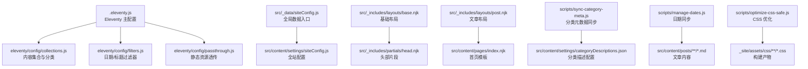
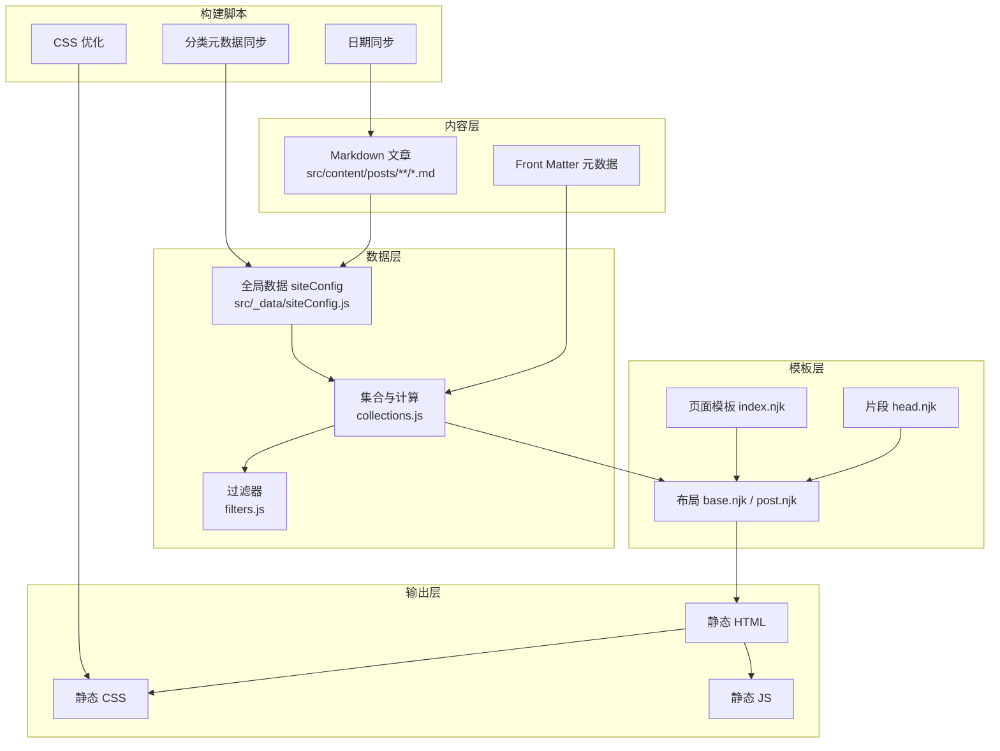
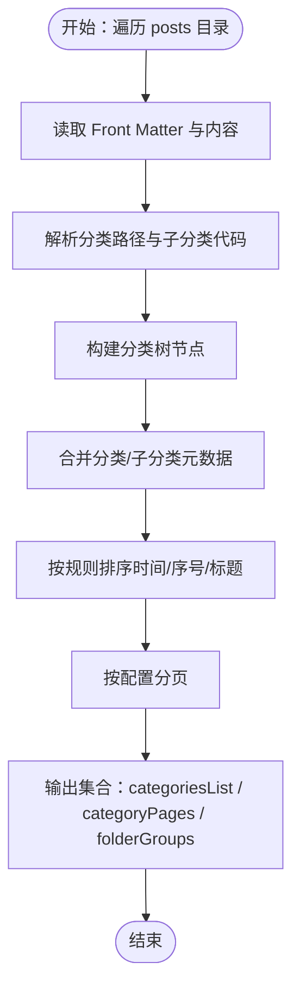
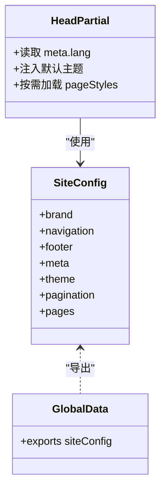
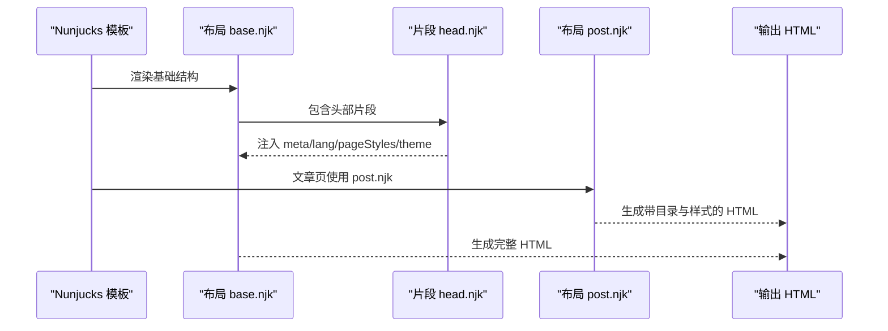
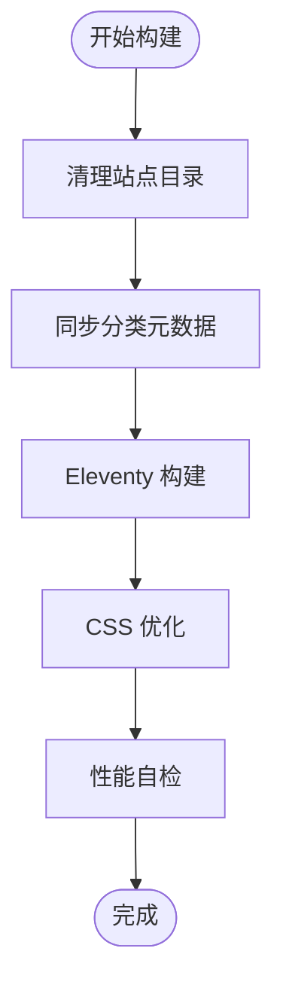
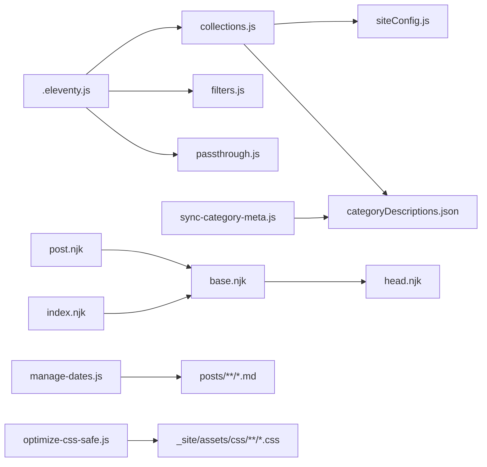

# 整体架构概览

<cite>
**本文引用的文件**
- [.eleventy.js](file://.eleventy.js)
- [package.json](file://package.json)
- [src/_data/siteConfig.js](file://src/_data/siteConfig.js)
- [src/content/settings/siteConfig.js](file://src/content/settings/siteConfig.js)
- [src/_includes/layouts/base.njk](file://src/_includes/layouts/base.njk)
- [src/_includes/layouts/post.njk](file://src/_includes/layouts/post.njk)
- [src/_includes/partials/head.njk](file://src/_includes/partials/head.njk)
- [src/content/pages/index.njk](file://src/content/pages/index.njk)
- [eleventy/config/collections.js](file://eleventy/config/collections.js)
- [eleventy/config/filters.js](file://eleventy/config/filters.js)
- [eleventy/config/passthrough.js](file://eleventy/config/passthrough.js)
- [src/content/settings/categoryDescriptions.json](file://src/content/settings/categoryDescriptions.json)
- [scripts/sync-category-meta.js](file://scripts/sync-category-meta.js)
- [scripts/manage-dates.js](file://scripts/manage-dates.js)
- [scripts/optimize-css-safe.js](file://scripts/optimize-css-safe.js)
- [src/assets/js/main.js](file://src/assets/js/main.js)
</cite>

## 目录
1. [简介](#简介)
2. [项目结构](#项目结构)
3. [核心组件](#核心组件)
4. [架构总览](#架构总览)
5. [详细组件分析](#详细组件分析)
6. [依赖关系分析](#依赖关系分析)
7. [性能考量](#性能考量)
8. [故障排查指南](#故障排查指南)
9. [结论](#结论)
10. [附录](#附录)

## 简介
本项目基于 Eleventy 静态站点生成器，采用“内容驱动”的架构理念，围绕 Markdown 内容、Eleventy 数据与过滤器、Nunjucks 模板与布局、以及最终静态 HTML 输出进行分层设计。通过集中式配置（siteConfig）与可扩展的数据集合（collections）、过滤器（filters）与构建脚本（scripts），实现配置驱动与模块化的站点生成流程。项目强调：
- 内容层：以 Markdown 文件为核心，辅以 Front Matter 提供元数据。
- 数据层：Eleventy 的全局数据与集合，负责内容聚合、分类与排序。
- 模板层：Nunjucks 模板与布局，负责页面结构与样式注入。
- 输出层：静态 HTML/CSS/JS，便于部署与缓存。

## 项目结构
项目采用“功能域+分层”结合的目录组织方式：
- src：站点源代码
  - content：内容层（Markdown、页面、设置）
  - _data：全局数据（如 siteConfig）
  - _includes：模板与布局（layouts、partials）
  - assets：静态资源（CSS、JS）
  - static：无需处理的静态文件（robots.txt 等）
- eleventy/config：Eleventy 配置（集合、过滤器、透传路径）
- scripts：构建与维护脚本（日期同步、分类元数据同步、CSS 优化等）
- 根目录：Eleventy 主配置与包管理

**图表来源**
- [.eleventy.js:36-181](file://.eleventy.js#L36-L181)
- [eleventy/config/collections.js:219-377](file://eleventy/config/collections.js#L219-L377)
- [eleventy/config/filters.js:6-43](file://eleventy/config/filters.js#L6-L43)
- [eleventy/config/passthrough.js:1-7](file://eleventy/config/passthrough.js#L1-L7)
- [src/_data/siteConfig.js:1-2](file://src/_data/siteConfig.js#L1-L2)
- [src/content/settings/siteConfig.js:1-168](file://src/content/settings/siteConfig.js#L1-L168)
- [src/_includes/layouts/base.njk:1-20](file://src/_includes/layouts/base.njk#L1-L20)
- [src/_includes/partials/head.njk:1-27](file://src/_includes/partials/head.njk#L1-L27)
- [src/_includes/layouts/post.njk:1-49](file://src/_includes/layouts/post.njk#L1-L49)
- [src/content/pages/index.njk:1-94](file://src/content/pages/index.njk#L1-L94)
- [scripts/sync-category-meta.js:36-205](file://scripts/sync-category-meta.js#L36-L205)
- [src/content/settings/categoryDescriptions.json:1-60](file://src/content/settings/categoryDescriptions.json#L1-L60)
- [scripts/manage-dates.js:16-85](file://scripts/manage-dates.js#L16-L85)
- [scripts/optimize-css-safe.js:82-112](file://scripts/optimize-css-safe.js#L82-L112)

**章节来源**
- [.eleventy.js:36-181](file://.eleventy.js#L36-L181)
- [package.json:6-16](file://package.json#L6-L16)

## 核心组件
- Eleventy 主配置：注册插件、透传资源、注册集合与过滤器，并定义输入/输出目录。
- 数据层：全局配置 siteConfig、文章集合 posts、分类集合 categories、分类树 categoriesList、分类分页 categoryPages、文件夹分组 folderGroups。
- 模板层：基础布局 base.njk、文章布局 post.njk、头部片段 head.njk；页面模板如首页 index.njk。
- 构建脚本：同步分类元数据、自动补全日期、CSS 安全压缩、性能自检。
- 静态资源：通过 passthrough 将 assets 与 static 直接复制到输出目录。

**章节来源**
- [.eleventy.js:36-181](file://.eleventy.js#L36-L181)
- [eleventy/config/collections.js:219-377](file://eleventy/config/collections.js#L219-L377)
- [eleventy/config/filters.js:6-43](file://eleventy/config/filters.js#L6-L43)
- [eleventy/config/passthrough.js:1-7](file://eleventy/config/passthrough.js#L1-L7)
- [src/_data/siteConfig.js:1-2](file://src/_data/siteConfig.js#L1-L2)
- [src/content/settings/siteConfig.js:1-168](file://src/content/settings/siteConfig.js#L1-L168)
- [src/_includes/layouts/base.njk:1-20](file://src/_includes/layouts/base.njk#L1-L20)
- [src/_includes/layouts/post.njk:1-49](file://src/_includes/layouts/post.njk#L1-L49)
- [src/_includes/partials/head.njk:1-27](file://src/_includes/partials/head.njk#L1-L27)
- [src/content/pages/index.njk:1-94](file://src/content/pages/index.njk#L1-L94)
- [scripts/sync-category-meta.js:36-205](file://scripts/sync-category-meta.js#L36-L205)
- [scripts/manage-dates.js:16-85](file://scripts/manage-dates.js#L16-L85)
- [scripts/optimize-css-safe.js:82-112](file://scripts/optimize-css-safe.js#L82-L112)

## 架构总览
本项目采用“内容驱动 + 配置驱动”的分层架构：
- 内容层：Markdown 文件作为唯一事实来源，Front Matter 提供元数据。
- 数据层：Eleventy 在构建期读取内容与全局数据，生成集合与计算字段（如标题、链接、样式、更新时间等）。
- 模板层：Nunjucks 模板通过布局与片段组合页面结构，注入样式与脚本。
- 输出层：生成静态 HTML/CSS/JS，配合本地存储的主题偏好与 Mermaid 图表渲染。

**图表来源**
- [.eleventy.js:36-181](file://.eleventy.js#L36-L181)
- [eleventy/config/collections.js:219-377](file://eleventy/config/collections.js#L219-L377)
- [eleventy/config/filters.js:6-43](file://eleventy/config/filters.js#L6-L43)
- [src/_data/siteConfig.js:1-2](file://src/_data/siteConfig.js#L1-L2)
- [src/_includes/layouts/base.njk:1-20](file://src/_includes/layouts/base.njk#L1-L20)
- [src/_includes/partials/head.njk:1-27](file://src/_includes/partials/head.njk#L1-L27)
- [src/_includes/layouts/post.njk:1-49](file://src/_includes/layouts/post.njk#L1-L49)
- [src/content/pages/index.njk:1-94](file://src/content/pages/index.njk#L1-L94)
- [scripts/sync-category-meta.js:36-205](file://scripts/sync-category-meta.js#L36-L205)
- [scripts/manage-dates.js:16-85](file://scripts/manage-dates.js#L16-L85)
- [scripts/optimize-css-safe.js:82-112](file://scripts/optimize-css-safe.js#L82-L112)

## 详细组件分析

### 内容层与数据层：文章集合与分类体系
- 文章集合 posts：筛选 src/content/posts 下的 Markdown，按日期倒序。
- 分类集合 categories：按路径层级聚合文章，形成分类树。
- 分类详情集合 categoriesList：构建分类节点，合并子分类元数据。
- 分类分页集合 categoryPages：按分页大小生成分类分页，含面包屑与子分类列表。
- 文件夹分组 folderGroups：按顶层分类与子分类统计数量与描述。
- 计算字段：标题、子分类、布局、永久链接、发布时间、更新时间、标签、页面样式等，均在构建期由 eleventyComputed 注入。

**图表来源**
- [eleventy/config/collections.js:31-217](file://eleventy/config/collections.js#L31-L217)
- [src/content/settings/categoryDescriptions.json:1-60](file://src/content/settings/categoryDescriptions.json#L1-L60)

**章节来源**
- [eleventy/config/collections.js:219-377](file://eleventy/config/collections.js#L219-L377)
- [.eleventy.js:75-157](file://.eleventy.js#L75-L157)

### 配置驱动：siteConfig 与主题/导航/分页
- 全站配置集中于 src/content/settings/siteConfig.js，包含品牌、导航、页脚、SEO 元信息、主题默认值、分页参数与页面文案。
- 全局数据入口 src/_data/siteConfig.js 导出实际配置对象，供模板与集合使用。
- 头部片段 head.njk 读取语言、默认主题与页面样式数组，实现主题切换与按需样式加载。

**图表来源**
- [src/content/settings/siteConfig.js:1-168](file://src/content/settings/siteConfig.js#L1-L168)
- [src/_data/siteConfig.js:1-2](file://src/_data/siteConfig.js#L1-L2)
- [src/_includes/partials/head.njk:1-27](file://src/_includes/partials/head.njk#L1-L27)

**章节来源**
- [src/content/settings/siteConfig.js:1-168](file://src/content/settings/siteConfig.js#L1-L168)
- [src/_data/siteConfig.js:1-2](file://src/_data/siteConfig.js#L1-L2)
- [src/_includes/partials/head.njk:1-27](file://src/_includes/partials/head.njk#L1-L27)

### 模板层：布局与片段
- 基础布局 base.njk：统一 HTML 结构、引入头部片段、页脚与脚本，Mermaid 渲染。
- 文章布局 post.njk：为文章页注入样式数组、显示标题与发布/更新时间、生成文章目录与操作按钮。
- 头部片段 head.njk：注入 SEO 元信息、字体与样式、主题初始化逻辑、按页面样式数组加载 CSS。
- 首页模板 index.njk：使用 siteConfig.pages.home 中的文案与布局，提供搜索区域与入口卡片。

**图表来源**
- [src/_includes/layouts/base.njk:1-20](file://src/_includes/layouts/base.njk#L1-L20)
- [src/_includes/partials/head.njk:1-27](file://src/_includes/partials/head.njk#L1-L27)
- [src/_includes/layouts/post.njk:1-49](file://src/_includes/layouts/post.njk#L1-L49)
- [src/content/pages/index.njk:1-94](file://src/content/pages/index.njk#L1-L94)

**章节来源**
- [src/_includes/layouts/base.njk:1-20](file://src/_includes/layouts/base.njk#L1-L20)
- [src/_includes/layouts/post.njk:1-49](file://src/_includes/layouts/post.njk#L1-L49)
- [src/_includes/partials/head.njk:1-27](file://src/_includes/partials/head.njk#L1-L27)
- [src/content/pages/index.njk:1-94](file://src/content/pages/index.njk#L1-L94)

### 构建脚本：自动化与优化
- 同步分类元数据：扫描 posts 目录，生成/更新 categoryDescriptions.json，确保分类与子分类描述一致。
- 日期同步：根据文件创建/修改时间自动补全或清理 Front Matter 中的 date 与 updated 字段。
- CSS 优化：安全地移除注释与多余空白，减少体积。
- 构建流程：clean -> sync-meta -> eleventy -> optimize-css -> perf-self-check。

**图表来源**
- [scripts/sync-category-meta.js:36-205](file://scripts/sync-category-meta.js#L36-L205)
- [scripts/manage-dates.js:16-85](file://scripts/manage-dates.js#L16-L85)
- [scripts/optimize-css-safe.js:82-112](file://scripts/optimize-css-safe.js#L82-L112)
- [package.json:6-16](file://package.json#L6-L16)

**章节来源**
- [scripts/sync-category-meta.js:36-205](file://scripts/sync-category-meta.js#L36-L205)
- [scripts/manage-dates.js:16-85](file://scripts/manage-dates.js#L16-L85)
- [scripts/optimize-css-safe.js:82-112](file://scripts/optimize-css-safe.js#L82-L112)
- [package.json:6-16](file://package.json#L6-L16)

## 依赖关系分析
- Eleventy 主配置依赖集合与过滤器模块，并注册 Mermaid 插件与语法高亮插件。
- 集合模块依赖全局配置与分类描述 JSON，实现分类树与分页。
- 模板层依赖布局与片段，片段依赖全局配置。
- 构建脚本与内容层存在单向依赖（扫描内容、写回 Front Matter、复制静态资源）。

**图表来源**
- [.eleventy.js:36-181](file://.eleventy.js#L36-L181)
- [eleventy/config/collections.js:219-377](file://eleventy/config/collections.js#L219-L377)
- [eleventy/config/filters.js:6-43](file://eleventy/config/filters.js#L6-L43)
- [eleventy/config/passthrough.js:1-7](file://eleventy/config/passthrough.js#L1-L7)
- [src/_data/siteConfig.js:1-2](file://src/_data/siteConfig.js#L1-L2)
- [src/content/settings/siteConfig.js:1-168](file://src/content/settings/siteConfig.js#L1-L168)
- [src/_includes/layouts/base.njk:1-20](file://src/_includes/layouts/base.njk#L1-L20)
- [src/_includes/partials/head.njk:1-27](file://src/_includes/partials/head.njk#L1-L27)
- [src/_includes/layouts/post.njk:1-49](file://src/_includes/layouts/post.njk#L1-L49)
- [src/content/pages/index.njk:1-94](file://src/content/pages/index.njk#L1-L94)
- [scripts/sync-category-meta.js:36-205](file://scripts/sync-category-meta.js#L36-L205)
- [src/content/settings/categoryDescriptions.json:1-60](file://src/content/settings/categoryDescriptions.json#L1-L60)
- [scripts/manage-dates.js:16-85](file://scripts/manage-dates.js#L16-L85)
- [scripts/optimize-css-safe.js:82-112](file://scripts/optimize-css-safe.js#L82-L112)

**章节来源**
- [.eleventy.js:36-181](file://.eleventy.js#L36-L181)
- [eleventy/config/collections.js:219-377](file://eleventy/config/collections.js#L219-L377)
- [src/_includes/layouts/base.njk:1-20](file://src/_includes/layouts/base.njk#L1-L20)
- [src/_includes/partials/head.njk:1-27](file://src/_includes/partials/head.njk#L1-L27)
- [src/_includes/layouts/post.njk:1-49](file://src/_includes/layouts/post.njk#L1-L49)
- [src/content/pages/index.njk:1-94](file://src/content/pages/index.njk#L1-L94)
- [scripts/sync-category-meta.js:36-205](file://scripts/sync-category-meta.js#L36-L205)
- [scripts/manage-dates.js:16-85](file://scripts/manage-dates.js#L16-L85)
- [scripts/optimize-css-safe.js:82-112](file://scripts/optimize-css-safe.js#L82-L112)

## 性能考量
- 构建期优化：通过 CSS 安全压缩减少体积，提升首屏加载速度。
- 按需样式：页面通过 pageStyles 数组按需加载，避免无关样式。
- 静态资源透传：assets 与 static 目录直接复制，减少运行时处理开销。
- 主题切换：客户端主题偏好保存在 localStorage，避免重复计算。
- 图表渲染：Mermaid 插件按需渲染，不影响页面初始加载。

[本节为通用性能建议，不直接分析具体文件]

## 故障排查指南
- 文章文件名格式错误：构建时会对 posts 目录中的 Markdown 文件进行校验，要求文件名包含“@”符号，否则抛出错误。
- 缺失 slug：构建期会检查每篇文章是否包含 slug，缺失时输出提示。
- 更新时间异常：若文件修改时间与发布日期差距小于 1 分钟，不会写入 updated 字段，避免冗余。
- 分类元数据不一致：使用分类元数据同步脚本，自动发现新增/删除的分类与子分类，并更新 JSON 文件。

**章节来源**
- [.eleventy.js:56-72](file://.eleventy.js#L56-L72)
- [.eleventy.js:23-34](file://.eleventy.js#L23-L34)
- [scripts/manage-dates.js:32-55](file://scripts/manage-dates.js#L32-L55)
- [scripts/sync-category-meta.js:129-137](file://scripts/sync-category-meta.js#L129-L137)

## 结论
本项目以 Eleventy 为核心，通过内容驱动与配置驱动相结合的方式，实现了清晰的分层架构与模块化设计。内容层、数据层、模板层与输出层职责明确，构建脚本保障了内容与配置的一致性与性能。该架构适用于个人网站、演示站与知识库等以内容为主的静态站点，具备良好的可维护性与可扩展性。

[本节为总结性内容，不直接分析具体文件]

## 附录
- 构建命令：开发服务器、构建、清理、同步元数据、更新日期、CSS 优化、性能检查。
- 目录映射：输入 src、输出 _site、包含 _includes、数据 _data。

**章节来源**
- [package.json:6-16](file://package.json#L6-L16)
- [.eleventy.js:172-179](file://.eleventy.js#L172-L179)