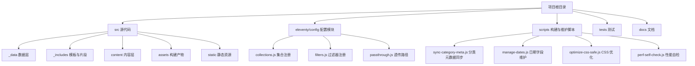
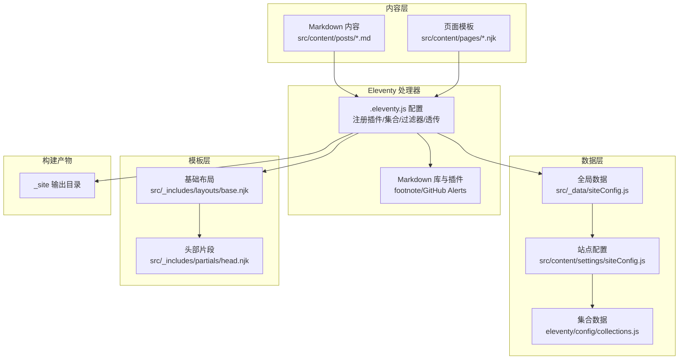
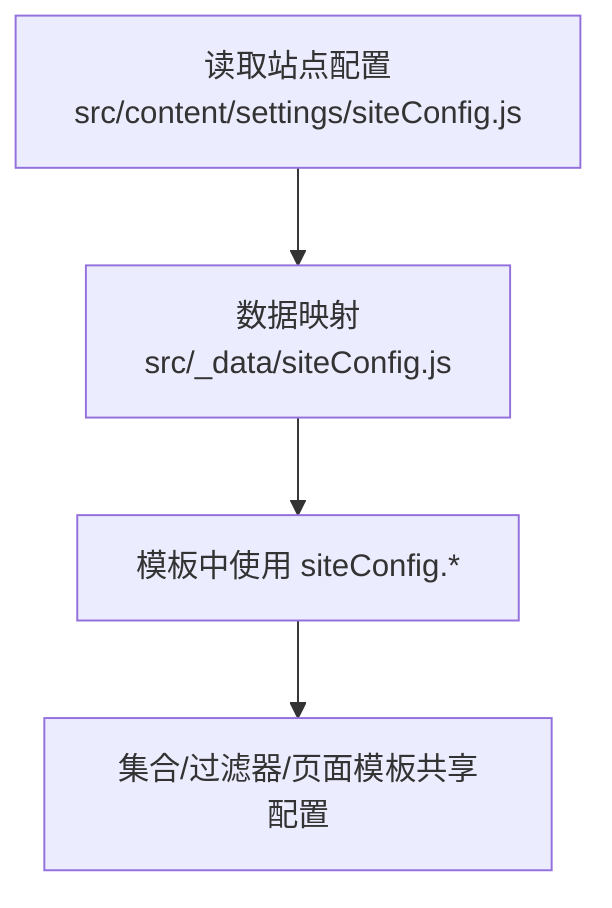
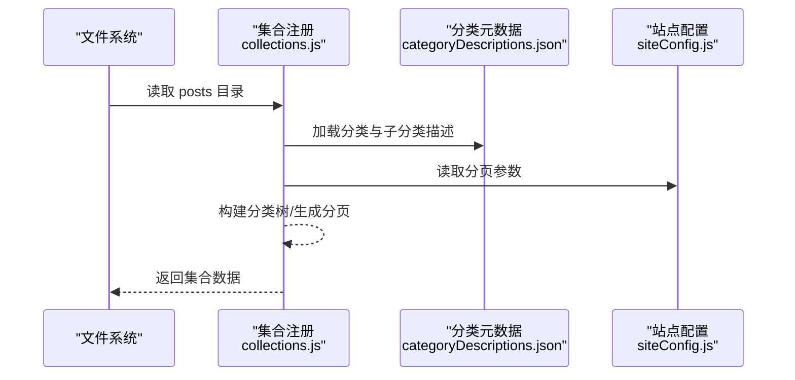
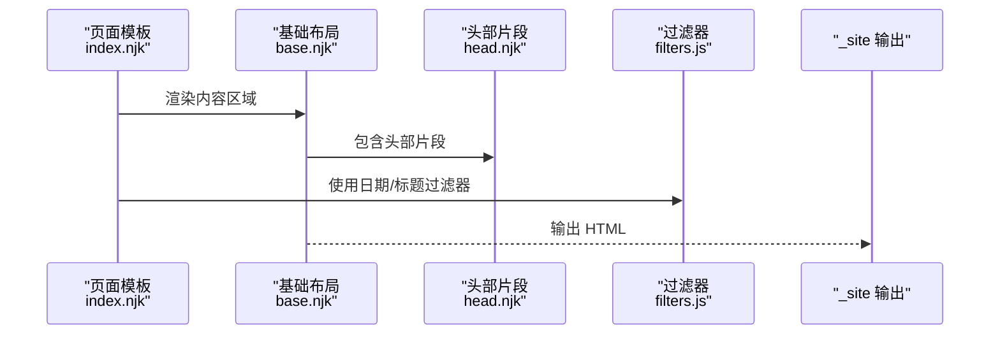
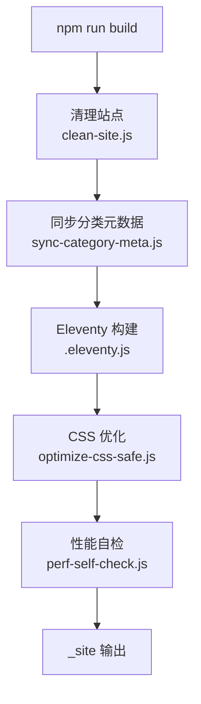
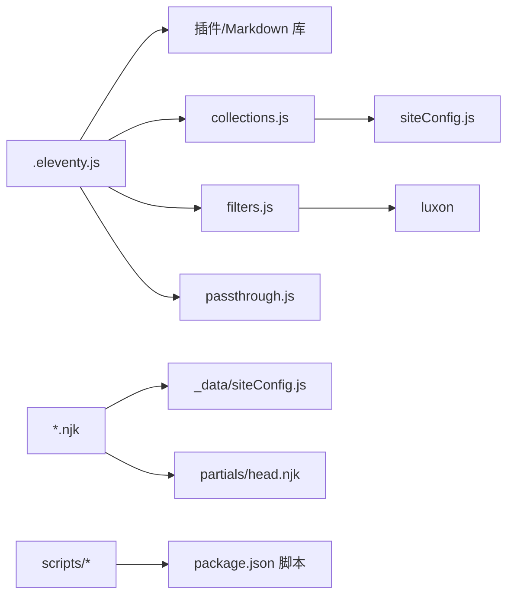

# 架构设计

<cite>
**本文引用的文件**
- [.eleventy.js](file://.eleventy.js)
- [package.json](file://package.json)
- [src/_data/siteConfig.js](file://src/_data/siteConfig.js)
- [src/content/settings/siteConfig.js](file://src/content/settings/siteConfig.js)
- [src/content/posts/posts.json](file://src/content/posts/posts.json)
- [eleventy/config/collections.js](file://eleventy/config/collections.js)
- [eleventy/config/filters.js](file://eleventy/config/filters.js)
- [eleventy/config/passthrough.js](file://eleventy/config/passthrough.js)
- [src/_includes/layouts/base.njk](file://src/_includes/layouts/base.njk)
- [src/_includes/partials/head.njk](file://src/_includes/partials/head.njk)
- [src/content/pages/index.njk](file://src/content/pages/index.njk)
- [scripts/sync-category-meta.js](file://scripts/sync-category-meta.js)
- [scripts/manage-dates.js](file://scripts/manage-dates.js)
- [scripts/perf-self-check.js](file://scripts/perf-self-check.js)
- [scripts/optimize-css-safe.js](file://scripts/optimize-css-safe.js)
- [tests/theme-logic.test.js](file://tests/theme-logic.test.js)
</cite>

## 目录
1. [引言](#引言)
2. [项目结构](#项目结构)
3. [核心组件](#核心组件)
4. [架构总览](#架构总览)
5. [详细组件分析](#详细组件分析)
6. [依赖关系分析](#依赖关系分析)
7. [性能考量](#性能考量)
8. [故障排查指南](#故障排查指南)
9. [结论](#结论)
10. [附录](#附录)

## 引言
本项目采用 Eleventy（11ty）作为静态站点生成器，围绕“内容驱动”的设计理念构建。内容以 Markdown 文件为主，配合 Front Matter 提供元数据；通过 Eleventy 的数据层、集合（Collection）、过滤器（Filter）与模板引擎（Nunjucks），将内容转换为结构化的 HTML 输出。项目通过配置文件集中管理站点行为与文案，实现“配置驱动”的可维护性与可扩展性。

## 项目结构
项目采用“按职责分层”的目录组织方式：
- src：站点源代码，包含数据、模板、内容与静态资源
  - _data：全局数据层，如站点配置映射
  - _includes：模板与片段（layouts、partials）
  - content：内容层，按页面与文章组织
  - assets：构建后的样式与脚本
  - static：无需处理的静态资源（如 robots.txt）
- eleventy/config：Eleventy 配置模块化拆分（集合、过滤器、透传复制）
- scripts：构建与维护脚本（日期同步、分类元数据同步、CSS 优化、性能自检）
- tests：前端主题逻辑的单元测试
- docs：文档目录（本仓库未展开）

图表来源
- [.eleventy.js:172-179](file://.eleventy.js#L172-L179)
- [eleventy/config/passthrough.js:1-7](file://eleventy/config/passthrough.js#L1-L7)

章节来源
- [.eleventy.js:172-179](file://.eleventy.js#L172-L179)
- [eleventy/config/passthrough.js:1-7](file://eleventy/config/passthrough.js#L1-L7)

## 核心组件
- 配置驱动的数据层
  - 站点配置集中于 src/content/settings/siteConfig.js，并通过 src/_data/siteConfig.js 映射到模板可用的 siteConfig 数据。
- 内容与集合
  - 内容位于 src/content/posts 下，采用“文件名@分类”约定；集合通过 eleventy/config/collections.js 注册，负责分类树构建、分页与面包屑等。
- 模板系统
  - 使用 Nunjucks，基础布局与头部片段位于 src/_includes，页面模板位于 src/content/pages。
- 构建系统与脚本
  - package.json 定义构建脚本；scripts 目录提供日期维护、分类元数据同步、CSS 优化与性能自检。
- 插件与增强
  - .eleventy.js 中注册语法高亮、Mermaid 图表、Markdown 扩展与透传复制路径。

章节来源
- [src/_data/siteConfig.js:1-2](file://src/_data/siteConfig.js#L1-L2)
- [src/content/settings/siteConfig.js:1-168](file://src/content/settings/siteConfig.js#L1-L168)
- [eleventy/config/collections.js:219-371](file://eleventy/config/collections.js#L219-L371)
- [src/_includes/layouts/base.njk:1-20](file://src/_includes/layouts/base.njk#L1-L20)
- [src/_includes/partials/head.njk:1-27](file://src/_includes/partials/head.njk#L1-L27)
- [package.json:6-17](file://package.json#L6-L17)
- [.eleventy.js:36-181](file://.eleventy.js#L36-L181)

## 架构总览
下图展示了从内容文件到最终 HTML 的完整链路：内容文件经由 Eleventy 处理器，结合数据层与集合，经过过滤器与模板渲染，最终输出到 _site。

图表来源
- [.eleventy.js:36-181](file://.eleventy.js#L36-L181)
- [src/_data/siteConfig.js:1-2](file://src/_data/siteConfig.js#L1-L2)
- [src/content/settings/siteConfig.js:1-168](file://src/content/settings/siteConfig.js#L1-L168)
- [eleventy/config/collections.js:219-371](file://eleventy/config/collections.js#L219-L371)
- [src/_includes/layouts/base.njk:1-20](file://src/_includes/layouts/base.njk#L1-L20)
- [src/_includes/partials/head.njk:1-27](file://src/_includes/partials/head.njk#L1-L27)

## 详细组件分析

### 配置驱动的站点行为
- 站点配置集中于 src/content/settings/siteConfig.js，涵盖品牌、导航、页脚、元数据、主题、分页与页面文案等。
- 通过 src/_data/siteConfig.js 将配置映射到模板可用的 siteConfig，实现“配置即数据”，便于在模板中统一调用。
- 分页参数在集合中被读取，用于分类页与归档页的分页计算。

图表来源
- [src/content/settings/siteConfig.js:1-168](file://src/content/settings/siteConfig.js#L1-L168)
- [src/_data/siteConfig.js:1-2](file://src/_data/siteConfig.js#L1-L2)

章节来源
- [src/content/settings/siteConfig.js:1-168](file://src/content/settings/siteConfig.js#L1-L168)
- [src/_data/siteConfig.js:1-2](file://src/_data/siteConfig.js#L1-L2)

### 内容到集合的数据流
- 集合注册在 eleventy/config/collections.js 中完成，负责：
  - 解析文章目录结构，提取分类路径与子分类代码
  - 加载分类元数据（categoryDescriptions.json），用于分类与子分类的描述与名称
  - 构建分类树节点、生成分类详情页集合（含分页、面包屑、子分类列表）
  - 生成按文件夹分组的集合，用于侧边导航与概览
- 通过 getPostsFromContentDir 过滤出文章内容，并按日期排序与 Front Matter 字段进行排序与比较。

图表来源
- [eleventy/config/collections.js:31-40](file://eleventy/config/collections.js#L31-L40)
- [eleventy/config/collections.js:123-127](file://eleventy/config/collections.js#L123-L127)
- [eleventy/config/collections.js:219-371](file://eleventy/config/collections.js#L219-L371)

章节来源
- [eleventy/config/collections.js:31-40](file://eleventy/config/collections.js#L31-L40)
- [eleventy/config/collections.js:123-127](file://eleventy/config/collections.js#L123-L127)
- [eleventy/config/collections.js:219-371](file://eleventy/config/collections.js#L219-L371)

### 模板渲染与页面输出
- 基础布局 base.njk 引入头部片段 head.njk，并注入 content 区域与 Mermaid 脚本。
- 页面模板（如首页 index.njk）通过 Front Matter 设置布局、永久链接、body 类与页面样式数组，再在模板中消费 siteConfig 的页面配置。
- 过滤器（日期与标题）在模板中用于格式化显示与 SEO 标题拼接。

图表来源
- [src/content/pages/index.njk:1-94](file://src/content/pages/index.njk#L1-L94)
- [src/_includes/layouts/base.njk:1-20](file://src/_includes/layouts/base.njk#L1-L20)
- [src/_includes/partials/head.njk:1-27](file://src/_includes/partials/head.njk#L1-L27)
- [eleventy/config/filters.js:6-30](file://eleventy/config/filters.js#L6-L30)

章节来源
- [src/content/pages/index.njk:1-94](file://src/content/pages/index.njk#L1-L94)
- [src/_includes/layouts/base.njk:1-20](file://src/_includes/layouts/base.njk#L1-L20)
- [src/_includes/partials/head.njk:1-27](file://src/_includes/partials/head.njk#L1-L27)
- [eleventy/config/filters.js:6-30](file://eleventy/config/filters.js#L6-L30)

### 构建系统与脚本编排
- package.json 定义了构建生命周期：预构建（更新日期）、清理站点、同步分类元数据、执行 Eleventy、CSS 优化与性能自检。
- scripts/manage-dates.js 自动为文章补充创建日期与修改日期，避免冗余。
- scripts/sync-category-meta.js 扫描文章目录，自动同步分类与子分类元数据文件，确保分类页描述与名称一致。
- scripts/optimize-css-safe.js 与 scripts/perf-self-check.js 在构建后进行样式优化与性能检查。

图表来源
- [package.json:6-17](file://package.json#L6-L17)
- [scripts/manage-dates.js:1-85](file://scripts/manage-dates.js#L1-L85)
- [scripts/sync-category-meta.js:1-205](file://scripts/sync-category-meta.js#L1-L205)
- [.eleventy.js:36-181](file://.eleventy.js#L36-L181)

章节来源
- [package.json:6-17](file://package.json#L6-L17)
- [scripts/manage-dates.js:1-85](file://scripts/manage-dates.js#L1-L85)
- [scripts/sync-category-meta.js:1-205](file://scripts/sync-category-meta.js#L1-L205)
- [.eleventy.js:36-181](file://.eleventy.js#L36-L181)

### 关键设计决策与技术选型
- 使用 Eleventy 的“无构建工具链”理念，减少工具复杂度，提升可维护性。
- 通过 Front Matter 与集合实现“内容即配置”，避免硬编码。
- 采用 Nunjucks 模板与片段复用，保证布局一致性与可扩展性。
- 使用 Markdown 插件增强（脚注、GitHub Alerts、Mermaid）提升内容表达力。
- 通过脚本自动化维护日期与分类元数据，降低手工维护成本。

章节来源
- [.eleventy.js:36-181](file://.eleventy.js#L36-L181)
- [eleventy/config/filters.js:1-43](file://eleventy/config/filters.js#L1-L43)
- [eleventy/config/passthrough.js:1-7](file://eleventy/config/passthrough.js#L1-L7)

## 依赖关系分析
- .eleventy.js 作为入口，注册插件、集合、过滤器与透传复制路径，并定义目录结构。
- collections.js 依赖站点配置与分类元数据，生成多类集合。
- filters.js 依赖 luxon 进行日期格式化，并复用集合中的辅助函数。
- 模板依赖数据层与过滤器，head.njk 中的内联脚本负责主题初始化。
- 构建脚本通过 npm scripts 协同工作，形成稳定的构建管线。

图表来源
- [.eleventy.js:36-181](file://.eleventy.js#L36-L181)
- [eleventy/config/collections.js:3-4](file://eleventy/config/collections.js#L3-L4)
- [eleventy/config/filters.js:1](file://eleventy/config/filters.js#L1)
- [eleventy/config/passthrough.js:1-7](file://eleventy/config/passthrough.js#L1-L7)
- [src/_data/siteConfig.js:1-2](file://src/_data/siteConfig.js#L1-L2)
- [src/_includes/partials/head.njk:11-21](file://src/_includes/partials/head.njk#L11-L21)
- [package.json:6-17](file://package.json#L6-L17)

章节来源
- [.eleventy.js:36-181](file://.eleventy.js#L36-L181)
- [eleventy/config/collections.js:3-4](file://eleventy/config/collections.js#L3-L4)
- [eleventy/config/filters.js:1](file://eleventy/config/filters.js#L1)
- [src/_data/siteConfig.js:1-2](file://src/_data/siteConfig.js#L1-L2)
- [src/_includes/partials/head.njk:11-21](file://src/_includes/partials/head.njk#L11-L21)
- [package.json:6-17](file://package.json#L6-L17)

## 性能考量
- 构建后 CSS 优化与性能自检有助于降低首屏加载与运行时开销。
- 按需加载页面级样式（pageStyles），避免全局样式臃肿。
- 分类页与归档页采用分页策略，减少单页内容体积。
- 透传复制静态资源，避免不必要的构建处理。

章节来源
- [package.json:6-17](file://package.json#L6-L17)
- [src/_includes/partials/head.njk:22-26](file://src/_includes/partials/head.njk#L22-L26)
- [eleventy/config/collections.js:219-316](file://eleventy/config/collections.js#L219-L316)
- [eleventy/config/passthrough.js:1-7](file://eleventy/config/passthrough.js#L1-L7)

## 故障排查指南
- 文章文件名格式错误
  - 现象：构建时报错，提示文章文件名必须包含 @ 符号。
  - 排查：检查 src/content/posts 下的 Markdown 文件命名是否符合“标题@分类标识.md”。
  - 参考
    - [.eleventy.js:56-72](file://.eleventy.js#L56-L72)
- 缺失 slug 或占位 slug
  - 现象：文章 permalink 生成异常或指向占位路径。
  - 排查：确认 Front Matter 中的 slug 是否存在且非占位值；若缺失则根据文件名推导。
  - 参考
    - [.eleventy.js:102-111](file://.eleventy.js#L102-L111)
- 更新时间未正确设置
  - 现象：updated 字段缺失或与实际修改时间不符。
  - 排查：运行日期维护脚本，确保 Front Matter 中的 date 与 updated 合理。
  - 参考
    - [scripts/manage-dates.js:16-68](file://scripts/manage-dates.js#L16-L68)
- 分类元数据不一致
  - 现象：分类页缺少描述或子分类名称不正确。
  - 排查：运行分类元数据同步脚本，检查 src/content/settings/categoryDescriptions.json。
  - 参考
    - [scripts/sync-category-meta.js:36-205](file://scripts/sync-category-meta.js#L36-L205)
- 主题切换无效
  - 现象：切换主题后未持久化或初始主题不符合预期。
  - 排查：检查 head.njk 中的主题初始化逻辑与本地存储键值；参考测试用例验证逻辑。
  - 参考
    - [src/_includes/partials/head.njk:11-21](file://src/_includes/partials/head.njk#L11-L21)
    - [tests/theme-logic.test.js:28-97](file://tests/theme-logic.test.js#L28-L97)

章节来源
- [.eleventy.js:56-72](file://.eleventy.js#L56-L72)
- [.eleventy.js:102-111](file://.eleventy.js#L102-L111)
- [scripts/manage-dates.js:16-68](file://scripts/manage-dates.js#L16-L68)
- [scripts/sync-category-meta.js:36-205](file://scripts/sync-category-meta.js#L36-L205)
- [src/_includes/partials/head.njk:11-21](file://src/_includes/partials/head.njk#L11-L21)
- [tests/theme-logic.test.js:28-97](file://tests/theme-logic.test.js#L28-L97)

## 结论
本项目以 Eleventy 为核心，采用“内容驱动 + 配置驱动”的架构模式，通过模块化的集合、过滤器与模板系统，实现了从 Markdown 到 HTML 的高效转换。脚本化维护与构建管线进一步提升了可维护性与可扩展性。建议在后续迭代中持续完善分类元数据与文案配置，保持内容与配置的一致性，并引入更多自动化测试覆盖关键业务场景。

## 附录
- 目录职责速览
  - src/_data：全局数据映射
  - src/_includes：布局与片段
  - src/content：页面与文章内容
  - src/assets：构建产物
  - src/static：无需处理的静态资源
  - eleventy/config：Eleventy 配置模块
  - scripts：构建与维护脚本
  - tests：主题逻辑测试